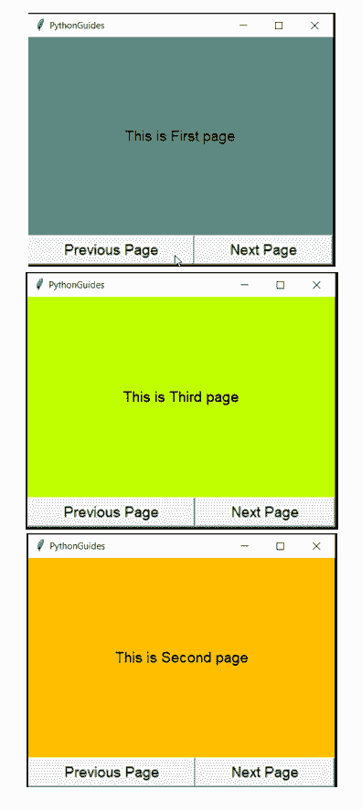

# 如何在 Python Tkinter 程序中转至下一页

> 原文：<https://pythonguides.com/go-to-next-page-in-python-tkinter/>

[](https://sharepointsky.teachable.com/p/python-and-machine-learning-training-course)

多页面应用程序需要一个选项，用户可以在不同的页面之间切换。所以在本教程中，我们将学习**如何在 Python Tkinter** 程序中进入下一页。

当在一个特定的部件上添加了对下一个页面的引用时，用户点击那个部件，然后移动到下一个页面。同时发生的还有一件事，就是前一页被关闭或者销毁。

不熟悉 Python Tkinter？查看 [Python GUI 编程](https://pythonguides.com/python-gui-programming/)

## 在 Python Tkinter 中转至下一页

每**。py** 文件可以被视为一个模块，我们可以在需要时导入它们。另一方面，我们可以使用内置方法**销毁前一页。**让我们在这个小程序中看看实际情况。

**代码片段:**

*   在这段代码中，我们创建了 3 个页面，每个页面都有两个按钮。
*   第一个按钮将导航到下一页&另一个按钮将转到上一页。点击任一页面将触发一个功能，当前页面将被销毁，一个新页面将被**导入**。
*   页面命名为**第一页**、**第二页、**和**第三页**
*   所有的页面都有几乎相似的代码。最需要注意的是导入页面。每个页面都导入不同的页面。

```py
def nextPage():
    ws.destroy()
    import page2
```

*   `nextPage()` :是一个函数名
*   `ws.destroy()` :关闭当前页面
*   **导入第二页**:第二页开始显示。

**第 1 页**

这是创建 `page1.py` 的源代码。创建一个名为 page1.py 的新文件，然后复制并粘贴以下代码。

```py
from tkinter import *

ws = Tk()
ws.geometry('400x300')
ws.title('PythonGuides')
ws['bg']='#5d8a82'

f = ("Times bold", 14)

def nextPage():
    ws.destroy()
    import page2

def prevPage():
    ws.destroy()
    import page3

Label(
    ws,
    text="This is First page",
    padx=20,
    pady=20,
    bg='#5d8a82',
    font=f
).pack(expand=True, fill=BOTH)

Button(
    ws, 
    text="Previous Page", 
    font=f,
    command=nextPage
    ).pack(fill=X, expand=TRUE, side=LEFT)

Button(
    ws, 
    text="Next Page", 
    font=f,
    command=prevPage
    ).pack(fill=X, expand=TRUE, side=LEFT)

ws.mainloop()
```

使用 Tkinter 阅读 Python 中的[注册表](https://pythonguides.com/registration-form-in-python-using-tkinter/)

**第 2 页**

这是创建 `page2.py` 的源代码。创建一个名为 page2.py 的新文件，然后复制并粘贴以下代码。

```py
from tkinter import *

ws = Tk()
ws.geometry('400x300')
ws.title('PythonGuides')
ws['bg']='#ffbf00'

f = ("Times bold", 14)

def nextPage():
    ws.destroy()
    import page3

def prevPage():
    ws.destroy()
    import page1

Label(
    ws,
    text="This is Second page",
    padx=20,
    pady=20,
    bg='#ffbf00',
    font=f
).pack(expand=True, fill=BOTH)

Button(
    ws, 
    text="Previous Page", 
    font=f,
    command=nextPage
    ).pack(fill=X, expand=TRUE, side=LEFT)
Button(
    ws, 
    text="Next Page", 
    font=f,
    command=prevPage
    ).pack(fill=X, expand=TRUE, side=LEFT)

ws.mainloop()
```

**第 3 页**

这是创建 `page3.py` 的源代码。创建一个名为 page3.py 的新文件，然后复制并粘贴下面的代码。

```py
from tkinter import *

ws = Tk()
ws.geometry('400x300')
ws.title('PythonGuides')
ws['bg']='#ffbf00'

f = ("Times bold", 14)

def nextPage():
    ws.destroy()
    import page1

def prevPage():
    ws.destroy()
    import page2

Label(
    ws,
    text="This is Third page",
    font = f,
    padx=20,
    pady=20,
    bg='#bfff00'
).pack(expand=True, fill=BOTH)

Button(
    ws, 
    text="Previous Page", 
    font=f,
    command=nextPage
    ).pack(fill=X, expand=TRUE, side=LEFT)

Button(
    ws, 
    text="Next Page",
    font = f,
    command=prevPage
    ).pack(fill=X, expand=TRUE, side=LEFT)

ws.mainloop()
```

**输出:**

在这个输出中，您可以看到三页。每个页面都有一个标签和两个按钮。这些按钮将用户带到上一页或下一页。



go to next page in Python Tkinter

您可能会喜欢以下教程:

*   [Python Tkinter 帧](https://pythonguides.com/python-tkinter-frame/)
*   [如何用 Python 制作计算器](https://pythonguides.com/make-a-calculator-in-python/)
*   [Python Tkinter 列表框](https://pythonguides.com/python-tkinter-listbox/)
*   [Python Tkinter Stopwatch](https://pythonguides.com/python-tkinter-stopwatch/)
*   [Python Tkinter 进度条](https://pythonguides.com/python-tkinter-progress-bar/)
*   [使用 Python Pygame 创建游戏](https://pythonguides.com/create-a-game-using-python-pygame/)
*   [Python Tkinter 选项菜单](https://pythonguides.com/python-tkinter-optionmenu/)

所以在本教程中，我们已经学习了**如何在 Python Tkinter** 程序中进入下一页。如果你有任何疑问或者你有更好的方法，请写在下面的评论里。

[Bijay Kumar](https://pythonguides.com/author/fewlines4biju/)

Python 是美国最流行的语言之一。我从事 Python 工作已经有很长时间了，我在与 Tkinter、Pandas、NumPy、Turtle、Django、Matplotlib、Tensorflow、Scipy、Scikit-Learn 等各种库合作方面拥有专业知识。我有与美国、加拿大、英国、澳大利亚、新西兰等国家的各种客户合作的经验。查看我的个人资料。

[enjoysharepoint.com/](https://enjoysharepoint.com/)[](https://www.facebook.com/fewlines4biju "Facebook")[](https://www.linkedin.com/in/fewlines4biju/ "Linkedin")[](https://twitter.com/fewlines4biju "Twitter")