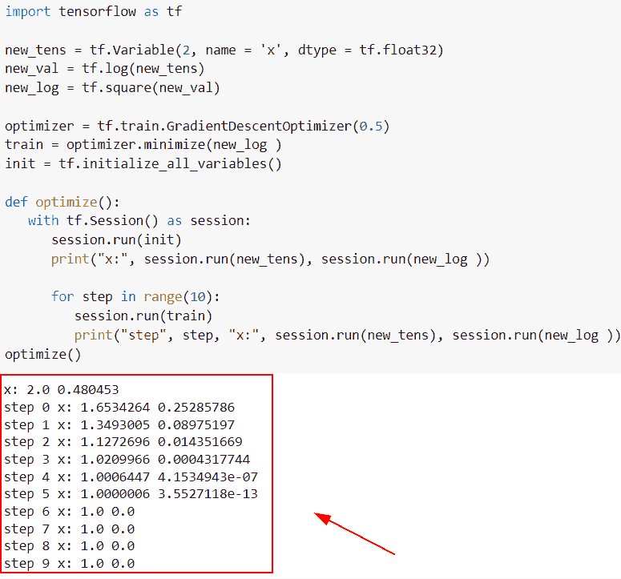

# 梯度下降优化器张量流

> 原文：<https://pythonguides.com/gradient-descent-optimizer-tensorflow/>

[](https://sharepointsky.teachable.com/p/python-and-machine-learning-training-course)

在这个 [Python 教程中，](https://pythonguides.com/learn-python/)我们将学习**如何在 Python TensorFlow** 中使用梯度下降优化器。此外，我们将涵盖以下主题。

*   梯度下降优化器张量流
*   随机梯度下降优化器张量流
*   张量流使用梯度下降优化器
*   TensorFlow 成本最小化的梯度下降优化函数

目录

[](#)

*   [梯度下降优化器张量流](#Gradient_descent_optimizer_TensorFlow "Gradient descent optimizer TensorFlow")
*   [随机梯度下降优化器张量流](#Stochastic_gradient_descent_optimizer_TensorFlow "Stochastic gradient descent optimizer TensorFlow")
*   [TensorFlow 使用梯度下降优化器](#TensorFlow_uses_a_gradient_descent_optimizer "TensorFlow uses a gradient descent optimizer")
*   [TensorFlow 的梯度下降优化函数，成本最小](#TensorFlows_gradient_descent_optimizer_function_with_minimize_cost "TensorFlow’s gradient descent optimizer function with minimize cost")

## 梯度下降优化器张量流

*   在本节中，我们将讨论如何在 [Python TensorFlow](https://pythonguides.com/tensorflow/) 中使用梯度下降优化器。
*   如果我们想要找到模型的输入，使其输出最小化，那么这种技术将帮助用户计算梯度下降优化器。输入是模型的参数，输出是损失函数。
*   为了执行这个特定的任务，我们将使用`TF . compat . v1 . train . gradientdescentoptimizer()`函数，这个函数将执行梯度下降算法。

**语法:**

我们先来看看语法，了解一下`TF . compat . v1 . train . gradientdescentoptimizer()`函数在 Python TensorFlow 中的工作原理。

```py
tf.compat.v1.train.GradientDescentOptimizer(
    learning_rate, use_locking=False, name='GradientDescent'
)
```

*   它由几个参数组成
    *   **learning_rate:** 该参数指定了我们想要使用的学习率，它是一个输入张量。
    *   **use_locking:** 默认情况下，它采用 false 值，如果为 true，那么它使用锁进行更新操作。
    *   **名称:**默认取“**梯度下降**名称，该参数指定操作的名称。

**举例:**

让我们举个例子，检查一下**如何在 Python TensorFlow 中使用梯度下降优化器。**

**源代码:**

```py
import tensorflow as tf
import numpy as np
import matplotlib.pyplot as plt

from pylab import figure, cm

new_val = np.arange(-20,20,0.4)
result = new_val**4

new_img = figure(num=None, figsize=(16, 14), dpi=60, facecolor='w', edgecolor='k')

plt.plot(new_val,result)
plt.title('Gradient TensorFlow descent')
plt.xlabel('new_val')
plt.ylabel('result')
plt.savefig("gradient_descent_tensorflow_01.png", bbox_inches='tight')
plt.show()

def loss_function(new_val): 
    return new_val ** 4.0

def loss_function_minimzie():
    return new_val ** 4.0

def reset():
    new_val = tf.Variable(20.0) 
    return new_val

new_val = reset()
new_out = tf.keras.optimizers.SGD(learning_rate=0.1)
for i in range(20):
    print ('y = {:.1f}, x = {:.1f}'.format(loss_function(new_val).numpy(), new_val.numpy()))
    new_out.minimize(loss_function_minimzie, var_list=[new_val])
```

下面是下面给出的代码的截图。


Figure show gradient descent`


Gradient descent optimizer TensorFlow

阅读:[张量流乘法-有用指南](https://pythonguides.com/tensorflow-multiplication/)

## 随机梯度下降优化器张量流

*   在本节中，我们将讨论如何在 Python TensorFlow 中使用随机梯度下降优化器。
*   为了执行这个特定的任务，我们将使用`TF . keras . optimizer . SGD()`算法，并且这个函数被用来寻找主导神经网络的模型参数。

**语法:**

下面是 Python TensorFlow 中`TF . keras . optimizer . SGD()`函数的语法。

```py
tf.keras.optimizers.SGD(
    learning_rate=0.01,
    momentum=0.0,
    nesterov=False,
    name='SGD',
    **kwargs
)
```

*   它由几个参数组成。
    *   **learning_rate:** 该参数表示输入张量，它不接受任何参数，并返回要使用的真实值，默认情况下，它接受 0.01 的值。
    *   **momentum:** 默认情况下，它取 0.0 值，并指定

**举例:**

```py
import tensorflow as tf

opt = tf.keras.optimizers.SGD(learning_rate=4.0)
new_val = tf.Variable(6.0)
result = lambda: (new_val ** 6)/2.0         
new_count = opt.minimize(result, [new_val]).numpy()

new_val.numpy() 
```

在下面给定的代码中，我们已经导入了 TensorFlow 库，然后使用了`TF . keras . optimizer s . SGD()`函数，在这个函数中，我们指定了学习率=4.0。

之后，我们创建了一个张量并分配了张量值，并优化了给定值。一旦执行了这段代码，输出将显示一个梯度下降值。

下面是以下给定代码的执行。


stochastic gradient descent optimizer TensorFlow

阅读:[张量流均方误差](https://pythonguides.com/tensorflow-mean-squared-error/)

## TensorFlow 使用梯度下降优化器

*   在本期节目中，我们将讨论如何在 [Python TensorFlow](https://pythonguides.com/tensorflow/) 中使用梯度下降优化器。
*   为了执行这个特定的任务，我们将使用 `tf.variable()` 函数通过使用 `tf.variable()` 函数来创建一个张量。
*   然后使用`TF . train . gradienddescentoptimizer()`函数优化梯度下降值。

**语法:**

下面是 Python TensorFlow 中`TF . train . gradient optimizer()`函数的语法。

```py
tf.compat.v1.train.GradientDescentOptimizer(
    learning_rate, use_locking=False, name='GradientDescent'
)
```

**举例:**

让我们举个例子，看看**如何在 Python TensorFlow 中使用梯度下降优化器。**

**源代码:**

```py
import tensorflow as tf

new_tens = tf.Variable(2, name = 'x', dtype = tf.float32)
new_val = tf.log(new_tens)
new_log = tf.square(new_val)

optimizer = tf.train.GradientDescentOptimizer(0.5)
train = optimizer.minimize(new_log )
init = tf.initialize_all_variables()

def optimize():
   with tf.Session() as session:
      session.run(init)
      print("x:", session.run(new_tens), session.run(new_log ))

      for step in range(10):
         session.run(train)
         print("step", step, "x:", session.run(new_tens), session.run(new_log ))
optimize()
```

在下面给定的代码中，我们定义了 optimize()函数，然后使用 `tf.session()` 函数创建会话，并初始化它的日志值。

> **注意:**这个例子只适用于 TensorFlow 1.x 版本，因为 tf.session()函数只适用于 1.x 版本

你可以参考下面的截图。



TensorFlow uses a gradient descent optimizer

阅读:[模块“tensorflow”没有属性“mul”](https://pythonguides.com/module-tensorflow-has-no-attribute-mul/)

## TensorFlow 的梯度下降优化函数，成本最小

*   在本节中，我们将讨论如何最小化 Python TensorFlow 中梯度下降优化器函数的成本。
*   为了完成这项任务，我们将使用`TF . compat . v1 . train . gradienddescentoptimizer()`函数来获取最小值。
*   接下来，我们将导入`TF . compat . v1 . disable _ eager _ execution()`来创建会话，同时我们将使用`TF . compat . v1 . set _ random _ seed()`函数来生成随机值。

**举例:**

```py
import tensorflow as tf
tf.compat.v1.disable_eager_execution()
tf.compat.v1.set_random_seed(777) 

tens1 = [4, 5, 6]
tens2 = [4, 5, 6]

tens3 = tf.Variable(5.)

new_hypto = tens1 * tens3

gradient = tf.reduce_mean((tens3 * tens1 - tens2) * tens1) * 2

cost = tf.reduce_mean(tf.square(new_hypto - tens2))

new_opt = tf.compat.v1.train.GradientDescentOptimizer(learning_rate=0.01)
train = new_opt.minimize(cost)

new_result = new_opt.compute_gradients(cost, [tens3])

apply_gradients = new_opt.apply_gradients(new_result)
with tf.compat.v1.Session() as val:

    val.run(tf.compat.v1.global_variables_initializer())
    print(step, val.run([gradient, tens3, new_result]))
```

在下面给出的代码中，我们使用了 `tf.reduce_mean()` 函数，并将 new_hypto 值指定为参数，然后使用 `new_opt.minimize()` 参数来最小化成本值。

下面是下面给出的代码的截图。


TensorFlow’s gradient descent optimizer function with minimize cost

还有，多看看一些 TensorFlow 教程。

*   [Python TensorFlow 截断法线](https://pythonguides.com/tensorflow-truncated-normal/)
*   [Python tensor flow expand _ dims](https://pythonguides.com/tensorflow-expand_dims/)
*   [熊猫数据帧到张量流数据集](https://pythonguides.com/convert-pandas-dataframe-to-tensorflow-dataset/)
*   [张量流自定义损失函数](https://pythonguides.com/tensorflow-custom-loss-function/)
*   [tensor flow next _ batch+Examples](https://pythonguides.com/tensorflow-next_batch/)
*   [张量流交叉熵损失](https://pythonguides.com/tensorflow-cross-entropy-loss/)
*   [Python TensorFlow 随机均匀](https://pythonguides.com/tensorflow-random-uniform/)
*   [Python tensor flow reduce _ sum](https://pythonguides.com/python-tensorflow-reduce_sum/)

因此，在本教程中，我们已经学习了如何在 Python TensorFlow 中使用梯度下降优化器。此外，我们还讨论了以下主题。

*   梯度下降优化器张量流
*   随机梯度下降优化器张量流
*   张量流使用梯度下降优化器
*   TensorFlow 成本最小化的梯度下降优化函数

[Bijay Kumar](https://pythonguides.com/author/fewlines4biju/)

Python 是美国最流行的语言之一。我从事 Python 工作已经有很长时间了，我在与 Tkinter、Pandas、NumPy、Turtle、Django、Matplotlib、Tensorflow、Scipy、Scikit-Learn 等各种库合作方面拥有专业知识。我有与美国、加拿大、英国、澳大利亚、新西兰等国家的各种客户合作的经验。查看我的个人资料。

[enjoysharepoint.com/](https://enjoysharepoint.com/)[](https://www.facebook.com/fewlines4biju "Facebook")[](https://www.linkedin.com/in/fewlines4biju/ "Linkedin")[](https://twitter.com/fewlines4biju "Twitter")