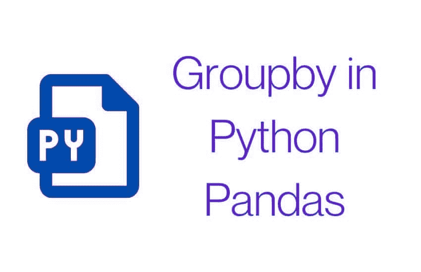

# Python 熊猫中的 Groupby

> 原文：<https://pythonguides.com/groupby-in-python-pandas/>

[](https://sharepointsky.teachable.com/p/python-and-machine-learning-training-course)

在本 [python 教程](https://pythonguides.com/learn-python/)中，我们将学习 python 熊猫中关于 **Groupby 的一切。**

*   Python 熊猫中的 Groupby 介绍
*   Python 熊猫中的 Groupby
*   按熊猫分组示例
*   熊猫计数分组
*   分组依据熊猫多列
*   按熊猫总数分组
*   无聚集的熊猫群
*   熊猫总和
*   熊猫两列
*   分组依据熊猫排序
*   熊猫团体申请
*   熊猫 agg
*   熊猫的意思是
*   Python 迭代熊猫群

如果你是 Python 熊猫的新手，请查看 Python 中的[熊猫。](https://pythonguides.com/pandas-in-python/)

我们将使用从这个 URL 下载的食物数据集。

目录

[](#)

*   [Python 中的熊猫群简介](#Groupby_Pandas_in_Python_Introduction "Groupby Pandas in Python Introduction")
*   [按熊猫分组数据帧](#Groupby_Pandas_DataFrame "Groupby Pandas DataFrame")
*   [熊猫分组示例](#Groupby_Pandas_Example "Groupby Pandas Example")
*   [按熊猫数量分组](#Groupby_Pandas_Count "Groupby Pandas Count")
*   [Groupby 熊猫多栏目](#Groupby_Pandas_Multiple_Columns "Groupby Pandas Multiple Columns")
*   [一群熊猫聚集在一起](#Groupby_Pandas_Aggregate "Groupby Pandas Aggregate")
*   [无聚集的熊猫群](#Groupby_Pandas_Without_Aggregation "Groupby Pandas Without Aggregation")
*   [分组通过熊猫求和](#Groupby_Pandas_Sum "Groupby Pandas Sum")
*   [组靠熊猫两列](#Groupby_Pandas_Two_Columns "Groupby Pandas Two Columns")
*   [分组按熊猫排序](#Groupby_Pandas_Sort "Groupby Pandas Sort")
*   [小组通过熊猫申请](#Groupby_Pandas_Apply "Groupby Pandas Apply")
*   熊猫 agg
*   熊猫的意思是
*   [Python 迭代熊猫群](#Python_Iterate_Groupby_Pandas "Python Iterate Groupby Pandas")

## Python 中的熊猫群简介

*   groupby 操作涉及拆分对象、应用函数和组合结果的某种组合。这可用于对大量数据进行分组，并对这些组进行计算操作。
*   假设你想知道所有国家的开发者平均工资。在这种情况下，groupby 可用于显示各个国家的平均工资。
*   Python 熊猫中的 **Groupby 类似于 SQL 中的 `Group by` 。**



Groupby in Python Pandas

**语法:**

```py
dataframe.groupby(
              by=None, 
              axis=0, 
              level=None, 
              as_index=True, 
              sort=True, 
              group_keys=True, 
              squeeze=<object object>, 
              observed=False, 
              dropna=True    
)
```

**参数:**

| **由** | –映射、功能、标签或标签列表
–用于确定 groupby 的组。
–如果 **`by`** 是一个函数，它在对象的
索引的每个值上被调用。
–如果``by``是字典或系列，系列或字典值将用于确定组。
–默认情况下``by=None`` |
| **轴** | –{ 0 或' index '，1 或' columns'}，默认为 0
–按行(0)或列(1)拆分。
–例如:轴=0 或轴=1 |
| **级别** | –int、级别名称或类似的序列，默认为 None。
–如果轴是多索引(层次)，则按特定级别分组。 |
| `as_index` | –bool，默认 True
–对于聚合输出，返回一个以组标签为索引的对象。
–仅与数据帧输入相关。
–``as_index=False`` 是有效的“SQL 式”分组输出。 |
| **排序** | –bool，默认为真
–对组键进行排序。
–关闭此选项可获得更好的性能。请注意，这不会影响每组内的观察顺序。
–group by 保留每个组中行的顺序。
–例如: **`sort=False`** |
| **组 _ 键** | –bool，default True
–调用 apply 时，将组键添加到索引中以标识片段。
——例如: **`group_keys = False`** |
| **挤压** | –bool，default False
–如果可能，减少返回类型的维数，否则返回一致的类型。
——例如: **`squeeze=True`** |
| **观察到的** | –bool，default False
–这仅适用于任何 groupers 是类别的情况。
–如果为真:仅显示分类群组的观察值。
–如果为假:显示分类分组的所有值。
–例如: **`observed=True`** |
| `dropna` | –bool，默认为真
–如果为真，并且如果组键包含 NA 值，NA 值连同行/列将被删除。
–如果为假，NA 值也将被视为分组中的键
–例如: **`dropna=True`** |

你可能也会喜欢 [Python 熊猫 CSV 教程](https://pythonguides.com/python-pandas-csv/)。

## 按熊猫分组数据帧

*   在本节中，我们将学习在 DataFrame 上创建和实现 `Python pandas groupby` 。
*   groupby 操作包括一些组合:分割对象的**、**应用函数的**和组合结果的**。****
*   这可用于对大量数据进行分组，并对这些组进行计算操作。

**语法:**

下面是在 Python 的 dataframe 上用 Pandas 实现 groupby 的语法。这个博客的介绍部分解释了这些参数。

```py
DataFrame.groupby(
    by=None, 
    axis=0, 
    level=None, 
    as_index=True, 
    sort=True, 
    group_keys=True, 
    squeeze=<object object>, 
    observed=False, 
    dropna=True
) 
```

**在 jupyter 笔记本上实现:**