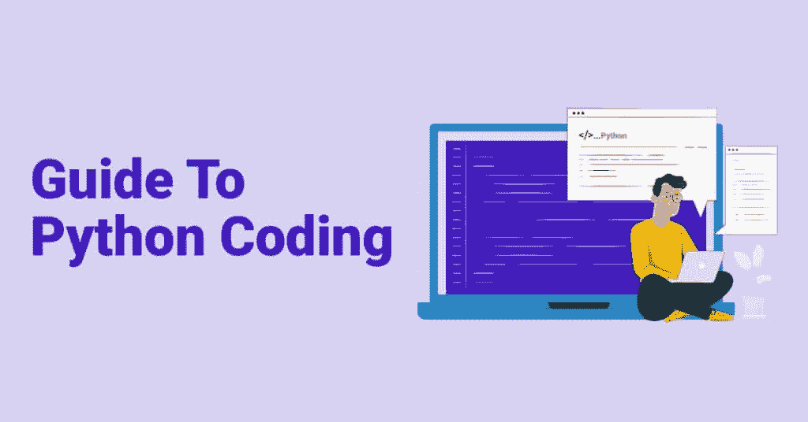
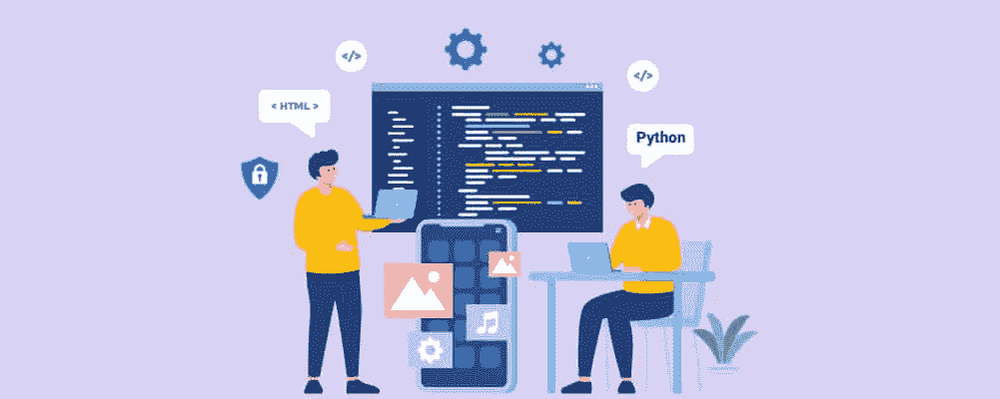
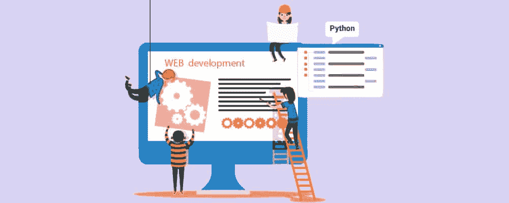
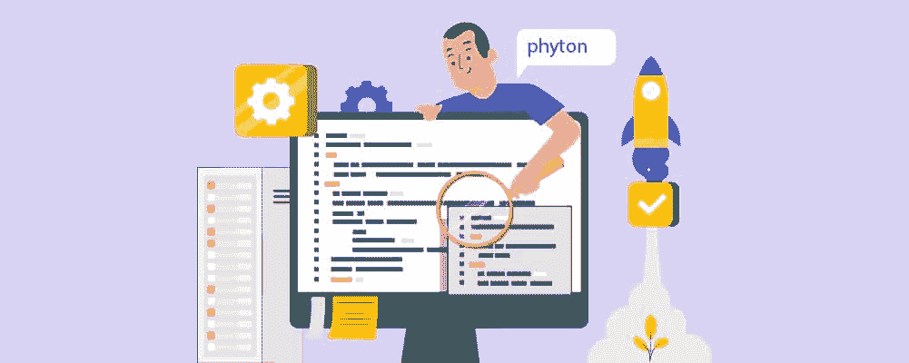

# Python 编码指南

> 原文：<https://pythonguides.com/guide-to-python-coding/>

很少有编程语言像 Python 一样受到青睐和推崇。Python 是一种非常流行的编程语言，由著名的荷兰程序员吉多·范·罗苏姆创建，最初发布于 1991 年。

coding with python

近年来，由于其易于使用的语法和对初学者友好的操作，Python 已经成为世界上最伟大和使用最广泛的通用编程语言之一。

此外，它比其他可用的编程语言快得多。

Python 不仅是一种非常容易理解的语言，在非开发人员和[开发人员](https://pythonguides.com/python-and-machine-learning-training-course/)中都很受欢迎，而且你通常可以在各种过程中找到这种类型的编程，例如软件测试、系统脚本编写或构建网站。

但是在开始使用这种编码语言之前，您需要知道哪些重要的事情呢？它真的适合初学者吗？

无论您是编程新手，还是只是想了解更多关于如何开始使用 Python 的信息，本指南都将为您提供您可能需要的所有基本工具和知识！

让我们直接开始吧。

目录

*   [Python 编码](#Python_Coding "Python Coding")
*   [Python 是](#Python_Is "Python Is")
*   [Python 在不同平台上工作](#Python_Works_On_Different_Platforms "Python Works On Different Platforms")
    *   [允许开发者编写比其他语言更短的程序](#Allows_Developers_To_Write_Short_Programs_Than_Other_Languages "Allows Developers To Write Short Programs Than Other Languages")
    *   [可以作为一种功能性的、面向对象的、过程化的方式](#Can_Be_Used_As_A_Functional_Object-Oriented_And_Procedural_Way "Can Be Used As A Functional, Object-Oriented, And Procedural Way")
*   [Python 语言类似于英语](#Python_Language_Is_Similar_To_English "Python Language Is Similar To English")
*   [基础知识](#The_Basics "The Basics")
    *   [基础知识](#Fundamentals "Fundamentals")
        *   [语法](#Syntax "Syntax")
        *   [变量](#Variables "Variables")
        *   [琴弦](#Strings "Strings")
        *   [数字](#Numbers "Numbers")
        *   [布尔型](#Booleans "Booleans")
        *   [常数](#Constants "Constants")
        *   [评论](#Comments "Comments")
        *   [类型对话](#Type_Conversation "Type Conversation")
    *   [操作](#Operations "Operations")
        *   [比较运算符](#Comparison_Operators "Comparison Operators")
        *   [逻辑运算符](#Logical_Operators "Logical Operators")
    *   [控制流程](#Control_Flow "Control Flow")
        *   [If… Else 语句](#If%E2%80%A6_Else_Statements "If… Else Statements")
        *   [三元运算符](#Ternary_Operators "Ternary Operators")
        *   [对于范围为()的循环](#For_Loop_With_Range "For Loop With Range ()")
        *   [而](#While "While")
        *   [突破](#Break "Break")
        *   [继续](#Continue "Continue")
        *   [通过](#Pass "Pass")
    *   [功能](#Functions "Functions")
        *   [Python 函数](#Python_Functions "Python Functions")
        *   [关键字参数](#Keyword_Arguments "Keyword Arguments")
        *   [默认参数](#Default_Parameters "Default Parameters")
        *   [递归函数](#Recursive_Functions "Recursive Functions")
        *   [λ表达式](#Lambda_Expressions "Lambda Expressions")
        *   [文档字符串](#Docstrings "Docstrings")
    *   [列表](#Lists "Lists")
        *   [列表](#List "List")
        *   [元组](#Tuple "Tuple")
        *   [在列表位置排序](#Sort_In_A_List_Place "Sort In A List Place")
        *   [排序列表](#Sort_A_List "Sort A List")
        *   [切片列表](#Slice_A_List "Slice A List")
        *   [解包列表](#Unpack_A_List "Unpack A List")
        *   [遍历一个列表](#Iterate_Over_A_List "Iterate Over A List")
        *   [元素的索引](#Index_Of_An_Element "Index Of An Element")
        *   [可重复项](#Iterables "Iterables")
        *   [用 Map()变换列表元素](#Transform_List_Elements_With_Map "Transform List Elements With Map ()")
        *   [用 Filter()过滤列表元素](#Filter_List_Elements_With_Filter "Filter List Elements With Filter ()")
        *   [使用 Reduce ()](#Reduce_List_Elements_Into_A_Value_With_Reduce "Reduce List Elements Into A Value With Reduce ()") 将列表元素缩减为一个值
        *   [列出理解](#List_Comprehensions "List Comprehensions")
    *   [字典](#Dictionaries "Dictionaries")
        *   [字典](#Dictionary "Dictionary")
        *   [词典释义](#Dictionary_Comprehensions "Dictionary Comprehensions")
    *   [设置](#Sets "Sets")
        *   [设置](#Set "Set")
        *   [设定理解](#Set_Comprehension "Set Comprehension")
        *   [集合的并](#Union_Of_Sets "Union Of Sets")
        *   [集合的交集](#Intersection_Of_Sets "Intersection Of Sets")
        *   [组差](#Difference_Of_Sets "Difference Of Sets")
        *   [集合的对称差](#Symmetric_Difference_Of_Sets "Symmetric Difference Of Sets")
        *   [子集](#Subset "Subset")
        *   [超集](#Superset "Superset")
        *   [不相交的集合](#Disjoint_Sets "Disjoint Sets")
    *   [异常处理](#Exception_Handling "Exception Handling")
        *   [尝试…除了](#Try%E2%80%A6except "Try…except")
        *   [尝试…除了…最后](#Try%E2%80%A6except%E2%80%A6_Finally "Try…except… Finally")
        *   [尝试…除了…否则](#Try%E2%80%A6except%E2%80%A6else "Try…except…else")
*   [Python 使用](#Python_Uses "Python Uses")
    *   [系统脚本](#System_Scripting "System Scripting")
    *   [数据分析](#Data_Analysis "Data Analysis")
    *   [网页开发](#Web_Development "Web Development")
    *   [机器学习](#Machine_Learning "Machine Learning")
    *   [数学](#Mathematics "Mathematics")
    *   [软件开发](#Software_Development "Software Development")
    *   [创建工作流程](#Create_Workflows "Create Workflows")
*   [总结](#Summary "Summary")

## **Python 编码**

Python Coding

Python 编码是一种通用语言，可用于创建各种程序，而不是专门针对单一问题。

它的[初学者友好的应用](https://www.python.org/about/gettingstarted/)和这种多功能性使 Python 成为当今世界上最突出和最广泛使用的编程语言之一。

## **巨蟒是**

Python Is

**解释:** Python 编码可以在运行时执行，任何程序更改都很容易被发现。用技术术语来说，Python 编码有一个编译器，可以将一种编程语言编写的代码翻译成另一种语言。

与 Java 或 C++相比，这两种软件之间的差异非常明显。例如， [Python 编码](https://pythonguides.com/python-naming-conventions/)远比这些其他类型的软件透明和自动化。

然而，使用 Python，不需要担心编译步骤，因为这是实时发生的。

不幸的是，解释语言通常比编译语言慢得多，因为它们每次只输入一行指令或代码。

**语义动态:** Python 使用动态语义，这意味着它的变量是动态对象。这些是存在于运行时级别的值的实例，在代码中被设置为构造。

**面向对象:**Python 编码中的一切都是对象。这意味着您有办法构建程序来保证属性和行为被捆绑到不同的对象中。

然而，您可以选择以过程化的、面向对象的或函数式的方式编写代码。我们将在下面详细讨论这一点。

Python 是一种高级编程语言，因为它与英语非常相似。这意味着 Python 不需要你掌握处理任何底层机器细节的知识。

## **Python 在不同平台上工作**

Python Works On Different Platforms

Python 最伟大的一点是它是一种跨平台的语言。它足够灵活，可以跨各种系统工作，这加快了构建应用程序的过程，同时也使它更加方便。

这意味着任何在苹果电脑上编写的程序也可以在 Linux 系统上运行，反之亦然。如果计算机安装了正确的 Python 解释器，Python 程序也可以在 Windows 计算机上运行。

其他操作系统如 Raspberry Pi 也为编写 Python 代码提供了不同的选项。但是选择什么平台或者操作平台，大多是[个人喜好](https://towardsdatascience.com/everything-you-need-to-get-started-with-python-programming-4a37a46e427b)的问题。

### **允许开发者编写比其他语言更短的程序**

Python 有一种语法，使开发人员能够用比其他编程语言少得多的代码行编写程序。“语法”一词用于描述一组规则，这些规则积极地定义了 Python 将如何被编写和解释。

由于 Python 运行在解释器系统上，它允许代码一写出来就被快速执行，这意味着原型制作通常会非常快。

将一个想法或概念转化为任何类型的短软件原型的代码可以在几天或几周内完成，而不是几个月。

### **可以作为功能性的、面向对象的、程序性的方式**

尽管普遍认为 Python 是一种面向对象的编程语言，而不是过程化编程，但事实并非如此。Python 编码可以支持面向对象和过程化编程。

然而，以函数式风格编写 Python 是很重要的——尤其是当你试图编写需要大量数学计算的程序时。

## **Python 语言类似于英语**

Python Language Is Similar To English

Python 是一种高级语言，它几乎被设计成程序员必须学习的第二语言。由于其语法，这种编码语言非常类似于英语，这意味着它对人类来说有很大的可读性，但对计算机来说可读性差得多。

相对容易学，学习曲线低。如果程序员愿意付出努力和奉献来发展他们对 Python 语言的理解，理论上这应该不会太难。

## **基础知识**

Python Basics

### **基本面**

#### **语法**

正如我们已经建立的，语法指的是编程语言的结构。这些是用于定义人类读者和计算机如何编写和解释 Python 程序的既定规则。

就像我们必须学习语法才能理解英语一样，你也必须学习 Python 语言。一旦掌握了 Python 优雅的语法结构，python 编码和编程应该是一种易读的语言。

理解什么是语法以及它做什么仍然是程序员用任何编程语言编码时必须知道的最简单的要求之一。

#### **变量**

当你开发一个程序时，你要负责管理许多不同的价值。为了有效地存储所有值，必须使用变量。

Python 支持各种类型的变量，包括浮点数、文本和整数。只要你能给它赋值，任何东西都可以被标记为变量。

#### **琴弦**

不，这些不像吉他上的弦。相反，字符串是一系列字符。在 Python 中，单引号或双引号内的任何内容都被视为字符串。

需要注意的一点是，字符串是不可变的，这意味着它们不能被改变。您可以使用索引来访问字符串元素，第一个字符的索引为零。

#### **数字**

Python numbers 向您介绍了浮点数、复数和整数等数字类型。这些也是不可变的，这意味着如果你改变了数据的值，那么你最终会得到一个完全新的对象。

这些数字对象是在被赋值后创建的。

#### **布尔**

在任何编程中，你都需要经常检查一个条件是否为真，然后采取最合适的行动。为了表示不同类型数据的真实值，Python 为您提供了[布尔值](https://pythonguides.com/python-booleans/)。

当您比较两个数字或两个字符串时，Python 将以布尔值的形式返回结果。

#### **常数**

顾名思义，这些是常量变量，它们的值不能改变。将这些视为保存大量不可更改信息的容器可能会有所帮助。

Python 中很少使用常量，因为没有等价的常量。程序员通常很有见识，不会去管他们想保持不变的值。

#### **评论**

您还需要学习如何在代码中做笔记，以跟踪您所在的位置，或者简单地记录您正在编写的代码类型。

一旦掌握了 Python 编码语言的一般规则，添加注释(包括行内注释、块注释，甚至文档字符串)将成为你的第二天性。

#### **式对话**

类型转换是对象从一种数据类型到另一种数据类型的直接转换，这在竞争和日常编程中很有用。

Python 中有两种类型的类型转换:隐式类型转换，在没有用户参与的情况下转换数据类型；显式类型转换，需要手动输入来转换数据类型。

### **作战**

Python Operations

#### **比较运算符**

这些运算符将向您介绍[比较运算符](https://pythonguides.com/python-comparison-operators/)，以及如何使用它们来比较两个不同的值。从本质上讲，它们就像名字所暗示的那样:比较。

然而，它们也被称为关系运算符，因为它们可以用来查找操作数之间的关系，然后生成一个布尔值。

有六种比较运算符:

*   小于(
*   小于或等于(< =)
*   大于(>)
*   大于或等于(> =)
*   等于(==)
*   不等于(！=)

#### **逻辑运算符**

如果您希望在任何给定的时间检查多个条件，您必须使用逻辑运算符。Python 编码中有三个逻辑运算符:

*   **And 运算符**–同时检查两个条件是否为真。
*   **Or 运算符**–检查多个条件，但当其中一个或两个条件都为真时，返回“真”。
*   **Not 运算符**–这只适用于一个条件，然后将其反转。例如，如果条件为真，该运算符将返回 false。

### **控制流量**

#### **If… Else 语句**

“if-else”语句通常用于执行条件的真和假部分。如果条件被认为是真的，则执行块代码。

如果条件为假，将执行 else 块代码(这将是不同的代码块)。

#### **三元运算符**

三元运算符是在 Python 编程中编写条件语句的一种很好的方式，允许您控制程序的流程。

它可以被认为是一个简单的单行版本的“if…else”语句，用来测试一个条件并确定它是真还是假。

顾名思义，Python 运算符由三个独立的操作数组成:

*   True Value–如果表达式被评估为 True，则可以分配该值。
*   False 值–如果表达式为 false，则可以指定该值。
*   condition–一个布尔表达式，计算结果为 True 或 false。

#### **为循环带范围()**

在任何类型的编程中，您经常需要多次执行一个代码块。这时你需要使用一个带有 *range()* 函数的 for 循环。

For 循环可以降低代码重复的风险，因为您可以根据需要多次重复相同的操作。

#### **而**

Python 中的“while”循环语句有助于重复执行代码块——前提是给定的条件为真。

这个 [while 循环](https://pythonguides.com/python-while-loop/)属于不确定迭代的范畴，这意味着它通常在预先迭代的次数未知或事先没有明确说明的情况下使用。

#### **破**

Python 中的 break 是一个控制语句，用于保持对整个循环序列的控制。Python 编程中的 break 语句终止当前循环，然后在下一条可用语句处继续执行。

break 函数的一个常见用途是，当外部条件被触发时，您需要完全退出循环，或者您想要跳过循环的一部分。

#### **继续**

处理 Python 编码时你需要知道的另一个关键词是‘continue’。该函数用于结束包含它的当前循环迭代。

然后，程序的总控制权直接流向循环体之后的语句。当循环时，可以在*中为*和*使用“继续”语句。*

#### **过关**

在处理 Python 编码时,“pass”语句充当了未来代码的占位符。当这个语句被执行时，什么也不会发生，但是当不允许空代码时，你可以避免收到一个错误。

函数定义、循环、语句中不允许有空代码，也不允许将空代码作为类定义的一部分。

### **功能**

#### **Python 函数**

一个 [Python 函数](https://pythonguides.com/python-anonymous-function/)有两个主要部分:函数体和定义。函数体由缩进的行组成，而定义以“def”关键字和函数名“greet”开始。

函数用于将较大的程序分成可管理的部分，使得开始开发、阅读、测试和维护程序变得更加容易。

#### **关键词参数**

与其他编程语言相比，关键字参数是 Python 的一个有点奇怪的特性。也称为命名参数，这些值在传递给函数时可以通过特定的参数名称来标识。

#### **默认参数**

当您调用一个函数，然后将一个参数传递给一个具有默认值的参数时，该函数将使用该值而不是默认值。

要使用默认参数，您必须将参数放在其他参数之后的默认值中，否则，您会以语法错误而告终。

#### **递归函数**

递归函数可以定义为直接或间接调用自身的例程。一些主要的例子包括阶乘，其中一个整数在被降低的同时与自身相乘。

#### **λ表达式**

Lambda 表达式是 Python 的高级构造。它们是接受参数并返回值的短代码块。通过了解这些，您可以了解如何定义一些匿名函数。

#### `docstring`

docstring 是一个文字字符串，用于记录 Python 类、模块、方法或函数，使程序员无需了解实现细节就能理解它做了什么。它帮助程序员识别和记录特定的代码段。

### **列出了**

#### **列表**

顾名思义，列表中的项目是有序的，所以你可以根据需要多次添加相同的项目。[列表](https://pythonguides.com/create-list-in-python/)也是可变的，这意味着你可以在创建后通过添加或删除条目或者简单地改变值来改变列表。

#### **元组**

类似于一个列表，[一个元组](https://pythonguides.com/create-a-tuple-in-python/)帮助程序员保持事物有序，也允许项目的重复。然而，有一个关键的区别:元组是不可变的，这意味着它在创建后不能更改。如果你试图做一些改变，Python 解释器会显示有一个错误。

#### **在列表中排序**

方法对原始列表进行排序，并修改列表中元素的顺序。它在项目之间使用默认的<比较运算符，以升序或降序排列这些项目。

#### **排序列表**

任何 Python 编码程序员都必须学会如何使用 *sorted()* 函数从原始列表中恢复一个新的排序列表。它不修改原始列表，而是使用小于运算符(<)将元素从最低到最高排序。

#### **切片列表**

除了对列表进行排序，学习如何对列表进行切片也很重要。它是任何地方的程序员解决问题最广泛使用的技术之一。

*   `start`是切片开始的列表的索引。
*   **停止点**是切片结束的位置。
*   **步骤**帮助您选择**开始**到- **停止**范围内的第**第 n**项。

#### **解包列表**

这个基本函数帮助你通过列表解包将列表元素和值分配给不同的变量。通常使用*来正式解包列表，这样每个元素都可以作为不同的参数传递。

#### **迭代列表**

列表用于存储编程中的数据序列，因为我们经常想要对列表中的每个元素执行相同的操作。这可以包括以数学方式操纵每个元素或显示所述元素。必须使用循环来迭代列表中的每个元素，对每个元素重复相同的代码。

#### **某个元素的索引**

在 Python 和其他编程语言中，索引从 0 开始，而不是从 1 开始。如果您想在 Python 中查找列表的索引，您必须使用内置的 *index()* 函数，该函数在列表的开头搜索给定的元素，并返回该元素出现的最低索引数字。

 **Python 中的 iterable 是包含零个、一个或几个元素的对象。它可以一次返回一个元素。由于这个特性，您可以使用 for 循环来迭代 iterable。

#### **用 Map()变换列表元素**

内置的 Python *map()* 函数遍历 iterable 中的所有元素，然后返回 map 对象。iterable 包括元组、列表、字典和集合。然后对每个元素应用一个特定的函数，并返回一个新的元素迭代器。

#### **用过滤器过滤列表元素()**

Python 有一个名为 *filter()* 的内置函数，它遍历列表中的元素，并对每个元素应用 *fn()* 函数。

这将为元素返回一个迭代器，其中的项通过一个函数进行过滤，以测试该项是否被接受。

#### **用 Reduce ()** 将列表元素还原成一个值

*reduce()* 函数的工作方式与 *map()* 和 *filter()* 不同。它不返回基于函数和已传递的 iterable 的新列表，而是返回单个值。简单地说，它将一个 iterable 的所有值缩减为一个值。

#### **列表理解**

这是一个可以在许多情况下使用的单一工具。在 Python 中，如果您想基于现有列表的值创建一个新列表，list comprehension 提供了更短的语法。

### **字典**

#### **字典**

Python 中的[字典是可变的，但不能保证程序中元素的顺序。Python 字典允许您为每个元素设置访问键。](https://pythonguides.com/create-a-dictionary-in-python/)

#### **字典释义**

对 Python 编码的字典理解有助于您准确地在字典上运行 for 循环。从这里，您可以转换或过滤每个项目。总的来说，如果使用正确，词典释义会提供更简洁、更有表现力的语法。

### **集**

#### **设定**

集合是一种无序、无索引、不可更改的数据类型，没有重复的元素。它用于在单个变量中存储多个项目，并具有高度优化的方式来检查特定元素是否包含在集合中。不能使用索引访问项目。

#### **设定领悟**

Python 中的集合理解是一个很少被提及的工具。它的工作原理是返回一个集合，这意味着集合中的元素将被无序且无重复地返回。剩下的遵循类似于列表理解的操作。

#### **集合的联合**

两个或多个集合的并集从两个集合中返回不同的值。简单地说， *union()* 方法返回一个包含原始集合和指定集合中所有项目的集合。

#### **集合的交集**

内置的 *intersection()* 方法找到至少两个或更多集合的交集，然后返回包含两个或更多集合之间相似性的集合。

#### **套差**

在 Python 中，集合之间的差异等于两个集合中元素数量的总差异。 *difference()* 函数返回一个集合，该集合标记两个集合之间的差异。

#### **对称差集**

集合中的对称差是属于任何一个可用集合但不存在于交集中的元素。要在 Python 中获得两个或多个集合之间的对称差，可以使用 *symmetric_difference()* 函数。

#### **子集**

*subset()* 函数返回由当前实例表示的子集。假设你有两套:A 和 b。

如果集合 A 的所有元素对 B 来说都相同，则称集合 A 是集合 B 的超集。如果两个集合的值**不**相等，则 A 是 B 的正式子集。

#### **超集**

您可以使用内置的 Python 比较运算符在程序中查找超集。例如，可以使用小于或等于函数(<=) or the *issuperset()* 方法。只有当集合 A 是 b 的超集时，才会返回 True。

#### **不相交的集合**

当集合没有公共元素并且有一个空交集时，它们被认为是不相交的。Python 有一个内置的 *isdisjoint()* 特性，可以识别两个集合是否不相交。

如果一个集合中没有元素是另一个指定集合的成员，则返回 True。

### **异常处理**

#### **试试……除了**

如果你想在 Python 中[处理异常(可能导致代码崩溃的错误)，那么你必须使用‘try/except’语句。](https://pythonguides.com/python-exceptions-handling/)

将可能导致异常的代码块放在“try”中。如果一切顺利，您就不需要担心调用‘except’块。

如果出现异常，将执行内部的代码块，这意味着程序不会崩溃。

#### **试…除…最后**

“finally”块的执行通常与异常是否被引发无关。它们通常用于允许程序清理包括内存、文件甚至网络连接在内的资源。

#### **试…除…别的**

完全可以在末尾添加一个“else”命令。但是，只有在程序中没有异常的情况下才会运行。

## **Python 使用**

Python Uses

### **系统脚本**

Python 中的脚本是一个包含命令的文件，这些命令也像程序一样执行。在 Python 中，脚本是一种优秀的高级语言工具，可用于自动化那些很快就会感觉重复的日常实际任务。

但是，它也可以在应用程序、网站、游戏和其他命令行应用程序中执行。

### **数据分析**

Python 在数据科学中变得极其重要。该语言继续在实验中用于进行复杂的计算，构建机器学习算法，授权与数据相关的任务，以及创建数据可视化。

Python 可以创建各种[数据可视化](https://pythonguides.com/what-is-matplotlib/)，包括 3D 绘图、线形图和条形图，甚至饼状图。

### **网页开发**

Python 通常用于开发应用程序或网站的后端，或者用户通常不会与之交互或看到的一侧。

Python 在 web 开发中的一般作用可能包括处理数据和与相关数据库通信、从服务器发送和接收数据、保证安全性以及 URL 路由。

### **机器学习**

[机器学习](https://pythonguides.com/python-and-machine-learning-training-course/)是计算机科学的一个领域，它利用统计方法为计算机程序提供从过去的经验中学习的能力，然后找出如何提高特定任务的性能。简单地说，它是一种[人工智能](https://pythonguides.com/complete-guide-to-artificial-intelligence/) (AI)，赋予计算机学习的能力，而不是程序。

### 数学 

Python 附带了一组内置的数学函数，允许您对多种类型的运算执行数学任务。

数学模块执行在数论和表示理论中非常有用的功能。它帮助您在应用程序中执行常见的数学计算。

### **软件开发**

Python 拥有广泛的功能，这使得它适合于多种类型的软件开发，能够随着业务需求的发展而扩展。

例如，它通常用于音频或视频应用、游戏开发、科学计算，甚至数据分析和可视化。

### **创建工作流**

Python 中的工作流模块定义了许多可用于完成特定任务的函数。创建、开发和执行 Python 代码通常遵循两种不同的工作流模式:

1.  在文本文件中创建新代码，并使用 Python 执行它。
2.  在文本文件中创建代码，并将其导入 Python REPL。

## **汇总**

Python 编码最初看起来似乎是一种不可能学习的语言，因为新事物无处不在。

然而，如果你花时间致力于理解它的所有语法和不同函数的工作方式，你很快就会踏上编程之路。

事实上，它是最棒的初学者友好编程语言之一。这得益于易于理解的语法和可消化的代码。

除此之外，Python 还可以在多个平台上使用，无需修改。这使得它可以被普遍访问——这是许多其他类似的编程语言所不具备的。

毫无疑问，尽管它已经有近 30 年的历史，但它仍被全世界的企业和商业界视为顶级编程语言。

即使是现在，由于如此广泛的应用程序、充满活力的用户社区和普遍的易用性，它仍然非常重要。难怪这么多人继续重视和使用 **Python 编码**！

[Bijay Kumar](https://pythonguides.com/author/fewlines4biju/)

Python 是美国最流行的语言之一。我从事 Python 工作已经有很长时间了，我在与 Tkinter、Pandas、NumPy、Turtle、Django、Matplotlib、Tensorflow、Scipy、Scikit-Learn 等各种库合作方面拥有专业知识。我有与美国、加拿大、英国、澳大利亚、新西兰等国家的各种客户合作的经验。查看我的个人资料。

[enjoysharepoint.com/](https://enjoysharepoint.com/)**