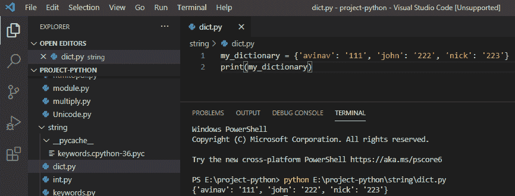
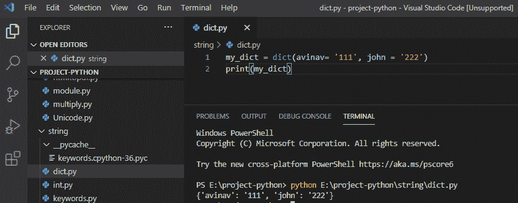
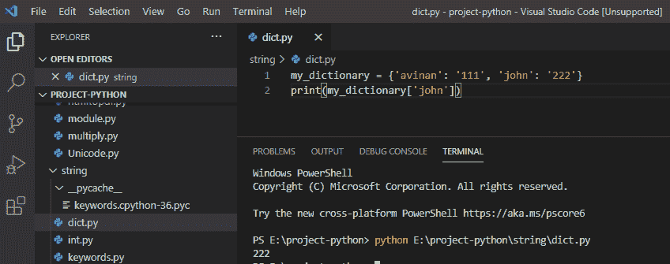
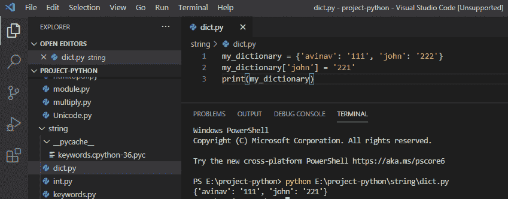
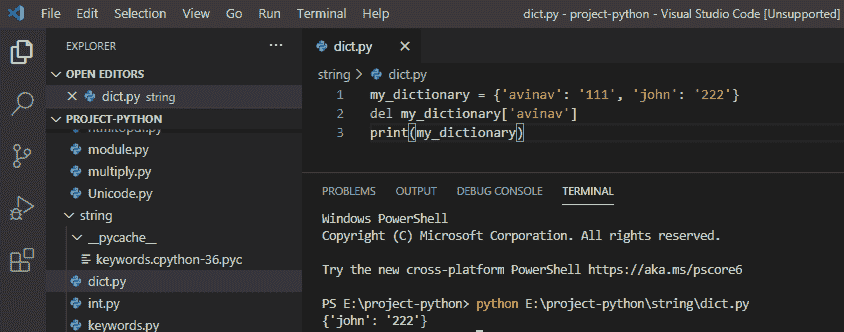

# python 中的哈希表

> 原文：<https://pythonguides.com/hash-table-in-python/>

[](https://sharepointsky.teachable.com/p/python-and-machine-learning-training-course)

在这个 [Python 教程](https://pythonguides.com/python-programming-for-the-absolute-beginner/)中，我们将会看到什么是散列表，我们还将会看到散列表在 Python 中的使用。

目录

[](#)

*   [python 中的哈希表是什么？](#What_is_the_Hash_table_in_python "What is the Hash table in python?")
*   [用 python 创建字典](#Creating_Dictionaries_in_python "Creating Dictionaries in python")
*   [访问字典中的值](#Accessing_values_in_the_dictionary "Accessing values in the dictionary")
*   [更新字典中的值](#Updating_values_in_a_dictionary "Updating values in a dictionary")
*   [从字典中删除条目](#Deleting_items_from_the_dictionary "Deleting items from the dictionary")

## python 中的哈希表是什么？

在 python 中，**哈希表**是一种将键映射到其值对的数据结构。它使得访问数据更快，因为索引值相当于数据值的一个键。

它是通过内置的字典数据类型实现的。

## 用 python 创建字典

python 中的字典用**花括号**表示。因此，为了创建一个字典，我们可以使用花括号，也可以使用 `dict()` 函数来传递键值对作为参数。

**举例:**

```py
my_dictionary = {'avinan': '111', 'john': '222', 'nick': '223'}
print(my_dictionary)
```

写完上面的代码(用 python 创建字典)，你将打印出**“my _ dictionary**”然后输出将显示为**“{ ' avinav ':' 111 '，' john': '222 '，' nick': '223'}** ”。这里，我的带有键值的字典已经打印出来了。

你可以参考下面用 python 创建字典的截图。



Creating Dictionaries in python

此外，我们将看到如何使用 `dict()` 函数在 python 中创建字典。

**举例:**

```py
my_dict = dict(avinav = '111', john = '222')
print(my_dict)
```

写完上面的代码(使用 dict()函数在 python 中创建字典)，你将打印出**“my _ dict**”然后输出将显示为**“{ ' avinav ':' 111 '，' john': '222'}** ”。这里，我们通过传递参数来使用 dict()函数，我的字典就是由这些参数创建的。

可以参考下面的截图使用 dict()函数在 python 中创建字典。



Creating Dictionaries in python

## 访问字典中的值

在 python 中，可以通过使用 key 获取值来访问字典值。

**举例:**

```py
my_dictionary = {'avinan': '111', 'john': '222'}
print(my_dictionary['john'])
```

编写上述代码(访问字典中的值)后，您将打印出 **"my_dictionary['john']"** ，然后输出将显示为 `"222` 。这里，我们获得了指定键的值。

您可以参考下面的截图在字典中访问值



Accessing values in the dictionary

## 更新字典中的值

在 python 中，我们可以在需要的时候**更新字典**，因为字典是可变的数据类型。

**举例:**

```py
my_dictionary = {'avinav': '111', 'john': '222'}
my_dictionary['john'] = '221'
print(my_dictionary)
```

写完上面的代码(更新字典中的值)，你将打印出 `"my_dictionary"` ，然后输出将显示为 ****"{'avinav': '111 '，' john': '221'}** "。**这里，我们更新了键的值，现在“john”的值是 221。

您可以参考下面的截图更新字典中的值



Updating values in a dictionary

## 从字典中删除条目

在 python 中，我们可以使用 `del()` 函数从字典中删除任何条目。

**举例:**

```py
my_dictionary = {'avinav': '111', 'john': '222'}
del my_dictionary['avinav']
print(my_dictionary)
```

写完上面的代码(从字典中删除条目)，你将打印出 `"my_dictionary"` ，然后输出将显示为 ****"{'john': '221'}** "。**这里，我们使用 del()函数从字典中删除‘avinav’。

你可以参考下面的截图从字典中删除条目



Deleting items from the dictionary

这就是我们如何在 python 中使用**散列表。**

您可能会喜欢以下 Python 教程:

*   [Python Hello World 程序(使用 Pycharm)](https://pythonguides.com/python-hello-world-program/)
*   [11 Python 列表方法](https://pythonguides.com/python-list-methods/)
*   [Python 回文程序](https://pythonguides.com/python-palindrome-program/)
*   [如何在 Python 中创建列表](https://pythonguides.com/create-list-in-python/)
*   [Python 中的块缩进](https://pythonguides.com/block-indentation-in-python/)
*   [Python For 循环示例](https://pythonguides.com/python-for-loop/)
*   [Python 读取 excel 文件并在 Python 中写入 Excel](https://pythonguides.com/python-read-excel-file/)
*   [在 Python 中创建一个元组](https://pythonguides.com/create-a-tuple-in-python/)
*   [Python 创建空集](https://pythonguides.com/python-create-empty-set/)
*   [Python 通过引用或值传递示例](https://pythonguides.com/python-pass-by-reference-or-value/)
*   [Python 从列表中选择+示例](https://pythonguides.com/python-select-from-a-list/)

在本教程中，我们讨论了 python 中的**哈希表，**，我们也看到了**如何使用字典创建它。**

[Bijay Kumar](https://pythonguides.com/author/fewlines4biju/)

Python 是美国最流行的语言之一。我从事 Python 工作已经有很长时间了，我在与 Tkinter、Pandas、NumPy、Turtle、Django、Matplotlib、Tensorflow、Scipy、Scikit-Learn 等各种库合作方面拥有专业知识。我有与美国、加拿大、英国、澳大利亚、新西兰等国家的各种客户合作的经验。查看我的个人资料。

[enjoysharepoint.com/](https://enjoysharepoint.com/)[](https://www.facebook.com/fewlines4biju "Facebook")[](https://www.linkedin.com/in/fewlines4biju/ "Linkedin")[](https://twitter.com/fewlines4biju "Twitter")