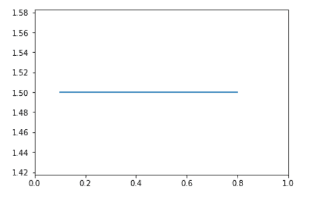

# 水平线 matplotlib

> 原文：<https://pythonguides.com/horizontal-line-matplotlib/>

[](https://sharepointsky.teachable.com/p/python-and-machine-learning-training-course)

在本 [Python 教程](https://pythonguides.com/learn-python/)中，我们将讨论 Python 中的**水平线 matplotlib** 。在这里，我们将使用 [matplotlib](https://pythonguides.com/what-is-matplotlib/) 涵盖与水平线相关的不同示例。我们还将讨论以下主题:

*   水平线 matplotlib
*   虚线水平线 matplotlib
*   带标签的水平线 matplotlib
*   多水平线 matplotlib
*   Matplotlib 水平线粗细
*   Matplotlib 水平线颜色
*   Matplotlib 水平线在数值处
*   Matplotlib 水平线位于 0
*   水平线 matplotlib 子图
*   Matplotlib 水平线全宽
*   Matplotlib 误差线水平线
*   水平网格线 matplotlib
*   带文本的 Matplotlib 水平线
*   注释水平线 matplotlib
*   Matplotlib 删除水平线
*   Matplotlib 向条形图添加水平线

目录

[](#)

*   [水平线 matplotlib](#Horizontal_line_matplotlib "Horizontal line matplotlib")
    *   [通过使用 plot()函数](#By_using_plot_function "By using plot() function")
    *   [通过使用 hlines()函数](#By_using_hlines_function "By using hlines() function")
    *   [通过使用 axhline()函数](#By_using_axhline_function "By using axhline() function")
*   [虚线水平线 matplotlib](#Dotted_horizontal_line_matplotlib "Dotted horizontal line matplotlib")
*   [带标签的水平线 matplotlib】](#Horizontal_line_matplotlib_with_label "Horizontal line matplotlib with label")
*   [多条水平线 matplotlib](#Multiple_horizontal_line_matplotlib "Multiple horizontal line matplotlib")
    *   [通过使用 axhline()](#By_using_axhline "By using axhline()")
    *   [通过使用 hlines()](#By_using_hlines "By using hlines()")
*   [Matplotlib 水平线粗细](#Matplotlib_horizontal_line_thickness "Matplotlib horizontal line thickness")
*   [Matplotlib 水平线颜色](#Matplotlib_horizontal_line_color "Matplotlib horizontal line color")
*   [Matplotlib 水平线在数值](#Matplotlib_horizontal_line_at_value "Matplotlib horizontal line at value")
*   [Matplotlib 水平线在 0 处](#Matplotlib_horizontal_line_at_0 "Matplotlib horizontal line at 0")
*   [水平线 matplotlib 子图](#Horizontal_line_matplotlib_subplot "Horizontal line matplotlib subplot")
*   [Matplotlib 水平线全宽](#Matplotlib_horizontal_line_full_width "Matplotlib horizontal line full width")
*   [Matplotlib 误差线水平线](#Matplotlib_errorbar_horizontal_line "Matplotlib errorbar horizontal line")
*   [水平网格线 matplotlib](#Horizontal_grid_lines_matplotlib "Horizontal grid lines matplotlib")
*   [带文本的 Matplotlib 水平线](#Matplotlib_horizontal_line_with_text "Matplotlib horizontal line with text")
*   [标注水平线 matplotlib](#Annotate_horizontal_line_matplotlib "Annotate horizontal line matplotlib")
*   [Matplotlib 删除水平线](#Matplotlib_remove_horizontal_line "Matplotlib remove horizontal line")
*   [Matplotlib 向条形图添加水平线](#Matplotlib_add_horizontal_line_to_bar_chart "Matplotlib add horizontal line to bar chart")

## 水平线 matplotlib

在本节中，我们将学习如何在 Python 的 matplotlib 中绘制水平线。在开始这个话题之前，我们首先要了解什么是**水平线**或者它看起来是什么样子。

**一般来说，**水平线是从右到左或者从左到右的直线。或者如果我们在**坐标平面**中说，一条平行于 X 轴的线称为水平线。


*” Sleeping Line “*

在 Python 中，matplotlib 是一个用于绘图的流行库。它提供了绘制水平线的不同方法，我们将在下面讨论。

*   使用绘图()
*   使用 hlines()
*   使用 axhline()

### 通过使用 plot()函数

在 matplotlib 中， `plot()` 方法用于生成 2D 图。

**plot()方法的语法如下:**

```py
matplotlib.pyplot.plot(x_points, y_points)
```

**上面使用的参数是:**

*   **x_points:** x 轴指向绘图。
*   **y_points:** y 轴指向绘图。

**我们来看一个用 plot()方法画水平线的例子:**

```py
**# Import Library**

import matplotlib.pyplot as plt

**# Define Data**

X = [2, 4, 6, 8]
Y = [0, 0, 0, 0]

**# Plot horizontal line**

plt.plot(X,Y)

**# Show**

plt.show()
```

*   在上面的例子中，我们导入了 `matplotlib.pyplot` 库。
*   之后，我们定义数据点进行绘图。这里我们指定 **y 轴**指向 `0` ，因为我们要绘制一条**水平线**。
*   接下来，通过使用 `plt.plot()` 方法，我们绘制一条线，并通过使用 `plt.show()` 方法，用户可视化该图。


plt.plot()

### 通过使用 hlines()函数

在 matplotlib 中， `hlines()` 方法用于绘制穿过轴的水平线。这里 hlines 代表水平线。

**hlines()方法的语法如下:**

```py
matplotlib.pyplot.hlines(y, xmin, xmax, colors, linestyles)
```

**上面使用的参数描述如下:**

*   **y:** 指定 y 轴上绘制直线的位置。
*   **xmin 和 xmax:** 指定每行的开始和结束。这些属性是必需的。
*   **颜色:**指定线条的颜色。
*   **线条样式:**指定线条的样式或类型

**让我们看一个使用 hlines()方法创建的水平线的例子:**

```py
**# Import Library**

import matplotlib.pyplot as plt

**# Plot horizontal line**

plt.hlines(5, 4, 8, color='red')

**# Show**

plt.show()
```

*   在上面的例子中，我们导入了 `matplotlib.pyplot` 库。
*   通过使用 `plt.hlines()` 方法我们绘制水平线。这里我们传递 `y` 、 `xmin` 、 `xmax` 、 `color` 作为参数，并将其设置为 `5` 、 `4` 、 `8` 和 `red` 。


plt.hlines()

### 通过使用 axhline()函数

在 matplotlib 中， `axhline()` 方法用于绘制到绘图的水平线。

**axh line()方法的语法如下:**

```py
matplotlib.pyplot.axhline(y, xmin, xmax, color, linestyle)
```

**上述使用的参数描述如下:**

*   **y:** 指定 y 轴上绘制直线的位置。
*   **xmin 和 xmax:** 指定行的开始和结束范围。
*   **颜色:**指定线条的颜色。
*   **线条样式:**指定线条的样式。

**axh line()方法示例:**

```py
**# Import Library**

import matplotlib.pyplot as plt

**# Plot horizontal line** 
plt.axhline(y=1.5, xmin=0.1, xmax= 0.8)

**# Show**

plt.show()
```

这里我们用 `axhline()` 的方法画一条水平线，并将 `y` 、 `xmin` 、 `xmax` 作为参数，分别设置其值为 `1.5` 、 `0.1` 、 `0.8` 。



plt.axhline()

阅读: [Matplotlib 绘制一条线](https://pythonguides.com/matplotlib-plot-a-line/)

## 虚线水平线 matplotlib

这里我们要学习如何用 python 在 matplotlib 中画水平虚线。我们必须改变线条的线条样式，使它们在风格上有点点。

Matplotlib.pyplot 库提供了参数 `linestyle` 来设置线条的类型。

**让我们来看一个水平虚线的例子:**

```py
**# Import Library** 
import matplotlib.pyplot as plt

**# Plot horizontal dotted line** 
plt.axhline(y=5, xmin=0.25, color='red', linestyle='dotted', linewidth=5)

**# Show**

plt.show()
```

*   这里我们用 `axhline()` 方法画一条水平虚线。我们通过参数 `y` 、 **xmin、` `颜色**、**线型**、**线宽**。
*   我们的主要目标是绘制一条本质上是虚线的水平线，因此我们将**线型**设置为**虚线**，并通过使用**线宽**参数来增加线条的宽度。


*” Dotted horizontal line “*

阅读: [Python 使用 Matplotlib 绘制多条线](https://pythonguides.com/python-plot-multiple-lines/)

## 带标签的水平线 matplotlib】

在这一节，我们将学习如何用标签画一条水平线。这里我们使用 `axhline()` 方法画一条水平线，并将**标签**作为参数传递。

**带标签画水平线的语法:**

```py
matplotlib.pyplot.axhline(y, xmin, xmax, color, label)
```

**举例:**

```py
**# Import Library**

import matplotlib.pyplot as plt

**# Plot horizontal line**

plt.axhline(y=10, linewidth=5, label= 'horizontal-line')

**# Add label**

plt.legend(loc = 'upper left')

**# Show**

plt.show()
```

*   通过使用 `plt.axhline()` 方法我们画一条水平线并传递参数**标签**。
*   然后通过使用 `plt.legend()` 方法我们将标签的**位置**设置为左上角的**。**

**

*” Horizontal line with label “*

阅读: [Matplotlib 支线剧情教程](https://pythonguides.com/matplotlib-subplot-tutorial/)

## 多条水平线 matplotlib

这里我们要用 python 在 matplotlib 中绘制多条水平线。绘制多条水平线的方法有:

*   使用 axhline()
*   使用 hlines()

### 通过使用 axhline()

在 matplotlib 中，通过使用 `axhline()` 方法，我们可以在绘图中绘制多条水平线。

**我们来看一个与此相关的例子:**

```py
**# Import library**

import matplotlib.pyplot as plt

**# Horizontal line 1**

plt.axhline (y = 10, color = 'b')

**# Horizontal line 2 
# We also set range of the line**

plt.axhline (y = 6, xmin =0.1, xmax =0.5, color='red')

**# Horizontal line 3**

plt.axhline (y = 2, color = 'm')

**# Horizontal line 4
# We also set range of the line**

plt.axhline (y = 4, xmin =0.6, xmax =0.8, color='c')

**# Display**

plt.show()
```


plt.axhline()

### 使用 hline()

在 matplotlib 中，通过使用 `hlines()` 方法，我们可以在绘图中绘制多条水平线。

**举例:**

```py
**# Import library**

import matplotlib.pyplot as plt

**# Horizontal line 1**

plt.hlines (y= 2, xmin= 0.1, xmax= 0.5, color='c', linewidth = 2 )

**# Horizontal line 2** 
plt.hlines (y= 6, xmin = 0.4, xmax = 0.9, color='m', linestyle = 'dotted', linewidth = 3)

**# Horizontal line 3**

plt.hlines (y = 8, xmin = 0.5, xmax = 0.9, color='orange', linestyle = 'dashed', linewidth = 5)

**# Horizontal line 4**

plt.hlines (y = 10, xmin =0.6, xmax =0.8, color='red', linewidth = 8 )

**# Display**

plt.show()
```


plt.hlines()

另外，请阅读: [Matplotlib 绘图条形图](https://pythonguides.com/matplotlib-plot-bar-chart/)

## Matplotlib 水平线粗细

在 matplotlib 中，要调整水平线的粗细，我们必须传递参数 `linewidth` 。通过使用**线宽**作为参数，我们可以很容易地**增加**或**减少**线条的宽度或厚度。

**调整厚度的语法如下:**

```py
matplotlib.pyplot.axhine(y, xmin, xmax, linewidth )
```

**让我们看一个调整水平线粗细的例子:**

```py
**# Import library**

import matplotlib.pyplot as plt

**# Thickness increased**

plt.axhline (y = 5, color = 'red', linewidth = 8)

**# Thickness decreased**

plt.axhline (y = 2, linewidth = 0.5)

**# Display**

plt.show()
```

*   在上面的例子中，我们使用 `plt.axhline()` 方法绘制一条水平线。
*   这里我们将**线宽**作为参数传递，在不同情况下将其值设置为 `8` 和 `0.5` 。


*plt.axhline(linewidth = )*

读取: [Matplotlib 绘图误差线](https://pythonguides.com/matplotlib-plot-error-bars/)

## Matplotlib 水平线颜色

在 matplotlib 中，要改变水平线的颜色，我们必须将参数 `color` 传递给方法 `axhilne()` 或 `hlines()` 。默认情况下，线条的颜色是**蓝色**。

**改变线条颜色的语法如下:**

```py
**# Using axhline()** 
matplotlib.pyplot.axhline(y, color= None)

**# Using hlines()** 
matplotlib.pyployt,hlines(y, xmin, xmax, color= None)
```

**让我们看一个与水平线颜色变化相关的例子:**

```py
**# Import library** 
import matplotlib.pyplot as plt

**# Change color by using hlines()** 
plt.hlines (y = 8, xmin = 0.5, xmax = 0.9, color='orange', linestyle = 'dashed', linewidth = 5)

                       **# OR**

**# Change color by using axhline()** 
plt.axhline (y = 10, xmin =0.6, xmax =0.8, color='red', linewidth = 8 )

**# Display**

plt.show()
```

*   在上面的例子中，我们使用 `plt.hlines()` 方法，并将**颜色**作为参数传递，并将其值设置为**橙色**。
*   在下一个案例中，我们使用 `plt.axhline()` 方法绘制一条水平线，这里我们将**颜色**作为参数来更改线条的颜色，并将其值设置为**红色**。


*plt.hlines (color = None)*


*plt.axhline(color = None)*

读取: [Matplotlib 移除刻度标签](https://pythonguides.com/matplotlib-remove-tick-labels/)

## Matplotlib 水平线在数值

在这里，我们将学习如何在绘制的图表上的特定值处绘制一条水平线。

**我们来看一个例子:**

```py
**# Import Library**

import matplotlib.pyplot as plt
import numpy as np

**# Define Data**

x = np.arange(0,25, 0.1)
y = np.sin(x)

**# Plot figure** 
plt.plot(x, y)

**# Horizontal line**

plt.axhline(y= -0.5,color='red', linestyle ='dashed')

**# Title**

plt.title("Sine Function", fontsize= 15, fontweight='bold')

**# Generate Plot**

plt.show()
```

*   在上面的例子中，我们导入了 `matplotlib` 和 `numpy` 库。
*   在此之后，我们使用 `np.arange()` 方法和 `np.sin()` 方法定义数据来绘制图形。
*   通过使用 `plt.plot()` 方法，我们绘制了一个正弦图。
*   然后在特定值处画一条水平线，我们使用 `plt.axhline()` 方法并传递参数 `y = -0.5` 。
*   `plt.title` 方法用于在情节上添加标题， `plt.show()` 方法用于情节可视化。


*” Horizontal line at value “*

阅读: [Matplotlib 旋转刻度标签](https://pythonguides.com/matplotlib-rotate-tick-labels/)

## Matplotlib 水平线在 0 处

在 matplotlib 中，要在 0 处画一条水平线，我们必须将 y 坐标的值设置为 0。

**在 0 处画水平线的语法:**

```py
**# By using axhline**
matplotlib.pyplot.axhline(y = 0)

# `By using hlines` matplotlib.pyplot.lines(y=0, xmin, xmax)
```

**示例(通过使用 hlines() )** :

```py
**# Import Library**

import matplotlib.pyplot as plt

**# Define Data**

x = [1, 2, 3.5, 4, 5, 6.5]
y = [0, 2, 4, 15, 8, 10]

**# Plot figure**

plt.plot(x, y)

**# Horizontal line at 0** 
plt.hlines(y= 0, xmin= 1.5, xmax= 5.5, color='red', linestyle ='dashed', linewidth = 5)

**# Generate Plot** 
plt.show()
```

*   这里我们使用 `hlines()` 方法，将 `y` 、 `xmin` 、 `xmax` 、 `color` 、 `linestyle` 和 `linewidth` 作为参数进行传递。
*   我们分别将它们的值设置为 `0` 、 `1.5` 、 `5.5` 、**虚线**和 `5` 。


*” Horizontal line at 0 “*

读取: [Matplotlib 改变背景颜色](https://pythonguides.com/matplotlib-change-background-color/)

## 水平线 matplotlib 子图

这里我们将讨论如果我们在图形区域中绘制支线剧情，如何在特定支线剧情中绘制水平线。

我们将使用 `axhline()` 方法在特定支线剧情处画一条水平线。

**让我们借助一个例子来理解这个概念:**

```py
**# Importing Libraries** 
import numpy as np
import matplotlib.pyplot as plt

**# Define Data**

x1= [0.2, 0.4, 0.6, 0.8, 1]
y1= [0.3, 0.6, 0.8, 0.9, 1.5]

x2= [2, 6, 7, 9, 10]
y2= [3, 4, 6, 9, 12]

x3= [5, 8, 12]
y3= [3, 6, 9]

x4= [7, 8, 15]
y4= [6, 12, 18]

fig, ax = plt.subplots(2, 2)

**# Plot graph
# Set horizontal line at specfic subplot**

ax[0, 0].plot(x1, y1)
ax[0, 1].axhline(y=4)
ax[1, 0].plot(x3, y3)
ax[1, 1].axhline(y=2.5)

**# Display Graph**

fig.tight_layout()
plt.show()
```

*   在上面的例子中，我们在一个图形区域中绘制了多个图。而我们要在具体的地块画一条水平线。
*   这里我们用 `axhline()` 的方法画一条水平线。


ax.axhline()

阅读: [Matplotlib 散点图标记](https://pythonguides.com/matplotlib-scatter-marker/)

## Matplotlib 水平线全宽

在 matplotlib 中，如果你想画一条全宽的水平线，只需使用 `axhline()` 方法。

您也可以使用 `hlines()` 方法来绘制全角水平线，但是在这个方法中，您必须将 `xmin` 和 `xmax` 设置为全角。

**举例:**

```py
**# Import Library** import matplotlib.pyplot as plt

**# Plot vertical line**

plt.axhline(y=1.5)

**# Show**

plt.show()
```

在上面的例子中，我们使用 `axhline()` 方法绘制一条**全幅**的水平线。


plt.axhline()

阅读: [Matplotlib 虚线](https://pythonguides.com/matplotlib-dashed-line/)

## Matplotlib 误差线水平线

为了在误差栏上画一条水平线，我们必须在 `ax.errorbar()` 中传递一个参数 `xerr` 。

**误差线水平线的语法如下:**

```py
matplotlib.pyplot.errorbar(x, y, yerr, capsize)
```

**上述使用的参数如下:**

*   **x:** 指定水平坐标。
*   **y:** 指定垂直坐标。
*   **xerr:** 定义水平误差线尺寸。

**为了更好地理解，我们来看一个例子:**

```py
**# Import Library**

import matplotlib.pyplot as plt

**# Define Data**

x= [1, 2, 3, 5]
y= [9, 15, 5, 25]

**# Plot horizontal error bar**

plt.errorbar(x, y, xerr = 1.2)

**# Display graph** 
plt.show()
```

*   在上面的例子中，我们导入了 `matplotlib.pyplot` 库。
*   然后我们定义 x 轴和 y 轴数据点。
*   `plt.errorbar()` 方法用于绘制误差线，我们传递参数 **x，y，**和 `xerr` ，并设置 xerr = `1.2` 的值。
*   然后我们使用 `plt.show()` 方法显示误差棒图。


plt.errorbar(xerr= )

读取: [Matplotlib 日志日志图](https://pythonguides.com/matplotlib-log-log-plot/)

## 水平网格线 matplotlib

在 matplotlib 中， `grid()` 方法用于创建网格线。

**创建水平网格线的语法:**

```py
matplotlib.axis.YAxis.grid()
```

此方法仅用于绘制水平线。

**我们来看一个例子:**

```py
**# Import Library**

import matplotlib.pyplot as plt

**# Current axes** 
axes = plt.gca()

**# Horizontal grid lines**

axes.yaxis.grid()

**# Display**

plt.show()
```

这里我们使用 `plt.gca()` 方法获取图形的当前轴，使用 `axes.yaxis.grid()` 方法绘制水平网格线。


axes.yaxis.grid()

阅读: [Matplotlib 最佳拟合线](https://pythonguides.com/matplotlib-best-fit-line/)

## 带文本的 Matplotlib 水平线

要在水平行上添加文本，我们必须使用 `text()` 方法。

**语法如下:**

```py
**# Horizontal line**

matplotlib.pyplot.axhline(y)

**# Text**

matplotlib.pyplot.text(x,y,text)
```

**让我们看一个带有文本的水平线的例子:**

```py
**# Import Library**

import matplotlib.pyplot as plt

**# Plot horizontal line**

plt.axhline(y=1.5)

**# Add text**

plt.text(0.4,1.51,'Horizontal Line',rotation=360)

**# Show**

plt.show()
```


*” Horizontal line with text “*

阅读: [Matplotlib 支线剧情 _adjust](https://pythonguides.com/matplotlib-subplots_adjust/)

## 标注水平线 matplotlib

在 matplotlib 中， `annotate()` 方法用于用文本标注点。

`annotate()` 方法的工作原理与 `text()` 方法相同，但是 `annotate()` 方法有更多的特性。就像你可以添加箭头来突出某些东西。

**annotate 函数的语法如下:**

```py
matplotlib.pyplot.annotate(s, xy, xytext, arrowprops ....)
```

**使用的参数描述如下:**

*   **s:** 用于标注的文本。
*   **xy:** 指定要标注的点(x，y)。
*   **xytext:** 指定放置文本的位置(x，y)。
*   **arrowprops:** 包含 dict 类型。

**我们来看一个例子:**

```py
**# Import Library** 
import matplotlib.pyplot as plt

**# Plot Horizontal line** 
plt.axhline(y=1.47)

**# Annotate** 
plt.annotate('Horizontal Line',
              xy = (0.4,1.48), 
              xytext =(0.6,1.52), 
              color='red',
              fontweight='bold',
              fontsize = 15,
              arrowprops = dict(facecolor = 'yellow'))

**# Show**

plt.show()
```

这里我们使用 `plt.annotate()` 方法，并传递 `text` 、 `xy` 、 `xytext` 、 `color` 、 `fontweight` 、 `fontsize` 和 `arrowprops` 作为参数。


*” Annotate horizontal line “*

## Matplotlib 删除水平线

在 matplotlib 中，我们可以很容易地删除使用 `plt.plot()` 方法绘制的水平线。

`remove()` 方法用于删除水平线。

**举例:**

```py
**# Import Library** 
import matplotlib.pyplot as plt

**# Define Data**

x = [2, 4, 6, 8]
y = [0, 0, 0, 0]
y1 = [2, 2, 2, 2]
y2 = [3, 3, 3, 3]

**# Plot Horizontal lines** 
line_1 = plt.plot(x,y)
line_2 = plt.plot(x,y1)
line_3 = plt.plot(x,y2)

**# Remove horizontal line**

r = line_2.pop(0)
r.remove()

**# Show**

plt.show()
```


*” Plot before removal of the horizontal line “*


*” Plot after removal of the horizontal line “*

这里我们使用 `remove()` 方法删除水平线 2。

## Matplotlib 向条形图添加水平线

如果你想在 matplotlib 中创建一个横线条形图，你必须知道如何创建一个条形图。让我们看看创建条形图的语法。

```py
matplotlib.pyplot.bar(x, height)
```

**让我们看一个在条形图上画一条水平线的例子:**

```py
**# Import Library**

import matplotlib.pyplot as plt

**# Define data**

x =[2, 4, 8, 5, 6]

y = [8, 16, 15, 2, 4]

**# Creating the bar plot**

plt.bar(x, y, color ='maroon')

**# Horizontal Line**

plt.axhline(y=9.5,linewidth= 3, color='k', linestyle= 'dotted')

**# Display**

plt.show()
```

*   在上面的例子中，我们导入 `matplotlib.pyplot` 库进行数据可视化。
*   接下来我们定义数据，并通过使用 `plt.bar()` 方法绘制条形图。
*   `plt.axhline()` 方法在 `y=9.5` 处的条形图上画水平线。


*” Horizontal line on bar chart “*

在本 Python 教程中，我们已经讨论了**"水平线 matplotlib"** ，并且我们也涵盖了一些与之相关的例子。这些是我们在本教程中讨论过的以下主题。

*   水平线 matplotlib
*   虚线水平线 matplotlib
*   带标签的水平线 matplotlib
*   多水平线 matplotlib
*   Matplotlib 水平线粗细
*   Matplotlib 水平线颜色
*   Matplotlib 水平线在数值处
*   Matplotlib 水平线位于 0
*   水平线 matplotlib 子图
*   Matplotlib 水平线全宽
*   Matplotlib 误差线水平线
*   水平网格线 matplotlib
*   带文本的 Matplotlib 水平线
*   注释水平线 matplotlib
*   Matplotlib 删除水平线
*   Matplotlib 向条形图添加水平线

[Bijay Kumar](https://pythonguides.com/author/fewlines4biju/)

Python 是美国最流行的语言之一。我从事 Python 工作已经有很长时间了，我在与 Tkinter、Pandas、NumPy、Turtle、Django、Matplotlib、Tensorflow、Scipy、Scikit-Learn 等各种库合作方面拥有专业知识。我有与美国、加拿大、英国、澳大利亚、新西兰等国家的各种客户合作的经验。查看我的个人资料。

[enjoysharepoint.com/](https://enjoysharepoint.com/)[](https://www.facebook.com/fewlines4biju "Facebook")[](https://www.linkedin.com/in/fewlines4biju/ "Linkedin")[](https://twitter.com/fewlines4biju "Twitter")**