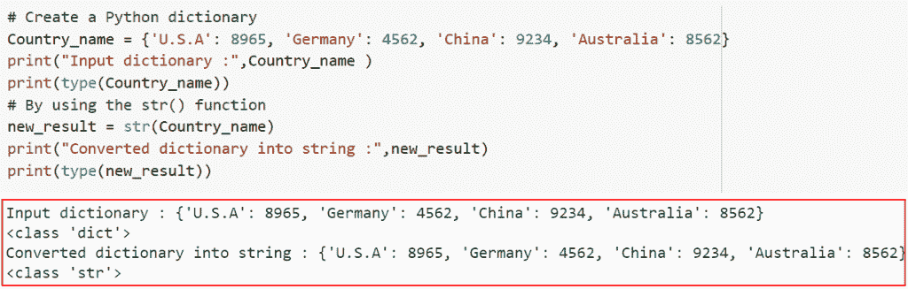
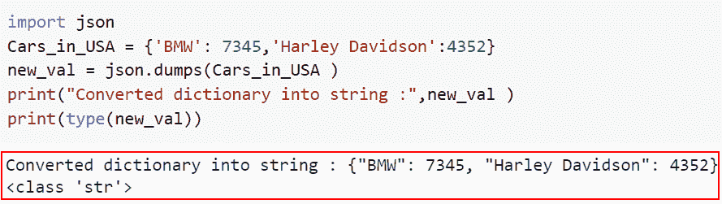
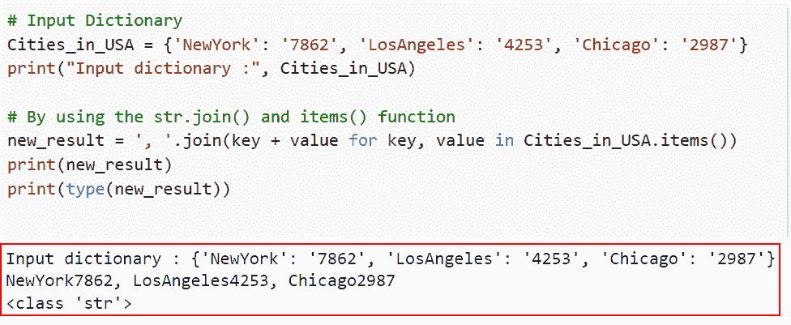
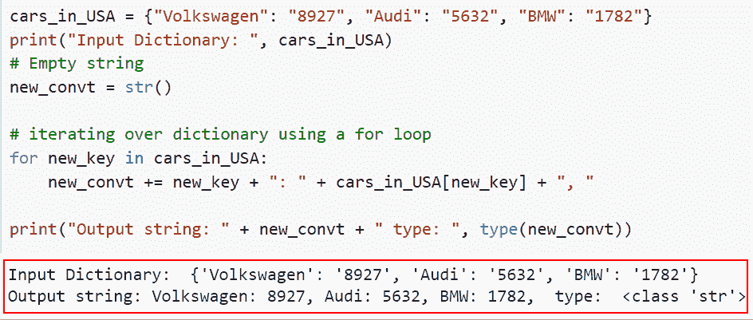

# 如何在 Python 中将字典转换成字符串

> 原文：<https://pythonguides.com/how-to-convert-a-dictionary-into-a-string-in-python/>

[](https://sharepointsky.teachable.com/p/python-and-machine-learning-training-course)

在本 [Python 教程](https://pythonguides.com/python-programming-for-the-absolute-beginner/)中，我们将学习如何将 Python 字典转换成字符串。为了理解各种方法，我们将使用一些内置函数将 Python 字典转换为字符串。

作为一名开发人员，在制作 Python 项目时，我需要将 Python 字典转换成字符串。

在这里我们将看到:

*   如何在 Python 中使用 str()将字典转换成字符串
*   如何使用 json.dumps()在 Python 中将字典转换成字符串
*   如何在 Python 中使用 items()和 str.join()将字典转换为字符串
*   如何使用常规方法在 Python 中将字典转换成字符串

目录

[](#)

*   [用 Python 把字典转换成字符串](#Convert_a_dictionary_into_a_string_in_Python "Convert a dictionary into a string in Python")
    *   [如何在 Python 中使用 str()](#How_to_convert_a_dictionary_into_a_string_in_Python_using_str "How to convert a dictionary into a string in Python using str() ") 将字典转换成字符串
    *   [如何使用 json.dumps()](#How_to_convert_a_dictionary_into_a_string_in_Python_using_jsondumps "How to convert a dictionary into a string in Python using json.dumps()") 在 Python 中将字典转换成字符串
*   [如何在 Python 中使用 items()和 str.join()](#How_to_convert_a_dictionary_into_a_string_in_Python_using_items_and_strjoin "How to convert a dictionary into a string in Python using items(), and str.join() ") 将字典转换成字符串
*   [如何使用传统方式将 Python 中的字典转换成字符串](#How_to_convert_a_dictionary_into_a_string_in_Python_using_a_conventional_way "How to convert a dictionary into a string in Python using a conventional way")

## 用 Python 把字典转换成字符串

在 Python 中，有许多方法可以将字典转换成字符串。我们将详细介绍如何使用 `str()` 方法和 `json.dumps()` 方法将字典转换成 Python 中的字符串。

### 如何在 Python 中使用 str() 将字典转换成字符串

*   在本节中，我们将讨论如何使用 `str()` 在 Python 中将字典转换成字符串。
*   dictionary 对象将以这种字典到字符串的转换方式简单地传递给 `str()` 函数。
*   Python 的 str 函数返回所提供对象或整数的字符串变量。如果没有提供参数，该方法将返回一个空字符串。

**举例:**

我们举个例子，检查一下如何在 Python 中使用 `str()` 将字典转换成字符串。

**源代码:**

```py
# Create a Python dictionary
Country_name = {'U.S.A': 8965, 'Germany': 4562, 'China': 9234, 'Australia': 8562}
print("Input dictionary :",Country_name )
print(type(Country_name))
# By using the str() function
new_result = str(Country_name)
print("Converted dictionary into string :",new_result)
print(type(new_result))
```

在下面给出的代码中，我们将首先创建一个字典，然后使用 `type()` 函数来检查对象。接下来，我们使用了 `str()` 函数，在这个函数中，我们将输入字典作为参数传递。

下面是下面给出的代码的截图。



Converting a dictionary into a string in Python using str

这是如何在 Python 中使用 str 将字典转换成字符串。

阅读:[在 Python 中把字符串转换成浮点数](https://pythonguides.com/convert-string-to-float-in-python/)

### 如何使用 json.dumps() 在 Python 中将字典转换成字符串

*   这里我们将讨论如何使用 `json.dump()` 在 Python 中将字典转换成字符串。
*   `json.dump()` 方法使我们能够将一个 Python 对象转换成一个等效的 json 对象，并将结果保存为一个文件。
*   使用 `json.dumps()` 方法将 Python 字典转换成字符串，而 `json.loads()` 技术以完全相反的方式工作。

**举例:**

我们举个例子，检查一下如何使用 `json.dump()` 在 Python 中将字典转换成字符串。

**源代码:**

```py
import json
Cars_in_USA = {'BMW': 7345,'Harley Davidson':4352}
new_val = json.dumps(Cars_in_USA )
print("Converted dictionary into string :",new_val )
print(type(new_val))
```

在上面的代码中，我们首先导入 JSON 模块，然后创建名为**“Cars _ in _ USA”**的输入字典。接下来，我们使用了 `json.dumps()` 函数，它将把字典转换成一个字符串。

你可以参考下面的截图。



Converting a dictionary into a string in Python using json.dumps_

正如你在截图中看到的，我们已经讨论了如何使用 `json.dumps()` 在 Python 中将字典转换成字符串。

阅读: [Python 将二进制转换成十进制](https://pythonguides.com/python-convert-binary-to-decimal/)

## 如何在 Python 中使用 items()和 str.join() 将字典转换成字符串

*   现在让我们了解如何使用 `items()` 和 `str.join()` 在 Python 中将字典转换成字符串。
*   使用 for 循环，我们将遍历 dictionary 对象，并以将 dictionary 转换为 string 的方式添加键及其值。然后使用 `str.join()` 函数将键:值对组合成一个字符串。

**举例:**

这里我们将举一个例子，检查如何使用 `items()` 和 `str.join()` 在 Python 中将字典转换成字符串。

**源代码:**

```py
# Input Dictionary
Cities_in_USA = {'NewYork': '7862', 'LosAngeles': '4253', 'Chicago': '2987'}
print("Input dictionary :", Cities_in_USA)

# By using the str.join() and items() function
new_result = ', '.join(key + value for key, value in Cities_in_USA.items())
print(new_result)
print(type(new_result))
```

下面是以下给定代码的执行。



Converting a dictionary into a string in Python using items and str.join()

在这个例子中，我们已经理解了如何在 Python 中使用**项**和 `str.join()` 将字典转换成字符串。

阅读:[在 Python 中把元组转换成字符串](https://pythonguides.com/convert-tuple-to-string-in-python/)

## 如何使用传统方式将 Python 中的字典转换成字符串

*   在这一节中，我们将讨论如何使用传统的方法在 Python 中将字典转换成字符串。
*   在 Python 中，除了利用内置函数之外，我们还可以通过使用传统的过程将 dict 转换为字符串。传统的方法是通过使用 for 循环遍历字典来连接新创建的字符串。
*   在这个例子中，我们将首先使用两个主要操作，我们将使用 for 循环遍历字典，然后连接字符串。

**举例:**

让我们举一个例子，并检查如何使用常规方法在 Python 中将字典转换为字符串。

**源代码:**

```py
cars_in_USA = {"Volkswagen": "8927", "Audi": "5632", "BMW": "1782"}
print("Input Dictionary: ", cars_in_USA)
# Empty string
new_convt = str()

# iterating over dictionary using a for loop
for new_key in cars_in_USA:
    new_convt += new_key + ": " + cars_in_USA[new_key] + ", "

print("Output string: " + new_convt + " type: ", type(new_convt))
```

下面是以下给定代码的执行。



Converting a dictionary into a string in Python using a conventional way

您可能也喜欢阅读以下 Python 教程。

*   [Python 将字典转换成数组](https://pythonguides.com/python-convert-dictionary-to-an-array/)
*   [如何在 Python 中把字符串转换成日期时间](https://pythonguides.com/convert-a-string-to-datetime-in-python/)
*   [如何在 Python 中将 dictionary 转换成 JSON](https://pythonguides.com/convert-dictionary-to-json-python/)

在本文中，我们学习了如何将 Python 字典转换成字符串。我们还讨论了以下主题。

*   如何在 Python 中使用 str()将字典转换成字符串
*   如何使用 json.dumps()在 Python 中将字典转换成字符串
*   如何在 Python 中使用 items()和 str.join()将字典转换为字符串
*   如何使用常规方法在 Python 中将字典转换成字符串

[Arvind](https://pythonguides.com/author/arvind/)

Arvind 目前是 TSInfo Technologies 的高级 Python 开发人员。他精通 Python 库，如 NumPy 和 Tensorflow。