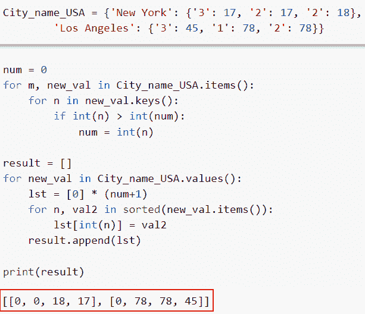
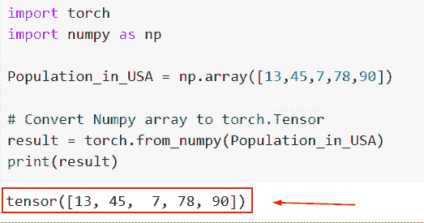
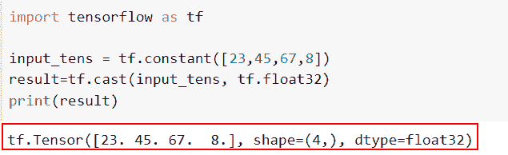
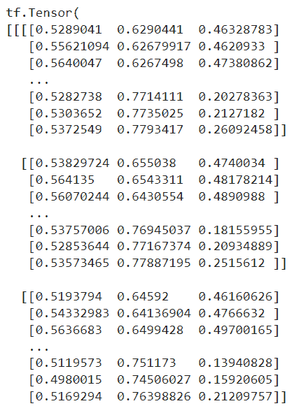
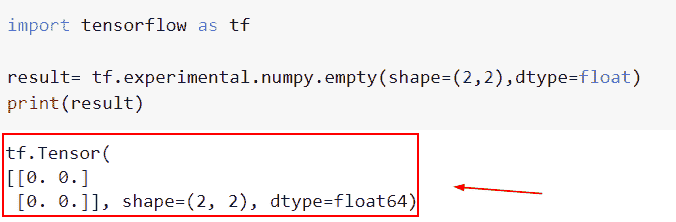

# 如何将字典转换为张量张量流

> 原文：<https://pythonguides.com/how-to-convert-dictionary-to-tensor-tensorflow/>

[](https://sharepointsky.teachable.com/p/python-and-machine-learning-training-course)

本教程将说明如何使用 Python 将字典转换为张量张量流。我们还会看一些例子，看看如何在 *`TensorFlow`* 中使用 `tf.convert_to_tensor()` 函数。我们将讨论这些话题。

*   如何将字典转换为张量张量流
*   如何将数组转换为张量 Pytorch
*   如何将张量转换为浮点张量流
*   如何将图像转换为张量张量流
*   张量流空张量

目录

[](#)

*   [如何将字典转换成张量张量流](#How_to_convert_dictionary_to_tensor_tensorflow "How to convert dictionary to tensor tensorflow")
*   [如何将数组转换为张量 Pytorch](#How_to_convert_array_to_tensor_Pytorch "How to convert array to tensor Pytorch")
*   [如何将张量转换为浮点张量流](#How_to_convert_tensor_to_float_tensorflow "How to convert tensor to float tensorflow")
*   [如何将图像转换为张量张量流](#How_to_convert_image_to_tensor_tensorflow "How to convert image to tensor tensorflow")
*   [TensorFlow 空张量](#TensorFlow_empty_tensor "TensorFlow empty tensor")

## 如何将字典转换成张量张量流

*   本节将讨论如何将字典转换为张量 [TensorFlow](https://pythonguides.com/tensorflow/) 。
*   为了完成这项任务，我们将使用 for-loop 方法，在本例中，我们首先初始化一个字典，并以键值对元素的形式分配一个元素。
*   接下来，我们要将给定的字典转换成张量，为此，我们将使用 for 循环并设置条件，如果 n > m，那么它将存储在结果中。

**举例**:

我们举个例子，检查一下如何在 Python TensorFlow 中把字典转换成张量。

**源代码**:

```py
City_name_USA = {'New York': {'3': 17, '2': 17, '2': 18},
        'Los Angeles': {'3': 45, '1': 78, '2': 78}}
num = 0
for m, new_val in City_name_USA.items():
    for n in new_val.keys():
        if int(n) > int(num):
            num = int(n)

result = []
for new_val in City_name_USA.values():
    lst = [0] * (num+1)
    for n, val2 in sorted(new_val.items()):
        lst[int(n)] = val2
    result.append(lst)

print(result)
```

你可以参考下面的截图。



Convert dictionary to tensor tensorflow

这就是如何在 Python TensorFlow 中把字典转换成张量。

阅读:[张量流将稀疏张量转换为张量](https://pythonguides.com/tensorflow-convert-sparse-tensor-to-tensor/)

## 如何将数组转换为张量 Pytorch

*   这里我们将讨论如何在 Python 中将数组转换成 Pytorch 张量。
*   类似于 *`numpy.ndarray`* 是 PyTorch 张量。这两者的区别在于张量利用 GPU 来加速涉及数字的计算。
*   *用于将 *`numpy.ndarray`* 转换为 PyTorch 张量()。而 *`numpy()`* 方法将张量转换为`*numpy . ndarray*`。*
*   *首先，我们需要 torch 和 Numpy 库，然后使用`*torch . from _ Numpy()*`将数组转换为 Pytorch 张量。*

 ***语法**:

让我们看看语法并理解一个`*torch . from _ numpy()*`函数的工作原理。

```py
torch.from_numpy(ndarray) 
```

注意:这个函数只有一个参数 ndarray，它指定了我们要用张量转换的输入数组。

示例:

```py
import torch
import numpy as np

Population_in_USA = np.array([13,45,7,78,90])

# Convert Numpy array to torch.Tensor
result = torch.from_numpy(Population_in_USA)
print(result)
```

在下面给出的代码中，我们使用 *`np.array()`* 函数创建了一个数组，在这个函数中，我们将整数值作为一个参数进行赋值。接下来，我们将使用`*torch . from _ numpy()*`函数，在这个函数中，我们将字典指定为一个参数。

下面是以下给定代码的实现。



Convert array to tensor Pytorch

正如你在截图中看到的，我们将 NumPy 数组转换成 Pytorch 张量。

阅读:[模块“tensorflow”没有属性“sparse _ placeholder”](https://pythonguides.com/module-tensorflow-has-no-attribute-sparse_placeholder/)

## 如何将张量转换为浮点张量流

*   本节将讨论如何在 Python 中将 tensorflow 张量转换为 float。
*   为了执行这项任务，我们将使用 `tf.cast()` 函数。该函数用于将给定的输入张量转换为新的数据类型。该函数采用两个主要参数，即正在转换的输入张量。

**语法**:

下面是 Python TensorFlow 中 `tf.cast()` 函数的语法

```py
tf.cast(
    x, dtype, name=None
)
```

*   它由几个参数组成
    *   `x` :该参数定义输入张量和数值型张量、稀疏张量或索引切片。可能是 `int8` 、 `int16` 、 `int32` 、 `int64` 、 `float16` 、 `float32` 、 `float64` 、 `complex64` 、 `complex128` 或 `bfloat16` 。它也可能是一个 **uint8、int8、int16、int32 或 int64** 。
    *   `dtype` :该参数指定输入张量的数据类型。
    *   `name` :默认情况下，取 none 值，指定操作的名称。

**举例**:

```py
import tensorflow as tf

input_tens = tf.constant([23,45,67,8])
result=tf.cast(input_tens, tf.float32)
print(result)
```

在上面的代码中，我们使用了 *`tf.constant()`* 函数来创建输入张量。然后我们使用 *`tf.cast()`* 将整数数据类型转换为浮点数据类型。

下面是以下给定代码的实现。



Convert tensor to float tensorflow

这就是如何使用 TensorFlow 将输入张量转换为浮点值。

阅读:[模块“tensorflow”没有属性“div”](https://pythonguides.com/module-tensorflow-has-no-attribute-div/)

## 如何将图像转换为张量张量流

*   在本节中，我们将讨论如何将图像转换为张量，以及图像张量的典型轴顺序。
*   该图像必须是 PIL 图像或数字图像。ndarray (HxWxC)在[0，255]范围内。这里，H、W 和 C 代表图像的高度、宽度和通道数。
*   在给定的例子中，h 是高度，w 是宽度图像，c 是通道图像。

**举例**:

```py
import tensorflow as tf

image = tf.io.read_file("tiger.png")

input_tensor = tf.io.decode_image(image, channels=3, dtype=tf.dtypes.float32)
tensor = tf.image.resize(input_tensor, [224, 224])
result = tf.expand_dims(tensor, axis=0)
print(result)
```

下面是以下给定代码的执行。



Convert image to tensor tensorflow

在这个例子中，我们已经将图像转换为张量。

阅读:[模块“tensorflow”没有属性“truncated _ normal”](https://pythonguides.com/module-tensorflow-has-no-attribute-truncated_normal/)

## TensorFlow 空张量

*   让我们讨论一下如何在 Python TensorFlow 中创建一个空张量。
*   为了执行这个任务，我们将使用`TF . experimental . numpy . empty()`函数，这个函数改变空值。

**语法**:

下面是 Python TensorFlow 中`TF . experimental . numpy . empty()`函数的语法

```py
 tf.experimental.numpy.empty(
    shape, dtype=float
)
```

*   它由几个参数组成
    *   **形状**:该参数定义了空张量的形状。
    *   **dtype:** 默认情况下，它取浮点值，指定输入张量的数据类型。

**举例**:

```py
import tensorflow as tf

result= tf.experimental.numpy.empty(shape=(2,2),dtype=float)
print(result)
```

下面是以下代码的截图



TensorFlow empty tensor

还有，多看看一些 Python TensorFlow 教程。

*   [TensorFlow 全连通层](https://pythonguides.com/tensorflow-fully-connected-layer/)
*   [批量归一化张量流](https://pythonguides.com/batch-normalization-tensorflow/)
*   [张量流自定义损失函数](https://pythonguides.com/tensorflow-custom-loss-function/)
*   [TensorFlow Sparse Tensor ](https://pythonguides.com/tensorflow-sparse-tensor/)

在本教程中，我们已经了解了如何使用 Python TensorFlow 将字典转换为张量。我们还会看一些例子，看看如何在 *`TensorFlow`* 中使用 `tf.convert_to_tensor()` 函数。我们将讨论这些话题。

*   将字典转换为张量张量流
*   将数组转换为张量 Pytorch
*   将张量转换为浮点张量流
*   将图像转换为张量张量流
*   张量流空张量

[Bijay Kumar](https://pythonguides.com/author/fewlines4biju/)

Python 是美国最流行的语言之一。我从事 Python 工作已经有很长时间了，我在与 Tkinter、Pandas、NumPy、Turtle、Django、Matplotlib、Tensorflow、Scipy、Scikit-Learn 等各种库合作方面拥有专业知识。我有与美国、加拿大、英国、澳大利亚、新西兰等国家的各种客户合作的经验。查看我的个人资料。

[enjoysharepoint.com/](https://enjoysharepoint.com/)[](https://www.facebook.com/fewlines4biju "Facebook")[](https://www.linkedin.com/in/fewlines4biju/ "Linkedin")[](https://twitter.com/fewlines4biju "Twitter")*