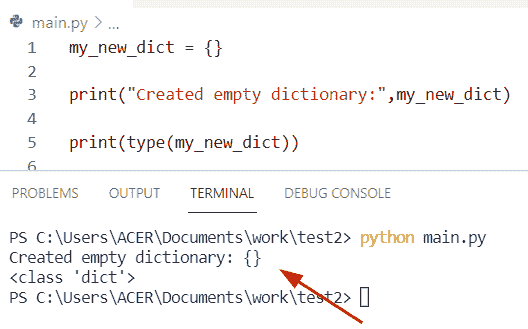
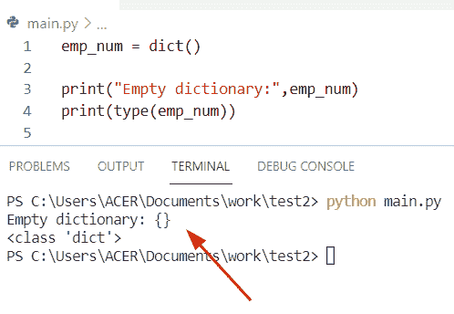
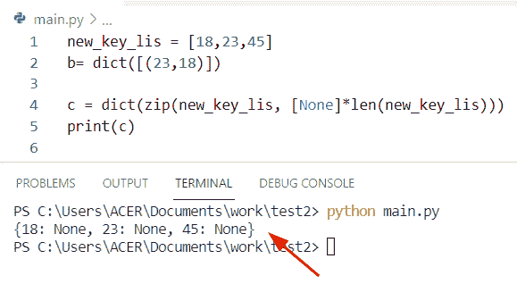
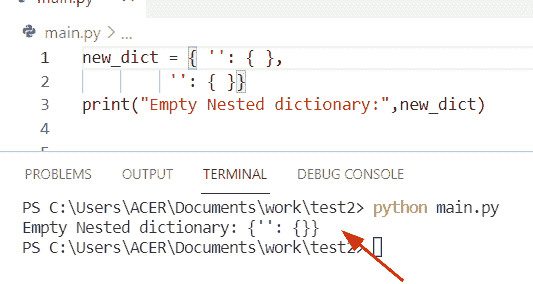
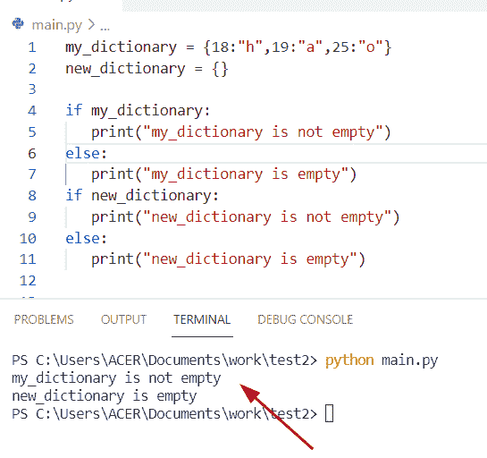
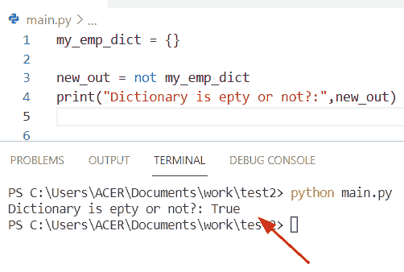
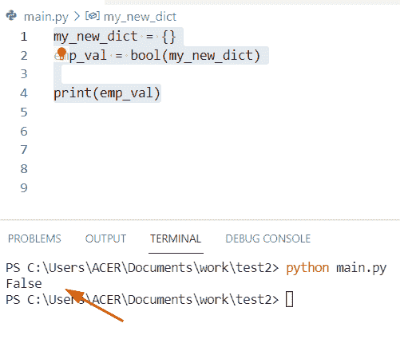
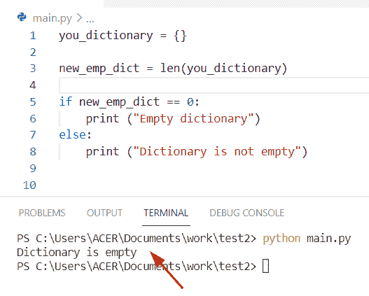

# 如何创建空的 Python 字典

> 原文：<https://pythonguides.com/how-to-create-an-empty-python-dictionary/>

[](https://sharepointsky.teachable.com/p/python-and-machine-learning-training-course)

在本 Python 教程中，我们将讨论**如何创建一个空的 Python 字典**,这里我们还将介绍下面的例子:

*   如何用 Python 创建一个带键的空字典
*   如何创建空嵌套字典 Python
*   如何检查 Python 字典是否为空

目录

[](#)

*   [如何创建一个空的 Python 字典](#How_to_create_an_empty_Python_dictionary "How to create an empty Python dictionary")
    *   [另一个使用 dict()内置函数创建空字典的例子](#Another_example_to_create_an_empty_dictionary_by_using_dict_built-in_function "Another example to create an empty dictionary by using dict() built-in function")
*   [如何用 Python 创建一个空字典，带键](#How_to_create_an_empty_dictionary_in_Python_with_keys "How to create an empty dictionary in Python with keys")
*   [如何创建空的嵌套字典](#How_to_create_empty_nested_dictionary "How to create empty nested dictionary")
*   [如何检查 Python 字典是否为空](#How_to_check_if_Python_dictionary_is_empty "How to check if Python dictionary is empty")
    *   [通过使用 if 条件](#By_using_if_condition "By using if condition")
    *   [通过使用 not 运算符](#By_using_not_operator "By using not operator")
    *   [通过使用 bool()字典方法](#By_using_bool_dict_method "By using bool() dict method")
    *   [通过使用 len()方法](#By_using_len_method "By using len() method")

## 如何创建一个空的 Python 字典

*   在 Python 中创建一个空字典，我们可以在花括号 **{}中不赋任何元素。**
*   我们也可以通过使用 `dict()` 方法创建一个空字典，这是 Python 中的一个内置函数，没有参数。

**举例:**

让我们举一个例子，看看如何用 Python 创建一个空字典

```py
my_new_dict = {}

print("Created empty dictionary:",my_new_dict)

print(type(my_new_dict)) 
```

所以，用上面的代码，我们创建了一个空字典，它是**‘my _ new _ dict’**，它等于花括号{}。现在，如果您想在输出中看到一个空字典，那么您必须使用 print 语句。它将显示一个空字典和字典类型。

下面是以下给定代码的输出。



How to create an empty Python dictionary

### 另一个使用 `dict()` 内置函数创建空字典的例子

在 Python 中，空字典意味着它不包含键值对元素。在这个例子中，为了创建一个空字典，我们可以使用一个 dict 构造函数，这个方法没有参数。如果没有传递参数，那么它将创建一个空字典。

**源代码:**

```py
emp_num = dict()

print("Empty dictionary:",emp_num)
print(type(emp_num))
```



How to create an empty Python dictionary dict method

这就是如何用 Python 创建一个空字典。

阅读: [Python 字典转 CSV](https://pythonguides.com/python-dictionary-to-csv/)

## 如何用 Python 创建一个空字典，带键

在 Python 中创建一个带键的空字典，我们可以使用组合 **zip()和 len()** 的方法。该方法将初始化一个键字典，并且在字典中不返回任何值。

**源代码:**

```py
new_key_lis = [18,23,45]
b= dict([(23,18)])

c = dict(zip(new_key_lis, [None]*len(new_key_lis)))
print(c)
```

下面是以下给定代码的实现



How to create an empty dictionary in Python with Keys

阅读: [Python 将字典转换为数组](https://pythonguides.com/python-convert-dictionary-to-an-array/)

## 如何创建空的嵌套字典

*   这里我们可以看到如何用 Python 创建一个空的嵌套字典。
*   在这个例子中，我们使用了 `dict()` 方法的概念来创建一个空的嵌套字典。 `dict()` 方法是 Python 中的内置函数，它没有参数。

**举例:**

```py
new_dict = { '': { }, 
         '': { }}
print("Empty Nested dictionary:",new_dict)
```

下面是以下给定代码的执行过程



How to create an empty nested dictionary

阅读:[从字典中获取所有值 Python](https://pythonguides.com/get-all-values-from-a-dictionary-python/)

## 如何检查 Python 字典是否为空

*   为了检查 Python 字典是否为空，我们可以使用 if 条件。它将检查字典中是否包含元素。如果字典为空，if 条件将返回 true，否则将返回 false。
*   有各种方法来解决这个任务
    *   通过使用 if 条件
    *   通过使用 not 运算符
    *   通过使用 bool(dict)方法
    *   通过使用 len()方法

### 通过使用 if 条件

在 Python 中， **'if'** 条件验证字典是否包含元素。所以在下面的代码中，我们将检查条件。

**源代码:**

```py
my_dictionary = {18:"h",19:"a",25:"o"}
new_dictionary = {}

if my_dictionary:
   print("my_dictionary is not empty")
else:
   print("my_dictionary is empty")
if new_dictionary:
   print("new_dictionary is not empty")
else:
   print("new_dictionary is empty")
```

首先在上面的代码中，我们将初始化两个字典。第一个字典包含键值对，第二个字典创建一个空字典。现在使用 `if` 条件并检查哪个字典是空的。为此，我们使用了 `if-else` 条件，如果字典包含一个元素，那么它将显示字典不为空。

下面是以下代码的截图



How to check if Python dictionary is empty

阅读: [Python 元组字典](https://pythonguides.com/python-dictionary-of-tuples/)

### 通过使用 not 运算符

在 Python 中，要在字典中应用 `not` 操作符，我们将首先初始化一个空字典，并使用**‘not’**操作符来检查字典是否为空。

**举例:**

让我们举一个例子，检查 Python 字典是否为空

```py
my_emp_dict = {}

new_out = not my_emp_dict
print("Dictionary is epty or not?:",new_out)
```

**输出:**



How to check if Python dictionary is empty by using not operator

阅读: [Python 从两个列表中创建了一个字典](https://pythonguides.com/python-creates-a-dictionary-from-two-lists/)

### 通过使用 bool()字典方法

为了检查字典是否不为空，它将使用 `bool()` 方法返回 true。此方法用于返回一个布尔值，这意味着它将在输出中显示 True 或 False，并且它只接受一个参数。

**源代码:**

```py
my_new_dict = {}
emp_val = bool(my_new_dict)

print(emp_val)
```

下面是以下给定代码的执行过程



how to check if Python dictionary is empty by using bool method

阅读:[如何用 Python 从一个列表创建字典](https://pythonguides.com/create-a-dictionary-from-one-list-in-python/)

### 通过使用 len()方法

Python 中检查字典是否为空的另一种方法是使用 `len()` 方法。

**源代码:**

```py
you_dictionary = {}

new_emp_dict = len(you_dictionary)

if new_emp_dict == 0:
    print ("Empty dictionary")
else:
    print ("Dictionary is not empty") 
```

首先在上面的代码中，我们将初始化一个空字典**‘you _ dictionary’。**之后，我们使用 `len()` 函数计算字典的长度并包含在变量 **'new_emp_dict'** 中，使用 if 语句条件检查字典是否为空。

下面是以下给定代码的实现



How to check if Python dictionary is empty by using len method

你可能也喜欢阅读下面的教程。

*   [Python 字典流行](https://pythonguides.com/python-dictionary-pop/)
*   [Python 循环遍历一个列表](https://pythonguides.com/python-loop-through-a-list/)
*   [Python for 循环索引](https://pythonguides.com/python-for-loop-index/)
*   [Python 在字典中查找最大值](https://pythonguides.com/python-find-max-value-in-a-dictionary/)
*   [Python 字典多键](https://pythonguides.com/python-dictionary-multiple-keys/)

在本 Python 教程中，我们已经讨论了**如何创建一个空的 Python 字典**，这里我们还讨论了以下主题:

*   如何用 Python 创建一个带键的空字典
*   如何创建空嵌套字典 Python
*   如何检查 Python 字典是否为空

[Bijay Kumar](https://pythonguides.com/author/fewlines4biju/)

Python 是美国最流行的语言之一。我从事 Python 工作已经有很长时间了，我在与 Tkinter、Pandas、NumPy、Turtle、Django、Matplotlib、Tensorflow、Scipy、Scikit-Learn 等各种库合作方面拥有专业知识。我有与美国、加拿大、英国、澳大利亚、新西兰等国家的各种客户合作的经验。查看我的个人资料。

[enjoysharepoint.com/](https://enjoysharepoint.com/)[](https://www.facebook.com/fewlines4biju "Facebook")[](https://www.linkedin.com/in/fewlines4biju/ "Linkedin")[](https://twitter.com/fewlines4biju "Twitter")