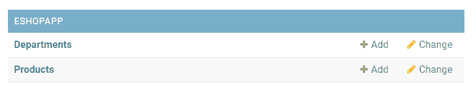
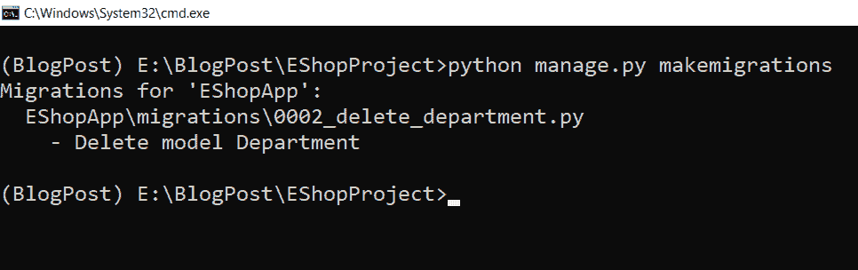
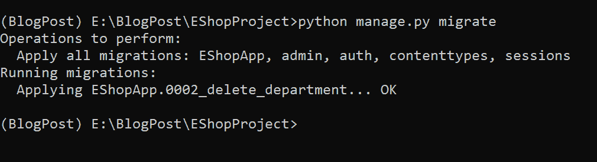

# 如何从 Python Django 中删除模式

> 原文：<https://pythonguides.com/how-to-delete-schema-from-python-django/>

[](https://sharepointsky.teachable.com/p/python-and-machine-learning-training-course)

在这个 [Python Django 教程](https://pythonguides.com/what-is-python-django/)中，我将一步一步解释如何从 Python Django 中**删除模式。**

最近，我一直在做一个 Django e-cart 项目，我错误地构建了一个部门模式。所以现在，我决定从您的 Django 项目中删除这个模式。

在这里我们将看到:

*   什么是图式
*   不同类型的模式
*   如何从 Python Django 项目中删除模式

我发现解决方案简单明了，我们将完全删除模型的模式，或者我们可以说我们从您的 Django 项目中删除了模型。

目录

[](#)

*   [如何从 Python Django 中删除模式](#How_to_Delete_Schema_from_Python_Django "How to Delete Schema from Python Django")
    *   [什么是模式](#What_is_schema "What is schema")
    *   [模式的类型](#Types_of_schema "Types of schema")
    *   [从 Python Django 项目中删除模式](#Delete_schema_from_Python_Django_project "Delete schema from Python Django project")
*   [结论](#Conclusion "Conclusion")

## 如何从 Python Django 中删除模式

### 什么是模式

在我们开始学习从 Django 项目数据库中删除模式的过程之前。我们需要对这个计划有一点了解。

数据库模式的框架结构是整个数据库的逻辑表示。它概述了数据的结构和连接它们的关系。

它描述了可以用模式图来说明的数据库。数据库设计人员创建模式是为了让程序员更容易理解和使用数据库。

阅读: [Python Django vs 金字塔](https://pythonguides.com/python-django-vs-pyramid/)

### 模式的类型

数据库模式可以大致分为两种类型:

*   物理数据库模式:这个模式处理数据如何保存在存储器中。
*   **逻辑数据库模式:**这概述了必须对存储的数据施加的所有逻辑限制。

阅读: [Python 改 Django 版本](https://pythonguides.com/python-change-django-version/)

### 从 Python Django 项目中删除模式

理解了模式之后，下一个任务是理解如何从 Django 项目中删除一个方案。

现在，我们所要做的就是删除应用程序的 `models.py` 文件中不必要定义的模型类。

让我们借助一个例子来理解这件事，在这个例子中，我们将删除**部门**模型类。

这里，我们将有一个名为 `EShopProject` 的 Django 项目和一个名为 `EShopApp` 的应用程序。

另外，该 app 有两种模式:**部门**和**产品**，如下图所示。

```py
from django.db import models

# Create your models here.

class Product(models.Model):
    product_id = models.IntegerField()
    name = models.CharField(max_length=150)
    description = models.TextField(max_length=2000)

    def __str__(self):
        return self.name

class Department(models.Model):
    department_id = models.IntegerField()
    name = models.CharField(max_length=250)

    def __str__(self):
        return self.name
```



Models in ESHOPAPP

因为我们的目标是删除**部门**模型。我们必须打开 `models.py` 文件，并从那里删除**部门**模型类。

这就是 `models.py` 文件现在的样子。

```py
from django.db import models

# Create your models here.

class Product(models.Model):
    id = models.IntegerField()
    name = models.CharField(max_length=150)
    description = models.TextField(max_length=2000)

    def __str__(self):
        return self.name
```

在上面的代码中，我们指定了一个名为 Product 的模型。这个产品模型包含 3 个属性，代表 Django 中产品表的 3 个表字段。此外，我们还指定了产品名称 Model 的字符串表示。

现在要影响数据库中的更改，使用下面给出的`make migrations`和 `migrate` 命令。

```py
python manage.py makemigrations
```



makemigrations

在 Django 中执行 makemigrations 命令后，我们需要执行 migrate 命令。Django 中的 migrate 命令如下所示。

```py
python manage.py migrate
```



migrating Database

在 Django 中执行了上面指定的两个命令之后，我们已经成功地从 Python Django 项目中删除了模式。

这就是我们如何从 Python Django 中删除数据库模式。

## 结论

这样，我们已经成功地从 Django 中删除了模式，并且获得了模式的概述。此外，我们还讨论了以下主题。

*   什么是计划
*   不同类型的模式
*   如何从 Python Django 项目中删除方案

您可能也喜欢阅读下面的 Python Django 教程。

*   [Python Django 格式日期](https://pythonguides.com/python-django-format-date/)
*   [Python Django 设置时区](https://pythonguides.com/python-django-set-timezone/)
*   [如何在 Django 中创建模型](https://pythonguides.com/create-model-in-django/)

[Tanya Puri](https://pythonguides.com/author/tanya/)

拥有丰富 Django 和 Matplotlib 经验的 Python 开发人员，目前在 TSInfo Technologies 工作。我正在成为专业程序员、博客写手和 YouTuber 的路上。