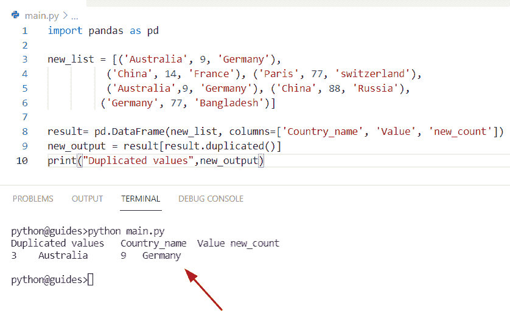
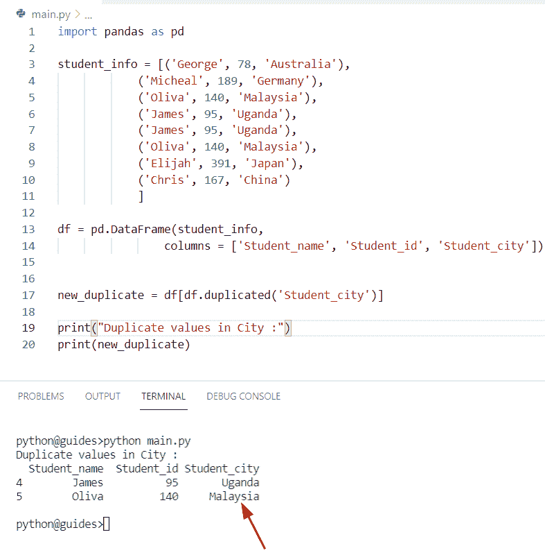
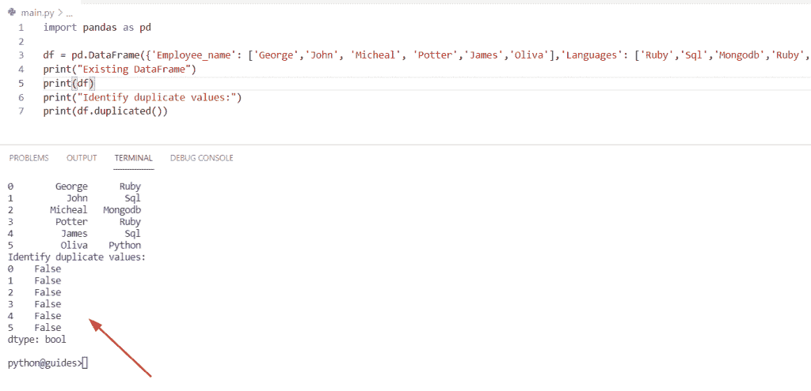
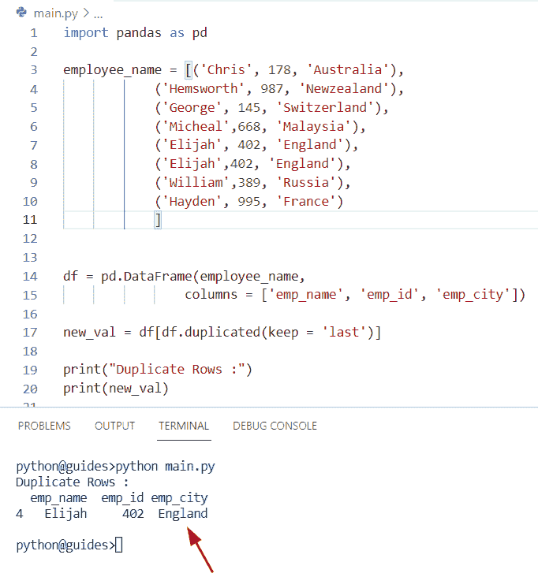
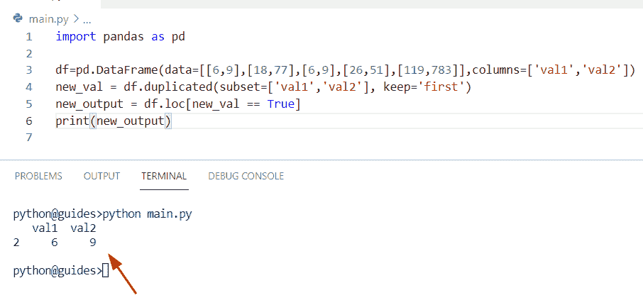
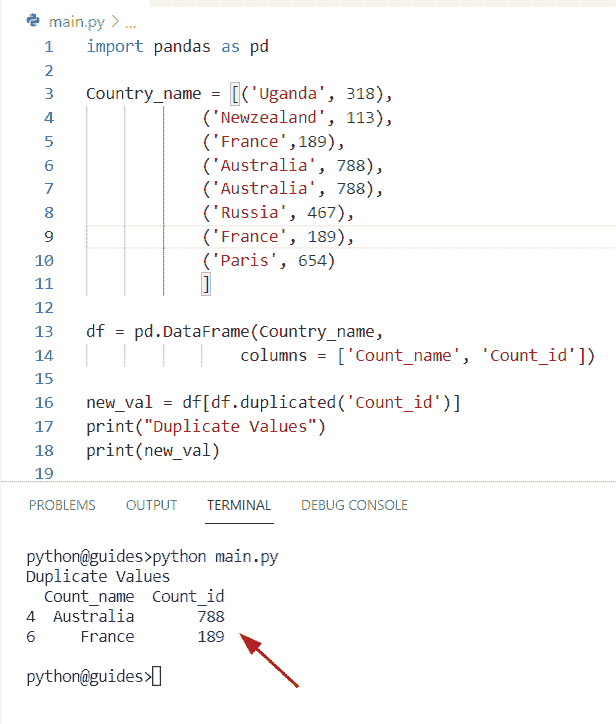
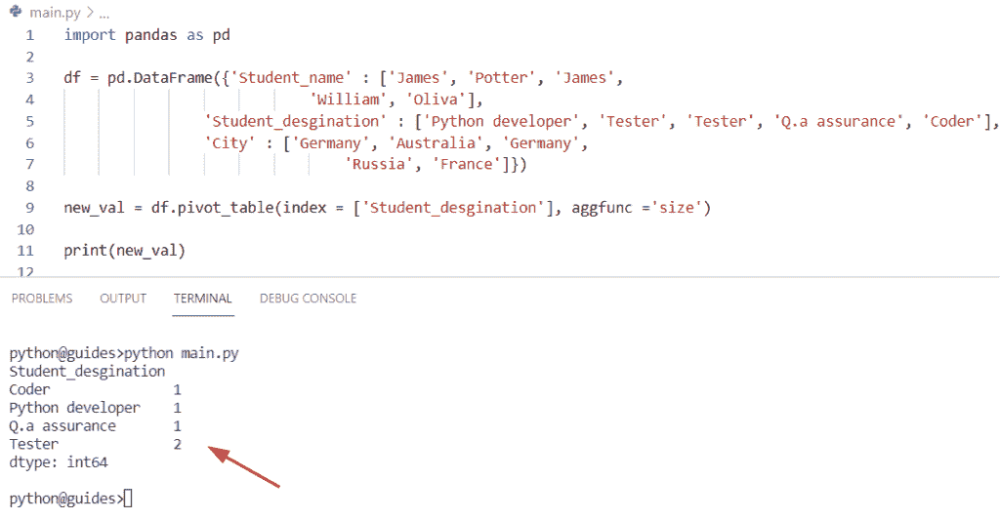

# 如何在 Python 数据帧中查找重复项

> 原文：<https://pythonguides.com/how-to-find-duplicates-in-python-dataframe/>

[](https://sharepointsky.teachable.com/p/python-and-machine-learning-training-course)

在这个 [Python Pandas](https://pythonguides.com/pandas-in-python/) 教程中，我们将学习如何使用 Pandas**在 Python 数据帧**中找到副本。此外，我们将涵盖这些主题。

*   如何识别 Python 数据帧中的重复项
*   如何在 Python 数据帧中查找重复值
*   如何在 Python DataFrame 中查找列中的重复项
*   如何计算 Pandas 数据帧中的重复行

目录

[](#)

*   [如何在 Python 数据帧中找到重复项](#How_to_Find_Duplicates_in_Python_DataFrame "How to Find Duplicates in Python DataFrame")
    *   [另一个在 Python 数据帧中寻找重复的例子](#Another_example_to_find_duplicates_in_Python_DataFrame "Another example to find duplicates in Python DataFrame")
*   [如何识别 Python 数据帧中的重复项](#How_to_identify_duplicates_in_Python_DataFrame "How to identify duplicates in Python DataFrame")
    *   [另一个识别熊猫数据帧中重复行值的例子](#Another_example_to_identify_duplicates_row_value_in_Pandas_DataFrame "Another example to identify duplicates row value in Pandas DataFrame")
*   [如何在 Python 数据帧中找到重复值](#How_to_find_duplicate_values_in_Python_DataFrame "How to find duplicate values in Python DataFrame")
*   [如何在 Python DataFrame 中查找列中的重复项](#How_to_find_duplicates_in_a_column_in_Python_DataFrame "How to find duplicates in a column in Python DataFrame")
*   [如何计算熊猫数据帧中的重复行](#How_to_Count_duplicate_rows_in_Pandas_DataFrame "How to Count duplicate rows in Pandas DataFrame")

## 如何在 Python 数据帧中找到重复项

*   在本期节目中，我们将讨论如何在熊猫数据帧中找到重复项。
*   为了完成这项任务，我们可以使用 Python 中的内置函数，如 `DataFrame.duplicate()` 来查找 Pandas DataFrame 中的重复值。
*   在 Python **中，DataFrame.duplicated()** 方法将帮助用户分析重复值，并且它将始终返回一个仅对于特定元素为真的布尔值。

**语法:**

下面是 DataFrame.duplicated()方法的语法

```py
DataFrame.duplicated
                    (
                     subset=None,
                     keep='first'
                    )
```

*   它由几个参数组成
    *   **Subset:** 该参数采用一列标签，应该用于重复检查，默认情况下，其值为 None。
    *   **keep:** 该参数指定需要标记为重复的值的出现。它有三个不同的值**‘First’，‘last’，‘False’**，默认情况下，它将‘First’值作为参数。

**举例:**

让我们基于这些函数来理解几个例子

**源代码:**

```py
import pandas as pd

new_list = [('Australia', 9, 'Germany'),
          ('China', 14, 'France'), ('Paris', 77, 'switzerland'),
          ('Australia',9, 'Germany'), ('China', 88, 'Russia'),
         ('Germany', 77, 'Bangladesh')]

result= pd.DataFrame(new_list, columns=['Country_name', 'Value', 'new_count'])
new_output = result[result.duplicated()]
print("Duplicated values",new_output)
```

在上面的代码中，我们选择了基于所有列的重复值。现在我们已经创建了一个 DataFrame 对象，在其中我们分配了一个 list**‘new _ list’**和列作为参数。之后，为了在 Pandas 数据帧中找到重复的值，我们使用了 **df。复制的()**函数。



How to Find Duplicates in Python DataFrame

### 另一个在 Python 数据帧中寻找重复的例子

在本例中，我们希望根据所选的列选择重复的行值。为了执行这个任务，我们可以使用 `DataFrame.duplicated()` 方法。现在，在这个程序中，我们将首先创建一个列表并在其中赋值，然后创建一个数据帧，在这个数据帧中，我们必须将 subset 中的列名列表作为参数传递。

**源代码:**

```py
import pandas as pd

student_info = [('George', 78, 'Australia'),
			('Micheal', 189, 'Germany'),
			('Oliva', 140, 'Malaysia'),
			('James', 95, 'Uganda'),
			('James', 95, 'Uganda'),
			('Oliva', 140, 'Malaysia'),
			('Elijah', 391, 'Japan'),
			('Chris', 167, 'China')
			]

df = pd.DataFrame(student_info,
				columns = ['Student_name', 'Student_id', 'Student_city'])

new_duplicate = df[df.duplicated('Student_city')]

print("Duplicate values in City :")
print(new_duplicate)
```

在上面的代码中，一旦打印出 **'new_duplicate'** ，输出将显示给定列表中的重复行值。

下面是以下给定代码的输出



How to Find Duplicates in Python DataFrame

还有，阅读: [Python 熊猫 CSV 教程](https://pythonguides.com/python-pandas-csv/)

## 如何识别 Python 数据帧中的重复项

*   在这里，我们可以看到如何使用 Python 来识别 Pandas 数据帧中的重复值。
*   在 Pandas 库中，DataFrame 类提供了一个函数来识别基于列的重复行值，该函数是 `DataFrame.duplicated()` 方法，它总是返回一个表示具有真值的重复行的布尔序列。

**举例:**

让我们举一个例子，看看如何在 Python 数据帧中识别重复的行值

```py
import pandas as pd

df = pd.DataFrame({'Employee_name': ['George','John', 'Micheal', 'Potter','James','Oliva'],'Languages': ['Ruby','Sql','Mongodb','Ruby','Sql','Python']})
print("Existing DataFrame")
print(df)
print("Identify duplicate values:")
print(df.duplicated())
```

在上面的例子中，我们在 Pandas 数据帧中设置了重复的值，然后应用了方法 **df。duplicated()** 它将检查数据帧中是否存在重复值，然后显示“真”。如果 DataFrame 中不存在重复值，则它将显示“False”布尔值。

你可以参考下面的截图



How to identify duplicates in Python DataFrame

### 另一个识别熊猫数据帧中重复行值的例子

在本例中，我们将基于所有列选择重复的行。为了完成这个任务，我们将传递 **keep= 'last'** 作为参数，这个参数指定除了最后一次出现之外的所有重复项，它将被标记为' True '。

**源代码:**

```py
import pandas as pd

employee_name = [('Chris', 178, 'Australia'),
			('Hemsworth', 987, 'Newzealand'),
			('George', 145, 'Switzerland'),
			('Micheal',668, 'Malaysia'),
			('Elijah', 402, 'England'),
			('Elijah',402, 'England'),
			('William',389, 'Russia'),
			('Hayden', 995, 'France')
			]

df = pd.DataFrame(employee_name,
				columns = ['emp_name', 'emp_id', 'emp_city'])

new_val = df[df.duplicated(keep = 'last')]

print("Duplicate Rows :")
print(new_val)
```

在上面的代码中，我们首先导入了 Pandas 库，然后创建了一个元组列表，我们在其中分配了行的值，并创建了一个 dataframe 对象，并将 **keep='last'** 作为参数传递。一旦您打印了**‘new _ val’**，那么输出将显示熊猫数据帧中出现的重复行。

下面是以下给定代码的执行过程



How to identify duplicates in Python DataFrame

阅读:[Python 熊猫中的交叉表](https://pythonguides.com/crosstab-in-python-pandas/)

## 如何在 Python 数据帧中找到重复值

*   让我们看看如何在 Python 数据帧中找到重复值。
*   现在我们要检查这个数据帧是否包含任何重复的元素。为了完成这个任务，我们可以结合使用 `df.loc()` 和 `df.duplicated()` 方法。
*   在 Python 中， `loc()` 方法用于检索一组行和列，它只接受索引标签，而 `DataFrame.duplicated()` 方法将帮助用户分析 Pandas DataFrame 中的重复值。

**源代码:**

```py
import pandas as pd

df=pd.DataFrame(data=[[6,9],[18,77],[6,9],[26,51],[119,783]],columns=['val1','val2'])
new_val = df.duplicated(subset=['val1','val2'], keep='first')
new_output = df.loc[new_val == True]
print(new_output) 
```

在上面的代码中，我们首先创建了一个 dataframe 对象，并在其中分配了列值。现在我们想使用 **df 替换给定数据帧中的重复值。**方法复制()。

下面是以下给定代码的实现



How to find duplicate values in Python DataFrame

阅读:[Python 熊猫中的 group by](https://pythonguides.com/groupby-in-python-pandas/)

## 如何在 Python DataFrame 中查找列中的重复项

*   在本期节目中，我们将讨论如何使用 Pandas DataFrame 在特定列中查找重复项。
*   通过使用 DataFrame.duplicate()方法，我们可以在 Python DataFrame 中找到重复值。

**举例:**

让我们举一个例子，看看如何在一列中找到重复的值

**源代码:**

```py
import pandas as pd

Country_name = [('Uganda', 318),
			('Newzealand', 113),
			('France',189),
			('Australia', 788),
			('Australia', 788),
			('Russia', 467),
			('France', 189),
			('Paris', 654)
			]

df = pd.DataFrame(Country_name,
				columns = ['Count_name', 'Count_id'])

new_val = df[df.duplicated('Count_id')]
print("Duplicate Values")
print(new_val)
```

下面是以下给定代码的输出



How to find duplicates in a column in Python DataFrame

阅读: [Python 熊猫掉行](https://pythonguides.com/python-pandas-drop-rows-example/)

## 如何计算熊猫数据帧中的重复行

*   让我们看看如何计算 Pandas 数据帧中的重复行。
*   通过使用 `df.pivot_table` 我们可以执行这个任务。在 Python 中, `pivot()` 函数用于根据给定的列值重塑 Pandas 数据帧，该方法可以处理一个旋转对的重复值。
*   在 Python 中， `pivot_table()` 用于计算一列中的重复数。

**源代码:**

```py
import pandas as pd

df = pd.DataFrame({'Student_name' : ['James', 'Potter', 'James',
							'William', 'Oliva'],
				'Student_desgination' : ['Python developer', 'Tester', 'Tester', 'Q.a assurance', 'Coder'],
				'City' : ['Germany', 'Australia', 'Germany',
								'Russia', 'France']})

new_val = df.pivot_table(index = ['Student_desgination'], aggfunc ='size')

print(new_val)
```

在上面的代码中，我们将首先导入一个 Pandas 模块，然后创建一个 DataFrame 对象，在该对象中我们分配了键值对元素，并将它们视为列值。

您可以参考下面的屏幕截图来计算数据帧中的重复行



How to Count duplicate rows in Pandas DataFrame

你可能也喜欢阅读以下关于熊猫的教程。

*   [如何将熊猫数据帧转换成字典](https://pythonguides.com/how-to-convert-pandas-dataframe-to-a-dictionary/)
*   [在熊猫中把整数转换成日期时间](https://pythonguides.com/convert-integers-to-datetime-in-pandas/)
*   [检查 Python Pandas 中的数据帧是否为空](https://pythonguides.com/check-if-dataframe-is-empty-in-python-pandas/)
*   [Python 熊猫写数据帧到 Excel](https://pythonguides.com/python-pandas-write-dataframe-to-excel/)
*   [如何在 Python Pandas 中向数据帧添加列](https://pythonguides.com/add-a-column-to-a-dataframe-in-python-pandas/)
*   [将 Pandas 数据帧转换为 NumPy 数组](https://pythonguides.com/convert-pandas-dataframe-to-numpy-array/)
*   [如何在 Python Pandas 中设置列为索引](https://pythonguides.com/set-column-as-index-in-python-pandas/)
*   [向数据帧添加行 Python 熊猫](https://pythonguides.com/add-row-to-dataframe-python-pandas/)

在这个 Python Pandas 教程中，我们已经学习了如何使用 Pandas 在 Python 数据帧中**找到副本。此外，我们已经讨论了这些主题。**

*   如何识别 Python 数据帧中的重复项
*   如何在 Python 数据帧中查找重复值
*   如何在 Python DataFrame 中查找列中的重复项
*   如何计算 Pandas 数据帧中的重复行

[Bijay Kumar](https://pythonguides.com/author/fewlines4biju/)

Python 是美国最流行的语言之一。我从事 Python 工作已经有很长时间了，我在与 Tkinter、Pandas、NumPy、Turtle、Django、Matplotlib、Tensorflow、Scipy、Scikit-Learn 等各种库合作方面拥有专业知识。我有与美国、加拿大、英国、澳大利亚、新西兰等国家的各种客户合作的经验。查看我的个人资料。

[enjoysharepoint.com/](https://enjoysharepoint.com/)[](https://www.facebook.com/fewlines4biju "Facebook")[](https://www.linkedin.com/in/fewlines4biju/ "Linkedin")[](https://twitter.com/fewlines4biju "Twitter")