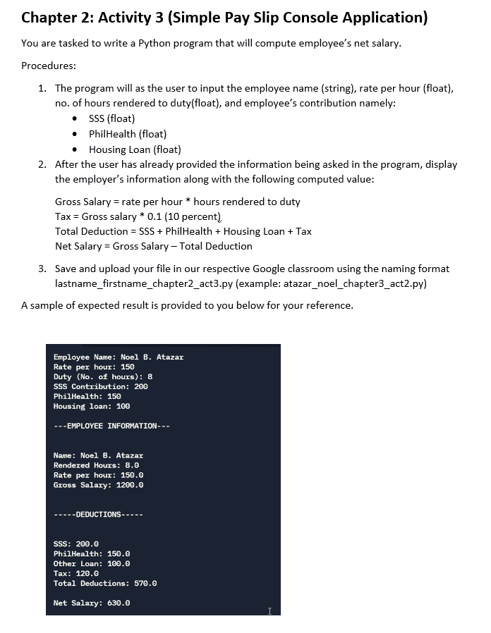
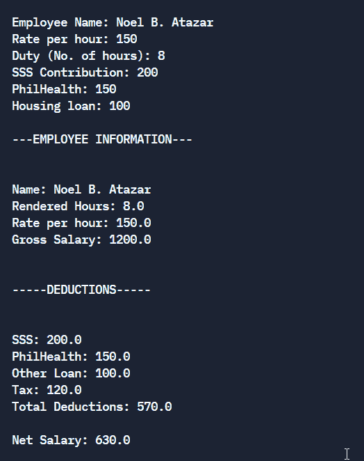
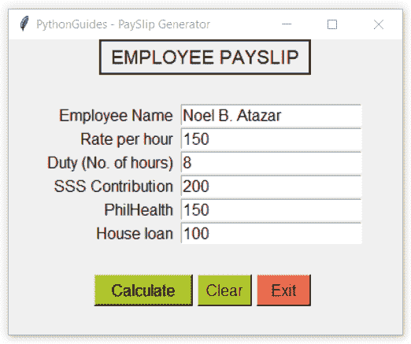
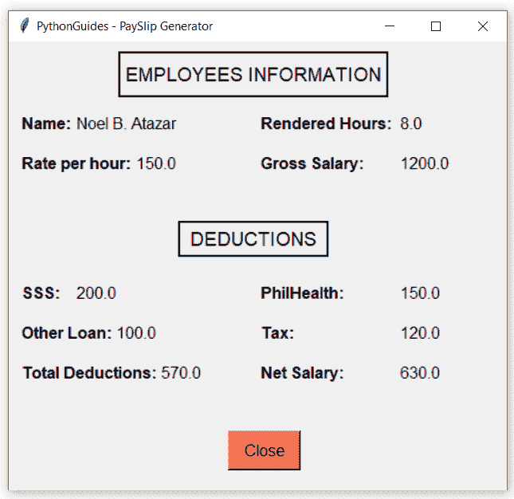

# 如何使用 Python Tkinter +视频教程生成工资条

> 原文：<https://pythonguides.com/how-to-generate-payslip-using-python-tkinter/>

[](https://sharepointsky.teachable.com/p/python-and-machine-learning-training-course)

在本 [Python 教程](https://pythonguides.com/learn-python/)中，您将学习如何使用 Python 控制台和图形用户界面(GUI)创建工资单生成器。在这篇博客结束时，你将拥有完整的知识和源代码**使用 python Tkinter** 在 Python 中创建工资单生成器。

目录

[](#)

*   [业务需求](#Business_Requirement "Business Requirement")
*   [使用 python 控制台的简单工资单应用程序](#Simple_Payslip_application_using_python_console "Simple Payslip application using python console")
*   [使用 python tkinter 的简单工资单应用程序](#Simple_payslip_application_using_python_tkinter "Simple payslip application using python tkinter")

## 业务需求

最近，我们收到了用 python 创建工资单应用程序的要求。这是一个简单的控制台应用程序，接受输入，如员工姓名、工作时间、小时工资等。

应用程序使用这些信息生成一个输出，其中员工信息和扣除额显示在 python 控制台上。

尽管应用程序的需求是基于控制台的，但我们已经使用控制台和基于 GUI 的方式创建了它。对于图形用户界面(GUI ),我们使用了 python 库——Tkinter。

如果您是 Python Tkinter 的新手，请查看 [Python GUI 编程(Python Tkinter)](https://pythonguides.com/python-gui-programming/)

下面是我们收到的要求的图像:



payslip console application

*   使用 python 控制台的简单工资单应用程序
*   使用 python tkinter 的简单工资单应用程序

另外，请查看，[如何使用 Pyinstaller 将 Python 文件转换为 exe 文件](https://pythonguides.com/convert-python-file-to-exe-using-pyinstaller/)

## 使用 python 控制台的简单工资单应用程序

工资单应用程序接受员工的详细信息，如姓名、工作时间、每小时工资、sss 缴款、Phil health 和住房贷款。

使用这些信息，可以生成一个工资条，工资条中包含所有扣除额的员工信息，最后显示净工资。

**源代码:**

在下面的源代码中，python `input()` 方法用于获取用户输入。默认情况下，用户提供的输入是字符串数据类型。

*   通过在 input()方法前添加数据类型名称，我们可以将用户输入转换为首选的数据类型。如下面的代码所示，我们将用户输入转换为浮点数据类型。
*   值班天数乘以每小时工资率将得出员工的总工资。
*   税是总工资的 10%
*   将社会保障系统缴款、健康保险、房屋贷款和税收相加，将得出总扣除额
*   从总薪资中减去总扣除额以获得净薪资信息。

```py
**# User inputs**
emp_name = input('Employee Name: ')
rph = float(input('Rate per hour: '))
duty = float(input('Duty (No. of hours): '))
s3_contrib = float(input('SSS Contribution: '))
phealth = float(input('PhilHealth: '))
hloan = float(input('Housing loan: '))

print('')
print('-'*3+'EMPLOYEE INFORMATION'+'-'*3)
print('')

**# Net salary calculation**
gross_sal = rph * duty
tax = gross_sal * 0.1
total_deduction = s3_contrib + phealth + hloan + tax
net_sal = gross_sal - total_deduction

**# display information using formatted string**
print(f'''
Name: {emp_name}
Rendered Hours: {duty}
Rate per hour: {rph}
Gross Salary: {gross_sal}
''')

print('')
print('-'*5+'DEDUCTIONS'+'-'*5)
print('')

print(f'''
SSS: {s3_contrib}
PhilHealth: {phealth}
Other Loan: {hloan}
Tax: {tax}
Total Deductions: {total_deduction}

Net Salary: {net_sal}
''') 
```

**输出:**

在下面的输出中，用户提供了前 6 个输入，其余的由应用程序生成。该信息分为两个部分-员工信息和扣减。并且最后计算出手里的净工资。



payslip console application using python

阅读[在 Python Tkinter 中创建 Word 文档](https://pythonguides.com/create-word-document-in-python-tkinter/)

## 使用 python tkinter 的简单工资单应用程序

Python Tkinter 允许 Python 开发者编写基于 GUI 的软件。各种各样的小部件允许创建一个用户友好的界面，允许轻松访问应用程序。

在本节中，我们创建了一个基于 GUI 的应用程序，它通过入口小部件接受用户输入，并在交互式窗口中显示结果。该程序是使用 Tkinter 模块用 python 编写的。

代码分为两部分。在第一部分中，我们使用 Python Tkinter 创建了一个交互式表单。填写交互式表单，然后单击“计算”按钮以生成工资单。另一部分在新窗口中显示输出。

**源代码:**

在下面的代码中，Tkinter 模块是导入的，calsal 模块是我们创建的，我们将在下一部分讨论它。

*   用名称 `main.py` 保存这段代码
*   ws 是在 python 中为 tkinter 对象创建的实例。
*   当按下清除按钮时，清除功能清除所有的入口部件。`**<entry_widget_name>.delete(0, 'end')**`。这里，0 表示起点，end 表示 python tkinter entry 小部件中的最后一个字符。
*   退出按钮将终止程序的所有实例。使用匿名函数(lambda ),我们在一行中创建了退出函数-**`lambda: ws.destroy()`**这里，ws 是当前窗口实例的名称。
*   Python 函数名–`Main()`包含将在基于 tkinter 的 GUI 中生成工资单详细信息的算法。
*   以下公式用于计算员工的净工资:

```py
gross_sal = r * d
tax = gross_sal * 0.1
total_deduction = contri + ph + hl + tax
net_sal = gross_sal - total_deduction
```

*   Grid geomertry 方法用于在 tkinter 窗口上放置小部件。了解更多关于[t 内部网格几何](https://pythonguides.com/python-tkinter-grid/)方法的信息。
*   入口小部件用于接收用户输入。String 是入口小部件的默认数据类型。使用 **`<entry>.get()`** 方法，可以从入口小部件中获取信息。了解关于 python tkinter 中的[入口小部件的更多信息。](https://pythonguides.com/python-tkinter-entry/)

```py
calsal.payslip(ename, d, r, gross_sal, contri, ph, hl, tax, total_deduction, net_sal, ws, f)
```

*   上面的代码显示了 calsal 函数的调用。我们在本模块中创建了一个功能工资单。工资单功能接受上述参数。
*   这个函数负责生成交互式输出窗口。

```py
**# modules**
from tkinter import *
import calsal

**# tkinter object** 
ws = Tk()
ws.title('PythonGuides - PaySlip Generator')
ws.geometry('400x300')

f = 'sans-serif, 12'

**# functions**
def clearbtn():
    emp_name.delete(0, 'end')
    rph.delete(0, 'end')
    duty.delete(0, 'end')
    s3_contrib.delete(0, 'end')
    phealth.delete(0, 'end')
    hloan.delete(0, 'end')

def main():
    ename = emp_name.get()
    r = rph.get()
    d = duty.get()
    contri = s3_contrib.get()
    ph = phealth.get()
    hl = hloan.get()

    r = float(r)
    d = float(d) 
    contri = float(contri)
    ph = float(ph)
    hl = float(hl)

    gross_sal = r * d
    tax = gross_sal * 0.1
    total_deduction = contri + ph + hl + tax
    net_sal = gross_sal - total_deduction

 **# calling function**
    calsal.payslip(ename, d, r, gross_sal, contri, ph, hl, tax, total_deduction, net_sal, ws, f)

Label(
    ws,
    text="EMPLOYEE PAYSLIP",
    font=('sans-serif, 14'),
    relief=SOLID,
    padx=10,
    pady=5
).pack()

**# frame widget**
mainframe = Frame(ws, padx=5, pady=5)
mainframe.pack(expand=True)

**# label widget**
Label(
    mainframe,
    text='Employee Name',
    font=f
    ).grid(row=2, column=0, sticky='e')

Label(
    mainframe,
    text='Rate per hour',
    font=f
    ).grid(row=3, column=0, sticky='e')

Label(
    mainframe,
    text='Duty (No. of hours)',
    font=f
    ).grid(row=4, column=0, sticky='e')

Label(
    mainframe,
    text='SSS Contribution',
    font=f
    ).grid(row=5, column=0, sticky='e')

Label(
    mainframe,
    text='PhilHealth',
    font=f
    ).grid(row=6, column=0, sticky='e')

Label(
    mainframe,
    text='House loan',
    font=f
    ).grid(row=7, column=0, sticky='e')

**# Entry widgets**
emp_name = Entry(mainframe, font=f)
rph = Entry(mainframe, font=f)
duty = Entry(mainframe, font=f)
s3_contrib = Entry(mainframe, font=f)
phealth = Entry(mainframe, font=f)
hloan = Entry(mainframe, font=f)

**# geometry method - Grid**
emp_name.grid(row=2, column=1, padx=5)
rph.grid(row=3, column=1, padx=5, sticky='w')
duty.grid(row=4, column=1, padx=5, sticky='w')
s3_contrib.grid(row=5, column=1, padx=5, sticky='w')
phealth.grid(row=6, column=1, padx=5, sticky='w')
hloan.grid(row=7, column=1, padx=5, sticky='w')

**# default values in the entry widget**
emp_name.insert('0', 'Noel B. Atazar')
rph.insert('0', 150)
duty.insert('0', 9)
s3_contrib.insert('0', 200)
phealth.insert('0', 150)
hloan.insert('0', 100)

**# frame for buttons**
frame = Frame(mainframe)
frame.grid(row=8, columnspan=3, pady=(30, 0))

**# button widget**
Button(
    frame,
    text='Calculate',
    width=10,
    command=main,
    font=f,
    bg='#91BF2C'
).pack(side=LEFT, expand=True, padx=(0, 5))

Button(
    frame,
    text='Clear',
    width=5,
    font=f,
    bg='#E6D92A',
    command=clearbtn
).pack(side=LEFT, expand=True, padx=(0, 5))

Button(
    frame,
    text='Exit',
    width=5, 
    font=f,
    bg='#FF614F',
    command=lambda:ws.destroy()
).pack(side=LEFT, expand=True, padx=(0, 5))

**# infinite loop**
ws.mainloop()
```

**输出:**

这是上述代码的输出，这是一个交互式的表单，一旦要求被满足，单击计算按钮产生工资单。清除按钮将清除输入框，退出按钮将终止程序。



Payslip GUI application using Python Tkinter

**源代码:**

用名称 `calsal.py` 保存该文件。main.py 文件将使用这个模块来显示输出。

```py
**# module**
from tkinter import *

**# function**
def payslip(ename, d, r, gross_sal, contri, ph, hl, tax, total_deduction, net_sal, ws, f):
    cf = ('sans-serif 12 bold')
    win = Toplevel(ws)
    win.geometry('500x450+500+200')  

    Label(
        win, 
        text='EMPLOYEES INFORMATION', 
        font='sans-serif 14', 
        relief=SOLID, padx=5, 
        pady=10
        ).place(x=110 , y=10)

    Label(
        win, 
        text='Name: ', 
        font=cf
        ).place(x=10, y=70)

    Label(
        win, 
        text=f'{ename}', 
        font=f
        ).place(x=65, y=70)

    Label(
        win, 
        text='Rendered Hours: ', 
        font=cf
        ).place(x=250, y=70)

    Label(
        win, 
        text=f'{d}', 
        font=f
        ).place(x=390, y=70)

    Label(
        win, 
        text='Rate per hour: ', 
        font=cf
        ).place(x=10, y=110)

    Label(
        win, 
        text=f'{r}', 
        font=f
        ).place(x=125, y=110)

    Label(
        win, 
        text='Gross Salary: ',
        font=cf
        ).place(x=250, y=110)

    Label(
        win, 
        text=f'{gross_sal}', 
        font=f
        ).place(x=390, y=110)

    Label(
        win, 
        text='DEDUCTIONS',
        font='sans-serif 14', relief=SOLID, 
        pady=5, padx=10
        ).place(x=170, y=180)

    Label(
        win, 
        text='SSS: ', 
        font=cf
        ).place(x=10, y=240)

    Label(
        win, 
        text=f'{contri}', 
        font=f
        ).place(x=65, y=240)

    Label(
        win, 
        text='PhilHealth: ', 
        font=cf
        ).place(x=250, y=240)

    Label(
        win, 
        text=f'{ph}', 
        font=f
        ).place(x=390, y=240)

    Label(
        win, 
        text='Other Loan:', 
        font=cf
        ).place(x=10, y=280)

    Label(
        win,
        text=f'{hl}', 
        font=f
        ).place(x=105, y=280)

    Label(
        win, 
        text='Tax: ', 
        font=cf
        ).place(x=250, y=280)

    Label(
        win, 
        text=f'{tax}', 
        font=f
        ).place(x=390, y=280)

    Label(
        win, 
        text='Total Deductions: ', 
        font=cf
        ).place(x=10, y=320)

    Label(
        win, 
        text=f'{total_deduction}',
        font=f
        ).place(x=150, y=320)

    Label(
        win, 
        text='Net Salary:', 
        font=cf
        ).place(x=250, y=320)

    Label(
        win, 
        text=f'{net_sal}', 
        font=f
        ).place(x=390, y=320)

    Button(
        win, 
        text='Close', 
        padx=10, 
        pady=5, 
        font=f, 
        bg='#FF614F', 
        command=lambda:win.destroy()
        ).place(x=220, y=390) 
```

**输出:**

在此输出中，该窗口共享员工信息和薪资中的扣减额。净工资是员工将收到的手头金额。底部的关闭按钮将关闭此窗口。



Payslip GUI application using Python Tkinter

在本教程中，我们学习了如何使用控制台创建工资单应用程序，以及如何使用 Python Tkinter 生成工资单。如果您有任何疑问或建议，请写信给我们。

*   使用 python 控制台的简单工资单应用程序
*   使用 python Tkinter 的简单工资单应用程序

相关 Python Tkinter 教程:

*   [Python 数字猜谜游戏](https://pythonguides.com/python-number-guessing-game/)
*   [Python Tkinter 过滤函数()](https://pythonguides.com/python-tkinter-filter/)
*   [Python Tkinter 面板](https://pythonguides.com/python-tkinter-panel/)
*   [Python Tkinter add 函数示例](https://pythonguides.com/python-tkinter-add-function/)
*   [Python Tkinter 保存文本到文件](https://pythonguides.com/python-tkinter-save-text-to-file/)

[Bijay Kumar](https://pythonguides.com/author/fewlines4biju/)

Python 是美国最流行的语言之一。我从事 Python 工作已经有很长时间了，我在与 Tkinter、Pandas、NumPy、Turtle、Django、Matplotlib、Tensorflow、Scipy、Scikit-Learn 等各种库合作方面拥有专业知识。我有与美国、加拿大、英国、澳大利亚、新西兰等国家的各种客户合作的经验。查看我的个人资料。

[enjoysharepoint.com/](https://enjoysharepoint.com/)[](https://www.facebook.com/fewlines4biju "Facebook")[](https://www.linkedin.com/in/fewlines4biju/ "Linkedin")[](https://twitter.com/fewlines4biju "Twitter")