# 如何在 Django 获取当前时间

> 原文：<https://pythonguides.com/how-to-get-current-time-in-django/>

[](https://sharepointsky.teachable.com/p/python-and-machine-learning-training-course)

在本 [Django 教程](https://pythonguides.com/what-is-python-django/)中，我们将了解**如何在 Django** 获取当前时间。我们还将了解**如何获得当前日期**以及**日期时间**值。另外，讨论如何在 Django 中使用它们。这是我们将要涉及的主题列表。

*   获取 django 中的当前日期时间
*   获取 django 的当前时间
*   获取 django 的当前日期
*   获取 django 模板中的当前时间
*   获取 django 模板中的当前日期
*   获取 django 模板中的当前日期时间

目录

[](#)

*   [获取 Django 中的当前日期时间](#Get_current_Datetime_in_Django "Get current Datetime in Django ")
*   [获取姜戈的当前时间](#Get_current_time_in_Django "Get current time in Django ")
    *   [使用日期时间类](#Using_datetime_class "Using datetime class")
    *   [使用时间模块](#Using_time_module "Using time module")
*   [获取 Django 的当前日期](#Get_current_date_in_Django "Get current date in Django")
*   [获取 django 模板中的当前时间](#Get_current_time_in_django_template "Get current time in django template")
    *   [使用视图文件](#Using_Views_file "Using Views file")
    *   [使用模板标签](#Using_Template_Tags "Using Template Tags")
*   [获取 django 模板中的当前日期](#Get_current_date_in_django_template "Get current date in django template ")
    *   [使用视图文件](#Using_Views_file-2 "Using Views file ")
    *   [使用模板标签](#Using_Template_Tags-2 "Using Template Tags")
*   [获取 django 模板中的当前日期时间](#Get_current_Datetime_in_django_template "Get current Datetime in django template ")
    *   [使用视图文件](#Using_Views_file-3 "Using Views file ")
    *   [使用模板标签](#Using_Template_Tags-3 "Using Template Tags ")

## 获取 Django 中的当前日期时间

在 Django 中获取当前日期时间值的最简单方法是使用 python 的**日期时间**模块。这个 `datetime` 模块包含许多不同的类，可以用来操作日期和时间值。

我们可以通过在 Django 应用程序的 `views.py` 文件中导入 `datetime` 模块来轻松使用这些类。

现在，为了获取当前的**日期时间**值，我们将使用**日期时间**模块中可用的**日期时间**类。让我们按照给定的步骤来理解实现。

*   首先，打开 Django 应用程序的 `views.py` 文件，导入 `datetime` 模块。
*   接下来，使用 `datetime.now()` 方法获取当前日期和时间值。
*   现在，我们可以将这个方法赋给一个变量，也可以在需要日期时间值的地方直接使用这个方法。

现在，让我们基于这些步骤执行一个示例，并理解实现。为此，我们在我们的 `views.py` 文件中添加了以下代码。

```py
from django.http import HttpResponse
import `datetime`

def index(request):
    current_datetime = `datetime`.datetime.now()  
    html = "<html><body><b>Current Date and Time Value:</b> %s</body></html>" % current_datetime
    return HttpResponse(html)
```

在示例中，我们导入了 `datetime` 模块，并使用其 `datetime.now()` 方法将日期时间值存储在变量中。然后，我们在一个 `HttpResponse` 中使用这个变量。

现在，如果我们启动开发服务器并移动到映射的 URL，我们将得到以下结果。

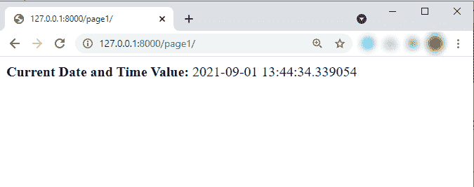

Get Current time in Django

阅读: [Python Django vs Flask](https://pythonguides.com/python-django-vs-flask/)

## 获取姜戈的当前时间

现在，如果我们只想要 Django 应用程序中的当前时间值，该怎么办呢？因此，在本节中，我们将了解如何获取 Django 中的当前时间。

有多种方法可以在应用程序中获取和使用当前时间值。在这一节中，我们将尝试理解其中的大部分。

1.  使用日期时间类
2.  使用时间模块

### 使用日期时间类

现在，在这个方法中，我们将使用 `datetime` 类，它在 `datetime` 类中。有两种方法可以使用它来获得当前时间。

在第一个方法中，我们将使用 `datetime.strftime()` 方法创建一个表示当前时间的字符串。下面是一个在 `views.py` 文件中使用 `strftime()` 方法的例子。

```py
from django.http import HttpResponse
from datetime import datetime

def index(request):
    current_time = datetime.now().strftime('%H:%M:%S')   
    html = "<html><body><b>Current Time Value:</b> %s</body></html>" % current_time
    return HttpResponse(html)
```

在上面的例子中，我们从**日期时间**模块中导入了**日期时间**类。接下来，我们创建了一个名为**索引**的视图。在这个视图中，我们使用 `datetime.strftime()` 方法将当前时间值存储在一个变量中。然后，我们使用变量返回当前时间值作为 HTTP 响应。

现在，如果我们运行开发服务器并移动到映射的 URL，我们将得到以下输出。

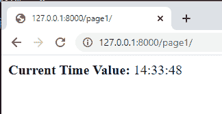

Get Current time in Django

在第二种方法中，我们将创建一个 time 对象来获取当前时间。为此，我们将使用 **datetime.now()。time()** 方法，它会将日期时间值更改为唯一的时间值。下面是我们如何在 `views.py` 文件中创建一个时间对象。

```py
from django.http import HttpResponse
from datetime import datetime

def index(request):
    current_time = datetime.now().time()  
    html = "<html><body><b>Current Time Value:</b> %s</body></html>" % current_time
    return HttpResponse(html)
```

现在，如果我们启动开发服务器并打开 URL，我们将得到以下结果。

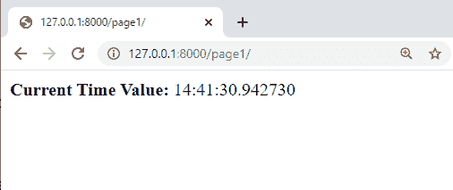

Output

阅读 [Python Django 获取](https://pythonguides.com/python-django-get/)

### 使用时间模块

现在，在这一节中，我们将了解如何使用时间模块来获取 Django 中的当前时间值。

时间模块是一个 python 模块，包含各种与时间相关的函数。让我们借助下面的例子来理解如何使用它。

```py
from django.http import HttpResponse
import time

def index(request):
    t = time.localtime()
    current_time = time.strftime("%H:%M:%S", t)  
    html = "<html><body><b>Current Time Value:</b> %s</body></html>" % current_time
    return HttpResponse(html)
```

在上面的例子中，首先，我们已经导入了时间模块，然后，我们正在创建一个视图。在视图中，我们定义了一个变量" `t` "来获取当前时间。

之后，我们使用 `strftime()` 方法来格式化时间值。最后，我们将使用 HTTP 响应返回时间值。下面是上面例子的结果。

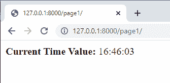

Result

阅读:[如何安装 Django](https://pythonguides.com/how-to-install-django/)

## 获取 Django 的当前日期

到目前为止，我们已经讨论了如何**获取当前日期时间和时间值**。现在，在这一节中，我们将讨论**如何在 Django** 获取当前日期。

现在，在 python 中有很多方法可以获得当前日期，我们也可以使用同样的方法在 Django 中获得当前日期。

获取当前日期最简单的方法是使用 `datetime` 模块。使用**日期时间**模块获取当前日期有两种方法。

第一种方法是使用 `date.today()` 方法，该方法返回当前日期。下面是一个在 `views.py` 文件中使用 `date.today()` 方法的例子。

```py
from django.http import HttpResponse
import datetime

def index(request):
    current_date = datetime.date.today()  
    html = "<html><body><b>Today\'s Date:</b> %s</body></html>" % current_date
    return HttpResponse(html)
```

在本例中，首先，我们导入了 datetime 模块。之后，我们使用 `date.today()` 方法将当前日期存储在名为 `current_date` 的变量中。最后，我们将日期作为 HTTP 响应返回。

现在，如果我们启动开发服务器并打开 URL，我们将得到以下结果。

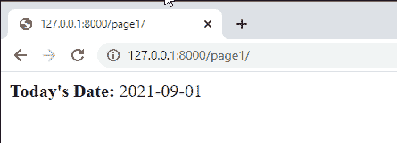

Result

第二种方法是使用来自**日期时间**模块的**日期时间**类。在此，我们必须使用 **datetime.now()。date()** 方法获取当前日期。下面是一个使用 **datetime.now()的例子。**日期()【方法】在姜戈。

```py
from django.http import HttpResponse
from datetime import datetime

def index(request):
    current_date = datetime.now().date()  
    html = "<html><body><b>Today\'s Date:</b> %s</body></html>" % current_date
    return HttpResponse(html)
```

在示例中，我们从**日期时间**模块中导入了**日期时间**类。接下来，我们使用 **datetime.now()。**date()【方法】将当前日期值存储在一个变量中。

最后，我们返回变量作为响应。这个例子也将返回如上所示的相同结果。

阅读:[如何设置 Django 项目](https://pythonguides.com/setup-django-project/)

## 获取 django 模板中的当前时间

到目前为止，我们只讨论了获取视图文件中的当前日期和时间。现在，我们将了解如何在 Django 模板中获取当前日期和时间。

在 Django 中，有两种方法可以获取模板中的当前时间。第一种方法是获取 views.py 文件中的当前时间，并将其发送到模板页面。

然后，在模板中使用它来获得输出。第二种方法是使用 Django 模板标签获取当前时间。

在本节中，我们将通过举例来讨论这两种方法。

### 使用视图文件

在第一个方法中，我们将使用 `views.py` 获取当前时间，然后将其发送到模板。为此，我们在我们的 `views.py` 文件中添加了以下代码。

```py
from django.shortcuts import render
from datetime import datetime

def index(request):
    current_time = datetime.now().time()  
    return render(request, 'index.html', {'current_time':current_time})
```

在上面的代码中，我们创建了一个名为 `index` 的基于函数的视图。在这个视图中，我们使用 **datetime.now()定义了一个变量来存储当前时间的值。时间()**法。然后，我们将变量发送到 index.html 的**页面。**

现在，为了使用变量显示当前时间，我们必须将以下代码添加到`index.html`页面。

```py
<!DOCTYPE html>
<html lang="en">
<head>
    <meta charset="UTF-8">
    <meta http-equiv="X-UA-Compatible" content="IE=edge">
    <meta name="viewport" content="width=device-width, initial-scale=1.0">
    <title>Python Guides</title>
</head>
<body>
   <b>Current Time: </b>{{current_time}}
</body>
</html>
```

现在，如果我们启动开发服务器并打开 URL，我们将得到以下结果。

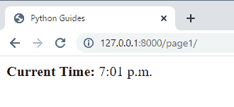

Output

### 使用模板标签

在这种方法中，我们将简单地创建一个将重定向到 HTML 页面的视图。之后，在模板中，我们将使用“ `now` 标签来获取当前时间。首先， `views.py` 文件的代码如下。

```py
from django.shortcuts import render

def index(request):
    return render(request, 'index.html')
```

接下来，我们将把下面的代码添加到`index.html`文件中以获得结果。

```py
<!DOCTYPE html>
<html lang="en">
<head>
    <meta charset="UTF-8">
    <meta http-equiv="X-UA-Compatible" content="IE=edge">
    <meta name="viewport" content="width=device-width, initial-scale=1.0">
    <title>Python Guides</title>
</head>
<body>
   <b>Current Time: </b>
</body>
</html>
```

在上面的代码中， **** 标签会返回当前的时间值。下面是上述示例的输出。

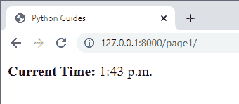

Output

阅读:[Django 中的应用程序和项目之间的差异](https://pythonguides.com/django-app-vs-project/)

## 获取 django 模板中的当前日期

因此，与上一节类似，我们可以使用两种不同的方法来获取 Django 模板中的当前日期。在本节中，我们还将讨论当前日期情况下的两种方法。

### 使用视图文件

对于第一种方法，我们将使用 `views.py` 获取当前日期值，然后将日期值发送到模板。对于这个实现，我们必须在 `views.py` 文件中添加以下代码。

```py
from django.shortcuts import render
from datetime import datetime

def index(request):
    current_date = datetime.now().date()  
    return render(request, 'index.html', {'current_date':current_date})
```

在上面的代码中，我们创建了一个基于函数的视图，在这个视图中，我们定义了一个变量。现在，这个变量将使用 **datetime.now()存储当前日期的值。日期()**方法。

然后，我们使用 return 语句将变量发送到`index.html`页面。

接下来，为了显示当前日期，我们必须向`index.html`页面添加以下代码。

```py
<!DOCTYPE html>
<html lang="en">
<head>
    <meta charset="UTF-8">
    <meta http-equiv="X-UA-Compatible" content="IE=edge">
    <meta name="viewport" content="width=device-width, initial-scale=1.0">
    <title>Python Guides</title>
</head>
<body>
   <b>Today's Date: </b>{{current_date}}
</body>
</html>
```

在上面的示例中，“**{ {当前日期}}** ”变量将返回当前日期。这是上面页面的输出。

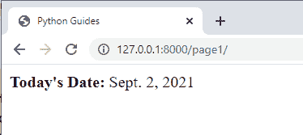

Output

### 使用模板标签

在这个方法中，首先，我们将创建一个重定向到 HTML 页面的视图。在此之后，在模板中，我们将使用“ `now` 标签来获取当前日期。首先， `views.py` 文件的代码如下。

```py
from django.shortcuts import render

def index(request): 
    return render(request, 'index.html')
```

接下来，我们将把“ `now` 标签添加到【index.html】文件**中，以获得结果。此外，我们可以使用这个标签以不同的格式显示当前日期。**

```py
<!DOCTYPE html>
<html lang="en">
<head>
    <meta charset="UTF-8">
    <meta http-equiv="X-UA-Compatible" content="IE=edge">
    <meta name="viewport" content="width=device-width, initial-scale=1.0">
    <title>Python Guides</title>
</head>
<body>
   <p><b>Today's Date: </b></p>
   <p><b>Today's Date: </b></p>
   <p><b>Today's Date: </b></p>
</body>
</html>
```

现在，启动开发服务器并在浏览器中打开映射的 URL。我们将得到以下结果。

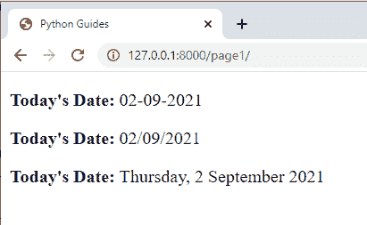

Output

阅读: [Python Django 获取管理员密码](https://pythonguides.com/python-django-get-admin-password/)

## 获取 django 模板中的当前日期时间

在这一节中，我们将讨论如何在 Django 模板中**获得当前的日期时间值。**

对于这个实现，我们将讨论获取当前日期时间值并在模板中使用它的两种不同方法。这两种方法如下。

1.  首先，使用 `view.py` 文件获取日期时间值并将其发送到 html 页面。之后，使用 HTML 页面中的 datetime 值获得结果。
2.  其次，创建一个重定向到 HTML 页面的视图，然后在 HTML 页面中使用模板标记来获取日期时间值。

### 使用视图文件

让我们通过在 Django 中执行一个例子来理解这种方法。对于这个例子，首先，我们将在 `views.py` 文件中添加以下代码。

```py
from django.shortcuts import render
from datetime import datetime

def index(request):
    current_datetime = datetime.now()  
    return render(request, 'index.html', {'current_datetime':current_datetime})
```

在 `views.py` 文件中，我们创建了一个简单的视图，将当前日期时间值提取到一个变量中。它还将变量返回到 index.html 的**页面。**

现在，对于`index.html`页面，我们将添加以下代码。

```py
<!DOCTYPE html>
<html lang="en">
<head>
    <meta charset="UTF-8">
    <meta http-equiv="X-UA-Compatible" content="IE=edge">
    <meta name="viewport" content="width=device-width, initial-scale=1.0">
    <title>Python Guides</title>
</head>
<body>
   <p><b>Current Date-Time: </b>{{current_datetime}}</p>
</body>
</html>
```

在`index.html`页面中，我们只是使用变量来获取当前的日期时间值。最终，我们将获得以下输出。

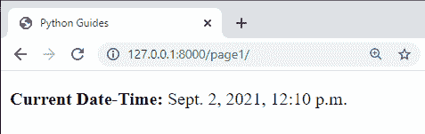

Output

### 使用模板标签

在这种方法中，我们只需要创建一个重定向到 HTML 页面的视图。这是视图的代码。

```py
from django.shortcuts import render

def index(request):
    return render(request, 'index.html')
```

现在，通过使用模板标签，我们可以获得不同格式的当前日期时间值。下面的示例显示了一些常见的格式。

```py
<!DOCTYPE html>
<html lang="en">
<head>
    <meta charset="UTF-8">
    <meta http-equiv="X-UA-Compatible" content="IE=edge">
    <meta name="viewport" content="width=device-width, initial-scale=1.0">
    <title>Python Guides</title>
</head>
<body>
   <p><b>Current Date-Time: </b></p>
   <p><b>Current Date-Time: </b></p>
   <p><b>Current Date-Time: </b></p>
   <p><b>Current Date-Time: </b></p>
</body>
</html>
```

这是我们运行开发服务器时，上述示例的输出。

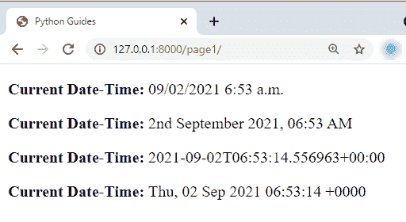

Output

另外，请阅读以下 Django 教程:

*   [Django 从 POST 请求中获取所有数据](https://pythonguides.com/django-get-all-data-from-post-request/)
*   [如何在 Django 中创建模型](https://pythonguides.com/create-model-in-django/)
*   [Python Django 过滤器](https://pythonguides.com/python-django-filter/)
*   [Python Django group by](https://pythonguides.com/python-django-group-by/)
*   [在 Python + PDF 发票中使用 Django 将 HTML 页面转换为 PDF](https://pythonguides.com/convert-html-page-to-pdf-using-django/)

在这个 Django 教程中，我们讨论了如何在 Django 中获取当前时间**，**如何获取当前日期**以及**日期时间**值。此外，我们还讨论了以下主题列表。**

*   获取 django 中的当前日期时间
*   获取 django 的当前时间
*   获取 django 的当前日期
*   获取 django 模板中的当前时间
*   获取 django 模板中的当前日期
*   获取 django 模板中的当前日期时间

[Bijay Kumar](https://pythonguides.com/author/fewlines4biju/)

Python 是美国最流行的语言之一。我从事 Python 工作已经有很长时间了，我在与 Tkinter、Pandas、NumPy、Turtle、Django、Matplotlib、Tensorflow、Scipy、Scikit-Learn 等各种库合作方面拥有专业知识。我有与美国、加拿大、英国、澳大利亚、新西兰等国家的各种客户合作的经验。查看我的个人资料。

[enjoysharepoint.com/](https://enjoysharepoint.com/)[](https://www.facebook.com/fewlines4biju "Facebook")[](https://www.linkedin.com/in/fewlines4biju/ "Linkedin")[](https://twitter.com/fewlines4biju "Twitter")