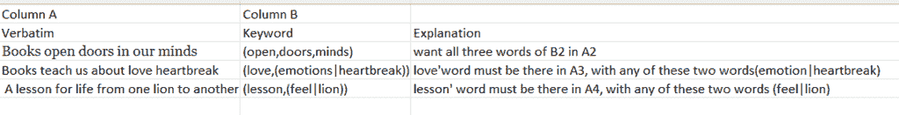
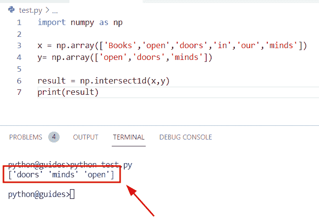
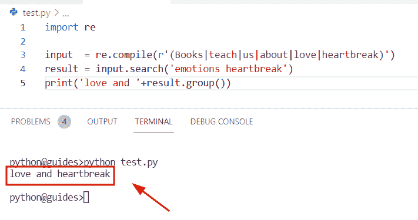
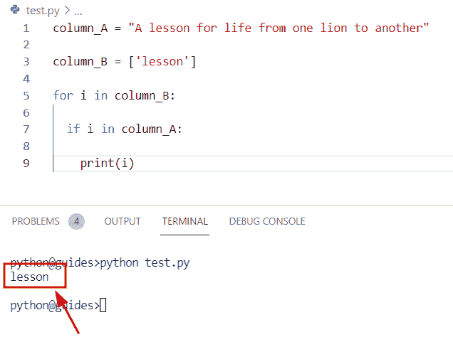

# 如何在 Python 中从列表中获取字符串值

> 原文：<https://pythonguides.com/how-to-get-string-values-from-list-in-python/>

[](https://sharepointsky.teachable.com/p/python-and-machine-learning-training-course)

在这个 [Python 教程](https://pythonguides.com/python-download-and-installation/)中，我们将讨论在 Python 中**从列表中获取字符串值的不同方法。对于这个主题，让我们来理解下面的场景**

目录

[](#)

*   [如何在 Python 中从列表中获取字符串值:场景](#How_to_get_string_values_from_list_in_Python_Scenario "How to get string values from list in Python: Scenario")
    *   [通过使用 NumPy 方法](#By_using_NumPy_method "By using NumPy method")
    *   [通过使用 regex 方法](#By_using_the_regex_method "By using the regex method")
    *   [通过使用 for 循环方法](#By_using_for-loop_method "By using for-loop method")

## 如何在 Python 中从列表中获取字符串值:场景



Python Excel sheets columns

*   在这个场景中，我们创建了一个包含 A 列和 b 列两列的 excel 表。在这些列中，有两个主要属性'**逐字的**和'关键字'。在逐字(列)我们已经指定了一些短语)和其他方面，我们已经选择了关键字属性中的一些单词。
*   **第一个场景:**我们必须在 A 列中找到 b 列的常用词。例如，假设您有两个给定的数组，数组 1 包含“**逐字**”(A 列)元素，数组 2 包含“**关键字**”元素。现在我们必须找到两个数组之间的共同单词
*   **第二种场景:**A 列的一个词必须附加 B 列关键词。

在 b 列中求 A 列的值有各种方法，我们来看看方法。

*   通过使用 regex 方法
*   使用 Numpy 方法
*   通过使用 for 循环方法

### 通过使用 NumPy 方法

*   在这个程序中，我们将学习如何使用 NumPy 方法从输入数组中找到公共值。
*   为了执行这个特定的任务，我们将使用 np.intersect1d()函数。在 Python 中，此函数用于查找两个输入数组之间的交集，此方法将两个数组作为参数，它将检查数组 1 的值是否存在于数组 2 中。简而言之，交集被定义为从两个输入数组中获取唯一值或公共值。

**语法:**

下面是 Python np.intersect1d()函数的语法。

```py
numpy.intersect1d
                 (
                  ar1,
                  ar2,
                  assume_unique=False,
                  return_indices=False
                 )
```

**举例:**

```py
import numpy as np

x = np.array(['Books','open','doors','in','our','minds'])
y= np.array(['open','doors','minds'])

result = np.intersect1d(x,y)
print(result)
```

在下面的代码中，我们导入了 NumPy 库，然后使用 np.array()函数创建了一个数组，在这个函数中，我们指定了字符串字符。

在创建一个数组后，我们声明了一个变量“result”并使用了 np.intersect1d()函数，在这个函数中，我们将输入数组指定为一个参数。

下面是以下给定代码的实现。



How to find common values in NumPy Python

### 通过使用 regex 方法

*   在本节中，我们将学习如何使用 Python regex 方法从 list 中获取字符串值。
*   在 Python 中，regex 方法用于描述给定输入文本中的搜索模式，为了创建 regex 对象，我们将导入“re”模块。
*   导入模块后，我们将使用 re.search()方法，在该函数中，我们将分配输入文本，该函数将帮助用户编译正则表达式并搜索模式。

**举例:**

```py
import re

input  = re.compile(r'(Books|teach|us|about|love|heartbreak)')
result = input.search('emotions heartbreak')
print('love and '+result.group())
```

在上面的代码中，我们使用了 `re.compile()` 方法，该函数将输入作为正则表达式输入，并将检查文本中的相同模式。之后，我们使用了 `re.search()` 方法，这个方法将帮助用户在给定的字符串中找到模式的出现。

下面是下面给出的代码的截图。



how to get string values from input text in Python

阅读[如何在 python 中使用正则表达式拆分字符串](https://pythonguides.com/python-split-string-regex/)

### 通过使用 for 循环方法

在本节中，我们将学习如何使用 for-loop 方法在 B 列中找到 A 列的值。

**举例:**

```py
column_A = "A lesson for life from one lion to another"

column_B = ['lesson']

for i in column_B:

  if i in column_A:

    print(i)
```

在上面的代码中，我们创建了一个输入字符串“column_A ”,同时我们还创建了一个列表，在该列表中我们指定了要对输入字符串进行操作的单词。

在给定的示例中，我们必须在 column_A 元素中找到 column_B 元素的值。为了完成这项任务，我们将使用 for-loop 方法并迭代这些值。

下面是以下给定代码的输出。



在这个 Python 教程中，我们已经学习了**如何从 Python** 的列表中获取字符串值。

相关 Python 教程:

*   [Python 查找列表中元素的索引](https://pythonguides.com/python-find-index-of-element-in-list/)
*   [使用 For 循环在 Python 中添加列表元素](https://pythonguides.com/add-elements-in-list-in-python-using-for-loop/)
*   [Python 在字符串中查找数字](https://pythonguides.com/python-find-number-in-string/)
*   [Python NumPy 中值](https://pythonguides.com/python-numpy-median/)
*   [Python 复制 NumPy 数组](https://pythonguides.com/python-copy-numpy-array/)
*   [Python NumPy genfromtxt()](https://pythonguides.com/python-numpy-genfromtxt/)

[Bijay Kumar](https://pythonguides.com/author/fewlines4biju/)

Python 是美国最流行的语言之一。我从事 Python 工作已经有很长时间了，我在与 Tkinter、Pandas、NumPy、Turtle、Django、Matplotlib、Tensorflow、Scipy、Scikit-Learn 等各种库合作方面拥有专业知识。我有与美国、加拿大、英国、澳大利亚、新西兰等国家的各种客户合作的经验。查看我的个人资料。

[enjoysharepoint.com/](https://enjoysharepoint.com/)[](https://www.facebook.com/fewlines4biju "Facebook")[](https://www.linkedin.com/in/fewlines4biju/ "Linkedin")[](https://twitter.com/fewlines4biju "Twitter")