# 如何安装 Django

> 原文：<https://pythonguides.com/how-to-install-django/>

[](https://sharepointsky.teachable.com/p/python-and-machine-learning-training-course)

在这个 Python Django 教程中，我们将学习如何安装 Django，我们还将了解如何在 Windows、Linux 或 Mac 上安装 Django。下面给出了本文涉及的主题列表。

*   如何在 Windows 中安装 Django
*   如何在 Linux 中安装 Django
*   如何在 Mac 上安装 Django
*   如何检查 Django 版本
*   如何在 pycharm 中安装 Django
*   如何在 visual studio 代码中安装 Django
*   如何安装 Django rest 框架

目录

[](#)

*   [如何安装 Django](#How_to_install_Django "How to install Django")
    *   [如何在 Windows 中安装 Django](#How_to_install_Django_in_Windows "How to install Django in Windows ")
    *   [如何在 Linux / Mac 上安装 Django](#How_to_install_Django_in_Linux_Mac "How to install Django in Linux / Mac ")
*   [如何检查 Django 版本](#How_to_check_the_Django_version "How to check the Django version ")
*   [如何在 visual studio 代码中安装 Django](#How_to_install_Django_in_visual_studio_code "How to install Django in visual studio code ")
*   [如何在 pycharm 中安装 Django](#How_to_install_Django_in_pycharm "How to install Django in pycharm ")
*   [如何安装 Django rest 框架](#How_to_install_Django_rest_framework "How to install Django rest framework ")

## 如何安装 Django

由于 Django 是一个基于 python 的 web 框架，所以安装 Django 的第一个要求是安装 python。所以，不管什么操作系统，首先我们需要安装 python。

现在，安装 python 非常容易，你可以从下面的[官网](https://www.python.org/downloads/)轻松下载 python。

或者可以按照下面这篇文章“ [Python 下载安装步骤](https://pythonguides.com/python-download-and-installation/)”。本文给出了在不同操作系统中安装 python 的所有步骤。

安装 python 后，我们可以使用 `PIP` 轻松安装 Django 框架。PIP 代表“**首选安装程序**”或“ **Pip 安装包**”是它的递归缩写。

它是 python 的一个包管理器，主要用于安装、更新、卸载包。默认情况下，python 版或更高版本会提供该功能。

但是在使用 PIP 安装 Django 之前，推荐的最佳实践是为每个 Django 项目提供一个单独的环境。我们可以使用 python 中的" `venv` "模块轻松管理环境。

“ `venv` ”模块用于创建一个轻量级的虚拟环境，它有自己的站点目录。现在，这些目录将与系统站点目录分开。

虚拟环境是一个独立的环境，有自己的 Python 二进制文件。因此，我们可以使用它在它的站点目录中独立安装 python 包。

接下来，让我们了解如何创建一个虚拟环境，并在不同的操作系统中安装 Django。让我们从 windows 操作系统开始。

阅读 [Python Django 长度过滤器](https://pythonguides.com/python-django-length-filter/)

### 如何在 Windows 中安装 Django

在这一节中，我们将学习如何在 windows 中创建一个虚拟环境，并使用它来安装 Django。

现在，让我们首先使用 python `venv` 模块创建一个虚拟环境。对于这个实现，首先，我们打开一个命令提示符，然后我们需要导航到我们想要创建项目的位置。

现在，要创建一个虚拟环境，我们可以遵循给定的语法。

```py
python -m venv environment_name
```

在语法中，我们需要提供环境的名称来代替 **environment_name。**该命令将设置虚拟环境，并在我们指定的位置创建一个目录。建议为您的环境提供一个合适的**项目名**。下面是执行该命令的一个示例。

```py
python -m venv mysite-env
```

这将在给定位置创建一个名为“ `mysite-env` 的目录。我们还可以在命令提示符下使用“ `dir` 命令来检查目录。这个实现如下面的屏幕截图所示。

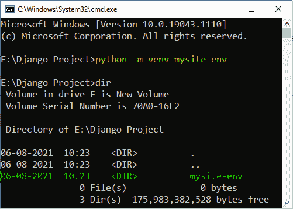

Creating a virtual environment for Django

接下来，我们需要通过运行位于**脚本**目录中的 `activate.bat` 文件来激活虚拟环境。为此，我们需要遵循以下语法。

```py
environment_name\Scripts\activate.bat
```

让我们使用这个语法来激活我们的" `mysite-env` "环境。

```py
mysite-env\Scripts\activate.bat
```

这将激活虚拟环境，我们可以很容易地识别出这一点，因为环境名称将出现在命令提示符的旁边。下面是这个的截图。

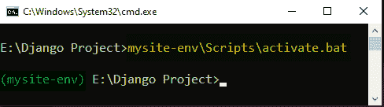

Activating the virtual environment

现在，我们准备安装 Django，为此，我们将使用 PIP。下面是使用 PIP 安装 Django 的命令。

```py
python -m pip install Django 
```

执行上述命令后，将下载并安装最新的 Django 版本。在我们的例子中，将安装 Django-3.2.6。

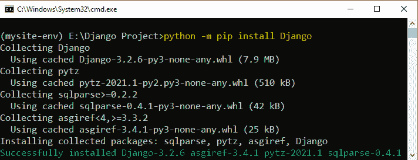

Installing Django in Windows

阅读: [Python Django vs Flask](https://pythonguides.com/python-django-vs-flask/)

### 如何在 Linux / Mac 中安装 Django

现在，在 Linux 和 Mac 上安装 Django 的步骤和在 Windows 上是一样的。微小的区别在于激活虚拟环境的命令。因此，在这一节中，我们将了解如何创建一个虚拟环境，并使用它在 Linux 和 Mac 操作系统中安装 Django。

现在，要在 Linux 或 Mac 中创建虚拟环境，我们可以遵循相同的语法。

```py
python3 -m venv environment_name
```

创建虚拟环境后，我们需要激活它。为此，我们必须对 Linux 和 Mac 使用相同的命令。

```py
source environment_name/bin/activate
```

通过激活虚拟环境，shell 提示符将显示我们已经激活的环境的名称。而且，它将从系统的 python 版本转移到虚拟环境 python。

在这之后，我们可以很容易地使用同一个 pip 模块为 Linux 和 Mac 安装 Django。

```py
python3 -m pip install Django
```

这将成功下载并安装最新的 Django 版本。

Read: [ModuleNotFoundError:没有名为 Django 的模块](https://pythonguides.com/modulenotfounderror-no-module-named-django/)

## 如何查看 Django 版

在我们的虚拟环境中安装 Django 之后，我们可以很容易地检查它的版本。为此，我们必须使用以下命令。

```py
python -m django --version
```

如果我们没有指定 Django 的版本，那么 python 会自动下载并安装最新的 Django 版本。而最新的 Django 版本是 `3.2.6` 。

如果我们执行上面的命令，我们将以下面的方式得到结果。

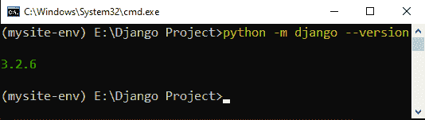

Output

阅读: [Python Tkinter](https://pythonguides.com/python-gui-programming/)

## 如何在 visual studio 中安装 Django 代码

我们也可以使用 visual studio 代码来安装 Django 模块，对于这个实现，我们必须遵循下面给出的步骤。

*   首先，我们需要在我们的系统中安装 python。
*   接下来，启动 visual studio 代码，单击 extensions 选项并安装 python 扩展。

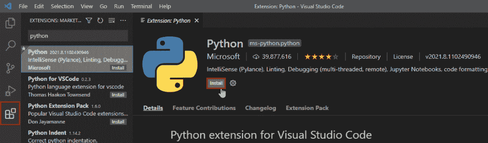

Installing python extension in vs code

*   接下来，在您的文件系统中，创建一个文件夹来存储虚拟环境和项目文件。
*   现在，回到 visual studio 代码，从菜单栏中选择“**终端**”>”**新终端**，或者使用 **Ctrl+Shift+`** 快捷键在 VS 代码中打开一个终端。
*   之后，使用终端移动到项目位置。然后执行以下命令之一来创建虚拟环境。

```py
# Linux | macOS
python3 -m venv env_name

# Windows
python -m venv env_name
```

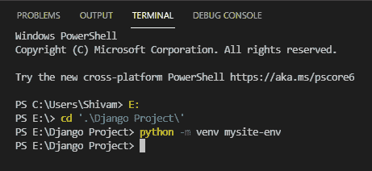

Example

*   接下来，从菜单栏中选择“**文件**”>”**打开文件夹**选项，打开 VS 代码中的项目文件夹。或者，我们也可以使用 `Ctrl+O` shortchut。
*   现在，在菜单栏中选择“**视图**”>”**命令面板**选项，打开命令面板。或者使用 `Ctrl+Shift+P` 快捷键。然后，选择**Python:Select Interpreter**命令。

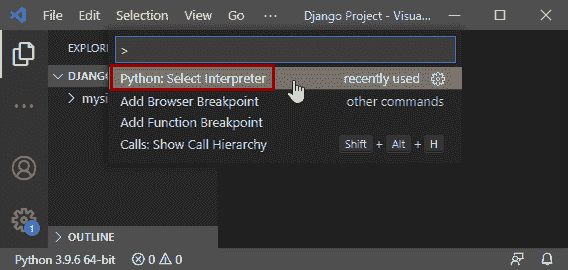

Python interpreter option in vs code

*   它将打开一个 visual studio 可以定位的 python 解释器列表。从列表中选择位于您创建的虚拟环境中的解释器。

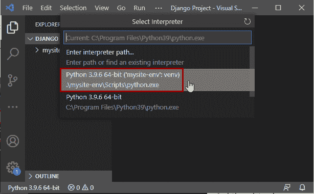

Selecting python interpreter

*   现在，如果我们用 VS 代码打开终端，那么虚拟环境将被自动激活。

**注意:–**如果您使用的是 Windows，那么您必须将默认终端从 Powershell 更改为 VS 代码中的命令提示符。然后用 VS 代码启动终端。为此，在设置中查找“**终端>集成>默认配置文件**，设置为“**命令提示**”。

*   最后，只需在终端中运行以下命令，就可以在您的虚拟环境中安装 Django 模块。

```py
python -m pip install django
```

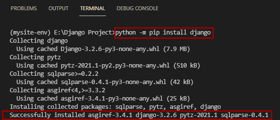

Installing Django using visual studio code

阅读: [Python Tkinter 标签](https://pythonguides.com/python-tkinter-label/)

## 如何在 pycharm 中安装 Django

类似于 visual studio 代码，我们也可以使用 pycharm 来安装 Django 模块，并创建一个 Django 项目。

现在，如果我们正在使用 Pycharm Professional，那么我们不需要单独安装 Django。Django 项目可以直接在 Pycharm 专业版中创建。因此，在本文中，我们将讨论如何在 Pycharm 社区版中安装 Django。为此，我们必须遵循以下步骤。

*   首先，启动 Pycharm 社区版并创建一个新项目，使用选项选择“**新环境”为“ `Virtualenv` ”。并点击**创建**。**

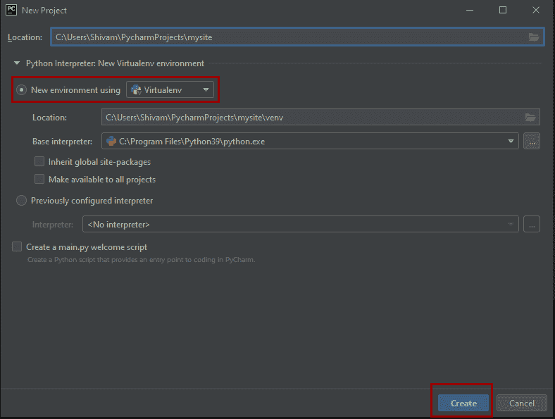

Creating a new project in pycharm

*   现在，如果您使用的是 Windows，那么您必须将终端从 PowerShell 更改为 pycharm 中的命令提示符。为此，进入**文件**>**设置**，在**工具**下查找**端子**设置。现在，选择从`powershell.exe`到`cmd.exe`的外壳路径。

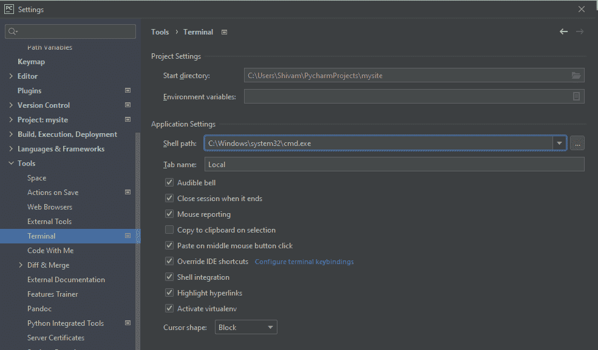

Terminal settings

*   现在，只需在 pycharm 中打开终端并运行以下命令来安装 Django。

```py
python -m pip install django
```

*   它会在虚拟环境中自动下载并安装最新的 Django 版本。

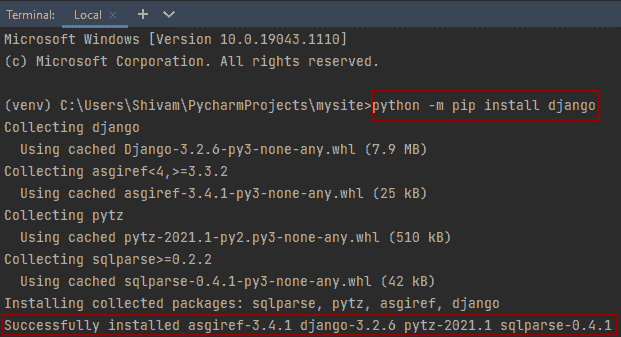

Installing Django in Pycharm

阅读:[如何设置 Django 项目](https://pythonguides.com/setup-django-project/)

## 如何安装 Django rest 框架

Django rest 框架是一个灵活而强大的库，用于在 Django 中构建 web APIs。所以，在安装 Django rest 框架之前，我们必须先安装 python 和 Django。

成功安装 python 和 Django 后，安装 Django rest 框架就超级容易了。我们可以使用 python 中的 PIP 很容易地安装它。这一步对于所有的操作系统都是一样的。所以，这是我们可以用来安装 Django rest 框架的 pip 命令。

```py
pip install djangorestframework
```

执行该命令后，Dango rest 框架库将自动下载并安装在系统中。

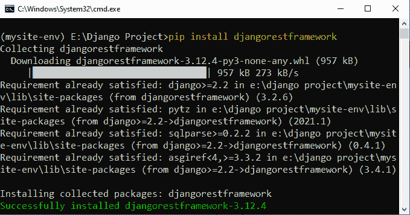

Example

你可能也喜欢阅读下面的文章列表。

*   [Python Django 获取管理员密码](https://pythonguides.com/python-django-get-admin-password/)
*   [Python Tkinter 列表框](https://pythonguides.com/python-tkinter-listbox/)
*   [什么是 Matplotlib](https://pythonguides.com/what-is-matplotlib/)
*   [Python 字典删除](https://pythonguides.com/python-dictionary-remove/)
*   [如何获取 Django 的当前时间](https://pythonguides.com/how-to-get-current-time-in-django/)

所以在本教程中，我们已经讨论了**如何安装 Django** ，如何在 Windows、Linux 或 Mac 中安装 Django。我们还讨论了以下主题。

*   如何在 Windows 中安装 Django
*   如何在 Linux 中安装 Django
*   如何在 Mac 上安装 Django
*   如何检查 Django 版本
*   如何在 pycharm 中安装 Django
*   如何在 visual studio 代码中安装 Django
*   如何安装 Django rest 框架

[Bijay Kumar](https://pythonguides.com/author/fewlines4biju/)

Python 是美国最流行的语言之一。我从事 Python 工作已经有很长时间了，我在与 Tkinter、Pandas、NumPy、Turtle、Django、Matplotlib、Tensorflow、Scipy、Scikit-Learn 等各种库合作方面拥有专业知识。我有与美国、加拿大、英国、澳大利亚、新西兰等国家的各种客户合作的经验。查看我的个人资料。

[enjoysharepoint.com/](https://enjoysharepoint.com/)[](https://www.facebook.com/fewlines4biju "Facebook")[](https://www.linkedin.com/in/fewlines4biju/ "Linkedin")[](https://twitter.com/fewlines4biju "Twitter")