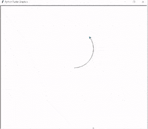

# 如何在蟒蛇龟中做出笑脸

> 原文：<https://pythonguides.com/how-to-make-a-smiling-face-in-python-turtle/>

[](https://sharepointsky.teachable.com/p/python-and-machine-learning-training-course)

我们正在建立一个项目，在这个项目中，我们将在 **[蟒蛇龟](https://pythonguides.com/turtle-programming-in-python/)** 库中学习**如何制作笑脸**。在这里，我们将拆分代码，解释如何使用函数和方法制作笑脸。

## 如何在蟒蛇龟中做出笑脸

现在我们正在向前推进，开始这个项目。这里我们只是导入库。

```py
from turtle import *
import turtle
```

现在我们正在为这只乌龟创建一个对象。

```py
tur = turtle.Turtle()
```

现在我们使用函数来创建一只眼睛。为了创建一只眼睛，我们必须使用以下函数。

*   `tur.down()` 用于在乌龟的帮助下在屏幕上开始绘图。
*   `tur.fillcolor(color)` 用于填充我们在屏幕上绘制的形状的颜色。
*   `tur.begin_fill()` 用于开始填充形状中的颜色。
*   **tur.circle(半径)**用来画圆的形状。
*   `tur.end_fill()` 用于停止填充颜色。
*   `tur.up()` 用于停止绘图。

```py
def eyes(color, radius):
    tur.down()
    tur.fillcolor(color)
    tur.begin_fill()
    tur.circle(radius)
    tur.end_fill()
    tur.up()
```

现在我们使用函数来制作一个脸的形状。为了做一个面，我们使用下面的函数。

*   **tur.fillcolor('青色')**用于填充圆形人脸形状内部的颜色。
*   `tur.begin_fill()` 用于开始填充形状。
*   `tur.circle(100)` 用来画圆的形状。
*   `tur.end_fill()` 用于停止填充颜色。
*   `tur.up()` 用于停止绘图。

```py
tur.fillcolor('cyan')
tur.begin_fill()
tur.circle(100)
tur.end_fill()
tur.up()
```

现在我们正在使用函数来制作眼睛的形状。为了画一只眼睛，我们使用下面的函数。

*   **tur.goto(-40，120)** 用于将乌龟移动到准确的位置。
*   **眼睛('白色'，15)** 用来给眼睛的外部加上白色。

```py
tur.goto(-40, 120)
eyes('white', 15)
tur.goto(-37, 125)
eyes('blue', 5)
tur.goto(40, 120)
eyes('white', 15)
tur.goto(40, 125)
eyes('blue', 5)
```

现在我们使用函数来制作鼻子的形状。为了画一个鼻子，我们使用下面的函数。

**tur.goto(0，75)** 用于将乌龟移动到其准确位置。

**眼睛(‘红色’，8)** 用来给眼睛赋予红色。

```py
 tur.goto(0, 75)
eyes('red', 8)
```

现在我们使用函数来制作嘴巴的形状。为了画一个嘴，我们使用下面的函数。

*   **tur.goto(0，75)** 用于将乌龟移动到其准确位置。
*   `tur.down()` 用于在乌龟的帮助下在屏幕上开始绘图。
*   `tur.right()` 用于向右侧改变位置。
*   `tur.circle()` 用来画圆的形状。
*   `tur.up()` 用于停止绘图。

```py
tur.goto(-40, 85)
tur.down()
tur.right(90)
tur.circle(40, 180)
tur.up()
```

现在我们使用函数来制作舌头的形状。为了画舌头，我们使用了下面的函数。

*   **tur.goto(0，75)** 用于将乌龟移动到其准确位置。
*   `tur.down()` 用于在乌龟的帮助下在屏幕上开始绘图。
*   `tur.right()` 用于向右侧改变位置。
*   **tur.fillcolor('red')** 用于填充舌头内部的红色。
*   `tur.circle(100)` 用来画圆的形状。
*   `tur.end_fill()` 用于停止填充颜色。
*   `tur.hideturtle()` 用于隐藏用来绘制形状的乌龟。

```py
tur.goto(-10, 45)
tur.down()
tur.right(180)
tur.fillcolor('red')
tur.begin_fill()
tur.circle(10, 180)
tur.end_fill()
tur.hideturtle()
turtle.done()
```

此后分割代码，解释我们如何使用 python turtle 制作笑脸，我们将看到运行整个代码后的输出。

```py
from turtle import *
import turtle

tur = turtle.Turtle()

def eyes(color, radius):
    tur.down()
    tur.fillcolor(color)
    tur.begin_fill()
    tur.circle(radius)
    tur.end_fill()
    tur.up()

tur.fillcolor('cyan')
tur.begin_fill()
tur.circle(100)
tur.end_fill()
tur.up()

tur.goto(-40, 120)
eyes('white', 15)
tur.goto(-37, 125)
eyes('blue', 5)
tur.goto(40, 120)
eyes('white', 15)
tur.goto(40, 125)
eyes('blue', 5)

tur.goto(0, 75)
eyes('red', 8)

tur.goto(-40, 85)
tur.down()
tur.right(90)
tur.circle(40, 180)
tur.up()

tur.goto(-10, 45)
tur.down()
tur.right(180)
tur.fillcolor('red')
tur.begin_fill()
tur.circle(10, 180)
tur.end_fill()
tur.hideturtle()
turtle.done() 
```

运行上面的代码后，我们得到下面的输出，我们可以看到一张可爱的笑脸出现在屏幕上。



How to make a smiling face in python turtle

所以，在本教程中，我们已经举例说明了如何在 python turtle 中制作笑脸**。此外，我们还讨论了本教程中使用的全部代码。**

还有，多看看一些和 Python Turtle 相关的教程。

*   [分形蟒龟+例子](https://pythonguides.com/fractal-python-turtle/)
*   [Python 清龟配实例](https://pythonguides.com/python-clear-turtle/)
*   [蟒蛇龟钟——如何绘制](https://pythonguides.com/python-turtle-clock/)
*   [巨蟒龟屏幕尺寸](https://pythonguides.com/python-turtle-screen-size/)
*   [蟒龟画字母](https://pythonguides.com/python-turtle-draw-letters/)
*   [蟒龟获得位置](https://pythonguides.com/python-turtle-get-position/)
*   [蟒蛇龟点–实用指南](https://pythonguides.com/python-turtle-dot/)
*   [Python turtle onclick 举例](https://pythonguides.com/python-turtle-onclick/)
*   [蟒龟输入](https://pythonguides.com/python-turtle-input/)

[Bijay Kumar](https://pythonguides.com/author/fewlines4biju/)

Python 是美国最流行的语言之一。我从事 Python 工作已经有很长时间了，我在与 Tkinter、Pandas、NumPy、Turtle、Django、Matplotlib、Tensorflow、Scipy、Scikit-Learn 等各种库合作方面拥有专业知识。我有与美国、加拿大、英国、澳大利亚、新西兰等国家的各种客户合作的经验。查看我的个人资料。

[enjoysharepoint.com/](https://enjoysharepoint.com/)[](https://www.facebook.com/fewlines4biju "Facebook")[](https://www.linkedin.com/in/fewlines4biju/ "Linkedin")[](https://twitter.com/fewlines4biju "Twitter")