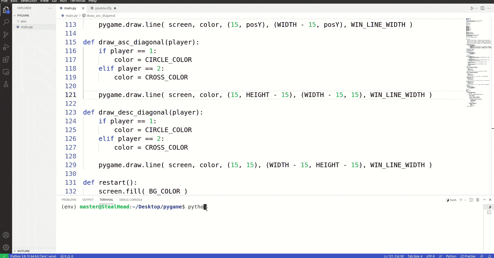

# 如何在 Python Pygame 中将屏幕放在特定位置

> 原文：<https://pythonguides.com/how-to-put-screen-in-specific-spot-in-python-pygame/>

[](https://sharepointsky.teachable.com/p/python-and-machine-learning-training-course)

在本 [Python 教程](https://pythonguides.com/python-download-and-installation/)中，我们将学习**如何在 python pygame** 中将屏幕放在特定的位置。为了在 python pygame 中控制对象在屏幕上的位置，我们使用了 python 中的 OS 模块。

*   Pygame 使用 SDL (Simple DirectMedia Layer ),这是一个用于控制多媒体的跨平台库，广泛用于游戏。
*   在``os.environ``字典中有一个键 **`SDL_VIDEO_WINDOW_POS`** ，我们可以给它分配 x 和 y 值。这将把屏幕放在 python pygame 中的特定位置。
*   分配给 X 的值将使屏幕向右或向左移动，而分配给 Y 的值将使屏幕上下移动。
*   下面是如何在 python pygame 中将屏幕放在特定位置的语法。在这个语法中，我们创建了一个函数，然后在 pygame 中调用这个函数。

```py
def dynamicwinpos(x=500, y=100):
    os.environ['SDL_VIDEO_WINDOW_POS'] = "%d,%d" % (x,y)

pygame.init()

# calling function 
dynamicwinpos() 
```

现在，我们知道了如何在 python pygame 中将屏幕放在特定的位置，让我们通过将这些知识放在一个例子中来进行更多的探索。

## 如何在 Python Pygame 中将屏幕放在特定位置

在这个项目中，我们使用了我们博客中创建的游戏[使用 Python Pygame(井字游戏)](https://pythonguides.com/create-a-game-using-python-pygame/)创建一个游戏。这是一种很受欢迎的双人井字游戏，连续占据 3 个位置的玩家获胜。

*   `dynamicwinpos()` 函数接受 x 和 y 位置作为参数。在我们的例子中，我们提供了默认值 x=500，y=100。
*   **`os.environ['SDL_VIDEO_WINDOW_POS'] = "%d,%d" % (x,y)`** 在这个代码中 **`os.environ`** 是一个字典 **`SDL_VIDEO_WINDOW_POS`** 是一个键。 `X` & `Y` 是键值。
*   这个函数在初始化 pygame `pygame.init()`后立即被调用。现在每次执行程序时，屏幕都被放到 python pygame 中的特定位置(x & y)。

```py
import pygame, sys
import numpy as np
import os

#function to put the screen in specific spot in python pygame
def dynamicwinpos(x=500, y=100):
    os.environ['SDL_VIDEO_WINDOW_POS'] = "%d,%d" % (x,y)

pygame.init()

#function calling
dynamicwinpos()

WIDTH = 600
HEIGHT = 600
LINE_WIDTH = 15
WIN_LINE_WIDTH = 15
BOARD_ROWS = 3
BOARD_COLS = 3
SQUARE_SIZE = 200
CIRCLE_RADIUS = 60
CIRCLE_WIDTH = 15
CROSS_WIDTH = 25
SPACE = 55

RED = (255, 0, 0)
BG_COLOR = (20, 200, 160)
LINE_COLOR = (23, 145, 135)
CIRCLE_COLOR = (239, 231, 200)
CROSS_COLOR = (66, 66, 66)

screen = pygame.display.set_mode( (WIDTH, HEIGHT))
pygame.display.set_caption( 'TIC TAC TOE' )
screen.fill( BG_COLOR)

board = np.zeros( (BOARD_ROWS, BOARD_COLS))

def draw_lines():

	pygame.draw.line(screen, LINE_COLOR, (0, SQUARE_SIZE), (WIDTH, SQUARE_SIZE), LINE_WIDTH)

	pygame.draw.line(screen, LINE_COLOR, (0, 2 * SQUARE_SIZE), (WIDTH, 2 * SQUARE_SIZE), LINE_WIDTH)

	pygame.draw.line(screen, LINE_COLOR, (SQUARE_SIZE, 0), (SQUARE_SIZE, HEIGHT), LINE_WIDTH )

	pygame.draw.line(screen, LINE_COLOR, (2 * SQUARE_SIZE, 0), (2 * SQUARE_SIZE, HEIGHT), LINE_WIDTH)

def draw_figures():
	for row in range(BOARD_ROWS):
		for col in range(BOARD_COLS):
			if board[row][col] == 1:
				pygame.draw.circle( screen, CIRCLE_COLOR, (int( col * SQUARE_SIZE + SQUARE_SIZE//2 ), int( row * SQUARE_SIZE + SQUARE_SIZE//2 )), CIRCLE_RADIUS, CIRCLE_WIDTH )
			elif board[row][col] == 2:
				pygame.draw.line( screen, CROSS_COLOR, (col * SQUARE_SIZE + SPACE, row * SQUARE_SIZE + SQUARE_SIZE - SPACE), (col * SQUARE_SIZE + SQUARE_SIZE - SPACE, row * SQUARE_SIZE + SPACE), CROSS_WIDTH )	
				pygame.draw.line( screen, CROSS_COLOR, (col * SQUARE_SIZE + SPACE, row * SQUARE_SIZE + SPACE), (col * SQUARE_SIZE + SQUARE_SIZE - SPACE, row * SQUARE_SIZE + SQUARE_SIZE - SPACE), CROSS_WIDTH )

def mark_square(row, col, player):
	board[row][col] = player

def available_square(row, col):
	return board[row][col] == 0

def is_board_full():
	for row in range(BOARD_ROWS):
		for col in range(BOARD_COLS):
			if board[row][col] == 0:
				return False

	return True

def check_win(player):
	for col in range(BOARD_COLS):
		if board[0][col] == player and board[1][col] == player and board[2][col] == player:
			draw_vertical_winning_line(col, player)
			return True

	for row in range(BOARD_ROWS):
		if board[row][0] == player and board[row][1] == player and board[row][2] == player:
			draw_horizontal_winning_line(row, player)
			return True

	if board[2][0] == player and board[1][1] == player and board[0][2] == player:
		draw_asc_diagonal(player)
		return True

	if board[0][0] == player and board[1][1] == player and board[2][2] == player:
		draw_desc_diagonal(player)
		return True

	return False

def draw_vertical_winning_line(col, player):
	posX = col * SQUARE_SIZE + SQUARE_SIZE//2

	if player == 1:
		color = CIRCLE_COLOR
	elif player == 2:
		color = CROSS_COLOR

	pygame.draw.line( screen, color, (posX, 15), (posX, HEIGHT - 15), LINE_WIDTH )

def draw_horizontal_winning_line(row, player):
	posY = row * SQUARE_SIZE + SQUARE_SIZE//2

	if player == 1:
		color = CIRCLE_COLOR
	elif player == 2:
		color = CROSS_COLOR

	pygame.draw.line( screen, color, (15, posY), (WIDTH - 15, posY), WIN_LINE_WIDTH )

def draw_asc_diagonal(player):
	if player == 1:
		color = CIRCLE_COLOR
	elif player == 2:
		color = CROSS_COLOR

	pygame.draw.line( screen, color, (15, HEIGHT - 15), (WIDTH - 15, 15), WIN_LINE_WIDTH )

def draw_desc_diagonal(player):
	if player == 1:
		color = CIRCLE_COLOR
	elif player == 2:
		color = CROSS_COLOR

	pygame.draw.line( screen, color, (15, 15), (WIDTH - 15, HEIGHT - 15), WIN_LINE_WIDTH )

def restart():
	screen.fill( BG_COLOR )
	draw_lines()
	for row in range(BOARD_ROWS):
		for col in range(BOARD_COLS):
			board[row][col] = 0

draw_lines()

player = 1
game_over = False

while True:
	for event in pygame.event.get():
		if event.type == pygame.QUIT:
			sys.exit()

		if event.type == pygame.MOUSEBUTTONDOWN and not game_over:

			mouseX = event.pos[0] 
			mouseY = event.pos[1] 

			clicked_row = int(mouseY // SQUARE_SIZE)
			clicked_col = int(mouseX // SQUARE_SIZE)

			if available_square( clicked_row, clicked_col ):

				mark_square( clicked_row, clicked_col, player )
				if check_win( player ):
					game_over = True
				player = player % 2 + 1

				draw_figures()

		if event.type == pygame.KEYDOWN:
			if event.key == pygame.K_r:
				restart()
				player = 1
				game_over = False

	pygame.display.update() 
```

**输出:**

在这个输出中，我们运行了这个程序 3 次，每次我们都在 python pygame 的 dynamicwinpos()函数中更改了 x 和 y 的值。结果屏幕改变了它的位置。



How to Put Screen in Specific Spot in Python Pygame

在本教程中，我们学习了如何在 python pygame 中将屏幕放置在特定位置。此外，我们已经涵盖了一个项目，以展示我们所学到的东西。

相关 Python 教程:

*   [Python 复制文件](https://pythonguides.com/python-copy-file/)
*   [Python 文件方法](https://pythonguides.com/python-file-methods/)
*   [集合 Python 的并集](https://pythonguides.com/union-of-sets-python/)
*   [如何在 Python 中把字符串转换成日期时间](https://pythonguides.com/convert-a-string-to-datetime-in-python/)
*   [Python 中的转义序列](https://pythonguides.com/escape-sequence-in-python/)

[Bijay Kumar](https://pythonguides.com/author/fewlines4biju/)

Python 是美国最流行的语言之一。我从事 Python 工作已经有很长时间了，我在与 Tkinter、Pandas、NumPy、Turtle、Django、Matplotlib、Tensorflow、Scipy、Scikit-Learn 等各种库合作方面拥有专业知识。我有与美国、加拿大、英国、澳大利亚、新西兰等国家的各种客户合作的经验。查看我的个人资料。

[enjoysharepoint.com/](https://enjoysharepoint.com/)[](https://www.facebook.com/fewlines4biju "Facebook")[](https://www.linkedin.com/in/fewlines4biju/ "Linkedin")[](https://twitter.com/fewlines4biju "Twitter")