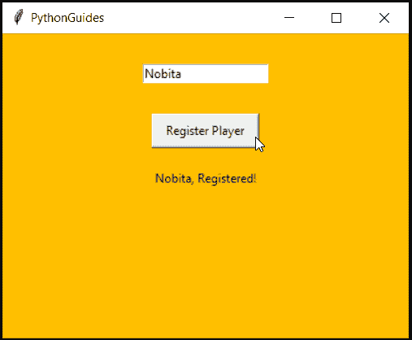

# 如何使用 Python Tkinter 获取用户输入并存储在变量中

> 原文：<https://pythonguides.com/how-to-take-user-input-and-store-in-variable-using-python-tkinter/>

[](https://sharepointsky.teachable.com/p/python-and-machine-learning-training-course)

在本节中，我们将学习**如何使用 Python Tkinter** 获取用户输入并将其存储在变量中。此外，我们将涵盖这些主题。

*   Python Tkinter 中的变量是什么
*   Python Tkinter 中的入口小部件

## 使用 Python Tkinter 中的入口小部件获取用户输入，并存储在一个变量中

在本节中，我们将学习变量，还将了解创建变量 Python 的规则。在我们学习将用户输入存储在变量中之前，理解变量是很重要的。

*   变量是为了存储值而创建的保留内存位置。
*   计算机会记住存储在变量中的任何东西，这些东西可以在程序中随时使用。但必须在范围内。
*   创建变量有一些规则:
    *   **蛇 _ 案**要跟。这意味着单词应该用下划线分开。例如:player_name。
    *   变量必须以 l `owercase` 或**下划线**开头。示例:_ 玩家姓名，玩家姓名
    *   变量中只允许有**字母**、**数字** &、**下划线**。不允许使用除下划线以外的特殊字符。
    *   变量**区分大小写**。例子: `p` 层和 `P` 层是两个不同的变量。
    *   Python 有**保留关键字**像 class、int、str 等。不应使用保留关键字中的名称创建变量。

您可能还会喜欢以下 Python 变量教程:

*   [如何在 python 中创建变量](https://pythonguides.com/create-python-variable/)
*   [如何在 Python 中创建字符串](https://pythonguides.com/create-a-string-in-python/)
*   [如何在 python 中把整数转换成字符串](https://pythonguides.com/convert-an-integer-to-string-in-python/)
*   [Python 获取目录中的所有文件](https://pythonguides.com/python-get-all-files-in-directory/)

**Python Tkinter 中的入口小部件**

Python 入口小部件是广泛使用的小部件，因为它用于接收用户的输入。因此，在存储输入之前，我们需要学习如何从用户那里获取输入。你可以在 Python Tkinter 中查看关于[入口小部件的文章。](https://pythonguides.com/python-tkinter-entry/)

*   入口小部件用于接收用户输入。
*   填写表单时，您可以在条目小部件中输入详细信息的框。
*   命令创建入口小部件 **`Entry(master).pack()`**
*   为了存储入口小部件的值，我们使用了**变量**。只需在创建小部件之前提供任何名称，该名称将存储输入的值。
*   确保所选择的名称遵循变量规则，如上面关于变量的部分所述。
*   稍后，可以使用 `get()` 方法获取这个存储的值。
*   在下面的节目中，我们用到了目前为止所学的所有东西。我们已经使用了变量、入口小部件和 get 方法。

**代码:**

在这段代码中，我们创建了一个简单的应用程序，其中用户需要为玩家注册提供一个名字。他们将在入口小部件中提供输入。该值将存储在名为“player_name”的变量中。

点击按钮后，将调用一个函数，该函数将从入口小部件中提取值，并将其显示在标签小部件中。使用 `get()` 方法从入口小部件中提取信息。

```py
from tkinter import *

ws = Tk()
ws.title("PythonGuides")
ws.geometry('400x300')
ws['bg'] = '#ffbf00'

def printValue():
    pname = player_name.get()
    Label(ws, text=f'{pname}, Registered!', pady=20, bg='#ffbf00').pack()

player_name = Entry(ws)
player_name.pack(pady=30)

Button(
    ws,
    text="Register Player", 
    padx=10, 
    pady=5,
    command=printValue
    ).pack()

ws.mainloop()
```

**输出:**

在这个输出中，名称“nobita”被输入到条目小部件中，当单击按钮时，相同的名称与消息一起显示在标签小部件中。



Take User Input and Store in Variable using Python Tkinter

您可能会喜欢以下 Python 教程:

*   [如何在 Python 中将 dictionary 转换成 JSON](https://pythonguides.com/convert-dictionary-to-json-python/)
*   [如何在 Turtle Python 中附加图像](https://pythonguides.com/attach-image-to-turtle-python/)
*   [检查一个列表是否存在于另一个列表中 Python](https://pythonguides.com/check-if-a-list-exists-in-another-list-python/)
*   [Python 向 CSV 写列表](https://pythonguides.com/python-write-a-list-to-csv/)
*   [如何使用 Python Tkinter 创建倒计时定时器](https://pythonguides.com/create-countdown-timer-using-python-tkinter/)
*   [使用 Tkinter 的 Python 注册表](https://pythonguides.com/registration-form-in-python-using-tkinter/)

在这一节中，我们学习了接受用户输入并在变量中存储一个值，我们也讨论了这些主题。

*   Python Tkinter 中的变量是什么
*   Python Tkinter 中的入口小部件

[Bijay Kumar](https://pythonguides.com/author/fewlines4biju/)

Python 是美国最流行的语言之一。我从事 Python 工作已经有很长时间了，我在与 Tkinter、Pandas、NumPy、Turtle、Django、Matplotlib、Tensorflow、Scipy、Scikit-Learn 等各种库合作方面拥有专业知识。我有与美国、加拿大、英国、澳大利亚、新西兰等国家的各种客户合作的经验。查看我的个人资料。

[enjoysharepoint.com/](https://enjoysharepoint.com/)[](https://www.facebook.com/fewlines4biju "Facebook")[](https://www.linkedin.com/in/fewlines4biju/ "Linkedin")[](https://twitter.com/fewlines4biju "Twitter")