# 如果不是 Python 中的条件

> 原文：<https://pythonguides.com/if-not-condition-in-python/>

[](https://sharepointsky.teachable.com/p/python-and-machine-learning-training-course)

在这篇 Python 博客中，您将看到 Python 中 **if not 条件的许多用例。**

您可以使用带有 `if-else` 语句的 `not` 运算符来比较各种条件。下面列出了一些例子。这些例子将帮助你理解如何在一个 `if-else` 语句中使用 `not` 操作符。

*   Python if not 条件示例
*   Python if 不等于 null
*   Python 如果不是真的
*   Python 如果不是字母表
*   Python if 不等于 string
*   Python if not 空字符串
*   Python 如果不等于两个值
*   Python if 不等于多个值
*   Python if 不等于整数
*   Python 如果不在列表中
*   如果不存在，则添加 Python 列表
*   如果不在列表中，Python 会引发错误
*   Python 如果没有什么也不做
*   Python 如果不是 startswith
*   Python 如果不存在文件
*   Python 如果文件不存在，则创建

目录

[](#)

*   [Python if not 条件示例](#Python_if_not_condition_example "Python if not condition example")
*   [Python if 不等于 null](#Python_if_not_equal_to_null "Python if not equal to null")
*   [Python if not true](#Python_if_not_true "Python if not true")
*   [Python 如果不是字母表](#Python_if_not_alphabet "Python if not alphabet")
*   [Python if 不等于 string](#Python_if_not_equal_to_string "Python if not equal to string")
*   [Python 如果不是空字符串](#Python_if_not_empty_string "Python if not empty string")
*   [Python 如果不等于两个值](#Python_if_not_equal_to_two_values "Python if not equal to two values")
*   [Python if 不等于多个值](#Python_if_not_equal_to_multiple_values "Python if not equal to multiple values")
*   [Python if 不等于整数](#Python_if_not_equal_to_integer "Python if not equal to integer")
*   [Python 如果不在列表中](#Python_if_not_in_list "Python if not in list")
*   [如果不存在，添加 Python 列表](#Python_list_add_if_not_present "Python list add if not present")
*   [如果不在列表中，Python 会引发错误](#Python_raise_error_if_not_in_list "Python raise error if not in list")
*   [Python 如果不做什么也不做](#Python_if_not_do_nothing "Python if not do nothing")
*   [Python if not startswith](#Python_if_not_startswith "Python if not startswith")
*   [Python 如果不存在文件](#Python_if_not_file_exists "Python if not file exists")
*   [Python 如果文件不存在，创建](#Python_if_not_file_exists_create "Python if not file exists create")

## Python if not 条件示例

让我们看一个 Python 中 **if not 条件的简单例子。**

```py
variable = input('Enter a value:')
if not variable:
    print('True')
else:
    print('False')
```

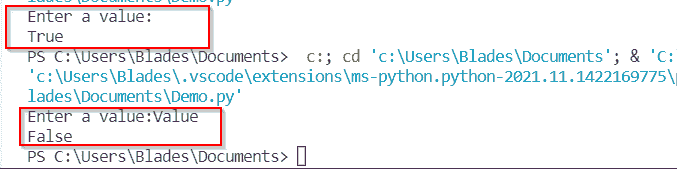

If not condition example

在上面的例子中，如果变量为空，它将满足 If-not 语句，语句的 `True` 部分将被执行。

所以，当我执行上面的程序，没有给出任何输入的时候，if-else 语句的 True 部分起作用了。

当我用用户输入再次执行程序时，if-else 语句的错误部分起作用了。

另外，检查:[使用 python 从 URL 下载 zip 文件](https://pythonguides.com/download-zip-file-from-url-using-python/)

## Python if 不等于 null

在 Python 中有 `None` 而不是 `Null` 。所以我们必须检查变量是否包含一个 None 值。有不同的方法来检查它。

**例 1:**

```py
variable = None
if variable is not None:
    print('Variable does not contain None')
else:
    print('Variable contains None')
```

在上面的代码中，我们比较了**变量**和 `None` 值。我使用了**不是**来检查变量是否包含一个非值。

“ **if 变量不是 None”**语句等同于布尔型 `False` 。结果，if-else 语句的**假**部分被执行。

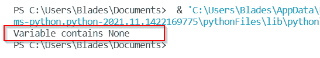

Output when variable contains a None value

**例 2:**

```py
variable = None
if not variable:
    print('Variable contains None')
else:
    print('Variable does not contain None')
```

在上面的代码中，if-not 语句相当于 `True` ，因为变量不包含任何值，并且存储的是 `None` 。因此，如果执行语句，则**的**真**块内的语句。**

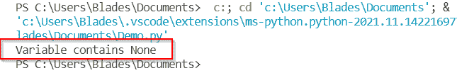

Python if-not statement

**替代方法:**

您也可以使用**而不是` `等于**的运算符(！=)而不是 if-not 语句。例如:

```py
variable = None
if variable != None:
    print('Variable does not contain None')
else:
    print('Variable contains None')
```

在上面的代码中，if 语句相当于 `False` 。

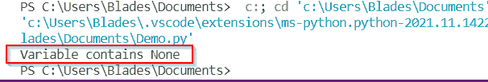

Python Not Equal to operator

另一种方法是使用 if 语句，而不使用 `Not` 运算符。看看下面的代码:

```py
variable = None
if variable:
    print('Variable does not contain None')
else:
    print('Variable contains None')
```

if 语句只是检查变量对于任何值是否是强的。变量不存储任何值，即它等同于 `None` 。因此，if 语句返回**假**。

阅读: [Python 返回函数](https://pythonguides.com/python-return-function/)

## Python if not true

if not True 语句等价于 `if False` 。因此，应该使用 if False 而不是 if not True。但是，您可以使用 if not True 语句，如下面的代码所示:

```py
variable = False
if variable is not True:
    print('Variable stores False')
else:
    print('Variable stores True')
```

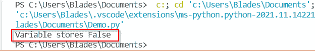

Python if not True

**替代方法:**可以用 if False 代替 if Not True。结果会是一样的。

```py
variable = False
if variable is False:
    print('Variable stores False')
else:
    print('Variable stores True')
```

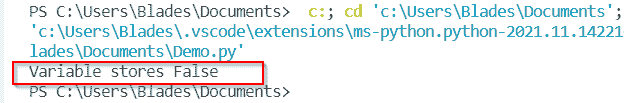

Python if False

阅读: [Python 查找列表中元素的索引](https://pythonguides.com/python-find-index-of-element-in-list/)

## Python 如果不是字母表

在本节中，您将看到一个例子，在这个例子中，我使用了 if not 语句来验证一个变量是否存储了一个字母表。

在下面的例子中，如果用户输入 `Y` 作为输入，用户将被要求输入两个数字，两个数字的和将被打印出来。如果给定任何其他输入值，程序将终止。

```py
choice = input('Enter Y to find the sum of numbers: ')
if choice != 'Y':
    exit()
else:
    num1 = float(input('Enter first number: '))
    num2 = float(input('Enter second number: '))
    print('Sum is: ', num1 + num2)
```

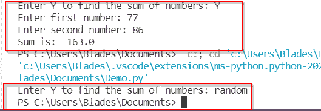

Validation of an alphabet using if not

这样，您可以使用 if not 语句来验证字母表。

阅读: [Python 在字符串中查找数字](https://pythonguides.com/python-find-number-in-string/)

## Python if 不等于 string

在本节中，您将学习如何在 Python 中比较 if-else 语句中的字符串。

如果要验证变量是否存储字符串数据类型值，可以使用 type()函数获取变量的数据类型。例如:

```py
str1 = 'Hello'
if str1 != 'Hello':
    print('invalid message')
else:
    print('valid message')
```

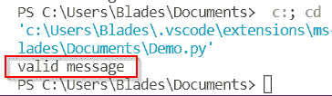

Comparing a string using not equal to operator

使用**不是**:

您还可以将“ `is not` ”与 if-else 语句一起使用，而不是使用不等于运算符。例如，上面的代码可以重写为:

```py
str1 = 'Hello'
if str1 is not 'Hello':
    print('invalid message')
else:
    print('valid message')
```

## Python 如果不是空字符串

让我们看一个例子，在这个例子中，我们可以在 Python 中的 if-else 语句中使用 `not` 运算符来验证变量是否包含空字符串。

```py
string = input('Enter a username:')
if not string:
    print('Username cannot be empty! Try again')
else:
    print('A valid username')
```

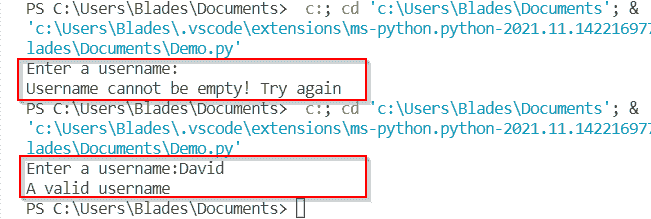

Python if not for validating an empty string

我已经执行了两个测试用例的代码。您可以看到两个测试用例的输出，即空字符串和非空字符串。

在这种情况下，也可以使用不等于运算符(！idspnonenote)。=).

这样，您可以在 if-else 语句中使用**而不是**操作符来验证空字符串。

阅读: [Python 在字符串中查找数字](https://pythonguides.com/python-find-number-in-string/)

## Python 如果不等于两个值

如果您想检查存储在变量中的值是否不等于两个指定值中的一个，您可以使用**逻辑` `和**或**逻辑或**运算符，具体取决于您的需求。

例如:

```py
username = input('Enter the username: ')
password = input('Enter password : ')
if username != 'admin' or password != 'admin123':
    print('Username and password combination is wrong')
else:
    print('Correct username and password combination') 
```

在上面的代码中，我使用了带有不等于运算符(！idspnonenote)的 if 语句。=)来比较用户名和密码变量。

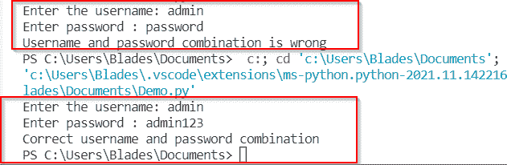

Python if not equal to two values

阅读: [Python 将二进制转换成十进制](https://pythonguides.com/python-convert-binary-to-decimal/)

## Python if 不等于多个值

在 Python 中，还可以使用 if not equal to 语句将变量与两个以上的值进行比较:

例如:

```py
grade= input('Enter a grade: ')
if grade != 'A' and grade != 'B' and grade != 'C' and grade != 'D' and grade != 'E':
    print('Fail')
else:
    print('Pass')
```

在上面的代码中，我已经编写了 if not 语句，在**逻辑和**运算符的帮助下，将**等级**变量中的值与多个值进行比较。

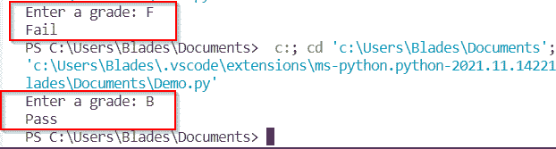

Python if not equal to multiple values

阅读: [Python 统计文件中的字数](https://pythonguides.com/python-count-words-in-file/)

## Python if 不等于整数

您可以使用不等于运算符(！=)来比较两个整数。例如，下面的 Python 代码片段检查一个数字是偶数还是奇数。

```py
number = int(input('Enter a number: '))
if number % 2 != 0:
    print('The number is odd')
else:
    print('The number is even')
```

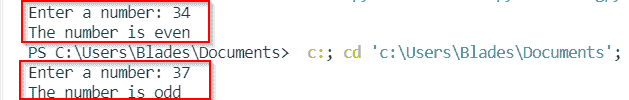

Python if not equal to for integers

这样，您可以使用不等于运算符来比较整数。

如果您想在 if-else 中使用**而不是**操作符，则上面的内容变成:

```py
number = int(input('Enter a number: '))
if number % 2 is not 0:
    print('The number is odd')
else:
    print('The number is even')
```

## Python 如果不在列表中

在这一节中，我将解释如何检查一个条目是否存储在 Python 中的列表中。

您可以对列表使用“ `not in` ”运算符来检查列表中是否存在某个项目。

例如，看看下面的 Python 代码:

```py
list1=['a', 'e', 'i', 'o', 'u', 'A', 'E', 'I', 'O', 'U']
letter = input('Enter an alphabet: ')
if letter not in list1:
    print('The entered alphabet is a consonant')
else:
    print('The entered alphabet is a vowel')
```

*   上面的程序将一个字母表作为输入，并返回输出，告诉输入的字母表是元音还是辅音。
*   我已经定义了一个存储所有元音的列表。将输入的字母表与列表中的元音进行比较，并相应地返回结果。

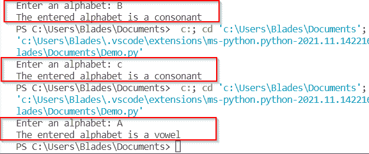

if not in list validation in python

这样，您可以在 python 中的 if-else 语句中使用“ `not in` 运算符来验证列表中的元素。

另外，检查 Python 中的 [Case 语句](https://pythonguides.com/case-statement-in-python/)

## 如果不存在，添加 Python 列表

现在让我们学习如何将一个项目添加到一个列表中，如果它还不在列表中的话。当您希望列表中只有唯一的元素时，可能需要此功能。

看看下面的代码:

```py
list1 = ['1201', '1202', '1203', '1204', '1205', '1206', '1207']
element = input('Enter the employee ID: ')
if element not in list1:
    list1.append(element)
    print('Employee ID added')
else:
    print('Employee ID already exists')
print(list1)
```

*   该列表包含一些独特的元素。
*   当从控制台读取新元素时，首先在列表中搜索它。
*   只有当它不在列表中时，它才被添加到列表中。
*   因此，列表将总是包含唯一的元素。

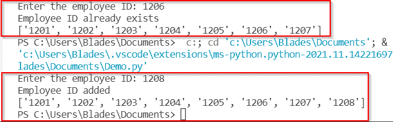

Add element in the list if not present

阅读:[如何在 Python 中反转一个列表](https://pythonguides.com/reverse-a-list-in-python/)

## 如果不在列表中，Python 会引发错误

在 Python 中使用 `raise` 关键字，也可以在列表中找不到元素时引发错误。看看下面的例子:

```py
list1= ['Adams', 'Eva', 'Rose', 'Mary', 'John']
element = input('Enter a name to search in the list: ')
if element not in list1:
    raise Exception('Element not found in the list')
else:
    print('Element found in the list')
```

*   在上面的代码中，一个元素被当作用户输入，并在列表中进行搜索。
*   如果在列表中找不到该元素，则会引发一条自定义消息。否则，如果在列表中找到该元素，程序将执行而不会出现任何错误。

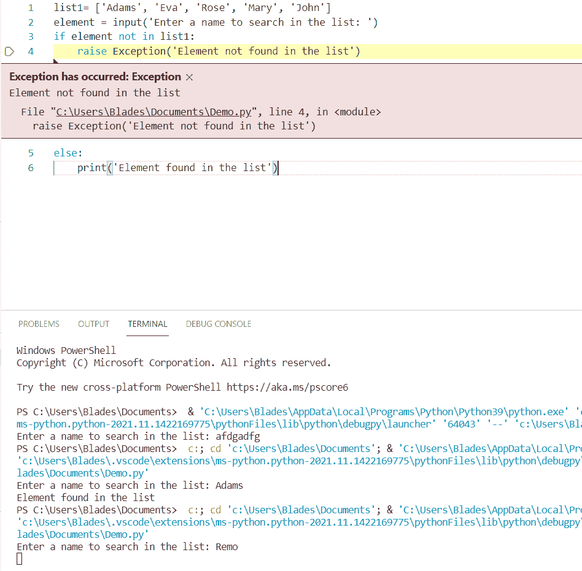

Raise an error if the element is not in list

正如您在输出中看到的，当在列表中找不到提供的值时，会引发一个异常。

阅读:[获取索引熊猫 Python](https://pythonguides.com/get-index-pandas-python/)

## Python 如果不做什么也不做

当您想使用 if-else 语句，但不想执行 if 或 else 块中的任何代码时，您可能会遇到这种情况。在这种情况下，您可以使用 `pass` 语句。

`pass` 语句为空语句。当解释器读取这个时，它不执行任何操作。

当您不想编写代码的任何部分时，通常使用此语句。例如，定义函数并在以后编写它的功能。

现在让我们看看如何将它与 if-else 语句一起使用。考虑我们在上一节中讨论的例子。我对它做了一点小小的改动。

```py
list1 = ['1201', '1202', '1203', '1204', '1205', '1206', '1207']
element = input('Enter the employee ID: ')
if element not in list1:
    if not element:
        pass
    else:
        list1.append(element)
        print('Employee ID added')
else:
    print('Employee ID already exists')
print(list1)
```

第一个验证是检查元素是否已经存在于列表中。

现在我已经添加了第二个验证，它将检查新元素是否为空。如果新元素为空，则不应添加。因此，我使用了 `pass` 语句。

如果新元素为空，将执行 `pass` 语句，If 块的 `True` 部分将不执行任何操作，控制将移到下一行。

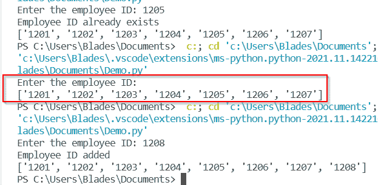

Execution of the pass statement

这样，你可以使用 `pass` 语句跳过任何代码块。

阅读:[获取字典 Python 中的第一个键](https://pythonguides.com/get-first-key-in-dictionary-python/)

## Python if not startswith

`startwith()` 函数是一个字符串函数，它检查一个字符串是否以指定的字符串值开始。

在这一节中，我将展示一个例子，说明如何在 if-else 语句中使用这个函数的 `not` 操作符。

```py
string1= input('Enter a name that starts with "A": ')
if not string1.startswith('A'):
    print('Invalid Name')
else:
    print('The name is: ', string1)
```

在上面的例子中，名字只有以**“A”**开头才有效，否则名字不被接受。

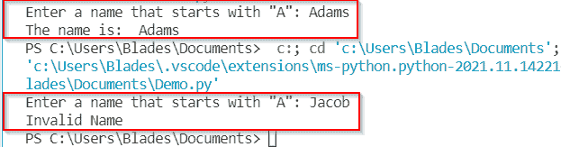

Using the startswith() function

这样，您可以在 Python 程序中使用 startswith()函数进行字符串验证。

阅读 [Python 打印无换行符](https://pythonguides.com/python-print-without-newline/)

## Python 如果不存在文件

要检查文件是否存在于本地文件系统中，需要使用 Python 中的 `os` 模块。该模块包含用于与本地操作系统交互的库。

您可以使用 `os.path.isfile()` 函数来检查文件是否存在于本地文件系统中。您只需要在函数中指定文件的路径。

例如，我在“**C:\ Users \ Blades \ Documents \ zip files . txt**”位置有一个名为 `zipfiles.txt` 的文本文件。我写了下面的 Python 代码片段，它将检查这个文件是否存在于指定的路径中。

```py
import os
if not os.path.isfile(r'C:\Users\Blades\Documents\zipfiles.txt'):
    print('The specified file does not exist')
else:
    print('The specified file exists') 
```

如果文件存在，将返回一个真值。

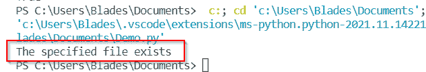

Check if the file is present in the local file system

现在，如果我指定一个不存在的文件，将返回一个假值。

```py
import os
if not os.path.isfile(r'C:\Users\Blades\Documents\random.txt'):
    print('The specified file does not exist')
else:
    print('The specified file exists') 
```

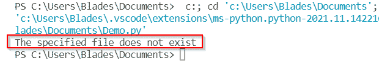

File not found in the local file system

因此，通过这种方式，您可以检查文件是否存在于本地文件系统中。

阅读[用 Python 创建字典](https://pythonguides.com/create-a-dictionary-in-python/)

## Python 如果文件不存在，创建

如果想用 Python 在本地文件系统创建一个文件，可以使用 `open()` 函数。

文件可以通过两种方式打开:

*   **写入模式**:覆盖之前的文件内容。
*   **追加模式**:向文件追加新数据，不丢失旧数据。

如果想要创建并打开一个尚不存在的文件，可以使用 open()函数中的两个选项之一:

*   `w+` :用于创建一个不存在的文件，并以写模式打开它。
*   `a+` :用于创建一个不存在的文件，并以追加模式打开。

例如，要创建一个不存在的新文件并以写模式打开它，可以使用下面的代码片段:

```py
# Opening the file in write mode
file = open(<file name>, 'w+')

# Writing data in the file
file.write(<data to be written in the file>)

# Closing the file after the contents are written
file.close()
```

如果你想在附加模式下打开你的文件，只需用“ `a+` 替换“ `w+` ”。

例如，下面的代码会将数据写入一个名为 `new_file.txt` 的文件(如果它存在的话)。如果文件不存在，它将被创建。

```py
file_name = 'new_file.txt'
# Opening the file in write mode
file = open(file_name, 'w+')

# Writing data in the file
file.write('Sample file contents')

# Closing the file after the contents are written
file.close() 
```

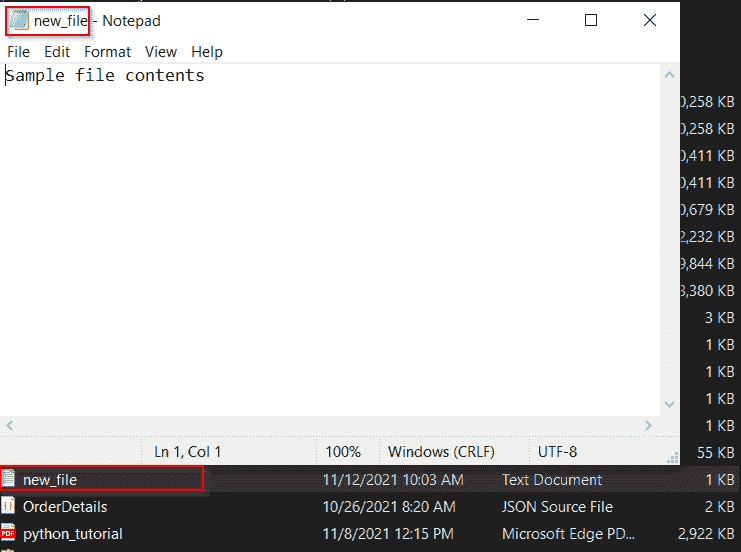

A new file is created

您可以看到在 Python 源文件位置创建了一个包含指定数据的新文件。这样，如果 Python 中不存在新文件，您可以创建一个新文件。

您可能会喜欢以下 Python 教程:

*   [Python 中的乘法与例题](https://pythonguides.com/multiply-in-python/)
*   [如何在 Python 中处理 indexerror:字符串索引超出范围](https://pythonguides.com/indexerror-string-index-out-of-range-python/)
*   [解析 Python 时出现意外的 EOF](https://pythonguides.com/unexpected-eof-python/)
*   [Python 对于基数为 10 的 int()无效文字](https://pythonguides.com/python-invalid-literal-for-int-with-base-10/)
*   [删除 python 中的 Unicode 字符](https://pythonguides.com/remove-unicode-characters-in-python/)
*   [Python 中的注释行](https://pythonguides.com/comment-lines-in-python/)
*   [在 Python 中检查列表是否为空](https://pythonguides.com/check-if-a-list-is-empty-in-python/)

因此，在这个 Python 教程中，我们已经理解了 Python 中的 `if not** `条件的许多用例。**此外，我们还讨论了以下主题。

*   Python if not 条件示例
*   Python if 不等于 null
*   Python 如果不是真的
*   Python 如果不是字母表
*   Python if 不等于 string
*   Python if not 空字符串
*   Python 如果不等于两个值
*   Python if 不等于多个值
*   Python if 不等于整数
*   Python 如果不在列表中
*   如果不存在，则添加 Python 列表
*   如果不在列表中，Python 会引发错误
*   Python 如果没有什么也不做
*   Python 如果不是 startswith
*   Python 如果不存在文件
*   Python 如果文件不存在，则创建

[Bijay Kumar](https://pythonguides.com/author/fewlines4biju/)

Python 是美国最流行的语言之一。我从事 Python 工作已经有很长时间了，我在与 Tkinter、Pandas、NumPy、Turtle、Django、Matplotlib、Tensorflow、Scipy、Scikit-Learn 等各种库合作方面拥有专业知识。我有与美国、加拿大、英国、澳大利亚、新西兰等国家的各种客户合作的经验。查看我的个人资料。

[enjoysharepoint.com/](https://enjoysharepoint.com/)[](https://www.facebook.com/fewlines4biju "Facebook")[](https://www.linkedin.com/in/fewlines4biju/ "Linkedin")[](https://twitter.com/fewlines4biju "Twitter")