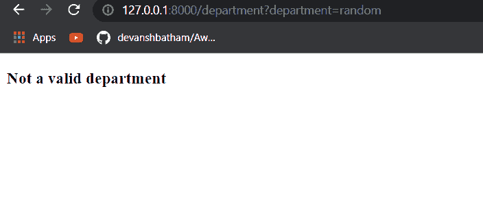

# Django 模板中的 If 语句

> 原文：<https://pythonguides.com/if-statement-in-django-template/>

[](https://sharepointsky.teachable.com/p/python-and-machine-learning-training-course)

在这个 [Django 教程](https://pythonguides.com/what-is-python-django/)中，我将解释 if-else 语句在 Django 模板中的用法。我将展示 Django 模板中 if-else 语句的一些用例。

HTML 页面本质上是静态的。然而，Django 模板可以使用各种技术使页面动态化。例如，使用模板标签。

if 模板标记是 Django 中的模板标记之一，可用于呈现特定条件下的 HTML 内容。让我们看看如何在 Django 中使用 **if 模板标签**。

*   如何在 Django 模板中使用 if 语句
*   Django 模板示例中的 If 标记
*   Django 模板中的 If else 标签
*   Django 模板示例中的 If else 标签
*   Django 模板如果等于字符串
*   如果 Django 模板中没有条件
*   Django 模板中嵌套的 if else
*   Django 模板中的多个 if 条件
*   Django 模板中带有 if 条件的 For 循环

目录

[](#)

*   [如何在 Django 模板中使用 if 语句](#How_to_use_if_statement_in_Django_template "How to use if statement in Django template")
*   [Django 模板中的 If 标签示例](#If_tag_in_Django_template_example "If tag in Django template example")
*   [Django 模板中的 If else 标签](#If_else_tag_in_Django_template "If else tag in Django template")
*   [Django 模板中的 If else 标签示例](#If_else_tag_in_Django_template_example "If else tag in Django template example")
*   [Django 模板如果等于字符串](#Django_template_if_equal_string "Django template if equal string")
*   [如果 Django 模板中没有条件](#If_not_condition_in_Django_template "If not condition in Django template")
*   [嵌套在 Django 模板中的 if else](#Nested_if_else_in_Django_template "Nested if else in Django template")
*   [Django 模板中带有 if 条件的循环](#For_loop_with_if_condition_in_Django_template "For loop with if condition in Django template")

## 如何在 Django 模板中使用 if 语句

在 Django 模板中，if 语句被称为 if 标记。您可以使用这个 if 标记根据特定条件呈现 HTML 内容。if 模板标记的语法是:

```py

  <statement to be executed if the condition returns true>

```

在 Django 模板中，您必须关闭 if 模板标签。您可以在 if 模板标记中编写条件。在块内，您可以编写条件返回 True 值时要呈现的语句或 HTML 代码。

让我们借助一个例子来理解这一点。

## Django 模板中的 If 标签示例

现在让我们看一个 if 标签的例子。我创建了一个例子，在这个例子中，我将输入两个数字，并在 Django 模板中比较它们。

下面是 Django 模板，我将在其中提交两个数字:

```py
<!DOCTYPE html>
<html lang="en">
<head>
    <meta charset="UTF-8">
    <meta http-equiv="X-UA-Compatible" content="IE=edge">
    <meta name="viewport" content="width=device-width, initial-scale=1.0">
    <title>Login Page</title>
</head>
<body>
    <form action="" method="get">
        <h3> Enter First number: </h3><br>
        <input type="text" name="number1" placeholder="Enter First number"><br>
        <h3> Enter Second number: </h3><br>
        <input type="text" name="number2" placeholder="Enter Second number">
        <input type="submit" value="Check">
      </form>
    
      <h4>{{number1}} is greater than {{number2}}</h4>
    
</body>
</html>
```

此外，我在同一个模板中显示结果。你可以看到我的 urls.py 文件:

```py
from django.contrib import admin
from django.urls import path
from . import views

urlpatterns = [
    path('admin/', admin.site.urls),
    path('', views.index, name = 'index'),
]
```

现在，在 views.py 文件中，我将接收参数并在同一个模板中呈现它们。这是我的 views.py 文件:

```py
# importing the necessary libraries
from django.shortcuts import render
def index(request):
      number1 = int(request.GET.get('number1', 0))
      number2 = int(request.GET.get('number2', 0))
      dict={
            'number1' : number1,
            'number2' : number2
      }
      return render(request, 'index.html', dict) 
```

现在让我们看看输出。


Output when the first number is greater than the second number

当第一个数字大于第二个数字时，您可以看到输出。这样，您可以在 Django 模板中使用 if 标记。

另外，请阅读: [Python Django vs Flask](https://pythonguides.com/python-django-vs-flask/)

## Django 模板中的 If else 标签

同样，您也可以将 else 与 if 标记一起使用。if-else 模板标记的语法是:

```py

   <statements or HTML if the condition returned True>

   <statements or HTML if the condition returned False>

```

让我们看一个 if-else 模板标签的例子。

## Django 模板中的 If else 标签示例

在这个例子中，我将提交一个数字，它将在 Django 模板中比较这个数字是偶数还是奇数。下面是我的 Django 模板，我将取一个数字并检查这个数字。

```py
<!DOCTYPE html>
<html lang="en">
<head>
    <meta charset="UTF-8">
    <meta http-equiv="X-UA-Compatible" content="IE=edge">
    <meta name="viewport" content="width=device-width, initial-scale=1.0">
    <title>Login Page</title>
</head>
<body>
    <form action="" method="get">
        <h3> Enter a number: </h3><br>
        <input type="text" name="number" placeholder="Enter a number">
        <input type="submit" value="Check">
      </form>
    
      <h4>The number is even</h4>
    
      <h4>The number is odd</h4>
    
</body>
</html>
```

但在此之前，我先给你看一下 `views.py` 文件。

```py
# importing the necessary libraries
from django.shortcuts import render
def index(request):
      number = int(request.GET.get('number', 0))
      return render(request, 'index.html', {'number': number}) 
```

在 URLs 文件中，我已经定义了这个页面只重定向到它自己。

```py
from django.contrib import admin
from django.urls import path
from . import views

urlpatterns = [
    path('admin/', admin.site.urls),
    path('', views.index, name = 'index'),
]
```

现在让我们看看输出。


Default page output

现在让我们输入一个数字，点击 `Check` 按钮检查输出。


Output when an odd number is entered

你可以在网址里看到这个数字。数字是奇数，我们相应地得到输出。

这样，您可以在 Django 模板中使用 if-else 标记。

阅读: [Python Django 获取管理员密码](https://pythonguides.com/python-django-get-admin-password/)

## Django 模板如果等于字符串

在这一节中，我将演示一个例子，在这个例子中，我将使用 if-else 模板标记来比较 Django 模板中的字符串。

您也可以使用 `ifequal` 模板标签，但在 3.1 版之后，该标签已被弃用。因此，不建议使用它。我将演示如何使用 `if-else` 标签代替 `ifequal` 标签。

在这个例子中，我将使用两个 Django 模板，即一个用于提交字符串输入，另一个用于呈现结果。第一个模板是`index.html`:

```py
<!DOCTYPE html>
<html lang="en">
<head>
    <meta charset="UTF-8">
    <meta http-equiv="X-UA-Compatible" content="IE=edge">
    <meta name="viewport" content="width=device-width, initial-scale=1.0">
    <title>Login Page</title>
</head>
<body>
    <form action="validate" method="get">
        <h3> Enter the username: </h3><br>
        <input type="text" name="user" placeholder="Enter the username"><br>
        <input type="submit" value="Submit">
      </form>
</body>
</html>
```

提交表单时，用户将被重定向到另一个 URL 端点。这个 URL 端点在 `urls.py` 文件中定义为:

```py
from django.contrib import admin
from django.urls import path
from . import views

urlpatterns = [
    path('admin/', admin.site.urls),
    path('', views.index, name = 'index'),
    path('validate', views.validate, name = 'validate')
] 
```

在 `views.py` 文件中，我定义了一个名为 `validate()` 的函数，该函数将从表单中收集数据，并将其呈现在 Django 模板中。 `views.py` 文件是:

```py
# importing the necessary libraries
from django.shortcuts import render
def index(request):
      return render(request, 'index.html')

def validate(request):
      username = request.GET['user']
      return render(request, 'validate.html', {'username' : username}) 
```

最后，我将在名为`validate.html`的 Django 模板中使用 if-else 模板标记。在表格中输入的用户输入将与一个字符串进行比较，即“admin”，结果将相应地显示出来。Django 模板是:

```py
<!DOCTYPE html>
<html lang="en">
<head>
  <meta charset="UTF-8">
  <meta http-equiv="X-UA-Compatible" content="IE=edge">
  <meta name="viewport" content="width=device-width, initial-scale=1.0">
  <title>Show Username</title>
</head>
<body>
  
  <h3>The user is admin user</h3>
  
  <h3>The user is not admin user</h3>
  
</body>
</html>
```

现在让我们启动 Django 服务器并查看输出。


Entering the user input

第一次我会输入一个随机的字符串。让我们看看输出。


Output when the string is not matched

现在让我们在表单输入中输入字符串**“admin”**并查看输出。


Output when the string is not matched

你可以看到输出是不同的。这样，您可以使用 if-else 模板标签来比较 Django 模板中的字符串。

**注意:**在模板语言中，使用双引号来处理字符串。

阅读:[Django 中的应用程序和项目之间的差异](https://pythonguides.com/django-app-vs-project/)

## 如果 Django 模板中没有条件

让我们看一个例子，我们可以在 Django 中使用带有 if-else 模板标签的 `not` 操作符。

我将使用 if-else 标记来确定变量是否包含任何值，并相应地呈现输出。

我使用的设置与我在上一节中定义的相同，即所有文件，包括 `views.py` 、 `urls.py` 、【index.html】和在本例中也是相同的。这一次我将改变 Django 模板，在那里我将使用 if-else 标签，即`validate.html`。

```py
<!DOCTYPE html>
<html lang="en">
<head>
  <meta charset="UTF-8">
  <meta http-equiv="X-UA-Compatible" content="IE=edge">
  <meta name="viewport" content="width=device-width, initial-scale=1.0">
  <title>Show Username</title>
</head>
<body>
  
  <h3>No username is given</h3>
  
  <h3>Username is: {{username}}</h3>
  
</body>
</html>
```

现在让我们看看输出。首先，我不会输入用户名。


Output when no user input is given

我将再次返回上一页，这次将提交一个测试用户名。


Output when user input is given

您可以看到当变量中有一个值时，我得到了 Django 模板中 if-else 模板标签中指定的值。

这样，您可以在 Django 中使用带有 if-else 模板标记的 `not` 操作符。

阅读:[如何在 Django 中创建模型](https://pythonguides.com/create-model-in-django/)

## 嵌套在 Django 模板中的 if else

当我们学习不同编程语言中的 if-else 语句时，我们通常也会学习嵌套的 if-else 结构。类似地，在 Django 模板语言中，我们也可以使用嵌套的 if-else 结构。

在 Django 模板中，可以创建一个嵌套的 if-else 结构，如下所示:

```py

  <statements or HTML to be rendered>

  <statements or HTML to be rendered>

  <statements or HTML to be rendered>

  <statements or HTML to be rendered>

```

现在让我们看一个例子。我将创建一个示例，其中我将在 Django 模板中创建一个嵌套的 if-else 结构。我将创建一个简单的评分系统的例子，其中的输出将根据给定的用户输入渲染，即标记。

首先，让我们设计提交用户输入的模板，比如说`index.html`。

```py
<!DOCTYPE html>
<html lang="en">
<head>
    <meta charset="UTF-8">
    <meta http-equiv="X-UA-Compatible" content="IE=edge">
    <meta name="viewport" content="width=device-width, initial-scale=1.0">
    <title>Grades</title>
</head>
<body>
    <form action="result" method="get">
        <h3> Enter Student Name: </h3><br>
        <input type="text" name="name" placeholder="Enter Student Name"><br>
        <h3> Enter Marks: </h3><br>
        <input type="text" name="marks" placeholder="Enter Marks"><br>
        <input type="submit" value="Submit">
      </form>
</body>
</html>
```

单击 submit 按钮后，表单会将用户重定向到一个名为 `result` 的 URL 端点。让我们在 `urls.py` 文件中定义这个 URL 映射:

```py
from django.contrib import admin
from django.urls import path
from . import views

urlpatterns = [
    path('admin/', admin.site.urls),
    path('', views.index, name = 'index'),
    path('result', views.results, name = 'results')
] 
```

现在让我们定义处理请求的函数，并将参数传递给文件 `views.py` 中的下一个 Django 模板:

```py
# importing the necessary libraries
from django.shortcuts import render
def index(request):
      return render(request, 'index.html')

def results(request):
      name = request.GET['name']
      marks = float(request.GET['marks'])
      data = {
            'name': name,
            'marks': marks
      }
      return render(request, 'validate.html', data)
```

最后，我们将在一个名为`validate.html`的 Django 模板中呈现这些数据，在这里我们将使用 if-else 模板标签来比较数据并显示结果。

```py
<!DOCTYPE html>
<html lang="en">
<head>
  <meta charset="UTF-8">
  <meta http-equiv="X-UA-Compatible" content="IE=edge">
  <meta name="viewport" content="width=device-width, initial-scale=1.0">
  <title>Show Username</title>
</head>
<body>
  
  <h3>{{name}} got A grade</h3>
  
  <h3>{{name}} got B grade</h3>
  
  <h3>{{name}} got C grade</h3>
  
  <h3>{{name}} got D grade</h3>
  
  <h3>{{name}} got E grade</h3>
  
  <h3>{{name}} got F grade</h3>
  
</body>
</html>
```

现在让我们通过启动服务器并访问索引网页来查看输出。


Entering data into the form

让我们在表单中输入一些数据，然后点击**提交**按钮。


The output of the if-else logic used

您可以看到我们得到了 if-else 模板标记中指定的分数。

这样，您可以在 Django 模板中使用嵌套的 if-else 结构。

阅读:[如何获取 Django 的当前时间](https://pythonguides.com/how-to-get-current-time-in-django/)

## Django 模板中带有 if 条件的循环

在开发 Django 应用程序时，您可能需要在 Django 模板中呈现一个项目列表。在这种情况下，通常使用 for 循环。

但是，验证项目列表是否为空是一个很好的做法。只有当列表包含某些项目时，循环语句才应该执行。

在这种情况下，您可以使用 if-else 模板标记来验证列表是否包含某些项目。在这一节中，我将借助一个例子来演示这一点。

我已经创建了一个样本雇员数据库。我将在 Django 模板中呈现特定部门员工的姓名。

*   首先，我将创建一个 Django 模板，其中我将接受一个用户输入，即指定部门，比如名称 **index.html:**

```py
<!DOCTYPE html>
<html lang="en">
<head>
    <meta charset="UTF-8">
    <meta http-equiv="X-UA-Compatible" content="IE=edge">
    <meta name="viewport" content="width=device-width, initial-scale=1.0">
    <title>Grades</title>
</head>
<body>
    <form action="department" method="get">
        <h3> Enter Department Name: </h3><br>
        <input type="text" name="department" placeholder="Enter Department Name"><br>
        <input type="submit" value="Submit">
      </form>
</body>
</html>
```

*   该表单会将我们重定向到另一个名为 `department` 的 URL enpoint。让我们将这个 URL enpoint 与我们的 `urls.py` 文件中的函数进行映射:

```py
from django.contrib import admin
from django.urls import path
from . import views

urlpatterns = [
    path('admin/', admin.site.urls),
    path('', views.index, name = 'index'),
    path('department', views.department, name = 'department')
]
```

*   现在我们将在我们的 `views.py` 文件中创建一个函数来处理我们的请求。我们将从具有用户指定的特定部门的数据库中检索雇员的数据。 `views.py` 文件是:

```py
# importing the necessary libraries
from django.shortcuts import render
from .models import Employees
def index(request):
      return render(request, 'index.html')

def department(request):
      dep = request.GET['department']
      obj = Employees.objects.all().filter(department = dep)
      data= {
            'obj' : obj,
            'dep' : dep
      }
      return render(request, 'department.html',data) 
```

*   让我也向您展示一下 `models.py` 文件，以便您可以看到我是如何创建数据库的:

```py
from django.db import models

class Employees(models.Model):
    emp_id = models.AutoField
    name = models.CharField(max_length= 40)
    department = models.CharField(max_length= 40)
    salary = models.FloatField() 
```

上面的模型类将在数据库中创建一个名为 `Employees` 的表。

*   我已经使用 SQLite studio 在数据库中填充了这个表，因为我使用的是默认的 SQLite 数据库。数据库中的数据如下:


Employees table in the database

*   现在让我们看看如何在一个名为 department.html**的 Django 模板中呈现我们的 `views.py` 文件获取的数据。**

```py
<!DOCTYPE html>
<html lang="en">
<head>
  <meta charset="UTF-8">
  <meta http-equiv="X-UA-Compatible" content="IE=edge">
  <meta name="viewport" content="width=device-width, initial-scale=1.0">
  <title>List Employees by department</title>
</head>
<body>
  
    <h3>List of Employees in {{dep}} department</h3>
    <ol>
    
      <li>{{emp.name}}</li>
    
  </ol>
  
    <h3>Not a valid department</h3>
  
</body>
</html>
```

*   在上面的模板中，我使用了 if-else 模板标签来检查名为 `obj` 的变量是否包含一些数据。
*   如果它包含一些数据，数据中的雇员姓名将在模板中呈现为有序列表。否则，将呈现不同的消息。
*   现在让我们看看输出。我将启动 Django 服务器并访问我的 Djnago 应用程序的主页。


Django application homepage

*   首先，我将假定一个有效的雇员部门。


List of employees of a particular department

*   您可以看到，我们获得了属于我们指定部门的雇员的姓名。
*   现在让我们再次重复这个步骤，但是这次我将输入任何无效的字符串，即不是有效的部门。



Output when an invalid department is specified

您可以看到，我们得到了在 if-else 模板标记的 else 块中定义的消息。

你也可以阅读下面关于 Django 的教程。

*   [Python Django 过滤器](https://pythonguides.com/python-django-filter/)
*   [Python Django get](https://pythonguides.com/python-django-get/)
*   [Python Django vs 金字塔](https://pythonguides.com/python-django-vs-pyramid/)
*   [Python Django group by](https://pythonguides.com/python-django-group-by/)
*   [Django for loop](https://pythonguides.com/django-for-loop/)

这样，您可以在 for 循环之前使用 if-else 标记对变量进行验证检查。

*   如何在 Django 模板中使用 if 语句
*   Django 模板示例中的 If 标记
*   Django 模板中的 If else 标签
*   Django 模板示例中的 If else 标签
*   Django 模板如果等于字符串
*   如果 Django 模板中没有条件
*   Django 模板中嵌套的 if else
*   Django 模板中带有 if 条件的 For 循环

[Bijay Kumar](https://pythonguides.com/author/fewlines4biju/)

Python 是美国最流行的语言之一。我从事 Python 工作已经有很长时间了，我在与 Tkinter、Pandas、NumPy、Turtle、Django、Matplotlib、Tensorflow、Scipy、Scikit-Learn 等各种库合作方面拥有专业知识。我有与美国、加拿大、英国、澳大利亚、新西兰等国家的各种客户合作的经验。查看我的个人资料。

[enjoysharepoint.com/](https://enjoysharepoint.com/)[](https://www.facebook.com/fewlines4biju "Facebook")[](https://www.linkedin.com/in/fewlines4biju/ "Linkedin")[](https://twitter.com/fewlines4biju "Twitter")