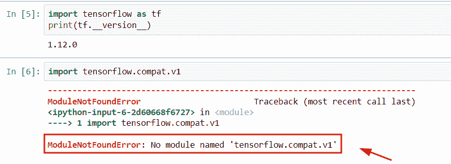

# 导入错误没有名为 TensorFlow 的模块

> 原文：<https://pythonguides.com/import-error-no-module-named-tensorflow/>

[](https://sharepointsky.teachable.com/p/python-and-machine-learning-training-course)

在本 [Python 教程](https://pythonguides.com/learn-python/)中，我们将讨论错误**导入错误` `没有命名为 tensor flow****的模块。**在这里，我们将使用 Python 解释与此错误相关的原因。我们还将讨论以下主题:

*   导入错误没有名为 tensorflow.compat.v1 的模块
*   导入错误没有名为“tensorflow.contrib”的模块
*   导入错误没有名为 tensorflow_hub 的模块
*   导入错误，没有名为“tensorflow addons”的模块
*   导入错误没有名为“tensorflow.python.eager”的模块

目录

[](#)

*   [导入错误没有名为 TensorFlow 的模块](#Import_error_no_module_named_TensorFlow "Import error no module named TensorFlow")
*   [导入错误没有名为‘tensor flow . contrib’的模块](#Import_error_no_module_named_tensorflowcontrib "Import error no module named ‘tensorflow.contrib’")
*   [导入错误没有名为 tensorflow.compat.v1 的模块](#Import_error_no_module_named_tensorflowcompatv1 "Import error no module named tensorflow.compat.v1")
*   [导入错误没有名为‘tensor flow _ hub’的模块](#Import_error_no_module_named_tensorflow_hub "Import error no module named ‘tensorflow_hub’")
*   [导入错误，没有名为‘tensor flow addons’的模块](#Import_error_no_module_named_tensorflow_addons "Import error no module named ‘tensorflow addons’")
*   [导入错误没有名为‘tensor flow . python . eager’的模块](#Import_error_no_module_named_tensorflowpythoneager "Import error no module named ‘tensorflow.python.eager’")

## 导入错误没有名为 TensorFlow 的模块

*   在本节中，我们将讨论错误**导入错误没有在 Python 中命名为 TensorFlow** 的模块。
*   基本上，当我们没有导入 [TensorFlow 库](https://pythonguides.com/tensorflow/)或者我们可以说 TensorFlow 库没有安装在我们的系统中时，就会出现这个错误消息。
*   如果您尚未在系统中安装 TensorFlow 库，但仍想尝试在程序中导入 TensorFlow 库，则会出现错误消息“没有名为 TensorFlow 的模块”。

**举例:**

```py
import tensorflow as tf

tens1 = tf.Variable([[67, 89],[23, 45]])
tens2 = tf.Variable([[94, 117],[189, 210]])
new_output= tf.add(tens1,tens2)
print(new_output)
```

在上面的代码中，我们使用了 tf.add()函数，在这个函数中，我们将给定的张量“tens1”和“tens2”指定为参数。

下面是下面给出的代码的截图。


import error no module named TensorFlow

**现在让我们看看这个错误的解决方案:**

`Visual Code Studio`

如果您已经安装了 Visual code Studio，那么它将使用 pip 环境，如果您想要导入一些所需的库，那么您必须通过命令进行安装。

*   使用 pip 命令安装 TensorFlow

**语法:**

下面是 TensorFlow 库的安装语法

```py
pip install TensorFlow
```

此语法将帮助您解决错误“没有名为 TensorFlow 的模块”

`Jupyter`

如果你已经安装了 Jupyter 笔记本，那么使用 Conda 环境。获取关于如何在 Conda 环境中安装 TensorFlow 库的详细信息。可以参考我们的详细文章[Python 中的 tensor flow](https://pythonguides.com/tensorflow/)。

另外，检查: [TensorFlow 稀疏张量](https://pythonguides.com/tensorflow-sparse-tensor/)

## 导入错误没有名为‘tensor flow . contrib’的模块

*   这里我们要讨论的错误导入错误没有模块名为' TensorFlow.contrib '。
*   基本上 TensorFlow 版没有 contrib 模块。这个模块包含贡献的代码，它也是一个易失性代码。
*   该错误背后的可能原因是解释器在库中找不到 contrib 'module'。
*   TensorFlow 2.x 的最新版本从 TensorFlow 库中删除了 session 和 contrib 模块。

**原因:**模块“contrib”在版本 2.x 中不起作用

**举例:**

```py
import tensorflow.contrib
```

下面是以下代码的截图


import error no module named ‘TensorFlow.contrib’

在以下给定代码中，我们刚刚导入了“TensorFlow.contrib”模块，但当我们执行此命令时，它显示没有名为“TensorFlow.contrib”的模块。可能的原因是该模块在最新版本的 TensorFlow 2.x 中不工作。

让我们讨论一下这个错误的解决方案

*   首先，卸载已经安装的版本，如果它是最新版本，然后用旧版本重新安装。要卸载 tensorflow 2.x，您可以轻松使用命令 pip uninstall TensorFlow。
*   现在，要安装 TensorFlow 1.x 的旧版本，您可以使用以下命令

```py
pip install tensorflow==1.15.0
```

阅读:[Python tensor flow reduce _ sum](https://pythonguides.com/python-tensorflow-reduce_sum/)

## 导入错误没有名为 tensorflow.compat.v1 的模块

*   在本节中，我们将讨论名为 tensorflow.compat.v1 的错误号模块。
*   此错误背后的可能原因是，在 Tensorflow 版本 1.12.0 中，compat.v1 模块已被弃用。该模块将帮助用户编写两种 TensorFlow 版本的代码。
*   本模块不支持 1.12 版本，如果你想在你的系统上执行本模块，那么你必须安装最新的或 1.12 以上的版本。

**举例:**



import error no module named TensorFlow compat v1 in Python

现在，我们将使用 TensorFlow 的更新版本在 Python 中导入 TensorFlow.compat.v1 模块

要在 Conda 提示符下安装 TensorFlow 的新版本，您可以使用以下命令

```py
conda install tensorflow==2.6
```


Solution of no module named TensorFlow compat v1 in Python

正如您在截图中看到的，我们已经检查了 TensorFlow 的版本，它显示的是 2.6 最新版本，并且还成功导入了 TensorFlow.compat.v1。

另外，检查:[模块“TensorFlow”没有属性“session”](https://pythonguides.com/module-tensorflow-has-no-attribute-session/)

## 导入错误没有名为‘tensor flow _ hub’的模块

*   在这个程序中，我们将讨论 Python 中名为‘tensor flow _ hub’的错误 no 模块。
*   基本上，当模块“tensorflow_hub”在 tensorflow 库包中不可用时，会出现此错误消息。

**举例:**


Python import error no module named TensorFlow hub

正如你在截图中看到的，它没有显示模块名称“tensorflow_hub ”,这是因为我们使用的是 TensorFlow 1.14 的旧版本。在此版本中，tensorflow_hub 模块不起作用。

让我们来看看这个错误的解决方案

要解决此错误，您必须在系统中安装最新版本的 TensorFlow。默认情况下，2.7 是一个稳定版本，要安装 TensorFlow 的更新版本，您可以使用以下命令。该命令用于 conda 提示用户。

```py
conda install tensorflow==2.7
```

屏幕上显示程序运行的图片


Solution of import error no module named TensorFlow hub

在这个截图中，你可以看到我们已经安装了最新版本的 TensorFlow 2.7，然后导入 tensorflow_hub 模块。

阅读: [TensorFlow Tensor to numpy](https://pythonguides.com/tensorflow-tensor-to-numpy/)

## 导入错误，没有名为‘tensor flow addons’的模块

*   在本节中，我们将讨论 Python 中名为“tensorflow addons”的错误 no 模块。
*   基本上，插件模块在最新的 TensorFlow 版本 2.7 中可用，但我们必须更新“TensorFlow 插件”模块。该模块在 core Tensorflow 中不可用，它还支持优化器、度量和损失。

屏幕上显示程序运行的图片


import error no module named TensorFlow addons

正如您在输出中看到的，它显示**没有模块名‘tensor flow _ addons’**。而可能的原因是，tensorflow 最新版本 2.7 中有' `tensorflow_addons` '模块。但是我们必须更新‘tensor flow _ addons’模块。

让我们来看看这个错误的解决方案

要解决此错误，您必须在系统中安装旧版本的 TensorFlow。默认情况下，2.7 是一个稳定的版本，但这个模块只在最新版本 2.x 中不工作。

**输出:**


Solution of import error no module named TensorFlow addons

要升级“TensorFlow 插件”模块，您可以轻松使用以下命令

```py
pip install tensorflow-addons
```

在上面的代码中，我们已经在升级模块后导入了 tensorflow_addons()模块。

阅读: [TensorFlow 全球平均池](https://pythonguides.com/tensorflow-global-average-pooling/)

## 导入错误没有名为‘tensor flow . python . eager’的模块

*   这里我们要讨论的是 python 中名为‘tensor flow . Python . eager’的错误 no 模块。
*   当我试图导入“TensorFlow.python.eager”模块时，输出中出现了此错误。背后的原因是 TensorFlow 库的版本。

让我们来看看这个错误的解决方案

在本例中，我们刚刚导入了 TensorFlow 库，然后使用 tf 检查了版本。__version__ 命令。之后，我们导入了‘tensor flow . python . eager’模块。执行这段代码后，输出会显示模块已成功导入。

**举例:**


import error no module named tensorflow python eager

还有，多看看一些 Python TensorFlow 教程。

*   [二元交叉熵张量流](https://pythonguides.com/binary-cross-entropy-tensorflow/)
*   [梯度下降优化器张量流](https://pythonguides.com/gradient-descent-optimizer-tensorflow/)
*   [Python TensorFlow 占位符](https://pythonguides.com/tensorflow-placeholder/)
*   [将列表转换为张量张量流](https://pythonguides.com/convert-list-to-tensor-tensorflow/)
*   [模块“tensorflow”没有属性“div”](https://pythonguides.com/module-tensorflow-has-no-attribute-div/)
*   [模块“tensorflow”没有属性“sparse _ placeholder”](https://pythonguides.com/module-tensorflow-has-no-attribute-sparse_placeholder/)

所以，在本教程中，我们已经解决了错误“**导入错误没有名为 TensorFlow** 的模块”。在这里，我们将使用 Python 来解释与此错误相关的原因。我们还将讨论以下主题:

*   导入错误没有名为 tensorflow.compat.v1 的模块
*   导入错误没有名为“tensorflow.contrib”的模块
*   导入错误没有名为 tensorflow_hub 的模块
*   导入错误，没有名为“tensorflow addons”的模块
*   导入错误没有名为“tensorflow.python.eager”的模块

[Bijay Kumar](https://pythonguides.com/author/fewlines4biju/)

Python 是美国最流行的语言之一。我从事 Python 工作已经有很长时间了，我在与 Tkinter、Pandas、NumPy、Turtle、Django、Matplotlib、Tensorflow、Scipy、Scikit-Learn 等各种库合作方面拥有专业知识。我有与美国、加拿大、英国、澳大利亚、新西兰等国家的各种客户合作的经验。查看我的个人资料。

[enjoysharepoint.com/](https://enjoysharepoint.com/)[](https://www.facebook.com/fewlines4biju "Facebook")[](https://www.linkedin.com/in/fewlines4biju/ "Linkedin")[](https://twitter.com/fewlines4biju "Twitter")