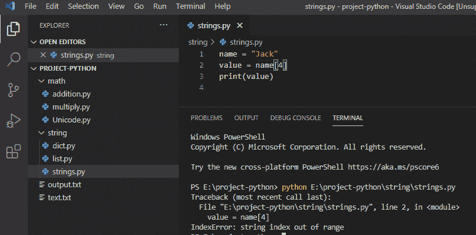

# 如何在 Python 中处理 indexerror:字符串索引超出范围

> 原文：<https://pythonguides.com/indexerror-string-index-out-of-range-python/>

[](https://sharepointsky.teachable.com/p/python-and-machine-learning-training-course)

在本 [Python 教程](https://pythonguides.com/python-download-and-installation/)中，我们将讨论如何在 Python 中处理 indexerror: string index 越界。我们将检查如何修复超出 python 3 范围的错误索引错误字符串索引。

## indexerror 字符串索引超出范围 python

在 python 中， **indexerror 字符串索引超出范围 python** 错误发生在字符被超出字符串值范围的索引检索时，并且字符串索引从 `" 0 "` 开始到字符串索引值的总数。

**举例:**

```py
name = "Jack"
value = name[4]
print(value)
```

写完上面的代码(字符串索引超出范围)，你将打印出 `" value"` ，然后错误将显示为 **" IndexError:字符串索引超出范围"**。这里，**名为【4】**的索引不在范围内，所以出现这个错误是因为索引值不存在，并且超出了范围。

你可以参考下面的截图字符串索引超出范围



IndexError: string index out of range

这是**索引错误:字符串索引超出范围。**

为了解决这个**索引错误:字符串索引超出范围**我们需要给出范围内的字符串索引，以便可以解决这个错误。索引从 0 开始，以字符串中的字符数结束。

**举例:**

```py
name = "Jack"
value = name[2]
print('The character is: ',value)
```

写完上面的代码**IndexError:string index out of range**这是通过给定范围内的字符串索引来解决的，这里，索引 **name[2]** 在范围内，它会给出输出为**“字符是:c”**，因为指定的索引值和字符在范围内。

可以参考下面截图如何求解IndexError: string index 超范围。


于是， `IndexError` **被解析**字符串索引超出范围**。**

您可能会喜欢以下 Python 教程:

*   [解析 Python 时出现意外的 EOF](https://pythonguides.com/unexpected-eof-python/)
*   [删除 python 中的 Unicode 字符](https://pythonguides.com/remove-unicode-characters-in-python/)
*   [Python 中的注释行](https://pythonguides.com/comment-lines-in-python/)
*   [Python 字典追加示例](https://pythonguides.com/python-dictionary-append/)
*   [在 Python 中检查列表是否为空](https://pythonguides.com/check-if-a-list-is-empty-in-python/)
*   [Python 字典方法+示例](https://pythonguides.com/python-dictionary-methods/)
*   [Python 列表方法](https://pythonguides.com/python-list-methods/)
*   [Python 字符串函数](https://pythonguides.com/string-methods-in-python/)
*   [语法错误标识符 python3 中的无效字符](https://pythonguides.com/syntaxerror-invalid-character-in-identifier-python3/)
*   [从字符串 Python 中删除字符](https://pythonguides.com/remove-character-from-string-python/)
*   [python 中的百分号是什么意思](https://pythonguides.com/percent-sign-mean-in-python/)

这是如何解决**IndexError:python 中的字符串索引超出范围**或 **indexerror 字符串索引超出范围 python 3** 。

[Bijay Kumar](https://pythonguides.com/author/fewlines4biju/)

Python 是美国最流行的语言之一。我从事 Python 工作已经有很长时间了，我在与 Tkinter、Pandas、NumPy、Turtle、Django、Matplotlib、Tensorflow、Scipy、Scikit-Learn 等各种库合作方面拥有专业知识。我有与美国、加拿大、英国、澳大利亚、新西兰等国家的各种客户合作的经验。查看我的个人资料。

[enjoysharepoint.com/](https://enjoysharepoint.com/)[](https://www.facebook.com/fewlines4biju "Facebook")[](https://www.linkedin.com/in/fewlines4biju/ "Linkedin")[](https://twitter.com/fewlines4biju "Twitter")