# Python 中的索引和切片

> 原文：<https://pythonguides.com/indexing-and-slicing-in-python/>

[](https://sharepointsky.teachable.com/p/python-and-machine-learning-training-course)

在本 [python 教程中，](https://pythonguides.com/python-hello-world-program/)我们将通过几个例子讨论 Python 中的**索引和切片，我们还将涉及以下主题:**

*   python 中的索引是什么？
*   Python 中的正索引示例
*   Python 中的负索引示例
*   python 字符串中的索引
*   python 列表中的索引
*   python 数组中的索引
*   python 元组中的索引
*   python 字典中的索引
*   python 中的切片是什么？
*   Python 使用切片对象获取子串
*   Python 使用负索引获取子串
*   python 列表中的切片
*   在 python 字符串中切片
*   python 元组中的切片
*   python 数组切片

目录

[](#)

*   [python 中什么是索引？](#What_is_Indexing_in_python "What is Indexing in python?")
*   [Python 中的正索引示例](#Positive_indexing_example_in_Python "Positive indexing example in Python")
*   [Python 中的负索引示例](#Negative_indexing_example_in_Python "Negative indexing example in Python")
*   [python 字符串中的索引](#Indexing_in_python_string "Indexing in python string")
*   [python 列表中的索引](#Indexing_in_python_list "Indexing in python list")
*   [Python 数组中的索引](#Indexing_in_Python_array "Indexing in Python array")
*   [python 元组中的索引](#Indexing_in_python_tuple "Indexing in python tuple")
*   [python 字典中的索引](#Indexing_in_a_python_dictionary "Indexing in a python dictionary")
*   [python 中切片是什么？](#What_is_slicing_in_python "What is slicing in python?")
*   [Python 使用切片对象获取子串](#Python_get_substring_using_slice_object "Python get substring using slice object")
*   [Python 使用负索引获得子串](#Python_get_substring_using_negative_index "Python get substring using negative index")
*   [在 Python 列表中切片](#Slicing_in_Python_list "Slicing in Python list")
*   [在 python 字符串中切片](#Slicing_in_python_string "Slicing in python string")
*   [在 python 元组中切片](#Slicing_in_python_tuple "Slicing in python tuple")
*   [Python 数组切片](#Slicing_in_Python_array "Slicing in Python array")

## python 中什么是索引？

*   **Python 中的索引**是指通过 iterable 中的位置来引用 iterable 的元素。
*   每个字符都可以使用它们的索引号来访问。
*   要访问字符串中的字符，我们有两种方法:
    *   **正指数**
    *   **负指数**

## Python 中的正索引示例

在 **Python 正索引**中，我们传递一个我们想要访问的正索引，放在方括号中。索引号从表示字符串的第一个字符的 `0` 开始。

**举例:**

```py
my_str = "Python Guides"
print(my_str[0])
```

在这个输出中，我们可以看到 python 中的**正索引示例。你可以参考下面的截图。**

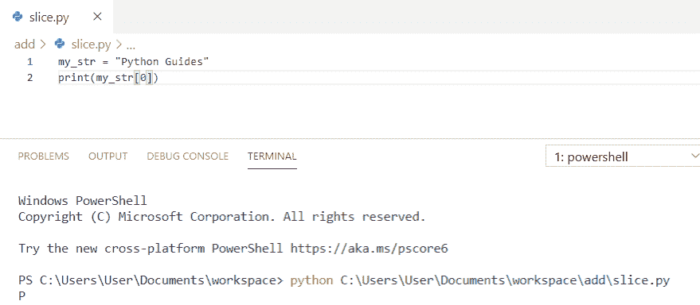

Positive indexing example in Python

你可能喜欢读， [Python 程序求 n 个数之和](https://pythonguides.com/python-program-to-find-sum-of-n-numbers/)和[如何用 Python 把两个数相加](https://pythonguides.com/add-two-numbers-in-python/)。

## Python 中的负索引示例

在 Python 的**负索引中，我们用方括号传递我们想要访问的负索引。这里，索引号从索引号 `-1` 开始，表示字符串的最后一个字符**。****

 ****举例:**

```py
my_str = "Python Guides"
print(my_str[-1])
```

在这个输出中，我们可以看到 python 中的一个**负索引示例。你可以参考下面的截图。**

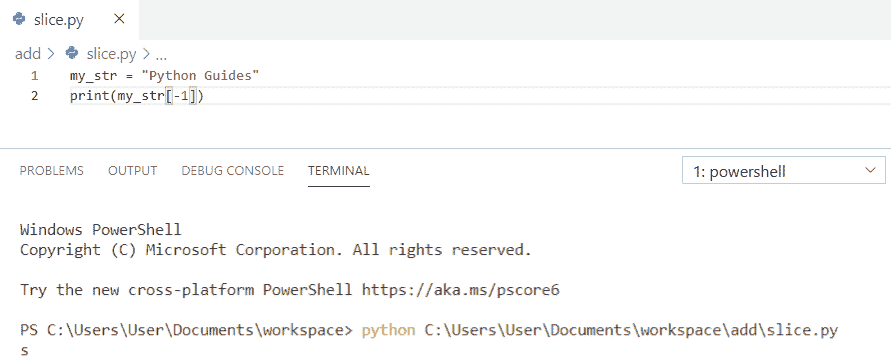

Negative indexing example in Python

## python 字符串中的索引

**python 中的字符串索引**允许你通过使用索引直接访问字符串中的单个字符。这里用**(str[3])】**来得到**【c】**。

**举例:**

```py
str = 'Welcome'
print(str[3])
```

在这个输出中，我们可以看到 python 字符串中的**索引。你可以参考下面的截图。**

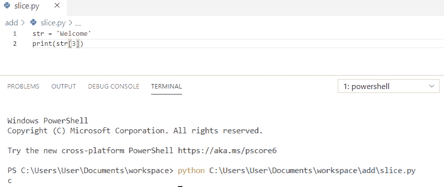

Indexing in python string

你可能喜欢用 [Python 程序打印数组](https://pythonguides.com/python-program-to-print-element-in-an-array/)中的元素。

## python 列表中的索引

**Python 列表索引**可以通过引用其**索引号**来访问列表值。这里，我们使用了**(list[2])“**，它返回**“马”**。

**举例:**

```py
list = ['Dog', 'Cat', 'Horse', 'Bear']
print(list[2])
```

在这个输出中，我们可以看到 python 列表中的**索引。你可以参考下面的截图。**

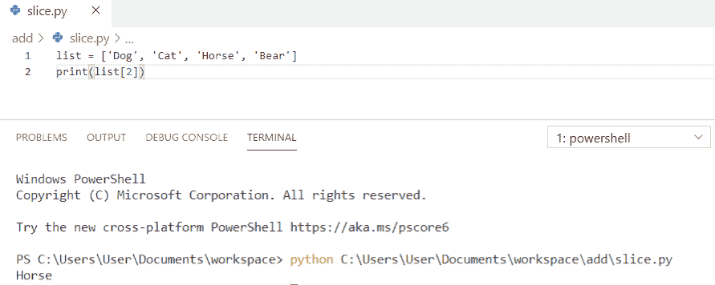

Indexing in python list

## Python 数组中的索引

**python 中的数组索引**和访问数组元素是一样的。通过引用数组元素的索引号来访问它。这里我们用了**(my _ arr[1])】**来访问**【12】**。

**举例:**

```py
import numpy as np
my_arr = np.array([10, 12, 14, 16])
print(my_arr[1])
```

在这个输出中，我们可以看到 python 数组中的**索引。你可以参考下面的截图。**

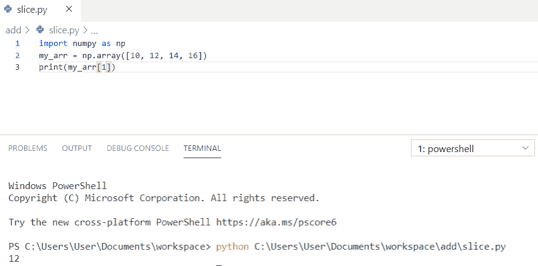

Indexing in python array

查看以下 Python 数组教程:

*   [Python 串联数组](https://pythonguides.com/python-concatenate-arrays/)
*   [如何将 Python 数组写入 CSV](https://pythonguides.com/python-write-array-to-csv/)
*   [Python 形状的一个数组](https://pythonguides.com/python-shape-of-an-array/)
*   [如何将 Python 字符串转换成字节数组并举例](https://pythonguides.com/python-string-to-byte-array/)
*   [Python 数组与示例](https://pythonguides.com/python-array/)
*   [在 Python 中创建一个空数组](https://pythonguides.com/create-an-empty-array-in-python/)

## python 元组中的索引

我们将使用索引操作符 **"[]"** 从 [Python 元组](https://pythonguides.com/create-a-tuple-in-python/)中访问一个条目。其中索引从 0 开始。这里我们用了一个从右**(my _ tuple[-2])】**开始的**负索引**得到**【8】**。

**举例:**

```py
my_tuple = (2, 4, 6, 8, 10)
print(my_tuple[-2])
```

在这个输出中，我们可以看到 python 元组中的**索引。你可以参考下面的截图。**

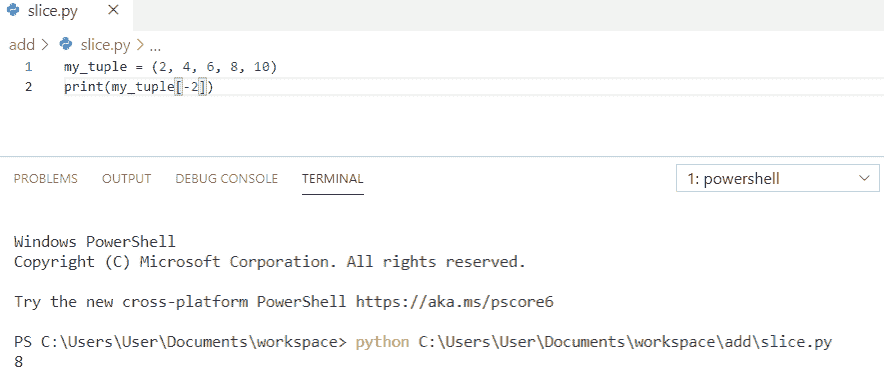

Indexing in python tuple

*   [Python 将元组转换为列表](https://pythonguides.com/python-convert-tuple-to-list/)
*   [Python 元组排序列表](https://pythonguides.com/python-sort-list-of-tuples/)

## python 字典中的索引

**在 Python 中索引一个字典**就是访问该索引处的键或值。这里，我们将使用 list()来索引一个 [Python 字典](https://pythonguides.com/create-a-dictionary-in-python/)的键。为了获取列表中索引处的键，我们使用了 **"m_list[1]"** ，它将返回 `"John"` 。

**举例:**

```py
my_dictionary = {"ani": 101, "John": 102}
m_list = list(my_dictionary)
k = m_list[1]
print(k)
```

在这个输出中，我们可以看到 python 字典中的**索引。你可以参考下面的截图。**

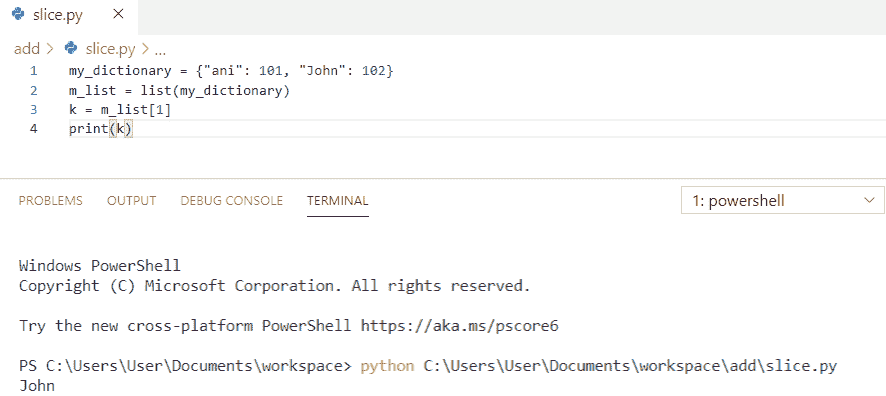

Indexing in a python dictionary

*   [Python 字典方法](https://pythonguides.com/python-dictionary-methods/)
*   [Python 字典追加示例](https://pythonguides.com/python-dictionary-append/)
*   [如何在 Python 中将 dictionary 转换成 JSON](https://pythonguides.com/convert-dictionary-to-json-python/)

## python 中切片是什么？

**python 中的切片**用于访问序列的部分。切片对象用于对给定的序列或任何对象进行切片。当我们需要字符串的一部分而不是完整的字符串时，我们使用切片。

**语法:**

```py
string[start : end : step]
```

**举例:**

```py
my_str = "Python Guides"
print(my_str[-1 : -10 : -2])
```

在这个输出中，我们可以看到 python 中的切片。此处，步长为`-2 "`，因此从相反方向开始，每隔一个值打印一次。你可以参考下面的截图。

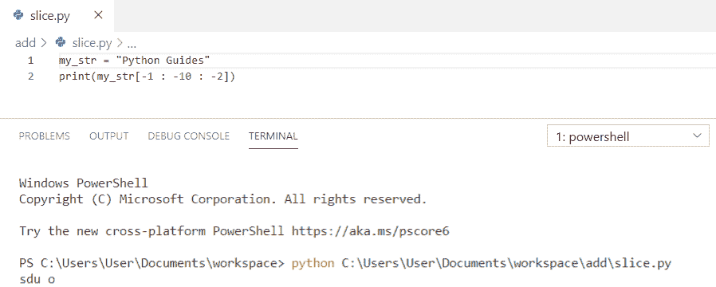

What is slicing in python

## Python 使用切片对象获取子串

为了在 python 中使用 slice 对象来获取子串，我们将使用**“slice(5)”**。这里，开始**【0】**，结束**【5】**，所以取值比结束值小 1。

**举例:**

```py
my_str = 'Guides'
s_obj = slice(5) 
print(my_str[s_obj])
```

在这个输出中，我们可以看到**如何在 python** 中使用 slice 对象获取子串。在这里，我们可以看到子串为**【向导】**。你可以参考下面的截图。

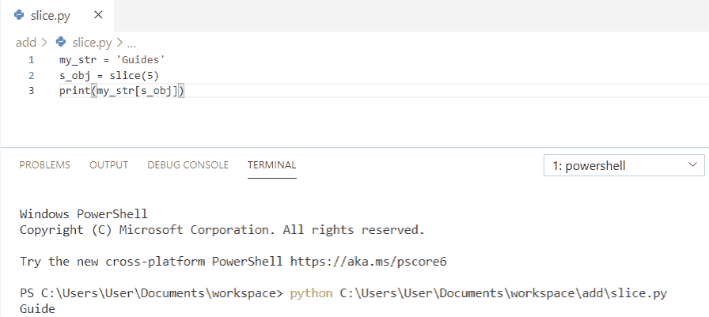

Python get substring using slice object

## Python 使用负索引获得子串

为了**在 python** 中使用负索引获得子串，我们将使用**“slice(-1，-4，-1)”**。这里开始是`-1 "`，结束是`-4 "`，步是负`-1 "`。

**举例:**

```py
my_str = 'Guides'
s_obj = slice(-1, -4, -1) 
print(my_str[s_obj])
```

在这个输出中，我们可以看到如何在 python 中使用负索引获得子串。在这里，我们可以看到子串为**“sed”**。你可以参考下面的截图。

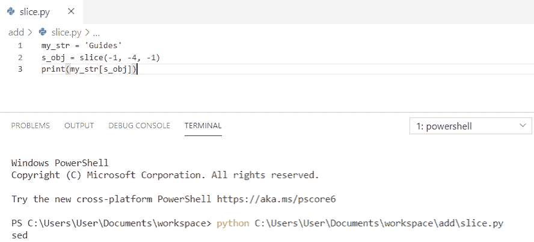

Python get substring using negative index

## 在 Python 列表中切片

让我们看看 python 列表中的**切片。**

在这个例子中，我们使用了**(my _ list[-4::1])】**对列表进行切片。因此，开始是`-4 "`，我们没有为结束指定任何值，因此，默认情况下，它将持续到最后， `"1"` 是步骤。

**举例:**

```py
my_list = [10, 20, 30, 40, 50, 60] 
print(my_list[-4::1]) 
```

在这个输出中，我们可以看到 python 列表中的切片。在这里，我们得到了输出中的列表。你可以参考下面的截图。

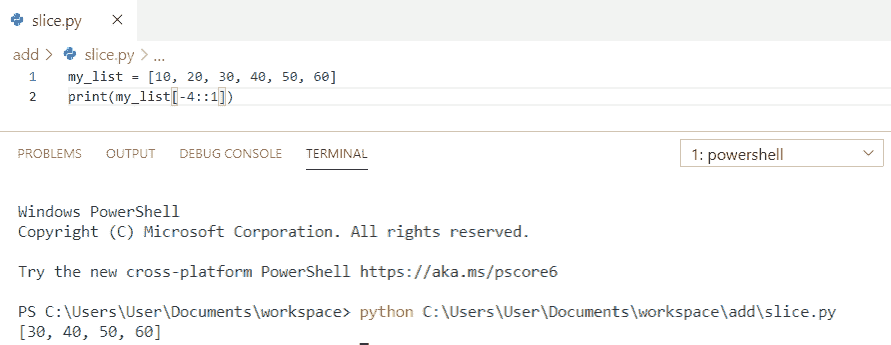

Slicing in python list

*   [检查一个列表是否存在于另一个列表中 Python](https://pythonguides.com/check-if-a-list-exists-in-another-list-python/)
*   [Python 向 CSV 写列表](https://pythonguides.com/python-write-a-list-to-csv/)
*   [使用 if-else 理解 Python 列表](https://pythonguides.com/python-list-comprehension-using-if-else/)
*   [Python 从列表中选择](https://pythonguides.com/python-select-from-a-list/)
*   [Python 将元组转换为列表](https://pythonguides.com/python-convert-tuple-to-list/)
*   [Python 元组排序列表](https://pythonguides.com/python-sort-list-of-tuples/)

## 在 python 字符串中切片

**python string 中的切片**用于通过切片从给定的字符串中获取子串。我们将开始索引指定为**“3”**，结束索引指定为**“6”**，它将返回一个字符串。

**举例:**

```py
str ='Python!'
print(str[3:6])
```

在这个输出中，我们可以看到**在 python 字符串**中切片。在这里，我们得到字符串作为输出。你可以参考下面的截图。

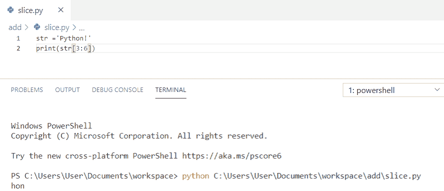

Slicing in python string

*   [如何在 python 中把整数转换成字符串](https://pythonguides.com/convert-an-integer-to-string-in-python/)
*   [Python 将列表转换成字符串](https://pythonguides.com/python-convert-list-to-string/)
*   [Python 中的字符串方法及示例](https://pythonguides.com/string-methods-in-python/)
*   [Python 生成随机数和字符串](https://pythonguides.com/python-generate-random-number/)
*   [Python 将字符串写入文件](https://pythonguides.com/python-write-string-to-a-file/)

## 在 python 元组中切片

为了**在 Python 中切片一个元组，**我们将使用**(my _ tuple[4])“**。为了得到这个值，我们必须指定一个正整数，从从左数的元组中获取索引。在负索引的情况下，我们必须从右边获取索引。

**举例:**

```py
my_tuple = ('v', 'w', 'x', 'y', 'z')
print(my_tuple[4])
print(my_tuple[-3])
```

在这个输出中，我们可以看到 python 元组中的切片。这里，我们得到两个输出。你可以参考下面的截图。

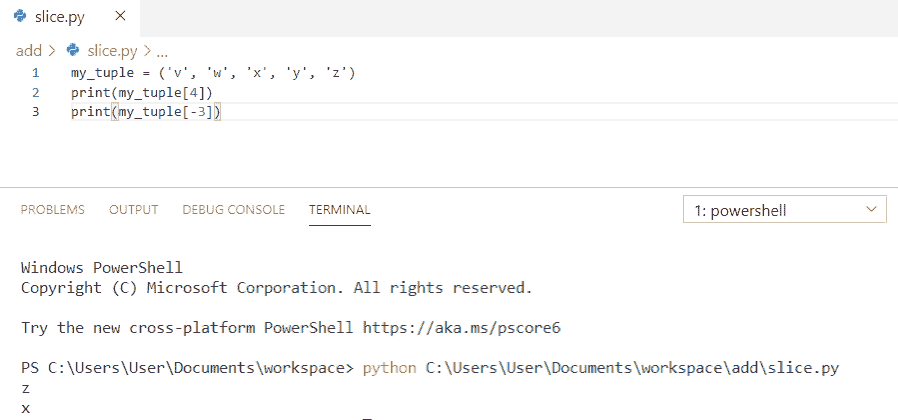

Slicing in python tuple

*   [在 Python 中创建一个元组](https://pythonguides.com/create-a-tuple-in-python/)
*   [Python 将元组转换为列表](https://pythonguides.com/python-convert-tuple-to-list/)

## Python 数组切片

为了在 python 数组中进行**切片，我们将把 numPy 作为 np 导入。我们将定义为“(my_arr[1:])”。这里，开始是“1”并且没有通过**结束**，所以，它将考虑直到一个数组的最后长度。**

**举例:**

```py
import numpy as np
my_arr = np.array([10, 11, 12, 13, 14])
print(my_arr[1:])
```

在这个输出中，我们可以看到 python 数组中的切片。在这里，我们以数组的形式获得输出。你可以参考下面的截图。

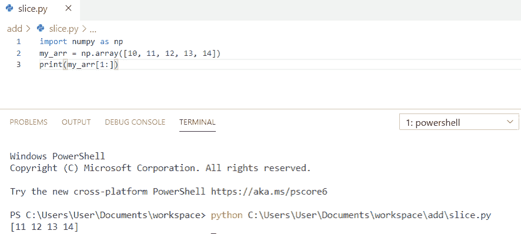

Slicing in python array

在本教程中，我们已经通过示例学习了 Python 中的**索引和切片，并且我们已经涵盖了以下主题:**

*   python 中的索引是什么？
*   Python 中的正索引示例
*   Python 中的负索引示例
*   python 字符串中的索引
*   python 列表中的索引
*   python 数组中的索引
*   python 元组中的索引
*   python 字典中的索引
*   python 中的切片是什么？
*   Python 使用切片对象获取子串
*   Python 使用负索引获取子串
*   python 列表中的切片
*   在 python 字符串中切片
*   python 元组中的切片
*   python 数组切片

[Bijay Kumar](https://pythonguides.com/author/fewlines4biju/)

Python 是美国最流行的语言之一。我从事 Python 工作已经有很长时间了，我在与 Tkinter、Pandas、NumPy、Turtle、Django、Matplotlib、Tensorflow、Scipy、Scikit-Learn 等各种库合作方面拥有专业知识。我有与美国、加拿大、英国、澳大利亚、新西兰等国家的各种客户合作的经验。查看我的个人资料。

[enjoysharepoint.com/](https://enjoysharepoint.com/)[](https://www.facebook.com/fewlines4biju "Facebook")[](https://www.linkedin.com/in/fewlines4biju/ "Linkedin")[](https://twitter.com/fewlines4biju "Twitter")**