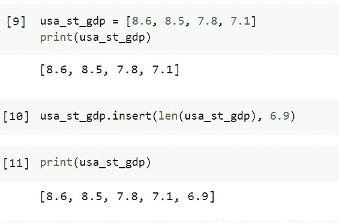
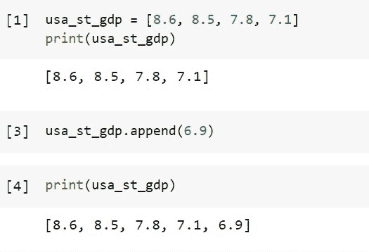
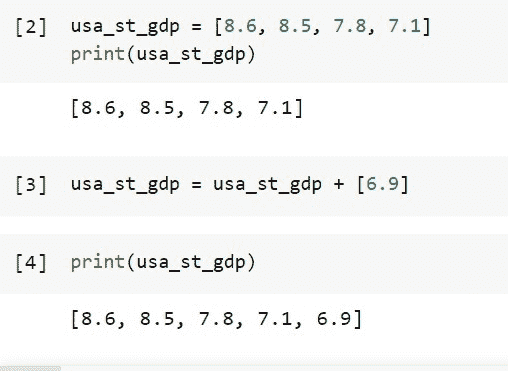
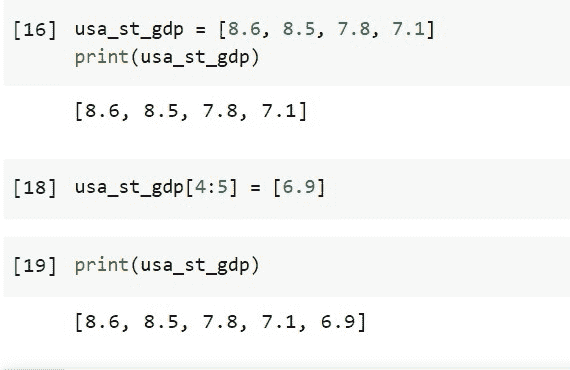

# 如何在 Python 列表的末尾插入项目[4 种不同的方式]

> 原文：<https://pythonguides.com/insert-item-at-end-of-python-list/>

[](https://sharepointsky.teachable.com/p/python-and-machine-learning-training-course)

在这个 [Python 教程](https://pythonguides.com/beginners-guide-to-programming/)中，我们将讨论如何**在 Python 列表**的末尾插入条目。我们将看到 4 种不同的方法来**添加项目到列表的末尾 python** 。

在整个课程中，我们将使用一个项目列表作为示例来重点介绍列表插入，因为无论列表包含何种类型的数据，列表插入技术都必须相同。让我们看看在 Python 列表的末尾插入项目的不同方法**。**

目录

[](#)

*   [在 Python 列表的末尾插入项目](#Insert_Item_At_End_of_Python_List "Insert Item At End of Python List")
    *   [方法 1:使用 Insert()函数在 Python 列表的末尾插入项目](#Method_1_Insert_Item_At_End_of_Python_List_using_insert_function "Method 1: Insert Item At End of Python List using insert() function")
    *   [方法 2:使用 append()函数在 Python 中的列表末尾插入一个项目](#Method_2_Insert_an_item_at_end_of_a_list_in_Python_using_append_function "Method 2: Insert an item at end of a list in Python using append() function")
    *   [方法 3:使用+和[]操作符在 Python 中的列表末尾插入一个项目](#Method-3_Insert_an_item_at_end_of_a_list_in_Python_using_and_Operator "Method-3: Insert an item at end of a list in Python using + and [] Operator")
    *   [方法 4:在 Python 中，要在列表末尾插入一个条目，使用切片方法](#Method_4_To_insert_an_item_at_end_of_a_list_in_Python_use_slicing_method "Method 4: To insert an item at end of a list in Python, use slicing method")

## 在 Python 列表的末尾插入项目

在这里，让我们来看 4 种不同的方法来**在 Python 列表**的末尾插入项目。

### **方法 1:使用 Insert()函数** 在 Python 列表末尾插入条目

Python 的 insert()函数，用于在指定索引处插入指定元素或项目的列表。下面给出了语法。

```py
list_name.insert(index, value)
```

如果指定的索引大于或等于列表的长度，则在 [Python 列表](https://pythonguides.com/python-list-methods/)的末尾插入。

使用下面的代码创建一个项目列表，这些项目是美国前 4 个州的实际 GDP 百分比，如 ***`Tennessee = 8.6`、`New Hemsphire = 8.5`、`California = 7.8`和`Nevada = 7.1`*** 。

```py
usa_st_gdp = [8.6, 8.5, 7.8, 7.1]
print(usa_st_gdp)
```

现在我们要添加新的州`*`Indiana`*`的实际 GDP 百分比，或者它将进入列表中的第 5 个州，我们将使用`*`insert()`*`方法。

```py
usa_st_gdp.insert(len(usa_st_gdp), 6.9)
```

使用下面的代码检查列表。

```py
print(usa_st_gdp)
```



To Insert Item At The End of The Python List

看看输出，我们是如何在 Python 中在列表的末尾插入浮动值的项的。

读取 [Python 程序打印数组中的元素](https://pythonguides.com/python-program-to-print-element-in-an-array/)

### **方法二:在 Python 中使用 append()函数** 在列表末尾插入一个条目

使用下面的代码创建一个项目列表，这些项目是美国前 4 个州的实际 GDP 百分比，如 ***`Tennessee = 8.6`、`New Hemsphire = 8.5`、`California = 7.8`和`Nevada = 7.1`*** 。

```py
usa_st_gdp = [8.6, 8.5, 7.8, 7.1]
print(usa_st_gdp)
```

我们现在将使用 append()方法添加新州`*`Indiana`*`的实际 GDP %,或者将成为列表中第五个州的州。

```py
usa_st_gdp.append(6.9)
```

使用下面的代码查看列表。

```py
print(usa_st_gdp)
```



To Insert Item At The End of-The-Python List Using Append

这是如何在 Python 中使用 append()函数在列表末尾插入一个项目。

阅读 [Python 回文程序及示例](https://pythonguides.com/python-palindrome-program/)

### **方法-3:在 Python 中使用+和[]运算符** 在列表末尾插入一个项目

使用下面的代码创建一个项目列表，这些项目是美国前 4 个州的实际 GDP 百分比，如 ***`Tennessee = 8.6`、`New Hemsphire = 8.5`、`California = 7.8`和`Nevada = 7.1`*** 。

```py
usa_st_gdp = [8.6, 8.5, 7.8, 7.1]
print(usa_st_gdp)
```

我们现在将使用+和[]运算符来添加新州`*`Indiana`*`的实际 GDP %,或者将成为列表中第五个州的州。

```py
usa_st_gdp = usa_st_gdp + [6.9]
```

使用下面的代码查看列表。

```py
print(usa_st_gdp)
```



To Insert Item At The End of The Python List Example

这是如何在 Python 中使用+和[]运算符在列表末尾插入一个项目。

读 [Python 程序求偶数或奇数](https://pythonguides.com/python-program-for-even-or-odd/)

### **方法 4:在 Python 中，要在列表末尾插入一个条目，使用切片方法**

使用下面的代码创建一个项目列表，这些项目是美国前 4 个州的实际 GDP 百分比，如 ***`Tennessee = 8.6`、`New Hemsphire = 8.5`、`California = 7.8`和`Nevada = 7.1`*** 。

```py
usa_st_gdp = [8.6, 8.5, 7.8, 7.1]
print(usa_st_gdp)
```

现在使用切片方法添加新的州`*`Indiana`*`的实际 GDP %,或者将成为列表中第五个州的州。

```py
usa_st_gdp[4:5] = [6.9]
```

使用下面的代码显示列表。

```py
print(usa_st_gdp)
```



To Insert Item At The End of The Python List Using Slicing

我们已经学习了**如何以不同的方式在 Python** 中的列表末尾插入条目，比如使用切片、插入、(+和[])操作符和 append()方法。

您可能会喜欢以下 Python 教程:

*   [Python 程序检查闰年](https://pythonguides.com/python-program-to-check-leap-year/)
*   [在 Python 中连接多个列表](https://pythonguides.com/concatenate-multiple-lists-in-python/)
*   [Python 程序求正方形的面积](https://pythonguides.com/python-program-to-find-the-area-of-square/)
*   [Python 程序求矩形的面积](https://pythonguides.com/python-program-to-find-an-area-of-a-rectangle/)
*   [Python 程序打印图案](https://pythonguides.com/print-pattern-in-python/)
*   [Python 程序反转字符串的例子](https://pythonguides.com/python-program-to-reverse-a-string/)

[Saurabh](https://pythonguides.com/author/saurabh/)

我叫 Kumar Saurabh，是一名 Python 开发人员，在 TSInfo Technologies 工作。此外，像 Python 编程，SciPy，机器学习，人工智能等技术的专业知识。是我喜欢做的事情。