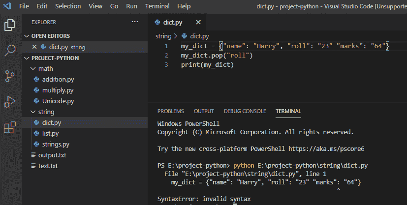
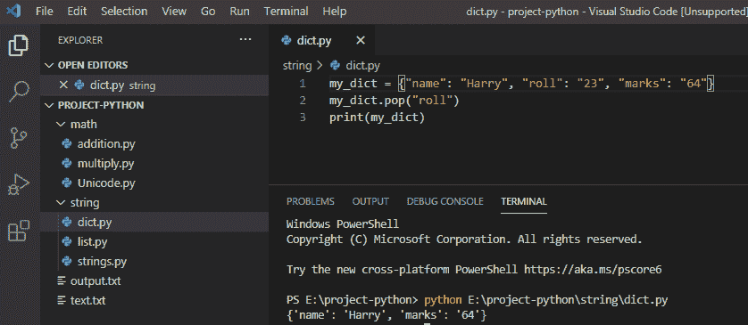

# python 中的语法无效

> 原文：<https://pythonguides.com/invalid-syntax-in-python/>

[](https://sharepointsky.teachable.com/p/python-and-machine-learning-training-course)

在本 [Python 教程](https://pythonguides.com/python-download-and-installation/)中，我们将讨论如何修复 python 中的**无效语法或者 python** 中的**语法错误。我们将检查如何修复错误**语法错误:无效语法 python 3** 。**

## python 中的语法无效

在 python 中，如果您运行代码，它将执行，如果解释器在程序执行期间发现 python 中的任何无效语法，它将向您显示一个名为无效语法的错误，它还将帮助您确定无效语法在代码中的位置和行号。

**举例:**

```py
my_dict = {"name": "Harry", "roll": "23" "marks": "64"}
my_dict.pop("roll")
print(my_dict)
```

写完上面的代码(Syntaxerror invalid syntax)，你将打印出 `" my_dict "` ，然后错误将显示为"**" syntax error:invalid syntax**"。这里，第 1 行的字典文字中的无效语法，我们可以看到在“roll”后面缺少一个逗号，因此它遇到了一个无效语法。

你可以参考下面的截图语法错误:无效语法



syntaxerror: invalid syntax python 3

这是**语法错误:无效语法。**

为了解决这个**语法错误:无效语法**我们需要小心语法，因为一旦解释器遇到一些没有意义的东西或任何缺少的语法，它就会给出一个语法错误。

**举例:**

```py
my_dict = {"name": "Harry", "roll": "23", "marks": "64"}
my_dict.pop("roll")
print(my_dict)
```

写完上面的代码后(Syntaxerror 无效语法)，你将打印出 `" my_dict "` ，然后输出将显示为" **{"name": "Harry "，" marks": "64"}** 。这里，通过在**“roll”**后加上逗号来解决错误，因此解释器不会发现任何错误，代码将成功运行。

你可以参考下面的截图语法错误:无效语法



how to fix invalid syntax in python

因此，**syntax error:Python**中的无效语法得到了解决。

您可能会喜欢以下 Python 教程:

*   [如何在 python 中创建变量](https://pythonguides.com/create-python-variable/)
*   [Python 中的阿姆斯特朗数](https://pythonguides.com/armstrong-number-in-python/)
*   [Python 回文程序](https://pythonguides.com/python-palindrome-program/)
*   [如何在 Python 中创建字符串](https://pythonguides.com/create-a-string-in-python/)
*   [如何在 python 中使用正则表达式拆分字符串](https://pythonguides.com/python-split-string-regex/)
*   [无换行符的 Python 打印](https://pythonguides.com/python-print-without-newline/)
*   [Python 将列表转换成字符串](https://pythonguides.com/python-convert-list-to-string/)
*   [Python 方块一号](https://pythonguides.com/python-square-a-number/)
*   [语法错误标识符 python3 中的无效字符](https://pythonguides.com/syntaxerror-invalid-character-in-identifier-python3/)

这是如何修复 python 中的无效语法或****syntax error:python 3**中的无效语法**或**语法错误 python** 。

[Bijay Kumar](https://pythonguides.com/author/fewlines4biju/)

Python 是美国最流行的语言之一。我从事 Python 工作已经有很长时间了，我在与 Tkinter、Pandas、NumPy、Turtle、Django、Matplotlib、Tensorflow、Scipy、Scikit-Learn 等各种库合作方面拥有专业知识。我有与美国、加拿大、英国、澳大利亚、新西兰等国家的各种客户合作的经验。查看我的个人资料。

[enjoysharepoint.com/](https://enjoysharepoint.com/)[](https://www.facebook.com/fewlines4biju "Facebook")[](https://www.linkedin.com/in/fewlines4biju/ "Linkedin")[](https://twitter.com/fewlines4biju "Twitter")