# 遍历字典 Python

> 原文：<https://pythonguides.com/iterate-through-dictionary-python/>

[](https://sharepointsky.teachable.com/p/python-and-machine-learning-training-course)

在这个 [Python 教程](https://pythonguides.com/learn-python/)中，我们将使用 Python 中的一些例子来研究**如何在 Python** 中迭代字典。此外，我们还将涉及这些主题。

*   使用索引遍历字典 Python
*   遍历字典 Python for 循环
*   遍历字典 Python 反向
*   遍历 Python 排序的字典
*   按顺序遍历字典 Python
*   遍历字典 Python lambda
*   遍历包含多个值的字典 Python
*   使用列表遍历字典 Python
*   Python 在字典中遍历字典
*   Python 遍历数据帧字典
*   Python 遍历字典并删除条目
*   Python 遍历字典并更改值
*   Python 遍历按关键字排序的字典
*   Python 遍历按值排序的字典

目录

[](#)

*   [Python 遍历字典 Python](#Python_iterate_through_dictionary_Python "Python iterate through dictionary Python")
*   [使用索引](#Iterate_through_dictionary_Python_with_index "Iterate through dictionary Python with index")遍历字典 Python
*   [循环遍历字典 Python](#Iterate_through_dictionary_Python_for_loop "Iterate through dictionary Python for loop")
*   [遍历字典 Python 逆向](#Iterate_through_dictionary_Python_reverse "Iterate through dictionary Python reverse")
*   [遍历 Python 排序的字典](#Iterate_through_dictionary_Python_sorted "Iterate through dictionary Python sorted")
*   [按照顺序遍历字典 Python](#Iterate_through_dictionary_Python_in_order "Iterate through dictionary Python in order")
*   [遍历字典 Python lambda](#Iterate_through_dictionary_Python_lambda "Iterate through dictionary Python lambda")
*   [遍历包含多个值的字典 Python](#Iterate_through_dictionary_Python_with_multiple_values "Iterate through dictionary Python with multiple values")
*   [用列表](#Iterate_through_dictionary_Python_with_list "Iterate through dictionary Python with list")遍历字典 Python
*   [Python 在字典中迭代字典](#Python_iterate_through_dictionary_within_dictionary "Python iterate through dictionary within dictionary")
*   [Python 遍历数据帧字典](#Python_iterate_through_dictionary_of_dataframes "Python iterate through dictionary of dataframes")
*   [Python 遍历字典并删除条目](#Python_iterate_through_dictionary_and_remove_items "Python iterate through dictionary and remove items")
*   [Python 遍历字典并改变值](#Python_iterate_through_dictionary_and_change_values "Python iterate through dictionary and change values")
*   [Python 遍历按关键字排序的字典](#Python_iterate_through_dictionary_sorted_by_key "Python iterate through dictionary sorted by key")
*   [Python 遍历按值排序的字典](#Python_iterate_through_dictionary_sorted_by_value "Python iterate through dictionary sorted by value")

## Python 遍历字典 Python

*   在这一节中，我们将讨论如何在 Python 中迭代字典。
*   要遍历一个字典，我们可以很容易地使用 `dictionary.items()` 方法，它总是以**键-值**对的形式返回列表和元组等可迭代对象。
*   在 Python dictionary 中， `dict.items()` 方法用于以**键值**对的形式显示字典元素列表，该方法在 Python 包模块中可用。

**语法:**

让我们看一下语法并理解 `dict.items()` 函数的工作原理

```py
dictionary.items()
```

**举例:**

让我们举个例子，看看如何用 Python 迭代一个字典。

**源代码:**

```py
my_dictionary = {'USA': 678, 'Germany': 145, 'France': 789}

for m in my_dictionary.items():
    print("Iterate dictionary elements:",m)
```

在上面的代码中，我们创建了一个名为**‘my _ dictionary’**的简单字典，它包含键值对形式的元素。之后，我们使用了 `for` 循环方法来遍历键-值对，它将操作键和值，并以元组的形式返回。

下面是下面给出的代码的截图。

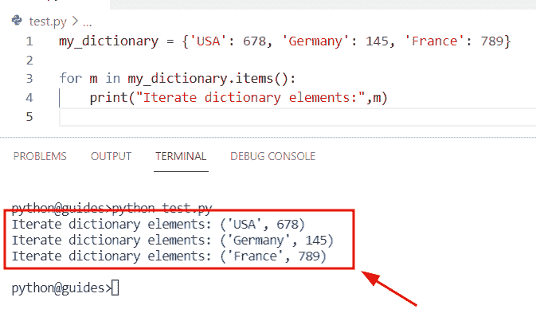

Iterate through dictionary Python

阅读: [Python 字典重复键](https://pythonguides.com/python-dictionary-duplicate-keys/)

## 使用索引遍历字典 Python

*   这里我们将通过使用 Python 中的 index 方法来迭代字典。
*   为了执行这个特定的任务，我们将使用 for 循环方法，它将迭代给定字典中可用的所有元素。
*   在 `for-loop` 中，我们运行了枚举器函数，该方法将字典和列表等可迭代对象作为参数，并返回枚举对象。在本例中，这些函数返回键和索引位置。

**举例:**

```py
new_dictionary = {'George': 134, 'John': 245, 'James': 120}

for new_indices, new_k in enumerate(new_dictionary):
    print('Iterate dictionary: ', new_indices, ' :- ', new_k)
```

下面是以下给定代码的执行过程

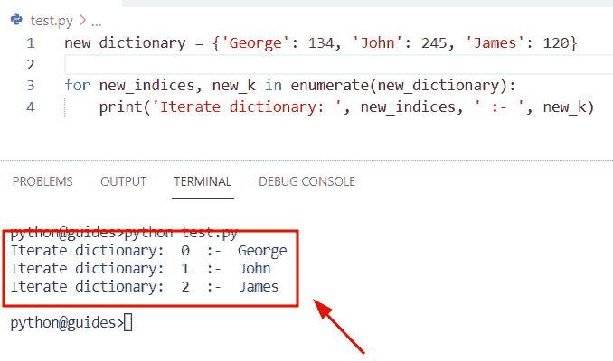

Iterate through the dictionary with index in Python

阅读: [Python 字典计数+实例](https://pythonguides.com/python-dictionary-count/)

## 循环遍历字典 Python

*   在这个程序中，我们将讨论如何使用 for 循环方法在 Python 中迭代一个字典。
*   这个方法将帮助用户迭代字典中的每个值和键。例如，假设您有一个包含水果元素的字典，其形式为**键-值**对，您希望打印出特定水果名称的键和值。

**举例:**

```py
Fruit={'Orange':567,'Mango':134,'Cherry':167}

for i in Fruit:
	print(i, Fruit[i])
```

在下面给出的代码中，我们创建了一个字典**‘Fruit’**，它包含了**键值**对形式的元素。之后，我们使用 for 循环并迭代字典中的每个值。

下面是以下给定代码的实现。

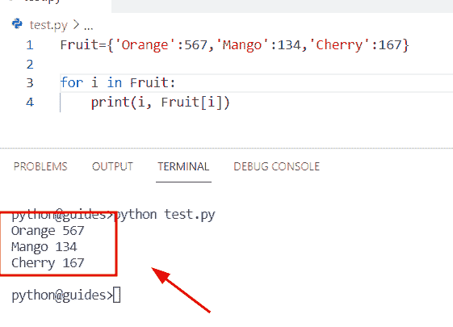

Iterate through dictionary Python for loop

阅读: [Python 字典增量值](https://pythonguides.com/python-dictionary-increment-value/)

## 遍历字典 Python 逆向

*   在这一节中，我们将讨论如何通过 Python 中的字典迭代来反转元素。
*   为了迭代字典元素，我们可以很容易地使用 list comprehension 方法和 `dict.items()` ，它将返回一个逆序元素。
*   假设您已经以**键:值**对的形式指定了元素。一旦应用了这个函数，它就会以**值:键**对的形式反转元素。

**语法:**

下面是 Python`dictionary . items()`函数的语法

```py
dictionary.items()
```

**举例:**

让我们举一个例子，看看如何通过在 Python 中遍历字典来反转元素

**源代码:**

```py
my_dictionary={'USA':345,'United Kingdom':789,'Germany':145,'France':654}

print("Original dictionary:",my_dictionary)
new_result={new_val:new_key for new_key,new_val in my_dictionary.items()}
print("Iterate reversed dictionary:",new_result)
```

在下面给定的代码中，我们创建了一个名为**‘my _ dictionary’**的字典，然后使用列表理解方法，在该方法中，我们必须分配键和值变量来迭代给定的字典。

下面是以下给定代码的输出。

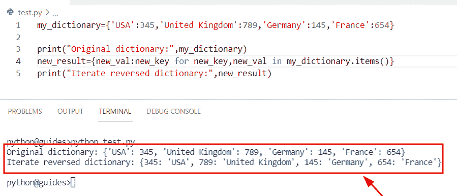

Iterate through dictionary Python reverse

阅读: [Python 列表词典——详细指南](https://pythonguides.com/python-dictionary-of-lists/)

## 遍历 Python 排序的字典

*   在这一节中，我们将讨论如何通过在 Python 中遍历字典来对元素进行排序。
*   为了执行这个特定的任务，我们将使用 `sorted()` 函数，这个方法将总是以一种排序的方式返回一个值的列表。在本例中，我们将首先进行排序，然后使用 for-loop 方法迭代这些值。
*   在这个例子中，首先，我们将使用 `sorted(dict.keys())` 方法对键进行排序，这个函数将始终返回字典中可用的所有键，然后我们将使用 `sorted(dict.values())` 方法对所有值进行排序。

**语法:**

下面是 Python `dictionary.keys()` 方法的语法

```py
dict.keys() 
```

**举例:**

```py
my_dictionary={'USA':345,'United Kingdom':789,'Germany':145,'France':654}

for new_k in sorted(my_dictionary.keys()):
    print("Sorted keys:",new_k, ':', my_dictionary[new_k])
for new_val in sorted(my_dictionary.values()):
     print("Sorted values:",new_val)
```

下面是下面给出的代码的截图。

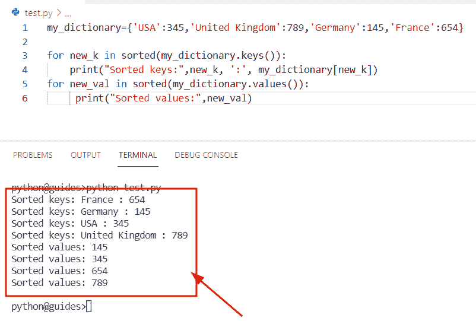

Python iterate through dictionary sorted

正如您在屏幕截图中看到的，输出显示了排序的键和值。

阅读: [Python 字典副本带示例](https://pythonguides.com/python-dictionary-copy/)

## 按照顺序遍历字典 Python

*   在这一节中，我们将讨论如何以顺序方法迭代一个字典。
*   在这个例子中，我们将使用 list comprehension 方法，在这个函数中，我们已经设置了用于迭代字典值的键和值变量，然后使用 `dict.items()` 方法。

**举例:**

```py
my_dictionary={'Newzealand':345,'Australia':345,'Paris':897,'France':234}

for new_k, new_val in sorted(my_dictionary.items()):
        print((new_k, new_val))
```

下面是以下给定代码的实现。

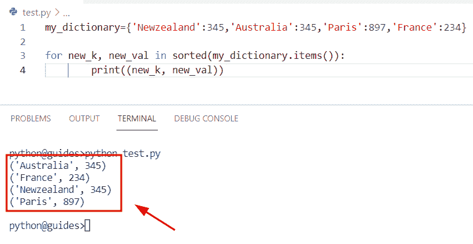

iterate through dictionary Python in order

阅读: [Python 字典多键](https://pythonguides.com/python-dictionary-multiple-keys/)

## 遍历字典 Python lambda

*   在这一节中，我们将讨论如何使用 lambda 函数来遍历 Python 中的字典。
*   在这个例子中，我们将使用 lambda 表达式来声明一个内联函数，其中 `new_k` 是 lambda 的参数，map 函数执行一个 lambda 函数，它将返回列表中的所有键。

**举例:**

```py
my_dictionary={'Newzealand':345,'Australia':345,'Paris':897,'France':234}

new_result = list(map(lambda new_k: my_dictionary[new_k], my_dictionary.keys()))
print("Iterate values using lambda:",new_result)
```

在上面的代码中，我们创建了一个名为**‘my _ dictionary’**的字典，它包含键值对形式的元素。之后，我们使用了 lambda 函数和 `dictionary.keys()` 方法，它将迭代给定字典的键，并将它们存储到列表中。

下面是下面给出的代码的截图。

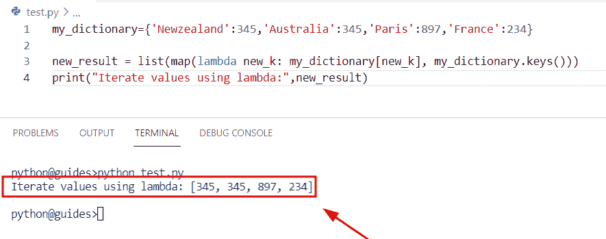

iterate through dictionary Python lambda

阅读: [Python 字典转 CSV](https://pythonguides.com/python-dictionary-to-csv/)

## 遍历包含多个值的字典 Python

*   在这一节中，我们将学习如何用 Python 迭代一个包含多个值的字典。
*   为了执行这个特定的任务，我们将使用 list comprehension 方法，它将迭代给定键的所有列表值。在这个例子中，我们将创建一个字典，为这个键分配多个值。
*   接下来，我们将使用 for 循环和 `items()` 方法迭代字典，它将迭代列表中的所有条目。

**举例:**

让我们举一个例子，看看如何用 Python 迭代一个有多个值的字典

```py
new_dictionary = {'USA':[23,67,89,12]}

new_list=[]
new_list = [[new_k,new_val] for new_k, values in new_dictionary.items() for new_val in values]
print("Iterate multiple values in dictionary:",new_list)
```

在下面的代码中，我们创建了一个名为“new_dictionary”的字典，其中包含一个具有多个值的键。之后，我们创建了一个空列表，通过使用 for 循环和 `dict.items()` 方法可以将所有的值存储在这个空列表中。

一旦执行了这段代码，输出将显示键保持不变而值不同的对的列表。

下面是下面给出的代码的截图。

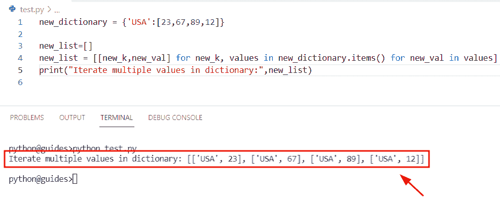

Iterate through dictionary Python with multiple values

阅读: [Python 将字典转换为数组](https://pythonguides.com/python-convert-dictionary-to-an-array/)

## 用列表遍历字典 Python

*   在这一节中，我们将讨论如何使用 list 在 Python 中迭代一个字典。
*   通过使用列表理解方法，我们可以很容易地用列表迭代字典。为了完成这项任务，首先我们将创建一个字典，并分配可以存储在列表中的键值对和值。
*   接下来为了迭代值和键，我们将使用 for 循环方法和 `dict.keys()` 方法。

**举例:**

```py
new_dictionary = {'USA' : [24,36,16], 'United Kingdom' : [89, 24,56], 'France' : [97,56,66]}

new_output = [[m for m in new_dictionary[new_k]] for new_k in new_dictionary.keys()]
print("Iterate dictionary with lists:",new_output) 
```

下面是以下给定代码的实现。

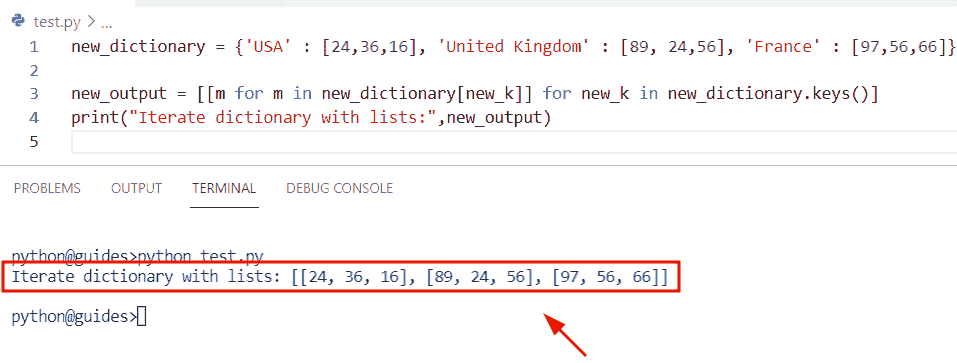

Iterate through dictionary Python with list

阅读:[从字典中获取所有值 Python](https://pythonguides.com/get-all-values-from-a-dictionary-python/)

## Python 在字典中迭代字典

*   这里我们将讨论如何在 Python 中迭代一个嵌套字典。
*   为了执行这个特定的任务，我们将使用 for 循环和 `dict.items()` 方法，它将迭代嵌套字典中的所有值。
*   在 Python 中，嵌套字典指定了字典中的字典，它是一个无序的条目集合。
*   在这个例子中，有两个字典，每个都有自己的键和值，现在我想迭代给定嵌套字典的所有元素。

**举例:**

让我们举个例子，看看如何在 Python 中迭代一个嵌套的字典。

**源代码:**

```py
Country_name = {'A': {'Germany': 67, 'France': 456, 'Polland': 456},
          'B': {'China': 456, 'Australia': 789, 'Japan': 567}}

for new_k, new_val in Country_name.items():
    print(new_k)

    for i in new_val:
        print(i + ':-', new_val[i])
```

在上面的代码中，我们创建了一个名为' Country_name '的嵌套字典，内部字典' A '和' B '被赋给了 **'Country_name'** 。

之后，我们有一个关键名称作为国家名称以及它们的随机值。通过使用 for 循环和 `dict.items()` 方法，我们可以很容易地从一个列表中提取值。

下面是以下给定代码的执行。

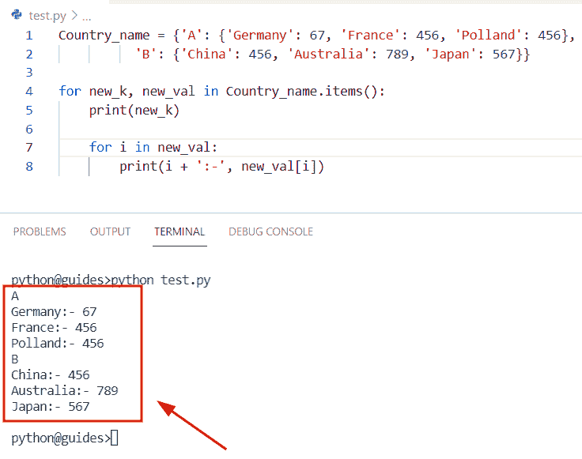

Python iterate through dictionary within a dictionary

阅读: [Python 从两个列表中创建了一个字典](https://pythonguides.com/python-creates-a-dictionary-from-two-lists/)

## Python 遍历数据帧字典

*   在这个程序中，我们将讨论如何迭代一个字典并将它们转换成熊猫数据帧。
*   在 Python Pandas 中，DataFrame 是一种在二维行和列中计算的结构。
*   在这个例子中，我们将首先导入 Pandas 库，然后我们将创建一个字典，其中包含以**键-值**对形式的元素。为了迭代字典，我们将使用 for 循环方法，它将帮助用户迭代字典中的所有值。
*   接下来，我们将使用 `Pd.dataframe` 并指定 iterable 属性**‘I’**作为参数，它将很容易转换成 dataframe。

**举例:**

让我们举个例子，看看如何迭代一个字典，并把它们转换成 Pandas DataFrame。

**源代码:**

```py
import pandas as pd

dict={'Student_name':'John','Student_id':456,'Student_age':234}
for i in dict.items():
   print(pd.DataFrame(i)) 
```

下面是以下代码的截图

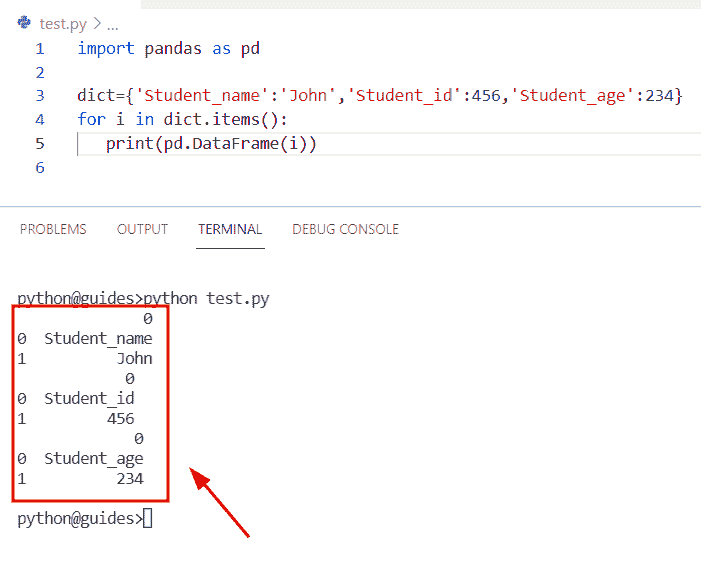

Python iterate through a dictionary of data frames

阅读: [Python 字典包含+示例](https://pythonguides.com/python-dictionary-contains/)

## Python 遍历字典并删除条目

*   在本节中，我们将学习如何迭代一个字典并从 Python 字典中移除条目。
*   为了完成这个任务，我们将使用 for 循环方法来迭代字典元素，为了从字典中移除项目，我们将使用 `del` 关键字。
*   在 Python 中， `del` 用于从可迭代对象(如字典)中删除特定项，这个关键字在 Python 字典包中可用。

语法:

让我们看一下语法并理解 del 关键字的工作原理

```py
del[object name]
```

**举例:**

让我们举一个例子，看看如何迭代一个字典并从字典中删除条目。

**源代码:**

```py
my_dictionary={'Cherry':234,'Apple':453,'Mango':13,'Grapes':12}

for new_k, new_val in dict(my_dictionary).items():
    if new_val % 3 == 0:
        del my_dictionary[new_k]
print(my_dictionary) 
```

在下面的代码中，我们创建了一个包含键值对的字典。之后，我们使用 for 循环方法和 dict.items()函数，它将迭代字典中的所有元素。

迭代完所有元素后，我们设置了条件 if **new_val %3==0** ，它将检查条件，如果值被 3 除，那么它将从字典中删除那些没有被 `3` 除的值，然后它将返回元组形式。

下面是以下给定代码的实现

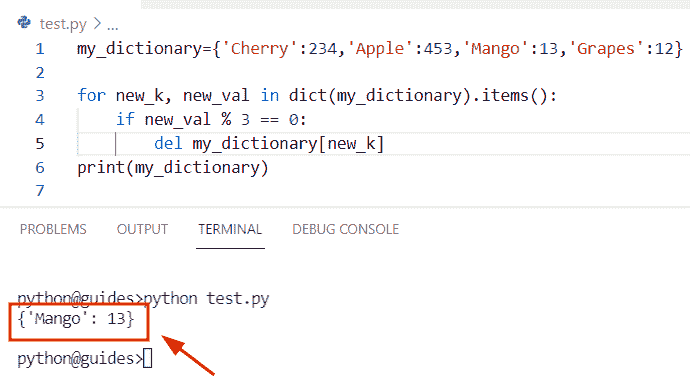

Python iterate through a dictionary and remove items

阅读: [Python 字典理解](https://pythonguides.com/python-dictionary-comprehension/)

## Python 遍历字典并改变值

*   这里我们将讨论如何在 Python 字典中迭代和改变值。
*   为了迭代字典中的元素，我们将使用 for 循环方法，为了更新值，我们将使用**‘if’**条件。

**举例:**

```py
dictionary = {'Africa':200,'australia':300,'England':400}

for new_k, new_values in dictionary.items():
    if new_values==300:
        dictionary[new_k] = 600
print(dictionary) 
```

在上面的代码中，我们创建了一个包含键值对形式的元素的字典。之后，我们使用 for-loop 方法迭代元素，如果 new_values==300，则设置条件，如果 `300` 值可用，它将检查条件，然后用 `600` 值更新。

你可以参考下面的截图。

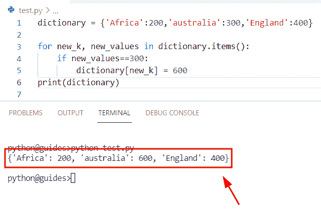

Python iterate through dictionary and change values

阅读: [Python 字典删除](https://pythonguides.com/python-dictionary-remove/)

## Python 遍历按关键字排序的字典

*   在这一节中，我们将学习如何在 Python 中迭代字典并按键排序。
*   为了在 Python 中遍历一个字典，我们将使用 for-loop 方法，为了得到排序的键，我们可以很容易地使用 `sorted()` 函数，在这个函数中，我们将把字典作为一个参数。
*   在 Python 中， `sorted()` 函数用于对给定的类 iterable 对象的值进行排序。一旦执行了这段代码，输出将根据需求显示排序后的键。

**举例:**

让我们举个例子，看看如何在 Python 中迭代一个字典并按键排序。

**源代码:**

```py
dictionary = {'George':200,'Micheal':300,'Oliva':400,'James':345}

for new_k in sorted (dictionary):
    print("Sorted keys by iterating dictionary:",new_k) 
```

下面是下面给出的代码的截图。

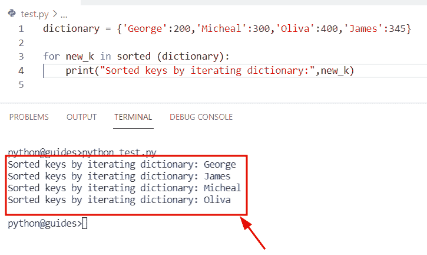

Python iterate through dictionary sorted by key

阅读: [Python 字典索引——完整教程](https://pythonguides.com/python-dictionary-index/)

## Python 遍历按值排序的字典

*   在这个程序中，我们将学习如何在 Python 中遍历字典并按值排序。
*   为了执行这个特定的任务，我们将使用 sorted()函数和 `dict.values()` 方法。要按值对字典中的条目进行排序，我们可以使用 `sorted()` 函数中的 `dict.values()` 作为参数。
*   在 Python 中，这个方法在字典模块中可用，它用于提取字典中的值。

**语法:**

下面是 `dict.values()` 方法的语法

```py
dict.values()
```

**举例:**

```py
new_dict = {'Australia':200,'Germany':300,'France':400,'Polland':345}

for new_k in sorted (new_dict.values()):
    print("Sorted keys by iterating dictionary:",new_k)
```

下面是以下给定代码的执行。

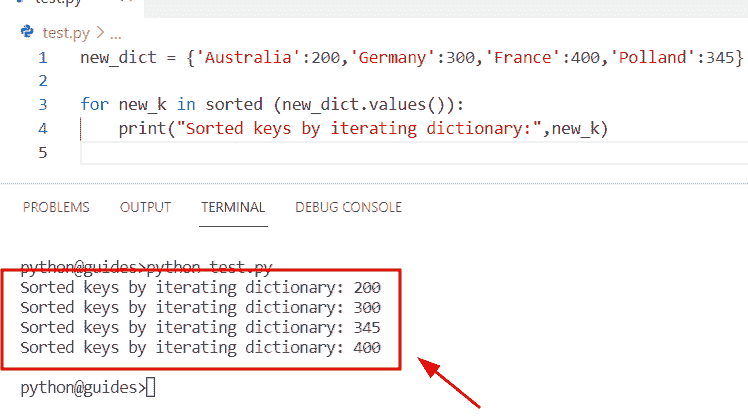

Python iterate through dictionary sorted by value

您可能也喜欢阅读以下 Python 教程。

*   [Python 字典过滤器+示例](https://pythonguides.com/python-dictionary-filter/)
*   [Python 字典按值搜索](https://pythonguides.com/python-dictionary-search-by-value/)
*   [Python 字典排序(11 个例子)](https://pythonguides.com/python-dictionary-sort/)
*   [Python 字典值列表](https://pythonguides.com/python-dictionary-values-to-list/)
*   [Python 串联字典](https://pythonguides.com/python-concatenate-dictionary/)

在这篇 Python 教程中，我们已经学习了**如何使用 Python 中的一些例子在 Python** 中迭代字典。此外，我们还讨论了这些主题。

*   使用索引遍历字典 Python
*   遍历字典 Python for 循环
*   遍历字典 Python 反向
*   遍历 Python 排序的字典
*   按顺序遍历字典 Python
*   遍历字典 Python lambda
*   遍历包含多个值的字典 Python
*   使用列表遍历字典 Python
*   Python 在字典中遍历字典
*   Python 遍历数据帧字典
*   Python 遍历字典并删除条目
*   Python 遍历字典并更改值
*   Python 遍历按关键字排序的字典
*   Python 遍历按值排序的字典

[Bijay Kumar](https://pythonguides.com/author/fewlines4biju/)

Python 是美国最流行的语言之一。我从事 Python 工作已经有很长时间了，我在与 Tkinter、Pandas、NumPy、Turtle、Django、Matplotlib、Tensorflow、Scipy、Scikit-Learn 等各种库合作方面拥有专业知识。我有与美国、加拿大、英国、澳大利亚、新西兰等国家的各种客户合作的经验。查看我的个人资料。

[enjoysharepoint.com/](https://enjoysharepoint.com/)[](https://www.facebook.com/fewlines4biju "Facebook")[](https://www.linkedin.com/in/fewlines4biju/ "Linkedin")[](https://twitter.com/fewlines4biju "Twitter")