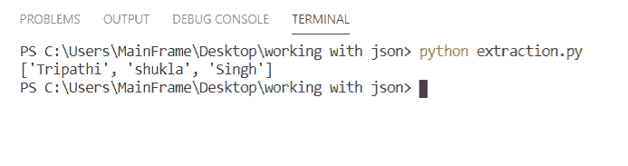
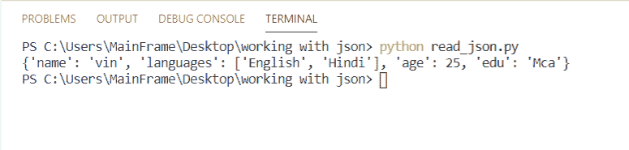
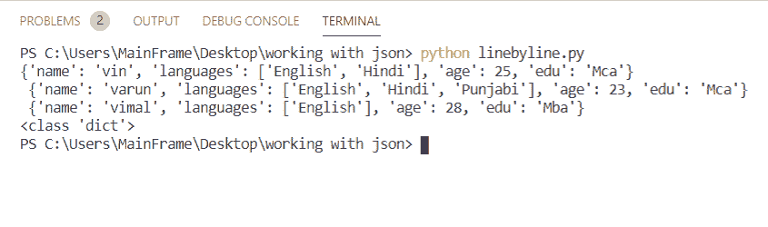
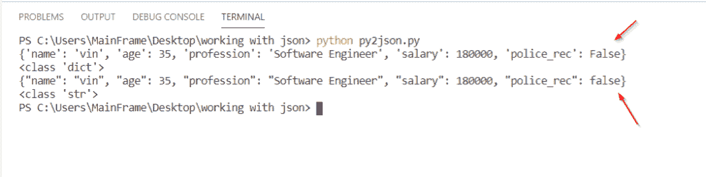
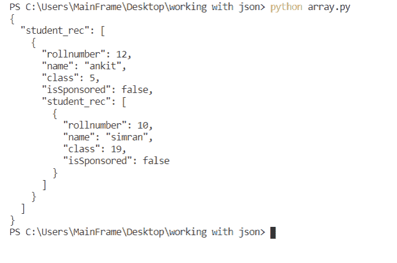
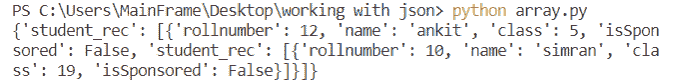
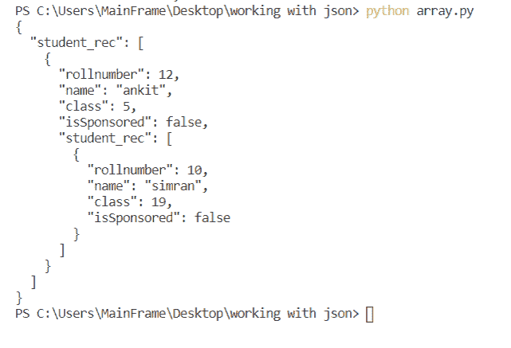
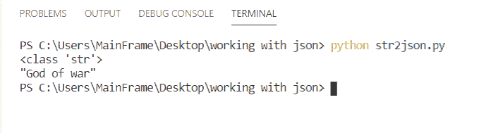
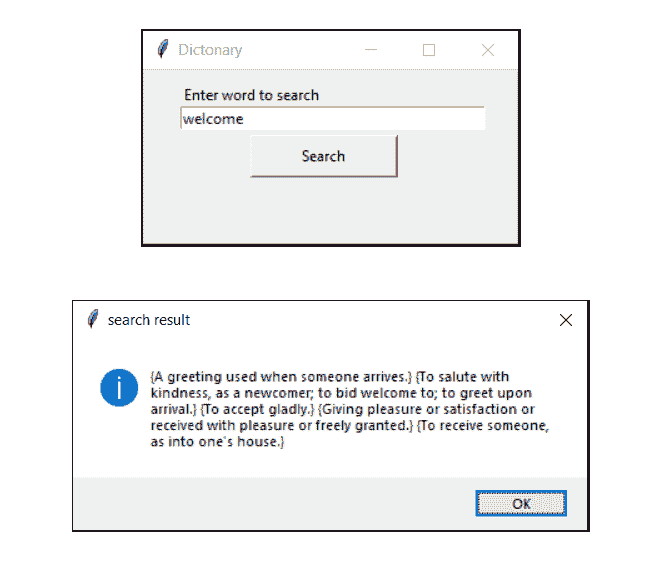
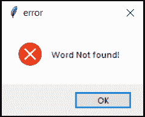

# 在 Python 中使用 JSON 数据

> 原文：<https://pythonguides.com/json-data-in-python/>

[](https://sharepointsky.teachable.com/p/python-and-machine-learning-training-course)

在本教程中，我们将讨论如何在 Python 中使用 **JSON 数据。此外，我们将看到以下主题:**

*   使用 python 的 JSON
*   Python 从 JSON 文件中提取数据
*   从 JSON python 中提取特定数据
*   **读取 JSON 文件 python**
*   Python 逐行读取 JSON 文件
*   JSON 的 Python 对象
*   Python 创建 JSON 数组
*   Python 写 JSON 文件漂亮吗
*   Python 字符串到 JSON
*   使用 JSON 的项目

目录

[](#)

*   [json 与 python](#json_with_python "json with python")
*   [Python 从 JSON 文件中提取数据](#Python_extract_data_from_JSON_file "Python extract data from JSON file")
*   [从 JSON python 中提取特定数据](#Extract_specific_data_from_JSON_python "Extract specific data from JSON python")
*   [读取 JSON 文件 python](#Read_JSON_file_python "Read JSON file python")
*   [Python 逐行读取 JSON 文件](#Python_read_JSON_file_line_by_line "Python read JSON file line by line")
*   [Python 对象到 JSON](#Python_object_to_JSON "Python object to JSON")
*   [Python 创建 JSON 数组](#Python_create_JSON_array "Python create JSON array")
*   [Python 写 json 到文件蛮](#Python_write_json_to_file_pretty "Python write json to file pretty")
*   [Python 字符串到 JSON](#Python_string_to_JSON "Python string to JSON")
*   [使用 JSON 的项目](#Project_using_JSON "Project using JSON")

## json 与 python

*   JSON 代表 **JavaScript 对象符号**。
*   JSON 因其轻量级数据交换格式而广受欢迎。
*   JSON 格式看起来像 python 中的[字典](https://pythonguides.com/create-a-dictionary-in-python/)
*   它是一个**键**和**值**的格式
*   JSON 模块总是产生`str`对象。
*   `dumps()` :将 Python 转换成 JSON
*   `loads()` :将 JSON 转换成 Python

## Python 从 JSON 文件中提取数据

在这一节中，我们将学习如何用 python 从 JSON 文件中提取数据。

**第一步:**导入 json 模块

**第二步:**下载日期集

**第三步:**使用 `open()` 读取文件，并将其存储在 `f` 变量中

**第四步:**使用 `load()` 将 `f` 解析成 python 对象。

**第五步:** pass ' **键** ' **'索引号'** ' **键'** &打印信息。

我们的目标是获取所有老师的名字。

[JSON File for this project >>](https://pythonguides.com/wp-content/uploads/2020/10/dataset-4.json)[Download](https://pythonguides.com/wp-content/uploads/2020/10/dataset-4.json)

```py
import json

f = open('data.json', 'r')
db = json.load(f)

print(db['teacher_db'][0]['name'])
```

**输出:**

在这个输出中，我们打印了所有教师的姓名。 **db['教师 _db'][0]['姓名']** 。
如果这令人困惑，你可以查看下一节的解释(**从 JSON python 中提取字段**)。



JSON data in Python

## 从 JSON python 中提取特定数据

现在，让我们看看如何用 Python 从 JSON 中**提取特定数据。**

*   提取信息是一门艺术。
*   在本节中，我们将学习**如何得到我们想要的**。
*   在处理数组时，要注意嵌套数组。
*   在前面的场景中，我们使用`db['teacher_db'][0]['name']`来获取教师的姓名。
*   其中 `db` 是保存所有值的变量，这就是它被放在第一个位置的原因。
*   现在我们有两个选择。(**学生 _ 数据库** & **教师 _ 数据库**)
*   我们选择 `teacher_db` ，所以我们把它放在第二个位置。
*   现在我们有了选项( **t_id，name，class，isPermanet** )
*   每个都有一个从**0–3**开始的索引值。
*   因为我们想要一个**名称**，所以我们提供了索引值为**【1】`(`名称**位于位置 1)
*   然后我们在这个案例中提到了**键**即**[‘名称’]**。
*   这就是为什么完整的语句变成了**db[' teacher _ db '][0][' name ']**
*   这就是我们提取特定值的方法。

## 读取 JSON 文件 python

本节我们将学习如何用 python 读取 json 文件。

**第一步:**导入 json 模块

**第二步:**使用 `open()` 读取 json 文件，并将这些信息存储在**文件**变量中。

**第三步:**使用 `load()` 将 `json` 转换为 `python` ，并将信息存储在 `db` 变量中。

**第四步:**打印变量。

**代码**:

```py
import json

with open('record.json') as file:
  db = json.load(file)

print(db)
```

**输出:**

输出显示文件中的所有信息，一切都在一个**键** & **值**对中..



Read JSON file python

这就是我们如何在 python 中读取 json 文件数据的方法。

## Python 逐行读取 JSON 文件

在这一节中，我们将看到如何用 Python 逐行读取 json 文件，并把它保存在一个空的 [python 列表](https://pythonguides.com/python-list-methods/)中。

**第一步:**导入 json 模块。

**第二步:** [创建名为`lineByLine`的空 python 列表](https://pythonguides.com/create-list-in-python/)

**第三步:**使用 `open()` 读取 json 文件，并将信息存储在**文件**变量中。

**第四步:**使用 `load()` &将**项**从 json 转换为 python，并将信息存储在 `db` 变量中。

**第五步:**在 `lineByLine` 空列表中追加 `db` 。

**第六步:**开始循环&打印 `lineByLine` 列表的项目

**代码:**

```py
import json

lineByLine = []
with open('record.json') as file:
    db = json.load(file)
    lineByLine.append(db)

for line in lineByLine:
    print(line[0],"\n",line[1],"\n",line[2])
    print(type(line[0])) 
```

**输出:**

输出逐行显示 json 文件的内容。每个项目显示在不同的行中。每行的数据类型是 `Python dict` 。



read json file by line in Python

这就是我们如何在 python 中**逐行读取 json 文件。**

## Python 对象到 JSON

现在，让我们看看如何**将 Python 对象转换成 json** 。

*   JSON 是一个 javascript 对象。这些对象需要被解析成 python 对象，然后只有我们可以使用和操作它们。
*   json。 `dumps()` 用于将 python 对象转换或**解析为 JSON**

**代码:**

```py
import json

people = {'name': 'vin',
 'age': 35,
  'profession': 'Software Engineer',
   'salary': 180000,
    'police_rec': False}

print(people)
print(type(people))
to_json = json.dumps(people)
print(to_json)
print(type(to_json))
```

**输出:**

在这个输出中，python 对象即 `dict` 已经被解析或转换成 json 对象即 `str` 。
也，**假** &假**假**已被指。python 有带大写' `F` 的 False，其中有 json 有小写' **f'** 。



Python object to JSON

## Python 创建 JSON 数组

*   [Python 数组](https://pythonguides.com/python-array/)在数据结构化中起着主要作用。
*   在这一节。我们将学习如何在 Python 中创建一个数组&嵌套数组。
*   **嵌套数组**表示一个数组在另一个数组里面。
*   嵌套数组的数量决定了对象的维度。

**代码:**

```py
import json

with open('array.json') as file:
    db = json.load(file)

r = json.dumps(db, indent=2)
print(r)
```

**输出:**

在这个输出中，使用 JSON 创建了多维数组。



Python create JSON array

## Python 写 json 到文件蛮

*   听起来真的很漂亮。
*   它改善了输出的外观。让它更具可读性。
*   它通过缩进和排序来显示数据。
*   在 JSON 中默认`indent = none`&`Sort _ file = false`
*   但是它可以被更改为任何值，比如 `indent = 2`
*   而 `sort_file` 可以是 `true` 。这将按升序排列所有的键。

**代码:**

```py
import json

with open('array.json') as file:
    db = json.load(file)

print("Without PrettyPrint: \n", db)
print("\n")
r = json.dumps(db, indent=2)
print("with PrettyPrint: \n", r)
```

**无漂亮打印的输出**

在这个输出中，你可以注意到所有的东西都包含在 3 行中，这不容易理解。



Python write json to file pretty

**用 prettyprint 输出**

在这个输出中，你可以看到它看起来很好，很容易理解。我们所做的就是使用 Dump 将 python 转换成 json，并提供 2 的**缩进。**



## Python 字符串到 JSON

*   在这一节中，我们将学习如何在 Python 中将字符串转换成 JSON
*   JSON 总是返回**‘str’**
*   因此，这里看不到任何变化，但它被转换为 json。

**代码:**

```py
import json

game = "God of war"
to_json = json.dumps(game)

print(type(to_json))
```

**输出:**

在这个输出中，字符串被转换为 JSON，JSON 总是返回 `str` 这就是为什么数据类型仍然显示 **<类‘str’>**



convert string to JSON in Python

## 使用 JSON 的项目

在这个项目中，我们**使用 JSON** 创建一个字典。用户可以搜索任何单词的意思。如果单词不可用，程序将显示错误提示。

**改进范围**:

虽然该项目已经完成，但仍有更多的功能，你可以尝试自己添加的余地。如果你遇到任何问题，请写在评论框里。

*   部分添加新单词
*   退出按钮
*   改进 Gui。

**代码:**

[JSON File for this project >>](https://pythonguides.com/wp-content/uploads/2020/10/data.json)[Download](https://pythonguides.com/wp-content/uploads/2020/10/data.json)

```py
import json
from tkinter import *
from tkinter import messagebox

ws = Tk()
ws.geometry('300x140')
ws.title('Dictonary')

def find():
    k = word_Tf.get()
    try:
        with open('data.json') as f:
            db = json.load(f)
            meaning = db[k]
        return messagebox.showinfo('search result',meaning)
    except Exception as ep:
        return messagebox.showerror('error'," Word Not found!")
Label(ws, text='Enter word to search').place(x=30, y=10)
word_Tf = Entry(ws, width=40)
word_Tf.place(x=30, y=30)

search_Btn = Button(ws, text="Search", command=find, padx=20, pady=5, width=10)
search_Btn.place(x=145, y=70, anchor=CENTER)

ws.mainloop()
```

**输出:**

在这个输出中，创建了一个字典应用程序。你可以搜索一个词的任何意思。该词的含义将使用弹出消息框显示。如果单词不可用，将出现错误弹出消息。



如果这个词在 JSON 文件中不存在，你将会看到错误信息。



您可能会喜欢以下 Python 教程:

*   [使用 Python 发送电子邮件](https://pythonguides.com/send-email-using-python/)
*   [Python 获得一个 IP 地址](https://pythonguides.com/python-get-an-ip-address/)
*   [Python – stderr, stdin and stdout](https://pythonguides.com/python-stderr-stdin-and-stdout/)
*   [Python GUI 编程](https://pythonguides.com/python-gui-programming/)
*   [Python 中的递增和递减运算符](https://pythonguides.com/increment-and-decrement-operators-in-python/)
*   [Python 中的构造函数](https://pythonguides.com/constructor-in-python/)
*   [面向对象编程 python](https://pythonguides.com/object-oriented-programming-python/)
*   [Python 匿名函数(Lambda 函数)](https://pythonguides.com/python-anonymous-function/)

我们学到了这些:

*   使用 python 的 JSON
*   Python 从 JSON 文件中提取数据
*   从 JSON python 中提取特定数据
*   读取 JSON 文件 python
*   Python 逐行读取 JSON 文件
*   JSON 的 Python 对象
*   Python 创建 JSON 数组
*   Python 写 JSON 文件漂亮吗
*   Python 字符串到 JSON
*   使用 JSON 的项目

[Bijay Kumar](https://pythonguides.com/author/fewlines4biju/)

Python 是美国最流行的语言之一。我从事 Python 工作已经有很长时间了，我在与 Tkinter、Pandas、NumPy、Turtle、Django、Matplotlib、Tensorflow、Scipy、Scikit-Learn 等各种库合作方面拥有专业知识。我有与美国、加拿大、英国、澳大利亚、新西兰等国家的各种客户合作的经验。查看我的个人资料。

[enjoysharepoint.com/](https://enjoysharepoint.com/)[](https://www.facebook.com/fewlines4biju "Facebook")[](https://www.linkedin.com/in/fewlines4biju/ "Linkedin")[](https://twitter.com/fewlines4biju "Twitter")