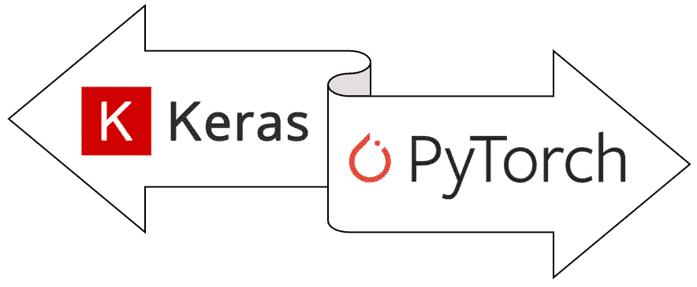
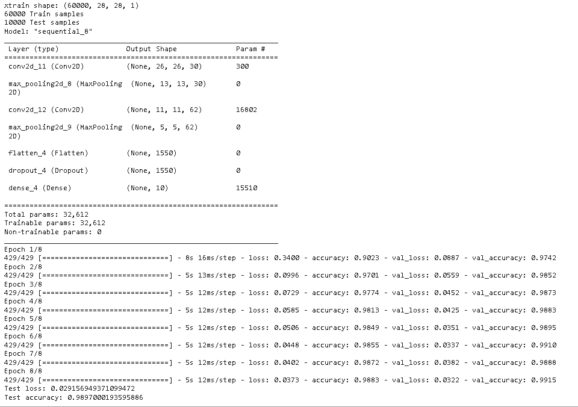
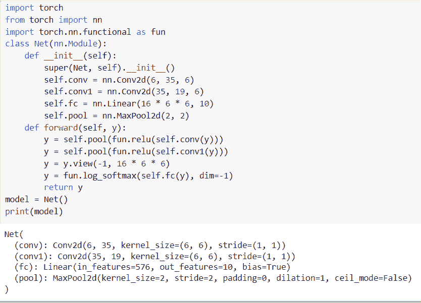

# Keras 与 py torch–主要区别

> 原文：<https://pythonguides.com/keras-vs-pytorch/>

[](https://sharepointsky.teachable.com/p/python-and-machine-learning-training-course)

在这个 [Python 教程](https://pythonguides.com/learn-python/)中，我们将学习 Python 中的 `Keras Vs PyTorch` ，我们还将涵盖与 `Keras Vs PyTorch` 相关的不同示例。这些是我们将在本教程中讨论的主题。

*   Keras 简介
*   PyTorch 简介
*   Keras Vs PyTorch



Keras vs PyTorch

目录

[](#)

*   [Keras 简介](#Introduction_to_Keras "Introduction to Keras")
*   [py torch 简介](#Introduction_to_PyTorch "Introduction to PyTorch")
*   [Keras Vs PyTorch](#Keras_Vs_PyTorch "Keras Vs PyTorch")

## Keras 简介

在本节中，我们将了解什么是 Keras 以及它在 python 中是如何工作的。

*   Keras 是用 python 编写的，专为人类设计的高级神经网络 API。这是一个开源库，旨在提供快速实验。
*   Keras 还用于减少认知负荷，也合并到 TensorFlow 中，用户可以作为 **tf 访问它。Keras** 。
*   Keras 充当 Tensorflow 库的接口。

**举例:**

在这个例子中，我们将导入一些 Keras 库来使用 mnist 数据集构建模型。

*   **input_shape = (28，28，1)** 用作数据参数。
*   **(xtrain，ytrain)，(xtest，y test)= keras . datasets . Mn ist . load _ data()**用于将数据拆分为训练和测试数据集。
*   **ytrain = keras . utils . to _ categorial(ytrain，num_classes)** 用于将类别向量转换为二进制类别矩阵。
*   `model.summary()` 用于定义模型的摘要。
*   `batchsize = 126` 用于给出批量大小。
*   **model . compile(loss = " categorial _ cross entropy "，optimizer="adam "，metrics=["accuracy"])** 用于编译模型。
*   **model.fit(xtrain，ytrain，batch_size=batchsize，epochs=epoch，validation_split=0.1)** 用于拟合模型。
*   **scores = model.evaluate(xtest，ytest，verbose=0)** 用于评估模型得分。
*   **print("Test loss:"，scores[0])** 用于在屏幕上打印测试损失分数。
*   **print("Test accuracy:"，scores[1])** 用于在屏幕上打印测试准确度分数。

```py
import numpy as num
from tensorflow import keras
from tensorflow.keras import layers
**# Model** 
num_classes = 10
input_shape = (28, 28, 1)

(xtrain, ytrain), (xtest, ytest) = keras.datasets.mnist.load_data()

**# Scale images to the [0, 1] range**
xtrain = xtrain.astype("float32") / 255
xtest = xtest.astype("float32") / 255
# Make sure images have shape (28, 28, 1)
xtrain = num.expand_dims(xtrain, -1)
xtest = num.expand_dims(xtest, -1)
print("xtrain shape:", xtrain.shape)
print(xtrain.shape[0], "Train samples")
print(xtest.shape[0], "Test samples")

ytrain = keras.utils.to_categorical(ytrain, num_classes)
ytest = keras.utils.to_categorical(ytest, num_classes)
model = keras.Sequential(
    [
        keras.Input(shape=input_shape),
        layers.Conv2D(30, kernel_size=(3, 3), activation="relu"),
        layers.MaxPooling2D(pool_size=(2, 2)),
        layers.Conv2D(62, kernel_size=(3, 3), activation="relu"),
        layers.MaxPooling2D(pool_size=(2, 2)),
        layers.Flatten(),
        layers.Dropout(0.3),
        layers.Dense(num_classes, activation="softmax"),
    ]
)

model.summary()
batchsize = 126
epoch = 8

model.compile(loss="categorical_crossentropy", optimizer="adam", metrics=["accuracy"])

model.fit(xtrain, ytrain, batch_size=batchsize, epochs=epoch, validation_split=0.1)
scores = model.evaluate(xtest, ytest, verbose=0)
print("Test loss:", scores[0])
print("Test accuracy:", scores[1])
```

**输出:**

在运行上面的代码之后，我们得到了下面的输出，其中我们可以看到带有测试损失分数和测试准确性分数的模型被打印在屏幕上。



Keras Example

另外，请查看: [PyTorch 保存模型–完整指南](https://pythonguides.com/pytorch-save-model/)

## py torch 简介

在本节中，我们将了解什么是 PyTorch，以及如何在 python 中使用 PyTorch。

*   [PyTorch](https://pythonguides.com/what-is-pytorch/) 是一个开源的机器学习库。它是在修改后的 BSD 许可证下发布的。
*   PyTorch 用于计算机版本和自然语言处理应用程序，由脸书人工智能研究实验室开发。

**举例:**

在下面的例子中，我们将导入 torch 库来构建 PyTorch 模型。

*   **nn。Conv2d()** 用于对输入应用 2d 卷积。
*   **nn。**(linear())用于制作前馈神经网络。
*   **nn。MaxPool2d()** 用于应用一个输入信号。
*   `model = Net()` 用于描述模型的净值。
*   **打印(模型)**用于打印模型输出。

```py
import torch
from torch import nn
import torch.nn.functional as fun
class Net(nn.Module):
    def __init__(self):
        super(Net, self).__init__()
        self.conv = nn.Conv2d(6, 35, 6)
        self.conv1 = nn.Conv2d(35, 19, 6)
        self.fc = nn.Linear(16 * 6 * 6, 10)
        self.pool = nn.MaxPool2d(2, 2)
    def forward(self, y):
        y = self.pool(fun.relu(self.conv(y)))
        y = self.pool(fun.relu(self.conv1(y)))
        y = y.view(-1, 16 * 6 * 6)
        y = fun.log_softmax(self.fc(y), dim=-1)
        return y
model = Net()
print(model)
```

**输出:**

运行上面的代码后，我们得到下面的输出，其中我们可以看到 PyTorch 模型被打印在屏幕上。



What is PyTorch

阅读:[交叉熵损失 PyTorch](https://pythonguides.com/cross-entropy-loss-pytorch/)

## Keras Vs PyTorch

在本节中，我们将学习 python 中 Keras 和 PyTorch 的**区别。**

| `Keras` | **指针** |
| 1.Keras 于 2015 年 3 月发布。 | 1.PyTorch 于 2016 年 10 月发布。 |
| 2.Keras 有一个高级的 API | 2.PyTorch 有一个低级 API。 |
| 3.Keras 的数据集更小 | 3.PyTorch 拥有大数据集，高性能。 |
| 4.Keras 提供了静态计算图。 | 4.PyTorch 提供了动态计算图。 |
| 5.由于网络简单，Keras 通常不需要调试。 | 5.PyTorch 具有良好的调试能力。 |
| 6.Keras 的社区支持较少。 | 6.PyTorch 拥有更强的社区支持。 |
| 7.Keras 的速度很慢，这就是它性能低的原因。 | 7.PyTorch 的速度很快，这就是它性能高的原因。 |
| 8.Keras 的后端实现包括 Tensorflow。 | 8.PyTorch 没有后端实现。 |
| 9.Keras 是用 python 写的。 | 9.PyTorch 是用 Lua 写的。 |
| 10.在 Keras 中，由于计算垃圾的存在，调试很困难。 | 10.在 PyTorch 中，调试更加容易和快速。 |

Keras vs PyTorch

你可能会喜欢下面的 PyTorch 教程

*   [py torch ms loss–详细指南](https://pythonguides.com/pytorch-mseloss/)
*   [数据加载器指针](https://pythonguides.com/pytorch-dataloader/)
*   [PyTorch 车型总结](https://pythonguides.com/pytorch-model-summary/)
*   [PyTorch 模型评估](https://pythonguides.com/pytorch-model-eval/)
*   [PyTorch 提前停止](https://pythonguides.com/pytorch-early-stopping/)
*   [PyTorch 预训练模型](https://pythonguides.com/pytorch-pretrained-model/)

因此，在本教程中，我们讨论了 `Keras Vs PyTorch` 并且我们也讨论了与此相关的例子。这是我们已经讨论过的例子列表。

*   Keras 简介
*   PyTorch 简介
*   Keras Vs PyTorch

[Bijay Kumar](https://pythonguides.com/author/fewlines4biju/)

Python 是美国最流行的语言之一。我从事 Python 工作已经有很长时间了，我在与 Tkinter、Pandas、NumPy、Turtle、Django、Matplotlib、Tensorflow、Scipy、Scikit-Learn 等各种库合作方面拥有专业知识。我有与美国、加拿大、英国、澳大利亚、新西兰等国家的各种客户合作的经验。查看我的个人资料。

[enjoysharepoint.com/](https://enjoysharepoint.com/)[](https://www.facebook.com/fewlines4biju "Facebook")[](https://www.linkedin.com/in/fewlines4biju/ "Linkedin")[](https://twitter.com/fewlines4biju "Twitter")