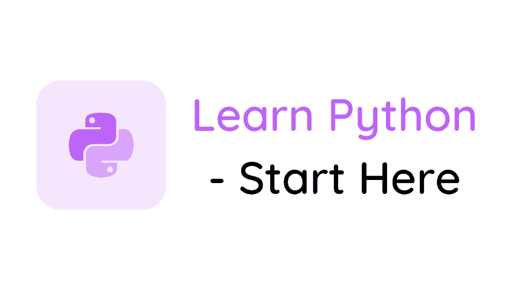

# 从初级到高级免费学习 Python

> 原文：<https://pythonguides.com/learn-python/>

根据各种调查，Python 是世界上最流行的编程语言之一。**学习 Python** 很容易，我写了一系列详细的文章，你可以按照**从初级到高级免费学习 Python**。

无论你是 Python 初学者还是专家，[PythonGuides.com](https://pythonguides.com/)都有一些**的 Python 教程**供你学习。

Learn Python from beginner to advanced free

如果你是一个编程初学者，那么 Python 是最容易学习的编程语言之一。我们所有的 Python 教程都是详细的教程，涵盖了多个例子。

除此之外，您还可以通过我们的 [PythonGuides 脸书页面](https://www.facebook.com/PythonGuides/)获得任何问题、建议和更新。

我们发布了**带示例的逐步 Python 教程**，确保在阅读的同时，也开始练习。

如果你没有任何编程知识，不要担心。还有，如果你在想**学 Python** 难吗？不，不是，学 Python 很容易。只要跟随我们的**一步一步的 Python 教程**。免费学习 Python！

目录

*   [学习 Python 基础知识](#Learn_Python_Basics "Learn Python Basics")
*   [Python 变量和数据类型](#Python_Variables_and_Datatypes "Python Variables and Datatypes")
*   [Python 编程概念](#Python_Programming_Concepts "Python Programming Concepts")
*   [Python 循环](#Python_Looping "Python Looping")
*   [Python 函数](#Python_Functions "Python Functions")
*   [Python 文件](#Python_Files "Python Files")
*   [Python 类](#Python_classes "Python classes")
*   [Python Tkinter](#Python_Tkinter "Python Tkinter")
*   [高级 Python 教程](#Advanced_Python_Tutorials "Advanced Python Tutorials")
*   [机器学习](#Machine_Learning "Machine Learning")

## 学习 Python 基础知识

在本节中，让我们学习一些 Python 基础知识。从下面的教程一个一个开始。

*   [什么是 Python](https://pythonguides.com/python-programming-for-the-absolute-beginner/) +优缺点及更多？
*   [下载并安装 Python](https://pythonguides.com/python-download-and-installation/) 和 Python 的代码编辑器
*   [创建你的第一个 Hello World Python 程序](https://pythonguides.com/python-hello-world-program/)

## Python 变量和数据类型

在本节中，我们将学习 Python 变量和 Python 数据类型。

*   [Python 变量](https://pythonguides.com/create-python-variable/)
*   [Python 字符串变量](https://pythonguides.com/create-a-string-in-python/)
*   [在 Python 中把整数转换成字符串](https://pythonguides.com/convert-an-integer-to-string-in-python/)
*   [在 Python 中连接字符串](https://pythonguides.com/concatenate-strings-in-python/)
*   [在 Python 中使用正则表达式拆分字符串](https://pythonguides.com/python-split-string-regex/)
*   [删除 python 中的 Unicode 字符](https://pythonguides.com/remove-unicode-characters-in-python/)
*   [检查一个数是否是素数 Python](https://pythonguides.com/check-if-a-number-is-a-prime-python/)
*   [从字符串 Python 中删除字符](https://pythonguides.com/remove-character-from-string-python/)
*   [Python 关键词](https://pythonguides.com/python-keywords/)
*   [Python 检查变量是否为整数](https://pythonguides.com/python-check-if-the-variable-is-an-integer/)
*   [Python 中的递增和递减运算符](https://pythonguides.com/increment-and-decrement-operators-in-python/)
*   [Python 格式数字加逗号](https://pythonguides.com/python-format-number-with-commas/)
*   [Python 打印 2 位小数](https://pythonguides.com/python-print-2-decimal-places/)
*   [如何在 Python 中把字符串转换成日期时间](https://pythonguides.com/convert-a-string-to-datetime-in-python/)
*   [如何将 Python 角度转换为弧度](https://pythonguides.com/python-degrees-to-radians/)
*   [Python 比较运算符](https://pythonguides.com/python-comparison-operators/)
*   [如何将 Python 字符串转换成字节数组](https://pythonguides.com/python-string-to-byte-array/)
*   [Python 要求用户输入](https://pythonguides.com/python-ask-for-user-input/)
*   [使用 if-else 理解 Python 列表](https://pythonguides.com/python-list-comprehension-using-if-else/)

## Python 编程概念

让我们看看更多的 Python 编程概念。

*   [什么是 Python 字典](https://pythonguides.com/create-a-dictionary-in-python/) +如何用 Python 创建字典
*   [Python 字典追加](https://pythonguides.com/python-dictionary-append/)
*   [Python 列表](https://pythonguides.com/create-list-in-python/)
*   [Python 将列表转换成字符串](https://pythonguides.com/python-convert-list-to-string/)
*   [在 Python 中检查列表是否为空](https://pythonguides.com/check-if-a-list-is-empty-in-python/)
*   [Python 从列表中选择](https://pythonguides.com/python-select-from-a-list/)
*   [Python 加法示例](https://pythonguides.com/python-addition/)
*   [Python 中的乘法与例题](https://pythonguides.com/multiply-in-python/)
*   [在 Python 中创建一个元组](https://pythonguides.com/create-a-tuple-in-python/)
*   [Python 元组排序列表](https://pythonguides.com/python-sort-list-of-tuples/)
*   [Python 将元组转换为列表](https://pythonguides.com/python-convert-tuple-to-list/)
*   [Python 中的注释行](https://pythonguides.com/comment-lines-in-python/)
*   [Python 数组](https://pythonguides.com/python-array/)
*   [Python 空数组](https://pythonguides.com/create-an-empty-array-in-python/)
*   [Python 创建空集](https://pythonguides.com/python-create-empty-set/)
*   [python 中的哈希表](https://pythonguides.com/hash-table-in-python/)
*   [Python 中的排序算法](https://pythonguides.com/sorting-algorithms-in-python/)
*   [Python 优先级队列](https://pythonguides.com/priority-queue-in-python/)
*   [Python 中的链表](https://pythonguides.com/linked-lists-in-python/)
*   [如何用 Python 制作矩阵](https://pythonguides.com/make-a-matrix-in-python/)
*   [Python 中的正则表达式](https://pythonguides.com/regular-expressions-in-python/)
*   [Python 布尔函数](https://pythonguides.com/python-booleans/)
*   [集合 Python 的并集](https://pythonguides.com/union-of-sets-python/)
*   [Python 中的转义序列](https://pythonguides.com/escape-sequence-in-python/)
*   [Python 形状的一个数组](https://pythonguides.com/python-shape-of-an-array/)
*   [使用 if-else 理解 Python 列表](https://pythonguides.com/python-list-comprehension-using-if-else/)

## Python 循环

在这一节中，让我们检查一下 Python 循环。

*   [Python For 循环](https://pythonguides.com/python-for-loop/)
*   [Python if else](https://pythonguides.com/python-if-else/)
*   [Python While 循环](https://pythonguides.com/python-while-loop/)

## Python 函数

让我们看看几个 Python 函数博客。

*   [Python 内置函数](https://pythonguides.com/python-built-in-functions/)
*   Python 中的[函数](https://pythonguides.com/function-in-python/)
*   [Python 字符串函数](https://pythonguides.com/string-methods-in-python/)
*   [Python 中的字符串方法](https://pythonguides.com/string-methods-in-python/)
*   [11 Python 列表方法](https://pythonguides.com/python-list-methods/)
*   [Python 字典方法](https://pythonguides.com/python-dictionary-methods/)
*   [Python 匿名函数](https://pythonguides.com/python-anonymous-function/)

## Python 文件

让我们看看如何在 Python 中处理文件。

*   [获取当前目录 Python](https://pythonguides.com/get-current-directory-python/)
*   [Python 读写 excel 文件](https://pythonguides.com/python-read-excel-file/)
*   [Python 读取 CSV 文件并写入 CSV 文件](https://pythonguides.com/python-read-csv-file/)
*   [Python 从路径中获取文件名](https://pythonguides.com/python-get-filename-from-the-path/)
*   [Python 将列表写入文件](https://pythonguides.com/python-write-list-to-file/)
*   [Python 将字符串写入文件](https://pythonguides.com/python-write-string-to-a-file/)
*   [Python 将变量写入文件](https://pythonguides.com/python-write-variable-to-file/)
*   [Python 文件方法](https://pythonguides.com/python-file-methods/)
*   [Python 读取二进制文件](https://pythonguides.com/python-read-a-binary-file/)
*   [Python 复制文件](https://pythonguides.com/python-copy-file/)

## Python 类

让我们检查一下 Python 类、接口、访问修饰符和 oops 概念。

*   [面向对象编程 python](https://pythonguides.com/object-oriented-programming-python/)
*   [Python 访问修饰符](https://pythonguides.com/python-access-modifiers/)
*   [Python 命名空间](https://pythonguides.com/python-namespace-tutorial/)
*   [Python 接口](https://pythonguides.com/python-interface/)

## Python Tkinter

在本节中，我们将学习 Python Tkinter 或 Python GUI 编程。

*   [Python GUI 编程](https://pythonguides.com/python-gui-programming/) (Python Tkinter)
*   [Python tkinter 标签](https://pythonguides.com/python-tkinter-label/)
*   [Python Tkinter 条目](https://pythonguides.com/python-tkinter-entry/)
*   [Python Tkinter Button](https://pythonguides.com/python-tkinter-button/)
*   [Python Tkinter 单选按钮](https://pythonguides.com/python-tkinter-radiobutton/)
*   [Python Tkinter Checkbutton](https://pythonguides.com/python-tkinter-checkbutton/)
*   [Python Tkinter Menu bar](https://pythonguides.com/python-tkinter-menu-bar/)
*   [Python Tkinter 计算器](https://pythonguides.com/make-a-calculator-in-python/)
*   [Python tkinter messagebox](https://pythonguides.com/python-tkinter-messagebox/)
*   [Python Tkinter 帧](https://pythonguides.com/python-tkinter-frame/)
*   [Python Tkinter 列表框](https://pythonguides.com/python-tkinter-listbox/)
*   [Python Tkinter Stopwatch](https://pythonguides.com/python-tkinter-stopwatch/)
*   [Python Tkinter 进度条](https://pythonguides.com/python-tkinter-progress-bar/)
*   [Python Tkinter 画布教程](https://pythonguides.com/python-tkinter-canvas/)
*   [如何进入 Python Tkinter 程序的下一页](https://pythonguides.com/go-to-next-page-in-python-tkinter/)
*   [如何使用 Python Tkinter 读取文本文件](https://pythonguides.com/python-tkinter-read-text-file/)
*   [如何使用 Python Tkinter 获取用户输入并存储在变量中](https://pythonguides.com/how-to-take-user-input-and-store-in-variable-using-python-tkinter/)
*   [Python Tkinter 退出程序](https://pythonguides.com/python-tkinter-exit-program/)
*   [Python Tkinter TreeView 示例](https://pythonguides.com/python-tkinter-treeview/)
*   [Python Tkinter 待办事项列表](https://pythonguides.com/python-tkinter-todo-list/)
*   [Python Tkinter 窗口大小](https://pythonguides.com/python-tkinter-window-size/)

## 高级 Python 教程

让我们来看看一些高级 Python 教程。

*   [Python 命名约定](https://pythonguides.com/python-naming-conventions/)
*   [Python 退出命令(quit()、exit()、sys.exit())](https://pythonguides.com/python-exit-command/)
*   [在 Python 中使用 JSON 数据](https://pythonguides.com/json-data-in-python/)
*   [使用 Python 发送电子邮件](https://pythonguides.com/send-email-using-python/)
*   [Python 中的构造函数](https://pythonguides.com/constructor-in-python/)
*   [Python 二分搜索法和线性搜索](https://pythonguides.com/python-binary-search/)
*   [Python 点积和叉积](https://pythonguides.com/python-dot-product/)
*   [Python 递归](https://pythonguides.com/python-recursion/)
*   [Python 生成随机数和字符串](https://pythonguides.com/python-generate-random-number/)
*   [Python 生成器](https://pythonguides.com/python-generators/)
*   [Python 日历](https://pythonguides.com/display-calendar-in-python/)
*   [Python 计算器](https://pythonguides.com/make-a-calculator-in-python/)
*   [Python 线程和多线程](https://pythonguides.com/python-threading-and-multithreading/)
*   [Python 列表理解λ](https://pythonguides.com/python-list-comprehension/)
*   [Python 中的 Turtle 编程](https://pythonguides.com/turtle-programming-in-python/)
*   [Python 通过引用或值传递](https://pythonguides.com/python-pass-by-reference-or-value/)
*   [使用蟒蛇龟绘制彩色填充形状](https://pythonguides.com/draw-colored-filled-shapes-using-python-turtle/)
*   [如何用 Turtle 创建 Python 中的贪吃蛇游戏](https://pythonguides.com/snake-game-in-python/)

## 机器学习

让我们来看看一些关于机器学习的有用教程:

*   [使用 Python 的机器学习](https://pythonguides.com/machine-learning-using-python/)
*   [Python 熊猫 CSV 教程](https://pythonguides.com/python-pandas-csv/)
*   [蟒蛇里的熊猫](https://pythonguides.com/pandas-in-python/)

希望大家按照上面的循序渐进的 Python 教程和**从初级到高级免费学习 Python**。

[Bijay Kumar](https://pythonguides.com/author/fewlines4biju/)

Python 是美国最流行的语言之一。我从事 Python 工作已经有很长时间了，我在与 Tkinter、Pandas、NumPy、Turtle、Django、Matplotlib、Tensorflow、Scipy、Scikit-Learn 等各种库合作方面拥有专业知识。我有与美国、加拿大、英国、澳大利亚、新西兰等国家的各种客户合作的经验。查看我的个人资料。

[enjoysharepoint.com/](https://enjoysharepoint.com/)