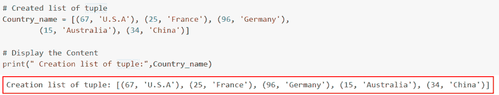
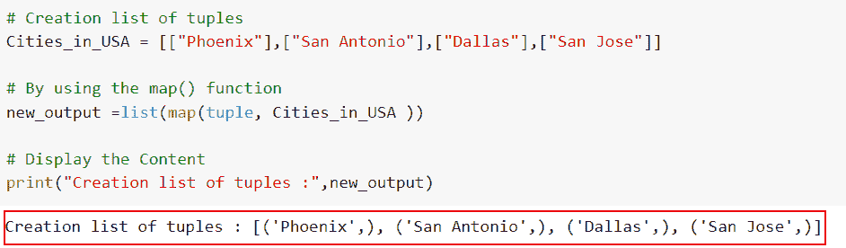
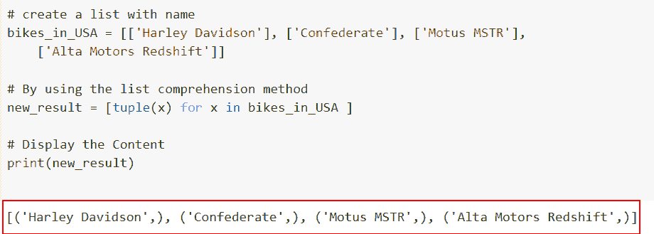
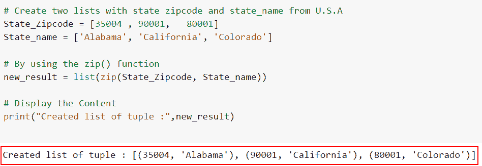
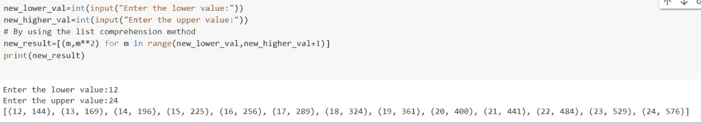

# 如何在 Python 中创建元组列表

> 原文：<https://pythonguides.com/list-of-tuples-in-python/>

[](https://sharepointsky.teachable.com/p/python-and-machine-learning-training-course)

在这篇文章中，我们将通过几种不同的方法在 [Python](https://pythonguides.com/python-hello-world-program/) 中创建元组列表。列表是可变的，而元组是不可变的，这是这两种类型的数据之间的关键区别。这具体是什么意思？换句话说，列表的项目可以被编辑或修改，但是元组的项目不能。

*   如何在 Python 中创建元组列表
*   如何使用 map()函数在 Python 中创建元组列表
*   如何使用列表理解和元组方法在 Python 中创建元组列表
*   如何使用 zip 方法在 Python 中创建元组列表
*   Python 程序创建元组列表

目录

[](#)

*   [如何在 Python 中创建元组列表](#How_to_create_a_list_of_tuples_in_Python "How to create a list of tuples in Python")
*   [如何使用 map()函数在 Python 中创建元组列表](#How_to_create_a_list_of_tuples_in_Python_by_using_the_map_function "How to create a list of tuples in Python by using the map() function")
*   [如何使用列表理解和元组方法在 Python 中创建元组列表](#How_to_create_a_list_of_tuples_in_Python_by_using_the_list_comprehension_and_tuple_method "How to create a list of tuples in Python by using the list comprehension and tuple method")
*   [如何使用 zip 方法在 Python 中创建元组列表](#How_to_create_a_list_of_tuples_in_Python_by_using_the_zip_method "How to create a list of tuples in Python by using the zip method")
*   [Python 程序创建元组列表](#Python_Program_to_Create_a_list_of_tuples "Python Program to Create a list of tuples")

## 如何在 Python 中创建元组列表

*   这里我们将讨论如何用 Python 创建元组列表。
*   在这个例子中，我们将简单地创建一个列表和元组并显示它。像数组一样，列表对象也是声明的。
*   由于列表并不总是同质的，它们可以同时存储几种数据类型的对象。列表中的项目包含在方括号**中[]** 。
*   所有的项目(元素)必须用**括号()**括起来，每个项目用逗号隔开，形成一个元组。任意数量的对象可以是各种类型，并且可以包含在一个元组**(整数、浮点、列表、字符串等)中。)**。

**举例**:

让我们举一个例子，看看如何用 Python 创建元组列表

**源代码**:

```py
# Created list of tuple
Country_name = [(67, 'U.S.A'), (25, 'France'), (96, 'Germany'),
        (15, 'Australia'), (34, 'China')]

# Display the Content
print(" Creation list of tuple:",Country_name)
```

上面，我们定义了一个名为 `Country_name` 的变量，它保存了一个国家名称和整数的列表。列表由**括号[]** 和元组包围，元组定义为括起来的**括号()**。

下面是以下给定代码的实现。



Created tuples within the list in Python

这就是我们在 Python 中创建列表元组的方式。

阅读:[寻找 3 个数最大值的 Python 程序](https://pythonguides.com/python-program-for-finding-greatest-of-3-numbers/)

## 如何使用 map()函数在 Python 中创建元组列表

*   在本节中，我们将讨论如何使用 `map()` 函数在 Python 中创建元组列表。 `Map()` 是 Python 中的内置函数。
*   Python 的 map()方法将函数应用于迭代器中作为输入提供的每一项。例如，迭代器可以返回一个可迭代的 map 对象，它可以是一个列表、元组、集合、字典或字符串。
*   当您想要使用单个转换函数改变每个可迭代元素时，可以使用它。在 Python 中，iterable 和函数作为参数提供给地图。

**语法**:

让我们看一下语法并理解 Python 中的 `map()` 函数的工作原理。

```py
map(function, iterables) 
```

*   它由两个主要参数组成
    *   **功能**:地图提供每个可迭代项目的功能。
    *   `iterables` :你要映射的序列。

**举例**:

让我们举一个例子，看看如何使用 map()函数在 Python 中创建一个元组列表。

**源代码**:

```py
# Creation list of tuples
Cities_in_USA = [["Phoenix"],["San Antonio"],["Dallas"],["San Jose"]]

# By using the map() function
new_output =list(map(tuple, Cities_in_USA ))

# Display the Content
print("Creation list of tuples :",new_output)
```

这里， `Cities_in_USA` 是创建元组列表的输入列表。使用 `map()` 函数，我们将给定的列表映射到元组函数。然后使用 `list()` 函数将映射的元组值创建为一个列表。

你可以参考下面的截图。



Using the map function we created a list of tuples

正如你在截图中看到的，我们已经讨论了如何使用 map()函数在 Python 中创建元组列表。

阅读:[如何在 Python 中修剪字符串](https://pythonguides.com/trim-a-string-in-python/)

## 如何使用列表理解和元组方法在 Python 中创建元组列表

*   在这个例子中，我们将讨论如何使用 Python 中的列表理解和元组方法来创建元组列表。
*   Python 的 list comprehension 语法使得从字符串创建列表变得简单而高效。对原始列表中的每个项目执行一个过程是构建新列表的一种非常简洁的技术。
*   可以使用 List Comprehension 和 Python 中的 `tuple()` 函数创建元组列表。给予 `tuple()` 函数的元素集合有助于创建元组。

**语法**:

下面是 Python 中列表理解方法的语法。

```py
[tuple(x) for x in inout_value]
```

**注意**:这里的 `tuple(x)` 是一个迭代器，将对象转换成元组。

**举例**:

让我们举一个例子，检查如何使用 Python 中的 list comprehension 和 tuple 方法创建元组列表。

**源代码**:

```py
# create a list with name
bikes_in_USA = [['Harley Davidson'], ['Confederate'], ['Motus MSTR'],
		['Alta Motors Redshift']]

# By using the list comprehension method
new_result = [tuple(x) for x in bikes_in_USA ]

# Display the Content
print(new_result) 
```

在下面给出的代码中，首先，我们在列表中创建了一个列表，并为元素赋值。接下来，我们使用 list comprehension 并迭代条目，通过使用 `tuple()` 方法，它将被转换为元组列表。

下面是以下给定代码的执行。



Created a list of tuples from the input nested list

这就是我们如何从输入嵌套列表中创建元组列表。

阅读: [Python 扩展 Vs 追加【主要区别】](https://pythonguides.com/python-extend-vs-append/)

## 如何使用 zip 方法在 Python 中创建元组列表

*   这里我们将讨论如何使用 Python 中的 zip 方法创建元组列表。
*   Python 中的**内置 zip()** 函数允许用户组合任意数量的 iterables **(list、str 等。)**从每个被指定为输入的 iterable 中取出项目。
*   在这个例子中，我们将使用 list 方法，在这个方法中，我们将 zip()函数作为参数传递，这个函数将返回元组的迭代器。

**语法**:

让我们看一下语法并理解 Python 中的 `zip()` 函数的工作原理。

```py
zip(iterable1, iterable2, ...)
```

**注意:**这个函数只需要 iterable 参数，这些迭代器对象组合在一起。

**举例:**

让我们举一个例子，看看如何使用 Python 中的 zip 方法创建元组列表。

**源代码:**

```py
# Create two lists with state zipcode and state_name from U.S.A

State_Zipcode = [35004 , 90001, 	80001]
State_name = ['Alabama', 'California', 'Colorado']

# By using the zip() function
new_result = list(zip(State_Zipcode, State_name))

# Display the Content
print("Created list of tuple :",new_result)
```

在上面的代码中，我们首先创建了两个名为 **State_Zipcode 和 State_name** 的列表。现在我们必须开发一个元组列表，为此我们使用了 list 函数，它会通过使用 zip 方法创建一个元组列表，在这个方法中，我们将 iterables 作为参数传递。在本例中，列出了 iterables。

下面是以下代码的截图



Using the zip method to create a list of tuple

在这个例子中，我们已经理解了如何使用 Python 中的 zip 方法创建元组列表。

阅读:[二分搜索法的 Python 程序](https://pythonguides.com/python-program-for-binary-search/)

## Python 程序创建元组列表

*   在这一节中，我们将讨论如何创建一个元组列表，第一项是数字，第二项是数字的平方。
*   在本例中，我们将获取一个范围并生成一个元组列表，只要该范围在该范围内，第一项就是数字，第二项就是数字的平方。
*   首先，我们将通过输入用户来设置上限值和下限值的范围，通过使用列表理解方法，我们可以轻松地创建元组列表，在这种情况下，第一项是数字，第二项是数字的平方。

**举例**:

让我们举一个例子，检查如何使用列表理解方法并接受用户的输入来创建元组列表。

**源代码**:

```py
new_lower_val=int(input("Enter the lower value:"))
new_higher_val=int(input("Enter the upper value:"))
# By using the list comprehension method
new_result=[(m,m**2) for m in range(new_lower_val,new_higher_val+1)]
print(new_result)
```

下面是以下给定代码的执行。



Python Program to Create a list of tuples

您可能也喜欢阅读以下 Python 教程。

*   [如何用 Python 将列表追加到另一个列表中](https://pythonguides.com/python-append-list-to-another-list/)
*   [如何在 Python 中反转一个数字](https://pythonguides.com/reverse-a-number-in-python/)
*   [偶数或奇数的 Python 程序](https://pythonguides.com/python-program-for-even-or-odd/)
*   [如何在 Python 中访问元组的条目](https://pythonguides.com/access-items-of-a-tuple-in-python/)
*   [删除 Python 中字符串的最后一个字符](https://pythonguides.com/remove-the-last-character-from-a-string-in-python/)

在本文中，我们讨论了用 Python 制作元组列表的几种不同方法。下面这个话题我们已经讲过了。

*   如何在 Python 中创建元组列表
*   如何使用 map()函数在 Python 中创建元组列表
*   如何使用列表理解和元组方法在 Python 中创建元组列表
*   如何使用 zip 方法在 Python 中创建元组列表
*   Python 程序创建元组列表

[Bijay Kumar](https://pythonguides.com/author/fewlines4biju/)

Python 是美国最流行的语言之一。我从事 Python 工作已经有很长时间了，我在与 Tkinter、Pandas、NumPy、Turtle、Django、Matplotlib、Tensorflow、Scipy、Scikit-Learn 等各种库合作方面拥有专业知识。我有与美国、加拿大、英国、澳大利亚、新西兰等国家的各种客户合作的经验。查看我的个人资料。

[enjoysharepoint.com/](https://enjoysharepoint.com/)[](https://www.facebook.com/fewlines4biju "Facebook")[](https://www.linkedin.com/in/fewlines4biju/ "Linkedin")[](https://twitter.com/fewlines4biju "Twitter")