# Python Django 中的登录系统

> 原文：<https://pythonguides.com/login-system-in-python-django/>

[](https://sharepointsky.teachable.com/p/python-and-machine-learning-training-course)

在本 [Python Django 教程](https://pythonguides.com/how-to-install-django/)中，我们将学习**在 Python Django** 中创建一个登录系统 **。而且我们还会举一些与此相关的例子。这些是我们将在本教程中讨论的以下主题。**

*   Python Django 中的登录系统
*   如何创建 Django 内置登录系统
*   如何创建 Django 定制登录系统
*   如何创建 Django 多模式登录系统

目录

[](#)

*   [在 Python Django 中登录系统](#Login_System_in_Python_Django "Login System in Python Django")
*   [如何创建 django 内置登录系统](#How_to_create_django_built-in_login_system "How to create django built-in login system")
    *   [1。创建项目](#1_Create_Project "1\. Create Project")
    *   [2。检查必要的设置](#2_Check_Necessary_Settings "2\. Check Necessary Settings")
    *   [3。进行迁移](#3_Make_Migration "3\. Make Migration")
    *   [4。定义项目 URL](#4_Define_Project_URLs "4\. Define Project URLs")
    *   [5。登录模板](#5_Login_Template "5\. Login Template")
    *   [6。模板配置](#6_Template_Configuration "6\. Template Configuration")
    *   7 .[。重定向到主页](#7_Redirect_to_Home_Page "7\. Redirect to Home Page")
    *   [8。创建超级用户](#8_Create_Super_User "8\. Create Super User")
    *   [9。运行服务器](#9_Run_Server "9\. Run Server")
*   [如何创建 Django 定制登录系统](#How_to_create_Django_customize_login_system "How to create Django customize login system")
    *   [1。基本步骤](#1_Basic_Steps "1\. Basic Steps")
    *   [2。定义 URL 文件](#2_Define_URLs_File "2\. Define URLs File")
    *   [3。注册](#3_SIGNUP "3\. SIGNUP")
    *   [5。登录](#5_LOGIN "5\. LOGIN")
    *   [5。首页](#5_HOME "5\. HOME")
    *   [6。注销](#6_LOGOUT "6\. LOGOUT")
*   [如何创建 Django 多模式登录系统](#How_to_create_Django_multiple_model_login_system "How to create Django multiple model login system")
    *   [基本步骤](#Basic_Steps "Basic Steps")
    *   [定义 URL 文件](#Define_URLs_File "Define URLs File")
    *   [创建模型](#Create_Model "Create Model")
    *   [注册型号](#Register_Model "Register Model")
    *   [创建表单](#Create_Form "Create Form")
    *   [定义视图文件](#Define_Views_File "Define Views File")
    *   [创建模板](#Create_Templates "Create Templates")
    *   [执行 Django 应用程序的步骤](#Steps_to_execute_Django_Application "Steps to execute Django Application")
    *   [输出](#Output "Output")

## 在 Python Django 中登录系统

在这一节中，我们将学习在 python Django 中登录系统是什么意思。

**登录系统**是一种安全功能，可以防止未经授权的用户访问网站上的资源。登录系统有三个部分:

1.  **注册:**注册是创建新账户的过程。如果你想第一次使用一个门户或应用程序，你必须先注册。
2.  **登录:**登录是用来验证用户身份的凭证集合。它表示用户已经被识别和认证，以便获得对网站的访问。最常见的组合是用户名和密码。
3.  **注销:**要注销一个网站，必须先登录。当您注销时，您是在告诉网站您想要停止登录会话。

阅读: [Python Django 设置时区](https://pythonguides.com/python-django-set-timezone/)

## 如何创建 django 内置登录系统

在这一节中，我们将学习如何使用 Django 的内置特性来开发登录系统的登录页面。我将用一个例子一步一步地指导你。

### 1。创建项目

如果您开始一个新项目，首先创建一个新的 Django 项目。创建新项目命令如下:

```py
django-admin startproject project_name
```

**示例:**在这里，我创建了一个名为 LoginSystem 的新项目。

**命令:**

```py
django-admin startproject LoginSystem
```

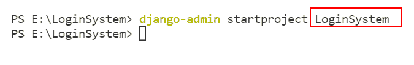

Start Project

### 2。检查必要的设置

在创建登录系统之前，请确保您的**安装的应用**中有 `django.contrib.auth` ，并且您的认证中间件在**中间件**设置中配置正确。

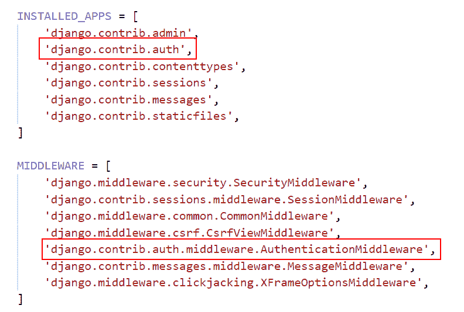

An application that is already included

### 3。进行迁移

迁移是一种将我们对模型所做的更改应用到数据库模式中的方法。为了根据迁移文件中定义的模式创建所有表，我们运行以下命令。

```py
python manage.py migrate
```

### 4。定义项目 URL

网址被称为 URL。每次访问网站时，您都可以在浏览器的地址栏中看到该网址。每个网页必须有自己独特的网址。因此，您的应用程序将知道向访问该 URL 的用户显示什么。

打开项目的 urls.py 文件并指定特定的 URL。

```py
from django.contrib import admin
from django.urls import path, include
from django.contrib.auth import views as auth_views

urlpatterns = [
    path('admin/', admin.site.urls),
    path('login/', auth_views.LoginView.as_view(), name='login'),
    path('login/',include('home.urls')),
] 
```

导入 django.contrib.auth.views 模块，并将登录页面和主页的 URLconf 添加到 urls.py 文件中。

阅读 [Python 列表追加 Django](https://pythonguides.com/python-list-append-django/)

### 5。登录模板

基本上，Django 模板用于生成最终用户可见的动态 HTML 网页。Django 中的模板是用 html、CSS 和 Javascript 在一个. HTML 文件中编写的。

默认情况下，LoginView 将尝试呈现 registration/login.html。在你的模板文件夹中创建一个注册文件夹，并在里面创建一个 login.html 页面。

```py
<!DOCTYPE html>
<html lang="en">
<head>
    <meta charset="UTF-8">
    <meta http-equiv="X-UA-Compatible" content="IE=edge">
    <meta name="viewport" content="width=device-width, initial-scale=1.0">
    <title>LoginSystem</title> 
</head>
<body>
    <form method="post">
        
        {{form.as_p}}
        <input type="submit" value="Login"/>

    </form>

</body>
</html>
```

### 6。模板配置

要配置模板系统，我们必须在 settings.py 文件中指定几个项目。我们的模板目录的名称是 templates。Django Templates 在默认情况下会在每个已安装的应用程序子目录中搜索一个 Templates 子目录。

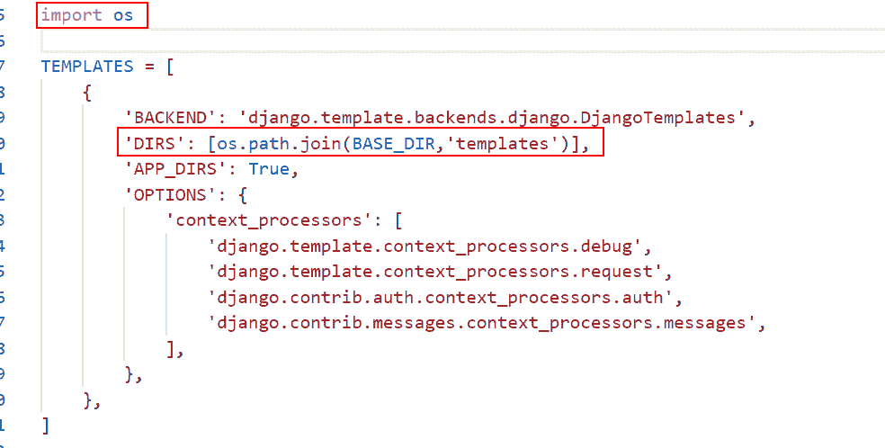

Template Configuration

### 7。重定向到主页

成功登录后，我们需要重定向到下一页，即主页。所以，让我们先学习创建应用程序

**创建应用程序的命令:**

```py
python manage.py startapp app_name
```

这里我创建了一个名为 Home 的应用程序。

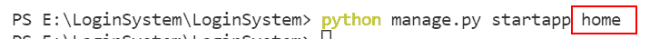

Create App

现在，我们要将应用程序包含在您的项目中，将您的应用程序名称添加到项目的 settings.py 中的已安装应用程序列表中。

```py
INSTALLED_APPS = [
    'home',
]
```

接下来，在应用程序的 urls.py 文件中定义 URL。

```py
from django.urls import path, include
from home import views

urlpatterns = [
    path('home/', views.home, name='home'),
]
```

之后，定义应用程序的视图。

```py
from django.shortcuts import render, HttpResponse

# Create your views here.

def home(request):
    return render(request, 'home.html') 
```

接下来，在 Home 应用程序的模板文件夹中创建一个 home.html 文件。

```py
<!doctype html>
<html lang="en">
  <head>
    <!-- Required meta tags -->
    <meta charset="utf-8">
    <meta name="viewport" content="width=device-width, initial-scale=1">

    <!-- Bootstrap CSS -->
    <link href="https://cdn.jsdelivr.net/npm/bootstrap@5.0.2/dist/css/bootstrap.min.css" rel="stylesheet" integrity="sha384-EVSTQN3/azprG1Anm3QDgpJLIm9Nao0Yz1ztcQTwFspd3yD65VohhpuuCOmLASjC" crossorigin="anonymous">

    <title>PythonGuides!</title>
  </head>
  <body>

    <nav class="navbar navbar-expand-lg navbar-dark bg-dark">
      <div class="container-fluid">
        <a class="navbar-brand" href="#">PythonGuides</a>
        <button class="navbar-toggler" type="button" data-bs-toggle="collapse" data-bs-target="#navbarSupportedContent" aria-controls="navbarSupportedContent" aria-expanded="false" aria-label="Toggle navigation">
          <span class="navbar-toggler-icon"></span>
        </button>
        <div class="collapse navbar-collapse" id="navbarSupportedContent">
          <ul class="navbar-nav me-auto mb-2 mb-lg-0">
            <li class="nav-item">
              <a class="nav-link active" aria-current="page" href="#">Home</a>
            </li>
          </ul>
          <form class="d-flex">
            <input class="form-control me-2" type="search" placeholder="Search" aria-label="Search">
            <button class="btn btn-outline-success" type="submit">Search</button>
          </form>
        </div>
      </div>
    </nav>
    <div class="container my-3">
      <h1 style="text-align:center;">Welcome to Python Guides</h1>
    </div>

    <div class="card">
      <div class="card-body">
        <h3 style="text-align:center;">Thanks for landing on this page to know more about PythonGuides.com.</h3>
        <br>
        <h6>I welcome you to the website and hopefully, you got to learn something in Python. I started this website to share my finding and learnings in Python with you.</h6>
        <h6>To keep things simple, I am trying to write a lot of articles on Python. Feel free to give your valuable comments and also share the articles if you are liking and hoping it will be helpful to someone.</h6>
        <br>
        <h2 style="text-align:center;">Also, Subscribe to Our YouTube Channel for FREE Python Video Tutorials.</h2>
      </div>
    <!-- Optional JavaScript; choose one of the two! -->

    <!-- Option 1: Bootstrap Bundle with Popper -->
    <script src="https://cdn.jsdelivr.net/npm/bootstrap@5.0.2/dist/js/bootstrap.bundle.min.js" integrity="sha384-MrcW6ZMFYlzcLA8Nl+NtUVF0sA7MsXsP1UyJoMp4YLEuNSfAP+JcXn/tWtIaxVXM" crossorigin="anonymous"></script>

    <!-- Option 2: Separate Popper and Bootstrap JS -->
    <!--
    <script src="https://cdn.jsdelivr.net/npm/@popperjs/core@2.9.2/dist/umd/popper.min.js" integrity="sha384-IQsoLXl5PILFhosVNubq5LC7Qb9DXgDA9i+tQ8Zj3iwWAwPtgFTxbJ8NT4GN1R8p" crossorigin="anonymous"></script>
    <script src="https://cdn.jsdelivr.net/npm/bootstrap@5.0.2/dist/js/bootstrap.min.js" integrity="sha384-cVKIPhGWiC2Al4u+LWgxfKTRIcfu0JTxR+EQDz/bgldoEyl4H0zUF0QKbrJ0EcQF" crossorigin="anonymous"></script>
    -->
  </body>
</html> 
```

我们现在需要重定向到下一页。可以将以下代码添加到 settings.py 中来设置下一页:

```py
LOGIN_REDIRECT_URL = next_page
```

在我的例子中，我想在成功登录后重定向到主页。

```py
LOGIN_REDIRECT_URL = 'home/'
```

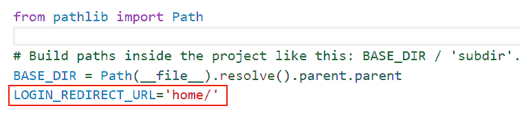

Login Settings

如果没有指定登录重定向 URL，将使用默认 URL`/accounts/profile/`，导致**模板不存在**问题。

### 8。创建超级用户

到目前为止，我们还没有为此创建任何用户。因此，我们将创建一个用户。所以，看看我们如何做到这一点。

要创建超级用户，请运行以下命令:

```py
python manage.py createsuperuser
```

*   然后输入您选择的用户名，如果您愿意的话。否则，它将使用默认的系统名称。
*   然后输入电子邮件地址并按回车键。您也可以将其留空。
*   然后，在密码字段前面，键入密码并按 enter 键。为确保安全，请输入强密码。
*   然后再次输入相同的密码进行确认。

### 9。运行服务器

在这一节中，我们将学习如何在 Django 中运行服务器。要启动服务器，请在终端中使用以下命令。

```py
python manage.py runserver
```

**输出如下:**

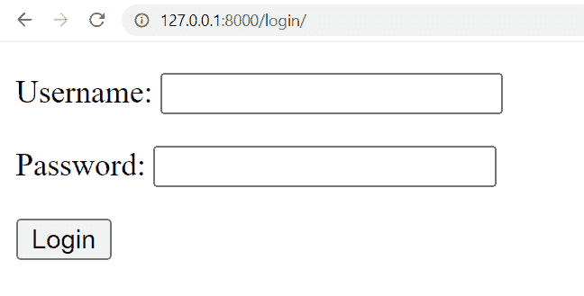

现在，输入用户名和密码，然后单击登录按钮。成功登录后，您将重定向到主页。

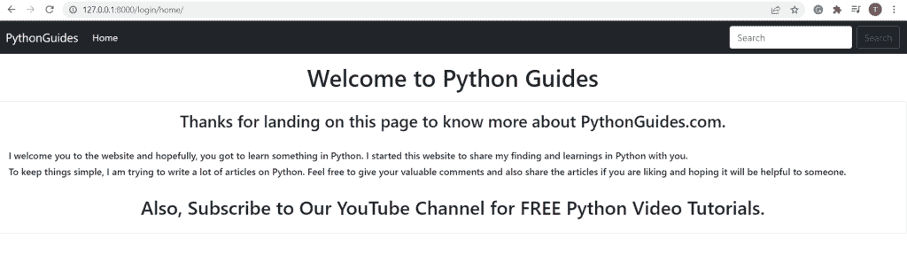

Home Page

阅读: [Python Django 格式日期](https://pythonguides.com/python-django-format-date/)

## 如何创建 Django 定制登录系统

在这一节中，我们将学习在不使用 Django 内置特性的情况下创建注册页面、登录页面和注销页面。我将用一个例子一步一步地指导你。

### 1。基本步骤

在创建注册、登录或注销页面之前，我们必须首先完成以下步骤。

**创建项目:** 首先，我们必须创建一个 Django 项目。创建 Django 项目的命令是:

```py
django-admin startproject project_name
```

因此，我构建了一个名为 `CustomLogin` 的项目。


Create Project

**创建应用:** 创建 Django 项目后，我们需要创建一个 Django 应用。创建 Django 应用程序的命令是:

```py
python manage.py startapp app_name
```

所以，我建立了一个名为**账户**的应用。

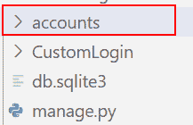

Create App

**安装应用:** 创建 Django 应用后，我们需要安装一个 Django 应用。为此，请转到项目目录并打开 settings.py 文件。现在，在 INSTALLED_APPS 中，键入您的应用程序的名称。

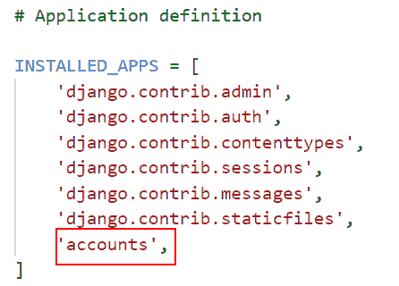

Install App

**模板:** 你需要一个模板文件夹来存放你的 HTML 文件。因此，在你的应用程序目录下，创建一个模板文件夹。转到 settings.py 文件，在模板中定义 DIRS 路径。

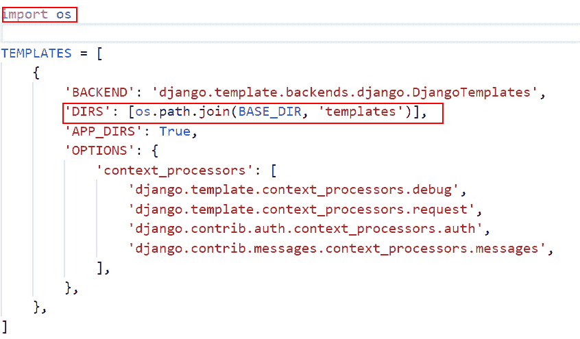

Define Templates

### 2。定义 URL 文件

根据 Django 的说法，所有资源都应该使用 urls.py 文件进行映射。

**项目 URLs 文件**:Django 默认在项目中包含一个 urls.py 文件。该文件有一个到管理应用程序的预定义路径。我们在应用程序下定义新创建的 urls.py 文件的路径。

```py
from django.contrib import admin
from django.urls import path, include

urlpatterns = [
    path('admin/', admin.site.urls),
    path('accounts/', include('accounts.urls'))
]
```

**App URLs 文件:** 首先我们要在 App 目录下创建一个名为 urls.py 的文件。现在，我们定义在应用程序的 views.py 文件下创建的不同视图的路径。

```py
from django.urls import path
from . import views

urlpatterns = [
    path("register", views.register, name="register"),
    path("login_user", views.login_user, name="login_user"),
    path("logout_user", views.logout_user, name="logout_user"),
    path("home", views.home, name="home")
] 
```

### 3。注册

现在，我们将学习创建注册视图。为此，我们必须在 app 目录的 `views.py` 文件中创建一个函数寄存器。

```py
from django.contrib import messages
from django.shortcuts import render, redirect

def register(request):
    if request.method == 'POST':
        first_name = request.POST['first_name']
        last_name = request.POST['last_name']
        username = request.POST['username']
        email = request.POST['email']
        password = request.POST['password']
        confirm_password = request.POST['confirm_password']

        if password==confirm_password:
            if User.objects.filter(username=username).exists():
                messages.info(request, 'Username is already taken')
                return redirect(register)
            elif User.objects.filter(email=email).exists():
                messages.info(request, 'Email is already taken')
                return redirect(register)
            else:
                user = User.objects.create_user(username=username, password=password, 
                                        email=email, first_name=first_name, last_name=last_name)
                user.save()

                return redirect('login_user')

        else:
            messages.info(request, 'Both passwords are not matching')
            return redirect(register)

    else:
        return render(request, 'registeration.html') 
```

*   我们首先定义**寄存器函数**，它利用了请求对象。当页面被请求时，Django 发出 HttpRequest。在这种情况下，我们将利用 **HTTP 方法 Post** 向服务器提交数据，以便创建或更新资源。
*   向服务器发送**名**、**姓**、**用户名**、**电子邮件**、**密码**，以及**确认密码**。
*   然后，我们使用各种**对象过滤器**来检查密码是否与确认密码相同(如果电子邮件地址已经存在)，并相应地打印邮件，以及根据过滤器响应重定向页面。

现在，我们来看看`registration.html`:

resgistration.html 文件指定了注册网页的外观。

```py
<!doctype html>
<html lang="en">

<head>
	<!-- Required meta tags -->
	<meta charset="utf-8">
	<meta name="viewport" content="width=device-width, initial-scale=1, shrink-to-fit=no">

	<!-- Bootstrap CSS -->
	<link rel="stylesheet" href="https://maxcdn.bootstrapcdn.com/bootstrap/4.0.0/css/bootstrap.min.css"
		integrity="sha384-Gn5384xqQ1aoWXA+058RXPxPg6fy4IWvTNh0E263XmFcJlSAwiGgFAW/dAiS6JXm" crossorigin="anonymous">

	<title>SIGNUP</title>
</head>

<body>
	<form action="/accounts/register" method="POST" class="form-horizontal">
		
		<div class="mx-auto" style="width: 400px;">

			<div class="col-xs-8 col-xs-offset-4">
				<h2 style="text-align:center;">SIGN UP</h2>
			</div>
			<hr />
			<div class="form-group">
				<label for="username">Username</label>
				<input type="text" class="form-control" name="username" id="username" placeholder="Enter Username"
					Required>
			</div>
			<div class="form-group">
				<label for="fanme">First Name</label>
				<input type="text" class="form-control" name="first_name" id="first_name" placeholder="Enter First Name"
					Required>
			</div>
			<div class="form-group">
				<label for="lname">Last Name</label>
				<input type="text" class="form-control" name="last_name" id="last_name" placeholder="Enter Last Name"
					Required>
			</div>
			<div class="form-group">
				<label for="email">Email address</label>
				<input type="email" class="form-control" name="email" id="email" placeholder="Enter email" Required>
			</div>
			<div class="form-group">
				<label for="password">Password</label>
				<input type="password" class="form-control" name="password" id="password" placeholder="Enter Password"
					Required>
			</div>
			<div class="form-group">
				<label for="confirm_password">Confirm Password</label>
				<input type="password" class="form-control" name="confirm_password" id="confirm_password"
					placeholder="Confirm Your Password" Required>
			</div>
			<button type="submit" class="btn btn-primary">SIGNUP</button>
			<a class="btn btn-dark" href="login_user" role="button">LOGIN</a>
		</div>
	</form>
	<div class="form-group">
		
		<div class="alert alert-danger" role="alert">
			{{message}}
		</div>
		
	</div>

	<!-- Optional JavaScript -->
	<!-- jQuery first, then Popper.js, then Bootstrap JS -->
	<script src="https://code.jquery.com/jquery-3.2.1.slim.min.js"
		integrity="sha384-KJ3o2DKtIkvYIK3UENzmM7KCkRr/rE9/Qpg6aAZGJwFDMVNA/GpGFF93hXpG5KkN"
		crossorigin="anonymous"></script>
	<script src="https://cdnjs.cloudflare.com/ajax/libs/popper.js/1.12.9/umd/popper.min.js"
		integrity="sha384-ApNbgh9B+Y1QKtv3Rn7W3mgPxhU9K/ScQsAP7hUibX39j7fakFPskvXusvfa0b4Q"
		crossorigin="anonymous"></script>
	<script src="https://maxcdn.bootstrapcdn.com/bootstrap/4.0.0/js/bootstrap.min.js"
		integrity="sha384-JZR6Spejh4U02d8jOt6vLEHfe/JQGiRRSQQxSfFWpi1MquVdAyjUar5+76PVCmYl"
		crossorigin="anonymous"></script>
</body>

</html>
```

*   在表单中，我们使用 Django 模板标签 **** 。通过使用这个标签，我们可以避免 CSRF 攻击，并保证从用户到服务器的 post 请求的安全性。
*   我们还使用 Django 模板标签 **** 来显示消息通知。

现在，运行服务器并查看注册网页。

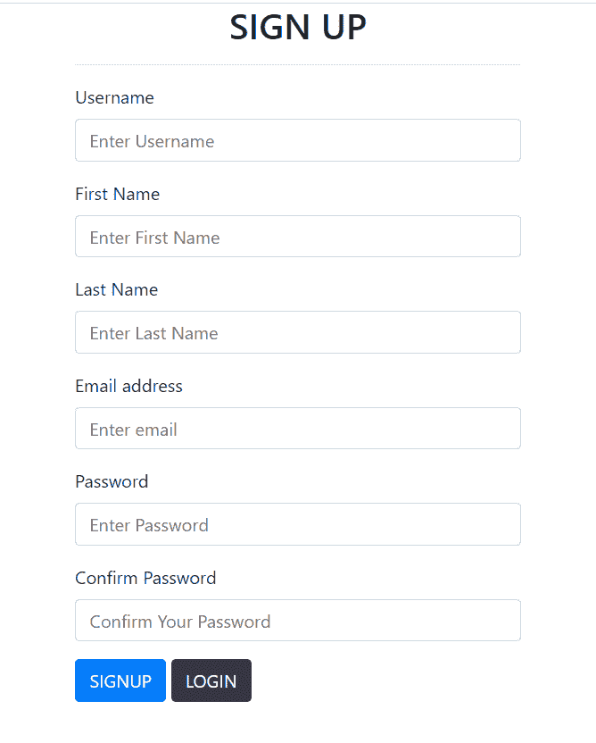

Signup Page

### 5。登录

现在，我们将学习创建 login_user 视图。为此，我们必须在 app 目录的 `views.py` 文件中创建一个函数 `login_user` 。

```py
from django.contrib import messages
from django.shortcuts import render, redirect
from django.contrib.auth.models import User, auth

def login_user(request):
    if request.method == 'POST':
        username = request.POST['username']
        password = request.POST['password']

        user = auth.authenticate(username=username, password=password)

        if user is not None:
            auth.login(request, user)
            return redirect('home')
        else:
            messages.info(request, 'Invalid Username or Password')
            return redirect('login_user')

    else:
        return render(request, 'login.html') 
```

*   首先，我们将创建 login_user 函数，它使用 POST 请求对象。
*   然后用户名和密码被发送到服务器。
*   然后，authenticate 函数用于验证用户名和密码。
*   如果用户通过了身份验证，则转到主页；如果没有，转到登录页面并打印消息无效用户名或密码。

现在，我们来看看`login.html`:

login.html 文件指定了登录网页的外观。

```py
<!doctype html>
<html lang="en">

<head>
    <!-- Required meta tags -->
    <meta charset="utf-8">
    <meta name="viewport" content="width=device-width, initial-scale=1, shrink-to-fit=no">

    <!-- Bootstrap CSS -->
    <link rel="stylesheet" href="https://maxcdn.bootstrapcdn.com/bootstrap/4.0.0/css/bootstrap.min.css"
        integrity="sha384-Gn5384xqQ1aoWXA+058RXPxPg6fy4IWvTNh0E263XmFcJlSAwiGgFAW/dAiS6JXm" crossorigin="anonymous">

    <title>LOGIN</title>
</head>

<body>
    <div class="mx-auto" style="width: 500px" ;>
        <form action="login_user" method="post" class="form-horizontal">
            
            <div class="col-xs-8 col-xs-offset-4">
                <h2 style="text-align:center;">LOGIN</h2>
            </div>

            <div class="form-group">
                <label for="username">Username</label>
                <input type="text" class="form-control" name="username" id="username" placeholder="Enter Username">
            </div>
            <div class="form-group">
                <label for="password">Password</label>
                <input type="password" class="form-control" name="password" id="password" placeholder="Enter Password">
            </div>
            <button type="submit" class="btn btn-primary">LOGIN</button>
            <br />
            <div class="form-group">
                
                <div class="alert alert-danger" role="alert">
                    {{message}}
                </div>
                
            </div>
        </form>

        <!-- Optional JavaScript -->
        <!-- jQuery first, then Popper.js, then Bootstrap JS -->
        <script src="https://code.jquery.com/jquery-3.2.1.slim.min.js"
            integrity="sha384-KJ3o2DKtIkvYIK3UENzmM7KCkRr/rE9/Qpg6aAZGJwFDMVNA/GpGFF93hXpG5KkN"
            crossorigin="anonymous"></script>
        <script src="https://cdnjs.cloudflare.com/ajax/libs/popper.js/1.12.9/umd/popper.min.js"
            integrity="sha384-ApNbgh9B+Y1QKtv3Rn7W3mgPxhU9K/ScQsAP7hUibX39j7fakFPskvXusvfa0b4Q"
            crossorigin="anonymous"></script>
        <script src="https://maxcdn.bootstrapcdn.com/bootstrap/4.0.0/js/bootstrap.min.js"
            integrity="sha384-JZR6Spejh4U02d8jOt6vLEHfe/JQGiRRSQQxSfFWpi1MquVdAyjUar5+76PVCmYl"
            crossorigin="anonymous"></script>
</body>

</html>
```

*   为了显示消息通知，我们使用 Django 模板标签 **** 。

注册成功后，我们会将您重定向到登录页面，如果您已经是用户，您也可以直接转到登录页面。

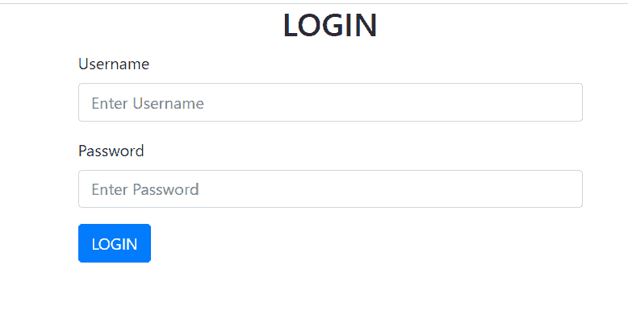

Login Page

### 5。首页

现在，我们将学习创建主视图。为此，我们必须在 app 目录的 `views.py` 文件中创建一个函数 `home` 。

```py
from django.contrib import messages
from django.shortcuts import render, redirect

def home(request):
    return render(request, 'home.html')
```

*   首先，我们将创建带有请求对象的 home 函数。
*   主页功能重定向到 home.html。

现在，我们来看看`home.html`:

home.html 文件指定主页的外观。

```py
<!DOCTYPE html>
<html lang="en">

<head>
  <meta charset="UTF-8">
  <meta http-equiv="X-UA-Compatible" content="IE=edge">
  <meta name="viewport" content="width=device-width, initial-scale=1.0">
  <link rel="stylesheet" href="https://maxcdn.bootstrapcdn.com/bootstrap/4.0.0/css/bootstrap.min.css"
    integrity="sha384-Gn5384xqQ1aoWXA+058RXPxPg6fy4IWvTNh0E263XmFcJlSAwiGgFAW/dAiS6JXm" crossorigin="anonymous">
  <title>Login System</title>
</head>

<body>

  <script src="https://code.jquery.com/jquery-3.2.1.slim.min.js"
    integrity="sha384-KJ3o2DKtIkvYIK3UENzmM7KCkRr/rE9/Qpg6aAZGJwFDMVNA/GpGFF93hXpG5KkN"
    crossorigin="anonymous"></script>
  <script src="https://cdnjs.cloudflare.com/ajax/libs/popper.js/1.12.9/umd/popper.min.js"
    integrity="sha384-ApNbgh9B+Y1QKtv3Rn7W3mgPxhU9K/ScQsAP7hUibX39j7fakFPskvXusvfa0b4Q"
    crossorigin="anonymous"></script>
  <script src="https://maxcdn.bootstrapcdn.com/bootstrap/4.0.0/js/bootstrap.min.js"
    integrity="sha384-JZR6Spejh4U02d8jOt6vLEHfe/JQGiRRSQQxSfFWpi1MquVdAyjUar5+76PVCmYl"
    crossorigin="anonymous"></script>

  <nav class="navbar navbar-expand-lg navbar-dark bg-dark">
    <a class="navbar-brand" href="home">Login System</a>
    <button class="navbar-toggler" type="button" data-toggle="collapse" data-target="#navbarNav"
      aria-controls="navbarNav" aria-expanded="false" aria-label="Toggle navigation">
      <span class="navbar-toggler-icon"></span>
    </button>
    <div class="collapse navbar-collapse" id="navbarNav">
      <ul class="navbar-nav">
        <li class="nav-item active">
          <a class="nav-link" href="home">HOME<span class="sr-only">(current)</span></a>
        </li>
        
        <li class="nav-item">
          <a class="nav-link" href="#">Hi, {{user.first_name}}</a>
        </li>
        <li class="nav-item">
          <a class="nav-link" href="logout_user">LOGOUT</a>
        </li>
        
        <li class="nav-item">
          <a class="nav-link" href="register">SIGN UP</a>
        </li>
        <li class="nav-item">
          <a class="nav-link" href="login_user">LOGIN</a>
        </li>
        
      </ul>
    </div>
  </nav>

  <div class="container my-3">
    <h1 style="text-align:center;">Welcome to Python Guides</h1>
  </div>

  <div class="card">
    <div class="card-body">
      <h3 style="text-align:center;">Thanks for landing on this page to know more about PythonGuides.com.</h3>
      <br>
      <h6>I welcome you to the website and hopefully, you got to learn something in Python. I started this website to
        share my finding and learnings in Python with you.</h6>
      <h6>To keep things simple, I am trying to write a lot of articles on Python. Feel free to give your valuable
        comments and also share the articles if you are liking and hoping it will be helpful to someone.</h6>
      <br>
      <h2 style="text-align:center;">Also, Subscribe to Our YouTube Channel for FREE Python Video Tutorials.</h2>
    </div>
</body>

</html>
```

*   这里我们使用带有 `is_authenticated` 属性的 **** 模板标签来验证用户是否被授权。
*   如果用户通过了身份验证，我们会在导航栏上打印用户的名字。为此，我们使用标签 **{{user.first_name}}** 。
*   在导航栏上，我们还添加了一个注销按钮。

让我们看看主页，当用户成功登录。

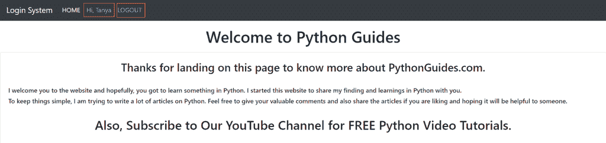

Home Page

### 6。注销

现在，我们将学习创建 logout_user 视图。为此，我们必须在 app 目录的 `views.py` 文件中创建一个函数 `logout_user` 。

```py
from django.contrib import messages
from django.shortcuts import render, redirect
from django.contrib.auth.models import User, auth

def logout_user(request):
    auth.logout(request)
    return redirect('home')
```

*   首先，我们将创建带有请求对象的 logout_user 函数。
*   为了注销用户，我们使用 django.contrib.auth 的 log out()函数。
*   logout_user 函数重定向到 home。

当我们点击 logout 按钮时，logout()函数被调用。而且，它完全清除了当前请求的会话数据。

让我们看看当我们点击 logout 按钮时主页是什么样子的。

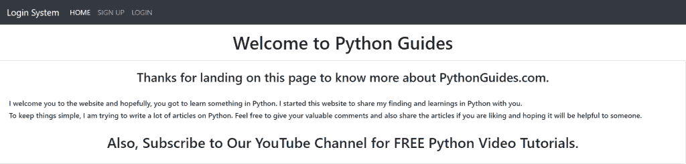

Home Page

## 如何创建 Django 多模式登录系统

在这一节中，我们将学习如何使用 Django 开发一个具有多种模型的登录系统。这个登录系统由三个模块组成:注册、登录和注销。

### 基本步骤

在我们开始学习如何开发上述登录系统的三个模块之前，我们必须首先完成一些基本和必要的程序。

**创建项目:**

我们必须首先建立一个 Django 项目。并且，要创建一个 Django 项目，使用以下命令:

```py
django-admin startproject MultiLogin
```

*   因此，在这里我构建了一个名为 `MultiLogin` 的项目

**创建 APP:**

在我们完成 Django 项目后，我们需要开发一个 Django 应用程序。要制作 Django 应用程序，请使用以下命令:

```py
python manage.py startapp accounts
```

*   所以，在这里我构建了一个名为 `accounts` 的应用。

**安装 APP:**

创建 Django 应用程序后，我们需要安装它。为此，请打开项目目录中的 `settings.py` 文件。现在在**已安装应用**中输入你的应用名称。

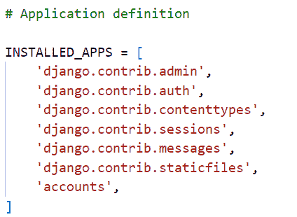

INSTALL APP

**安装/激活模板** :

要存储 HTML 文件，您需要一个模板文件夹。在您的应用程序目录中创建一个模板文件夹。在 `settings.py` 文件的模板中定义 **DIRS 路径**。

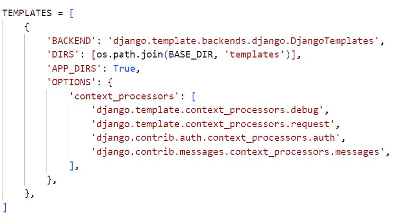

TEMPLATE

### 定义 URL 文件

在创建一个项目和一个应用程序后，我们必须创建 URL 文件，因为根据 Django，所有的资源都应该使用这些文件进行映射。

**项目 URL 文件:**

Django 在项目中默认包含一个 `urls.py` 文件( `MultiLogin` )。在该文件中添加以下代码。

```py
from django.contrib import admin
from django.urls import path, include

urlpatterns = [
    path('admin/', admin.site.urls),
    path('accounts/', include('accounts.urls'))
]
```

*   在这个文件中，管理应用程序的路径是预定义的。
*   现在，我们必须指定 urls.py 文件在应用程序 `(accounts)` 中的位置。

**APP 网址文件:**

默认情况下，应用程序不包含任何 urls.py 文件。所以首先，我们必须在应用程序目录**(账户)**中创建一个名为 `urls.py` 的文件。

```py
from django.urls import path
from . import views

urlpatterns = [
    path('register/', views.register, name='register'),
    path('login/', views.login_user, name='login_user'),
    path('logout/', views.logout_user, name='logout_user'),
    path('home/', views.home, name='home'),
    path('student_register/', views.student_register.as_view(), name='student_register'),
    path('teacher_register/', views.teacher_register.as_view(), name='teacher_register')
]
```

*   这里，我们定义了在应用程序的 `views.py` 文件下创建的不同视图的路径。

### 创建模型

基本上，数据库中的一个表就是一个 Django 模型。默认情况下，当我们在 Django 中构建项目时，我们在项目的根文件夹 `(MUTILOGIN)` 中得到一个空的 SQLite 数据库。所以，要做一张新桌子，我们需要做一个新模型。

打开 accounts 文件夹中的 `models.py` 文件。默认情况下，它是空的，所以添加以下代码:

```py
from django.db import models
from django.contrib.auth.models import AbstractUser

class User(AbstractUser):
    is_student = models.BooleanField(default=False)
    is_teacher = models.BooleanField(default=False)
    first_name = models.CharField(max_length=80)
    last_name = models.CharField(max_length=80)

class Student(models.Model):
    user = models.OneToOneField(User, on_delete=models.CASCADE, primary_key=True)
    phone_number = models.CharField(max_length=10)
    class_name = models.CharField(max_length=100)

class Teacher(models.Model):
    user = models.OneToOneField(User, on_delete=models.CASCADE, primary_key=True)
    phone_number = models.CharField(max_length=10)
    department = models.CharField(max_length=30) 
```

因此，这里我们创建了三个名为 User、Student 和 Teacher 的类。所以，让我们详细讨论每一个类:

*   用户类别:
    *   这里，我们创建一个定制的用户模型，并通过使用 AbstractUser 扩展它的功能。
    *   因此，AbstractUser 是一个具有完整字段的模型，类似于一个抽象类，这样你就可以很容易地从它那里继承你在其他模型类中也需要的字段。
*   学生班级:
    *   在这里，我们创建学生模型类。在这个类中，我们定义了上面创建的 User 类的字段之间的一对一关系。
    *   除此之外，我们还创建了一个文本字段**“phone _ number”**，它将包含最大长度为 10 的学生的电话号码。
    *   然后，我们再创建一个文本字段**“class _ name”**，它将包含学生的班级。
*   教师班级:
    *   在这里，我们创建教师示范班。在这个类中，我们再次定义了上面创建的 User 类的字段之间的一对一关系。
    *   除此之外，我们还创建了一个文本字段**“phone _ number”**，它将包含最大长度为 10 的老师的电话号码。
    *   然后，我们再创建一个文本字段**“department”**，它将包含教师所在的部门。

### 注册型号

打开账户文件夹中的 `admin.py` 文件。默认情况下，它是空的，所以添加以下代码:

```py
from django.contrib import admin
from .models import User, Student, Teacher
# Register your models here.

admin.site.register(Student)
admin.site.register(Teacher)
```

*   所以，在这里我们注册上面创建的两个模型，即学生模型和教师模型与管理界面。

### 创建表单

表单是包含多个字段或空间的页面，用户可以在其中输入数据。在 accounts 文件夹中创建并打开 `forms.py` 文件。默认情况下，它是空的，因此添加以下代码:

```py
from django.contrib.auth.forms import UserCreationForm
from django.db import transaction
from django import forms
from .models import Student, Teacher, User

class StudentSignUpForm(UserCreationForm):
    first_name = forms.CharField(required=True)
    last_name = forms.CharField(required=True)
    phone_number = forms.CharField(required=True)
    class_name = forms.CharField(required=True)

    class Meta(UserCreationForm.Meta):
        model = User

    @transaction.atomic
    def data_save(self):
        user = super().save(commit=False)
        user.first_name = self.cleaned_data.get('first_name')
        user.last_name = self.cleaned_data.get('last_name')
        user.is_student = True
        user.save()
        student = Student.objects.create(user=user)
        student.class_name = self.cleaned_data.get('class_name')
        student.phone_number = self.cleaned_data.get('phone_number')
        student.save()
        return user

class TeacherSignUpForm(UserCreationForm):
    first_name = forms.CharField(required=True)
    last_name = forms.CharField(required=True)
    department = forms.CharField(required=True)

    class Meta(UserCreationForm.Meta):
        model = User

    @transaction.atomic
    def data_save(self):
        user = super().save(commit=False)
        user.first_name = self.cleaned_data.get('first_name')
        user.last_name = self.cleaned_data.get('last_name')
        user.is_teacher = True
        user.save()
        teacher = teacher.objects.create(user=user)
        teacher.phone_number = self.cleaned_data.get('phone_number')
        teacher.department = self.cleaned_data.get('department')
        teacher.save()
        return user
```

因此，我们在这里创建了两个名为 StudentSignUpForm 和 TeacherSignUpForm 的表单类，让我们详细讨论每个类:

*   学生签名表单:
    *   Django 有一个集成的用户认证系统。因此，我们在这里导入用户身份验证模块，允许我们创建学生注册。
    *   这里，我们使用 `UserCreationForm` 为我们的应用程序创建一个新用户。默认情况下，该表单有三个字段:**用户名**、**密码**和**确认密码**。
    *   除此之外，我们还分别创建了四个文本字段**名**、**姓**、**电话号码**和**类名**。
    *   我们定义元类，因为我们需要添加关于模型用户的数据。
    *   然后我们使用学生注册表单的原子事务，它是一个或多个 SQL 操作的序列，被视为一个单元。原子事务的目的是提供四个通常称为 ACID 的属性。
*   教师签名表格:
    *   在这里，我们导入用户认证模块，允许我们创建教师注册。
    *   接下来，我们使用 `UserCreationForm` 为我们的应用程序创建一个新用户。默认情况下，该表单有三个字段:**用户名**、**密码**和**确认密码**。
    *   然后，除此之外，我们分别创建三个文本字段**名**、**姓**和**部门**。
    *   我们定义元类是因为我们需要添加关于用户模型的数据。
    *   然后我们使用教师注册表单的原子事务，因为原子事务的目的是提供四个通常称为 ACID 的属性。

### 定义视图文件

基本上，Django 视图和 HTML 文档一样，都是接受 http 请求并返回 http 响应的 Python 函数。所以，我们可以说基于 Django 的网站有很多视图，有不同的任务和目标。

而且，视图通常存储在应用程序文件夹中一个名为 `views.py` 的文件中。默认情况下，它是空的，因此添加以下代码:

```py
from email import message
from django.shortcuts import render, redirect
from django.contrib.auth import login, logout,authenticate
from django.contrib.auth.forms import AuthenticationForm
from django.contrib import messages
from django.views.generic import CreateView
from .models import User
from .forms import StudentSignUpForm, TeacherSignUpForm

# Create your views here.

def home(request):
    return render(request, 'home.html')

def register(request):
    return render(request, 'register.html')

class student_register(CreateView):
    model = User  
    form_class = StudentSignUpForm
    template_name= 'student_register.html'

    def form_valid(self, form):
        user = form.save()
        login(self.request, user)
        return redirect('/accounts/home')

class teacher_register(CreateView):
    model = User  
    form_class = TeacherSignUpForm
    template_name= 'teacher_register.html'

    def form_valid(self, form):
        user = form.save()
        login(self.request, user)
        return redirect('/accounts/home')

def login_user(request):
    if request.method=='POST':
        form = AuthenticationForm(data=request.POST)
        if form.is_valid():
            username = form.cleaned_data.get('username')
            password = form.cleaned_data.get('password')
            user = authenticate(username=username, password=password)
            if user is not None :
                login(request,user)
                return redirect('/accounts/home')
            else:
                messages.error(request,"Invalid username or password")
        else:
            messages.error(request,"Invalid username or password")
    return render(request, 'login.html',context={'form':AuthenticationForm()})

def logout_user(request):
    logout(request)
    return redirect('/accounts/home')
```

所以，这里我们创建了六个视图，分别命名为**首页**、**注册**、**学生 _ 注册**、**教师 _ 注册**、**登录 _ 用户**和**注销 _ 用户**。所以，让我们详细讨论一下每个观点:

*   主页:
    *   在 home 视图中，我们简单的渲染到**‘home . html’**模板。
*   注册:
    *   在注册视图中，我们简单的渲染到**‘register . html’**模板。
*   student_regsiter:
    *   然后，我们基于通用视图创建 `student_register` 类。
    *   接下来，我们使用 `CreateView` ,因为页面上需要**学生注册表单**,并且在提交有效表单时需要插入数据库。
*   teacher_regsiter:
    *   然后，我们基于通用视图创建了 `teacher_register` 类。
    *   接下来，我们使用 `CreateView` ,因为页面上需要**教师注册表单**,并且在提交有效表单时需要插入数据库。
*   登录 _ 用户:
    *   我们将创建 `login_user` 视图，它使用 POST 请求对象。
    *   然后用户名和密码被发送到服务器。
    *   然后，authenticate 函数用于验证用户名和密码。
    *   如果用户通过了身份验证，则转到主页；如果没有，转到登录页面并打印消息无效用户名或密码。
*   注销 _ 用户:
    *   使用请求对象，我们将创建注销用户功能。
    *   接下来，使用 django.contrib.auth 的 `logout()` 函数注销用户。
    *   成功注销后，用户将返回到您的'**主页'**。

### 创建模板

我们从 Django 中了解到，结果应该是 HTML，HTML 文件是在模板中创建的。

所以在根文件夹 `(MULTILOGIN)` 里面创建一个 templates 文件夹，并创建五个 HTML 文件，分别命名为**‘home . HTML’**，‘**log in . HTML’**，**‘register . HTML’**，**‘student _ register . HTML’**，**‘teacher _ regsiter . HTML’**。

因此，让我们讨论并创建每个 HTML 文件:

*   home.html:
    *   home.html 文件指定了主页的外观。下面是 home.html 文件的**代码。**
    *   这里我们使用带有 `is_authenticated` 属性的 **** 模板标签来验证用户是否被授权。
    *   如果用户通过了身份验证，我们将打印 Hi 用户名。为此，我们使用标签 **{{user.get_username}}** 。
    *   我们还添加了一个注销按钮。

```py
<!DOCTYPE html>
<html lang="en">

<head>
    <meta charset="UTF-8">
    <meta http-equiv="X-UA-Compatible" content="IE=edge">
    <meta name="viewport" content="width=device-width, initial-scale=1.0">
    <title>Document</title>
</head>

<body>
    <h1>Welcome to PythonGuides</h1>

    
    <h3>Hi {{user.get_username}}</h3>
    <a href="">Logout</a> <br>
    
    <a href="">Register</a> <br>
    <a href="">Login</a>
    
</body>

</html>
```

*   login.html
    *   login.html 文件指定了登录网页的外观。下面是 login.html 文件的**代码。**
    *   这里我们添加**学生 _ 注册**和**教师 _ 注册**的链接。

```py
<!DOCTYPE html>
<html lang="en">

<head>
    <meta charset="UTF-8">
    <meta name="viewport" content="width=device-width, initial-scale=1.0">
    <meta http-equiv="X-UA-Compatible" content="ie=edge">
    <title>Login</title>
</head>

<body>

    <h2>Login</h2>

    <form action="" method="POST" novalidate>
        
        {{form.as_p}}

            <br>
            <input type="submit" value="Login" class="btn btn-block btn-primary">
        </div>
    </form>

</body>

</html>
```

*   注册. html:
    *   register.html 文件指定了注册网页的外观。下面是 register.html 文件的**代码。**

```py
<!DOCTYPE html>
<html lang="en">
<head>
    <meta charset="UTF-8">
    <meta name="viewport" content="width=device-width, initial-scale=1.0">
    <meta http-equiv="X-UA-Compatible" content="ie=edge">
    <title>User Registration</title>
</head>
<body>

    <section>
        <div class="container">
          <div class="row">
            <div class="col-md-6 mx-auto">
              <div class="card">
                <div class="card-header text-black">
                  <h2>User Registration</h2>
                </div>
                <div class="card-body">
                    <div class="row">
                       <div class="col-lg-6">
                        <a type="button" class="btn btn-block" href="">I am a student</a>
                       </div>
                       <div class="col-lg-6">
                        <a type="button" class="btn btn-block" href="">I am an teacher</a>
                       </div>
                    </div>
                  </form>
                </div>
              </div>
            </div>
          </div>
        </div>
      </section>

</body>
</html>
```

*   学生 _ 注册. html:
    *   `student_register.html` 文件指定学生注册网页的外观。下面是 `student_register.html` 文件的代码。

```py
<!DOCTYPE html>
<html lang="en">

<head>
    <meta charset="UTF-8">
    <meta name="viewport" content="width=device-width, initial-scale=1.0">
    <meta http-equiv="X-UA-Compatible" content="ie=edge">
    <title>Student Registration</title>
</head>

<body>

    <h2> Student Registeration Form</h2>
    <form action="" method="POST" novalidate>
        
        {{form.as_p}}
        <input type="submit" value="Register" class="btn btn-block btn-primary">
</body>

</html>
```

*   teacher_register.html:
    *   `teacher_register.html` 文件指定了教师注册网页的外观。而下面是**教师 _ 注册. html** 文件的代码。

```py
<!DOCTYPE html>
<html lang="en">

<head>
  <meta charset="UTF-8">
  <meta name="viewport" content="width=device-width, initial-scale=1.0">
  <meta http-equiv="X-UA-Compatible" content="ie=edge">
  <title>Teacher Registration</title>
</head>

<body>
  <h2>Teacher Registeration Form</h2>
  <form action="" method="POST" novalidate>
    
    {{form.as_p}}
    <input type="submit" value="Register" class="btn btn-block btn-primary">
</body>

</html>
```

### 执行 Django 应用程序的步骤

**进行迁移:**

如果模型已经被修改，这个命令为我们的新模型准备一个 makemigrations 文件。在终端中运行以下命令。

```py
python manage.py makemigartions
```

**迁徙:**

migrate 命令执行数据库的最近迁移文件中给出的指令。在终端中运行以下命令。

```py
python manage.py migrate
```

**运行服务器:**

要运行开发服务器，请在终端中运行以下命令。

```py
python manage.py runserver
```

### 输出


Home Page Multiple Model Login System

在主页上，我们有两个选项注册和登录。如果您是新用户，请单击“注册”。如果您已经注册，请单击“登录”。


Register Page

当我们点击注册，我们得到两个选项'我是学生'和'我是老师'。如果你是学生，点击学生的，否则点击教师的。

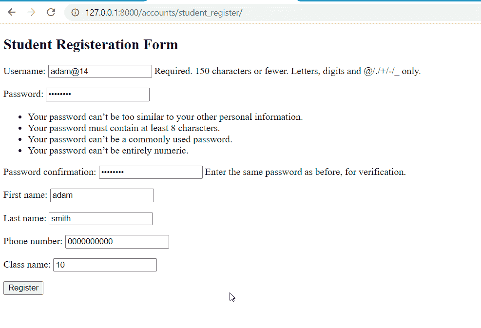

Student Registration

如果你点击“我是学生”，你会看到这样的页面。

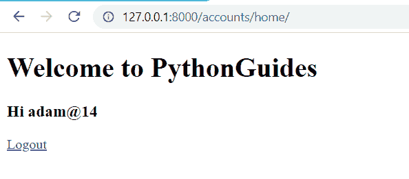

Student Login

当你点击注册时，页面将会是这样的。

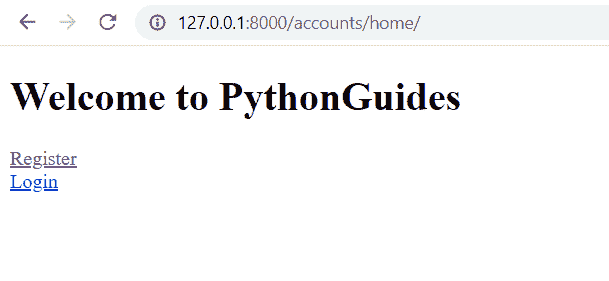

Multi model Login System

当我们点击注销，我们移动到主页。

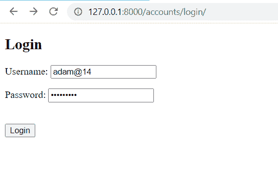

Login Page

当我们点击登录，我们将进入登录页面。当你点击登录时，你将再次进入主页，显示你的用户名和你好。

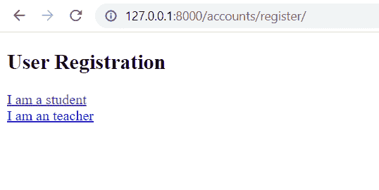

Register Page

如果你点击我是老师。

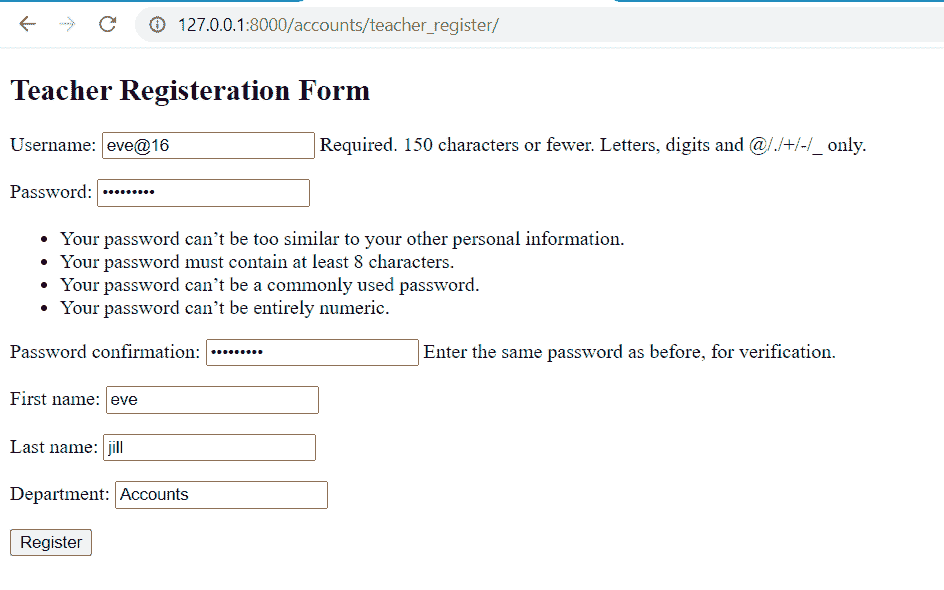

Teacher Register

您将转到教师注册页面，在这里教师可以注册。

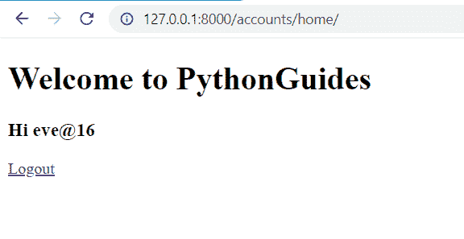

Home Page of Teacher

您将转到主页，在那里您将获得教师用户名和 Hi 消息。如果你点击注销按钮，你将进入主页，在这里我们有两个选项注册或登录。

你可能也喜欢阅读下面的 Django 教程。

*   [Python 改 Django 版本](https://pythonguides.com/python-change-django-version/)
*   [Python 过滤器不在 Django 中](https://pythonguides.com/filter-not-in-django/)
*   [Python Django vs 金字塔](https://pythonguides.com/python-django-vs-pyramid/)
*   [Python Django 长度过滤器](https://pythonguides.com/python-django-length-filter/)
*   [获取 Django 中的 URL 参数](https://pythonguides.com/get-url-parameters-in-django/)

在这个 Python Django 教程中，我们讨论了 Python Django 中的登录系统。此外，我们还将讨论以下主题列表。

*   Python Django 中的登录系统
*   如何创建 Django 内置登录系统
*   如何创建 Django 定制登录系统
*   如何创建 Django 多模式登录系统

[Bijay Kumar](https://pythonguides.com/author/fewlines4biju/)

Python 是美国最流行的语言之一。我从事 Python 工作已经有很长时间了，我在与 Tkinter、Pandas、NumPy、Turtle、Django、Matplotlib、Tensorflow、Scipy、Scikit-Learn 等各种库合作方面拥有专业知识。我有与美国、加拿大、英国、澳大利亚、新西兰等国家的各种客户合作的经验。查看我的个人资料。

[enjoysharepoint.com/](https://enjoysharepoint.com/)[](https://www.facebook.com/fewlines4biju "Facebook")[](https://www.linkedin.com/in/fewlines4biju/ "Linkedin")[](https://twitter.com/fewlines4biju "Twitter")