# 使用 Python 的机器学习

> 原文：<https://pythonguides.com/machine-learning-using-python/>

[](https://sharepointsky.teachable.com/p/python-and-machine-learning-training-course)

想**学机器学习**？在本教程中，我们将了解什么是机器学习？**使用 Python 的机器学习**。我们还将讨论机器学习的类型，机器学习所需的各种软件，如何为机器学习建立环境，以及各种流行的机器学习库。

目录

[](#)

*   [机器学习简介](#Introduction_to_Machine_Learning "Introduction to Machine Learning")
*   [机器学习类型](#Machine_Learning_Types "Machine Learning Types")
    *   [监督机器学习](#Supervised_Machine_Learning "Supervised Machine Learning")
    *   [无监督机器学习](#Unsupervised_Machine_Learning "Unsupervised Machine Learning")
    *   [强化机器学习](#Reinforcement_Machine_Learning "Reinforcement Machine Learning")
*   [机器学习软件](#Machine_learning_software "Machine learning software")
    *   [Python 3](#Python_3 "Python 3")
    *   [迷你康达](#Miniconda "Miniconda")
    *   [Jupyter 笔记型电脑](#Jupyter_notebook "Jupyter notebook")
*   [机器学习环境设置](#Machine_learning_environment_setup "Machine learning environment setup")
    *   [创建环境](#Create_Environment "Create Environment")
    *   [激活和停用环境](#Activate_and_deactivate_the_environment "Activate and deactivate the environment")
    *   [将所有库存储在一个环境中](#Store_all_the_libraries_in_one_environment "Store all the libraries in one environment")
    *   [与他人共享环境](#Share_Environment_with_others "Share Environment with others")
*   [机器学习热门库](#Machine_Learning_Popular_Libraries "Machine Learning Popular Libraries")
*   [结论](#Conclusion "Conclusion")

## 机器学习简介

*   机器学习是让机器像人类一样行动的工程。
*   机器学习使用算法根据类似的数据对未来进行预测。
*   机器学习是当今市场的热门话题&每个公司都想实现它。
*   机器学习就是使用数据和做出预测。
*   在传统时代，数据是在纸上存储和处理的，随着数据的快速增长，我们开始使用电子表格，后来关系数据库进入了大数据领域，然后引入了机器学习。
*   随着时间推移，技术随着数据的增加而改进。
*   机器学习是人工智能的子集。
*   在**机器学习**中创建的算法被称为**模态**。

如果你是 Python 新手，看看[如何学习 Python](https://pythonguides.com/learn-python/) ？还有 [Python Pygame 教程+ 17 个例子](https://pythonguides.com/python-pygame-tutorial/)。

## 机器学习类型

主要有三种类型的机器学习，它们是:

*   **监督机器学习**
*   **无监督机器学习**
*   **强化机器学习**

现在你知道了 ML 类型的名字，让我们学习一下这些名字&理解为什么，什么时候以及如何使用它们。

你可能会喜欢 Python 里的[熊猫。](https://pythonguides.com/pandas-in-python/)

### 监督机器学习

*   监督学习是一个提供数据(**输入**)和标签(**输出**)的过程。如标签中所述，该算法使用数据来预测输出。如果失败，它会进行一些更改并重试。这个过程一直持续到&，除非预测是按照标签或者接近标签。
*   例:一个艺术家正在画一个苹果。他有一张苹果的图片，并一直画，直到两张图片看起来相似。
*   监督学习进一步分为:
    *   **分类**
    *   **回归**
*   **分类**生成二进制输出。它被用来识别事物是否如此。例如发热或不发热、可用或不可用等。
*   **回归**处理数值。它谈论的数字主要是监控值。

### 无监督机器学习

*   无监督学习有数据(输入)，没有标签(输出)。使用数据，算法试图找到数据中的模式。它被用来寻找两个或更多事物的相似之处。
*   目标是很好地逼近映射函数，使得算法可以预测新的数据输出。
*   神经网络是无监督学习的最好例子。
*   无监督学习进一步分为:
    *   **聚类**
    *   **关联**
*   **聚类**指将相似的事物或特征进行分组。
*   **关联**发现描述大部分数据的规则。

### 强化机器学习

*   强化学习训练模型做出一系列决策。每一个正确的决定都会奖励模型，每一个错误的决定都会惩罚模型。这样，他们就知道什么是对什么是错了。
*   该算法记录对与错&当暴露于新数据或现实生活中时使用它。这类似于训练一只宠物。每当宠物做了我们想让它做的事情，我们就给它食物。
*   游戏是强化学习的最好例子。

## 机器学习软件

在本节中，我们将讨论我们将用来执行机器学习**模型**的软件。

*   `Python 3`
*   **迷你康达**
*   **Jupyter 笔记型电脑**

机器学习入门需要这三个软件。让我们理解为什么我们需要他们&谁是他们的竞争对手。

### Python 3

*   Python 是一种解释型、交互式、面向对象的高级语言，由吉多·范·罗苏姆于 1990 年创建。
*   Python 提供简洁可读的代码，而机器学习有复杂的算法。python 的简单性有助于开发人员更轻松地构建复杂的机器学习模型。这就是 python 在开发者中出名的原因。
*   机器学习模型也可以用 **R 编程来写。**
*   在本教程中，我们将使用 Python 3。点击[这里](https://pythonguides.com/python-download-and-installation/)了解如何下载安装 python。

### 迷你康达

*   `Miniconda` 是软件包管理器，它有助于
    *   为项目创建环境
    *   重要库的安装
*   Miniconda 是 anaconda 的**轻点版本**。Anaconda 附带了预安装的库，方便用户在安装后立即开始工作。而 miniconda 没有安装任何库。
*   我们强烈建议使用 miniconda，这样你就知道你有什么。理解您的系统对于编写更好的 python 代码同样重要。注意力集中，手动做事，会对机器产生更好的理解。
*   你越了解机器，你写的代码就越好。
*   根据您的操作系统，点击[此处](https://docs.conda.io/en/latest/miniconda.html)下载 miniconda。

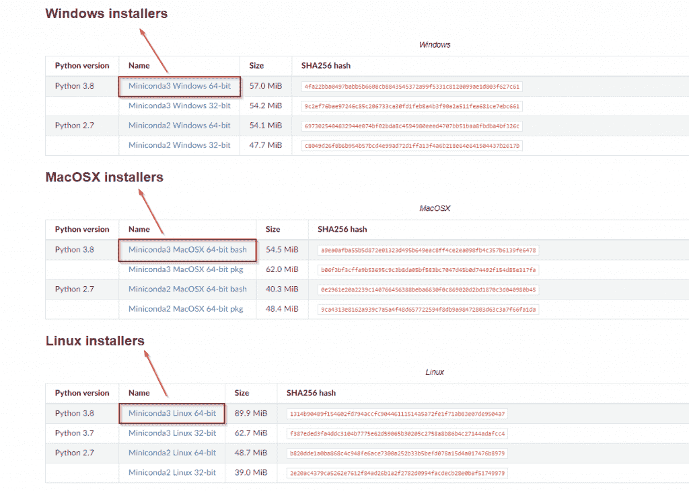

miniconda download page

*   我们强调了当今常见的选项。如果你有一个 32 位操作系统，那么你可以下载到 32 位 miniconda。但是一定要为 `Python 3` 下载。

**安装迷你康达**

点击下载的文件&你会看到这个界面。该程序在 windows 10 中执行，但类似的屏幕会出现在 mac 和 linux 上。

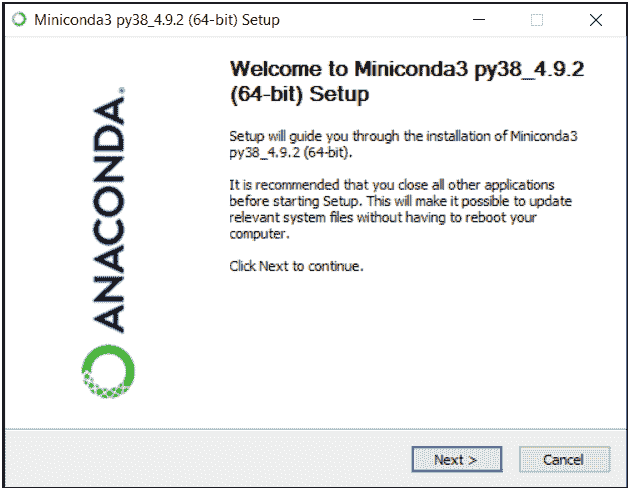

Installation of Miniconda

1.  点击**下一个**按钮。

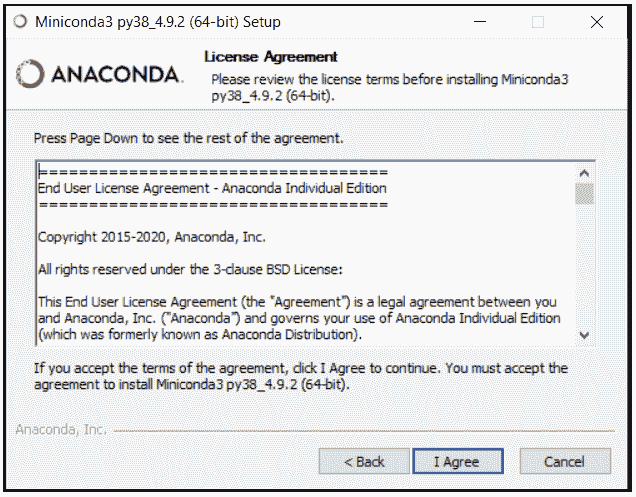

Installation of Miniconda

2.点击**我同意**接受许可协议。

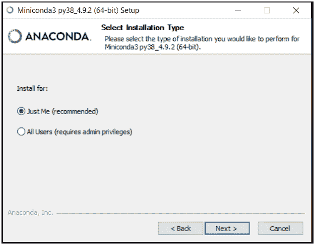

3.选择**仅我**单选按钮，然后点击**下一步。**

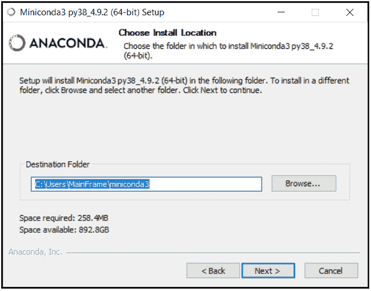

Installation of Miniconda

4.如果您想在其他位置安装程序，可以更改路径。很好，然后点击**下一步。**

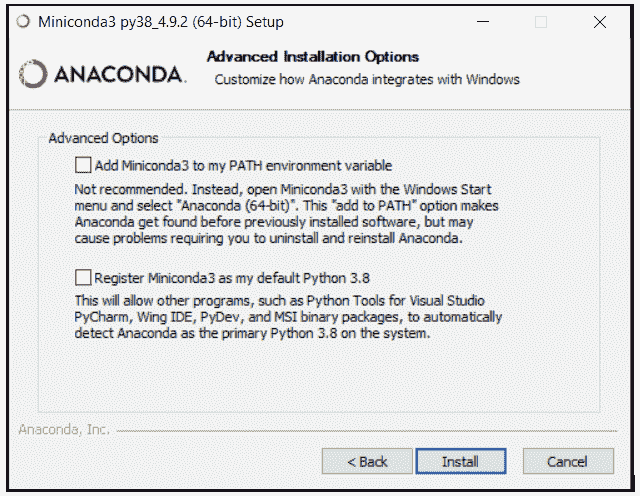

Miniconda installation steps

5.如果您将点击**添加到路径**复选框，那么您将能够在命令提示符、Powershell &终端上访问 `conda` 。这完全取决于用户对我们的偏好，我们只想在 miniconda 提示符下使用 conda。
第二个复选框将 Python 3.8 设置为默认用于 miniconda。点击**安装**。

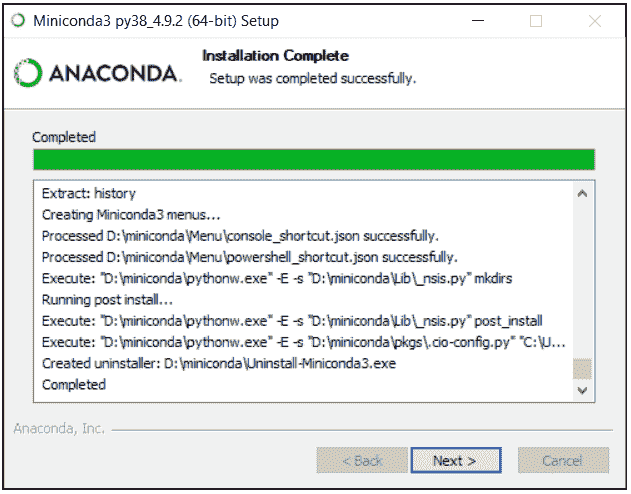

Miniconda installation steps

6.安装完成后，点击**下一个**按钮。

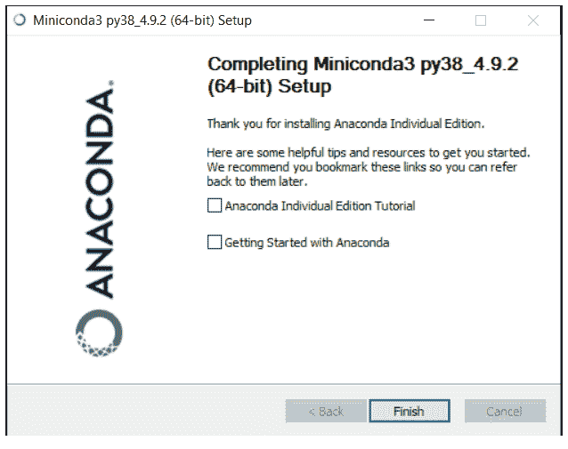

Miniconda installation steps

7.点击**完成**按钮，取消选中所有复选框。

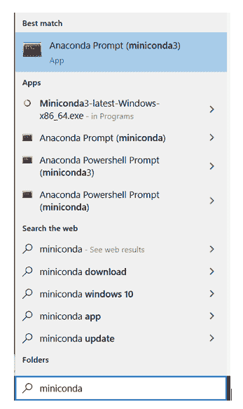

8.在 windows 上搜索 miniconda 在 windows 上搜索，在 mac 上搜索 spotlight

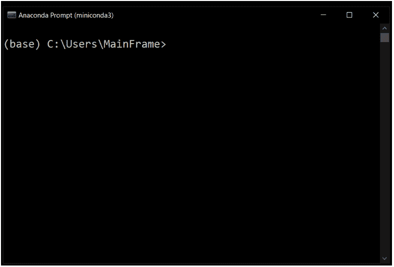

9.这是您将看到的 miniconda 的界面

### Jupyter 笔记型电脑

*   Jupyter notebook 是一个允许创建、阅读、共享文档的网络应用程序。它使用代码以文本和可视化的形式显示输出。这是一个编写机器学习模型的强大平台。
*   由于其简单的外观和有效的工作，Jupyter 笔记本是一种广泛使用的机器学习工具。
*   也可以在 `vscode` 、 `google collab` 、 `Ibm` 平台等进行 ML 操作。但是在本课程中，我们将使用 jupyter 笔记本。

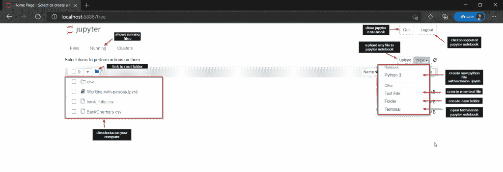

Jupyter notebook

## 机器学习环境设置

*   在机器学习中，设置环境起着重要的作用。如果你掌握了为你的机器学习项目建立环境的艺术，那么你已经是半个传奇人物了。
*   机器学习的项目很大，包括一群人。因此，重要的是，每个队友都必须以类似的方式配置他们的系统，以避免混淆。事情不仅到此结束，而且当项目与用户共享时，也需要相同的配置。这就是为什么环境设置被认为是一个重要的步骤。
*   在本节中，我们将学习如何
    *   **创造环境**
    *   **激活和停用环境**
    *   **将所有库存储在一个环境中**
    *   **与他人共享环境**

### 创建环境

*   在您的计算机上创建一个项目文件夹。在我的例子中，文件夹的名称是‘python guides-ML’
*   打开 miniconda 并导航到该文件夹
*   我们将我们的环境文件夹命名为 `env` 。
*   我们既可以在创建 `env` 时提供库的名称，也可以稍后安装。
*   在这里，我们将安装 pandas 和 NumPy 库，同时创建 `env` 。

```py
conda create --prefix ./env pandas numpy
```

*   `Conda` 是一个跨平台的包和环境管理器，它安装和管理来自 `Anaconda` 仓库和 `Anaconda` 云的 `conda` 包。
*   **创建**是创建环境的指令
*   **–当我们必须在特定位置创建环境时，使用前缀**。如果我们想创建全球环境，那么我们可以使用**–name**。这将为环境命名。我们不能在同一个命令中使用**名称**和**前缀**。
*   熊猫& numpy 是我们在创建环境时安装的库。

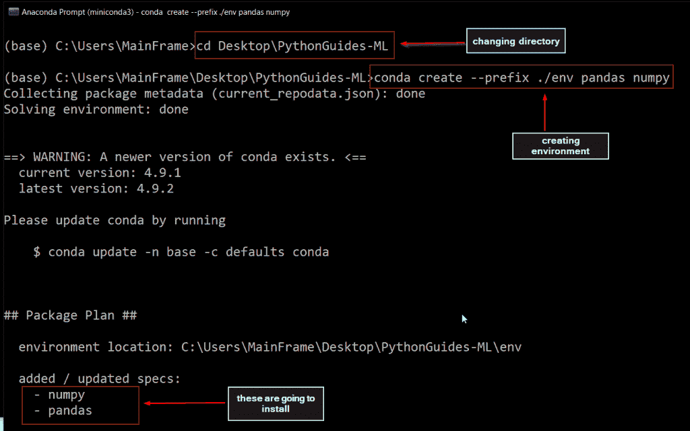

Machine Learning Environment Setup

这样，我们可以在项目文件夹中为我们的项目创建一个环境。这整个文件夹可以与其他队友共享&他们将有相同的设置。

### 激活和停用环境

在我们开始工作之前，我们必须激活我们创建的环境。一旦环境被激活，我们就可以开始安装更多的包或库。在现实生活中，我们有多个项目，所以我们需要在不同的环境中切换。要访问另一个环境，我们必须先停用该环境。

**语法:**

下面是激活和停用环境的语法。这里的 path 指的是项目的路径。

```py
# activate environment
conda activate path/env

# deactivate environment
conda deactivate
```

**举例:**

在本例中，我们将激活在上一节中创建的环境。

```py
# to view the existing environment
conda env list

# activating environment
conda activate 

# deactivate enviroment
conda deactivate
```

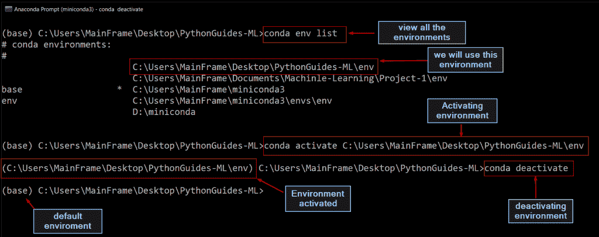

Machine Learning Environment Setup

### 将所有库存储在一个环境中

现在我们已经学会了如何创建环境和在创建环境的同时安装库。在本节中，我们将学习如何在特定的环境中安装更多的库。将所有的库存储在一个环境中有助于开发人员将项目的所有必要内容保存在一个文件夹中&共享变得很容易。

**第一步。**激活开始工作的环境。

**第二步。**在这里输入`**conda install <name of the package>**`，确保你正在安装的包在 anaconda 包中是可用的。键入不正确或不完整的名称将显示错误。

要验证该包是否存在于 anaconda 包列表中，您可以尝试使用包名。如果出现错误，意味着包不可用，或者你可以查看 [](https://docs.anaconda.com/anaconda/packages/pkg-docs/) anaconda 的[文档](https://docs.anaconda.com/anaconda/packages/pkg-docs/)。

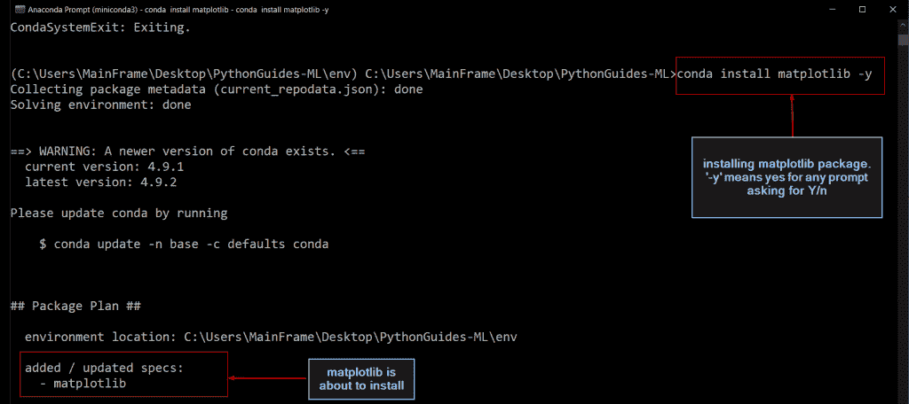

### 与他人共享环境

在团队中工作时，每个成员在他们的机器上设置相同的环境变得很重要。这有助于避免当前或未来的问题。另一方面，如果你已经在 GitHub 这样的开源平台上共享了代码。然后，您可以简单地添加指令来激活环境。用户会爱上你的帖子，因为它看起来很容易设置。

共享项目有两种方式:

*   **共享项目文件夹**

如果项目很小并且只有很少的库，那么您可以简单地与他人共享项目文件夹。令人惊讶的是，环境文件夹是一个很大的文件，所以上传或下载文件需要时间和带宽。

*   **分享 YAML` `文件**

分享。yaml 文件是共享项目环境的有效方式，因为它们是轻量级的，并且依赖于版本。稍后当另一个用户将使用。yaml 文件，那么他将能够拥有相同版本的相同依赖项。

下面是将**导出**到 YAML 文件的代码。

```py
conda env export --prefix C:\Users\MainFrame\Desktop\PythonGuides-ML\env > environment.yaml
```

*   **`conda env export` :** 这是导出文件的主要指令。
*   这是我们想要导出的环境。
*   ``environment.yaml``是您要为导出的文件提供的名称。
*   执行该命令时，您可以在项目文件夹中看到 `environment.yaml` 文件。
*   打开文件，更改环境的**名称**。在我们的例子中，我们给出了新的名字 `newenv`

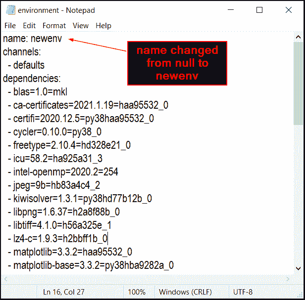

一旦我们更改了环境的名称，现在我们需要使用这个 yaml 文件创建环境。

下面是使用YAML 文件导入或创建环境的代码。

```py
# create envirnoment using yaml file
conda env create -f environment.yaml

# activating environment
conda activate newenv
```

*   **`conda env create -f environment.yaml`** 将用该命令创建。
*   **`conda activate newenv`** :由于我们已经将环境重命名为 `newenv` ，所以我们必须在这里提供相同的名称来激活环境。

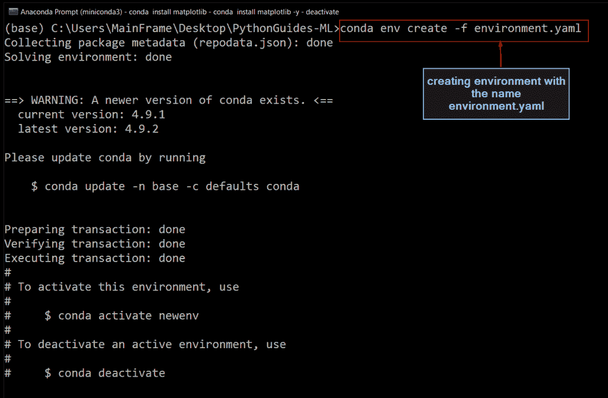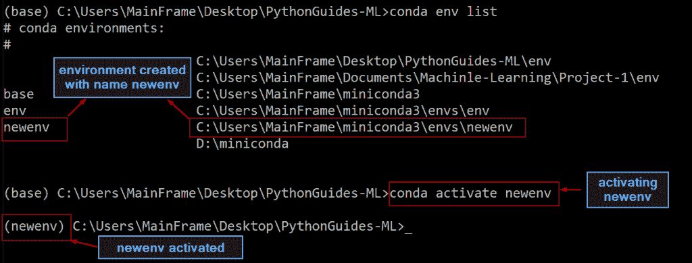

## 机器学习热门库

在这一节中，我们将向初学者简要介绍在使用 Python 进行机器学习时使用的流行库。

*   熊猫
*   `NumPy`
*   `Matplotlib`
*   `Sckiti-Learn`

您可能会喜欢以下 Python 教程:

*   [Python Tkinter TreeView 示例](https://pythonguides.com/python-tkinter-treeview/)
*   [巨蟒龟命令](https://pythonguides.com/python-turtle-commands/)
*   [Python Tkinter 画布教程](https://pythonguides.com/python-tkinter-canvas/)
*   [Python 命名约定](https://pythonguides.com/python-naming-conventions/)
*   [Python 下载和安装步骤](https://pythonguides.com/python-download-and-installation/)
*   [Python Hello World 程序](https://pythonguides.com/python-hello-world-program/)

## 结论

在本教程中，我们已经了解了什么是机器学习，**使用 python** 的机器学习，环境设置，使用各种流行的机器学习库，如 Pandas，NumPy，matlpotlib & scikit-learn。我们会用专门的博客更多的讨论更多的 Python 机器学习库。敬请关注我们，如果您有任何疑问或建议，请留下您的评论。

[Bijay Kumar](https://pythonguides.com/author/fewlines4biju/)

Python 是美国最流行的语言之一。我从事 Python 工作已经有很长时间了，我在与 Tkinter、Pandas、NumPy、Turtle、Django、Matplotlib、Tensorflow、Scipy、Scikit-Learn 等各种库合作方面拥有专业知识。我有与美国、加拿大、英国、澳大利亚、新西兰等国家的各种客户合作的经验。查看我的个人资料。

[enjoysharepoint.com/](https://enjoysharepoint.com/)[](https://www.facebook.com/fewlines4biju "Facebook")[](https://www.linkedin.com/in/fewlines4biju/ "Linkedin")[](https://twitter.com/fewlines4biju "Twitter")