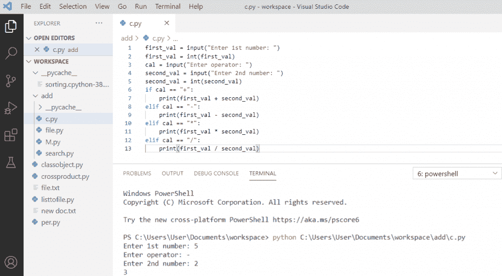

# 如何用 Python + Python Tkinter 计算器制作计算器

> 原文：<https://pythonguides.com/make-a-calculator-in-python/>

[](https://sharepointsky.teachable.com/p/python-and-machine-learning-training-course)

在本 [Python 教程](https://pythonguides.com/python-programming-for-the-absolute-beginner/)中，我们将**用 python** 制作一个计算器，它可以根据用户输入的输入进行加减乘除。

此外，我们将讨论如何使用 Tkinter 创建一个 Python 计算器。

目录

[](#)

*   [用 Python 制作计算器](#Make_a_calculator_in_Python "Make a calculator in Python")
*   [python 中的计算器使用类](#Calculator_in_python_using_class "Calculator in python using class")
*   [python 中不带函数的计算器](#Calculator_in_python_without_function "Calculator in python without function")
*   [python 代码中的计算器](#Calculator_in_python_code "Calculator in python code")
*   [Python Tkinter 计算器](#Python_Tkinter_Calculator "Python Tkinter Calculator")
    *   [使用 Python Tkinter 创建一个简单的计算器](#Create_a_Simple_Calculator_using_Python_Tkinter "Create a Simple Calculator using Python Tkinter")
    *   [规划 Python Tkinter 计算器](#Planning_for_Python_Tkinter_Calculator "Planning for Python Tkinter Calculator")
    *   [创建 Python Tkinter 计算器的算法](#Algorithm_to_Create_Python_Tkinter_Calculator "Algorithm to Create Python Tkinter Calculator")

## 用 Python 制作计算器

让我们看看如何使用函数在 python 中创建一个计算器。

你可以看到，我们用 python 创建了一个简单的**计算器**，它可以执行不同的算术运算，如**加**、**减**、**乘**、**除**。用户定义的函数是 add()、subtract()、multiply()和 divide()将计算各自的运算并显示输出。

**举例:**

```py
def add(x,y):
    return x + y
def subtract(x,y):
    return x - y
def multiply(x,y):
    return x * y
def divide(x,y):
    return x / y
print("Select operation.")
print("1.Add")
print("2.Subtract")
print("3.Multiply")
print("4.Divide")
while True:
    choice = input("Enter your choice(1/2/3/4): ")
    if choice in ('1', '2', '3', '4'):
        number1 = float(input("Enter first number: "))
        number2 = float(input("Enter second number: "))
        if choice == '1':
           print(number1, "+", number2, "=", add(number1, number2))
        elif choice == '2':
           print(number1, "-", number2, "=", subtract(number1, number2))
        elif choice == '3':
           print(number1, "*", number2, "=", multiply(number1, number2))
        elif choice == '4':
           print(number1, "/", number2, "=", divide(number1, number2))
        break
     else:
         print("Entered input is invalid")
```

可以参考下面截图来**用 Python** 做一个计算器。


How to make a calculator in Python

**输出:**
这里，我们要求用户选择一个他们所选择的操作。如果选项为 **1、2、3** 和 `4` 则有效，否则显示“无效输入”。如果选项有效，那么我们必须输入两个数字，根据用户输入的选择，它将执行操作。


calculator in Python

您可能还会喜欢 [Python Tkinter 秒表](https://pythonguides.com/python-tkinter-stopwatch/)和[如何使用 Python Tkinter](https://pythonguides.com/how-to-take-user-input-and-store-in-variable-using-python-tkinter/) 获取用户输入并存储在变量中。

## python 中的计算器使用类

让我们一步一步地看看如何创建一个执行基本计算器操作的类。

*   用类制作计算器。创建对象需要类。类使得代码更加有效，并且简单易懂。
*   首先，我们将创建一个类 `calculator` ,所有的函数都定义为加法、减法、乘法和除法。
*   `Self` 在使用 `obj1.function()` 调用函数时使用。在这里，函数将调用自己。
*   现在，我们将接受用户的输入，并创建对象。
*   最后，创建用户选择来执行他们需要的操作，并在输出中打印值。

**举例:**

```py
class calculator:
    def addition(self):
        print(x + y)
    def subtraction(self):
        print(x - y)
    def multiplication(self):
        print(x * y)
    def division(self):
        print(x / y)
x = int(input("Enter first number:"))
y = int(input("Enter second number:"))
obj1 = calculator()
choice = 1
while choice !=0:
    print("1\. ADDITION")
    print("2\. SUBTRACTION")
    print("3\. MULTIPLICATION")
    print("4\. DIVISION")
    choice = int(input("Enter your choice:"))
    if choice == 1:
        print(obj1.addition())
    elif choice == 2:
        print(obj1.subtraction())
    elif choice == 3:
        print(obj1.multiplication())
    elif choice == 4:
        print(obj1.division())
    else:
        print("Invalid choice")
```

现在，您可以看到代码的输出。


Calculator in python using class

**输出:**


Calculator in python using class

你可能会喜欢，[如何在 Python Tkinter 中设置背景为图像](https://pythonguides.com/set-background-to-be-an-image-in-python-tkinter/)

## python 中不带函数的计算器

我们在 python 中创建了一个简单的**计算器**，没有函数可以执行不同的算术运算，如**加**、**减**、**乘**和**除**。

**举例:**

```py
first_val = input("Enter 1st number: ")
first_val = int(first_val)
cal = input("Enter operator: ")
second_val = input("Enter 2nd number: ")
second_val = int(second_val)
if cal == "+":
    print(first_val + second_val)
elif cal == "-":
    print(first_val - second_val)
elif cal == "*":
    print(first_val * second_val)
elif cal == "/":
    print(first_val / second_val)
```

下面的截图显示了我们如何创建一个没有功能的计算器。



Calculator in python without function

你可能还喜欢，[如何使用 Python Tkinter](https://pythonguides.com/python-tkinter-to-display-data-in-textboxes/) 在文本框中显示数据？

## python 代码中的计算器

在这里，我们将看到 python 中计算器的**代码。这里，我们创建一个单独的函数来执行类似于**加**、**减**、**乘**、**除**的操作。它将接受用户的输入以及操作符的选择，并返回结果。**

**举例:**

```py
def add(x, y):
   return x + y
def subtract(x, y):
   return x - y
def multiply(x, y):
   return x * y
def divide(x, y):
   return x / y
print("select an operation")
print("+")
print("-")
print("*")
print("/")
choice = input("Enter any operator to use")
a = int(input("Enter first number: "))
b = int(input("Enter second number: "))
if choice == '+':
   print(a,"+",b,"=", add(a,b))
elif choice == '-':
   print(a,"-",b,"=", subtract(a,b))
elif choice == '*':
   print(a,"*",b,"=", multiply(a,b))
elif choice == '/':
   print(a,"/",b,"=", divide(a,b))
else:
   print("Invalid input")
```

你可以看到下面 python 代码的计算器截图和输出。


Calculator in python code

**输出:**


Calculator in python code

这就是我们如何用 Python 制作计算器的方法。

阅读: [Python Tkinter 主循环](https://pythonguides.com/python-tkinter-mainloop/)

## Python Tkinter 计算器

让我们看看如何使用 Python Tkinter 创建一个简单的计算器。我希望这个 **Python Tkinter 计算器**的例子能帮助你用 Python 创建一个简单的计算器。

如果您是 Python GUI 编程或 Python Tkinter 的新手，请查看 [Python GUI 编程(Python Tkinter)](https://pythonguides.com/python-gui-programming/)

### 使用 Python Tkinter 创建一个简单的计算器

*   Python Tkinter 用于各种 GUI 应用程序，其中之一是计算器。
*   使用计算器应用程序将有助于您更好地理解 python。
*   在这一节中，我们将为您提供完整的源代码和解释。
*   请阅读整个博客，并留下评论来澄清任何疑问。

### 规划 Python Tkinter 计算器

在这一节中，我们将讨论在为 python Tkinter 计算器编写代码之前训练自己的秘密。我们将讨论一个应用程序的外观，它将要执行的功能，以及灵感的来源。

*   灵感来源是 Windows 10 操作系统上的计算器。
*   它在显示屏上有灰色背景，在按钮上有黑色背景。
*   整个应用程序的文本颜色是白色。
*   应用程序总是在右下角打开。
*   数字显示在屏幕的右侧。

在观察了整个 windows 10 计算器应用程序之后，现在是时候编写我们将在应用程序中使用或实现的东西了。

1.  每次应用程序都会在右下角打开。
2.  该应用程序将有一个灰色背景的显示和黑色背景的按钮。
3.  整个应用程序的文本颜色将是白色
4.  一个窗口将有一个固定的大小&不能调整大小。
5.  该计算器将具有加、减、乘、除的基本功能。
6.  数字将显示在屏幕的右侧。

### 创建 Python Tkinter 计算器的算法

在本节中，我们将讨论创建 python Tkinter 计算器的算法。此外，我们将提供相同的数据流图(DFD)。

`ws = Tk()
ws.title('Calculator')
ws.geometry('250x400+500+100')
ws.resizable(0,0)`

*   代码的第一行用于初始化父层。
*   第二行用于设置窗口的标题。标题是羽毛旁边的窗口顶部的名称。
*   第三行是设置窗口的宽度、高度和位置。
    *   宽度= 250
    *   高度= 400
    *   位置 x = 500
    *   位置 y = 100
*   Resizable 确定可以拉伸的屏幕大小。屏幕可以在 x 和 y 轴上拉伸。因为我们已经将这两个值都设置为 0。这意味着**屏幕不能以任何方式拉伸**。

`frame_1 = Frame(ws)
frame_1.pack(expand=True, fill=BOTH)`

*   要放置标签和按钮等小部件，我们必须创建 4 个框架。
*   如果空间可用，允许每个帧在 x 和 y 方向上完全扩展。
*   这样，所有的框架将有相似的空间&放置在其中的按钮将具有对称性。
    *   `expand=True`:这允许可用空间的扩展。
    *   `fill=both`:膨胀方向

`key_1 = Button(
frame_1,
text='1',
font=('Arial', 22),
border = 0,
relief = GROOVE,
bg = '#2E2E2B',
fg = 'white',
command = lambda: display(1)
)`

在这段代码中，我们创建了一个按钮。要了解按钮，请参考我们的**按钮章节**。这里，在**命令**下，我们可以调用一个函数，但不能传递一个参数给函数。这就是我们在这里使用匿名函数 lambda 的原因。要了解更多关于匿名功能的信息，请参考我们关于**匿名功能**的章节。

这是计算器的 DFD


全局变量

```py
num = ''
```

*   函数中使用的变量仅限于该函数
*   如果我们想在其他函数中使用一个特定变量
*   然后我们必须声明这个变量是一个全局变量。
*   在这段代码中，我们将 `num` 声明为一个全局变量。
*   任何引用该变量的函数必须在变量名前使用**全局**关键字
*   其他函数也会观察到任何函数对此变量所做的更改。
*   例如，如果任何函数将 num 的值设置为“10”，那么使用 num 的其他函数也将把 `num` 的值设置为“10”。

解释功能:

`equal_btn()`

```py
def equal_btn():
     global num
     add=str(eval(num))
     scr_lbl['text'] = add
     num=''
```

*   `equal_btn()` 函数多次使用，第 3 行&第 4 行变量名略有变化。
*   在这里，内置函数 eval()起着重要的作用。
*   `eval()` 将一个字符串作为输入，并将其转换为一个整数&执行运算。
*   这意味着如果将字符串“2+3”传递给 eval，它将返回 5 作为输出


**def `clear_scr` (数字)**

```py
def clear_scr():
    global num
    num = ''
    scr_lbl['text'] = num
```

*   当用户点击 `C` 时调用该函数。
*   它清除显示屏上的所有内容，并将 `num` 的值设置为空字符串。

**def 显示(数字)**

```py
def display(number):
    global num 
    num = num + str(number)
    scr_lbl['text'] = num
```

*   该功能负责在屏幕上显示数字。
*   每当用户单击编号按钮时，它就会与现有的字符串连接起来。
*   所以当点击 1 时，它在屏幕上显示 1。然后，当我们单击 2 时，它会显示 12，依此类推。

**代码:**

```py
from tkinter import *

ws = Tk()
ws.title('Calculator')
ws.geometry('250x400+500+100')
ws.resizable(0,0)

# global variables
num = ''

# functions
def display(number):
    global num 
    num = num + str(number)
    scr_lbl['text'] = num

def `clear_scr()`:
    global num
    num = ''
    scr_lbl['text'] = num

def equal_btn():
     global num
     add=str(eval(num))
     scr_lbl['text'] = add
     num=''
def equal_btn():
     global num
     sub=str(eval(num))
     scr_lbl['text'] = sub
     num=''     
def equal_btn():
     global num
     mul=str(eval(num))
     scr_lbl['text'] = mul
     num=''
def equal_btn():
     global num
     div=str(eval(num))
     scr_lbl['text'] = div
     num=''    

var = StringVar()

# frames 
frame_1 = Frame(ws) 
frame_1.pack(expand=True, fill=BOTH)

frame_2 = Frame(ws)
frame_2.pack(expand=True, fill=BOTH)

frame_3 = Frame(ws)
frame_3.pack(expand=True, fill=BOTH)

frame_4 = Frame(ws)
frame_4.pack(expand=True, fill=BOTH)

# label
scr_lbl = Label(
    frame_1,
    textvariable='',
    font=('Arial', 20),
    anchor = SE,
    bg = '#595954',
    fg = 'white' 
    )

scr_lbl.pack(expand=True, fill=BOTH)

# buttons
key_1 = Button(
    frame_1,
    text='1',
    font=('Arial', 22),
    border = 0,
    relief = GROOVE,
    bg = '#2E2E2B',
    fg = 'white',
    command = lambda: display(1)
    )

key_1.pack(expand=True, fill=BOTH, side=LEFT)

key_2 = Button(
    frame_1,
    text='2',
    font=('Arial', 22),
    border = 0,
    relief = GROOVE,
    bg = '#2E2E2B',
    fg = 'white',
    command = lambda: display(2)
    )

key_2.pack(expand=True, fill=BOTH, side=LEFT)

key_3 = Button(
    frame_1,
    text='3',
    font=('Arial', 22),
    border = 0,
    relief = GROOVE,
    bg = '#2E2E2B',
    fg = 'white',
    command = lambda: display(3)
    )

key_3.pack(expand=True, fill=BOTH, side=LEFT)

key_add = Button(
    frame_1,
    text='+',
    font=('Arial', 22),
    border = 0,
    relief = GROOVE,
    bg = '#2E2E2B',
    fg = 'white',
    command = lambda: display('+')
    )

key_add.pack(expand=True, fill=BOTH, side=LEFT)

key_4 = Button(
    frame_2,
    text='4',
    font=('Arial', 22),
    border = 0,
    relief = GROOVE,
    bg = '#2E2E2B',
    fg = 'white',
    command = lambda: display(4)
    )

key_4.pack(expand=True, fill=BOTH, side=LEFT)

key_5 = Button(
    frame_2,
    text='5',
    font=('Arial', 22),
    border = 0,
    relief = GROOVE,
    bg = '#2E2E2B',
    fg = 'white',
    command = lambda: display(5)
    )

key_5.pack(expand=True, fill=BOTH, side=LEFT)

key_6 = Button(
    frame_2,
    text='6',
    font=('Arial', 22),
    border = 0,
    relief = GROOVE,
    bg = '#2E2E2B',
    fg = 'white',
    command = lambda: display(6)
    )

key_6.pack(expand=True, fill=BOTH, side=LEFT)

key_sub = Button(
    frame_2,
    text='-',
    font=('Arial', 22),
    border = 0,
    relief = GROOVE,
    bg = '#2E2E2B',
    fg = 'white',
    command = lambda: display('-')
    )

key_sub.pack(expand=True, fill=BOTH, side=LEFT)

key_7 = Button(
    frame_3,
    text='7',
    font=('Arial', 22),
    border = 0,
    relief = GROOVE,
    bg = '#2E2E2B',
    fg = 'white',
    command = lambda: display(7)
    )

key_7.pack(expand=True, fill=BOTH, side=LEFT)

key_8 = Button(
    frame_3,
    text='8',
    font=('Arial', 22),
    border = 0,
    relief = GROOVE,
    bg = '#2E2E2B',
    fg = 'white',
    command = lambda: display(8)
    )

key_8.pack(expand=True, fill=BOTH, side=LEFT)

key_9 = Button(
    frame_3,
    text='9',
    font=('Arial', 22),
    border = 0,
    relief = GROOVE,
    bg = '#2E2E2B',
    fg = 'white',
    command = lambda: display(9)
    )

key_9.pack(expand=True, fill=BOTH, side=LEFT)

key_mul = Button(
    frame_3,
    text='*',
    font=('Arial', 22),
    border = 0,
    relief = GROOVE,
    bg = '#2E2E2B',
    fg = 'white',
    command = lambda: display('*')
    )

key_mul.pack(expand=True, fill=BOTH, side=LEFT)

key_clr = Button(
    frame_4,
    text='C',
    font=('Arial', 22),
    border = 0,
    relief = GROOVE,
    bg = '#2E2E2B',
    fg = 'white',
    command = clear_scr 
    )

key_clr.pack(expand=True, fill=BOTH, side=LEFT)

key_0 = Button(
    frame_4,
    text='0',
    font=('Arial', 22),
    border = 0,
    relief = GROOVE,
    bg = '#2E2E2B',
    fg = 'white',
    command = lambda: display(0)
    )

key_0.pack(expand=True, fill=BOTH, side=LEFT)

key_res = Button(
    frame_4,
    text='=',
    font=('Arial', 22),
    border = 0,
    relief = GROOVE,
    bg = '#2E2E2B',
    fg = 'white',
    command = equal_btn
    )

key_res.pack(expand=True, fill=BOTH, side=LEFT)

key_div = Button(
    frame_4,
    text='/',
    font=('Arial', 22),
    border = 0,
    relief = GROOVE,
    bg = '#2E2E2B',
    fg = 'white',
    command = lambda: display('/')
    )

key_div.pack(expand=True, fill=BOTH, side=LEFT)

ws.mainloop()
```

**输出:**


Python tkinter calculator

因此，在本教程中，我们学习了如何使用 python tkinter 创建计算器。

您可能会喜欢以下 Python 教程:

*   [Python 中的正则表达式](https://pythonguides.com/regular-expressions-in-python/)
*   [Python 布尔函数](https://pythonguides.com/python-booleans/)
*   [Python 打印 2 位小数](https://pythonguides.com/python-print-2-decimal-places/)
*   [Python 生成器(Python 生成器 vs 迭代器)](https://pythonguides.com/python-generators/)
*   [Python 递归](https://pythonguides.com/python-recursion/)
*   [Python 元组排序列表](https://pythonguides.com/python-sort-list-of-tuples/)
*   [Python 对于基数为 10 的 int()无效文字](https://pythonguides.com/python-invalid-literal-for-int-with-base-10/)
*   [删除 python 中的 Unicode 字符](https://pythonguides.com/remove-unicode-characters-in-python/)
*   [Python 中的注释行](https://pythonguides.com/comment-lines-in-python/)
*   [如何用 Python 制作矩阵](https://pythonguides.com/make-a-matrix-in-python/)
*   [Python Tkinter 进度条](https://pythonguides.com/python-tkinter-progress-bar/)
*   [Python Tkinter 退出程序](https://pythonguides.com/python-tkinter-exit-program/)

在这个 Python 教程中，我们学习了**如何用 Python** 制作计算器。此外，我们还讨论了以下主题:

*   python 中使用类的计算器
*   python 中不带函数的计算器
*   python 代码中的计算器
*   Python Tkinter 计算器

[Bijay Kumar](https://pythonguides.com/author/fewlines4biju/)

Python 是美国最流行的语言之一。我从事 Python 工作已经有很长时间了，我在与 Tkinter、Pandas、NumPy、Turtle、Django、Matplotlib、Tensorflow、Scipy、Scikit-Learn 等各种库合作方面拥有专业知识。我有与美国、加拿大、英国、澳大利亚、新西兰等国家的各种客户合作的经验。查看我的个人资料。

[enjoysharepoint.com/](https://enjoysharepoint.com/)[](https://www.facebook.com/fewlines4biju "Facebook")[](https://www.linkedin.com/in/fewlines4biju/ "Linkedin")[](https://twitter.com/fewlines4biju "Twitter")