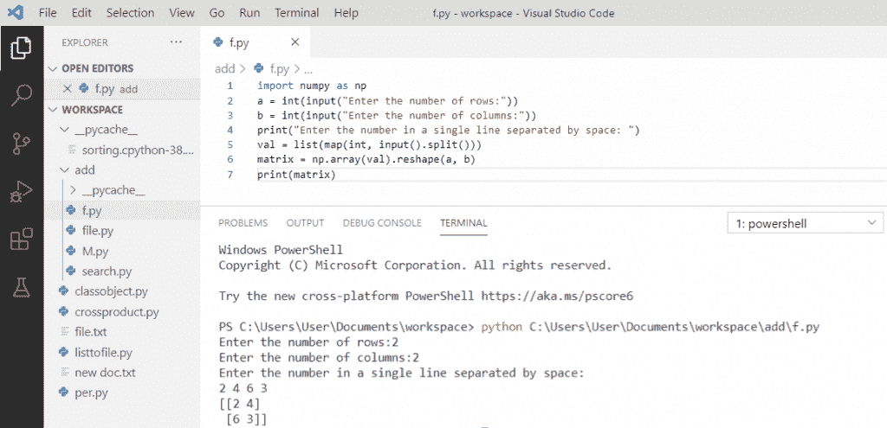
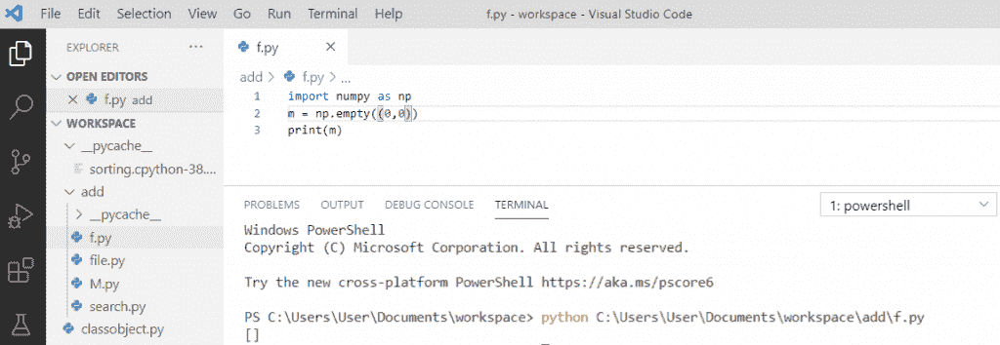
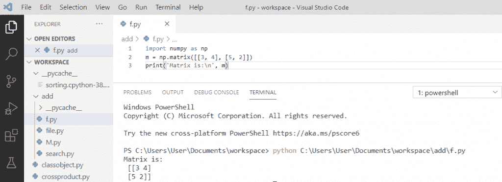
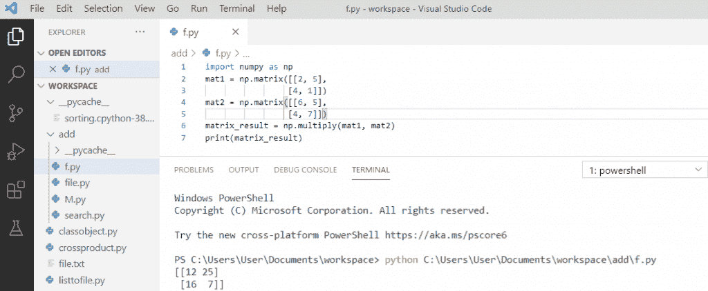
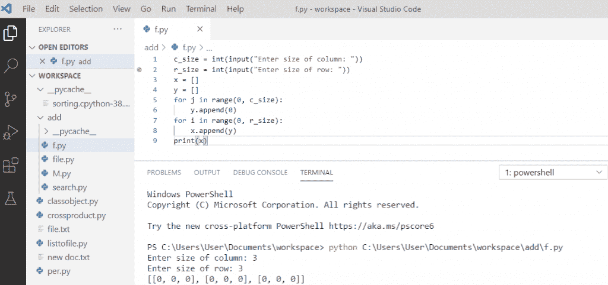
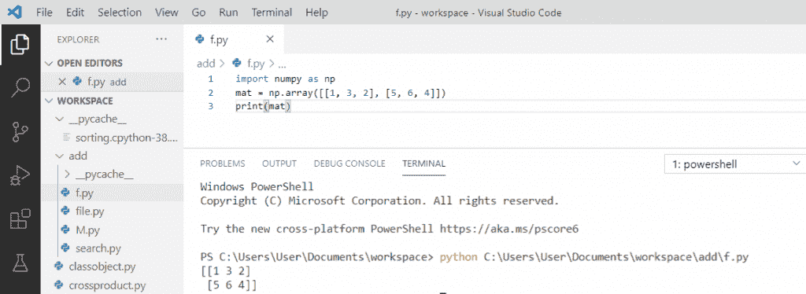
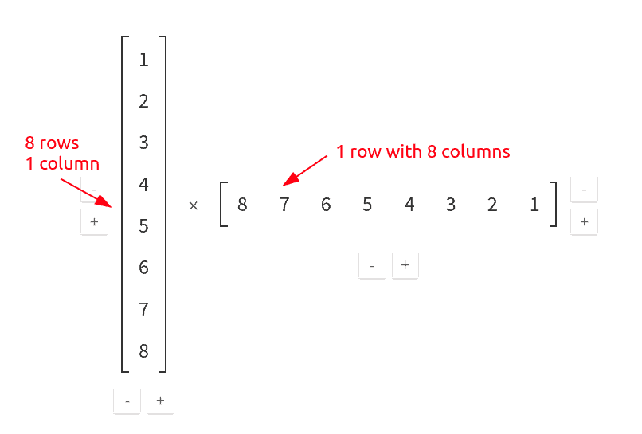
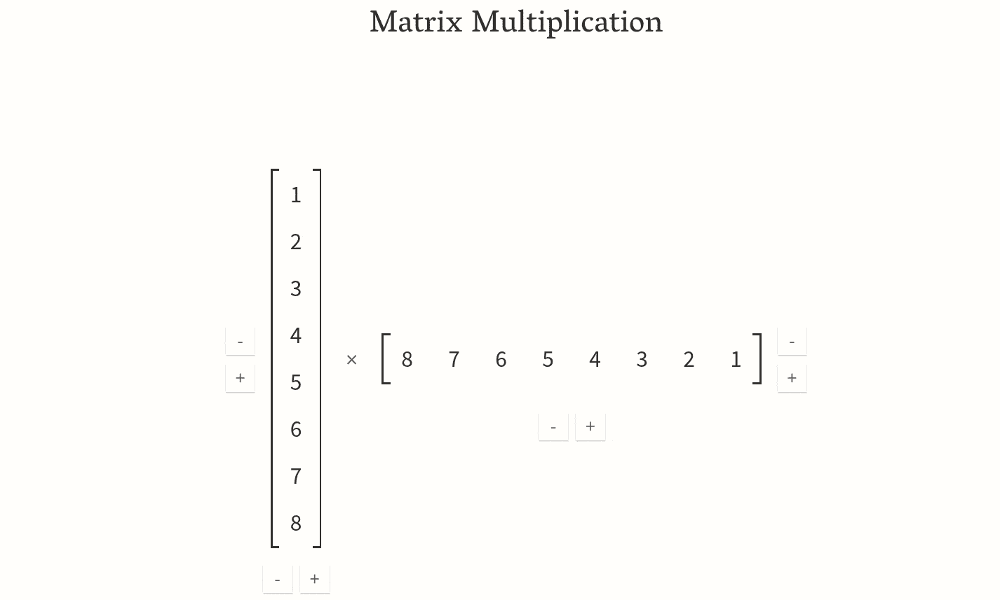

# 如何用 Python 制作矩阵

> 原文：<https://pythonguides.com/make-a-matrix-in-python/>

[](https://sharepointsky.teachable.com/p/python-and-machine-learning-training-course)

在本 [Python 教程](https://pythonguides.com/python-gui-programming/)中，我们将讨论**如何在 python** 中制作矩阵。此外，我们将看到以下主题:

*   python 中的**矩阵是什么？**
*   如何使用用户输入在 python 中创建矩阵
*   在 python 中使用 NumPy 创建一个空矩阵
*   如何在 python 3 中创建矩阵
*   如何用 python 做矩阵乘法
*   如何在 python 中使用 for 循环创建矩阵
*   如何使用列表在 Python 中创建矩阵
*   将 8 行 1 列的矩阵和 1 行 8 列的矩阵相乘得到 8 行。

目录

[](#)

*   [python 中的矩阵是什么？](#What_is_the_matrix_in_python "What is the matrix in python?")
*   [如何使用用户输入在 python 中创建矩阵](#How_to_create_a_matrix_in_python_using_user_input "How to create a matrix in python using user input")
*   [使用 python 中的 NumPy 创建一个空矩阵](#Create_an_empty_matrix_using_NumPy_in_python "Create an empty matrix using NumPy in python")
*   [如何在 python 3 中创建矩阵](#How_to_create_a_matrix_in_python_3 "How to create a matrix in python 3")
*   [如何用 python 做矩阵乘法](#How_to_do_matrix_multiplication_in_python "How to do matrix multiplication in python")
*   [如何在 python 中使用 for 循环创建矩阵](#How_to_create_a_matrix_using_for_loop_in_python "How to create a matrix using for loop in python")
*   [如何使用列表在 Python 中创建矩阵](#How_to_create_a_matrix_in_Python_using_a_list "How to create a matrix in Python using a list")
*   将一个 8 行 1 列的矩阵和一个 1 行 8 列的矩阵相乘得到一个 8 行的矩阵

## python 中的矩阵是什么？

*   一个 **Python 矩阵**是以行和列存储的数据的二维矩形数组。
*   矩阵中的水平项称为“行”，垂直项称为“列”。
*   如果一个矩阵有 r 行 c 列，那么矩阵的阶由`r x`c 给出。
*   存储在矩阵中的数据可以是字符串、数字等。
*   在矩阵中，数据被排列成行和列。
*   矩阵是数学和科学计算的重要数据结构。
*   Python 没有内置的矩阵类型，所以我们可以把一个列表当作一个矩阵。

> 你可能喜欢 [Python 中的](https://pythonguides.com/python-copy-file/)复制文件(示例)和 [Crosstab 熊猫](https://pythonguides.com/crosstab-in-python-pandas/)。

## 如何使用用户输入在 python 中创建矩阵

让我们看看**如何用 python** 创建矩阵:

*   在 Python 中，有一个流行的库叫做 `NumPy` 。
*   要使用 [NumPy](https://numpy.org) ，我们需要安装它。安装 NumPy 的命令是**‘pip install NumPy’**。
*   为了在代码中使用 NumPy，我们必须将其作为' **import NumPy as np'** 。
*   使用 `NumPy.matrix()` 函数创建矩阵。
*   我们将采取矩阵的用户输入，然后它会在输出中显示一个矩阵。

**举例:**

```py
import numpy as np
a = int(input("Enter the number of rows:"))
b = int(input("Enter the number of columns:"))
print("Enter the number in a single line separated by space:")
val = list(map(int, input().split()))
matrix = np.array(val).reshape(a,b)
print(matrix)
```

写完上面的代码(如何使用用户输入在 python 中创建一个矩阵)，一旦你将打印 `"matrix"` 那么输出将显示为 **"[[2 4] [6 3]] "** 。在这里， **np.array()。reshape()** 用于打印矩阵。

你可以参考下面的截图**如何使用用户输入**在 python 中创建矩阵。



How to create a matrix in python using user input

## 使用 python 中的 NumPy 创建一个空矩阵

在这里，我们将看到**如何在 python** 中使用 NumPy 创建一个空矩阵。

为了创建一个空矩阵，我们将首先**导入 NumPy 作为 np** ，然后我们将使用 `np.empty()` 来创建一个空矩阵。

**举例:**

```py
import numpy as np
m = np.empty((0,0))
print(m)
```

在编写完上面的代码(在 python 中使用 NumPy 创建一个空矩阵)之后，一旦打印出 `"m"` ，那么输出将显示为 **" [ ] "** 。这里，`NP . empty()`0 行 0 列的矩阵用于在 python 中创建空矩阵。

可以参考下面截图**用 python** 中的 NumPy 创建一个空矩阵。



Create an empty matrix using NumPy in python

## 如何在 python 3 中创建矩阵

我们将**首先将 numpy 作为 np** 导入，然后使用 `numpy.matrix()` 创建一个矩阵。这样就可以用 python 创建一个矩阵。

**举例:**

```py
import numpy as np
m = np.matrix([[3, 4], [5, 2]])
print('Matrix is:\n', m)
```

写完上面的代码(如何在 python 3 中创建一个矩阵)，一旦你将打印出 `"m"` 那么输出就会出现为 **"[[3 4] [5 2]] "** 。这里， `np.matrix()` 用于打印矩阵，它将返回矩阵。

可以参考下面截图**如何在 python 3** 中创建矩阵。



How to create a matrix in python 3

## 如何用 python 做矩阵乘法

**矩阵乘法**是以两个矩阵作为输入的运算。为了获得元素级乘法，我们可以使用 `np.multiply()` 函数。

**举例:**

```py
import numpy as np
mat1 = np.matrix([[2, 5],[4, 1]])
mat2 = np.matrix([[6, 5],[4, 7]])
matrix_result = np.multiply(mat1, mat2)
print(matrix_result)
```

写完上面的代码(python 中如何做矩阵乘法)，一旦你将打印出 `"matrix_result"` 那么输出会出现一个 **"[[12 25] [16 7]]"。**这里， `np.multiply()` 用于两个矩阵相乘，相乘后会产生一个矩阵。

你可以参考下面的截图如何用 python 做矩阵乘法。



How to do matrix multiplication in python

## 如何在 python 中使用 for 循环创建矩阵

让我们看看**如何在 python** 中使用 for 循环创建矩阵。

为了使用 For 循环创建矩阵，我们需要接受用户输入。矩阵由创建并分配给列和行的列表组成，for 循环用于行和列。

**举例:**

```py
c_size = int(input("Enter size of column: "))
r_size = int(input("Enter size of row: "))
x = []
y = []
for j in range(0, c_size):
    y.append(0)
for i in range(0, r_size):
    x.append(y)
print(x)
```

写完上面的代码(如何在 python 中使用 for 循环创建一个矩阵)，一旦你将打印 `"x"` 那么输出将显示为 **"[[0，0，0]，[0，0，0]，[0，0，0]]"。**在这里，用户将输入行和列的大小，它将把列附加到每一行。矩阵将作为输出打印出来。

可以参考下面截图如何在 python 中使用 for 循环**创建矩阵。**



How to create a matrix using for loop in python

## 如何使用列表在 Python 中创建矩阵

让我们看看**如何使用列表**在 Python 中创建矩阵？

我们可以使用嵌套列表在 Python 中创建一个矩阵。首先我们将**导入 NumPy** ，然后我们可以使用列表使用 `np.array()` ，它将以矩阵的形式给出输出。

**举例:**

```py
import numpy as np
mat = np.array([[1, 3, 2], [5, 6, 4]])
print(mat)
```

写完上面的代码(如何使用列表在 Python 中创建一个矩阵)，一旦你将打印**“mat”**那么输出将显示为**“[[1 3 2][5 6 4]]”。**这里，np.array()用于使用列表创建矩阵，它将给出矩阵作为输出。

你可以参考下面关于如何使用列表在 Python 中**创建矩阵的截图**



How to create a matrix in Python using a list

## 将一个 8 行 1 列的矩阵和一个 1 行 8 列的矩阵相乘得到一个 8 行的矩阵

在本节中，我们将学习如何将一个 8 行 1 列的矩阵和一个 1 行 8 列的矩阵相乘得到一个 8 行的矩阵。这是这个主题的图示。



matrix multiplication in python

*   在上图中，我们有 8 行 1 列，我们必须乘以 1 行 8 列。
*   矩阵乘法的主要规则是“第一个矩阵中的行数必须等于第二个矩阵中的列数”，在这种情况下，该规则得到满足，因此我们现在可以继续乘法。
*   第一个矩阵的每个元素将与第二个矩阵的每个元素相乘。下面是 Python 中矩阵乘法的图解。



Matrix Multiplication in Python

*   Python 中实现矩阵乘法主要有 3 种方式。
    *   `numpy.dot()` 方法
    *   在 2 个矩阵上使用 **@** 运算符。
    *   Tensorflow 中的 `tf.matmul()` 方法

*   Numpy 点法用于求两个数组的乘积。
*   数组和矩阵之间只有一线之差。因此，如果您在用其他两种方法执行乘法时看到错误，那么尝试`numpy.dot()` 方法。这会给你正确的结果，没有任何错误。
*   下面是在 Python 中使用 `numpy.dot()`方法的语法。

```py
import numpy as np

np.dot(matrix1, matrix2)
```

*   这里，矩阵 1 和矩阵 2 是彼此相乘的矩阵。我们没有在语法中创建它们，但是它们在下面的例子中是可用的。
*   另一种解决方案是在 Python 中使用' **@** '运算符。 **@** '运算符在 Python 中用作矩阵乘法的符号。
*   请注意，它只对矩阵有效，对数组无效。
*   下面是在 Python 中使用 **@** 进行矩阵乘法的语法。

```py
matrix1 @ matrix2
```

*   第三种解决方案是使用张量流。Tensorflow 是与 Python 和 R 一起使用的高级工具，用于高级计算。
*   它有各种内置模块，可以加速复杂算法的计算。
*   如果您正在处理大型矩阵，那么您可以使用 python tensorflow 中的 tensorflow 模块 `tf.matmul()` 来减少计算时间。
*   以下是使用 Python Tensorflow 执行矩阵乘法的语法

```py
import tensorflow as tf

tf.matmul(matrix1, matrix2)
```

下面是 1 行 8 列和 8 行 1 列的矩阵乘法在 Python Jupyter 笔记本上的实现。