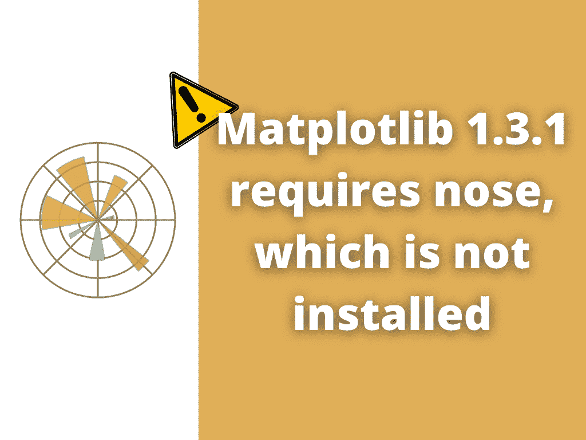

# Matplotlib 1.3.1 需要未安装的 nose

> 原文：<https://pythonguides.com/matplotlib-1-3-1-requires-nose-which-is-not-installed/>

[](https://sharepointsky.teachable.com/p/python-and-machine-learning-training-course)

在本 [Python 教程](https://pythonguides.com/learn-python/)中，我们将讨论错误“ **matplotlib 1.3.1 需要 nose 而 matplotlib 中` `未安装”**。在这里，我们将使用 [matplotlib](https://pythonguides.com/what-is-matplotlib/) 涵盖与此错误相关的不同原因。我们将讨论以下主题:

*   错误:matplotlib 1.3.1 需要 nose，但没有安装
*   解决方案:matplotlib 1.3.1 需要未安装的 nose



Matplotlib Error

目录

[](#)

*   [错误:matplotlib 1.3.1 需要 nose，但没有安装](#Error_matplotlib_131_requires_nose_which_is_not_installed "Error: matplotlib 1.3.1 requires nose which is not installed ")
*   [解决方案:matplotlib 1.3.1 需要 nose，但没有安装](#Solution_matplotlib_131_requires_nose_which_is_not_installed "Solution: matplotlib 1.3.1 requires nose which is not installed ")

## 错误:matplotlib 1.3.1 需要 nose，但没有安装

这里我们要讨论的错误: **matplotlib 1.3.1 需要` `nose 而 python 中没有安装**。所以在这里，你会在这里得到所有可能的原因和解决方法。

nose 是一个流行的 Python 测试自动化框架，它扩展了单元测试来帮助测试。使用 Nose 框架的其他优势包括自动定位测试用例并收集文档的能力。

nose 框架有大量插件，用于测试执行、多重处理测试、日志和报告。

此外，检查:[模块' matplotlib '没有属性' plot'](https://pythonguides.com/module-matplotlib-has-no-attribute-plot/)

## 解决方案:matplotlib 1.3.1 需要 nose，但没有安装

**matplotlib 1.3.1 的解决方案需要未安装的 nose**matplotlib 中的错误是在您的系统中安装 nose。

在大多数类似 UNIX 的平台上，你可能需要以 root 用户身份运行这些命令。

*   使用 setuptools / distribute 安装 nose:

```py
sudo easy_install nose
```

*   使用 pip 安装鼻部:

```py
pip install nose
```

*   如果没有安装 setuptools/distribute，可以从下载链接下载源码包并安装。

[Download Nose Source Package](https://pypi.org/project/nose/1.3.7/#files)

下载并安装后，执行以下步骤:

*   解压缩源文件包
*   cd 到新目录
*   写下下面给出的命令

```py
python setup.py install
```

这将安装 nose 库和 nose 测试脚本，它们可用于自动查找和运行测试。

> **注:**
> 
> 除非安装了 setuptools/distribute，否则您将无法使用第三方 nose 插件。

你可能也喜欢阅读下面的 Matplotlib 教程。

*   [Matplotlib 散点图颜色](https://pythonguides.com/matplotlib-scatter-plot-color/)
*   [Matplotlib 饼图教程](https://pythonguides.com/matplotlib-pie-chart/)
*   [Matplotlib Plot NumPy 数组](https://pythonguides.com/matplotlib-plot-numpy-array/)
*   [Matplotlib 散点图图例](https://pythonguides.com/matplotlib-scatter-plot-legend/)

在本 Python 教程中，我们已经讨论了" **matplotlib 1.3.1 需要 nose，而 nose 是` `未安装**"我们还讨论了与之相关的原因和解决方案。这些是我们在本教程中讨论过的以下主题。

*   错误:matplotlib 1.3.1 需要 nose，但没有安装
*   解决方案:matplotlib 1.3.1 需要未安装的 nose

[Bijay Kumar](https://pythonguides.com/author/fewlines4biju/)

Python 是美国最流行的语言之一。我从事 Python 工作已经有很长时间了，我在与 Tkinter、Pandas、NumPy、Turtle、Django、Matplotlib、Tensorflow、Scipy、Scikit-Learn 等各种库合作方面拥有专业知识。我有与美国、加拿大、英国、澳大利亚、新西兰等国家的各种客户合作的经验。查看我的个人资料。

[enjoysharepoint.com/](https://enjoysharepoint.com/)[](https://www.facebook.com/fewlines4biju "Facebook")[](https://www.linkedin.com/in/fewlines4biju/ "Linkedin")[](https://twitter.com/fewlines4biju "Twitter")