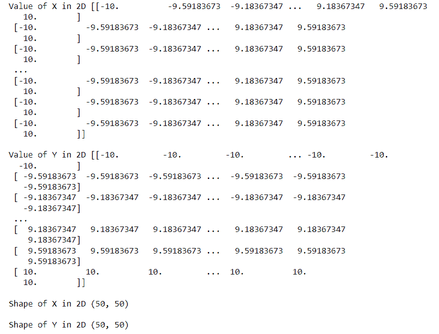
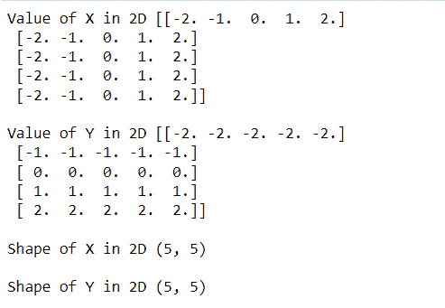
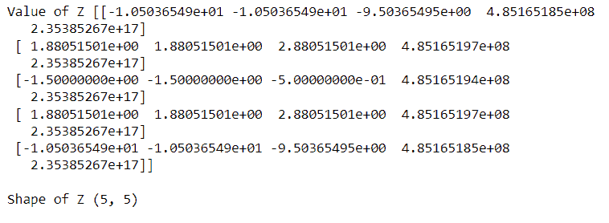
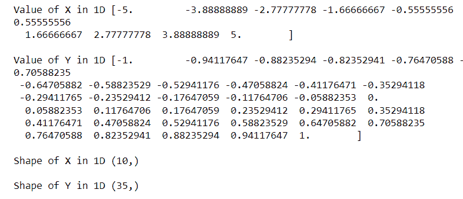

# Matplotlib 二维表面图

> 原文：<https://pythonguides.com/matplotlib-2d-surface-plot/>

[](https://sharepointsky.teachable.com/p/python-and-machine-learning-training-course)

在本 [Python Matplotlib 教程](https://pythonguides.com/what-is-matplotlib/)中，我们将讨论 **Matplotlib 2d 表面绘图**。在这里，我们将介绍与使用 matplotlib 的 2d 表面绘图相关的不同示例。我们还将讨论以下主题:

*   Matplotlib 二维表面图
*   Matplotlib 二维轮廓打印
*   Matplotlib 二维彩色表面图

目录

[](#)

*   [Matplotlib 2d 表面图](#Matplotlib_2d_surface_plot "Matplotlib 2d surface plot")
*   [Matplotlib 2d 轮廓图](#Matplotlib_2d_contour_plot "Matplotlib 2d contour plot")
*   [Matplotlib 2d 彩色表面图](#Matplotlib_2d_color_surface_plot "Matplotlib 2d color surface plot")

## Matplotlib 2d 表面图

在 1.0 版本发布之前，matplotlib 仅用于二维绘图。但是在 1.0 版之后，您可以在 2d 工具的基础上开发 3d 工具。导入 `mplot3d` 包启用 3d 绘图。

表面图是三维数据集的表示。为了创建一个表面图，我们**导入 Matplotlib 的 mpl_toolkits.mplot3d** 工具包，该工具包具有创建一个 3d 表面图的功能。

**创建表面图的语法:**

```py
ax.plot_surface(X, Y, Z)
```

这里我们的主要动机是使用 matplotlib 生成二维数据，并用三维效果(即表面)绘制它。

**我们来看一个与此相关的例子:**

*   这里我们需要 `x` 和 `y` 的值，从 x 和 y 我们计算出 `z` 的值叫做身高。
*   然后我们使用 `z` 在地图上绘制 x 轴和 y 轴，使用**表面绘制**来获得 3D 效果。
*   我们使用 numpy 的 `linspace` 方法将 `x` 和 `y` 的值放在一个**一维**数组中，然后我们需要将它们转换成一个**二维**数组，所以我们使用 numpy 的 `meshgrid` 函数。

**源代码:**

```py
**# Import Library**

import numpy as np

**# 1D array** 
x = np.linspace(-10,10,50)
y = np.linspace(-10,10,50)

**# Print Values**

print('Value of X in 1D', x,'\n')
print ('Value of Y in 1D',y,'\n')

**# Print Shapes** 
print('Shape of X in 1D',x.shape,'\n')
print('Shape of Y in 1D',y.shape,'\n')
```


Value and Shape of 1D Array

```py
**# Convert 1D Array to 2D Array** 
x_2d, y_2d = np.meshgrid(x,y)

**# Print Values** 
print('Value of X in 2D', x_2d,'\n')
print ('Value of Y in 2D',y_2d,'\n')

**# Print Shapes**

print('Shape of X in 2D',x_2d.shape,'\n')
print('Shape of Y in 2D',y_2d.shape,'\n')
```



Values and Shapes of 2D Array

```py
**# Compute Z**

z = np.exp(np.cos(5*xx)-np.sin(5*yy))-0.5

**# Print Value**

print('Value of Z', z,'\n')

**# Print Shape**

print('Shape of Z',z.shape,'\n')
```


Compute Z

*   从 mpl_toolkits.mplot3d 导入 Axes3D 库导入**。**
*   导入 `matplotlib.pyplot` 库。
*   使用 `plt.figure()` 函数和 `figsize()` 方法生成并设置图形的大小。
*   通过定义 axes object =`add _ subplot()`将投影设置为 3d。
*   使用 `plot_surface()` 函数绘制表面。
*   分别使用 `set_xlabel()` 、 `set_ylabel` ()、 `set_zlabel()` 函数设置 x、y、z 轴的轴标签。
*   要显示该图，请使用 `show()` 函数。

```py
**# Import Libraries**

from mpl_toolkits.mplot3d import Axes3D
import matplotlib.pyplot as plt
import matplotlib.cm as cm

**# 3D Projection**

fig = plt.figure(figsize=(6,5))
ax = fig.add_subplot(111, projection='3d')

**# Surface Plot**

ax.plot_surface(x_2d, y_2d, z, cmap=cm.jet)

**# Labels**

ax.set_xlabel('X-Axis')
ax.set_ylabel('Y-Axis')
ax.set_zlabel('Z-Axis')

**# Display**

plt.show()
```


Surface Plot

**我们再来看一个例子:**

```py
**# Import Library**

import numpy as np

**# 1D array** 
x = np.linspace(-2,2,5)
y = np.linspace(-2,2,5)

**# Print Values**

print('Value of X in 1D', x,'\n')
print ('Value of Y in 1D',y,'\n')

**# Print Shapes** 
print('Shape of X in 1D',x.shape,'\n')
print('Shape of Y in 1D',y.shape,'\n')

**# Convert 1D Array to 2D Array** 
x_2d, y_2d = np.meshgrid(x,y)

**# Print Values**

print('Value of X in 2D', x_2d,'\n')
print ('Value of Y in 2D',y_2d,'\n')

**# Print Shapes** 
print('Shape of X in 2D',x_2d.shape,'\n')
print('Shape of Y in 2D',y_2d.shape,'\n')

**# Compute Z**

z = (np.exp(20*x_2d)-np.tan(5*y_2d**4))-1.5

**# Print Value**

print('Value of Z', z,'\n')

**# Print Shape** 
print('Shape of Z',z.shape,'\n') 
```


1D Array



2D Array



Compute Z

```py
**# Import Libraries** 
from mpl_toolkits.mplot3d import Axes3D
import matplotlib.pyplot as plt
import matplotlib.cm as cm

**# 3D Projection** 
fig = plt.figure(figsize=(6,5))
ax = fig.add_subplot(111, projection='3d')

**# Surface Plot** 
ax.plot_surface(x_2d, y_2d,z, cmap=cm.flag)

**# Labels** 
ax.set_xlabel('X-Axis')
ax.set_ylabel('Y-Axis')
ax.set_zlabel('Z-Axis')

**# Display**

plt.show()
```


surface_plot()

此外，请查看[Matplotlib xlim–完整指南](https://pythonguides.com/matplotlib-xlim/)

## Matplotlib 2d 轮廓图

等值线图，也称为水平图，是一种多元分析工具，允许您在二维空间中可视化三维图。当我们将 X 和 Y 作为变量绘制时，响应 Z 显示为 X-Y 平面上的切片，这就是为什么等高线有时被称为 Z 切片。

**等高线图的使用:**

等高线图通常用于气象部门来说明密度、海拔或山的高度。

**创建等高线图:**

在 matplotlib 中， `matplotlib.pyplot` 包含了一个方法 `contour` ，由于它的广泛使用，使得构造等值线图变得容易。

**语法:**

```py
matplotlib.pyplot.contour([x, y, ] z, [levels], **kwargs)
```

**参数如下:**

*   **x 和 y:** 指定用于绘图的 2D 或 1D 数字阵列。
*   **z:** 指定绘制轮廓的高度。
*   **层次:**确定轮廓线的数量和位置。

**我们来看一个例子:**

*   我们使用 numpy 的 `array` 方法将 `x` 和 `y` 的值放在一个**一维**数组中，然后我们需要将它们转换成一个**二维**数组，所以我们使用 numpy 的 `meshgrid` 函数。
*   从 mpl_toolkits.mplot3d 导入 Axes3D 库导入**。**
*   导入 `matplotlib.pyplot` 库。
*   导入 `numpy` 库。
*   使用 `plt.figure()` 函数和 `figsize()` 方法生成并设置图形的大小。
*   通过定义 axes object =`add _ subplot()`将投影设置为 3d。
*   使用 `contour()` 功能绘制等高线。
*   分别使用 `set_xlabel()` 、 `set_ylabel` ()、 `set_zlabel()` 函数设置 x、y、z 轴的轴标签。
*   要显示该图，请使用 `show()` 函数。


1D Array


2D Array


Compute Z


Contour Plot

**我们再来看一个例子:**

```py
**# Import Library**

import numpy as np

**# 1D array**

x = np.linspace(-2,2,10)
y = np.linspace(-3,3,15)

**# Print Values** 
print('Value of X in 1D', x,'\n')
print ('Value of Y in 1D',y,'\n')

**# Print Shapes**

print('Shape of X in 1D',x.shape,'\n')
print('Shape of Y in 1D',y.shape,'\n')
```

*   我们使用 numpy 的 `array` 方法获取一维数组中的 x 和 y 值，然后使用 numpy 的 `meshgrid` 函数将其转换为二维数组。


1D Array

```py
**# Convert 1D Array to 2D Array**

x_2d, y_2d = np.meshgrid(x,y)

**# Print Values**

print('Value of X in 2D', x_2d,'\n')
print ('Value of Y in 2D',y_2d,'\n')

**# Print Shapes**

print('Shape of X in 2D',x_2d.shape,'\n')
print('Shape of Y in 2D',y_2d.shape,'\n')
```


2D Array

*   然后我们用 z 轴在地图上画出 x 轴和 y 轴的等高线图。

```py
**# Compute z** 
z = np.exp(np.cos(4*x_2d)`2-np.sin(5*y_2d)`2)-0.8

**# Print Values**

print('Value of Z', z,'\n')

**# Print Shape**

print('Shape of Z',z.shape,'\n')
```

*   汇入`matplot lib . pyplot`程式库
*   要绘制等高线图，使用 `contour()` 功能。
*   要添加 x 轴标签，请使用 `xlabel()` 函数。
*   要添加 y 轴标签，请使用 `ylabel()` 函数。
*   要显示图形，使用 `show()` 功能。


plt.contour()

阅读: [Matplotlib 3D 散点图](https://pythonguides.com/matplotlib-3d-scatter/)

## Matplotlib 2d 彩色表面图

Matplotlib 库的 pyplot 模块的 `pcolor()` 方法用于创建带有不规则矩形网格的伪彩色图。

**语法如下:**

```py
matplotlib.pyplot.pcolor(*args, alpha=None, norm=None, 
                         cmap=None, vmin=None, vmax=None, 
                         data=None, **kwargs)
```

**我们来看一个例子:**

*   这里我们需要 x 和 y 的值，从 x 和 y 我们计算出 z 的值叫做高度。
*   然后我们使用 `z` 使用**颜色图**在一张带有 x 轴和 y 轴的地图上绘图。

```py
**# Import Library**

import numpy as np

**# 1D array**

x = np.linspace(-2,2,10)
y = np.linspace(-3,3,15)

**# Print Values**

print('Value of X in 1D', x,'\n')
print ('Value of Y in 1D',y,'\n')

**# Print Shapes**

print('Shape of X in 1D',x.shape,'\n')
print('Shape of Y in 1D',y.shape,'\n')
```


1D Array

*   我们使用 numpy 的 `linspace` 方法将 `x` 和 `y` 的值放在一个**一维**数组中，然后我们需要将它们转换成一个**二维**数组，所以我们使用 numpy 的 `meshgrid` 函数。


2D Array

```py
**# Compute z**

z = np.exp(np.sin(4*x_2d+y_2d)**2)-2.5

**# Print Value**

print('Value of Z', z,'\n')

**# Print Shape**

print('Shape of Z',z.shape,'\n')
```


Compute Z

*   汇入`matplot lib . pyplot`程式库。
*   要绘制 2d 彩色表面图，使用 `pcolor()` 函数。
*   将 `edgecolor` 和**线宽**分别设置为**黑色**和 `2` 。
*   要添加 x 轴标签，请使用 `xlabel()` 函数。
*   要添加 y 轴标签，请使用 `ylabel()` 函数。
*   要显示图形，使用 `show()` 功能。

```py
**# Import Library**

import matplotlib.pyplot as plt

**# Color Plot**

plt.pcolor(x, y, z, edgecolors='k', linewidths=2)

**# Labels**

plt.xlabel('X-Axis')
plt.ylabel('Y-Axis')

**# Show**

plt.show()
```


plt.pcolor()

**我们再来看一个例子:**

*   这里我们需要 x 和 y 的值，从 x 和 y 我们计算出 z 的值叫做高度。
*   我们使用 numpy 的 `linspace` 方法将 x 和 y 值转换成一维数组，然后我们使用 numpy 的 `meshgrid` 函数将它们转换成二维数组。
*   将 `matplotlib.pyplot` 库导入到项目中。
*   使用 `pcolor()` 方法创建一个二维彩色表面图。
*   将**线宽**和**边缘颜色**分别设置为 2 和黑色。
*   使用 `xlabel()` 函数添加 x 轴标签。
*   使用 `ylabel()` 函数添加一个 y 轴标签。
*   使用 `show()` 功能显示图形。

**源代码:**

```py
**# Import Library** 
import numpy as np

**# 1D array**

x = np.linspace(-5,5,10)
y = np.linspace(-1,1,35)

**# Print Values**

print('Value of X in 1D', x,'\n')
print ('Value of Y in 1D',y,'\n')

**# Print Shapes** 
print('Shape of X in 1D',x.shape,'\n')
print('Shape of Y in 1D',y.shape,'\n')
```



1D Array

```py
**# Convert 1D Array to 2D Array**

x_2d, y_2d = np.meshgrid(x,y)

**# Print Values** 
print('Value of X in 2D', x_2d,'\n')
print ('Value of Y in 2D',y_2d,'\n')

**# Print Shapes**

print('Shape of X in 2D',x_2d.shape,'\n')
print('Shape of Y in 2D',y_2d.shape,'\n')
```


2D Array

```py
**# Compute z** 
z = (x_2d`4+y_2d`6)+2

**# Print Value**

print('Value of Z', z,'\n')

**# Print Shape** 
print('Shape of Z',z.shape,'\n')
```


Compute Z

```py
**# Import Library**

import matplotlib.pyplot as plt

**# Color Plot**

plt.pcolor(x, y, z, edgecolors='k', linewidths=2)

**# Labels**

plt.xlabel('X-Axis')
plt.ylabel('Y-Axis')

**# Show**

plt.show()
```


plt.pcolor()

你可能也喜欢阅读下面的 Matplotlib 教程。

*   [堆积条形图 Matplotlib](https://pythonguides.com/stacked-bar-chart-matplotlib/)
*   [Matplotlib 散点图图例](https://pythonguides.com/matplotlib-scatter-plot-legend/)
*   [Matplotlib 增加地块大小](https://pythonguides.com/matplotlib-increase-plot-size/)
*   [Matplotlib legend font size](https://pythonguides.com/matplotlib-legend-font-size/)
*   [Matplotlib tight_layout](https://pythonguides.com/matplotlib-tight-layout/)
*   [什么是 add_axes matplotlib](https://pythonguides.com/add_axes-matplotlib/)
*   [画垂直线 matplotlib](https://pythonguides.com/draw-vertical-line-matplotlib/)

在本 Python 教程中，我们已经讨论了" **Matplotlib 2d 表面绘图**"并且我们还介绍了一些与之相关的例子。这些是我们在本教程中讨论过的以下主题。

*   Matplotlib 二维表面图
*   Matplotlib 二维轮廓打印
*   Matplotlib 二维彩色表面图

[Bijay Kumar](https://pythonguides.com/author/fewlines4biju/)

Python 是美国最流行的语言之一。我从事 Python 工作已经有很长时间了，我在与 Tkinter、Pandas、NumPy、Turtle、Django、Matplotlib、Tensorflow、Scipy、Scikit-Learn 等各种库合作方面拥有专业知识。我有与美国、加拿大、英国、澳大利亚、新西兰等国家的各种客户合作的经验。查看我的个人资料。

[enjoysharepoint.com/](https://enjoysharepoint.com/)[](https://www.facebook.com/fewlines4biju "Facebook")[](https://www.linkedin.com/in/fewlines4biju/ "Linkedin")[](https://twitter.com/fewlines4biju "Twitter")