# Matplotlib 3D 散点图

> 原文：<https://pythonguides.com/matplotlib-3d-scatter/>

[](https://sharepointsky.teachable.com/p/python-and-machine-learning-training-course)

在本 [Python 教程](https://pythonguides.com/learn-python/)中，我们将讨论 Python 中的 **Matplotlib 3D 散点**。在这里，我们将使用 [matplotlib](https://pythonguides.com/what-is-matplotlib/) 讲述与 3D 散射相关的不同示例。我们还将讨论以下主题:

*   Matplotlib 3D scatter plot
*   Matplotlib 3D 散点图示例
*   Matplotlib 3D 散布颜色
*   带颜色条的 Matplotlib 3D 散点图
*   Matplotlib 3D 散点图标记大小
*   Matplotlib 3D 散点图标签
*   Matplotlib 3D 散点图图例
*   Matplotlib 3D 散点图按值显示颜色
*   Matplotlib 3D 散布旋转
*   Matplotlib 3D 散点图更改视角
*   Matplotlib 3D 散点图标题
*   Matplotlib 3D 散布文本
*   带线条的 Matplotlib 3D 散点图
*   带表面的 Matplotlib 3D 散点图
*   Matplotlib 三维抖动透明度
*   matplot lib 3d sactor depthshade
*   Matplotlib 3D 散点图轴限制
*   Matplotlib 三维散点图坐标轴刻度
*   Matplotlib 3D 散点图大小
*   Matplotlib 3D 散点图网格
*   Matplotlib 3D 散点子图
*   Matplotlib 3D 散点保存
*   Matplotlib 3D 散布背景颜色
*   Matplotlib 3D 散点图数组
*   Matplotlib 3D 散点图标记颜色
*   matplot lib 3d scatter zlem
*   Matplotlib 3D scatter z label
*   Matplotlib 3D scatter xlim
*   Matplotlib 3D scatter zoom
*   Matplotlib 3D 散布原点
*   Matplotlib 3D 散点图对数标度
*   Matplotlib 3D scatter dataframe
*   Matplotlib 3D 散布动画

目录

[](#)

*   [Matplotlib 3D 散点图](#Matplotlib_3D_scatter_plot "Matplotlib 3D scatter plot")
*   [Matplotlib 3D 散点图示例](#Matplotlib_3D_scatter_plot_example "Matplotlib 3D scatter plot example")
*   [Matplotlib 3D 散布颜色](#Matplotlib_3D_scatter_color "Matplotlib 3D scatter color")
*   [带彩条的 Matplotlib 3D 散点图](#Matplotlib_3D_scatter_with_colorbar "Matplotlib 3D scatter with colorbar")
*   [Matplotlib 3D 散点图标记尺寸](#Matplotlib_3D_scatter_marker_size "Matplotlib 3D scatter marker size")
*   [Matplotlib 3D scatter label](#Matplotlib_3D_scatter_label "Matplotlib 3D scatter label")
*   [Matplotlib 3D 散点图图例](#Matplotlib_3D_scatter_legend "Matplotlib 3D scatter legend")
*   [Matplotlib 3D 散点图颜色值](#Matplotlib_3D_scatter_plot_color_by_value "Matplotlib 3D scatter plot color by value")
*   [Matplotlib 3D 散点旋转](#Matplotlib_3D_scatter_rotate "Matplotlib 3D scatter rotate")
*   [Matplotlib 3D 散点变化视角](#Matplotlib_3D_scatter_change_view_angle "Matplotlib 3D scatter change view angle")
*   [Matplotlib 3D 散点图标题](#Matplotlib_3D_scatter_title "Matplotlib 3D scatter title")
*   [Matplotlib 3D 散点图文本](#Matplotlib_3D_scatter_text "Matplotlib 3D scatter text")
*   [Matplotlib 3D 散点图，带线条](#Matplotlib_3D_scatter_with_line "Matplotlib 3D scatter with line")
*   [Matplotlib 3D 散点图与表面](#Matplotlib_3D_scatter_with_surface "Matplotlib 3D scatter with surface")
*   [Matplotlib 3D 散射透明度](#Matplotlib_3D_scatter_transparency "Matplotlib 3D scatter transparency")
*   [matplot lib 3d sactor depthshade](#Matplotlib_3D_sactter_depthshade "Matplotlib 3D sactter depthshade")
*   [Matplotlib 3D 散点图轴限制](#Matplotlib_3D_scatter_axis_limit "Matplotlib 3D scatter axis limit")
*   [Matplotlib 3D 散点图轴刻度](#Matplotlib_3D_scatter_axis_ticks "Matplotlib 3D scatter axis ticks")
*   [Matplotlib 3D 散点图尺寸](#Matplotlib_3D_scatter_size "Matplotlib 3D scatter size")
    *   [通过使用 plt.figure()方法](#By_using_pltfigure_method "By using plt.figure() method")
    *   [通过使用 set_size_inches()方法](#By_using_set_size_inches_method "By using set_size_inches() method")
*   [Matplotlib 3D 散点图网格](#Matplotlib_3D_scatter_grid "Matplotlib 3D scatter grid")
*   [Matplotlib 3D 散点子图](#Matplotlib_3D_scatter_subplot "Matplotlib 3D scatter subplot")
*   [Matplotlib 3D 散点保存](#Matplotlib_3D_scatter_save "Matplotlib 3D scatter save")
*   [Matplotlib 3D 散点背景色](#Matplotlib_3D_scatter_background_color "Matplotlib 3D scatter background color")
*   [matplot lib 3d scatter num array](#Matplotlib_3D_scatter_numpy_array "Matplotlib 3D scatter numpy array")
*   [Matplotlib 3D 散点标记颜色](#Matplotlib_3D_scatter_marker_color "Matplotlib 3D scatter marker color")
*   [Matplotlib 3D scatter zlim](#Matplotlib_3D_scatter_zlim "Matplotlib 3D scatter zlim")
*   [matplot lib 3d scatter zlabel](#Matplotlib_3D_scatter_zlabel "Matplotlib 3D scatter zlabel")
*   [Matplotlib 3d scatter xlim](#Matplotlib_3d_scatter_xlim "Matplotlib 3d scatter xlim")
*   [Matplotlib 3D scatter zoom](#Matplotlib_3D_scatter_zoom "Matplotlib 3D scatter zoom")
*   [Matplotlib 3D 散点原点](#Matplotlib_3D_scatter_origin "Matplotlib 3D scatter origin")
*   [Matplotlib 3D 散点图对数标度](#Matplotlib_3D_scatter_log_scale "Matplotlib 3D scatter log scale")
*   [matplot lib 3d scatter data frame](#Matplotlib_3D_scatter_Dataframe "Matplotlib 3D scatter Dataframe")
*   [Matplotlib 3D 散点动画](#Matplotlib_3D_scatter_animation "Matplotlib 3D scatter animation")

## Matplotlib 3D 散点图

在本节中，我们将学习如何在 Python 中的 matplotlib 中绘制 3D 散点图**图**。在开始这个话题之前，我们首先要明白 `3D` 和**散点图**是什么意思:

> " `3D` 代表**三维**"
> 
> 现实世界中的任何三维物体都称为 3D 物体。具有**三维**即**高度**、**宽度**和**深度**。

> **散点图**是使用**点**沿轴绘制变量值的图形。

3D 散点图是一种数学图表，用于使用笛卡尔坐标将数据属性显示为三个变量。在 matplotlib 中创建 3D 散点图，我们必须导入 `mplot3d` **工具包**。

`matplotlib` 库的 `scatter3D()` 函数接受 `X` 、 `Y` 和 `Z` 数据集，用于构建 3D 散点图。

**以下步骤用于绘制 3D 散点图，概述如下:**

*   **定义库:**导入绘制 3D 图形所需的最重要的库 `mplot3d toolkit` ，还导入数据创建和操作所需的其他库 `numpy` 和 `pandas` ，用于数据可视化:matplotlib 中的 `pyplot` 。
*   **定义 X 和 Y** :定义用于 X 轴和 Y 轴数据绘图的数据坐标值。
*   **绘制 3D 散点图:**通过使用 matplotlib 库的 `scatter3D()` 方法，我们可以绘制 3D 散点图。
*   **可视化绘图:**通过使用 `show()` 方法，用户可以在他们的屏幕上生成一个绘图。

## Matplotlib 3D 散点图示例

```py
**# Import Library** 
from mpl_toolkits import mplot3d

**# Function to create 3D scatter plot**

matplotlib.axes.Axis.scatter3D(x, y, z)
```

这里的 `x` 、 `y` 、 `z` 代表了地块的三维。

**让我们看一个例子来更清楚地理解这个概念:**

```py
**# Import libraries**

from mpl_toolkits import mplot3d
import numpy as np
import matplotlib.pyplot as plt

**# Define Data** 
x = np.arange(0, 20, 0.2)
y = np.sin(x)
z = np.cos(x)

**# Create Figure** 
fig = plt.figure(figsize = (10, 7))
ax = plt.axes(projection ="3d")

**# Create Plot**

ax.scatter3D(x, y, z)

**# Show plot** 
plt.show()
```

*   在上面的例子中，我们导入了 **mplot3d 工具包**、 `numpy` 和 `pyplot` 库。
*   接下来，我们使用 `arange()` 、 `sin()` 和 `cos()` 方法定义数据。
*   `plt.figure()` 方法用于设置图形大小这里我们将 `figsize` 作为参数传递， `plt.axes()` 方法用于设置轴，这里我们将**投影**作为参数传递。
*   `ax.scatter3D()` 方法用于创建三维散点图，这里我们传递 `x` 、 `y` 、 `z` 作为参数。
*   `plt.show()` 方法用于在用户屏幕上生成图形。

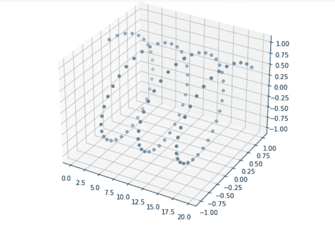

plt.scatter3D()

阅读: [Matplotlib plot_date](https://pythonguides.com/matplotlib-plot-date/)

## Matplotlib 3D 散布颜色

在本节中，我们将学习如何更改 3D 散点图的颜色。

**改变颜色的语法如下:**

```py
matplotlib.axes.Axis.scatter3D(x, y, z, color=None)
```

*   **x:** 指定轴的 x 坐标。
*   **y:** 指定轴的 y 坐标。
*   **z:** 指定轴的 z 坐标。
*   **颜色:**指定散点的颜色。

**让我们看一个改变 3D 散射颜色的例子:**

```py
**# Import libraries**

from mpl_toolkits import mplot3d
import numpy as np
import matplotlib.pyplot as plt

**# Define Data**

x = [2, 4, 6, 8, 10]
y = [5, 10, 15, 20, 25]
z = [3, 6, 9, 12, 15]

**# Create Figure**

fig = plt.figure(figsize = (10, 7))
ax = plt.axes(projection ="3d")

**# Create Plot and change color**

ax.scatter3D(x, y, z, color='red')

**# Show plot**

plt.show()
```

*   在上面的例子中，我们导入了 **mplot3d 工具包** 、 `numpy` 和 `pyplot` 库。
*   接下来，我们定义数据。
*   `plt.figure()` 方法用于设置图形大小这里我们将 `figsize` 作为参数传递， `plt.axes()` 方法用于设置轴，这里我们将**投影**作为参数传递。
*   `ax.scatter3D()` 方法用于创建三维散点图，这里我们通过 `x` 、 `y` 、 `z` 和**颜色**作为参数。这里**颜色**改变绘图的颜色。
*   `plt.show()` 方法用于在用户屏幕上生成图形。

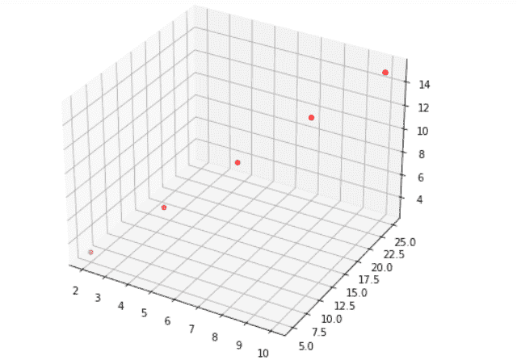

ax.scatter3D(color=None)

阅读: [Matplotlib 虚线](https://pythonguides.com/matplotlib-dashed-line/)

## 带彩条的 Matplotlib 3D 散点图

这里我们用颜色条绘制了一个 3D 散点图。通过使用 `get_cmap()` 方法，我们创建了一个**颜色图**。

**绘制颜色条的语法:**

```py
**# Create scatter Plot**

matplotlib.axis.Axis.scatter3D(x, y, z, cmap)

**# To Plot colorbar**

matplotlib.pyplot.colorbar(mappable=None, cax=None, ax=None, label, ticks)
```

在这里 `cmap` 指定**颜色图**。

**举例:**

```py
**# Import libraries** 
from mpl_toolkits import mplot3d
import numpy as np
import matplotlib.pyplot as plt

**# Define Dataset** x = np.random.randint(100,size=(80))
y = np.random.randint(150, size=(80))
z = np.random.randint(200, size=(80))

**# Creating figure** fig = plt.figure(figsize = (16, 9))
ax = plt.axes(projection ="3d")

**# Creat color map** 
color_map = plt.get_cmap('spring')

**# Create scatter plot and colorbar** scatter_plot = ax.scatter3D(x, y, z,
                            c=(x+y+z),
                            cmap = color_map)

plt.colorbar(scatter_plot)

**# Show plot** 
plt.show()
```

*   在上面的例子中，我们导入了 **mplot3d 工具包** 、 `numpy` 和 `pyplot` 库。
*   接下来，我们使用 `random.randint()` 方法定义数据。
*   `plt.axes()` 方法用于设置轴，这里我们将**投影**作为参数传递。
*   `plt.get_cmap()` 方法用于创建特定颜色的色图。
*   `ax.scatter3D()` 方法用于创建三维散点图，这里我们通过 `x` 、 `y` 、 `z` 和 `cmap` 作为参数。这里 `cmap` 定义**颜色**贴图**贴图**。
*   `fig.colorbar()` 方法用于将 colorbar 添加到指示色标的绘图中。

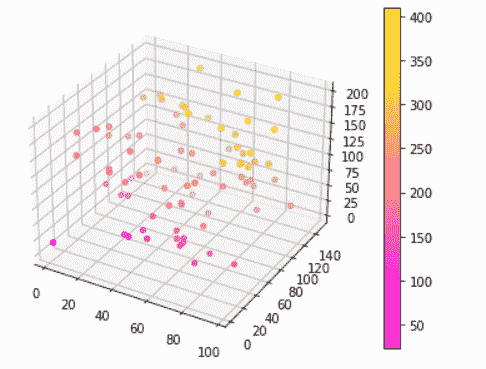

plt.colorbar()

阅读: [Matplotlib 散点图标记](https://pythonguides.com/matplotlib-scatter-marker/)

## Matplotlib 3D 散点图标记尺寸

在这里，我们将学习如何在 matplotlib 中更改 3D 散点图的标记和标记大小。

**改变标记大小的语法如下:**

```py
matplotlib.axis.Axis.scatter(x, y, z, s=None, marker=None)
```

**上面使用的参数是:**

*   **x:** 指定 x 轴上的数据位置。
*   **y:** 指定 y 轴上的数据位置。
*   **s:** 以点**2 为单位指定标记尺寸。
*   **标记:**指定标记样式。

**让我们来看一个改变散点标记及其大小的例子:**

```py
**# Import libraries**

from mpl_toolkits import mplot3d
import numpy as np
import matplotlib.pyplot as plt

**# Define Data** 
x = np.arange(0, 20, 0.2)
y = np.sin(x)
z = np.cos(x)

**# Create Figure**

fig = plt.figure(figsize = (8,6))
ax = plt.axes(projection ="3d")

**# Create Plot**

ax.scatter3D(x, y, z, marker= '>', s=50)

**# Show plot**

plt.show()
```

这里我们使用一个 `ax.scatter()` 方法来创建一个散点图，我们将标记和 `s` 作为参数来分别改变**标记样式**和**标记大小**。我们将标记大小设置为 50。

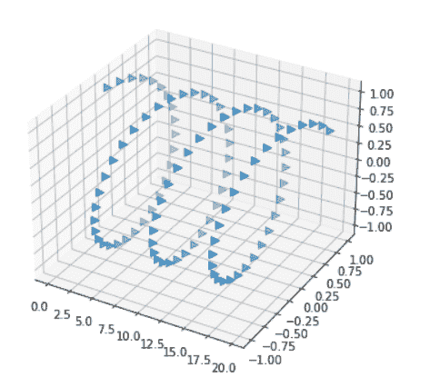

ax.scatter3D(marker, s=None)

读取: [Matplotlib 改变背景颜色](https://pythonguides.com/matplotlib-change-background-color/)

## Matplotlib 3D scatter label

在这里，我们将学习如何向 3D 散点图添加标签。

**添加标签的语法如下:**

```py
**# To add x-axis label**

ax.set_xlabel()

**# To add y-axis label**

ax.set_ylabel()

**# To add z-axis label** 
ax.set_zlabel()
```

**举例:**

这里我们用 `ax.scatter3D()` 函数来绘制 3D 散点图。

`ax.set_xlabel()` 、 `ax.set_ylabel()` 、 `ax.set_zlabel()` 函数用于给绘图添加标签。我们将 **X 轴**、 **Y 轴**和 **Z 轴**传递给各自的功能。

**代码:**

```py
**# Import libraries**

from mpl_toolkits import mplot3d
import numpy as np
import matplotlib.pyplot as plt

**# Define Data**

z = [3, 6, 9, 12, 15]
x = [2, 4, 6, 8, 10]
y = [5, 10, 15, 20, 25]

**# Create Figure**

fig = plt.figure(figsize = (10, 7))
ax = plt.axes(projection ="3d")

**# Create Plot** 
ax.scatter3D(x, y, z, color='red')

**# Add axis**

ax.set_xlabel('X-axis', fontweight ='bold')
ax.set_ylabel('Y-axis', fontweight ='bold')
ax.set_zlabel('Z-axis', fontweight ='bold')

**# Show plot**

plt.show()
```

**输出:**

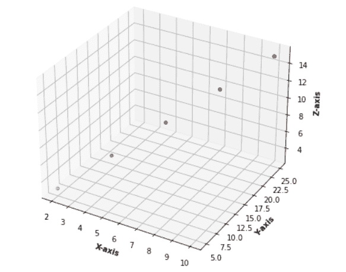

*” 3D Scatter Plot with Labels “*

另外，检查: [Matplotlib 旋转刻度标签](https://pythonguides.com/matplotlib-rotate-tick-labels/)

## Matplotlib 3D 散点图图例

在这里，我们学习如何向 3D 散点图添加图例。通过使用 `legend()` 函数我们可以很容易地添加。

**举例:**

```py
**# Import libraries** 
from mpl_toolkits import mplot3d
import numpy as np
import matplotlib.pyplot as plt

**# Define Data** 
x = np.arange(0, 20, 0.2)
y =  np.sin(x)
z1 = np.cos(x)
z2 = np.exp(8)

**# Create Figure** 
fig = plt.figure(figsize = (10, 7))
ax = plt.axes(projection ="3d")

**# Create Plot** 
ax.scatter3D(x, y, z1, marker='<', s=20, label='Triangle')
ax.scatter3D(x, y, z2, marker='o', s=20, label='Circle' )

**# Add legend** 
ax.legend(loc=1)

**# Show plot** 
plt.show()
```

*   这里我们绘制了 `x` 、 `y` 和 `z1` 轴与 `x` 、 `y` 和 `z2` 轴之间的三维散点图。
*   通过使用`ax . sacter3d)(`方法，我们绘制 3D sactter 图，并将**标签**作为参数。
*   `ax.legend()` 方法用于给绘图添加图例。

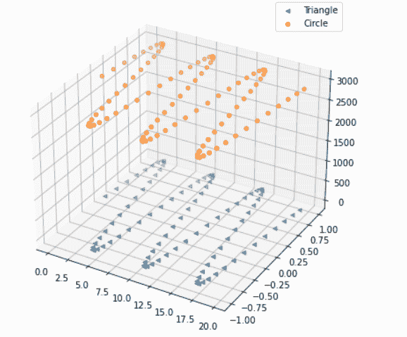

ax.legend()

读取: [Matplotlib 移除刻度标签](https://pythonguides.com/matplotlib-remove-tick-labels/)

## Matplotlib 3D 散点图颜色值

在这里，我们将学习如何绘制不同数据和颜色的 3D 散点图。

**让我们看一个例子来更清楚地理解这个概念:**

```py
**# Import libraries** 
from mpl_toolkits import mplot3d
import numpy as np
import matplotlib.pyplot as plt

**# Define Data** x1 = np.random.randint(450,size=(80))
y1 = np.random.randint(260, size=(80))
z1 = np.random.randint(490, size=(80))

x2 = np.random.randint(100,size=(50))
y2 = np.random.randint(150, size=(50))
z2 = np.random.randint(200, size=(50))

x3 = [3, 6, 9, 12, 15]
y3 = [2, 4, 6, 8, 10]
z3 = [5, 10, 15, 20, 25]

**# Create Figure** 
fig = plt.figure(figsize = (8,6))
ax = plt.axes(projection ="3d")

**# Create Plot** 
ax.scatter3D(x1, y1, z1, s=50, color='red')
ax.scatter3D(x2, y2, z2, s=50, color='yellow')
ax.scatter3D(x3, y3, z3, s=50, color='pink')

**# Show plot** 
plt.show() 
```

*   这里我们用三个不同的数据集绘制了一个 3D 散点图。
*   然后通过使用 `ax.scatter3D()` 函数，我们为不同的数据集绘制散点图。
*   绕过作为参数的**颜色**,我们用数值给散点图着色。

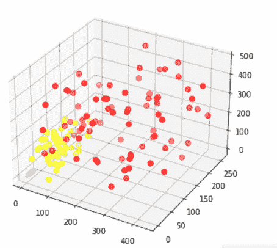

*” 3D Scatter Plot Color by Value “*

另外，阅读: [Matplotlib 绘图误差线](https://pythonguides.com/matplotlib-plot-error-bars/)

## Matplotlib 3D 散点旋转

在这里，我们将学习如何仅通过移动鼠标来旋转 3D 散点图。

**要打开交互性或使用鼠标旋转 3D 散点图，请在代码中使用这一行:**

```py
%matplotlib notebook
```

**我们来看一个例子:**

```py
**# Interactive Mode**

%matplotlib notebook

**# Import Library**

from mpl_toolkits.mplot3d import Axes3D
import matplotlib.pyplot as plt

**# Create Plot**

fig = plt.figure()
ax = fig.add_subplot(111, projection='3d')

**# Define Data**

X = [1,2,3,4,5,6,7,8,9,10]
Y = [5,6,2,3,13,4,1,2,4,8]
Z = [2,3,3,3,5,7,9,11,9,10]

**# Plot 3D scatter Plot** 
ax.scatter(X,Y,Z, c='r', marker='o')

**# Define Label**

ax.set_xlabel('x axis')
ax.set_ylabel('y axis')
ax.set_zlabel('z axis')

**# Display**

plt.show()
```

*   在上面的例子中，我们从后端**启用**的**交互模式**。
*   接下来，我们导入库 `mplot3D` 和 `pyplot` 。
*   然后我们创建一个图并定义数据。
*   `ax.scatter3D()` 方法用于绘制三维散点图。
*   `set_xlabel()` 、 `set_ylabel` 、 `set_zlabel()` 方法用于给绘图添加标签。
*   `plt.show()` 方法用于显示绘图用户屏幕。

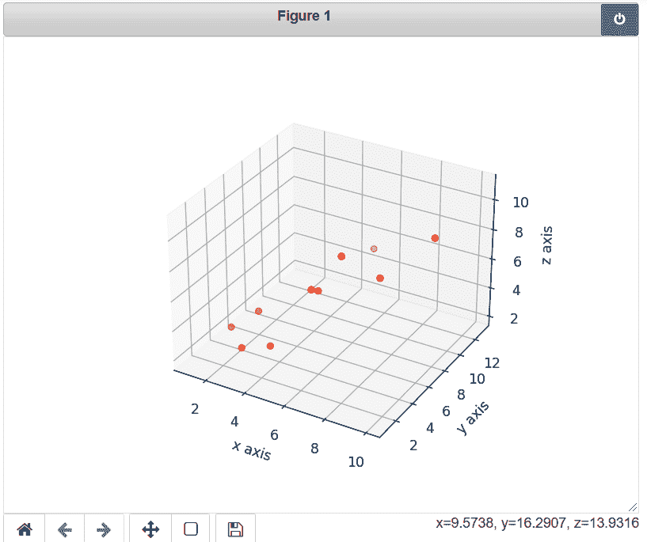

*” Original 3D Scatter Plot”*

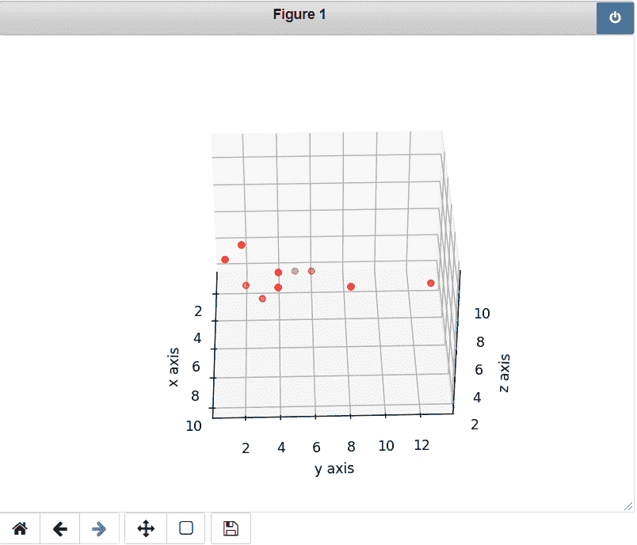

*” Rotation of 3D scatter by mouse “*

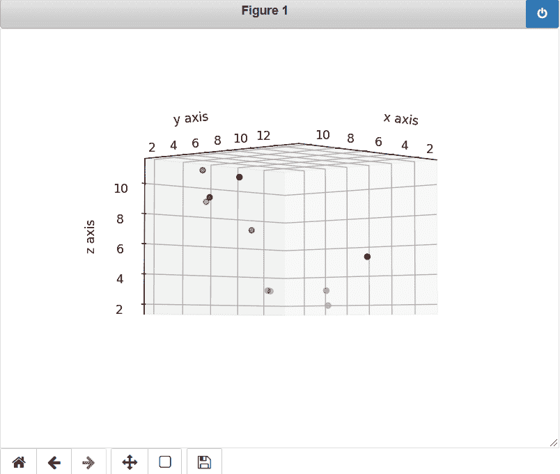

*” Rotation using Mouse “*

阅读:[在 Python 中添加文本到 plot matplotlib](https://pythonguides.com/add-text-to-plot-matplotlib/)

## Matplotlib 3D 散点变化视角

在这里，我们可以了解如何从不同角度查看 3D 散点图。通过使用 `view_init()` 方法，我们可以改变视角。

**改变视角的语法如下:**

```py
matplotlib.axis.Axis.view_init(elev,azim)
```

**上面使用的参数如下:**

*   **elev:** 指定 z 平面的仰角。
*   **azim:** 指定 x，y 平面的方位角。

**让我们看一个改变视角的例子:**

```py
**# Import Library** 
from mpl_toolkits import mplot3d
import numpy as np
import matplotlib.pyplot as plt

**# Plotting 3D axis figures** 
fig = plt.figure(figsize = (8,8))
ax = plt.axes(projection = '3d')

**# Define Data** 
z = np.linspace(0, 20, 500)
x = np.sin(z)
y = np.cos(z)
ax.plot3D(x, y, z, 'green')

**# Change view angle** 
ax.view_init(50, 20)

**# Display** 
plt.show()
```

*   在这个例子中，我们导入了 `mplot3d` 、 `numpy` 和 `pyplot` 库。
*   然后我们使用 `plt.figure()` 和 `plt.axes()` 方法绘制三维轴图形，并分别传递 `figsize` 和**投影**作为参数。
*   之后，我们为三个轴创建一个数据集。
*   `ax.scatter3D()` 方法用于绘制三维散点图。
*   `view_init()` 方法用于改变视角。

**输出:**无旋转出图。

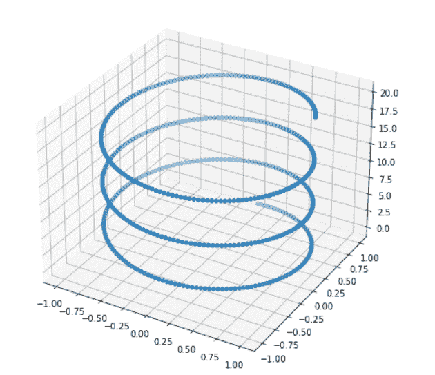

*” 3D scatter plot without rotation “*

**输出:**绘制仰角 50 度，水平角 20 度的 3D 散点图。

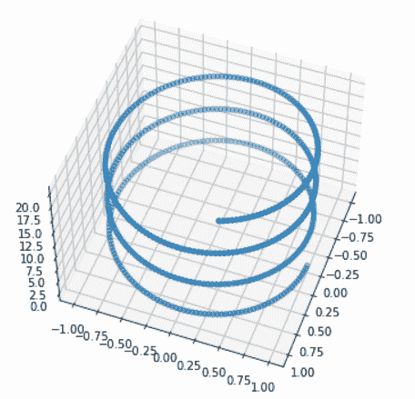

*” 3D Scatter Plot with rotation “*

读: [Matplotlib 另存为 png](https://pythonguides.com/matplotlib-save-as-png/)

## Matplotlib 3D 散点图标题

在这里，我们将学习如何绘制带有标题的 3D 散点图。

**向三维散点图添加标题的语法:**

```py
matplotlib.pyplot.title()
```

**我们来看一个例子:**

```py
**# Import Library** 
from mpl_toolkits import mplot3d
import numpy as np
import matplotlib.pyplot as plt

**# Plotting 3D axis figures** 
fig = plt.figure(figsize = (6,4))
ax = plt.axes(projection = '3d')

**# Define Data** 
z = np.linspace(0,15,150)
x = np.sin(z)
y = np.cos(z)

**# Plot 3D scatter** 
ax.scatter3D(x, y, z, color='m')

**# Add Title** 
plt.title('3D SCATTER PLOT', fontweight='bold', size=20)

**# Display** 
plt.show()
```

*   在上面的例子中，我们导入了 `mplot3d` 、 `numpy` 和 `pyplot` 库。
*   接下来，我们使用 `linespace()` 、 `sin()` 和 `cos()` 方法定义数据。
*   `ax.scatter3D()` 方法用于绘制散点图。
*   `plt.title()` 方法用于将标题添加到 3D 散点图中。

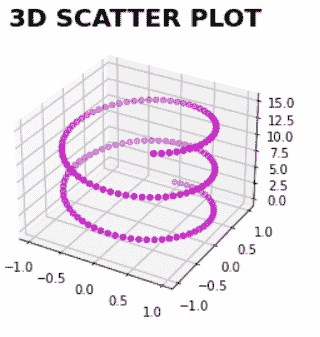

plt.title()

阅读: [Matplotlib 条形图标签](https://pythonguides.com/matplotlib-bar-chart-labels/)

## Matplotlib 3D 散点图文本

在这里，我们将学习如何向 3D 散点图添加文本。通过使用 `ax.text()` 方法我们可以做到这一点。

**让我们来看一个在 3D 散点图的固定位置添加文本的例子:**

```py
**# Import libraries** 
from mpl_toolkits import mplot3d
import numpy as np
import matplotlib.pyplot as plt

**# Define Data** 
z = [3, 6, 9, 12, 15]
x = [2, 4, 6, 8, 10]
y = [5, 10, 15, 20, 25]

**# Create Figure** 
fig = plt.figure(figsize = (10, 7))
ax = plt.axes(projection ="3d")

**# Create Plot** 
ax.scatter3D(x, y, z)

**# Add axis** 
ax.set_xlabel('X-axis')
ax.set_ylabel('Y-axis')
ax.set_zlabel('Z-axis')

**# Add Text** 
ax.text3D(6, 4, 10,"Point 2")

**# Show plot** 
plt.show()
```

*   这里我们首先定义用于绘图的数据，然后通过使用 `ax.scatter()` 函数绘制 3D 散点图。
*   `ax.text()` 方法用于将文本添加到绘图的固定位置。我们传递放置文本的三个位置( **x，y，z 轴**)和我们想要添加的**文本**。

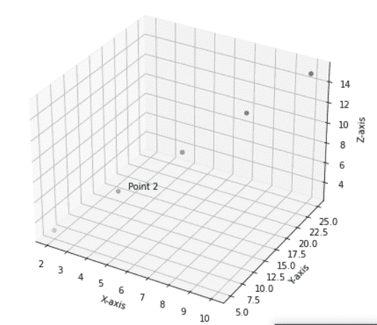

ax.text()

阅读: [Matplotlib 默认图形尺寸](https://pythonguides.com/matplotlib-default-figure-size/)

## Matplotlib 3D 散点图，带线条

在这里，我们将学习如何用线条绘制 3D 散点图。为了连接散点，我们使用带有 `x` 、 `y` 和 `z` 数据点的 `plot3D()` 方法。

**让我们看一个例子，用线**绘制一个 3D 散点图:

```py
**# Import libraries**

from mpl_toolkits import mplot3d
import numpy as np
import matplotlib.pyplot as plt

**# Define Data**

z = [3, 6, 9, 12, 15]
x = [2, 4, 6, 8, 10]
y = [5, 10, 15, 20, 25]

**# Create Figure** 
fig = plt.figure(figsize = (10, 7))
ax = plt.axes(projection ="3d")

**# Create Plot**

ax.scatter3D(x, y, z, color='red')

**# Add line**

ax.plot3D(x,y,z)

**# Add axis** 
ax.set_xlabel('X-axis')
ax.set_ylabel('Y-axis')
ax.set_zlabel('Z-axis')

**# Show plot**

plt.show()
```

*   通过使用 `figure()` 函数，我们创建了一个新图形，并在当前图形中添加了一个轴作为子图形。
*   定义数据点 `x` 、 `y` 和 `z` 。
*   `ax.scatter3D()` 函数用于绘制散点图。
*   `ax.plot3D()` 函数用于连接点与 `x` 、 `y` 、 `z` 数据点。
*   `plt.show()` 方法用于显示图。

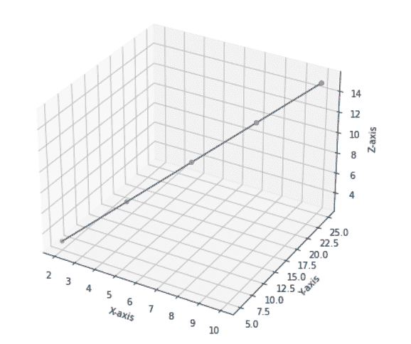

ax.plot3D()

读取: [Matplotlib savefig 空白图像](https://pythonguides.com/matplotlib-savefig-blank-image/)

## Matplotlib 3D 散点图与表面

在这里，我们将学习如何绘制一个表面的三维散点图。首先，我们必须了解什么是表面情节:

**表面图**是三维数据集的表示。它表示两个变量 X 和 Z 与因变量 y 之间的关系。

`ax.plot_surface()` 函数用于创建表面图。

**给定方法的语法如下:**

```py
matplotlib.axis.Axis.plot_surface(X, Y, Z)
```

其中 `X` 、 `Y` 、 `Z` 为三维数据坐标点。

**让我们来看一个 3D 表面散射的例子:**

```py
**# Import libraries** 
from mpl_toolkits import mplot3d
import numpy as np
import matplotlib.pyplot as plt

**# Define Function** 
def function_z(x,y):
    return 100 - (x`2 + y`2)

**# Define Data** 
x_val = np.linspace(-3, 3, 30)
y_val = np.linspace(-3, 3, 30)

X, Y = np.meshgrid(x_val, y_val)

**# Call function** 
z = function_z(X, Y)

**# Create figure** fig = plt.figure(figsize =(10,6))
ax = plt.axes(projection='3d')

**# Create surface plot** 
ax.plot_surface(X, Y, z, color='yellow');

**# Display** 
plt.show() 
```

*   在上面的例子中，首先我们导入 `matplotlib.pyplot` 、 `numpy` 和 `mplot3D` 。
*   接下来，我们为 z 坐标创建一个用户定义函数。
*   然后通过使用 `np.linspace()` 函数，我们为 x 和 y 坐标定义数据。
*   通过使用 `plt.figure()` 方法我们创建一个函数和 `plt.axes()` 方法来定义轴。
*   `ax.plot_surface()` 方法用于绘制带表面的三维散点图。
*   要显示图形，请使用 `show()` 方法。

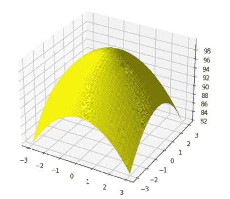

ax.plot_surface()

阅读: [Matplotlib 标题字体大小](https://pythonguides.com/matplotlib-title-font-size/)

## Matplotlib 3D 散射透明度

在这里，我们将学习如何调整 3D 散点图的不透明度或透明度。通过使用 `alpha` 属性，我们可以改变 matplotlib 中绘图的透明度。

默认情况下，alpha 为 1。它的范围在 0 到 1 之间。我们可以通过降低 alpha 值来降低透明度。

**改变透明度的语法如下:**

```py
matplotlib.axis.Axis.scatter3D(x, y, z, alpha=1)
```

这里 x，y，z 是数据坐标，alpha 用来设置透明度。

**让我们看一个改变绘图透明度的例子:**

```py
**# Import libraries** 
from mpl_toolkits import mplot3d
import numpy as np
import matplotlib.pyplot as plt

**# Define Data** 
x = np.arange(0, 20, 0.2)
y = np.sin(x)
z = np.cos(x)

**# Create Figure** 
fig = plt.figure(figsize = (10, 7))
ax = plt.axes(projection ="3d")

**# Create Plot** 
ax.scatter3D(x, y, z)
                      **# OR**

ax.scatter3D(x, y, z, alpha=0)

                      **# OR**

ax.scatter3D(x, y, z, alpha=0.5)

 **# OR**

ax.scatter3D(x, y, z, alpha=1)

**# Show plot** 
plt.show()
```

*   在上面的例子中，我们使用 `arange()` 、 `sin()` 、 `cos()` 的方法定义数据。
*   通过使用 `figure()` 函数我们创建图，**【轴()】**方法用于定义投影到 3d。
*   `ax.scatter3D()` 方法用于绘制 3D 散点图，我们通过 `alpha` 参数来改变不透明度。

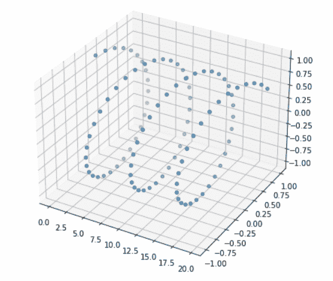

*” Scatter3D plot without alpha argument “*

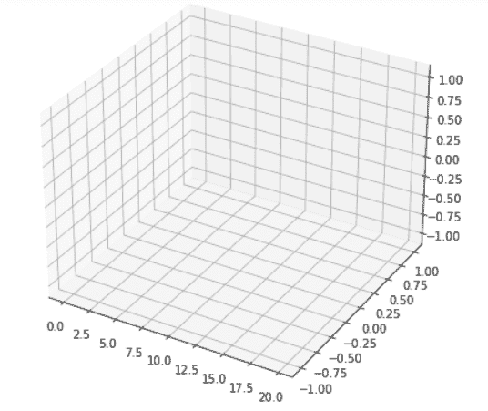

*” Scatter3D plot with alpha=0 “*

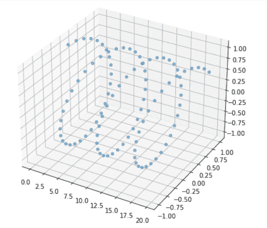

*” Scatter3D plot with alpha=0.5 “*

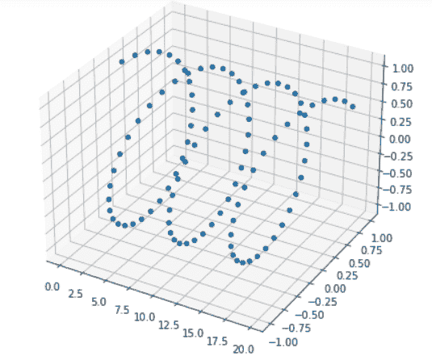

*” Scatter3D plot with alpha=1 “*

阅读: [Matplotlib 另存为 pdf + 13 示例](https://pythonguides.com/matplotlib-save-as-pdf/)

## matplot lib 3d sactor depthshade

通常，当我们绘制 3D 散点图时，数据点的透明度会根据距离进行调整。这意味着透明度以磅的距离增加和减少。

总的来说，我们看到一些数据点是深色的，一些是透明的。

通过使用 `depthshade` 属性，我们可以关闭 matplotlib 中的透明度。要关闭它，将其值设置为**假**。

**语法如下:**

```py
matplotlib.axis.Axis.scatter3D(x, y, z, depthshade=False)
```

**我们来看一个例子:**

```py
**# Import libraries** 
from mpl_toolkits import mplot3d
import numpy as np
import matplotlib.pyplot as plt

**# Define Data** 
z = [3, 6, 9, 12, 15]
x = [2, 4, 6, 8, 10]
y = [5, 10, 15, 20, 25]

**# Create Figure** fig = plt.figure(figsize = (10, 7))
ax = plt.axes(projection ="3d")

**# Create Plot** 
ax.scatter3D(x, y, z, s=100, color='green',   depthshade=False)

**# Add axis** 
ax.set_xlabel('X-axis')
ax.set_ylabel('Y-axis')
ax.set_zlabel('Z-axis')

**# Show plot** 
plt.show()
```

这里我们使用 `ax.scatter3D()` 方法来绘制 3D 散点图，并通过 `depthshade` 属性来关闭其透明度。

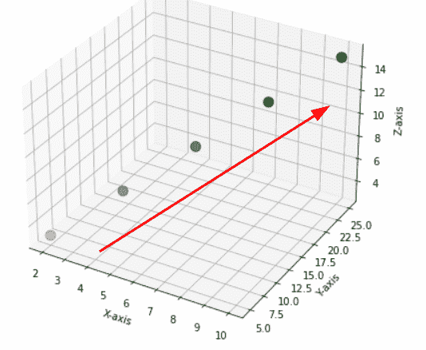

*” 3D scatter Plot with depthshade attribute “*

这里你可以看到 3D 散点图的透明度。

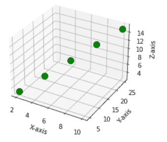

*” 3D Scatter Plot with depthshade attribute “*

这里你可以看到数据点没有透明度。

阅读:[将图例放在绘图 matplotlib 之外](https://pythonguides.com/put-legend-outside-plot-matplotlib/)

## Matplotlib 3D 散点图轴限制

在这里，我们将学习如何更改 3D 散点图的轴限制。默认情况下，轴上的值范围是根据输入值自动设置的。

为了修改每个轴上的最小和最大限制，我们使用了 `set_xlim()` 、 `set_ylim()` 和 `set_zlim()` 方法。

**修改轴限制的语法如下:**

```py
**# For x-axis limit** matplotlib.axis.Axis.set_xlim(min, max)

**# For y-axis limit** matplotlib.axis.Axis.set_ylim(min, max)

**# For z-axis limit** matplotlib.axis.Axis.set_zlim(min, max) 
```

**让我们看一个调整轴限制的例子:**

**代码:带默认轴**

```py
**# Import libraries** from mpl_toolkits import mplot3d
import numpy as np
import matplotlib.pyplot as plt

**# Define Data** 
x1 = np.random.randint(450,size=(80))
y1 = np.random.randint(260, size=(80))
z1 = np.random.randint(490, size=(80))

**# Create Figure** 
fig = plt.figure(figsize = (8,6))
ax = plt.axes(projection ="3d")

**# Create Plot** ax.scatter3D(x1, y1, z1, s=50, color='red')

**# Show plot** plt.show() 
```

这里我们使用 `ax.scatter3D()` 方法绘制一个 3D 散点图。并且我们使用 `np.random.randint()` 方法来定义数据。

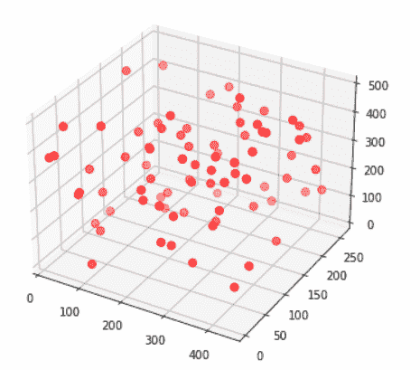

*” 3D Scatter Plot “*

**代码:带修改轴**

```py
**# Import libraries** 
from mpl_toolkits import mplot3d
import numpy as np
import matplotlib.pyplot as plt

**# Define Data** 
x1 = np.random.randint(450,size=(80))
y1 = np.random.randint(260, size=(80))
z1 = np.random.randint(490, size=(80))

**# Create Figure** 
fig = plt.figure(figsize = (8,6))
ax = plt.axes(projection ="3d")

**# Create Plot** 
ax.scatter3D(x1, y1, z1, s=50, color='red')

**# Modify axis** 
ax.set_xlim(50,150)
ax.set_ylim(30,160)
ax.set_zlim(0,350)

**# Show plot**

plt.show() 
```

这里我们使用 `set_xlim()` ， `set_ylim()` ， `set_zlim()` 方法，根据传递的最小值和最大值修改三个轴的限值。

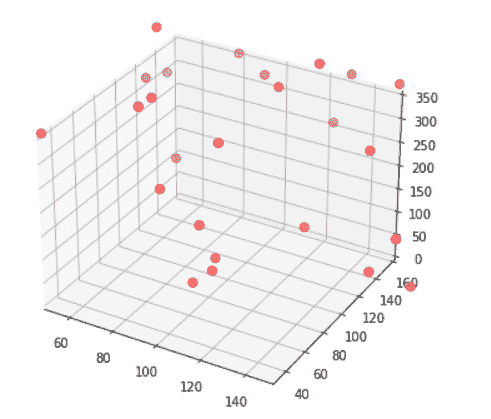

*” 3D Scatter Plot with modified axes “*

阅读:[画垂直线 matplotlib](https://pythonguides.com/draw-vertical-line-matplotlib/)

## Matplotlib 3D 散点图轴刻度

在这里，我们将学习如何更改三维散点图的轴刻度。我们可以修改每个轴的刻度。修改 ticks 的方法有 `set_xticks()` ， `set_yticks()` ， `set_zticks()` 。

**修改轴限制的语法如下:**

```py
**# For x-axis limit** matplotlib.axis.Axis.set_xticks()

**# For y-axis limit** matplotlib.axis.Axis.set_yticks()

# `For z-axis limit` matplotlib.axis.Axis.set_zticks() 
```

**让我们看一个调整坐标轴刻度的例子:**

**代码:带默认刻度**

```py
**# Import libraries** 
from mpl_toolkits import mplot3d
import numpy as np
import matplotlib.pyplot as plt

**# Define Data** 
x = np.arange(0, 20, 0.2)
y = np.sin(x)
z = np.cos(x)

**# Create Figure** 
fig = plt.figure(figsize = (8,6))
ax = plt.axes(projection ="3d")

**# Create Plot** 
ax.scatter3D(x, y, z)

**# Show plot** 
plt.show()
```

这里我们用 `ax.scatter3D()` 的方法来绘制 3D 散点图。使用 `arange()` 、 `sin()` 和 `cos()` 方法来定义数据。

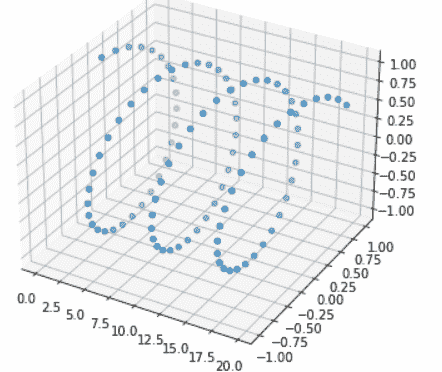

*” 3D Scatter Plot “*

这里 x 轴刻度是[0.0，2.5，5.0，7.5，10.0，12.5，15.5，17.5，20.0]

**代码:带修改记号**

```py
**# Import libraries** 
from mpl_toolkits import mplot3d
import numpy as np
import matplotlib.pyplot as plt

**# Define Data** 
x = np.arange(0, 20, 0.2)
y = np.sin(x)
z = np.cos(x)

**# Create Figure** 
fig = plt.figure(figsize = (8,6))
ax = plt.axes(projection ="3d")

**# Create Plot** 
ax.scatter3D(x, y, z)

**# Set tick labels** 
ax.set_xticks([1.5, 3.5, 5.5, 7.5, 12.5, 14.5, 16.5, 18.5])

**# Show plot** 
plt.show()
```

这里我们使用 `ax.set_xticks()` 方法并传递一个 x 刻度列表来修改 x 轴刻度。

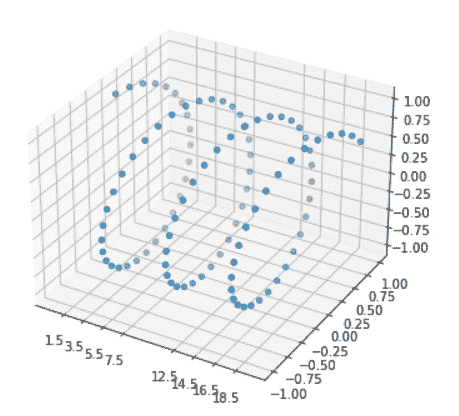

*” 3D axis with modifying x ticks “*

现在 x 个刻度是[1.5，3.5，5.5，7.5，12.5，14.5，16.5，18.5]。

我们还可以分别使用 `set_yticks()` 和 `z_ticks()` 方法更新 `Y` ticks 和 `Z` ticks。

阅读:[堆积条形图 Matplotlib](https://pythonguides.com/stacked-bar-chart-matplotlib/)

## Matplotlib 3D 散点图尺寸

在这里，我们将学习如何改变三维散点图的大小。我们可以轻松地使我们的地块比默认大小更大或更小。

**以下方式用于改变绘图的大小:**

*   使用 plt.figure()方法
*   使用 set_size_inches()方法

### 通过使用 plt.figure()方法

我们将 `figsize` 参数传递给 `plt.figure()` 方法来改变绘图的大小。我们必须以英寸为单位指定绘图的**宽度**和**高度**。

**其语法如下:**

```py
matplotlib.pyplot.figure(figsize(w,h))
```

这里 `w` 和 `h` 指定**宽度**和**高度**

**我们来看一个例子:**

```py
**# Import libraries** 
from mpl_toolkits import mplot3d
import numpy as np
import matplotlib.pyplot as plt

**# Define Data** 
x = np.arange(0, 20, 0.2)
y =  np.sin(x)
z = np.exp(8)

**# Change figure size** 
fig = plt.figure(figsize = (10, 7))
ax = plt.axes(projection ="3d")

**# Create Plot** 
ax.scatter3D(x, y, z, marker='<', s=20)

**# Show plot** 
plt.show()
```

这里我们使用 `plt.figure()` 方法的 `figsize` 参数来改变图形大小。我们设置 `w = 10` 和 `h= 7` 。

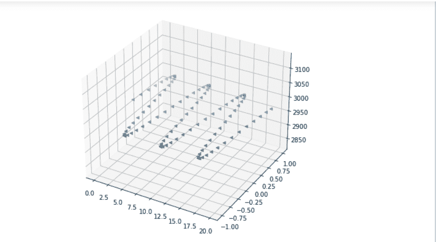

plt.figure(figsize())

### 通过使用 set_size_inches()方法

我们将以英寸为单位的绘图的**宽度**和**高度**传递给 `set_size_inches()` 方法来修改绘图的大小。

**其语法如下:**

```py
matplotlib.figure.Figure.set_size_inches(w,h)
```

这里 `w` 和 `h` 指定**宽度**和**高度**。

**我们来看一个例子:**

```py
**# Import libraries** 
from mpl_toolkits import mplot3d
import numpy as np
import matplotlib.pyplot as plt

**# Define Data** 
z = [3, 6, 9, 12, 15, 23, 14, 16, 21]
x = [2, 4, 6, 8, 10, 13, 18, 16, 15]
y = [5, 10, 15, 20, 25, 32, 29, 45, 20]

**# Change figure size** 
fig = plt.figure()
fig.set_size_inches(10, 10)

ax = plt.axes(projection ="3d")

**# Create Plot** 
ax.scatter3D(x, y, z)

**# Add axis** 
ax.set_xlabel('X-axis')
ax.set_ylabel('Y-axis')
ax.set_zlabel('Z-axis')

**# Show plot** 
plt.show()
```

这里我们使用图的 `set_size_inches()` 方法来修改绘图的大小。

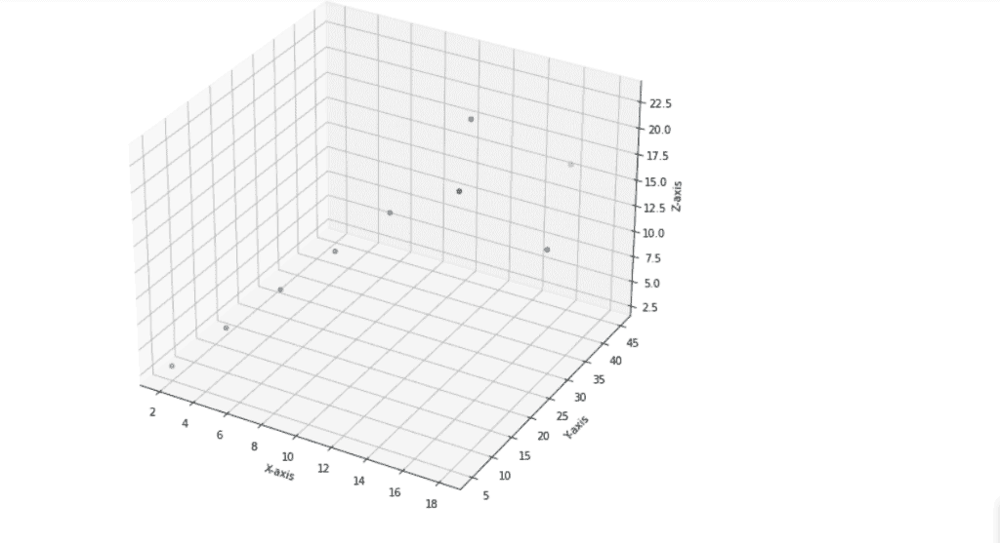

fig.set_size_inches()

这里我们将绘图的宽度和高度设置为 10 英寸。

阅读: [Matplotlib 两个 y 轴](https://pythonguides.com/matplotlib-two-y-axes/)

## Matplotlib 3D 散点图网格

当我们绘制 3D 散点图时，默认情况下所有的图都有网格线。如果我们愿意，我们可以去掉网格线。要删除网格线，调用 axes 对象的 `grid()` 方法。

传递值**‘False’**来移除网格线，并再次获取网格线。传递值**‘True’**。

**其语法如下:**

```py
matplotlib.axis.Axis.grid()
```

**让我们看一个没有` `网格的 3D 散点图的例子:**

```py
**# Import libraries** 
from mpl_toolkits import mplot3d
import numpy as np
import matplotlib.pyplot as plt

**# Define Function** 
def function_z(x,y):
    return np.cos(x ` 2 + y ` 2)

**# Define Data** 
x_val = np.linspace(-3, 3, 30)
y_val = np.linspace(-3, 3, 30)

X, Y = np.meshgrid(x_val, y_val)

**# Call function** 
z = function_z(X, Y)

**# Create figure** 
fig = plt.figure(figsize =(10,6))
ax = plt.axes(projection='3d')

**# Create surface plot** 
ax.plot_surface(X, Y, z);

**# Grid** 
ax.grid(False)

**# Display** 
plt.show() 
```

*   在上面的例子中，我们使用**用户自定义函数**定义了 **z 轴**，使用 numpy 的 `linspace()` 方法定义了 **x 轴**、 **y 轴**。
*   然后我们用 `ax.plot_surface()` 的方法用曲面绘制 3D 散点图。
*   我们使用 `ax.grid()` 方法并传递关键字 `False` 来关闭网格线。

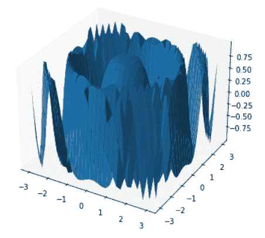

ax.grid(False)

## Matplotlib 3D 散点子图

这里我们将讨论如何在多个情节中的一个特定支线情节中绘制 3D 散点图。

我们使用 `scatter3D()` 方法创建 3D 散点图。

**让我们借助一个例子来理解这个概念:**

```py
**# Importing Libraries** 
import numpy as np
import matplotlib.pyplot as plt
from mpl_toolkits import mplot3d

**# Create 1st subplot** 
fig = plt.figure(figsize=(8, 6))
ax = fig.add_subplot(1, 2, 1, projection='3d')

**# Define Data** 
x1= [0.2, 0.4, 0.6, 0.8, 1]
y1= [0.3, 0.6, 0.8, 0.9, 1.5]
z1= [2, 6, 7, 9, 10]

**# Plot graph** 
ax.scatter3D(x1, y1, z1, color='m')

**# Create 2nd subplot** 
ax = fig.add_subplot(1, 2, 2, projection='3d')

**# Define Data** 
x2 = np.arange(0, 20, 0.2)
y2 = np.sin(x)
z2 = np.cos(x)

**# Plot graph** 
ax.scatter3D(x2, y2, z2, color='r')

**# Display graph**

fig.tight_layout()
plt.show()
```

*   在上面的例子中，通过使用 `add_subplot()` 方法，我们创建了第一个子绘图，然后我们定义了用于绘图的数据。
*   `ax.scatter3D()` 方法用于创建 3D 散点图。
*   之后，我们再次使用 `add_subplot()` 方法创建 2nmd 子绘图，然后我们定义用于绘图的数据。
*   同样，我们使用 `ax.scatter3D()` 方法绘制另一个 3D 散点图。

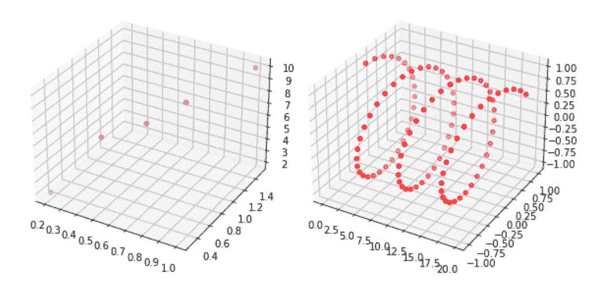

*” 3D Scatter Subplots “*

## Matplotlib 3D 散点保存

在这里，我们将学习如何在系统内存中保存 3D 散点图。我们将 3D 散点图保存在**“png”**中。

为了保存它，我们使用 matplotlib 的 `savefig()` 方法，并将**路径**传递到您想要保存它的地方。

**我们来看一个例子:**

```py
**# Import libraries** 
from mpl_toolkits import mplot3d
import numpy as np
import matplotlib.pyplot as plt

**# Define Data** 
x1 = np.random.randint(450,size=(80))
y1 = np.random.randint(260, size=(80))
z1 = np.random.randint(490, size=(80))

**# Create Figure** 
fig = plt.figure(figsize = (8,6))
ax = plt.axes(projection ="3d")

**# Create Plot** 
ax.scatter3D(x1, y1, z1, s=50, color='red')

**# save plot** 
plt.savefig('3D Scatter Plot.png')

**# Show plot** 
plt.show() 
```

*   在上面的例子中，我们使用 `random.randit()` 方法定义数据，使用 `scatter3D()` 方法绘制 3D 散点图。
*   然后，我们使用 `plt.savefig()` 方法在系统中保存绘图，并将**路径**作为参数传递给该函数。

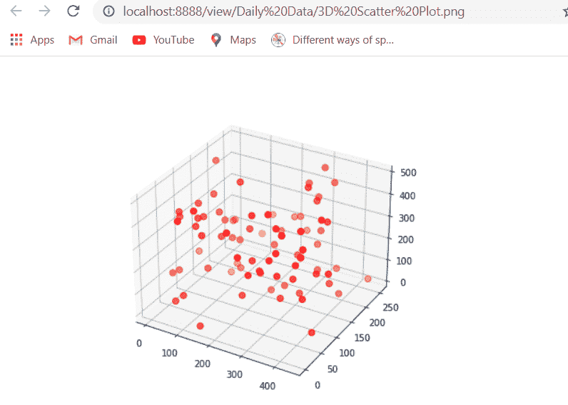

plt.savefig()

## Matplotlib 3D 散点背景色

`set_facecolor()` 方法在 axes 模块中用来改变或设置绘图的背景颜色。

它用于设置图形的表面颜色，或者我们可以说是绘图的轴颜色。将参数作为要设置的**颜色**名称进行传递。

**figure(face color = ' color ')**方法用于改变绘图的外部背景颜色。

**改变图形背景颜色的语法如下:**

```py
**# Inner color**
matplotlib.pyplot.axes.set_facecolor(color=None)

**# Outer color** 
plt.figure(facecolor=None) 
```

**让我们借助一个例子来理解这个概念:**

```py
**# Import libraries**

from mpl_toolkits import mplot3d
import numpy as np
import matplotlib.pyplot as plt

**# Define Data**

x = np.arange(0, 20, 0.2)
y = np.sin(x)
z = np.cos(x)

**# Create Figure** 

fig = plt.figure(figsize = (8,8))

**# Set Outer color** 
plt.figure(facecolor='red')

ax = plt.axes(projection ="3d")

**# Set Inner color** 
ax.set_facecolor('yellow')

**# Create Plot** 
ax.scatter3D(x, y, z, marker= '>', s=50)

**# Show Plot**

plt.show()
```

*   在上面的例子中，我们改变了绘图背景的**内部**和**外部**的颜色。
*   在 `figure()` 方法中使用了" `facecolor"` 属性来改变外部区域的颜色。
*   `axes()` 对象的“ `set_facecolor()` ”方法改变绘图的内部区域颜色。

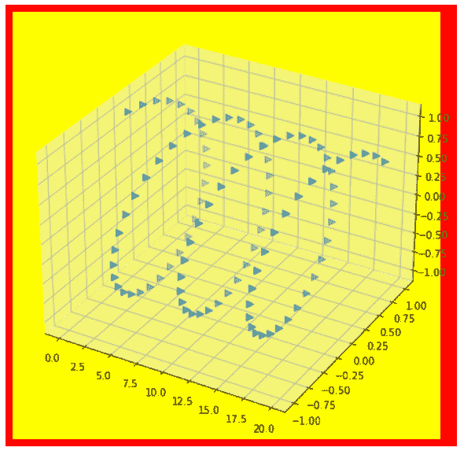

*” 3D Scatter Background Color “*

这里我们将**内层**颜色设置为**【黄色】**，将**外层**颜色设置为**【红色】**。

## matplot lib 3d scatter num array

在这里，我们将学习如何使用 numpy 数组创建一个 3D 散点图。

为了定义 3D 散点图的三维数据轴，我们使用 numpy 方法。

**我们来看一个例子:**

```py
**# Import libraries** 
from mpl_toolkits import mplot3d
import numpy as np
import matplotlib.pyplot as plt

**# Create Figure** 
fig = plt.figure(figsize = (8,8))
ax = plt.axes(projection ="3d")

**# Define Data using numpy** 
data = np.random.randint(2, 10, size=(3, 3, 3))
x , y , z = data.nonzero()

**# Create Plot** 
ax.scatter3D(x, y, z, s=50)

**# Show plot** 
plt.show()
```

*   在上面的例子中，我们使用 numpy 和额外的三维数据点创建了一个 3D 数组。
*   首先，我们导入 `mplot3d` 、 `numpy` 和 `pyplot` 库，然后我们使用 `figure()` 方法创建一个新的图形。
*   通过使用 numpy `random.randint()` 方法，我们创建数据。
*   然后通过使用**非零()**方法，我们额外的 x、y 和 z 数据点来绘制 3D 散点图。
*   接下来，我们使用 `ax.scatter3D()` 方法在创建的轴上绘制 3D 散点。
*   为了显示该图，我们使用了 `show()` 方法。

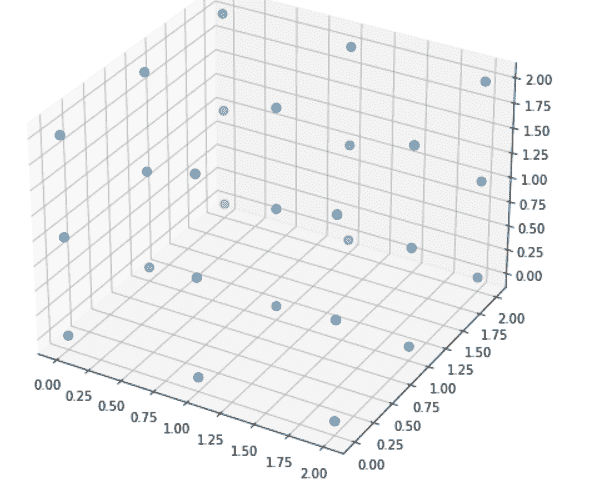

*” 3D Scatter Plot Using Numpy Array “*

## Matplotlib 3D 散点标记颜色

在这里，我们将学习如何改变三维散点图中的标记颜色。

在 3D 散点图中，数据点用**点**表示，这些点被称为**标记**。

因此，要改变标记的颜色，我们只需将 `color` 作为参数传递给 `scatter3D()` 方法，要改变标记的边缘颜色，我们在 `scatter3D()` 方法中使用 `edgecolor` 作为参数。

**改变标记颜色和边缘颜色的语法:**

```py
matplotlib.axis.Axis.scatter3D(x, y, z, color=None, edgecolr=None)
```

**上面使用的参数是:**

*   **x:** 指定 x 轴坐标。
*   **y:** 指定 y 轴坐标。
*   **z:** 指定 z 轴坐标。
*   **颜色:**指定标记的颜色。
*   **边缘颜色:**指定标记的边缘颜色。

**举例:**

```py
**# Import libraries**

from mpl_toolkits import mplot3d
import numpy as np
import matplotlib.pyplot as plt

**# Create Figure** 

fig = plt.figure(figsize = (8,8))
ax = plt.axes(projection ="3d")

**# Define Data using numpy** 
data = np.random.random(size=(5, 4, 3))
x , y , z = data.nonzero()

**# Create Plot and set color and edge color**

ax.scatter3D(x, y, z, s=150, color='yellow', edgecolor='black')

**# Show plot**

plt.show()
```

*   在上面的例子中，我们使用 `scatter3D()` 方法并传递一个**颜色**参数来设置标记颜色。这里我们将标记的颜色设置为**【黄色】**。
*   我们还将 `edgecolor` 参数传递给 `scatter3D()` 方法，以改变标记边缘的颜色。这里我们设置标记的边缘颜色为**“黑色”**。

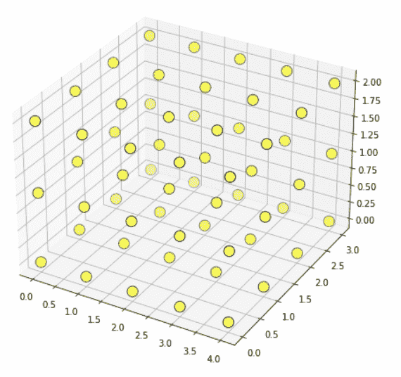

*” 3D Scatter Plot Color and Edgecolor “*

## Matplotlib 3D scatter zlim

`set_zlim()` 方法用于设置 z 轴的极限。

**zlim()方法的语法如下:**

```py
matplotlib.axis.Axis.set_zlim(min, max)
```

**让我们看看 zlim()方法的例子:**

**例 1**

```py
**# Import Library**

from mpl_toolkits import mplot3d
import numpy as np
import matplotlib.pyplot as plt

**# Plotting 3D axis figures**

fig = plt.figure(figsize = (8, 6))
ax = plt.axes(projection = '3d')

**# Define Data** 
z = np.linspace(0,15,150)
x = np.sin(z)
y = np.cos(z)

**# Plot 3D scatter** 
ax.scatter3D(x, y, z)

**# zlim() method** 
ax.set_zlim(-1.5, 4)

**# Display**

plt.show()
```

这里我们使用 `set_zlim()` 方法来设置 z 轴的极限。我们将**最小**极限设置为 `-1.5` ，将**最大**极限设置为 `4` 。

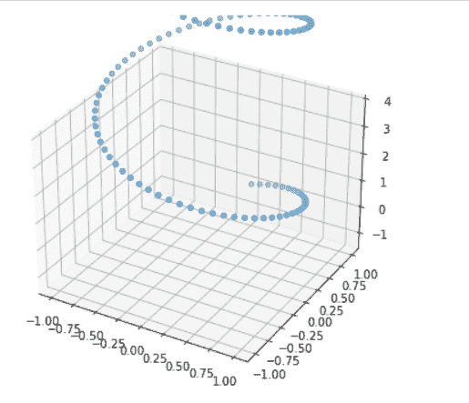

set_zlim()

**例 2**

```py
**# Importing Libraries**

import numpy as np
import matplotlib.pyplot as plt
from mpl_toolkits import mplot3d

**# Create figure**

fig = plt.figure(figsize=(8, 6))
ax = fig.add_subplot(1, 2, 1, projection='3d')

**# Define Data**

x= [0.2, 0.4, 0.6, 0.8, 1]
y= [0.3, 0.6, 0.8, 0.9, 1.5]
z= [2, 6, 7, 9, 10]

**# Plot graph**

ax.scatter3D(x, y, z, color='m', depthshade=False)

**# zlim() method**

ax.set_zlim(3, 6)

**# Display**

plt.show() 
```

在上面的例子中，我们使用 `set_zlim()` 方法来设置 **z 轴**的**最小值**和**最大值**极限。这里我们设置一个从 `3` 到 `6` 的**范围**。

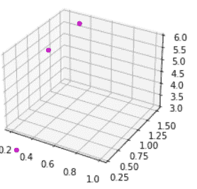

set_zlim()

## matplot lib 3d scatter zlabel

`set_zlabel()` 方法用于给绘图的 **z 轴**添加标签。

**zlabel()方法的语法:**

```py
matplotlib.axis.Axis.set_zlabel()
```

**让我们看看 zlabel()方法的例子:**

**举例:**

```py
**# Import Library** 
from mpl_toolkits import mplot3d
import numpy as np
import matplotlib.pyplot as plt

**# Plotting 3D axis figures** 
fig = plt.figure(figsize = (4,6))
ax = plt.axes(projection = '3d')

**# Define Data** 
x = np.random.randint(150, size=(50))
y = np.random.randint(260, size=(50))
z = np.random.randint(450, size=(50))

**# Plot** 
ax.scatter3D(x, y, z, 'green')

**# zlabel()** 
ax.set_zlabel('Quality')

**# Display** 
plt.show()
```

在上面的例子中，我们使用 `set_zlabel()` 方法给 **z 轴**添加一个标签。

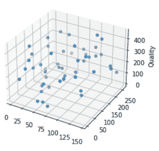

ax.set_zlabel()

## Matplotlib 3d scatter xlim

`set_xlim()` 方法用于设置 x 轴的极限。

**xlim()方法的语法如下:**

```py
matplotlib.axis.Axis.set_xlim(min, max)
```

**让我们看看 xlim()方法的例子:**

```py
**# Import Library**

from mpl_toolkits import mplot3d
import numpy as np
import matplotlib.pyplot as plt

**# Plotting 3D axis figures** 
fig = plt.figure(figsize = (4,6))
ax = plt.axes(projection = '3d')

**# Define Data**

x = np.random.randint(150, size=(50))
y = np.random.randint(260, size=(50))
z = np.random.randint(450, size=(50))

**# Plot** 

ax.scatter3D(x, y, z, s=60)

**# xlim()**

ax.set_xlim(35,62)

**# Display**

plt.show()
```

这里我们使用 `set_xlim()` 方法来设置限制。我们将其范围设定在 `35` 到 `62` 之间。

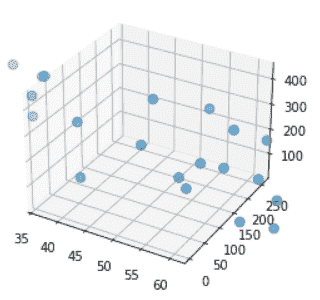

set_xlim()

## Matplotlib 3D scatter zoom

在 matplotlib **中 zoom()** 方法用于在轴上放大或缩小。

**zoom()方法的语法如下:**

```py
matplotlib.axis.Axis.zoom(self, direction)
```

这里**方向> 0** 用于**放大**，**方向< =0** 用于**缩小**。

**我们来看一个例子:**

**代码:**

```py
**# Importing Libraries** 
import numpy as np
import matplotlib.pyplot as plt
from mpl_toolkits import mplot3d

**# Create 1st subplot** 
fig = plt.figure(figsize=(8, 6))
ax = fig.add_subplot(1, 2, 1, projection='3d')

**# Define Data** 
x1= [0.2, 0.4, 0.6, 0.8, 1]
y1= [0.3, 0.6, 0.8, 0.9, 1.5]
z1= [2, 6, 7, 9, 10]

**# Plot graph** 
ax.scatter3D(x1, y1, z1, color='m', depthshade=False)

**# For zoom** 
ax.xaxis.zoom(-2.5)

**# Display** 
plt.show() 
```

*   在上面的例子中，我们导入了 `numpy` 、 `pyplot` 和 `mplot3d` 库。
*   然后我们用 numpy 的 `figure()` 方法创建一个图形，用 `random.randint()` 方法定义数据。
*   `ax.scatter3D()` 方法用于绘制 3D 散点图。
*   然后我们使用 `zoom()` 方法来放大和缩小轴。

**输出:**

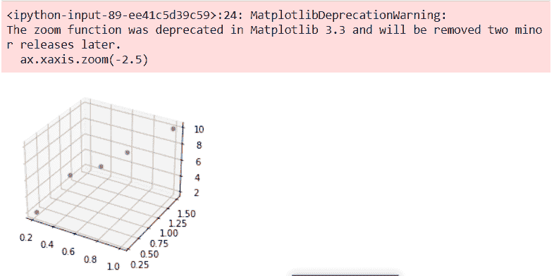

您会得到这样的警告，因为 matplotlib 3.3 不赞成使用 `zoom()` 方法

## Matplotlib 3D 散点原点

在 matplotlib 中，我们可以得到 3D 的原点到散点原点。为了获得原点，我们使用 NumPy 库的 `zeros()` 方法。

**我们来看一个例子:**

```py
**# Import libraries** 
from mpl_toolkits import mplot3d
import numpy as np
import matplotlib.pyplot as plt

**# Create Figure** 
fig = plt.figure(figsize = (8,8))
ax = plt.axes(projection ="3d")

**# Define Data** 
x , y , z = np.zeros((3,3))

**# Create Plot and set color and edge color** 
ax.scatter3D(x, y, z, s=150, color='yellow', edgecolor='black')

**# Show plot** 
plt.show()
```

*   在上面的例子中，我们导入 matplotlib 的库 `mplot3d` 、 `numpy` 和 `pyplot` 。
*   然后我们通过使用 `figure()` 方法创建一个图形。
*   在这之后，为了得到 3D 散点图的原点，我们使用了 `np.zeros()` 方法。
*   `ax.scatter3D()` 方法用于在 3D 平面上绘制散点图。

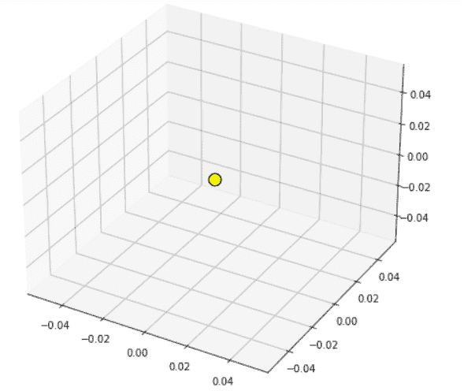

“3D Scatter Origin”

## Matplotlib 3D 散点图对数标度

在这里，我们将学习如何将轴刻度值设置为对数刻度。

**让我们来看一个对数标度的 3D 散点图示例:**

```py
**# Import libraries** 
from mpl_toolkits import mplot3d
import numpy as np
import matplotlib.pyplot as plt
import matplotlib.ticker as mticker

**# Define Function** 
def function_z(x,y):
    return 100 - (x`2 + y`2)

**# Define Data** 
x_val = np.linspace(-3, 3, 30)
y_val = np.linspace(-3, 3, 30)

X, Y = np.meshgrid(x_val, y_val)

**# Call function** 
z = function_z(X, Y)

**# Create figure** 
fig = plt.figure(figsize =(10,6))
ax = plt.axes(projection='3d')

**# Create surface plot** 
ax.plot_surface(X, Y, z, color='yellow');

**# Log Scale** 
def log_tick_formatter(val, pos=None):
    return f"$10^{{{int(val)}}}$"
ax.zaxis.set_major_formatter(mticker.FuncFormatter(log_tick_formatter))
ax.zaxis.set_major_locator(mticker.MaxNLocator(integer=True))

**# Set Title** 
ax.set(title="Logarithmic z-aix")

**# Display** 
plt.show() 
```

*   在上面的例子中，我们导入了 matplotlib 的 `mplot3d` 、 `numpy` 、 `pyplot` 和 `ticker` 库。
*   然后我们创建用户自定义函数来定义 `z` 坐标。
*   之后，我们定义 `x` 和 `y` 坐标，并使用 `figure()` 方法创建图形。
*   `ax.plot_surface()` 方法用于在 3D 中创建表面图。
*   然后我们创建用户自定义函数来创建一个**主定位器**，并在**日志**表单中定义**刻度**。

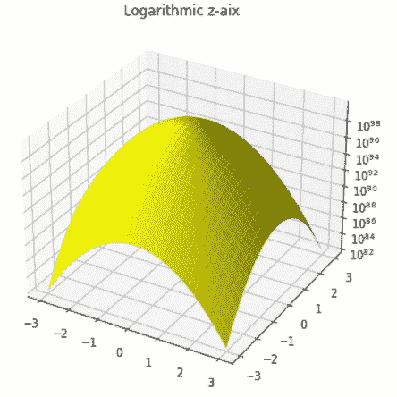

*“3D Scatter Log Scale”*

这里我们以对数的形式设置 z 轴。

## matplot lib 3d scatter data frame

在这里，我们将学习如何使用 pandas 数据框创建 3D 散点图。

**我们来看一个例子:**

```py
**# Import Library** 
import matplotlib.pyplot as plt
import numpy as np
import pandas as pd
from mpl_toolkits import mplot3d

**# Create figure** 
fig = plt.figure(figsize = (4,6))
ax = plt.axes(projection = '3d')

**# Define dataframe** 
df=pd.DataFrame(np.random.rand(30,20))
x = df.iloc[:,0]
y = df.iloc[:,5]
z = df.iloc[:,10]

**# Plot 3d Scatter Graph** 
ax.scatter3D(x,y,z)

**# Display** 
plt.show()
```

*   在上面的例子中，我们在 matplotlib 中导入了 `pyplot` 、 `numpy` 、 `pandas` 和 `mplot3d` 库。
*   之后，我们使用 `figure()` 方法创建图形，并在 3D 中定义**投影**。
*   然后我们创建熊猫**数据帧**并且我们使用 `np.random.rand()` 方法。
*   我们使用熊猫 dataframe 的 `iloc()` 方法定义 `x` 、 `y` 、 `z` 数据坐标。
*   `ax.scatter3D()` 方法用于创建 3D 散点图。

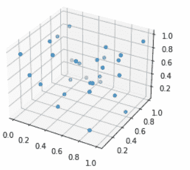

*“3D Scatter DataFrame”*

阅读: [Matplotlib 二维表面图](https://pythonguides.com/matplotlib-2d-surface-plot/)

## Matplotlib 3D 散点动画

在这里，我们将学习如何用动画创建 3D 散点图。

**让我们来看一个动画 3D 散点图的例子:**

```py
**# Interactive Mode** 
%matplotlib notebook

**# Import Library** 
import pandas as pd
import numpy as np
import matplotlib.pyplot as plt
from mpl_toolkits.mplot3d import Axes3D
from matplotlib.animation import FuncAnimation, PillowWriter 

**# Define Data** 
data = np.random.random(size=(1000,3))
df = pd.DataFrame(data, columns=["x","y","z"])

**# Create Figure** 
fig = plt.figure()
ax = fig.add_subplot(111,projection='3d')

**# Plot Graph** 
scatter_plot = ax.scatter3D([],[],[], color='m')

**# Define Update function** 
def update(i):
    scatter_plot._offsets3d = (df.x.values[:i], df.y.values[:i], df.z.values[:i])

**# Set annimation** 
ani = matplotlib.animation.FuncAnimation(fig, update, frames=len(df), interval=50)

**# Show** 
plt.tight_layout()
plt.show()

**# Save** 
ani.save('3D Scatter Animation.gif', writer='pillow', fps=30) 
```

*   在上面的例子中，我们首先**启用交互模式**。
*   然后我们导入 matplotlib 的**熊猫**、 `numpy` 、 `pyplot` 、 `mplot3d` 和**动画**库。
*   接下来，我们使用 numpy 的 `random.random()` 方法定义数据。
*   之后，我们在 pandas 中创建**数据帧**，并定义 `x` 、 `y` 和 `z` 坐标。
*   `plt.figure()` 方法用于创建一个图， `add_subplot()` 方法创建 subplot，我们将**投影**设置为 `3D` 。
*   `ax.scatter3D()` 方法用于绘制 3D 散点图。
*   在这之后，我们创建一个**更新**函数。
*   通过使用**动画。FuncAnimation()** 方法我们在 3D 散点图中添加动画。
*   然后，最后我们使用 `save()` 方法将一个情节保存为 `gif` 。

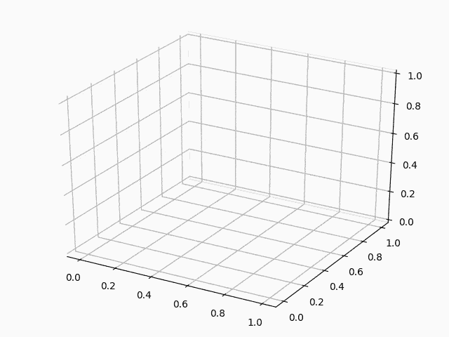

*” 3D Scatter Animation “*

在本 Python 教程中，我们已经讨论了**“Matplotlib 3D 散点图”**，并且我们还介绍了一些与之相关的例子。这些是我们在本教程中讨论过的以下主题。

*   Matplotlib 3D scatter plot
*   Matplotlib 3D 散点图示例
*   Matplotlib 3D 散布颜色
*   带颜色条的 Matplotlib 3D 散点图
*   Matplotlib 3D 散点图标记大小
*   Matplotlib 3D 散点图标签
*   Matplotlib 3D 散点图图例
*   Matplotlib 3D 散点图按值显示颜色
*   Matplotlib 3D 散布旋转
*   Matplotlib 3D 散点图更改视角
*   Matplotlib 3D 散点图标题
*   Matplotlib 3D 散布文本
*   带线条的 Matplotlib 3D 散点图
*   带表面的 Matplotlib 3D 散点图
*   Matplotlib 三维抖动透明度
*   matplot lib 3d sactor depthshade
*   Matplotlib 3D 散点图轴限制
*   Matplotlib 三维散点图坐标轴刻度
*   Matplotlib 3D 散点图大小
*   Matplotlib 3D 散点图网格
*   Matplotlib 3D 散点子图
*   Matplotlib 3D 散点保存
*   Matplotlib 3D 散布背景颜色
*   Matplotlib 3D 散点图数组
*   Matplotlib 3D 散点图标记颜色
*   matplot lib 3d scatter zlem
*   Matplotlib 3D scatter z label
*   Matplotlib 3D scatter xlim
*   Matplotlib 3D scatter zoom
*   Matplotlib 3D 散布原点
*   Matplotlib 3D 散点图对数标度
*   Matplotlib 3D scatter dataframe
*   Matplotlib 3D 散布动画

[Bijay Kumar](https://pythonguides.com/author/fewlines4biju/)

Python 是美国最流行的语言之一。我从事 Python 工作已经有很长时间了，我在与 Tkinter、Pandas、NumPy、Turtle、Django、Matplotlib、Tensorflow、Scipy、Scikit-Learn 等各种库合作方面拥有专业知识。我有与美国、加拿大、英国、澳大利亚、新西兰等国家的各种客户合作的经验。查看我的个人资料。

[enjoysharepoint.com/](https://enjoysharepoint.com/)[](https://www.facebook.com/fewlines4biju "Facebook")[](https://www.linkedin.com/in/fewlines4biju/ "Linkedin")[](https://twitter.com/fewlines4biju "Twitter")