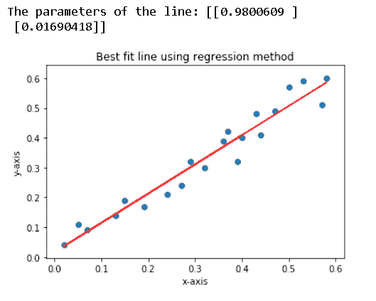
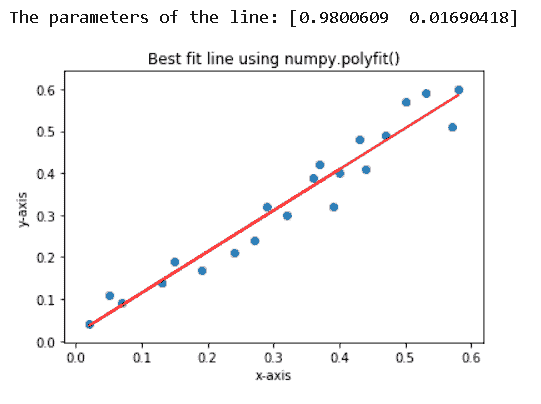
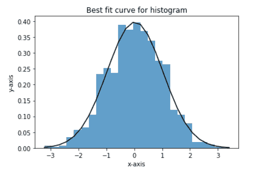
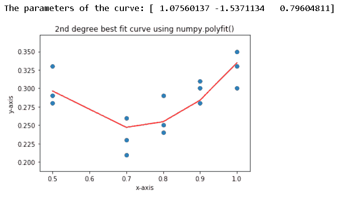
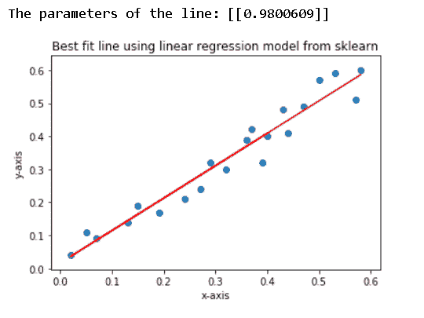

# Matplotlib 最佳拟合线

> 原文：<https://pythonguides.com/matplotlib-best-fit-line/>

[](https://sharepointsky.teachable.com/p/python-and-machine-learning-training-course)

在本 [Python 教程](https://pythonguides.com/learn-python/)中，我们将讨论如何在 Python 的 matplotlib 中绘制**最佳拟合线，我们还将涉及以下主题:**

*   最佳拟合线
*   Matplotlib 最佳拟合线
*   使用 numpy.polyfit()的 Matplotlib 最佳拟合线
*   Matplotlib 最佳拟合直线直方图
*   Matplotlib 最佳拟合曲线
*   Matplotlib 散点图的最佳拟合线

目录

[](#)

*   [最佳拟合线](#Best_fit_line "Best fit line")
*   [Matplotlib 最佳拟合线](#Matplotlib_best_fit_line "Matplotlib best fit line")
*   [使用 numpy.polyfit()的 Matplotlib 最佳拟合线](#Matplotlib_best_fit_line_using_numpypolyfit "Matplotlib best fit line using numpy.polyfit()")
*   [Matplotlib 最佳拟合线直方图](#Matplotlib_best_fit_line_histogram "Matplotlib best fit line histogram")
*   [Matplotlib 最佳拟合曲线](#Matplotlib_best_fit_curve "Matplotlib best fit curve")
*   [Matplotlib 散点图的最佳拟合线](#Matplotlib_best_fit_line_to_scatter "Matplotlib best fit line to scatter")

## 最佳拟合线

二维图形中的最佳拟合线是指定义在图形上绘制为散点图的数据点的 x 轴和 y 轴坐标的最佳关系的线。

最佳拟合线或最佳关系可以通过最小化数据点与目标线的距离来实现。

线性方程在数学上代表一条线。这条线的法线方程如下:

`(A * x) + (B * y) + C = 0`

*   这里， `x` 和 `y` 是代表数据点的 x 轴和 y 轴值的变量。
*   `A` 和 `B` 是变量 `x` 和 `y` 的系数， `C` 是常数。这些统称为线的参数，决定了线的形状和在图上的位置。

但是，最常用的直线形式是**截距-斜率**形式，如下所示:

`y = (m * x) + c`

*   这里， `x` 和 `y` 是代表数据点的 x 轴和 y 轴值的变量。
*   `m` 是变量 `x` 的系数，代表图上直线的斜率。斜率是线条的参数，它决定了图形上线条的角度。
*   `c` 是一个常数值，代表图形上直线的 y 轴截距。截距是线条的参数，它决定了线条在图上的位置。

我们可以将标准形式转换为斜率截距形式，如下所示:

`(A * x) + (B * y) + C = 0`

`(B * y)=-C-(A * x)`

`y =(-(A * x)-C)/B`

`y = ((-A / B) * x) + (-C / B)`

将这个方程与直线的斜率截距形式相比较。

我们得到， `m = (-A / B)` 和 `c = (-C / B)`

在这篇文章中，我们将使用直线的**斜率截距**形式。

寻找与给定数据点最佳拟合的直线参数的最常用方法是回归分析中的**最小二乘**方法。

简单回归分析是指定单个数字因变量(此处为 y)和数字自变量(此处为 x)之间关系的方法。

阅读: [Matplotlib 支线剧情教程](https://pythonguides.com/matplotlib-subplot-tutorial/)

## Matplotlib 最佳拟合线

我们可以在 matplotlib 中绘制一条最适合分散数据点的直线。首先，我们需要找到使其最佳拟合的线的参数。

我们将通过应用线性代数的矢量化概念来做到这一点。

首先，让我们了解我们将用来寻找最佳拟合线参数的算法。

直线的方程是: `y = (m * x) + c`

我们把这个改成**y =θ0+(θ1 * x)**；这里，θ0 和θ1 是分别代表线的 c(截距)和 m(斜率)的参数。

现在，让我们把这个方程变成矢量形式:

*   设， `N` 为给定数据点的数量。
*   设 `y` 为 `N` 行的列向量，其中每行代表每个数据点的 y 坐标。
*   设，**θ**为 `2` 行的列向量，行的每个参数(**θ0**和**θ1**)为向量的行值。
*   设， `X` 为 `2XN` 的矩阵，其中第一列由每行的值 `1` 组成，第二列由 `N` 个数据点的 X 坐标值组成。

现在，向量形式的方程会是这样的:**y = Xθ**

我们可以通过使用向量形式的最小二乘法方程来计算并获得给定数据点的最佳参数值(θ0 和θ1)，如下所示:

**θ=(X^T。X) ^(-1) 。(X ^T 。y)**；这里，**X^T是矩阵 `X` 的**转置**，而 **(X ^T 。X) ^(-1)** 是 **(X ^T 所得矩阵的逆矩阵。X)****

现在，让我们使用 python 实现这个算法，并绘制出结果线。

```py
# Importing the necessary libraries
from matplotlib import pyplot as plt
import numpy as np

# Preparing the data to be computed and plotted
dt = np.array([
          [0.05, 0.11],
          [0.13, 0.14],
          [0.19, 0.17],
          [0.24, 0.21],
          [0.27, 0.24],
          [0.29, 0.32],
          [0.32, 0.30],
          [0.36, 0.39],
          [0.37, 0.42],
          [0.40, 0.40],
          [0.07, 0.09],
          [0.02, 0.04],
          [0.15, 0.19],
          [0.39, 0.32],
          [0.43, 0.48],
          [0.44, 0.41],
          [0.47, 0.49],
          [0.50, 0.57],
          [0.53, 0.59],
          [0.57, 0.51],
          [0.58, 0.60]
])

# Preparing X and y data from the given data
x = dt[:, 0].reshape(dt.shape[0], 1)
X = np.append(x, np.ones((dt.shape[0], 1)), axis=1)
y = dt[:, 1].reshape(dt.shape[0], 1)

# Calculating the parameters using the least square method
theta = np.linalg.inv(X.T.dot(X)).dot(X.T).dot(y)

print(f'The parameters of the line: {theta}')

# Now, calculating the y-axis values against x-values according to
# the parameters theta0 and theta1
y_line = X.dot(theta)

# Plotting the data points and the best fit line
plt.scatter(x, y)
plt.plot(x, y_line, 'r')
plt.title('Best fit line using regression method')
plt.xlabel('x-axis')
plt.ylabel('y-axis')

plt.show()
```



Matplotlib best fit line

阅读: [Matplotlib 绘图条形图](https://pythonguides.com/matplotlib-plot-bar-chart/)

## 使用 numpy.polyfit()的 Matplotlib 最佳拟合线

我们可以使用 `numpy.polyfit()` 函数绘制给定数据点的最佳拟合线。

这个函数是一个预定义函数，它采用 3 个强制参数作为 x 坐标值(作为可迭代对象)、y 坐标值(作为可迭代对象)和方程的次数(1 表示线性，2 表示二次，3 表示三次，…)。

语法如下:

```py
numpy.polyfit(x, y, degree)
```

现在，让我们来看看这个例子，并理解函数的实现。

```py
# Importing the necessary libraries
from matplotlib import pyplot as plt
import numpy as np

# Preparing the data to be computed and plotted
dt = np.array([
          [0.05, 0.11],
          [0.13, 0.14],
          [0.19, 0.17],
          [0.24, 0.21],
          [0.27, 0.24],
          [0.29, 0.32],
          [0.32, 0.30],
          [0.36, 0.39],
          [0.37, 0.42],
          [0.40, 0.40],
          [0.07, 0.09],
          [0.02, 0.04],
          [0.15, 0.19],
          [0.39, 0.32],
          [0.43, 0.48],
          [0.44, 0.41],
          [0.47, 0.49],
          [0.50, 0.57],
          [0.53, 0.59],
          [0.57, 0.51],
          [0.58, 0.60]
])

# Preparing X and y from the given data
X = dt[:, 0]
y = dt[:, 1]

# Calculating parameters (Here, intercept-theta1 and slope-theta0)
# of the line using the numpy.polyfit() function
theta = np.polyfit(X, y, 1)

print(f'The parameters of the line: {theta}')

# Now, calculating the y-axis values against x-values according to
# the parameters theta0, theta1 and theta2
y_line = theta[1] + theta[0] * X

# Plotting the data points and the best fit line
plt.scatter(X, y)
plt.plot(X, y_line, 'r')
plt.title('Best fit line using numpy.polyfit()')
plt.xlabel('x-axis')
plt.ylabel('y-axis')

plt.show()
```



Matplotlib best fit line using numpy.polyfit()

阅读:[什么是 matplotlib 内联](https://pythonguides.com/what-is-matplotlib-inline/)

## Matplotlib 最佳拟合线直方图

我们可以拟合直方图的分布，并用 python 绘制曲线/直线。

我们可以使用 python 中的库 `scipy` ，完成该任务的步骤如下所示:

*   首先，我们可以调用带有参数*数据*的函数 `scipy.stats.norm.fit()` 来绘制直方图，得到类似*均值*和*标准差*的数据统计。
*   然后，我们将调用函数 `scipy.stats.norm.pdf()` ，参数为 *x* (直方图的条柱)*平均值*，数据的*标准差*，以获得最佳拟合曲线的给定数据的 y 值。
*   然后，我们可以用直方图绘制曲线。

让我们按照上面的

```py
# Importing the necessary libraries
from matplotlib import pyplot as plt
import numpy as np
import scipy.stats

dt = np.random.normal(0, 1, 1000)

# Plotting the sample data on histogram and getting the bins
_, bins, _ = plt.hist(dt, 25, density=1, alpha=0.5)

# Getting the mean and standard deviation of the sample data dt
mn, std = scipy.stats.norm.fit(dt)

# Getting the best fit curve y values against the x data, bins
y_curve = scipy.stats.norm.pdf(bins, mn, std)

# Plotting the best fit curve
plt.plot(bins, y_curve, 'k')

plt.title('Best fit curve for histogram')
plt.xlabel('x-axis')
plt.ylabel('y-axis')
plt.show()
```



Matplotlib best fit line histogram

阅读: [Python 使用 Matplotlib 绘制多条线](https://pythonguides.com/python-plot-multiple-lines/)

## Matplotlib 最佳拟合曲线

如果散点图上绘制的数据点显示了某种高次曲线趋势(二次曲线、三次曲线等)，我们可以在 python 中绘制一条最适合给定数据点的曲线。

我们可以使用 `numpy.polyfit()` 函数。该函数实际上会返回任何多项式趋势的最佳拟合曲线。正如我们在前面的主题中讨论的那样，为了更好地理解，我们来练习一个例子:

```py
# Importing the necessary libraries
from matplotlib import pyplot as plt
import numpy as np

# Preparing the data to be computed and plotted
dt = np.array([
          [0.5, 0.28],
          [0.5, 0.29],
          [0.5, 0.33],
          [0.7, 0.21],
          [0.7, 0.23],
          [0.7, 0.26],
          [0.8, 0.24],
          [0.8, 0.25],
          [0.8, 0.29],
          [0.9, 0.28],
          [0.9, 0.30],
          [0.9, 0.31],
          [1.0, 0.30],
          [1.0, 0.33],
          [1.0, 0.35]
])

# Preparing X and y from the given data
X = dt[:, 0]
y = dt[:, 1]

# Calculating parameters (theta0, theta1 and theta2)
# of the 2nd degree curve using the numpy.polyfit() function
theta = np.polyfit(X, y, 2)

print(f'The parameters of the curve: {theta}')

# Now, calculating the y-axis values against x-values according to
# the parameters theta0, theta1 and theta2
y_line = theta[2] + theta[1] * pow(X, 1) + theta[0] * pow(X, 2)

# Plotting the data points and the best fit 2nd degree curve
plt.scatter(X, y)
plt.plot(X, y_line, 'r')
plt.title('2nd degree best fit curve using numpy.polyfit()')
plt.xlabel('x-axis')
plt.ylabel('y-axis')
plt.show()
```



Matplotlib best fit curve

阅读: [Matplotlib 绘制一条线](https://pythonguides.com/matplotlib-plot-a-line/)

## Matplotlib 散点图的最佳拟合线

我们已经讨论了两种不同的方法，以获得最佳拟合线分散。所以，让我们用另一种方法来得到最佳拟合线。

我们可以使用`sk learn`library/module 的 `linear_model` 子模块中预先定义的线性回归模型来获得给定数据点的最佳拟合线。创建模型和获得最佳拟合线参数的步骤如下:

*   首先，从 `sklearn.linear_model` 子模块中导入 `LinearRegression` 。
*   然后，使用**线性回归()**创建一个新的模型，假设**模型=线性回归()**。
*   并且，使用带有两个参数 x 和 y 的 `model.fit()` 方法将给定的数据拟合到创建的模型中。
*   然后，使用函数 `model.predict()` 对照函数中作为参数给出的 x 值，获得预测的最佳拟合线的 y 值。
*   现在，我们可以将得到的 y 值和 x 值绘制成一个线图，给出给定数据点的最佳拟合线。

```py
# Importing the necessary libraries
from matplotlib import pyplot as plt
import numpy as np

# Importing the sklearn's linear_model,
# a pre-defined linear regression model
from sklearn.linear_model import LinearRegression

# Preparing the data to be computed and plotted
dt = np.array([
          [0.05, 0.11],
          [0.13, 0.14],
          [0.19, 0.17],
          [0.24, 0.21],
          [0.27, 0.24],
          [0.29, 0.32],
          [0.32, 0.30],
          [0.36, 0.39],
          [0.37, 0.42],
          [0.40, 0.40],
          [0.07, 0.09],
          [0.02, 0.04],
          [0.15, 0.19],
          [0.39, 0.32],
          [0.43, 0.48],
          [0.44, 0.41],
          [0.47, 0.49],
          [0.50, 0.57],
          [0.53, 0.59],
          [0.57, 0.51],
          [0.58, 0.60]
])

# Preparing X and y from the given data
X = dt[:, 0].reshape(len(dt), 1)
y = dt[:, 1].reshape(len(dt), 1)

# Creatoing a linear regression model and fitting the data to the model
model = LinearRegression()
model.fit(X, y)

# Now, predicting the y values according to the model
y_line = model.predict(X)

# Printing thr coffecient/parameter of the resulted line
print(f'The parameters of the line: {model.coef_}')

# Plotting the data points and the best fit line
plt.scatter(X, y)
plt.plot(X, y_line, 'r')
plt.title('Best fit line using linear regression model from sklearn')
plt.xlabel('x-axis')
plt.ylabel('y-axis')

plt.show()
```



Matplotlib best fit line to scatter

你可能也喜欢阅读下面的教程。

*   [如何安装 matplotlib python](https://pythonguides.com/how-to-install-matplotlib-python/)
*   [Matplotlib 子情节 _adjust](https://pythonguides.com/matplotlib-subplots_adjust/)
*   [Matplotlib 散点图标记](https://pythonguides.com/matplotlib-scatter-marker/)
*   [Matplotlib 测井记录图](https://pythonguides.com/matplotlib-log-log-plot/)
*   [什么是 Matplotlib，如何在 Python 中使用它](https://pythonguides.com/what-is-matplotlib/)
*   [modulenotfounderror:没有名为“matplotlib”的模块](https://pythonguides.com/no-module-named-matplotlib/)
*   [Matplotlib plot_date](https://pythonguides.com/matplotlib-plot-date/)
*   [Matplotlib 虚线](https://pythonguides.com/matplotlib-dashed-line/)
*   [Matplotlib savefig 空白图像](https://pythonguides.com/matplotlib-savefig-blank-image/)

在本 python 教程中，我们讨论了如何在 Python 的 matplotlib 中绘制**最佳拟合线，我们还讨论了以下主题:**

*   最佳拟合线
*   Matplotlib 最佳拟合线
*   使用 numpy.polyfit()的 Matplotlib 最佳拟合线
*   Matplotlib 最佳拟合直线直方图
*   Matplotlib 最佳拟合曲线
*   Matplotlib 散点图的最佳拟合线

[Bijay Kumar](https://pythonguides.com/author/fewlines4biju/)

Python 是美国最流行的语言之一。我从事 Python 工作已经有很长时间了，我在与 Tkinter、Pandas、NumPy、Turtle、Django、Matplotlib、Tensorflow、Scipy、Scikit-Learn 等各种库合作方面拥有专业知识。我有与美国、加拿大、英国、澳大利亚、新西兰等国家的各种客户合作的经验。查看我的个人资料。

[enjoysharepoint.com/](https://enjoysharepoint.com/)[](https://www.facebook.com/fewlines4biju "Facebook")[](https://www.linkedin.com/in/fewlines4biju/ "Linkedin")[](https://twitter.com/fewlines4biju "Twitter")