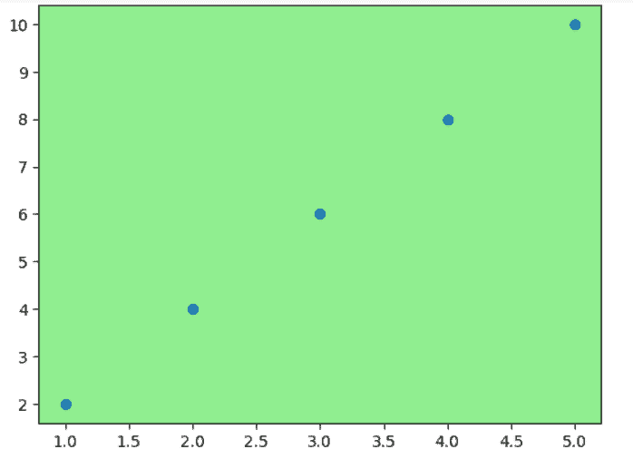
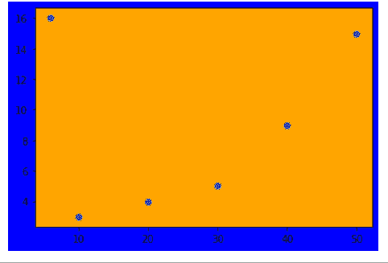

# Matplotlib 更改背景颜色

> 原文：<https://pythonguides.com/matplotlib-change-background-color/>

[](https://sharepointsky.teachable.com/p/python-and-machine-learning-training-course)

在本 [Python 教程](https://pythonguides.com/python-hello-world-program/)中，我们将讨论 Python 中的 **Matplotlib 改变背景色**。在这里，我们学习如何改变背景颜色的情节，我们还将涵盖以下主题:

*   Matplotlib 更改背景颜色
*   Matplotlib 改变绘图的背景颜色
*   Matplotlib 更改背景色示例
*   Matplotlib 更改背景颜色默认值
*   Matplotlib 更改背景颜色更改默认颜色
*   Matplotlib 改变背景颜色的内部和外部颜色
*   Matplotlib 改变图像的背景颜色
*   Matplotlib 改变背景颜色透明
*   Matplotlib 更改背景色图例
*   Matplotlib 改变背景颜色子图
*   Matplotlib 根据值改变背景颜色

目录

[](#)

*   [Matplotlib 背景颜色](#Matplotlib_background_color "Matplotlib background color")
*   [Matplotlib 改变绘图的背景颜色](#Matplotlib_change_background_color_of_plot "Matplotlib change background color of plot")
*   [Matplotlib 改变背景颜色示例](#Matplotlib_change_background_color_example "Matplotlib change background color example")
*   [Matplotlib 改变背景颜色默认值](#Matplotlib_change_background_color_default "Matplotlib change background color default")
*   [Matplotlib 改变背景颜色改变默认颜色](#Matplotlib_change_background_color_change_default_color "Matplotlib change background color change default color")
*   [Matplotlib 改变背景颜色的内部和外部颜色](#Matplotlib_change_background_color_inner_and_outer_color "Matplotlib change background color inner and outer color")
*   [Matplotlib 改变图像的背景颜色](#Matplotlib_change_background_color_to_image "Matplotlib change background color to image")
*   [Matplotlib 改变背景颜色透明](#Matplotlib_change_background_color_transparent "Matplotlib change background color transparent")
*   [Matplotlib 改变背景颜色图例](#Matplotlib_change_background_color_legend "Matplotlib change background color legend")
*   [Matplotlib 改变背景颜色子情节](#Matplotlib_change_background_color_subplot "Matplotlib change background color subplot")
*   [Matplotlib 根据值](#Matplotlib_change_background_color_based_on_value "Matplotlib change background color based on value")改变背景颜色

## Matplotlib 背景颜色

Matplotlib 是 Python 中使用最广泛的数据可视化库。通过使用这个库，我们可以自定义绘图的背景颜色。它还提供了改变轴区域和图形区域背景的功能

**以下步骤用于改变图背景的颜色，如下图**所示:

*   **定义库:**导入需要改变绘图背景颜色的重要库。(对于可视化:来自 matplotlib 的 pyplot，对于数据创建和操作:numpy 和 pandas)。
*   **绘制图形:**定义轴，绘制图形。
*   **改变背景颜色:**通过使用 `set_facecolor()` 方法你可以改变背景颜色。
*   **显示:**最后通过使用 `show()` 的方法显示剧情。

阅读:[如何安装 matplotlib python](https://pythonguides.com/how-to-install-matplotlib-python/)

## Matplotlib 改变绘图的背景颜色

`set_facecolor()` 方法在 axes 模块中用来改变或设置绘图的背景颜色。

它用于设置图形的表面颜色，或者我们可以说是绘图的轴颜色。

将参数作为要设置的**颜色**名称进行传递。

**改变图形背景颜色的语法如下:**

```py
matplotlib.pyplot.axes.set_facecolor(color=None)
```

**上述使用的参数概述如下:**

*   **颜色:**指定要设置的颜色名称。

## Matplotlib 改变背景颜色示例

在上面的章节中，我们讨论了背景色的确切含义。我们还讨论了用于改变绘图背景颜色的各种步骤。现在，让我们看看如何改变背景颜色。

**下面我们通过一个例子来理解这个概念:**

```py
**# Import library** 

import matplotlib.pyplot as plt

**# Define Data**

x = [5, 6, 3.5, 9.3, 6.8, 9]
y = [2, 3, 6, 8, 15, 6.5]

**# Plot Graph**

plt.plot(x,y)
ax=plt.axes()

**# Set color**

ax.set_facecolor('pink')

**# Display Graph** 
plt.show()
```

*   在上面的例子中，我们导入库 `matplotlib` 。
*   之后，我们定义绘图的 x 轴和 y 轴。
*   `plt.plot()` 方法用于绘制数据
*   `plt.axes()` 方法被赋给变量 ax。
*   `set_facecolor()` 方法用于改变绘图的背景颜色。这里我们可以把背景改成**“粉色**”。
*   最后，使用 `show()` 方法显示绘制的图形。


set_facecolor()

阅读: [Matplotlib 绘制一条线](https://pythonguides.com/matplotlib-plot-a-line/)

## Matplotlib 改变背景颜色默认值

让我们看看这个图的默认背景色是什么。

默认情况下，绘图的背景颜色为**【白色】**。

**让我们做一个例子来理解这个概念:**

```py
**# Import library** 
import matplotlib.pyplot as plt

**# Define Data**

x = [5, 6, 3.5, 9.3, 6.8, 9]
y = [2, 3, 6, 8, 15, 6.5]

**# Plot Graph**

plt.plot(x,y)

**# Display Graph**

plt.show()
```

*   在上面的例子中，我们导入了 `matplotlib.pyplot` 库。
*   然后我们定义 X 轴**和 Y 轴**点。
*   `plt.plot()` 方法用于绘制数据点。
*   然后我们最后使用方法 `plt.show()` 来显示绘制的图形。


plt.plot() *“default background color”*

阅读: [Python 使用 Matplotlib 绘制多条线](https://pythonguides.com/python-plot-multiple-lines/)

## Matplotlib 改变背景颜色改变默认颜色

如上所述，默认的背景颜色是**“白色”**。

我们还可以通过更新配置来更新默认颜色。

**重置默认颜色的语法如下:**

```py
**# To reset the plot configurations**

matplotlib.pyplot.plt.rcdefaults()

**# To set the new deault color for all plots**

matplotlib.pyplot.plt.rcParams.update()
```

**让我们借助一个例子来理解改变默认背景色的概念:**

```py
**# Import library** 
import matplotlib.pyplot as plt

**# reset the plot configurations to default**

plt.rcdefaults()

**# set the axes color glbally for all plots**

plt.rcParams.update({'axes.facecolor':'lightgreen'})

**# Define Data**

x = [1, 2, 3, 4, 5]
y = [2, 4, 6, 8, 10]

**# Plot the Graph**

plt.plot(x,y)

**# Display the plot**

plt.show()
```

*   `rcdefaults()` 方法用于重置 matplotlib 配置。
*   `plt.rcParams.update()` 更新默认轴面颜色。这里我们将它设置为“**浅绿色”**。
*   之后，我们在图上定义 x 轴和 y 轴。
*   `plt.plot()` 绘制图形的方法。
*   `plt.show()` 显示图形。


plt.rcdefaults()

现在让我们看看，如果我们创建一个新的情节没有设置颜色会发生什么。

```py
**# Import library**

import matplotlib.pyplot as plt

**# Define Data**

x = [1, 2, 3, 4, 5]
y = [2, 4, 6, 8, 10]

**# Plot the Graph**

plt.scatter(x,y)

**# Display the plot**

plt.show()
```



从上面我们得出结论，改变默认颜色后。所有的图将有我们设置的相同的颜色。它将默认从**“白色”**更改为**“浅绿色”**。

阅读:[什么是 matplotlib 内联](https://pythonguides.com/what-is-matplotlib-inline/)

## Matplotlib 改变背景颜色的内部和外部颜色

我们可以设置绘图的内部和外部颜色。

`set_facecolor()` 方法用于改变绘图的内部背景颜色。

**figure(face color = ' color ')**方法用于改变绘图的外部背景颜色。

**让我们借助一个例子来理解这个概念:**

```py
**# Import Libraries** 

import matplotlib.pyplot as plt 

**# Define Data**

x = [2,4,5,6,8,12] 
y = [3,4,9,18,13,16] 

**# Set Outer Color**

plt.figure(facecolor='red') 

**# Plot the graph**

plt.plot(x,y) 
plt.xlabel("X", fontweight='bold')
plt.ylabel("Y", fontweight='bold') 
ax = plt.axes() 

**# Set Inner Color**

ax.set_facecolor('yellow') 

**# Display the graph**

plt.show()
```

*   在上面的例子中，我们已经改变了绘图背景的**内部**和**外部**颜色。
*   " `facecolor"` 属性在**图中使用()**方法来改变外区颜色。
*   `set _ face color()``axes()`对象的方法来改变绘图的内部区域颜色。


*Inner and Outer area background color change*

阅读: [Matplotlib 绘图条形图](https://pythonguides.com/matplotlib-plot-bar-chart/)

## Matplotlib 改变图像的背景颜色

我们将改变情节的背景，并设置一个图像作为背景。

在 Python 中，我们有两个函数 `imread()` 和 `imshow()` 来设置一张图片作为背景。

**将图像设置为背景的语法:**

```py
**# Set image**

plt.imread("path of image")

**# Show image**

ax.imshow(image)
```

**让我们借助一个例子来理解将图像设置为背景的概念:**

```py
**# Import Library**

import matplotlib.pyplot as plt 

**# Define Data** 

x = [10, 20, 30, 40, 50, 6] 
y = [3,4,5, 9, 15, 16]

**# Set Image**

img = plt.imread("download.jpg")

**# Plot the graph**

fig, ax = plt.subplots()
ax.scatter(x,y, s= 250 , color="yellow")

**# Show Image**

ax.imshow(img, extent=[-5, 80, -5, 30])

**# Display graph**

plt.show()
```

*   在上面的例子中，我们使用了 `imread()` 方法来设置图像的背景色。我们通过“**图像的路径”**作为论证。
*   `imshow()` 函数用来指定图像的区域。我们传递一个参数“**范围**，信息为**水平 _ 最小，水平 _ 最大，垂直 _ 最小，垂直 _ 最大**。


plt.imread()

阅读: [Matplotlib 支线剧情教程](https://pythonguides.com/matplotlib-subplot-tutorial/)

## Matplotlib 改变背景颜色透明

如果我们想要设置图形的背景颜色，并将轴设置为透明，或者需要将图形区域设置为透明，我们需要使用 `set_alpha()` 方法。

alpha 的默认值为 1.0，表示完全不透明。

我们可以通过减小这个值来改变它。

**set _ alpha()函数的语法如下:**

```py
matplotlib.patches.Patch.set_alpha(alpha)
```

**上述使用的参数概述如下:**

*   `alpha` :设置透明度的浮点值。

这里的**补丁**是有脸色和边色的艺人。

**让我们借助一个例子来理解这个概念:**

```py
**# Import Library**

import matplotlib.pyplot as plt 

**# Define Data**

x = [10, 20, 30, 40, 50, 6] 
y = [3,4,5, 9, 15, 16]

**# Plot Graph**

fig = plt.figure()

**# Set background color of Figure** 
fig.patch.set_facecolor('blue')

**# Set transparency of figure**

fig.patch.set_alpha(1)

**# Plot graph**

ax = fig.add_subplot(111)

**# Background color of axes** 

ax.patch.set_facecolor('orange')

**# Set transaprency of axes**

ax.patch.set_alpha(1)

**# Display Graph**

plt.scatter(x,y)
plt.show()
```

*   在上面的例子中，我们使用 `set_alpha()` 方法来设置背景颜色的透明度。
*   在这里，我们为图形和轴区域设置 `alpha` 的值为 `1` 。
*   这意味着两个区域都是完全不透明的。



set_alpha()

**让我们看看如果我们将轴区域的 set_alpha 更改为 0 会发生什么。**

```py
**# Import Library**

import matplotlib.pyplot as plt 

**# Define Data**

x = [10, 20, 30, 40, 50, 6] 
y = [3,4,5, 9, 15, 16]

**# Plot Graph**

fig = plt.figure()

**# Set background color of Figure** 
fig.patch.set_facecolor('blue')

**# Set transparency of figure**

fig.patch.set_alpha(1)

**# Plot graph**

ax = fig.add_subplot(111)

**# Background color of axes** 

ax.patch.set_facecolor('orange')

**# Set transaprency of axes**

ax.patch.set_alpha(1)

**# Display Graph**

plt.scatter(x,y)
plt.show()
```


set_alpha() *“set to be 0”*

**结论！**现在看，这些轴变成了**‘蓝色**。

阅读: [Matplotlib 最佳拟合线](https://pythonguides.com/matplotlib-best-fit-line/)

## Matplotlib 改变背景颜色图例

Matplotlib 提供了更改图例背景颜色的功能。

`plt.legend()` 方法用于改变图例的背景色。

**改变图例颜色的语法如下:**

```py
matplotlib.pyplot.plt.legend(facecolor=None)
```

**上述使用的参数概述如下:**

*   **facecolor:** 改变图例的背景颜色。

**让我们借助一个改变图例背景颜色的例子来理解这个概念:**

```py
**# Import Libraries**

import matplotlib.pyplot as plt 

**#Define Data**

plt.plot([0, 2], [0, 3.6], label='Line-1')
plt.plot([1, 4], [0, 3.7], label='Line-2')

**#Background color of legend**

plt.legend(facecolor="yellow")

**# Display Graph**

plt.show()
```

*   在上面的例子中，我们使用 `plt.legend()` 方法来改变图例的背景颜色。
*   这里我们将“**face color”**作为参数传递，并将其值设置为“ `Yellow` ”。


plt.legend(facecolor=’yellow’)

阅读: [Matplotlib 支线剧情 _adjust](https://pythonguides.com/matplotlib-subplots_adjust/)

## Matplotlib 改变背景颜色子情节

这里我们将讨论如果我们在一个图形区域中绘制多个图，我们如何改变特定子图的背景颜色。

我们使用 `set_facecolor()` 方法来改变特定子情节的背景颜色。

**让我们借助一个例子来理解这个概念:**

```py
**# Importing Libraries**

import numpy as np
import matplotlib.pyplot as plt

**# Define Data** 
x1= [0.2, 0.4, 0.6, 0.8, 1]
y1= [0.3, 0.6, 0.8, 0.9, 1.5]

x2= [2, 6, 7, 9, 10]
y2= [3, 4, 6, 9, 12]

x3= [5, 8, 12]
y3= [3, 6, 9]

x4= [7, 8, 15]
y4= [6, 12, 18]

fig, ax = plt.subplots(2, 2)

**# Set background color of specfic plot**

ax[0, 0].set_facecolor('cyan')

**# Plot graph**

ax[0, 0].plot(x1, y1)
ax[0, 1].plot(x2, y2)
ax[1, 0].plot(x3, y3)
ax[1, 1].plot(x4,y4)

**# Display Graph**

fig.tight_layout()
plt.show() 
```

*   在上面的例子中，我们在一个图形区域中绘制了多个图。并且我们想改变特定情节的背景颜色。
*   这里我们使用 `set_facecolor()` 方法来改变绘图的背景。
*   我们对第一个子情节使用了 `set_facecolor()` 方法，并将其背景设置为**“青色”**。


*Set the* background color of a *specific subplot*

读取: [Matplotlib 日志日志图](https://pythonguides.com/matplotlib-log-log-plot/)

## Matplotlib 根据值改变背景颜色

如果我们想在绘图的特定区域设置背景颜色。

我们必须将" `facecolor"` 参数传递给`axh span()`方法和 `axvspan()` 方法。

这里的**轴跨距**和**轴跨距**分别是**水平**和**垂直**的矩形区域。

**其语法如下:**

```py
matplotlib.axes.Axes.axhspan(facecolor=None)

matplotlib.axes.Axes.axvspan(facecolor=None)
```

**上述使用的参数概述如下:**

*   **facecolor:** 设置特定颜色

**让我们借助一个例子来理解这个概念:**

```py
**# Import Library**

import matplotlib.pyplot as plt

**# Plot figure**

plt.figure()
plt.xlim(0, 10)
plt.ylim(0, 10)

**# Set color**

for i in range(0, 6):
    plt.axhspan(i, i+.3, facecolor='r')
    plt.axvspan(i, i+.15, facecolor='b')

**# Display graph**

plt.show()
```

在上面的例子中，我们使用 `axhspan()` 和 `axvspan()` 方法通过值来设置背景颜色。这里我们通过一个" `facecolor` "参数来设置颜色。


*Change background color by value*

你可能也喜欢读下面的文章。

*   [Matplotlib plot_date](https://pythonguides.com/matplotlib-plot-date/)
*   [Matplotlib 另存为 png](https://pythonguides.com/matplotlib-save-as-png/)
*   [Matplotlib 绘图误差线](https://pythonguides.com/matplotlib-plot-error-bars/)
*   [Matplotlib 虚线](https://pythonguides.com/matplotlib-dashed-line/)
*   [Matplotlib 散点图标记](https://pythonguides.com/matplotlib-scatter-marker/)
*   [Matplotlib 条形图标签](https://pythonguides.com/matplotlib-bar-chart-labels/)
*   [Matplotlib 反转 y 轴](https://pythonguides.com/matplotlib-invert-y-axis/)

在这个 Python 教程中，我们已经讨论了" **Matplotlib 改变背景色**"并且我们还涉及了一些与之相关的例子。我们在本教程中讨论了以下主题。

*   Matplotlib 更改背景颜色
*   Matplotlib 改变绘图的背景颜色
*   Matplotlib 更改背景色示例
*   Matplotlib 更改背景颜色默认值
*   Matplotlib 更改背景颜色更改默认颜色
*   Matplotlib 改变背景颜色的内部和外部颜色
*   Matplotlib 改变图像的背景颜色
*   Matplotlib 改变背景颜色透明
*   Matplotlib 更改背景色图例
*   Matplotlib 改变背景颜色子图
*   Matplotlib 根据值改变背景颜色

[Bijay Kumar](https://pythonguides.com/author/fewlines4biju/)

Python 是美国最流行的语言之一。我从事 Python 工作已经有很长时间了，我在与 Tkinter、Pandas、NumPy、Turtle、Django、Matplotlib、Tensorflow、Scipy、Scikit-Learn 等各种库合作方面拥有专业知识。我有与美国、加拿大、英国、澳大利亚、新西兰等国家的各种客户合作的经验。查看我的个人资料。

[enjoysharepoint.com/](https://enjoysharepoint.com/)[](https://www.facebook.com/fewlines4biju "Facebook")[](https://www.linkedin.com/in/fewlines4biju/ "Linkedin")[](https://twitter.com/fewlines4biju "Twitter")