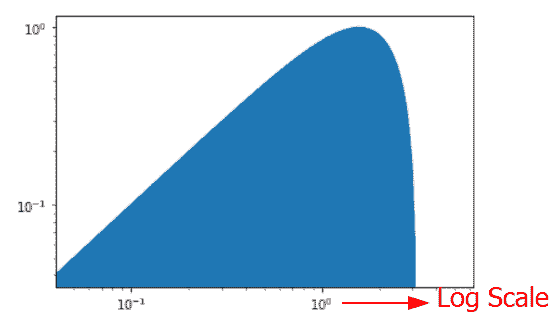
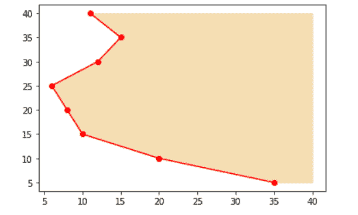

# matplotlib fill _ between–完整指南

> 原文：<https://pythonguides.com/matplotlib-fill_between/>

[](https://sharepointsky.teachable.com/p/python-and-machine-learning-training-course)

在本 [Python Matplotlib 教程](https://pythonguides.com/what-is-matplotlib/)中，我们将讨论 Python 中的 `Matplotlib fill_between` 。这里我们将介绍使用 `matplotlib` 填充 _between 的不同例子。我们还将讨论以下主题:

*   Matplotlib 填充 _ 之间
*   Matplotlib fill_between 示例
*   Matplotlib 填充 _ 颜色之间
*   Matplotlib 填充 _ 填充线之间
*   Matplotlib 填充 _ 步间
*   Matplotlib fill_between 阴影颜色
*   面颜色之间的 Matplotlib 填充
*   Matplotlib fill_between 图案填充密度
*   Matplotlib fill_between where
*   三行之间的 Matplotlib 填充
*   两条曲线之间的 Matplotlib 填充
*   散点之间的 Matplotlib 填充
*   虚线之间的 Matplotlib 填充
*   圆之间的 Matplotlib 填充
*   两行之间的 Matplotlib 填充
*   Matplotlib fill_between alpha
*   Matplotlib 填充 _ 对数刻度之间
*   Matplotlib 填充 _ 图例之间
*   Matplotlib fill_between 线条颜色
*   Matplotlib fill_between 线条宽度
*   Matplotlib fill_between 无边缘
*   Matplotlib 填充 _ 边缘之间
*   Matplotlib 填充 _ 边缘颜色之间
*   Matplotlib fill_between datetime
*   范围之间的 Matplotlib 填充
*   误差线之间的 Matplotlib 填充
*   两条垂直线之间的 Matplotlib 填充
*   两条水平线之间的 Matplotlib 填充
*   顶部之间的 Matplotlib 填充
*   熊猫之间的 Matplotlib 填充
*   0 之间的 Matplotlib 填充
*   点之间的 Matplotlib 填充
*   不同颜色之间的 Matplotlib 填充
*   样式之间的 Matplotlib 填充
*   fill_between 的 Matplotlib 标签
*   Matplotlib fill_between 插值
*   Matplotlib fill_between 置信区间
*   标准偏差之间的 Matplotlib 填充
*   x 轴之间的 Matplotlib 填充
*   多边形之间的 Matplotlib 填充
*   Matplotlib 填充 _ 极坐标间
*   Matplotlib fill_between 动画

目录

[](#)

*   [Matplotlib fill_between](#Matplotlib_fill_between "Matplotlib fill_between ")
*   [Matplotlib fill_between 示例](#Matplotlib_fill_between_example "Matplotlib fill_between example")
*   [Matplotlib fill _ between color](#Matplotlib_fill_between_color "Matplotlib fill_between color")
*   [Matplotlib fill _ between hatch](#Matplotlib_fill_between_hatch "Matplotlib fill_between hatch")
*   [Matplotlib fill_between 步骤](#Matplotlib_fill_between_step "Matplotlib fill_between step")
*   [Matplotlib fill_between 阴影颜色](#Matplotlib_fill_between_hatch_color "Matplotlib fill_between hatch color")
*   [Matplotlib 面间填充颜色](#Matplotlib_fill_between_facecolor "Matplotlib fill between facecolor")
*   [Matplotlib fill_between 影线密度](#Matplotlib_fill_between_hatch_density "Matplotlib fill_between hatch density")
*   [Matplotlib fill _ between where](#Matplotlib_fill_between_where "Matplotlib fill_between where")
*   [三行之间的 Matplotlib 填充](#Matplotlib_fill_between_three_lines "Matplotlib fill between three lines")
*   [两条曲线之间的 Matplotlib 填充](#Matplotlib_fill_between_two_curves "Matplotlib fill between two curves")
*   [散点间 Matplotlib 填充](#Matplotlib_fill_between_scatter "Matplotlib fill between scatter")
*   [虚线之间的 Matplotlib 填充](#Matplotlib_fill_between_dashed "Matplotlib fill between dashed")
*   [圆圈之间的 Matplotlib 填充](#Matplotlib_fill_between_circle "Matplotlib fill between circle")
*   [两行之间的 Matplotlib 填充](#Matplotlib_fill_between_two_lines "Matplotlib fill between two lines")
*   [Matplotlib fill _ between alpha](#Matplotlib_fill_between_alpha "Matplotlib fill_between alpha")
*   [Matplotlib fill _ between log scale](#Matplotlib_fill_between_log_scale "Matplotlib fill_between log scale")
*   [Matplotlib fill_between 图例](#Matplotlib_fill_between_legend "Matplotlib fill_between legend")
*   [Matplotlib fill_between 线条颜色](#Matplotlib_fill_between_line_color "Matplotlib fill_between line color")
*   [Matplotlib fill_between 线宽](#Matplotlib_fill_between_line_width "Matplotlib fill_between line width")
*   [Matplotlib fill _ between no edge](#Matplotlib_fill_between_no_edge "Matplotlib fill_between no edge")
*   [Matplotlib fill _ between edge](#Matplotlib_fill_between_edge "Matplotlib fill_between edge")
*   [Matplotlib fill _ between edge color](#Matplotlib_fill_between_edgecolor "Matplotlib fill_between edgecolor")
*   [Matplotlib fill _ between datetime](#Matplotlib_fill_between_datetime "Matplotlib fill_between datetime")
*   [Matplotlib 填充范围之间](#Matplotlib_fill_between_range "Matplotlib fill between range")
*   [误差线之间的 Matplotlib 填充](#Matplotlib_fill_between_error_bars "Matplotlib fill between error bars")
*   [两条垂直线之间的 Matplotlib 填充](#Matplotlib_fill_between_two_vertical_lines "Matplotlib fill between two vertical lines")
*   [两条水平线之间的 Matplotlib 填充](#Matplotlib_fill_between_two_horizontal_lines "Matplotlib fill between two horizontal lines")
*   [Matplotlib 填充在顶部之间](#Matplotlib_fill_between_on_top "Matplotlib fill between on top")
*   [Matplotlib 填充 _ 熊猫之间](#Matplotlib_fill_between_pandas "Matplotlib fill_between pandas")
*   [Matplotlib 在 0 之间填充](#Matplotlib_fill_between_0 "Matplotlib fill between 0")
*   [点与点之间的 Matplotlib 填充](#Matplotlib_fill_between_points "Matplotlib fill between points")
*   [不同颜色之间的 Matplotlib 填充](#Matplotlib_fill_between_different_colors "Matplotlib fill between different colors")
*   [样式间 Matplotlib 填充](#Matplotlib_fill_between_style "Matplotlib fill between style")
*   [用于 fill_between 的 Matplotlib 标签](#Matplotlib_label_for_fill_between "Matplotlib label for fill_between")
*   [Matplotlib fill_between 插值](#Matplotlib_fill_between_interpolate "Matplotlib fill_between interpolate ")
*   [Matplotlib fill_between 置信区间](#Matplotlib_fill_between_confidence_interval "Matplotlib fill_between confidence interval")
*   [标准偏差之间的 Matplotlib 填充](#Matplotlib_fill_between_standard_deviation "Matplotlib fill between standard deviation")
*   [x 轴之间的 Matplotlib 填充](#Matplotlib_fill_between_x_axis "Matplotlib fill between x axis")
*   [多边形之间的 Matplotlib 填充](#Matplotlib_fill_between_polygon "Matplotlib fill between polygon")
*   [Matplotlib 填充 _ 极坐标间](#Matplotlib_fill_between_polar "Matplotlib fill_between polar")
*   [Matplotlib fill_between 动画](#Matplotlib_fill_between_animation "Matplotlib fill_between animation")

## Matplotlib fill_between

在这一节中，我们将学习 Python 中 matplotlib 的 pyplot 模块中的 `fill_between` 函数。

*   `fill_between` 函数用于填充两条水平曲线或直线之间的空间或区域。点 **(x，y1)** 和 **(x，y2)** 用于定义**曲线**，这些曲线形成一个或多个描述填充区域的多边形。
*   通过使用“ ***其中*** ”参数，您可以忽略一些水平截面的填充。
*   默认情况下，边直接连接所提供的位置。但是，如果填充应该是阶跃函数(x 之间的常数)，则可以使用 `"step"` 参数。

**fill _ between 函数的语法是:**

```py
matplotlib.pyplot.fill_between(x, y1, y2=0, where=None, 
                              interpolate=False, 
                              step=False, *, 
                              data=None, **kwargs) 
```

**fill _ between 函数的参数有:**

| **参数** | **值** | **描述** |
| x | 长度为 N 的数组 | x 坐标的节点用于定义曲线。 |
| y1 | 长度为 N 或标量的数组 | 节点的 y 坐标，用于定义第一条曲线。 |
| y2 | 默认情况下，长度为 N 或标量
的数组:0 | 节点的 y 坐标，用于定义第二条曲线 |
| 在哪里 | 长度为 N 的布尔值数组 | 当需要从填充中排除一些水平区域时，使用它。这里，填充区域由坐标 x[其中]定义。更准确地说，在 x[i]和 x[i+1]之间填充 if where[i]和 where[i+1]。
**注:** 这个定义意味着一个孤立的 ***真值*** 在两个 ***假值*** 中 ***在*** 中不会导致填充。
由于邻近 ***假*** 值，两边的 ***真*** 位置仍然空着。 |
| 插入 | bool
默认为:False | 仅当使用了 where 参数并且两条曲线相交时，才使用此选项。 ***其中*** 用于 ***y1 > y2*** 或 ***类似*** 。
默认情况下，用于定义填充区域的多边形的节点仅插入 x 数组位置。上面的语义似乎无法描述这样的多边形。
x 截面中的交叉点被简单剪切。当您将“插值”设置为“真”时，填充区域将延伸到实际的交点。 |
| 步骤 | { '前'，'后'，'头脑' } | 如果填充是一个阶跃函数，即 x 之间的常数，则使用该参数。该值决定了阶跃将发生的位置:
***“前”****:**y 值从每个 x 位置持续向左。
*** " post ":**y 值从每个 x 位置持续向右。
***“mid”:**如果步进发生在 x 位置的中间。 |
| 数据 | 可转位对象 | 此参数还接受字符串，该字符串被解释为数据(除非出现异常)。 |
| ** kwargs |  | 用于控制多边形属性的所有其他参数。 |

Parameters

**退货:**

从 PolyCollection 返回一个绘制的多边形。

另外，检查:[画垂直线 matplotlib](https://pythonguides.com/draw-vertical-line-matplotlib/)

## Matplotlib fill_between 示例

这里我们将学习一个简单的 `fill_between()` 函数的例子。我们将使用 matplotlib 的 `plot()` 方法创建一个简单的线图，然后使用 `fill_between` 函数填充曲线下的整个区域。

**源代码:**

```py
**# Import Library**

import matplotlib.pyplot as plt

**# Define data coordinates**

x = [0, 1, 2, 3, 4, 5]
y = [1.5, 3, 5.3, 6, 10, 2]

**# Plot**

plt.plot(x, y, '-o', color='red')

**# fill_between**

plt.fill_between(x, y)

**# Add title**

plt.suptitle('Simple fill_between Example', fontweight='bold')

**# Display**

plt.show() 
```

**源代码说明:**

*   为了导入 matplotlib 库，我们使用 `import matplotlib.pyplot` 。
*   之后，我们定义 x 和 y 数据坐标，它们定义了曲线。
*   为了创建一个线图，我们使用 `plt.plot()` 方法。
*   为了填充曲线下的整个区域，我们使用 `plt.fill_between()` 方法。
*   然后我们添加一个 suptitle，通过使用 `plt.suptitle()` 方法。
*   为了在用户的屏幕上可视化绘图，我们使用了 `plt.show()` 方法。

**输出:**


fill_between

读取: [Matplotlib 反转 y 轴](https://pythonguides.com/matplotlib-invert-y-axis/)

## Matplotlib fill _ between color

这里我们将学习如何使用 Python 在 matplotlib 中用你选择的颜色填充图形区域。为此，我们必须将一个**颜色**参数传递给 `fiil_between` 函数，并设置您选择的颜色。

**以下是语法:**

```py
matplotlib.pyplot.fill_between(x, y, color=None)
```

**源代码:**

```py
**# Import Library**

import matplotlib.pyplot as plt

**# Define data coordinates** 
x = [0, 1, 2, 3, 4, 5]
y = [1.5, 3.6, 4.6, 5, 8, 2.5]

**# Plot**

plt.plot(x, y, '-o')

**# fill_between**

plt.fill_between(x, y, color='yellow')

**# Add title**

plt.suptitle('fill_between color', fontweight='bold')

**# Display**

plt.show() 
```

**源代码说明:**

*   首先，我们导入 `matplotlib.pyplot` 库。
*   之后，我们定义定义曲线的数据坐标。
*   为了绘制折线图，我们使用 matplotlib 的 `plt.plot()` 方法。
*   然后用你选择的颜色填充曲线下的区域，我们将 `color` 作为参数传递给 `fill_between` 函数。
*   通过使用 `plt.suptitle()` 方法，我们定义了绘图的标题。
*   为了在用户屏幕上可视化图表，我们使用了 `plt.show()` 方法。

**生成的图表:**


fill_between(color=’yellow’)

阅读:[将图例放在绘图 matplotlib 之外](https://pythonguides.com/put-legend-outside-plot-matplotlib/)

## Matplotlib fill _ between hatch

在本节中，我们将了解**填充 _ 在**和**之间填充**。我们已经在上述主题中学习了 `fill_between` 。现在是时候学习一些关于**舱口**的知识了。

在大多数情况下，我们在创建地块时使用颜色填充背景，但在以下情况下，使用图案填充背景是一种很好的替代方法:

*   当绘图包括黑白背景时。
*   当我们想减少颜色的数量时。

为了用图案填充图，我们分配一个新的参数**影线**，其值为一个字符串。部分字符串值有: `/` 、 **\\** 、 **|** 、**–**、 `+` 、 `x` 、 `o` 、**。**， `*`

**语法如下:**

```py
matplotlib.pyplot.fill_between(x, y, hatch=None)
```

**源代码:**

```py
**# Import Library** 
import matplotlib.pyplot as plt

**# Define data coordinates**

x = [2, 6]
y = [2, 6]

**# Plot** 
plt.plot(x, y)

**# fill_between**

plt.fill_between(x, y, color= 'none', hatch="o",   
                 edgecolor="g")

**# Display**

plt.show()
```

**源代码说明:**

*   这里我们用一个绕过 matplotlib 的 `fill_between()` 方法的 `hatch` 参数的图案填充曲线下面的整个区域。我们还将 `none` 分配给 `color` 参数，这样背景就保持了纯色。
*   我们将**绿色**分配给**边缘颜色**参数。

**输出:**


fill_between(hatch=’o’)

阅读: [Matplotlib 另存为 pdf](https://pythonguides.com/matplotlib-save-as-pdf/)

## Matplotlib fill_between 步骤

这里我们将学习**步骤**参数。如果填充应在 x 之间保持不变，则使用该参数。

**以下是语法:**

```py
matplotlib.pyplot.fill_between(x, y, step=None)
```

**源代码:**

```py
**# Import Library**

import matplotlib.pyplot as plt
import numpy as np

**# Define data coordinates**

x = np.linspace(20, 10, 100)
y1 = np.sin(x)
y2 = np.cos(x)

**# Plot**

plt.plot(x, y1)
plt.plot(x, y2)

**# fill_between**

plt.fill_between(x, y1, step="pre", alpha=0.2)
plt.fill_between(x, y2, step="pre", alpha=5.5)

**# Display**

plt.show() 
```

**说明:**

*   这里我们导入了 `matplotlib.pyplot` 和 `numpy` 库。
*   之后，我们使用 `numpy` 定义数据坐标。
*   为了绘制曲线 **(x，y1)** 和 **(x，y2)** ，我们使用 matplotlib 的 `plt.plot()` 方法。
*   为了填充曲线下方的区域，我们使用了 `fill_between()` 方法，并使用 `step` 参数传递 `x` 和 `y` ，并将它们赋值为 `"pre"` 。该值决定了该步骤发生的位置。
*   要显示该图，请使用 `show()` 方法。

**输出:**


fill_between(step=’pre’)

阅读: [Matplotlib 标题字体大小](https://pythonguides.com/matplotlib-title-font-size/)

## Matplotlib fill_between 阴影颜色

这里我们将了解当我们使用 `color` 作为参数来指定颜色时，hatch 会发生什么。

**以下是语法:**

```py
matplotlib.pyplot.fill_between(x, y, hatch=None, color=None)
```

**源代码:**

```py
**# Import Library**

import matplotlib.pyplot as plt

**# Define data coordinates**

x = [1, 3]
y = [1, 3]

**# Plot**

plt.plot(x, y)

**# fill_between**

plt.fill_between(x, y, hatch='+', color='red')

**# Display**

plt.show()
```

**说明:**

*   在上面的例子中，我们定义了数据坐标 x 和 y，并使用 matplotlib 的 `plt.plot()` 方法绘制曲线。
*   之后，我们使用带有 `x` 、 `y` 、**阴影、**和**颜色**的 `fill_between()` 函数作为参数，并分别将它们的值设置为 **x 坐标**、 **y 坐标**、 `+` 和**红色**。

**输出:**


hatch with color

**观察:**

指定颜色时，阴影在输出中不可见。

## Matplotlib 面间填充颜色

这里我们将看到一个例子，其中我们使用了带有 `facecolor` 参数的 `fill_between()` 函数。

**以下是语法:**

```py
matplotlib.pyplot.fill_between(x, y, hatch=None, facecolor=None)
```

**源代码:**

```py
**# Import Library**

import matplotlib.pyplot as plt
import numpy as np

**# Define data coordinates**

x = np.linspace(20, 10, 100)
y = np.sin(x)

**# Plot** 
plt.plot(x, y)

**# fill_between**

plt.fill_between(x, y, hatch='O', facecolor='yellow')

**# Display** 
plt.show()
```

**源代码说明:**

*   在上面的例子中，我们使用 numpy 的 `linespace()` 和 `sin()` 方法来定义数据坐标。
*   为了绘制曲线，我们使用 matplotlib 的 `plt.plot()` 方法。
*   然后我们使用带有 `x` 、 `y` 、 `hatch` 和 `facecolor` 参数的 `fill_between()` 方法。


fill_between(facecolor=’yellow’)

**结论:**

当使用 `facecolor` 参数时，阴影在输出中可见，但当我们使用 `color` 参数时，阴影不可见。

阅读: [Matplotlib 默认图形尺寸](https://pythonguides.com/matplotlib-default-figure-size/)

## Matplotlib fill_between 影线密度

在这里，我们将学习如何增加填充图案的密度。为了获得更密集的图案，我们必须将偶数**中的图案串**分配给**影线**参数。

**以下是语法:**

```py
matplotlib.pyplot.fill_between(x, y, hatch=string pattern in even number)
```

**源代码:**

```py
**# Import Library** 
import matplotlib.pyplot as plt
import numpy as np

**# Define data coordinates** 
x = np.linspace(20, 10, 100)
y = np.cos(x)

**# Plot**

plt.plot(x, y)

**# fill_between** 
plt.fill_between(x, y, hatch='\\\\', facecolor='cyan')

                            **# OR**

plt.fill_between(x, y, hatch='\\\\\\\\', facecolor='cyan')

**# Display**

plt.show()
```

**说明:**

*   这里我们使用带有 `facecolor` 和 `hatch` 参数的 `fill_between()` 方法，并将它们的值分别设置为**青色**、**反斜杠**。
*   在第一种情况下，我们通过 **4 个反斜杠**，在第二种情况下，我们通过 **8 个反斜杠**。

**输出:**


With 4 slashes


With 8 slashes

**结论:**

我们得出结论，我们可以通过增加图案的数量来增加影线的密度。

读取: [Matplotlib savefig 空白图像](https://pythonguides.com/matplotlib-savefig-blank-image/)

## Matplotlib fill _ between where

这里我们将学习一下 `fill_between()` 方法的 `where` 参数。当需要从填充中排除一些水平区域时，使用该参数。

**以下是语法:**

```py
matplotlib.pyplot.fill_between(x, y, where= condition applied )
```

**源代码:**

```py
**# Import Library**

import matplotlib.pyplot as plt
import numpy as np

**# Define data coordinates** 
x = np.linspace(0,10,25)
y = np.sin(x)

**# Plot curves**

plt.plot(x,y, color='k')

**# fill_between**

plt.fill_between(x, y, where = (x > 5) & (y <= 4),
                 color = 'orange')
**# Display**

plt.show()
```

**说明:**

*   在上面的例子中，我们首先导入重要的库，如 `matplotlib.pyplot` 和 `numpy` 。
*   之后，我们通过使用 `numpy` 函数来定义数据坐标。
*   要绘制曲线，请使用 pyplot 的 `plot()` 方法。
*   接下来，我们使用带有**的 `fill_between()` 方法，其中**参数指定了填充区域的条件。这里我们指定填充 x > 5 和 y < =4 之间区域的条件。


fill_between(where)

读: [Matplotlib 另存为 png](https://pythonguides.com/matplotlib-save-as-png/)

## 三行之间的 Matplotlib 填充

在本节中，我们将看到在填充三条线之间的区域时使用 `fill_between` 。

**源代码:**

```py
**# Import Library**

import matplotlib.pyplot as plt
import numpy as np

**# Define Data** 
x = np.linspace(0,3,100)
y1 = X**4 + 20
y2 = np.exp(X) + 5
y3 = np.sin(X)

**# Plot**

plt.plot(x , y1, color='k')
plt.plot(x, y2, color='k')
plt.plot(x, y3, color='k')

**# fill_between** 
plt.fill_between(x, y1, y2, color='red')
plt.fill_between(x, y2, y3, color='yellow')

**# Display**

plt.show()
```

**说明:**

*   在上面的例子中，我们创建了三个线条图，通过使用 `fill_between()` 方法，我们用不同的颜色填充线条之间的区域。
*   首先，我们使用 `fill_between()` 方法填充 y1 和 y2 之间的区域，并使用参数 `color` 设置红色。
*   然后，我们使用 `fill_between()` 方法填充 y2 和 y3 之间的区域，并使用**颜色**参数将其颜色设置为黄色。


fill between three lines

阅读:[在 Python 中添加文本到 plot matplotlib](https://pythonguides.com/add-text-to-plot-matplotlib/)

## 两条曲线之间的 Matplotlib 填充

这里我们看到一个例子，我们使用 `fill_between()` 方法填充两条曲线之间的区域。

**源代码:**

```py
**# Import Library**

import matplotlib.pyplot as plt
import numpy as np

**# Define Data**

x = np.arange(0.01,20,0.1)
y1 = 5.0 / np.exp(x)
y2 = np.log(x)

**# Plot**

plt.plot(x, y1, color='k')
plt.plot(x, y2, color='k')

**# fill_between**

plt.fill_between(x, y1, y2, color='red')

**# Display** 
plt.show()
```

*   这里我们使用 numpy 的 `arange()` 、 `exp()` 、 `log()` 方法来创建曲线。
*   然后我们使用 `fill_between()` 方法填充曲线之间的区域。


fill between curves

阅读: [Matplotlib 条形图标签](https://pythonguides.com/matplotlib-bar-chart-labels/)

## 散点间 Matplotlib 填充

这里我们将看到一个例子，我们使用 matplotlib 库的 `fill_between` 方法填充散点图之间的区域。

**源代码:**

```py
**# Import library**

import matplotlib.pyplot as plt
import numpy as np

**# Define Data** 
x = np.arange(0, 20, 0.2)
y1 = np.sin(x)
y2 = np.cos(x)

**# Scatter Plot**

plt.scatter(x, y1)
plt.scatter(x, y2)

**# fill_between**

plt.fill_between(x, y1, where = (x <=3 ) & (y1 <= 4))

**# Display** 
plt.show() 
```

这里我们使用 `plt.scatter()` 方法创建一个散点图，然后使用 `fill_between()` 方法填充 **x < = 3** 和 **y1 < =4** 的区域。


fill between scatter

阅读:[Matplotlib set _ yticklabels–实用指南](https://pythonguides.com/matplotlib-set_yticklabels/)

## 虚线之间的 Matplotlib 填充

这里我们将看到一个虚线图的例子。

**源代码:**

```py
**# Import library**

import matplotlib.pyplot as plt
import numpy as np

**# Define Data coordinates**

x = np.arange(2, 8, 0.2)
y = x*2

**# Plot**

plt.plot(x,y,'k--', linewidth = 8)

**# fill_between**

plt.fill_between(x, y, np.min(x), color='m')

**# Display**

plt.show()
```

**说明:**

*   在上面的例子中，我们导入了 `matplotlib.pypplot` 和 `numpy` 库。
*   接下来，我们使用 numpy 的 `arange()` 方法定义数据坐标。
*   然后我们使用 `plot()` 方法和 `linestyle` 参数在 x 和 y 之间绘制一条**虚线**。
*   为了填充两条水平曲线之间的区域，我们使用了 `fill_between()` 方法，我们还将区域的颜色指定为**洋红色**。


fill between dashed

阅读:[Matplotlib tight _ layout–有用教程](https://pythonguides.com/matplotlib-tight-layout/)

## 圆圈之间的 Matplotlib 填充

在这里，我们将看到一个例子，我们填补了圆圈之间的颜色。

**源代码:**

```py
**# Import Library**

import numpy as np
import matplotlib.pyplot as plt

**# Create subplots**

figure, axes = plt.subplots( 1 )

**# Define Data**

data = np.linspace( 0 , 2 * np.pi , 150 )
radius = 0.6
a = radius * np.cos( data )
b = radius * np.sin( data )

**# Plot**

axes.plot( a, b )

**# fill between**

plt.fill_between(a, b, facecolor='yellow')

**# Display**

plt.show()
```

*   这里我们用圆的参数方程画一个圆。
*   之后，我们使用 `fill_between()` 方法填充圆之间的区域。


fill between circle

阅读:[Python Matplotlib tick _ params](https://pythonguides.com/matplotlib-tick-params/)

## 两行之间的 Matplotlib 填充

在这里，我们将看到一个例子，我们将阴影两条线之间的区域。

**源代码:**

```py
**# Import Library**

import matplotlib.pyplot as plt

**# Define Data coordinates**

x =  [0, 1, 2, 3, 4, 5]
y1 = [30, 60, 90, 120, 150, 180]
y2 = [20, 40, 60, 80, 100, 120]

**# Shade the region**

plt.fill_between(x, y1, y2, facecolor='pink')

**# Show the plot** 
plt.show()
```

这里我们使用 `fill_between()` 方法对两条线之间的区域进行着色。我们还传递了 `facecolor` 参数，并将其值设置为 `pink` 。


fill between two lines

读取: [Matplotlib x 轴标签](https://pythonguides.com/matplotlib-x-axis-label/)

## Matplotlib fill _ between alpha

这里我们将学习在 fill_between()方法中使用 alpha 参数。通过使用一个 `alpha` 属性，我们可以调节图形绘制的透明度，默认情况下， `alpha=1` 。

**以下是语法:**

```py
matplotlib.pyplot.fill_between(x, y, facecolor=None, alpha=1)
```

**源代码:**

```py
**# Import Library**

import matplotlib.pyplot as plt
import numpy as np

**# Define data coordinates**

x = np.arange(2, 8, 0.2)
y = np.sin(30*x)

**# Plot**

plt.plot(x, y)

**# fill_between**

plt.fill_between(x, y, facecolor='blue', alpha=0.2)

**# Display**

plt.show()
```

在这里，我们将使用 `fill_between()` 方法对区域进行着色，我们还将传递 `facecolor` 和 `alpha` 参数来分别设置绘图的**颜色**和**透明度**。

**输出:**


fill_between(alpha=1)

阅读: [Matplotlib 多条形图](https://pythonguides.com/matplotlib-multiple-bar-chart/)

## Matplotlib fill _ between log scale

在本节中，我们将学习在 matplotlib python 中以对数比例填充曲线下的区域。为了创建对数刻度，我们将轴的刻度设置为对数。

**设置坐标轴刻度的语法:**

```py
**# For x-axis**
matplotlib.pyplot.xscale('log')
**# For y-axis**
matplotlib.pyplot.yscale('log')
```

**我们来看一个例子:**

**源代码:**

```py
**# Import Library**

import matplotlib.pyplot as plt
import numpy as np

**# Define data coordinates**

x = np.linspace(-5, 5, 100)
y = np.sin(x)

**# Plot**

plt.plot(x, y)

**# fill_between**

plt.fill_between(x, y)

**# Log scale**

plt.xscale('log')
plt.yscale('log')

**# Display**

plt.show() 
```

**说明:**

*   我们导入了 `matplotlib.pyplot` 和 `numpy` 库。
*   接下来，我们使用 `numpy` 创建数据点。
*   然后，我们使用 `plot()` 方法绘制 x 和 y 数据点。
*   为了填充曲线之间的区域，我们使用了 `fill_between()` 方法。
*   为了创建一个**对数刻度**，我们设置轴的刻度。
*   要显示该图，请使用 `show()` 方法。

**输出:**



fill_between log scale

阅读: [Matplotlib 散点图图例](https://pythonguides.com/matplotlib-scatter-plot-legend/)

## Matplotlib fill_between 图例

我们将在这里学习向 fill_between 图添加图例。

**以下是语法:**

```py
matplotlib.pyplot.fill_between(x,y, y1, label=) 
```

**源代码:**

```py
**# Import Library**

import matplotlib.pyplot as plt
import numpy as np

**# Define data coordinates**

x = np.linspace(-2, 2, 100)
y1 = np.sin(x)
y2 = np.cos(x)

**# Plot** 
plt.plot(x, y1, color='k', label='Sin')
plt.plot(x, y2, color='k', label='Cos')

**# fill_between**

plt.fill_between(x, y1, y2, color='cyan', label='Area')

**# Add legend** 
plt.legend()

**# Display** 
plt.show()
```

**说明:**

*   我们导入 `matplotlib.pyplot` 和 `numpy` 库。
*   使用 `numpy` 创建 x、y1 和 y2 数据点。
*   为了绘制 x、y1 和 y2 数据点，我们使用了 `plot()` 方法。
*   `fill_between()` 方法用于填充两条曲线之间的区域。
*   为了在图上放置一个图例，我们使用了 `legend()` 方法。
*   要显示该图，请使用 `show()` 方法。

**输出:**


fill_between(label=)

阅读: [Matplotlib 3D 散点图](https://pythonguides.com/matplotlib-3d-scatter/)

## Matplotlib fill_between 线条颜色

这里我们将学习如何用**填充 _ 间隔**方法改变**线条颜色**。要改变线条的颜色，我们必须将参数 `edgecolor` 传递给这个方法。

**以下是语法:**

```py
matplotlib.fill_between(x, y1, y2, edgecolor=None)
```

**源代码:**

```py
**# Import Library**

import matplotlib.pyplot as plt

**# Define Data coordinates**

x =  [0, 1, 2, 3, 4, 5]
y1 = [30, 60, 90, 120, 150, 180]
y2 = [20, 40, 60, 80, 100, 120]

**# Shade the region**

plt.fill_between(x, y1, y2, facecolor='pink', 
                 edgecolor='green')

**# Show the plot** 
plt.show()
```

**说明:**

*   我们导入 `matplotlib.pyplot` 方法。
*   接下来，我们定义数据坐标 x、y1 和 y2。
*   为了填充曲线之间的区域，我们使用 `fill_between()` 方法，并传递 `facecolor` 参数来设置颜色。
*   为了用 `fill_between()` 方法改变线条颜色，我们将 `edgecolor` 参数传递给该方法。这里我们设置线条颜色为**绿色**。

**输出:**


fill_between(edgecolor=None)

阅读:[堆积条形图 Matplotlib](https://pythonguides.com/stacked-bar-chart-matplotlib/)

## Matplotlib fill_between 线宽

这里我们将学习如何用 `fill_between` 方法改变**线宽**。基本上，**线宽**参数在曲线之间的填充周围画一个边界。

**以下是语法:**

```py
matplotlib.fill_between(x, y1, y2, linewidth=None)
```

**源代码:**

```py
**# Import Library**

import matplotlib.pyplot as plt
import numpy as np

**# Define data coordinates**

x = np.linspace(-3, 3, 1000)
y = np.sin(x)

**# fill_between with linewidth**

plt.fill_between(x, y, facecolor='orange', linewidth=15,     
                 edgecolor='k')

**# Display** 
plt.show()
```

**说明:**

*   我们使用 `numpy` 定义数据坐标。
*   为了填充曲线下的区域，我们使用了 `fill_between()` 方法。
*   为了设置绘图的表面颜色和边缘颜色，我们传递**表面颜色**和**边缘颜色**参数，并分别设置它们的值**橙色**和**黑色**。
*   为了改变线条或边缘的**宽度**，我们传递**线宽**参数，并将其值设置为 `15` 。它会在曲线周围创建一个边界。

**输出:**


fill_between(linewidth=15)

阅读: [Matplotlib 两个 y 轴](https://pythonguides.com/matplotlib-two-y-axes/)

## Matplotlib fill _ between no edge

这里，我们将填充曲线之间或之下没有边缘的区域。为此，我们必须将**线宽**设置为**零**。

**以下是语法:**

```py
matplotlib.pyplot.fill_between(x, y, linewidth=0)
```

**源代码:**

```py
**# Import Library**

import matplotlib.pyplot as plt
import numpy as np

**# Define data coordinates** 
x = np.linspace(-3, 3, 1000)
y = np.cos(x)

**# fill_between no edges**

plt.fill_between(x, y, facecolor='m', linewidth=0)

**# Display**

plt.show()
```

在上面的例子中，我们将**线宽**设置为**零**，并将其传递给 `fill_between` 方法，以获得没有边缘的曲线。

**输出:**


fill_between no edges

读取:[水平线 matplotlib](https://pythonguides.com/horizontal-line-matplotlib/)

## Matplotlib fill _ between edge

这里我们要用边缘填充曲线之间或之下的区域。为此，我们必须将**线宽**设置为某个值。

**以下是语法:**

```py
matplotlib.pyplot.fill_between(x, y, color=None, linewidth=20)
```

**源代码:**

```py
**# Import Library**

import matplotlib.pyplot as plt
import numpy as np

**# Define data coordinates**

x = np.linspace(-3, 3, 1000)
y = np.cos(x)

**# Plot**

plt.plot(x, y)

**# fill_between no edges**

plt.fill_between(x, y, color='yellow', linewidth=20)

**# Display**

plt.show()
```

*   在上面的例子中，我们使用 `fill_between()` 方法来填充曲线之间的区域。这里我们还设置了颜色绕过方法的**颜色**参数。
*   我们增加了**宽度**，绕过了该方法的**线宽**参数，因此我们得到了带有边缘的绘图。


fill_between(linewidth=20)

阅读: [Matplotlib 绘图条形图](https://pythonguides.com/matplotlib-plot-bar-chart/)

## Matplotlib fill _ between edge color

这里我们看到了一个例子，在 `fill_between` 方法中的 `edgecolor` 参数。

**举例:**

```py
**# Import Library** 
import matplotlib.pyplot as plt
import numpy as np

**# Define data coordinates**

x = np.linspace(-3, 3, 1000)
y = np.cos(x)

**# fill_between edge color**

plt.fill_between(x, y, color='pink', edgecolor='red')

**# Display**

plt.show()
```


fill_between(edgecolor=None)

阅读: [Python 使用 Matplotlib 绘制多条线](https://pythonguides.com/python-plot-multiple-lines/)

## Matplotlib fill _ between datetime

这里我们看到了日期时间图中的 `fill_between()` 方法的一个例子。

**源代码:**

```py
**# Import Library**

import numpy as np
import matplotlib.pyplot as plt
import pandas as pd

**# Define Data**

N = 500
dates = pd.date_range('2021-5-1', periods=N, freq='D')
x = np.linspace(0, 5, N)
data = pd.DataFrame({'A': np.cos(x), 'B': np.sin(x),
               'Date': dates})

**#Plot**

plt.plot_date(data['Date'], data['A'], '-')
plt.plot_date(data['Date'], data['B'], '-')

d = data['Date'].values

**# fill_between**

plt.fill_between(d, data['A'], data['B'],
                where=data['A'] <= data['B'],
                facecolor='yellow')

**# Rotation of xticks**

plt.xticks(rotation=45)

**# Display** 
plt.show()
```

*   在上面的例子中，我们导入了导入库，比如 `matplotlib` 、 `numpy` 和 `pandas` 。
*   之后，我们使用 pandas 的 `date_range()` 方法和 numpy 的 `sin()` 和 `cos()` 方法定义数据坐标。
*   然后我们用 `plt.plot_date()` 方法来绘制日期。
*   为了填充日期图曲线之间的区域，我们使用带有参数**的 `fill_between()` 方法。**
*   我们还设置了 xtciks 的**旋转**,以避免 x 轴上的日期重叠。
*   要显示绘图，使用 `show()` 方法。


fill_between()

## Matplotlib 填充范围之间

这里我们看到一个使用 python 的 `range()` 方法定义数据坐标的例子。为了填充曲线下方的区域，我们使用了 `fill_between()` 方法。

**下面是` `range()方法的语法:**

```py
range(start, stop, step)
```

**源代码:**

```py
**# Import Library**

import matplotlib.pyplot as plt

**# Define data coordinates**

x = range(3, 20, 2)
y = range(5, 22, 2)

**# Plot**

plt.plot(x, y)

**# fill_between**

plt.fill_between(x, y, facecolor='green')

**# Display**

plt.show()
```

*   在上面的源代码中，我们导入了 `matplotlib.pyplot` 库。
*   然后我们使用 python 的 `range()` 方法定义数据坐标。
*   要绘制图形，请使用 `plot()` 方法。
*   要填充曲线下方的区域，使用 `fill_between()` 方法。

**输出:**


range(start, stop, step)

## 误差线之间的 Matplotlib 填充

我们知道如何使用误差线在图表上显示误差。现在，我们将学习如何使用 `fill_between` 方法来消除错误。

**以下是语法:**

```py
matplotlib.pyplot.fill_between(x, y-lower, y-upper)
```

**以下是参数:**

*   **x:** 指定绘图的 x 坐标。
*   **lower:** 指定阴影区域的底部。
*   **上部:**指定阴影区域的顶部。

**举例:**

```py
**# Import Library**

import matplotlib.pyplot as plt

**# Define data coordinates**

x = range(8)
y = [10, 12, 13, 13, 20, 22, 23, 29]

**# Define errors**

y_lower_error = [8, 10, 11, 17, 18, 20, 21, 27]
y_upper_error = [12, 14, 15, 15, 17, 24, 25, 31]

**# plot**

plt.plot(x, y) 

**# fill_between**

plt.fill_between(x, y_lower_error, y_upper_error, 
                 facecolor='yellow') 

**# Display**

plt.show()
```

在上面的例子中，我们使用 `fill_between` 方法来对错误进行着色，因此我们将 `x` 、 `y_lower_error` 、 **y_upper_error、**和 `facecolor` 传递给该方法。


Shade Errors

## 两条垂直线之间的 Matplotlib 填充

我们将学习填充两条垂直线或曲线之间的区域。为了填充这个区域，我们使用 fill_betweenx()方法。这里，曲线由点(y，x1)和(y，x2)定义。

**以下是语法:**

```py
matplotlib.pyplot.fill_betweenx(y, x1, x2, where=None, step=None,, interpolate=False, * , data=None, **kwargs)
```

**我们来看一个例子:**

**源代码:**

```py
**# Import Library**

import matplotlib.pyplot as plt
import numpy as np

**# Define data coordinates**

x = np.arange(0, 30, 0.2)
y = np.arange(30, 60, 0.2)

**# Plot** 
plt.plot(x,y)

**# Vertical line** 
plt.fill_betweenx(y, 15, 20, facecolor='green')

**# Display** 
plt.show()
```

在上面的源代码中，我们使用了 `fill_betweenx()` 方法来填充两条垂直线之间的区域。


fill_betweenx()

## 两条水平线之间的 Matplotlib 填充

我们将学习填充两条水平线或曲线之间的区域。为了填充这个区域，我们使用了 `fill_between()` 方法。这里，曲线由点(x，y1)和(x，y2)定义。

**以下是语法:**

```py
matplotlib.pyplot.fill_betweenx(x, y1, y2, where=None, step=None,, interpolate=False, * , data=None, **kwargs)
```

**我们来看一个例子:**

**源代码:**

```py
**# Import Library**

import matplotlib.pyplot as plt
import numpy as np

**# Define data coordinates**

x = np.arange(0, 30, 0.2)
y = np.arange(30, 60, 0.2)

**# Plot**

plt.plot(x,y)

**# Horizontal line**

plt.fill_between(x, 30, 35, facecolor='m')

**# Display**

plt.show()
```

**说明:**

*   在上面的例子中，我们导入了 `matplotlib.pyplot` 和 `numpy` 库。
*   接下来，我们使用 numpy 的 `arange()` 方法定义数据坐标。
*   然后使用 `plot()` 方法绘制直线。
*   要填充两条水平线之间的区域，请使用 `fill_between()` 方法。
*   要显示该图，请使用 `show()` 方法。


fill_between()

## Matplotlib 填充在顶部之间

在这里，我们将学习填充曲线上方的颜色。

让我们看看与此相关的例子:

**例#1**

```py
**# Import Library** 
import matplotlib.pyplot as plt
import numpy as np

**# Define data coordinates**

x = np.arange(0, 50, 0.5)
y = x**5

**# Plot**

plt.plot(x,y)

**# Top of curve**

plt.fill_between(x, y, np.max(y), facecolor='chocolate')

**# Display**

plt.show()
```

在上面的例子中，为了填充曲线顶部的颜色，我们使用了带有参数 `max(y)` 的 `fill_between()` 方法。


max(y)

**例 2**

```py
**# Import Library**

import matplotlib.pyplot as plt
import numpy as np

**# Define data coordinates**

x = np.arange(0, 50, 0.2)
y = np.cos(30*x)

**# Plot**

plt.plot(x,y)

**# Top of the curve** 
plt.fill_between(x, y, 1, facecolor='lime')

**# Display**

plt.show()
```

在上面的例子中，我们使用 `fill_between` 方法在绘图中填充颜色。这里，曲线由点 **(x，y1)** 和 **(x，y2)** 定义。为了填充曲线上方的区域**，我们设置 `y2 = 1` 。**

**输出:**


y2=1

## Matplotlib 填充 _ 熊猫之间

我们将学习填充使用熊猫数据框创建的曲线之间的区域。

**源代码:**

```py
**# Import Library** 
import numpy as np
import matplotlib.pyplot as plt
import pandas as pd

**# Define Data** 
N = 100
dates = pd.date_range('2020-5-1', periods=N)
x = np.linspace(0, 10, N)
data = pd.DataFrame({'X': np.exp(x), 'Y': np.sin(x),
               'Date': dates})

**# Plot**

plt.plot_date(data['Date'], data['X'], '-')
plt.plot_date(data['Date'], data['Y'], '-')

d = data['Date'].values

**# fill_between**

plt.fill_between(d, data['X'], data['Y'],
                where=data['X'] > data['Y'],
                facecolor='lightgray')

**# Rotation of xticks**

plt.xticks(rotation=45)

**# Display**

plt.show()
```


fill_between Pandas

## Matplotlib 在 0 之间填充

我们将学习在区域 y1 和 0 之间填充颜色。

**源代码:**

```py
**# Import Library**

import matplotlib.pyplot as plt
import numpy as np

**# Define data coordinates**

x = np.arange(0, 10, 0.5)
y = np.sin(30*x)

**# Plot**

plt.plot(x,y)

**# Between y1 and 0**

plt.fill_between(x, y, 0, facecolor='lightcoral')

**# Display**

plt.show()
```

在上面的例子中，我们使用 `fill_between()` 函数来填充曲线中的颜色。这里我们设置 `y1 = y` 和 `y2 = 0` 在 0 之间填充。

**输出:**


fill between 0

## 点与点之间的 Matplotlib 填充

我们将学习填充点之间的区域。这里我们用点来定义数据坐标。

**我们来看一个例子:**

```py
**# Import Library**

import matplotlib.pyplot as plt

**# Define data coordinates in ponts**

X=[5, 10, 15, 20, 25, 30, 35]
Y=[35, 20, 10, 8, 6, 12, 15]

**# Plot**

plt.plot(Y,X,'ro-')

**# fill_between points**

plt.fill_betweenx(X, Y, 35, color='wheat') 

**# Display** 
plt.show()
```

*   在上面的例子中，我们导入了 `matplotlib.pyplot` 库。
*   在这之后，我们通过定义点来定义数据坐标。
*   为了绘制数据，我们使用了 `plot()` 函数。
*   要填充颜色，使用 `fill_between()` 函数，其中我们设置 x= x，y1 = y，y2 =40。



fill_between()

## 不同颜色之间的 Matplotlib 填充

在这里，我们将学习根据条件用不同的颜色填充曲线之间的区域。

**让我们看一个例子来理解这个概念:**

```py
**# Import Library**

import matplotlib.pyplot as plt
import numpy as np

**# Define data coordinates**

x = np.arange(0, 50, 0.2)
y = np.cos(30*x)

**# Plot**

plt.plot(x,y)

**# Different colors**

plt.fill_between(x, y, 1, where=(x>=20), facecolor='teal')

plt.fill_between(x, y, 1, where=(x<=20), facecolor='plum')

**# Display**

plt.show()
```

*   在上面的例子中，我们导入了重要的库，如 `matplotlib.pyplot` 和 `numpy` 。
*   之后，我们使用 numpy 定义数据坐标。
*   要绘制曲线，使用 `plot()` 方法。
*   然后使用 `fill_between()` 方法填充曲线之间的区域，然后我们将根据条件设置曲线区域的**颜色**。


Different colors

## 样式间 Matplotlib 填充

我们将学习根据情况用不同的风格填充一个情节。为了填充样式，我们使用了 `fill_between()` 方法中的 `hatch` 和 `facecolor` 参数。

**我们来看一个例子:**

```py
**# Import Library**

import matplotlib.pyplot as plt
import numpy as np

**# Define data coordinates** 
x = np.arange(0, 80, 0.2)
y = np.sin(x)

**# Plot**

plt.plot(x,y)

**# fill_between style**

plt.fill_between(x, y, 1, where=(x>10) & (x<=20), hatch='\\\\', facecolor='lightgray')
plt.fill_between(x, y, 1, where=(x>20) & (x<=40), hatch='xx', facecolor='peachpuff')
plt.fill_between(x, y, 1, where=(x>40) & (x<=60), hatch='...', facecolor='honeydew')
plt.fill_between(x, y, 1, where=(x>60) & (x<=80), hatch='*', facecolor='thistle')
plt.fill_between(x, y, 1, where=(x<=10), hatch='o', facecolor='mistyrose')

**# Display**

plt.show()
```

**说明:**

*   在上面的例子中，我们导入了重要的库，如 `matplotlib.pyplot` 和 `numpy` 。
*   然后我们使用 numpy 的 `arange()` 和 `sin()` 方法定义数据坐标。
*   要绘制曲线，使用 `plot()` 方法。
*   要根据条件用不同的样式填充曲线区域，使用 `hatch` 和 `facecolor` 参数和 `fill_between()` 方法。
*   要在用户的屏幕上可视化绘图，使用 `show()` 方法。

**输出:**


Different Styles

## 用于 fill_between 的 Matplotlib 标签

我们将看到一个绘图示例，其中我们使用 `fill_between()` 函数来填充曲线下的区域，我们还定义了绘图的 x 轴和 y 轴标签。

**源代码:**

```py
**# Import Library**

import matplotlib.pyplot as plt
import numpy as np

**# Define data coordinates**

x = np.linspace(20, 10, 50)
y = np.cos(45*x)

**# Plot**

plt.plot(x, y)

**# fill_between**

plt.fill_between(x, y, facecolor='pink')

**# Labels**

plt.xlabel('X-Axis')
plt.ylabel('Y-Axis')

**# Display**

plt.show()
```

*   这里我们使用 numpy 的 `linespace()` 和 `cos()` 方法定义数据坐标。
*   然后我们使用 `plot()` 方法绘制曲线。
*   要填充区域之间的区域，请使用 `fill_between()` 方法。
*   然后我们使用 `xlabel()` 和 `ylabel()` 方法设置轴标签。


xlabel() and ylabel()

## Matplotlib fill_between 插值

这里我们将学习 `fill_between()` 函数的**插值**参数。该参数仅在使用参数的**处使用。当两条曲线相互交叉时，也使用该参数。**

将**插值**参数设置为**真**将计算实际交点，并将填充区域延伸到该点。

**以下是语法:**

```py
matplotlib.pyplot.fill_between(x, y, y1, where=None, interpolate=True)
```

**举例:**

```py
**# Import Library**

import matplotlib.pyplot as plt
import numpy as np

**# Define Data Coordinates**

x = [1, 2, 3, 4, 5, 6, 7, 8, 9, 10, 11, 12, 13]
y = [6, 7.5, 8.3, 8, 9.2, 8.5, 9.4, 8.7, 8.8, 8.9, 7.4, 9.5, 5]
y1 = 8.9
z1 = np.array(y)
z2 = np.array([y1] * 13)

**# Plot**

plt.plot(x, y)

**# Fill between**

plt.fill_between(x, y, y1,
                 where=(z1 < z2),
                 color='maroon', interpolate=True)
plt.fill_between(x, y, 8.9,
                 where=(z1 >= z2),
                 color='cadetblue', interpolate=True)
**# Display**

plt.show()
```


fill_between(interpolate=True)

## Matplotlib fill_between 置信区间

我们将在 `fill_between()` 函数中使用置信区间。首先，我们要明白**置信区间是什么意思**。

> ***置信区间*** 是对未知参数的一个估计范围，由一个下界和一个上界定义。

**以下是语法:**

```py
matplotlib.fill_between(x, (y-ci), (y+ci))
```

这里 ci 是置信区间。

**举例:**

```py
**# Import Library**

import matplotlib.pyplot as plt
import numpy as np

**# Define data coordinates**

x = np.arange(0, 20, 0.05)
y = np.cos(x)

**# Define the confidence interval**

ci = 0.05 * np.std(y) / np.mean(y)

**# Plot**

plt.plot(x, y)

**# Plot the confidence interval**

plt.fill_between(x, (y-ci), (y+ci), facecolor='gold', 
                 alpha=0.5)

plt.fill_between(x, (y-2*ci), (y+2*ci), 
                facecolor='springgreen', alpha=0.5)

plt.fill_between(x, (y-3*ci), (y+3*ci), facecolor='plum', 
                 alpha=0.2)

**# Display**

plt.show()
```

**说明:**

*   这里我们导入 `matplotlib.pyplot` 和 `numpy` 库。
*   然后我们用 numpy 定义数据坐标 x 和 y。
*   然后我们将 `y-ci` 和 `y+ci` 参数传递给 `fill_between()` 方法，分别定义函数 y 周围的**下区间**和**上区间**。
*   我们还将 `facecolor` 和 `alpha` 参数传递给该方法。

**输出:**


Confidence Interval

## Matplotlib 填充间标准差

在这里，我们将绘制置信区间的标准差。要查找标准偏差，请使用 numpy 的 `std()` 方法。

**我们来看一个例子:**

```py
**# Import Library**

import matplotlib.pyplot as plt
import numpy as np

**# Define data coordinates** 
x = np.arange(0, 40, 0.05)
y = np.sin(x)

**# Define the standard deviation**

sd = np.std(y)

**# Plot**

plt.plot(x, y)

**# Plot the Standard Deviation** 
plt.fill_between(x, (y-sd), (y+sd), facecolor='gold', alpha=0.5)

**# Display**

plt.show()
```

使用 **plt.fill_between(x，(y-sd)，(y+sd))** 函数，在函数值 `y` 周围绘制一个带有标准差和上下区间边界的填充区间，即 `y-sd` 和 `y+sd` 。


Standard Deviation

## x 轴之间的 Matplotlib 填充

我们将学习填充曲线和 x 轴之间的区域。

**举例:**

```py
**# Import Library** 
import matplotlib.pyplot as plt
import numpy as np

**# Define Data Coordinates**

x = np.linspace(-1, 1, 100)
y = np.cos(x)

**# Plot**

plt.plot(x, y)

**# Fill the region with color** 
plt.fill_between(x, 0, y, facecolor='olive')

**# Display the plot**

plt.show()
```

*   这里我们使用 numpy 创建了 `x` 和 `y` 数据坐标。
*   使用 `plot()` 方法绘制数据坐标。
*   要填充曲线和 x 轴之间的区域，使用 `fill_between()` 函数
*   要显示绘图，使用 `show` ()方法。


## 多边形之间的 Matplotlib 填充

这里我们学习创建一个多边形，然后使用 `fill_between()` 函数填充多边形之间的区域。

**举例:**

```py
**# Import Library**

from shapely.geometry import Polygon
import matplotlib.pyplot as plt

**# Create Polygon**

pol = Polygon([(0, 7),
   (1, 2),
   (6, 0),
   (4, 8) ])
x, y = pol.exterior.xy

**# PLot**

plt.plot(x, y)

**# Fill between**

plt.fill_between(x, y, facecolor='thistle')

**# Display**

plt.show()
```

*   使用 `x` 和 `y` 数据点创建多边形。
*   使用 `polygon.exterior.xy` 获取 x 和 y、外部数据和数组。
*   要绘制多边形，请使用 `plot()` 方法。
*   要填充多边形之间的区域，使用 `fill_between` 函数。


Polygon

## Matplotlib 填充 _ 极坐标间

这里我们将绘制一个极坐标图，并使用 `fill_between` 方法填充它们之间的区域。

**举例:**

```py
**# Import Library**

import numpy as np
import matplotlib.pyplot as plt

**# Define Data Coordinates**

x = np.arange(0, 2, 1./200)*np.pi
y = abs(6*np.cos(4*x))
y1 = 2 + 0*x

**# Plot Polar Coordinates** 
plt.polar(x, y, lw=3)
plt.polar(x, y1, lw=3)

**# Fill Between**

plt.fill_between(x, y, y1, facecolor='purple')

**# Display**

plt.show()
```


fill_between()

阅读: [Matplotlib 增加绘图大小](https://pythonguides.com/matplotlib-increase-plot-size/)

## Matplotlib fill_between 动画

在这里，我们将学习如何用动画填充绘图区域之间的区域。

**我们来看一个例子:**

```py
**# Interactive Mode**

%matplotlib notebook

**# Import Library**

import numpy as np
from matplotlib import pyplot as plt
from matplotlib import animation

**# Define Data** 
X = np.arange(0, 40, 0.05)
Y = np.cos(X)
fig = plt.figure(figsize=(8, 4))
ax = plt.axes(xlim=(0,5), ylim=(-1,1.5))
line, = ax.plot([], [])

def init():
    line.set_data([], [])
    return line,

def animate(i):
    x = X[0:(i-1)]
    y = Y[0:(i-1)]
    line.set_data(x,y)
    p = plt.fill_between(x, y, 0, facecolor = 'firebrick', alpha=0.2)
    return line, p

**# Animation**

ani = animation.FuncAnimation(fig, animate, init_func=init, 
                               frames = 1000, interval=5)

**# Display**

plt.show() 
```

*   在上面的例子中，我们首先启用**交互模式**。
*   然后我们导入 `numpy` 、 `pyplot` 和**动画**库。
*   接下来，我们使用 numpy 的 `arange()` 和 `cos()` 方法定义数据坐标。
*   `plt.figure()` 方法用于创建一个图。
*   要填充曲线之间的区域，使用 `fill_between()` 方法。
*   通过使用**动画。FuncAnimation()** 方法我们给剧情添加动画。
*   然后，最后我们使用 `save()` 方法将一个情节保存为 `gif` 。


Animation

因此，在这个 **Python 教程**中，我们已经讨论了**“Matplotlib fill _ between”**，并且我们也涵盖了一些与之相关的例子。这些是我们在本教程中讨论过的以下主题。

*   Matplotlib 填充 _ 之间
*   Matplotlib fill_between 示例
*   Matplotlib 填充 _ 颜色之间
*   Matplotlib 填充 _ 填充线之间
*   Matplotlib 填充 _ 步间
*   Matplotlib fill_between 阴影颜色
*   面颜色之间的 Matplotlib 填充
*   Matplotlib fill_between 图案填充密度
*   Matplotlib fill_between where
*   三行之间的 Matplotlib 填充
*   两条曲线之间的 Matplotlib 填充
*   散点之间的 Matplotlib 填充
*   虚线之间的 Matplotlib 填充
*   圆之间的 Matplotlib 填充
*   两行之间的 Matplotlib 填充
*   Matplotlib fill_between alpha
*   Matplotlib 填充 _ 对数刻度之间
*   Matplotlib 填充 _ 图例之间
*   Matplotlib fill_between 线条颜色
*   Matplotlib fill_between 线条宽度
*   Matplotlib fill_between 无边缘
*   Matplotlib 填充 _ 边缘之间
*   Matplotlib 填充 _ 边缘颜色之间
*   Matplotlib fill_between datetime
*   范围之间的 Matplotlib 填充
*   误差线之间的 Matplotlib 填充
*   两条垂直线之间的 Matplotlib 填充
*   两条水平线之间的 Matplotlib 填充
*   顶部之间的 Matplotlib 填充
*   熊猫之间的 Matplotlib 填充
*   0 之间的 Matplotlib 填充
*   点之间的 Matplotlib 填充
*   不同颜色之间的 Matplotlib 填充
*   Matplotlib 填充样式间
*   fill_between 的 Matplotlib 标签
*   Matplotlib fill_between 插值
*   Matplotlib fill_between 置信区间
*   标准偏差之间的 Matplotlib 填充
*   x 轴之间的 Matplotlib 填充
*   多边形之间的 Matplotlib 填充
*   Matplotlib 填充 _ 极坐标间
*   Matplotlib fill_between animation

[Bijay Kumar](https://pythonguides.com/author/fewlines4biju/)

Python 是美国最流行的语言之一。我从事 Python 工作已经有很长时间了，我在与 Tkinter、Pandas、NumPy、Turtle、Django、Matplotlib、Tensorflow、Scipy、Scikit-Learn 等各种库合作方面拥有专业知识。我有与美国、加拿大、英国、澳大利亚、新西兰等国家的各种客户合作的经验。查看我的个人资料。

[enjoysharepoint.com/](https://enjoysharepoint.com/)[](https://www.facebook.com/fewlines4biju "Facebook")[](https://www.linkedin.com/in/fewlines4biju/ "Linkedin")[](https://twitter.com/fewlines4biju "Twitter")