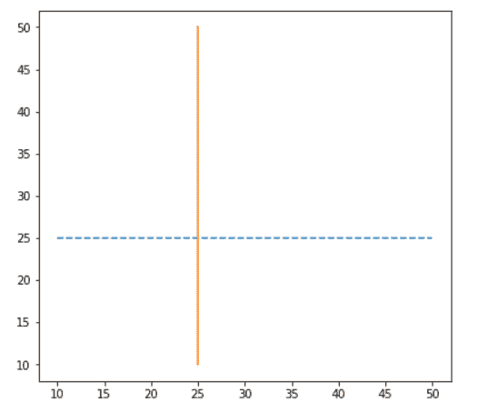
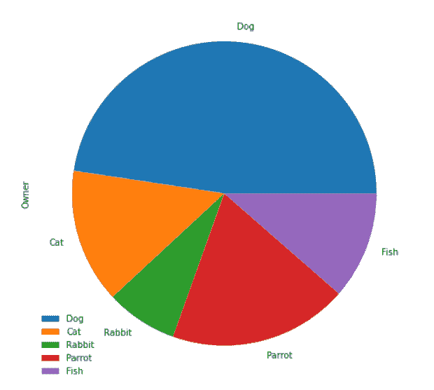

# Matplotlib 增加地块大小

> 原文：<https://pythonguides.com/matplotlib-increase-plot-size/>

[](https://sharepointsky.teachable.com/p/python-and-machine-learning-training-course)

在本 [Python Matplotlib 教程](https://pythonguides.com/what-is-matplotlib/)中，我们将讨论 Python 中的 **Matplotlib 增加绘图大小**。这里我们将介绍与使用 matplotlib 增加地块大小的**相关的不同示例。此外，我们还将涵盖以下主题:**

*   Matplotlib 增加地块大小
*   Matplotlib 增加绘图大小 jupyter
*   Matplotlib 增加情节大小支线剧情
*   matplotlib py plot set _ size _ inches
*   熊猫 matplotlib 增加地块大小
*   Matplotlib 更改图形大小和 dpi
*   Matplotlib 图变化点大小
*   Matplotlib 以像素为单位设置绘图大小
*   Matplotlib 更改默认绘图大小
*   Matplotlib 更改条形图绘图大小
*   Matplotlib 更改散点图大小
*   Matplotlib 设置绘图窗口大小
*   Matplotlib 更改图形大小 fig ax
*   Matplotlib 以厘米为单位设置绘图大小

目录

[](#)

*   [Matplotlib 增加地块大小](#Matplotlib_increase_plot_size "Matplotlib increase plot size")
*   [Matplotlib 增加地块大小 jupyter](#Matplotlib_increase_plot_size_jupyter "Matplotlib increase plot size jupyter")
*   [Matplotlib 增加剧情尺寸支线剧情](#Matplotlib_increase_plot_size_subplots "Matplotlib increase plot size subplots")
    *   [为所有支线剧情设置一个尺寸](#Set_one_size_for_all_subplots "Set one size for all subplots")
    *   [为支线剧情设置单独的尺寸](#Set_individual_sizes_for_subplots "Set individual sizes for subplots ")
*   [Matplotlib py plot set _ size _ inches](#Matplotlib_pyplot_set_size_inches "Matplotlib pyplot set_size_inches")
*   [熊猫 matplotlib 增加地块大小](#Pandas_matplotlib_increase_plot_size "Pandas matplotlib increase plot size")
*   [Matplotlib 改变图形尺寸和 dpi](#Matplotlib_change_figure_size_and_dpi "Matplotlib change figure size and dpi")
*   [Matplotlib 图变化点大小](#Matplotlib_plot_change_point_size "Matplotlib plot change point size")
*   [Matplotlib 以像素为单位设置绘图大小](#Matplotlib_set_plot_size_in_pixels "Matplotlib set plot size in pixels")
*   [Matplotlib 改变默认绘图大小](#Matplotlib_change_default_plot_size "Matplotlib change default plot size")
*   [Matplotlib 改变柱状图尺寸](#Matplotlib_change_bar_plot_size "Matplotlib change bar plot size")
*   [Matplotlib 改变散点图大小](#Matplotlib_change_scatter_plot_size "Matplotlib change scatter plot size")
*   [Matplotlib 改变图尺寸 fig ax](#Matplotlib_change_figure_size_fig_ax "Matplotlib change figure size fig ax")
*   [Matplotlib 以厘米为单位设置绘图尺寸](#Matplotlib_set_plot_size_in_centimeter "Matplotlib set plot size in centimeter")

## Matplotlib 增加地块大小

绘图是一种很好的方法，可以图形化地描述数据，并以视觉上吸引人的方式进行总结。然而，如果绘制不当，它似乎是复杂的。

在 matplotlib 中，我们有几个库来表示数据。在 matplotlib 中创建地块时，纠正它们的大小很重要，这样我们就可以正确地显示地块的所有特征。

同样，检查: [Matplotlib 绘制一条线](https://pythonguides.com/matplotlib-plot-a-line/)

## Matplotlib 增加地块大小 jupyter

在本节中，我们将学习在 jupyter 笔记本中使用 matplotlib 来增加绘图的大小。

**语法如下:**

```py
matplotlib.pyplot.rcParams["figure.figsize"]
```

以上语法用于以英寸为单位增加绘图的**宽度**和**高度**。默认宽度为 `6.4` ，高度为 `4.8` 。

**我们来看例子:**

**例#1**

在这里，我们将看到一个增加 jupyter 笔记本中绘图大小的示例。

```py
**# Import Library** 
import matplotlib.pyplot as plt

**# Increase size of plot in jupyter**

plt.rcParams["figure.figsize"] = (8,5.5)

**# Define Data**

x = [2, 4, 6, 8]
y = [5, 10, 15, 20]

**# Plot**

plt.plot(x, y, '-.')

**# Display**

plt.show()
```

*   首先，导入 `matplotlib.pyplot` 库
*   接下来，使用**PLT . RC params[" figure . figsize "]**方法增加 jupyter 笔记本中的绘图大小，并设置绘图的**宽度**和**高度**。
*   然后，定义用于打印的数据坐标。
*   要绘制图表，使用 `plot()` 函数，并将线条样式设置为点划线。
*   要显示图表，在用户屏幕上使用 `show()` 功能。


*Width=8, Height=5.5*

**例 2**

下面的源代码阐述了使用 matplotlib 增加 jupyter 笔记本大小的过程。

```py
**# Import Library** 
import matplotlib.pyplot as plt
import numpy as np

**# Increase size of plot in jupyter** 
plt.rcParams["figure.figsize"] = (10,6)

**# Define Data**

x = np.linspace(0, 10, 1000)
y = np.sin(x)

**# Plot** 
plt.plot(x, y)

**# Display**

plt.show()
```

这里我们使用 `numpy` 模块的 `linspace()` 函数和 `sin()` 函数定义数据坐标。


*# Increase Size of Plot in Jupyter*

阅读:[什么是 matplotlib 内联](https://pythonguides.com/what-is-matplotlib-inline/)

## Matplotlib 增加剧情尺寸支线剧情

这里我们将学习使用 matplotlib 增加支线剧情的剧情大小。有两种方法可以增加支线剧情的大小。

*   为所有支线剧情设置一个尺寸
*   为支线剧情设置单独的大小

### 为所有支线剧情设置一个尺寸

在这里，我们将看到为所有支线剧情设置一个尺寸的例子。

**以下是语法:**

```py
fig, ax = plt.subplots(nrows , ncols , figsize=(width,height))
```

**例#1**

在这个例子中，我们为所有的支线剧情增加了相同的尺寸。

```py
**# Import necessary libraries** 
import matplotlib.pyplot as plt
import numpy as np

**# Set one size for all subplot**

fig, ax = plt.subplots(2, 2, figsize=(10,8))

**# Preparing the data to subplots** 
x = np.linspace(0,10,100)
y1 = x ** 2
y2 = x ** 4
y3 = x ** 6
y4 = x ** 8

**# Plot**

ax[0, 0].plot(x, y1, color='r')
ax[0, 1].plot(x, y2, color='k', linestyle=':')
ax[1, 0].plot(x, y3, color='y', linestyle='-.')
ax[1, 1].plot(x, y4, color='c',linestyle='--')

**# Display**

plt.show()
```

*   导入必要的库，比如 `matplotlib.pyplot` 和 `numpy` 。
*   然后用**支线剧情()**函数创建 **2 行**和 **2 列**的支线剧情。
*   要为所有支线剧情设置一个尺寸，使用带有**宽度**和**高度**参数的 `figsize()` 函数。
*   定义用于打印的数据坐标。
*   要绘制支线剧情，请使用带轴的 `plot()` 函数。
*   要设置绘制线的不同线型，使用**线型**参数。
*   为了可视化支线剧情，使用 `show()` 函数。


Set one size for all subplots

**例 2**

让我们再看一个例子，为所有的支线剧情设置相同的大小，以便更清楚地理解这个概念。

```py
**# Import necessary libraries** 
import matplotlib.pyplot as plt
import numpy as np

**# Change the figure size**

plt.figure(figsize=[15,14])

**# Preparing the data to subplots**

x = np.linspace(0, 10, 1000)
y1 = np.sin(x)
y2 = np.cos(x)

**# Plot the subplots** 
**# Plot 1**

plt.subplot(2, 2, 1)
plt.plot(x, y1, color='g')

**# Plot 2**

plt.subplot(2, 2, 2)
plt.plot(x, y2, color='k')

**# Display** 
plt.show()
```

*   为了定义数据坐标，我们使用 numpy 的 `linspace()` 、 `sin()` 和 `cos()` 函数。
*   这里我们增加所有支线剧情的大小，使用 `figure()` 方法，我们将 `figsize()` 作为参数传递，并设置支线剧情的**宽度**和**高度**。


Matplotlib increase plot size subplots

### 为支线剧情 设置单独的大小

在这里，我们将看到不同的例子，我们使用 matplotlib 为子情节设置单独的大小。

**以下是语法:**

```py
fig, ax = plt.subplots(nrows, ncols, gridspec_kw=
                       {'width_ratios': [3, 1],
                        'height_ratios’: [3, 3]})
```

**举例:**

下面的源代码详细阐述了增加单个支线剧情大小的过程。

```py
**# Import Library**

import matplotlib.pyplot as plt

**# Define subplots** 
fig, ax = plt.subplots(1, 2, 
                      gridspec_kw={'width_ratios': [8,15]})

**# Define data**

x = [1, 2, 3, 4, 5]
y1 = [7, 13, 24, 26, 32]
y2 = [2, 4, 6, 8, 10]

**# Create subplots**

ax[0].plot(x, y1, color='red', linestyle=':')
ax[1].plot(x, y2, color='blue', linestyle='--')

**# Adjust padding**

plt.tight_layout()

**# Display**

plt.show()
```

*   导入 `matplotlib.pyplot` 库。
*   然后创建带有 **1 行** 和 **2 列** 的支线剧情，使用 **支线剧情()** 功能。
*   要为子情节设置单独的大小，请使用 `gridspec_kw()` 方法。 `gridpec_kw` 是一个带有关键字的字典，可以用来改变每个网格的大小。
*   接下来，定义数据坐标以打印数据。
*   要绘制折线图，请使用 `plot()` 函数。
*   要自动调整填充，请使用 `tight_layout()` 函数。
*   为了可视化支线剧情，使用 `show()` 函数。


Matplotlib increase plot size subplots

**例 2**

下面的源代码解释了增加特定支线剧情大小的过程。

```py
**# Import Library**

import matplotlib.pyplot as plt

**# Define subplots**

fig, ax = plt.subplots(1, 2, gridspec_kw={'width_ratios': 
                       [10,4]})

**# Define data**

x = np.arange(0, 30, 0.2)
y1 = np.cos(x)
y2 = np.sin(x)

**# Create subplots**

ax[0].plot(x, y1, color='red', linestyle=':')
ax[1].plot(x, y2, color='blue', linestyle='--')

**# Adjust padding**

plt.tight_layout()

**# Display** 
plt.show()
```

为了绘制一个数据，我们通过使用 `numpy` 的 `arange()` 、 `cos()` 和 `sin()` 函数来定义数据坐标。


gridspec_kw={‘width_ratios’: [10,4]}

阅读: [Matplotlib 绘图条形图](https://pythonguides.com/matplotlib-plot-bar-chart/)

## Matplotlib py plot set _ size _ inches

在 matplotlib 中，要以英寸为单位设置图形大小，请使用图形模块的 `set_size_inches()` 方法。

**以下是语法:**

```py
matplotlib.figure.Figure.set_size_inches(w, h)
```

这里 `w` 代表**宽度**， `h` 代表**高度**。

**让我们看看不同的例子:**

**例#1**

以下是使用 set_size_inches 方法增加地块大小的示例。

```py
**# Import Libraries**

import matplotlib.pyplot as plt 

**# Create figure** 
fig = plt.figure() 

**# Figure size** 
fig.set_size_inches(6.5, 6)

**# Define Data Coordinates**

x = [10, 20, 30, 40, 50]
y = [25, 25, 25, 25, 25]

**# Plot** 
plt.plot(x, y, '--')
plt.plot(y, x)

**# Display**

plt.show() 
```

*   导入 `matplotlib.pyplot` 库。
*   接下来，使用 `figure()` 函数创建一个新图形。
*   要以英寸为单位设置图形尺寸，使用 `set_size_inches()` 函数，并将**宽度**和**高度**作为参数传递，并将它们的值分别设置为 `6.5` 和 `6` 。
*   然后，定义用于绘图的 x 和 y 数据坐标。
*   要绘制折线图，请使用 `plot()` 函数。



Matplotlib pyplot set_size_inches

**例 2**

在这里，我们使用 x 和 y 坐标创建一个折线图(由函数 `arange` 和 `sin` 定义)。我们使用 `set_size_inches` 函数将绘图的**宽度**设置为 12，将**高度**设置为 10 英寸。

```py
**# Import Libraries**

import matplotlib.pyplot as plt 
import numpy as np 

**# Create figure**

fig = plt.figure() 

**# Figure size**

fig.set_size_inches(12,10)

**# Define Data Coordinates**

x = np.arange(0,4*np.pi,0.1)
y = np.sin(4*x)

**# Plot** 
plt.plot(x, y, '--')

**# Display**

plt.show() 
```

这里我们用 `numpy` 的 `arange()` 、 `pi` 、 `sin()` 函数定义 x、y 数据坐标。


fig.set_size_inches(12,10)

阅读: [Matplotlib 支线剧情 _adjust](https://pythonguides.com/matplotlib-subplots_adjust/)

## 熊猫 matplotlib 增加地块大小

在 [Pandas](https://pythonguides.com/pandas-in-python/) 中，matplotlib 模块的 `plot()` 方法的 `figsize` 参数可用于改变地块的大小，绕过所需的尺寸作为元组。它用于计算图形对象的大小。

**以下是语法:**

```py
figsize=(width, height)
```

宽度和高度必须是英寸。

**让我们看看不同的例子:**

**例#1**

在本例中，我们将使用 pandas dataframe 创建一个饼图，并增加绘图的大小。

```py
**# Import Library** 
import pandas as pd

**# Creat pandas dataframe**

df = pd.DataFrame({'Owner': [50, 15, 8, 20, 12]},
                  index=['Dog', 'Cat', 'Rabbit',  
                         'Parrot','Fish'])

**# Plot**

df.plot.pie(y='Owner', figsize=(8,8))

**# Display**

plt.show()
```

*   导入**熊猫**模块。
*   之后，创建一个带有索引的熊猫数据框架。
*   要绘制饼图，请使用 `df.plot.pie()` 函数。
*   要增加绘图的大小，请传递参数 `figsize()` 和尺寸。



Pandas Matplotlib Increase Plot Size

**例 2**

在本例中，我们将使用熊猫数据框架制作一个折线图，并增加地块大小。

```py
**# Import libraries**

import pandas as pd
import matplotlib.pyplot as plt

**# Data** 
data = {'Year': [2021, 2020, 2019, 2018, 2017, 2016, 2015, 
                2014],
        'Birth_Rate': [17.377, 22.807, 26.170, 18.020, 34.532,    
                       18.636, 37.718, 19.252]
}

**# Create DataFrame** 
df = pd.DataFrame(data,columns=['Year','Birth_Rate'])

**# Line Plot**

df.plot(x ='Year', y='Birth_Rate', kind = 'line', 
        figsize=(8,6))

**# Display**

plt.show()
```

*   使用 `DataFrame()` 方法在 pandas 中创建一个数据帧。
*   接下来，使用 `df.plot()` 函数绘制数据帧。
*   这里我们将**种类**参数设置为**线**，以便绘制折线图。
*   要增加绘图的大小，请传递参数 `figsize()` 和尺寸。


figsize=()

读取: [Matplotlib 设置 y 轴范围](https://pythonguides.com/matplotlib-set-y-axis-range/)

## Matplotlib 改变图形尺寸和 dpi

在这里，我们将学习使用 matplotlib 模块来改变图形的大小和分辨率。

**以下是语法:**

```py
matplotlib.pyplot.figure(figsize=(w,h), dpi)
```

**让我们看看与此相关的例子:**

**例#1**

在本例中，我们绘制了一个折线图，并更改了其大小和分辨率。

```py
**# Import Libraries**

import matplotlib.pyplot as plt
from matplotlib.pyplot import figure

**# Set fig size and dpi**

figure(figsize=(8,6), dpi=250)

**# Define Data**

x = range(0,12)

**# Plot** 
plt.plot(x)

**# Display**

plt.show()
```

*   首先使用 `matplotlib.pyplot.figure` 创建一个新图形或激活一个已存在的图形。
*   该方法采用一个 `figsize` 参数，用于指定图形的**宽度**和**高度**(以英寸为单位)。
*   然后，输入一个 `dpi` 值，该值对应于以每英寸点数为单位的图形分辨率。


Matplotlib change figure size and dpi

**例 2**

这里我们将再看一个与图形大小和分辨率变化相关的例子，以便更清楚地理解这个概念。

```py
**# Import Libraries**

import matplotlib.pyplot as plt
from matplotlib.pyplot import figure
import numpy as np

**# Set fig size and dpi**

figure(figsize=(6,4), dpi=150)

**# Define Data**

x = np.random.randint(450,size=(80))

**# Plot**

plt.plot(x)

**# Display**

plt.show()
```

*   为了定义数据坐标，这里我们使用 `numpy` 的 `random.randint()` 方法。
*   这里我们将图的**宽度**、**高度**、 `dpi` 分别设置为 `6` 、 `4` 、 `150` 。


figure(figsize=(6,4), dpi=150)

读取: [Matplotlib 更新循环中的绘图](https://pythonguides.com/matplotlib-update-plot-in-loop/)

## Matplotlib 图变化点大小

这里我们将通过不同的例子学习如何在 matplotlib 中改变标记大小。

**以下是语法:**

```py
matplotlib.pyplot.scatter(x , y , s)
```

这里 `x` 和 `y` 指定数据坐标， `s` 指定标记的大小。

**例#1**

这里我们将看到一个例子，我们为所有的点设置一个单一的大小。

```py
**# Import Library**

import matplotlib.pyplot as plt

**# Define Data**

A = [6, 7, 2, 5, 4, 8]
B = [12, 14, 17, 20, 22, 27]

**# Scatter Plot and set size** 
plt.scatter(A, B, s=80)

**# Display**

plt.show()
```

*   导入 `matplotlib.pyplot` 库。
*   接下来，定义 `A` 和 `B` 数据坐标。
*   要绘制散点图，请使用 `scatter()` 函数。
*   要为所有点设置相同的大小，使用 `s` 作为参数并设置大小。
*   使用 `show()` 函数来可视化底池。


Set Single Size For All Points

**例 2**

这里我们将看到一个例子，我们为每个点设置不同的大小

```py
**# Import Library** 
import matplotlib.pyplot as plt

**# Define Data** 
x = [6, 7, 2, 5, 4, 8]
y = [12, 14, 17, 20, 22, 27]

**# Define Size**

sizes = [20, 55, 85, 150, 250, 9]

**# Scatter Plot and set size** 
plt.scatter(x, y, s=sizes)

**# Display** 
plt.show()
```

*   导入 `matplotlib.pyplot` 库。
*   接下来，定义数据坐标。
*   然后，为每个点定义不同的**大小**。
*   要绘制散点图，使用 `scatter()` 函数并设置尺寸传递 s 参数。
*   要显示图表，使用 `show()` 功能。


Set Different Size For Each Point

**例 3**

这里我们将看到一个例子，其中我们为图中的每个点定义了点大小。

```py
**# Import Library**

import matplotlib.pyplot as plt

**# Define Data**

x = [2, 4, 6, 8, 10, 12, 14, 16]
y = [4, 8, 12, 16, 20, 24, 28, 32]

**# Define Size**

sizes = [3**n for n in range(len(x))]

**# Scatter Plot and set size**

plt.scatter(x, y, s=sizes, color='red')

**# Display**

plt.show()
```

*   导入 `matplotlib.pyplot` 库进行数据可视化。
*   定义数据坐标。
*   创建一个函数来定义用于图中每个点的点大小。
*   要绘制散点图，请使用 `scatter()` 函数。


Matplotlib Plot Change Point Size

阅读: [Matplotlib 饼图教程](https://pythonguides.com/matplotlib-pie-chart/)

## Matplotlib 以像素为单位设置绘图大小

在这里，我们将看到一些例子，其中我们将英寸转换为像素，并使用 matplotlib 模块绘制图形。

**例子` `#1**

在下面的例子中，我们将使用像素转换方法来改变绘图大小。

```py
**# Import Libraries**

import matplotlib.pyplot as plt
from matplotlib.pyplot import figure
import numpy as np

px = 1/plt.rcParams["figure.dpi"]

**# Set fig size in Pixel**

figure(figsize=(600 * px , 450 * px))

**# Define Data**

x = np.random.randint(800,size=(120))

**# Plot**

plt.plot(x)

**# Display** 
plt.show()
```

*   导入必要的库，如 `matplotlib.pyplot` 、 `figure` 、 `numpy` 。
*   然后使用，默认像素值， **rcParams['figure.dpi']** 将值设置为 px。
*   现在，以像素为单位设置 figsize。
*   然后，定义用于打印的数据坐标。
*   要绘制折线图，请使用 `plot()` 函数。
*   要显示图表，使用 `show()` 功能。


Matplotllib set plot size in pixels

**例 2**

这里我们通过使用 `dpi` 参数来改变以像素为单位的绘图大小。

```py
**# Import Libraries**

import matplotlib.pyplot as plt
from matplotlib.pyplot import figure

**# Set fig size and dpi**

figure(dpi=100)

**# Define Data Coordinates** 
water_quantity = [17, 27, 14, 22, 16, 6]

**# Add labels**

water_uses = ['Shower', 'Toilet', 'Leaks', 'Clothes Wsher', 
              'Faucet', 'Other']

**# Colors** 
colors =['salmon','palegreen','skyblue','plum','pink','silver']

**# Plot**

plt.pie(water_quantity, colors=colors)

**# Add legend**

plt.legend(labels=water_uses, fontsize=18, loc='upper center', 
           bbox_to_anchor=(0.5, -0.04), ncol=2)

**# Display**

plt.show() 
```

*   在这里，我们使用 `dpi` 参数通过 `figure()` 函数以像素为单位设置绘图。
*   接下来，我们为饼图创建定义数据坐标、标签和颜色，
*   为了绘制饼图，我们使用了 `pie()` 函数。
*   为了给绘图添加一个图例，我们使用了 `legend()` 函数。


matplotlib set plot size in pixels(dpi)

阅读: [Matplotlib 散点图颜色](https://pythonguides.com/matplotlib-scatter-plot-color/)

## Matplotlib 改变默认绘图大小

在 Matplotlib 中，字典对象 `rcParams` 包含属性。图形大小可以作为 `rcParams` 中 `figsize` 的关键图形值，代表图形的大小。

为了改变默认的大小，我们使用 plt.rcParams。当我们把它放在 `plt.plot` 之前或之后时，这是可以接受的。使用相同脚本制作的任何图形将被分配相同的图形大小。

**我们来看例子:**

**例#1**

在这里，我们将设置默认的图形大小为 7 乘 7。

```py
**# Import Library**

import matplotlib.pyplot as plt

**# Default plot size**

plt.rcParams["figure.figsize"] = (7,7)

**# Plot** 
plt.plot([[5, 6], [9, 10], [1, 2], [1, 2]])

**# Show** 
plt.show()
```

*   导入 `matplotlib.pyplot` 库。
*   要设置默认绘图尺寸，使用**PLT . RC params[" figure . fig size "]**。
*   要绘制图表，请使用 `plot()` 函数。


Matplotlib change default plot size

读取: [Matplotlib Plot NumPy 数组](https://pythonguides.com/matplotlib-plot-numpy-array/)

## Matplotlib 改变柱状图尺寸

在这里，我们将借助示例学习使用 matplotlib 模块改变条形图大小的不同方法。

**例#1**

这里我们将使用 `figsize()` 方法来改变条形图的大小。

```py
**# Import Library**

import matplotlib.pyplot as plt

**# Change size**

plt.figure(figsize=(9,7))

**# Define Data**

pets = ['Rabbit', 'Dog', 'Cat', 'Goldfish', 'Parrot']
no_of_people = [4, 8, 11, 6, 5]

**# Plot bar chart**

plt.bar(pets, no_of_people)

**# Display**

plt.show()
```

*   导入 `matplotlib.pyplot` 库。
*   要改变图形大小，使用 `figsize` 参数并设置绘图的宽度和高度。
*   接下来，我们定义数据坐标。
*   要绘制条形图，使用 `bar()` 功能。
*   要显示图表，使用 `show()` 功能。


Matplotlib change bar plot size

**例 2**

在这个例子中，我们将使用 rcParams 来改变条形图的大小。

```py
**# Import Library** 
import matplotlib.pyplot as plt

**# Change size** 
plt.rcParams['figure.figsize']=(8,6.5)

**# Define Data** 
school_suppiles = ['Pencil', 'Scale', 'Pen', 'Sharpner',  
                   'Eraser']
no_of_suppiles = [8, 3, 2, 5, 4]

**# Plot bar chart** 
plt.bar(school_suppiles, no_of_suppiles)

**# Display**

plt.show()
```

这里我们使用默认方法，即通过使用 plt 来更改条形图的大小。**RC params[' figure . fig size ']**。


plt.rcParams[‘figure.figsize’]

Read: [Matplotlib set_xticklabels](https://pythonguides.com/matplotlib-set_xticklabels/)

## Matplotlib 改变散点图大小

在这里，我们将借助示例学习使用 matplotlib 模块改变散点图大小的不同方法。

**例#1**

这里我们将学习使用 figsize 来改变散点图的大小。

```py
**# Import Library**

import matplotlib.pyplot as plt

**# Set size**

plt.figure(figsize=(8,5))

**# Define Dataset**

x1 = [45, 58, 29, 83, 95, 20, 
      98, 27]

y1 = [31, 75, 8, 29, 79, 55, 
      43, 72]

x2 = [23, 41, 25, 64, 3, 15,
      39, 66]

y2 = [26, 34, 38, 
      20, 56, 2, 47, 15]

**# Plot Scatter Graph**

plt.scatter(x1, y1, c ="cyan", 
            marker ="s", 
            edgecolor ="black", 
            s = 50)

plt.scatter(x2, y2, c ="yellow",
            linewidths = 2,
            marker ="^", 
            edgecolor ="red", 
            s = 200)

**# Display** 
plt.show()
```

*   导入 `matplotlib.pyplot` 库。
*   要设置图形尺寸，使用 `figsize` 参数并设置图形的宽度和高度。
*   定义要绘制到散点图的数据集。
*   要绘制散点图，使用**散点图**方法。
*   为了给绘图添加额外的特性，传递**颜色**、**大小**、**标记**、**边缘颜色**、**标记**作为参数。


Matplotlib change scatter plot size

**例 2**

在这个例子中，我们使用 set_size_inches 方法改变散点图的大小。

```py
**# Import Libraries**

import matplotlib.pyplot as plt
import numpy as np

**# Create figure**

fig = plt.figure() 

**# Figure size** 
fig.set_size_inches(6,8)

**# Define Data** 
x = np.linspace(0, 10, 100)
y = np.sin(x)

**# Plot**

plt.scatter(x, y)

**# Display** 
plt.show()
```

*   导入必要的库，如 `matplotlib.pyplot` 和 `numpy` 。
*   然后使用 `figure()` 方法创建一个新的 figure。
*   要设置散点图的大小，使用 `set_size_inches()` 方法并传递宽度和高度。
*   要定义数据坐标，使用 `linspace()` 和 `sin()` 方法。
*   要绘制散点图，请使用 `scatter()` 函数。


fig.set_size_inches(6,8)

阅读:[Matplotlib tight _ layout–有用教程](https://pythonguides.com/matplotlib-tight-layout/)

## Matplotlib 改变图尺寸 fig ax

通过使用 matplotlib 模块的 `set_figheight` 和 `set_figwidth` 方法，我们可以很容易地改变绘图的高度和宽度。

**让我们看看与这个概念相关的例子:**

**例#1**

这里我们通过使用 `set_figwidth` 方法来设置绘图的宽度。

```py
**# Import Library**

import numpy as np 
import matplotlib.pyplot as plt

**# Set width**

fig = plt.figure()
fig.set_figwidth(8)

**# Data Coordinates** 
x = np.arange(2, 8) 
y = np.array([5, 8, 6, 20, 18, 30])

**# Plot**

plt.plot(x, y, linestyle='--') 

**# Display**

plt.show()
```

*   首先导入必要的库，比如 `numpy` 和 `matplotlib.pyplot` 。
*   接下来，使用 `set_figwidth()` 方法来改变绘图的宽度。
*   要定义数据坐标，使用 numpy 的 `arange()` 和 `array()` 方法。
*   要用虚线样式绘制线图，使用带有 `linestyle` 参数的 `plot()` 函数。


Matplotlib change figure size fig ax

**例#** 2

这里我们通过使用 `set_figheight` 方法来设置绘图的高度。

```py
**# Import Library**

import numpy as np 
import matplotlib.pyplot as plt

**# Set height** 
fig = plt.figure()
fig.set_figheight(8)

**# Data Coordinates** 
x = np.arange(2, 8) 
y = np.array([5, 8, 6, 20, 18, 30])

**# Plot**

plt.plot(x, y, linestyle='--') 

**# Display** 
plt.show()
```

*   首先导入必要的库，比如 `numpy` 和 `matplotlib.pyplot` 。
*   接下来，使用 `set_figheight()` 方法更改绘图的高度。
*   要定义数据坐标，使用 numpy 的 `arange()` 和 `array()` 方法。


Matplotlib change figure size

读取: [Matplotlib x 轴标签](https://pythonguides.com/matplotlib-x-axis-label/)

## Matplotlib 以厘米为单位设置绘图尺寸

默认情况下，在 matplotlib 中，图形大小以英寸为单位。在这里，我们将借助一个例子来学习以厘米为单位设置绘图大小。

**举例:**

```py
**# Import Library** import numpy as np 
import matplotlib.pyplot as plt

**# Set Size**

cm = 1/2.54 
plt.figure(figsize=(15*cm, 11*cm))

**# Data Coordinates**

x = np.arange(2, 8) 
y = x * 2 + 6

**# Plot**

plt.plot(x, y) 

**# Display** 
plt.show()
```

*   导入 `numpy` 库。
*   接下来，导入 `matplotlib` 库。
*   通过将英寸转换为厘米来设置图形大小。
*   定义数据坐标 x 和 y。
*   为了绘制折线图，我们使用了 `plot()` 函数。


Matplotlib set plot size in centimeter

你可能也喜欢阅读下面的 Matplotlib 教程。

*   [Matplotlib 散点图图例](https://pythonguides.com/matplotlib-scatter-plot-legend/)
*   [Matplotlib 多条形图](https://pythonguides.com/matplotlib-multiple-bar-chart/)
*   [堆积条形图 Matplotlib](https://pythonguides.com/stacked-bar-chart-matplotlib/)
*   [Matplotlib 多个图](https://pythonguides.com/matplotlib-multiple-plots/)
*   [画垂直线 matplotlib](https://pythonguides.com/draw-vertical-line-matplotlib/)

在本 Python 教程中，我们已经讨论了" **Matplotlib 增加绘图大小"**，并且我们还介绍了一些与之相关的例子。这些是我们在本教程中讨论过的以下主题。

*   Matplotlib 增加地块大小
*   Matplotlib 增加绘图大小 jupyter
*   Matplotlib 增加情节大小支线剧情
*   matplotlib py plot set _ size _ inches
*   熊猫 matplotlib 增加地块大小
*   Matplotlib 更改图形大小和 dpi
*   Matplotlib 图变化点大小
*   Matplotlib 以像素为单位设置绘图大小
*   Matplotlib 更改默认绘图大小
*   Matplotlib 更改条形图绘图大小
*   Matplotlib 更改散点图大小
*   Matplotlib 设置绘图窗口大小
*   Matplotlib 更改图形大小 fig ax
*   Matplotlib 以厘米为单位设置绘图大小

[Bijay Kumar](https://pythonguides.com/author/fewlines4biju/)

Python 是美国最流行的语言之一。我从事 Python 工作已经有很长时间了，我在与 Tkinter、Pandas、NumPy、Turtle、Django、Matplotlib、Tensorflow、Scipy、Scikit-Learn 等各种库合作方面拥有专业知识。我有与美国、加拿大、英国、澳大利亚、新西兰等国家的各种客户合作的经验。查看我的个人资料。

[enjoysharepoint.com/](https://enjoysharepoint.com/)[](https://www.facebook.com/fewlines4biju "Facebook")[](https://www.linkedin.com/in/fewlines4biju/ "Linkedin")[](https://twitter.com/fewlines4biju "Twitter")