# Matplotlib 反转 y 轴

> 原文：<https://pythonguides.com/matplotlib-invert-y-axis/>

[](https://sharepointsky.teachable.com/p/python-and-machine-learning-training-course)

在本 python 教程中，我们将讨论 Python 中的 **Matplotlib 反转 y 轴**。这里我们将介绍使用 [matplotlib](https://pythonguides.com/what-is-matplotlib/) 反转 y 轴的不同例子。我们还将讨论以下主题:

*   Matplotlib 反转 y 轴
*   Matplotlib 反转 y 轴子图
*   Matplotlib 反转 x 和 y 轴
*   Matplotlib barh 反转 y 轴
*   Matplotlib 反转辅助 y 轴
*   matplot lib 3d reverse 和 axis
*   Matplotlib flip 和 axis label
*   matplot lib reverse 和 axis imshow

如果你是 python Matplotlir 的新手，请查看，[如何安装 matplotlib python](https://pythonguides.com/how-to-install-matplotlib-python/) 。

目录

[](#)

*   [Matplotlib 反转 y 轴](#Matplotlib_invert_y_axis "Matplotlib invert y axis")
    *   [通过使用 invert_yaxis()方法](#By_using_invert_yaxis_method "By using invert_yaxis() method")
    *   [通过使用 ylim()方法](#By_using_ylim_method "By using ylim() method")
    *   [通过使用轴()方法](#By_using_axis_method "By using axis() method")
*   [Matplotlib 反转 y 轴子图](#Matplotlib_invert_y_axis_subplots "Matplotlib invert y axis subplots")
*   [Matplotlib 反转 x 和 y 轴](#Matplotlib_invert_x_and_y_axis "Matplotlib invert x and y axis")
*   [matplotlib bar 逆变轴](#Matplotlib_barh_invert_y_axis "Matplotlib barh invert y axis")
*   [Matplotlib 反转辅助 y 轴](#Matplotlib_invert_secondary_y_axis "Matplotlib invert secondary y axis")
*   [Matplotlib 3D 反转 y 轴](#Matplotlib_3D_invert_y_axis "Matplotlib 3D invert y axis")
*   [Matplotlib flip 和 axis label](#Matplotlib_flip_y_axis_label "Matplotlib flip y axis label")
*   [Matplotlib 逆变 y 轴 im how](#Matplotlib_invert_y_axis_imshow "Matplotlib invert y axis imshow")

## Matplotlib 反转 y 轴

在本节中，我们将学习如何在 Python 的 matplotlib 中反转 y 轴。现在在开始这个话题之前，我们先讨论一下**反转**在这里是什么意思:

> ***反转*** 表示颠倒或翻转顺序

为了更清楚地理解，让我们举一个常见的例子:

假设 y 轴从 0 到 10 开始，你想从 10 到 0 开始。在这种情况下，我们反转或翻转图的轴。

在 matplotlib 中，我们可以使用不同的方法反转图形的 y 轴。以下是**反转 y 轴**的不同方法。

*   使用 invert_yaxis()方法
*   使用 ylim()方法
*   使用 axis()方法

### 通过使用 invert_yaxis()方法

要反转 Y 轴，我们可以使用 invert_yaxis()方法。

**该方法的语法如下:**

```py
matplotlib.axes.Axes.invert_yaxis(self)
```

**示例:**(无反转轴)

```py
**# Import Library**

import matplotlib.pyplot as plt
import numpy as np

**# Define Data**

x = np.arange(0, 15, 0.2)
y = np.sin(x)

**# Plot figure**

plt.plot(x, y)

**# Title**

plt.title("Sine Function Normal Plot", fontsize= 15, fontweight='bold')

**# Generate Plot**

plt.show()
```

*   在上面的例子中，我们导入了 `matplotlib.pyplot` 和 `numpy` 库。
*   之后，我们使用 `np.arrange()` 和 `np.sin()` 方法定义数据。
*   接下来，我们使用 `plt.plot()` 方法来绘制绘图。
*   通过使用 `plt.title()` 我们定义了绘图的标题。
*   `plt.show()` 方法用于在用户屏幕上生成绘图。

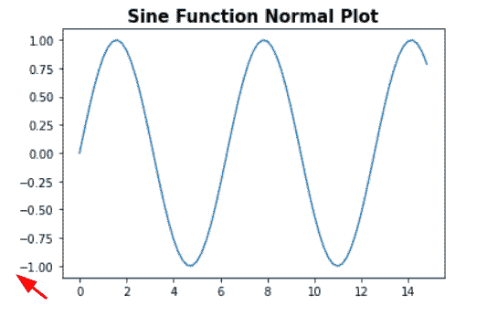

*” Graph without invert method”*

**看 y 轴:这里从-1.00 开始，到 1.00 结束**

**示例:**(带反转轴)

```py
**# Import Library**

import matplotlib.pyplot as plt
import numpy as np

**# Define Data**

x = np.arange(0, 15, 0.2)
y = np.sin(x)

**# Plot figure**

plt.plot(x, y)

**# Invert y-axis**

ax = plt.gca()
ax.invert_yaxis()

**# Title**

plt.title("Sine Function Invert Plot", fontsize= 15, fontweight='bold')

**# Generate Plot**

plt.show()
```

*   在上面的例子中，我们使用了 `plt.gca()` 方法来获取当前轴。
*   在此之后，我们使用 `ax.invert_yaxis()` 方法来反转或反转绘图的 y 轴。

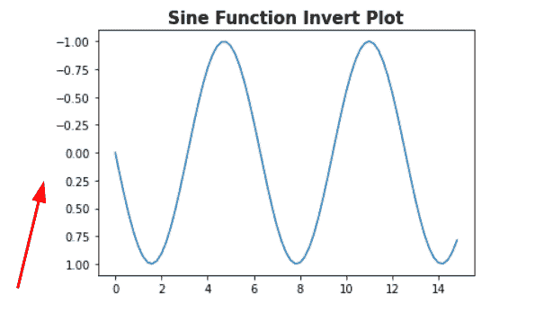

*” Graph with invert method “*

**看 y 轴:这里从 1.00 开始，到-1.00 结束**

> **结论:**通过使用 invert_yaxis()方法，我们可以反转绘图的 y 轴。

读取[将图例放在绘图 matplotlib 外](https://pythonguides.com/put-legend-outside-plot-matplotlib/)

### 通过使用 ylim()方法

`ylim()` 方法也用于在 Matplotlib 中反转绘图的轴。通常，该方法用于设置轴的限制。

但是，如果我们将**最小值**设定为**上限**，将**最大值**设定为**下限**，我们就可以恢复坐标轴。

**ylim()方法的语法如下:**

```py
matplotlib.pyplot.ylim(bottom,top)
```

这里**底部**和**顶部**指定新 y 轴极限的元组。

**让我们看一个例子来更清楚地理解它:**

```py
**# Import Library**

import numpy as np
import matplotlib.pyplot as plt

**# Define Data**

x = np.linspace(5, 15, 35)  
y = 2*x+5

**# Create plot**

axes,(p1,p2) = plt.subplots(1, 2)

**# Normal plot**

p1.plot(x, y)
p1.set_title("Normal Plot")

**# Invert plot**

p2.plot(x, y)
p2.set_title("Inverted Plot")
plt.ylim(max(y), min(y))

**# Show**

axes.tight_layout()
plt.show()
```

*   在上面的例子中，首先我们导入 `numpy` 和 `matplotlib.pyplot` 库。
*   接下来，我们定义数据，并通过使用 `plt.subplot()` 方法创建子情节。
*   现在我们用 `plot()` 方法画一个简单的图。
*   `plt.ylim()` 方法用于反转 y 轴这里我们将 `max` 和 `min` 作为参数传递。

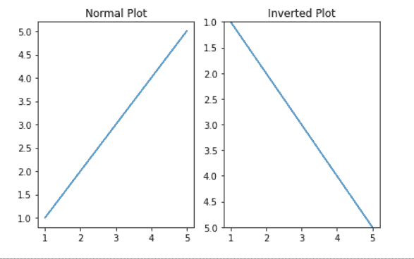

plt.ylim()

**结论:**正常图中，y 轴从 1 开始，到 5 结束。在反转图中，y 轴从 5 开始，到 1 结束。

阅读 [Matplotlib 另存为 pdf + 13 示例](https://pythonguides.com/matplotlib-save-as-pdf/)

### 通过使用轴()方法

`axis()` 方法也用于在 Matplotlib 中恢复轴。基本上，该方法用于设置轴的**最小值**和**最大值**。

但是如果我们将**最小值**设定为**上限**，将**最大值**设定为**下限**就可以得到反轴。

**axis()方法的语法如下:**

```py
matplotlib.pyplot.axis()
```

让我们看一个例子:

```py
**# Import Library** 
import numpy as np
import matplotlib.pyplot as plt

**# Define Data** 
x = np.arange(0, 15, 0.2)
y = np.tan(x)

**# Create plot** 
axes,(p1,p2) = plt.subplots(1, 2)

**# Normal plot** 
p1.plot(x, y)
p1.set_title("Normal Plot")

**# Invert plot**

p2.plot(x, y)
p2.set_title("Inverted Plot")
plt.axis([max(x), min(x), max(y), min(y)])

**# Show**

axes.tight_layout()
plt.show()
```

*   这里我们导入 `matplotlib.pyplot` 和 `numpy` 库，使用 `np.arrange()` 和 `np.tan()` 方法定义数据。
*   plt。**支线剧情()**方法用于创建支线剧情。
*   然后，我们使用 `plot()` 方法绘制一个图形，并使用 `set_title()` 方法为图形添加一个标题。
*   通过使用 `plt.axis()` 方法，我们还原轴，这里我们传递 y 轴和 x 轴的**最大值**和**最小值**值。

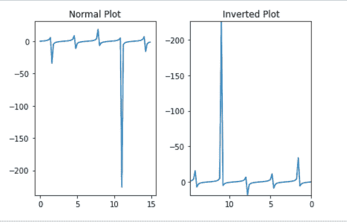

plt.axis()

读取 [Matplotlib 标题字体大小](https://pythonguides.com/matplotlib-title-font-size/)

## Matplotlib 反转 y 轴子图

这里我们将讨论如果我们在 Python matplotlib 中的一个图形区域中绘制多个图，如何反转特定子图的 y 轴。

我们使用 `invert_yaxis()` 方法翻转子情节的 y 轴。

**让我们借助一个例子来理解这个概念:**

```py
**# Import Libraries** 
import numpy as np
import matplotlib.pyplot as plt

**# Define Data**

x1= [0.2, 0.4, 0.6, 0.8, 1]
y1= [0.3, 0.6, 0.8, 0.9, 1.5]

x2= [2, 6, 7, 9, 10]
y2= [3, 4, 6, 9, 12]

x3= [5, 8, 12]
y3= [3, 6, 9]

x4= [5, 8, 12]
y4= [3, 6, 9]

fig, ax = plt.subplots(2, 2)

**# Invert y-axis** 

ax[1,0].invert_yaxis()

**# Plot graph**

ax[0, 0].plot(x1, y1)
ax[0, 1].plot(x2, y2)
ax[1, 0].plot(x3, y3)
ax[1, 1].plot(x4, y4)

**# Display Graph**

fig.tight_layout()
plt.show()
```

*   在上面的例子中，我们在一个图形区域中绘制了多个图。我们想要反转特定图的 y 轴。
*   这里我们使用 `invert_yaixs()` 方法翻转绘图的 **y 轴**。
*   我们将 `invert_yaxis()` 方法与**第三**图一起使用。

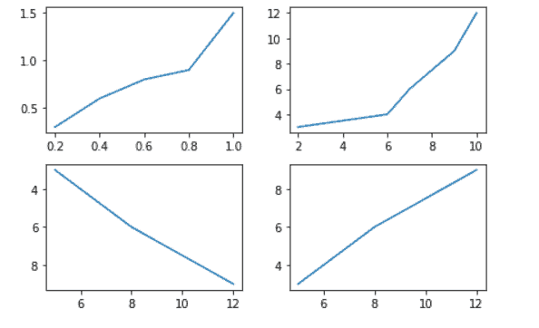

ax.invert_yaxis()

读取 [Matplotlib 默认图形尺寸](https://pythonguides.com/matplotlib-default-figure-size/)

## Matplotlib 反转 x 和 y 轴

这里我们将学习如何在 Python matplotlib 中反转绘图的 x 轴和 y 轴。

通过使用 `invert_xaxis()` 和 `invert_yaxis()` 方法，我们可以分别翻转 **x 轴**和 **y 轴**。

**语法如下:**

```py
**# Invert x-axis**

matplotlib.axes.Axes.invert_xaxis(self)

**# Invert y-axis**

matplotlib.axes.Axes.invert_yaxis(self) 
```

**让我们来看一个与这个概念相关的例子:**

```py
**# Import Library**

import numpy as np
import matplotlib.pyplot as plt

**# Define Data**

x=[5, 10, 15, 20, 25,30]
y=[0, 1, 2, 3, 4, 5]

**# Create Subplot**

axes,(p1,p2) = plt.subplots(1, 2)

**# Normal plot**

p1.plot(x, y)
p1.set_title("Normal Plot")

**# Invert plot**

p2.plot(x, y)
p2.set_title("Inverted Plot")

**# Invert axes**

ax = plt.gca()
ax.invert_yaxis()
ax.invert_xaxis()

**# Show**

axes.tight_layout()
plt.show()
```

*   在上面的例子中，我们导入了 `numpy` 和 `matplotlib` 库。
*   之后，我们在 x 和 y 坐标上定义数据。
*   通过使用 `plt.subplots()` 方法，我们在图形区域中创建子情节。
*   接下来，我们使用 `plot()` 方法绘制一个图形，使用 `set_title()` 方法设置图形的标题。
*   然后，我们使用 `plt.gca()` 方法来获取绘图的当前轴。
*   通过使用 `invert_yaxis()` 和 `invert_xaxis()` 方法，我们翻转绘图的轴。
*   最后，我们使用 `tight_layout()` 方法自动设置绘图，使用 `show()` 方法在用户屏幕上显示绘图。

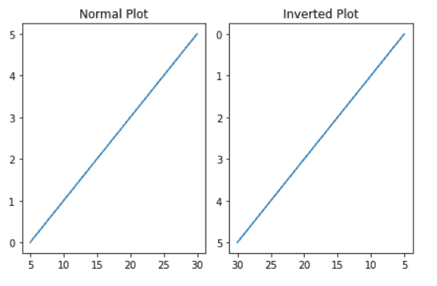

*” Invert x-axis and y-axis “*

另外，读取 [Matplotlib savefig 空白图像](https://pythonguides.com/matplotlib-savefig-blank-image/)

## matplotlib bar 逆变轴

这里我们将学习如何使用 Python 中的 matplotlib**反转水平条形图的 y 轴。首先，我们必须知道如何绘制水平条形图。**

**绘制水平条形图的语法如下:**

```py
matplotlib.pyplot.barh(x,y)
```

这里 x 表示 x 轴坐标，y 表示条形的高度。

**反转` `柱状图 y 轴的语法如下:**

```py
**# Invert y-axis**

matplotlib.axes.Axes.invert_yaxis(self) 
```

**举例:**

```py
**# Import Library**

import numpy as np
import matplotlib.pyplot as plt

**# Define Data**

x=[1, 2, 3, 4, 5]
y=[20, 15, 12, 6, 5]

**# Simple Bar Chart**

plt.figure()
plt.barh(x,y)

**# Inverted Bar chart**

plt.figure()
plt.barh(x,y)
plt.gca().invert_yaxis()

**# Show**

plt.show()
```

*   在上面的例子中，我们首先导入了 `numpy` 和 `matplotlib.pyplot` 库。
*   接下来，我们定义数据。
*   通过使用 `plt.barh()` 方法，我们创建了一个水平条形图。
*   通过使用 `plt.gca()` 方法，我们得到了绘图的当前轴。
*   然后我们使用 `invert_yaxis()` 方法翻转绘图的 y 轴。

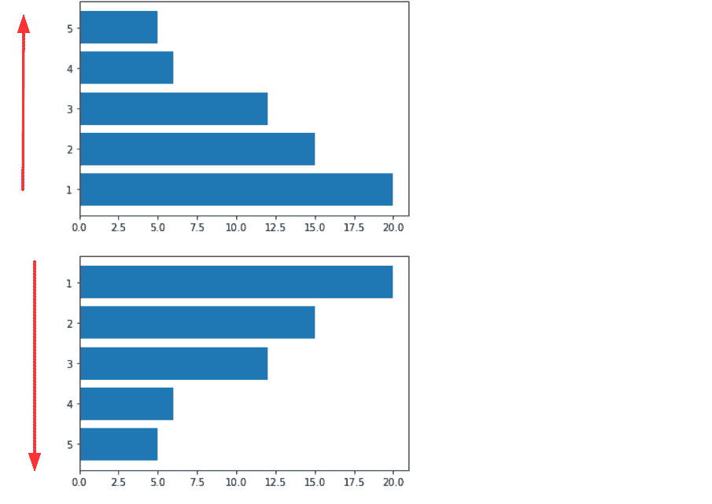

*” Invert y-axis of the horizontal bar chart “*

读取 [Matplotlib 另存为 png](https://pythonguides.com/matplotlib-save-as-png/)

## Matplotlib 反转辅助 y 轴

在这里，我们将学习如何在 Python 的 matplotlib 中反转辅助 y 轴。首先，我们必须了解辅助 y 轴的含义以及何时需要它。

偶尔，我们需要**两个 x 轴或 y 轴**来获得对数据的更多洞察。此时，我们需要创建**副轴**。

在 python 中，matplotlib 提供了创建具有两个 y 轴的绘图的功能，甚至我们可以为两者提供不同的标签。

我们可以通过使用两个不同的轴对象来创建一个具有两个不同 y 轴的图。为了创建不同的轴对象，我们使用了 `twinx()` 方法。

**让我们来看一个反转辅助 y 轴的例子:**

```py
**# Import Library** import numpy as np
import matplotlib.pyplot as plt

**# Define Data** 
x = np.arange(0, 10, 3.5)
y1 = x**2
y2 = x**4

**# Create subplot**

fig, ax = plt.subplots(figsize = (10, 5))

**# twinx() for creating axes object for secondary y-axis**

ax2 = ax.twinx()

**# Plot graph**

ax.plot(x, y1)
ax2.plot(x, y2)

**# Invert secondary y-axis**

ax2.invert_yaxis()

**# Labels to axes**

ax.set_xlabel('x-axis')
ax.set_ylabel('y-axis')

**# Label secondary y-axis** 

ax2.set_ylabel('Secondary y-axis', color = 'b')

**# Display layout** 
plt.tight_layout()

**# Show plot**

plt.show()
```

*   在上面的例子中，我们导入了重要的库，如 `numpy` 和 `matplotlib.pyplot` 。
*   接下来，我们通过使用 `np.arange()` 方法来创建数据，这里我们定义 0 到 10 之间的数据，在 x 轴上的差值为 3.5。
*   然后通过使用 `plt.subplots()` 方法我们创建支线剧情。
*   通过使用 `twinx()` 我们为辅助 y 轴创建另一个 axes 对象。
*   `set_xlabel()` 和 `set_ylabel()` 方法用于在轴上添加标签。
*   通过使用 `tight_layout()` 和 `show()` 方法，我们定义了布局并显示了情节。

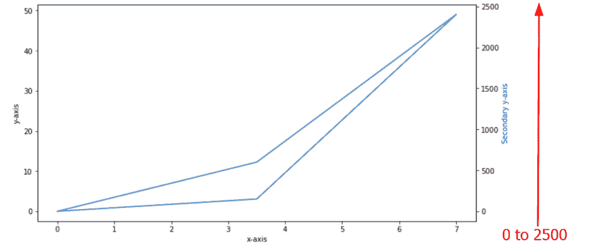

*” Plot without inverting secondary y-axis “*

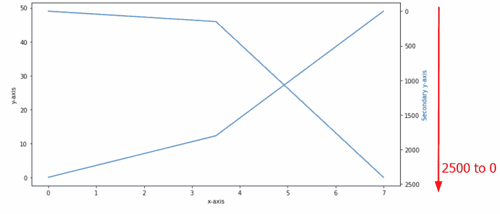

*” Plot with inverting secondary y-axis “*

读取 [Matplotlib 条形图标签](https://pythonguides.com/matplotlib-bar-chart-labels/)

## Matplotlib 3D 反转 y 轴

在本节中，我们将学习如何在 Python 中的 Matplotlib 中反转 3D 绘图。

**创建 3D 图并反转 y 轴的语法:**

```py
**# Create 3D plot**
ax.plot3D(x,y,z)

**# Invert y-axis**
matplotlib.pyplot.ylim(max(y),min(y))
```

这里 x，y 和 z 是坐标点。

**我们来看一个与此相关的例子:**

```py
**# Import Libraries**

import matplotlib
from mpl_toolkits.mplot3d import Axes3D
import matplotlib.pyplot as plt

**# Create subplots**

fig = plt.figure(figsize=(12,5), dpi=80)
ax1 = fig.add_subplot(121, projection='3d')
ax2 = fig.add_subplot(122, projection='3d')

**# Simple plot**

x=[1,1,10,10]
y=[1,10,10,10]
z=[1,1,1,10]
ax1.plot(x,y ,z , marker="o")

**# Inverted Plot**

x1=[1,1,10,10]
y1=[1,10,10,10]
z1= [1,1,1,10]

**# Function used for invert y-axis** 
plt.ylim(max(y1),min(y1))

ax2.plot(x1,y1 ,z1, marker="o")

**# Show Plot**

plt.show() 
```

*   在上面的例子中，我们导入了重要的库，如 `matplotlib.pyplot` 和 `mplot3D` 。
*   接下来，我们使用 `plot()` 方法在图形区域绘制图形。
*   通过使用 `ylim()` 方法，我们反转绘图的 y 轴。在函数中，我们通过 y1 坐标的 `max` 和 `min` 。

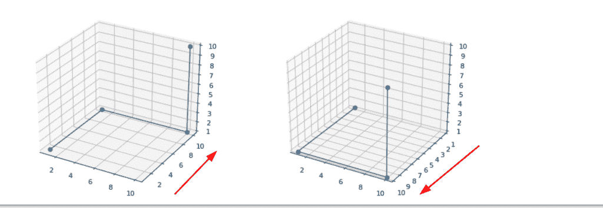

*” Invert 3 D y-axis “*

阅读[在 Python 中添加文本到绘图 matplotlib](https://pythonguides.com/add-text-to-plot-matplotlib/)

## Matplotlib flip 和 axis label

这里我们要学习 Python 中 Matplotlib 在 y 轴翻转标签。通过使用 `ylabel()` 方法，我们可以在 y 轴上添加标签并翻转它。

**举例:**

```py
**# Import Library**

from matplotlib import pyplot as plt

**# Define Data**

x=[0, 1, 2, 3, 4, 5]
y=[2, 4, 6, 8, 10, 12]

**# Plot graph**

plt.plot(x,y)

**# Flip Y-axis Label**

plt.ylabel('Y-axis',rotation=0)

**# Show**

plt.draw()
```

*   在上面的例子中，我们导入 `matplotlib.pyplot` 库进行可视化。
*   接下来，我们定义数据并使用 `plt.plot()` 方法绘制一个图。
*   通过使用 `plt.ylabel()` 方法，我们将标签设置在 y 轴上，并通过传递**旋转**参数将其水平翻转。这里我们将旋转的值设置为 `0` 。

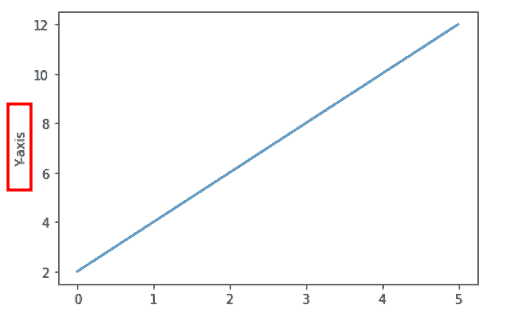

*” Y-axis label “*

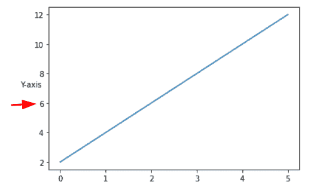

*” Output of code when we flip Y-axis label “*

读取 [Matplotlib 绘图误差线](https://pythonguides.com/matplotlib-plot-error-bars/)

## Matplotlib 逆变 y 轴 im how

这里我们学习在 Python Matplotlib 的 imshow()方法中反转 y 轴。首先，了解 `imshow` 的作用:

`inshow()` 方法显示颜色映射或 3D RGB 数组的图像。

**inshow()方法的语法如下:**

```py
matplotlib.pyplot.imshow(X, 
                        cmap=None, 
                        norm=None, 
                        aspect=None,
                        interpolation=None,
                        alpha=None,
                        vmin=None,
                        vmax=None,
                        origin=None,
                        extent=None,
                        shape=,
                        filternorm=1,
                        filterrad=4.0,
                        imlim=,
                        resample=None,
                        url=None,
                        data=None,
                        *kwargs)
```

**上面使用的参数描述如下:**

*   **X:** 指定图像的数据。
*   **cmap:** 指定色彩映射表或注册的色彩映射表名称。
*   **norm:** 是用来缩放数据的规范化实例。
*   **纵横比:**用于控制轴的纵横比。
*   **插值:**是一种用于显示图像的插值方法。
*   **alpha:** 指定颜色的强度。
*   **vmin，vmax:** 指定颜色条的范围。
*   **原点:**用于将数组的[0，0]索引放置在坐标轴的左上角或左下角。
*   **范围:**是数据坐标中的包围盒。
*   **filternorm:** 用于反颗粒图像大小调整滤镜。
*   **过滤半径:**指定过滤器的过滤半径。
*   **url:** 设置轴图像的 url。

**举例:**

```py
**# Import Libraries**

import numpy as np
from matplotlib import pyplot as plt

**# Define data**

x = np.array([[0, 1, 2, 3],
              [1, 1, 1, 3],
              [1, 2, 2, 3],
              [2, 2, 3, 3]])

**# Create subplot**

fig, ax = plt.subplots(1,2)

**# Imshow and Invert Y-axis**

for i in range(2):
    ax[0].imshow(x, cmap = 'summer', vmin = 1, vmax = 3,)
    ax[1].imshow(x, cmap = 'summer', vmin = 1, vmax = 3,   
                 origin='lower')
**# Show**

plt.show()
```

*   这里，我们使用 `np.array()` 方法定义数据，并使用 `imshow()` 方法绘制颜色图的图像。
*   我们通过参数**原点**来翻转 y 轴，并将其值设置为**下限**。

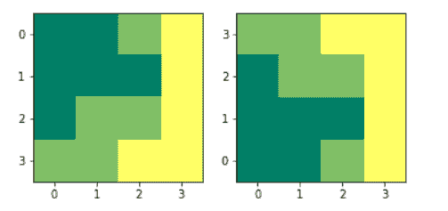

imshow(origin=’lower’)

您可能会喜欢以下 Python Matplotlib 教程:

*   [Matplotlib 移除刻度标签](https://pythonguides.com/matplotlib-remove-tick-labels/)
*   [modulenotfounderror:没有名为“matplotlib”的模块](https://pythonguides.com/no-module-named-matplotlib/)
*   [Matplotlib 绘制一条线](https://pythonguides.com/matplotlib-plot-a-line/)
*   [Python 使用 Matplotlib 绘制多条线](https://pythonguides.com/python-plot-multiple-lines/)
*   [什么是 matplotlib 内联](https://pythonguides.com/what-is-matplotlib-inline/)
*   [Python Matplotlib tick _ params](https://pythonguides.com/matplotlib-tick-params/)

在本 Python 教程中，我们已经讨论了 `"Matplotlib invert y axis"` ，我们还介绍了一些与之相关的例子。这些是我们在本教程中讨论过的以下主题。

*   Matplotlib 反转 y 轴
*   Matplotlib 反转 y 轴子图
*   Matplotlib 反转 x 和 y 轴
*   Matplotlib barh 反转 y 轴
*   Matplotlib 反转辅助 y 轴
*   matplot lib 3d reverse 和 axis
*   Matplotlib flip 和 axis label
*   matplot lib reverse 和 axis imshow

[Bijay Kumar](https://pythonguides.com/author/fewlines4biju/)

Python 是美国最流行的语言之一。我从事 Python 工作已经有很长时间了，我在与 Tkinter、Pandas、NumPy、Turtle、Django、Matplotlib、Tensorflow、Scipy、Scikit-Learn 等各种库合作方面拥有专业知识。我有与美国、加拿大、英国、澳大利亚、新西兰等国家的各种客户合作的经验。查看我的个人资料。

[enjoysharepoint.com/](https://enjoysharepoint.com/)[](https://www.facebook.com/fewlines4biju "Facebook")[](https://www.linkedin.com/in/fewlines4biju/ "Linkedin")[](https://twitter.com/fewlines4biju "Twitter")