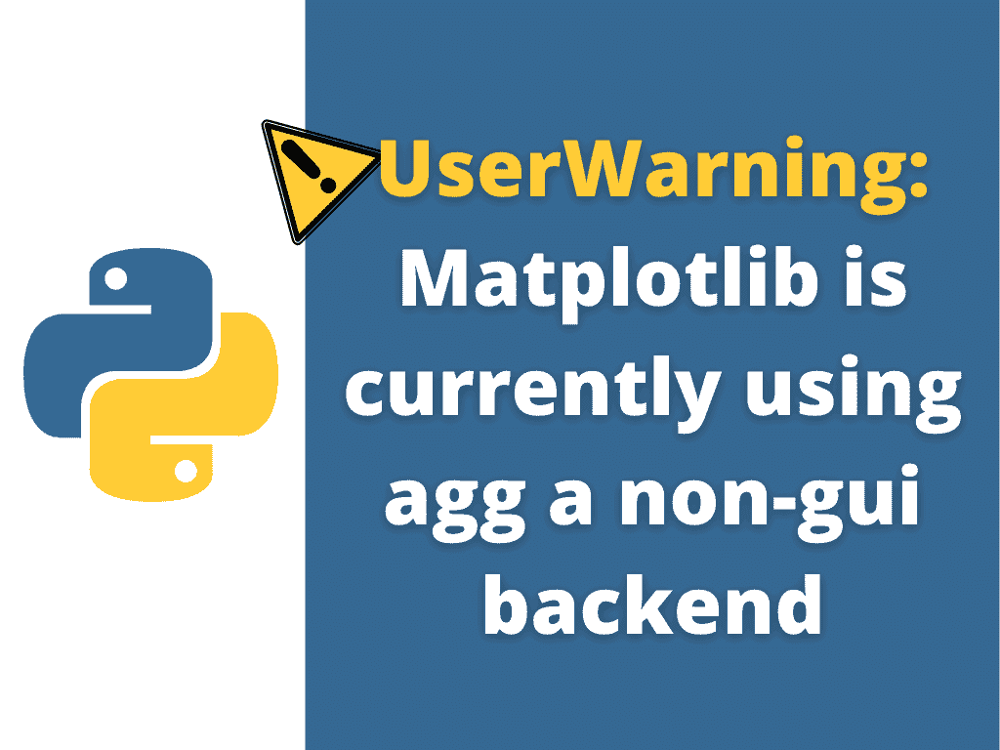

# Matplotlib 目前正在使用 agg 这一非 gui 后端

> 原文：<https://pythonguides.com/matplotlib-is-currently-using-agg-a-non-gui-backend/>

[](https://sharepointsky.teachable.com/p/python-and-machine-learning-training-course)

在本 [Python 教程](https://pythonguides.com/learn-python/)中，我们将讨论属性错误**“matplotlib 当前正在` `使用 agg 一个非 gui 后端”**。在这里，我们将使用 [matplotlib](https://pythonguides.com/what-is-matplotlib/) 介绍与此错误相关的原因和解决方案。我们还将讨论以下主题:

*   错误:matplotlib 当前正在使用 agg 非 gui 后端
*   解决方案:matplotlib 目前使用 agg 非 gui 后端



Matplotlib is currently using agg a non-gui backend

目录

[](#)

*   [错误:matplotlib 当前正在使用 agg 非 gui 后端](#Error_matplotlib_is_currently_using_agg_a_non-gui_backend "Error: matplotlib is currently using agg a non-gui backend")
*   [解决方案:matplotlib 目前正在使用 agg 一个非 gui 后端](#Solution_matplotlib_is_currently_using_agg_a_non-gui_backend "Solution: matplotlib is currently using agg a non-gui backend")
    *   [解决方案#1](#Solution_1 "Solution #1 ")
    *   [解决方案#2](#Solution2 "Solution#2")

## 错误:matplotlib 当前正在使用 agg 非 gui 后端

当我们得到**警告:Matplotlib 当前正在使用 agg 非 gui 后端**时，我们看不到图形，或者我们可以说图形的可视化是不可能的。

基本上，这个错误意味着我们必须安装 GUI 后端。

GUI 代表图形用户界面。这是一个用户界面，通过它我们可以与设备进行交互，还可以可视化绘图。在 Python 中，我们有多种开发 GUI 的方法，但最常用的方法是 **[Tkinter](https://pythonguides.com/python-gui-programming/)** 。

非 GUI 用户界面是一种机器，它允许用户在没有任何图形的情况下，只通过文本与机器进行交互。

此外，检查:[模块' matplotlib '没有属性' plot'](https://pythonguides.com/module-matplotlib-has-no-attribute-plot/)

## 解决方案:matplotlib 目前正在使用 agg 一个非 gui 后端

### 解决方案#1

在 matplotlib 中，要解决这个错误，请安装 GUI-backend tk，即 Tkinter。

`Linux`

*   使用下面提到的命令安装 GUI 后端。

**语法:**

```py
sudo apt-get install python3-tk
```

**Jupyter 笔记本**

*   使用下面提到的命令在 Jupter Notebook 中安装 GUI 后端。

**语法:**

```py
pip install tk
```

*   在 jupyter 笔记本中安装 tkinter 后，导入 Tkinter 库。

**语法:**

```py
from tkinter import *
```

**蟒蛇分布**

如果您的系统中有 Anaconda 提示符，您可以从这里使用下面提到的命令轻松安装 Tkinter。如果你不确定你是否有它，你可以很容易地在你的机器 Windows 开始菜单中看到它。

*   使用下面提到的命令安装 Anaconda 支持的 GUI。

**语法:**

```py
conda install tk
```

*   在 anaconda 中安装 tkinter 之后，导入 Tkinter 库。

**语法:**

```py
import tkinter
```

### 解决方案#2

使用 matplotlib python 安装任何 GUI 后端来解决此错误。所以这里我们将安装 PyQt5 GUI 工具包。它是 Qt 的 Python 接口，Qt 是一个健壮且广泛使用的跨平台 GUI 框架。PyQt5 是一种结合了 Python 和 Qt 库的编程语言。

**Jupyter 笔记本**

*   要在 Jupyter 笔记本中安装 PyQt5，请使用以下命令:

**语法:**

```py
pip install pyqt5
```

`Linux`

*   要在 Ubuntu Linux 或 Debian Linux 中安装 PyQt5，使用下面的命令:

**语法:**

```py
sudo apt-get install python3-pyqt5
```

**厘斯** 7

*   要在 CentOs 7 中安装 PyQt5，请使用下面的命令:

**语法:**

```py
yum install qt5-qtbase-devel 
```

**红帽基础系统**

*   要在基于 RPM 的系统(即基于 readhat 的系统)中安装 PyQt5，请使用以下命令:

**语法:**

```py
yum install PyQt5
```

**蟒蛇分布**

如果您的系统中有 Anaconda 提示符，您可以从这里使用下面提到的命令轻松安装 PyQt5。

使用下面提到的命令安装 Anaconda 支持的 GUI。

**语法:**

```py
conda install pyqt
```

你可能也喜欢阅读下面的 Matplotlib 教程。

*   [Matplotlib 饼图教程](https://pythonguides.com/matplotlib-pie-chart/)
*   [Matplotlib 散点图颜色](https://pythonguides.com/matplotlib-scatter-plot-color/)
*   [Matplotlib Plot NumPy 数组](https://pythonguides.com/matplotlib-plot-numpy-array/)
*   [Matplotlib 更新循环中的绘图](https://pythonguides.com/matplotlib-update-plot-in-loop/)
*   [Matplotlib 未知投影‘3d’](https://pythonguides.com/matplotlib-unknown-projection-3d/)
*   [Matplotlib 1.3.1 需要未安装的 nose】](https://pythonguides.com/matplotlib-1-3-1-requires-nose-which-is-not-installed/)

在本 Python 教程中，我们已经讨论了 `" `"matplotlib 当前使用 agg 的` `非 gui 后端"` "` ，我们也讨论了相关的原因和解决方案。这些是我们在本教程中讨论过的以下主题。

*   错误:matplotlib 当前正在使用 agg 非 gui 后端
*   解决方案:matplotlib 目前使用 agg 非 gui 后端

[Bijay Kumar](https://pythonguides.com/author/fewlines4biju/)

Python 是美国最流行的语言之一。我从事 Python 工作已经有很长时间了，我在与 Tkinter、Pandas、NumPy、Turtle、Django、Matplotlib、Tensorflow、Scipy、Scikit-Learn 等各种库合作方面拥有专业知识。我有与美国、加拿大、英国、澳大利亚、新西兰等国家的各种客户合作的经验。查看我的个人资料。

[enjoysharepoint.com/](https://enjoysharepoint.com/)[](https://www.facebook.com/fewlines4biju "Facebook")[](https://www.linkedin.com/in/fewlines4biju/ "Linkedin")[](https://twitter.com/fewlines4biju "Twitter")