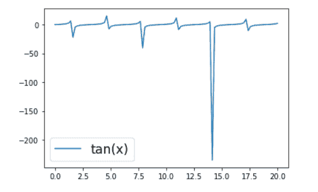

# Matplotlib 图例字体大小

> 原文：<https://pythonguides.com/matplotlib-legend-font-size/>

[](https://sharepointsky.teachable.com/p/python-and-machine-learning-training-course)

在本 [Python Matplotlib 教程](https://pythonguides.com/what-is-matplotlib/)中，我们将讨论 **Matplotlib 图例字体大小**。在这里，我们将介绍使用 Python 中的 matplotlib 与**图例字体大小**相关的不同示例。我们还将讨论以下主题:

*   Matplotlib 图例字体大小
*   Matplotlib 条形图图例字体大小
*   Matplotlib 默认图例字体大小
*   Matplotlib 图例标题字体大小

目录

[](#)

*   [Matplotlib legend font size](#Matplotlib_legend_font_size "Matplotlib legend font size")
    *   [字体大小作为参数](#Font_size_as_Parameter "Font size as Parameter")
    *   [使用 prop 关键字](#Change_font_size_using_prop_keyword "Change font size using prop keyword")改变字体大小
    *   [rcParams 方法](#rcParams_method "rcParams method ")
*   [Matplotlib 条形图图例字体大小](#Matplotlib_bar_chart_legend_font_size "Matplotlib bar chart legend font size")
*   [Matplotlib 默认图例字体大小](#Matplotlib_default_legend_font_size "Matplotlib default legend font size")
*   [Matplotlib 图例标题字体大小](#Matplotlib_legend_title_font_size "Matplotlib legend title font size")

## Matplotlib legend font size

Matplotlib 是一个 Python 包，允许你创建交互式可视化。Matplotlib 的 `legend()` 方法描述了情节的元素。在本文中，我们将学习在 Matplotlib 中更改图例字体大小。

**以下语法用于向绘图添加图例:**

```py
matplotlib.pyplot.legend(*args, **kwa)
```

**我们可以通过以下方式改变图例的字体大小:**

*   字体大小将被用作参数。
*   要修改图例中的字体大小，请使用 prop 关键字。
*   使用 rcParams 方法。

整数值或浮点值可用于字体大小选项。但是我们也可以使用' xx-small '，' x-small '，' small '，' medium '，' large '，' x-large '，' xx-large '字符串值作为字体大小。

### 字体大小作为参数

在这里，我们将学习使用 font size 参数来更改图例的字体大小。

**语法如下:**

```py
matplotlib.pyplot.legend([labels], fontsize)
```

**让我们看看与此相关的例子:**

**例#1**

在本例中，我们将看到图例的默认大小。

```py
**# Import Libraries**

import matplotlib.pyplot as plt
import numpy as np

**# Define Data**

x = np.linspace(0, 8, 100)
y = np.exp(x/2)

**# Plot**

plt.plot(x, y, color='green', label='Exp(x)')

**# Add legend**

plt.legend()

**# Add title**

plt.title("Default Legend Size")

**# Add labels**

plt.xlabel("X-axis")
plt.ylabel("Y-axis")

**# Display**

plt.show()
```

*   对于数据可视化，将 `matplotlib.pyplot` 库作为 `plt` 导入。
*   对于数据创建，将 `numpy` 库导入为 `np` 。
*   我们使用 `linspace()` 和 `exp()` 函数来定义数据坐标。
*   `plot()` 函数用于创建折线图。
*   `legend()` 方法用于将图例添加到绘图中。
*   `title()` 函数用于给图添加标题。
*   我们使用 `xlabel()` 和 `ylabel()` 分别向 x 轴和 y 轴添加标签。
*   `show()` 函数用于显示图形。


Matplotlib legend font size

在上面的输出中，我们将看到默认字体大小的图例。

**例 2**

```py
**# Import Libraries** 
import matplotlib.pyplot as plt
import numpy as np

**# Define Data** 
x = np.linspace(0, 8, 100)
y = np.exp(x/2)

**# Plot** 
plt.plot(x, y, color='green', label='Exp(x)')

**# Add legend**

plt.legend(fontsize=18)

**# Add title**

plt.title("Fontsize Parameter To change Legend Size")

**# Add labels**

plt.xlabel("X-axis")
plt.ylabel("Y-axis")

**# Display** 
plt.show()
```

*   在这里，我们通过将 `label` 参数传递给 `plot()` 函数，为绘图设置图例。
*   为了给绘图显示图例，我们使用 `legend()` 函数。
*   为了改变图例的大小，我们将参数 `fontsize` 传递给 legend 方法，并将其大小设置为 18。


Matplotlib legend font size parameter

### 使用 prop 关键字改变字体大小

在 matplotlib 中，我们可以使用 prop 参数来更改 legend 的字体大小属性。

**语法如下:**

```py
matplotlib.pyplot.legend([labels], prop={'size':10})
```

**让我们看看与此相关的例子:**

**例#1**

```py
**# Import Libraries**

import matplotlib.pyplot as plt
import numpy as np

**# Define Data**

x = np.linspace(0, 10, 100)
y1 = np.sin(x/2)
y2 = np.cos(x/2)

**# Plot**

plt.plot(x, y1, label='Sin')
plt.plot(x, y2, label='Cos')

**# Add legend** 
plt.legend(prop={'size':15})

**# Add title**

plt.title("Prop Parameter To change Legend Size")

**# Add labels**

plt.xlabel("X-axis")
plt.ylabel("Y-axis")

**# Display** 
plt.show()
```

*   首先，我们导入必要的库，如 `matplotlib.pyplot` 和 `numpy` 。
*   为了定义数据坐标，我们使用了 `linspace()` 、 `sin()` 和 `cos()` 函数。
*   要绘制折线图，我们使用 `plot()` 函数。
*   为了给绘图添加一个图例，我们使用 `legend()` 函数。
*   为了修改图例标签文本的大小，我们将 `prop` 参数传递给 legend 方法。我们传递**大小**作为键，传递 `15` 作为值来支持字典。
*   要添加标题，我们使用 `title()` 函数。
*   为了在轴上添加标签，我们使用了 `xlabel()` 和 `ylabel()` 函数。
*   为了在用户屏幕上可视化图形，我们使用了 `show()` 函数。


Matplotlib legend font size prop

**例 2**

```py
**# Import Libraries**

import matplotlib.pyplot as plt
from numpy.random import random

**# Define color data**

colors = ['maroon', 'teal', 'yellow']

**# Plot**

data1 = plt.scatter(random(30), random(30), marker='d', 
                    color=colors[0],label='Label 1')
data2 = plt.scatter(random(50), random(50), marker='d', 
                    color=colors[1],label='Label 2')
data3 = plt.scatter(random(25), random(25), marker='d', 
                    color=colors[1],label='Label 3')
data4 = plt.scatter(random(20), random(20), marker='d', 
                    color=colors[2],label='Label 4')
data5 = plt.scatter(random(10), random(10), marker='d', 
                    color=colors[0],label='Label 5')

**# Add legend**

plt.legend(loc='upper center', prop={'size':13.89}, 
           bbox_to_anchor=(0.5, -0.08), ncol=2)

**# Display**

plt.show()
```

*   导入 `matplotlib.pyplot` 库进行数据可视化。
*   从**号**导入**随机**。
*   接下来，我们定义颜色列表。
*   然后，我们使用 `scatter()` 函数进行绘图。
*   为了改变绘图，我们传递了**标记**、**颜色**和**标签**参数。
*   为了在绘图中显示图例，我们使用了 `legend()` 函数。
*   为了美化这个传说，我们将 `loc` 、 `bbox_to_anchor` 和 `ncol` 作为参数传递。
*   为了改变图例文本的大小，我们将带有**大小**键的 `prop` dict 作为参数传递给 legend 函数。


Matplotlib legend font size prop argument

### rcParams 方法

`matplotlib.rcparams` 变量是一个类似于字典的变量，包含了修改默认参数的所有设置。使用关键字参数， `matplotlib.rc()` 函数可用于调整各种设置。

**语法如下:**

```py
matplotlib.pyplot.rc(group, **kwargs)
```

**我们来看一个例子:**

```py
**# Import Library**

import matplotlib.pyplot as plt

**# Define Data**

x = [2, 3, 4, 5, 6, 7, 8, 9]
y1 = [4, 9, 16, 25, 36, 49, 64, 81]
y2 = [8, 27, 64, 125, 216, 343, 512, 729]

**# Plot**

plt.plot(x, y1, label='Square')
plt.plot(x, y2, label='Cube')

**# Size**

plt.rc('legend', fontsize=21)

**# Add legend**

plt.legend()

**# Add title**

plt.title("rcParams To change Legend Size")

**# Add labels** 
plt.xlabel("X-axis")
plt.ylabel("Y-axis")

**# Display**

plt.show()
```

*   将 `matplotlib.pyplot` 库作为 plt 导入。
*   接下来，我们定义数据坐标。
*   为了绘制坐标之间的图形，我们使用 `plot()` 函数。
*   为了给图形添加图例，我们使用 `legend()` 函数，图例的**标签**在 plot 函数中定义。
*   要更改图例文本的默认大小，我们使用 `rc()` 方法并传递一个关键字参数 `fontsize` 。
*   为了给绘图添加一个标题，我们使用了 `title()` 函数。
*   为了在 x 轴上添加标签，我们使用了 `xlabel()` 函数。
*   为了在 y 轴上添加标签，我们使用了 `ylabel()` 函数。


Matpotlib legend font size rc

阅读: [Matplotlib 散点图图例](https://pythonguides.com/matplotlib-scatter-plot-legend/)

## Matplotlib 条形图图例字体大小

在这里，我们将学习使用 matplotlib 更改条形图的图例字体大小。

**让我们看看与此相关的例子:**

**例#1**

在这个例子中，我们用一个数字来指定字体大小。

```py
**# Import Library**

import numpy as np 
import matplotlib.pyplot as plt 

**# Set figure size**

plt.figure(figsize=(7.5,4))

**# Define Data**

team = ['Team 1','Team 2','Team 3','Team 4','Team 5']
won = [15, 10, 30, 20, 25]
lose = [5, 20, 15, 16, 13]

x_axis = np.arange(len(team))

**# Multi bar Chart**

plt.bar(x_axis -0.2, won, width=0.4, label = 'Match_Won')
plt.bar(x_axis +0.2, lose, width=0.4, label = 'Match_Lose')

**# Xticks**

plt.xticks(x_axis, team)

**# Add labels**

plt.xlabel("Team", fontsize=12, fontweight='bold')
plt.ylabel("Matches", fontsize=12, fontweight='bold')

**# Add legend**

plt.legend(fontsize=18)

**# Display** 
plt.show()
```

*   导入用于数据创建的 `numpy` 库。
*   导入 `matplotlib.pyplot` 进行数据可视化。
*   为了设置图形大小，我们将 `figsize` 参数传递给 `figure()` 方法。
*   在这之后，我们定义用于绘图的数据。
*   要生成一系列值，请使用 `np.arange()` 方法。
*   然后使用 `plt.bar()` 函数创建多个条形图。
*   为了避免重叠，我们将杆 `-0.2` 和 `0.2` 移动到远离 x 轴的位置。
*   然后将杆的宽度固定为 `0.4` 。
*   为了指定 x 轴上的刻度，我们使用了 `xticks()` 函数。
*   为了在轴上添加标签，我们使用了 `xlabel()` 和 `ylabel()` 函数。
*   为了给绘图添加图例，我们使用 `legend()` 函数。
*   要更改图例中文本的字体大小，我们使用一个数字来指定字体大小。


Matplotlib bar chart legend font size

**例 2**

在这个例子中，我们使用一个字符串来指定字体大小。

```py
**# Import Library** 
import matplotlib.pyplot as plt

**# Define Data**

Class = ["First", "Second", "Third", "Fourth", "Fifth"]
Males = [15, 20, 16, 18, 25]
Females = [10, 12, 5, 9, 15]

**# Define height of stacked chart** h = 0.6

**# Plot stacked bar chart** 
plt.barh(Class, Males, h, label='Males')
plt.barh(Class, Females, h, left=Boys, label='Females')

**# Set fontsize of legend** 
plt.legend(fontsize='x-small')

**# Display**

plt.show()
```

*   我们在上面的例子中导入了 `matplotlib.pyplot` 包。
*   然后定义条形的数据和高度。
*   然后，使用 `plt.barh()` 方法，我们创建条形图，然后我们传递 `left` 作为参数，将这个简单的条形图转换为堆叠条形图。
*   为了给绘图添加一个图例，我们使用 `legend()` 函数。
*   要改变图例中文本的字体大小，我们使用一个**字符串**来指定字体大小。


Matplotlib legend font size bar chart

在这里，我们将字体大小设置为超小，即 x-small。

另外，检查:[将图例放在绘图 matplotlib 之外](https://pythonguides.com/put-legend-outside-plot-matplotlib/)

## Matplotlib 默认图例字体大小

上面，我们学习了改变图例文本的默认字体大小。所以，在这里，我们会看到更多与此相关的例子。

**例#1**

```py
**# Import Libraries**

import numpy as np
import matplotlib.pyplot as plt

**# Create subplot**

fig, ax = plt.subplots()

**# Define Data** 
x = np.linspace(0, 5, 250)
y1 = np.cos(x)
y2 = np.sin(x)

**# Plot**

ax.plot(x, y1, '--b', label ='Cos')
ax.plot(x, y2, c ='r', label ='Sin')

**# Set axes**

ax.axis('equal')

**# Default legend fontsize**

plt.rc('legend',fontsize='xx-large')

**# Legend**

ax.legend();

**# Show**

plt.show()
```

*   导入 `numpy` 和 `matplotlib.pyplot` python 库。
*   为了创建一个支线剧情，我们使用**支线剧情()**函数。
*   为了定义数据坐标，我们使用了 `linspace()` 、 `cos()` 和 `sin()` 函数。
*   要绘制折线图，我们使用 `plot()` 函数。
*   然后，我们通过使用 `axis()` 函数将轴设置为相等。
*   为了设置图例的默认字体大小，我们使用 `rc()` 方法并传递**字体大小**作为关键字参数。
*   为了给绘图添加一个图例，我们使用 `legend()` 函数。


Matplotlib default legend font size

**例 2**

这里，我们将使用 rc.params.update()函数来指定默认的图例字体大小。

```py
**# Import Libraries** 
import matplotlib.pyplot as plt
import numpy as np

**# Define Data**

x = np.linspace(0, 20, 100)
y = np.cos(x)

**# Plot graph**

plt.plot(x, y, label="cos(x)")

**# Default legend fontsize**

plt.rcParams.update({'legend.fontsize': 18})

**# Legend** 
plt.legend()

**# Display**

plt.show()
```

*   导入必要的库，例如， `numpy` 和 `matplotlib` 。
*   然后，定义 x 和 y 数据坐标。
*   为了定义数据坐标，我们使用 numpy 的 `linspace()` 和 `cos()` 函数。
*   为了绘制数据坐标之间的图形，我们使用了 `plot()` 函数。
*   接下来， `plt.rcParams.update()` 使用字典参数来更新 Matplotlib 属性和样式。
*   matplotlib 图例字体大小由 `legend.fontsize` 参数指定。
*   为了显示图表的图例，我们使用了 `legend()` 函数。
*   为了显示这个图，我们使用了 `show()` 函数。


`matplotlib-default-legend-font-size`

**例 3**

这里，我们通过将键放在括号[]中来更新 `rcParams` 字典。

```py
**# Import Libraries** 
import matplotlib.pyplot as plt
import numpy as np

**# Legend font size** 
plt.rcParams['legend.fontsize'] = 'xx-large'

**# Define Data**

x = np.linspace(0, 20, 100)
y = np.tan(x)

**# Plot graph** 
plt.plot(x, y, label="tan(x)")

**# Legend**

plt.legend()

**# Display** 
plt.show()
```

*   将 `matplotlib.pyplot` 导入为 `plt` 进行数据可视化。
*   导入 `numpy` 作为 `np` 进行数据创建。
*   为了设置图例的字体大小，我们使用 `rcParams` 字典并将关键字放在括号[]中。这里的关键是 `legend.fontsize` 。
*   为了定义 x 和 y 数据坐标，我们使用了 `linspace()` 和 `tan()` 函数。
*   为了绘制图表，我们使用了 `plot()` 函数。
*   为了给绘图添加图例，我们使用了 `legend()` 函数。
*   为了在用户屏幕上可视化绘图，我们使用了 `show()` 函数。



Matplotlib default legend font size rcParams

阅读: [Matplotlib 增加绘图大小](https://pythonguides.com/matplotlib-increase-plot-size/)

## Matplotlib 图例标题字体大小

我们将使用 matplotlib 来改变图例标题字体的大小。默认没有标题。我们必须向 legend 函数传递一个标题参数来设置标题。

**让我们看看与此相关的例子**:

**例#1**

在本例中，我们将学习全局更改 legend 的标题大小。

```py
**# Import Libraries** 
import matplotlib.pyplot as plt
import numpy as np

**# Legend Font Size**

plt.rcParams['legend.title_fontsize'] = 'x-large'

**# Define Data**

x = np.random.randint(low = 0, high = 60, size = 50)
y = np.random.randint(low = -15, high = 80, size = 50)

**# Plot**

plt.plot(x, color='slategrey', label='Line 1')
plt.plot(y, color= '#EE1289', linestyle = ':', label='Line 2')

**# Legend** 
plt.legend(fontsize='small',title='Legend Title')

**# Display** 
plt.show()
```

*   首先，我们导入必要的库，如 `numpy` 和 `matplotlib.pyplot` ，分别用于数据创建和数据可视化。
*   然后，我们通过使用括号中的 `plt.rcParams` 字典和 `legend.title_fontsize` 键来全局更改图例标题字体大小。
*   之后，我们使用 `numpy` 的 `random.randint()` 函数进行数据定义。
*   为了绘制折线图，我们使用了 `plot()` 函数。
*   为了美化情节，我们通过**颜色**、**线型**作为参数来设置线条的颜色和线型。
*   为了在图上设置图例，我们通过 `legend()` 函数。
*   为了改变图例文本的字体大小，我们将 `fontsize` 作为参数传递。
*   为了给图例添加标题，我们将标题作为参数传递。
*   为了在用户屏幕上显示图形，我们使用了 `show()` 函数。


Matplotlib legend title font size

**例 2**

在本例中，我们将使用 title_fontsize 参数来更改图例标题的大小。

```py
**# Import Library**

import matplotlib.pyplot as plt

**# Set figure size**

plt.figure(figsize=(6,5))

**# Define Data Coordinates**

popularity = [45, 14, 13, 7, 21]

emojis = ['Happy Face', 'Sad Face', 'Hearts', 'Hand Gestures', 
          'Others']

**# Plot**

plt.pie(popularity) 

**# Legend**

plt.legend(labels=emojis,bbox_to_anchor=(0.16,0.96), 
           ncol=2, title='EMOJIS', title_fontsize=18)

**# Display**

plt.show() 
```

*   导入 `matplotlib.pyplot` 库进行数据可视化。
*   要设置图的大小，我们使用带有 figsize 参数的 `figure()` 方法。
*   之后，我们定义要绘制的数据值。
*   然后，我们定义了一个字符串序列列表，它设置了每个楔形区的标签。
*   为了绘制饼图，我们使用了 `pie()` 函数。
*   为了给绘图添加一个图例，我们使用了 `legend()` 函数，并将**标签**参数传递给它。
*   我们还将 `bbox_to_anchor` 和 `ncol` 参数传递给函数，以设置图例的位置，并在图例框中定义列。
*   为了设置图例的标题，我们将参数 `title` 传递给函数。
*   为了修改图例标题的大小，我们传递参数 `title_fontsize` 并将其设置为 18。
*   要显示图形，使用 `show()` 功能。


Matplotlib font size of legend title

**例 3**

在本例中，我们将使用 set_fontsize 参数来更改图例标题的字体大小。

```py
**# Import Library**

import matplotlib.pyplot as plt

**# Set axes**

fig = plt.figure() 
ax = fig.add_subplot(111) 

**# Define Data Coordinates** 
popularity = [20, 16, 35, 9]

**# Define Label**

books = ['Story Books','Comic Books', 'Puzzel Books', 
         'Poem Books']

**# Color**

colors=['rosybrown', 'moccasin', 'lightyellow', 'darkseagreen']

**# Plot with different edgecolor**

plt.pie(popularity, wedgeprops={'edgecolor':'maroon'}, 
        colors=colors)

**# Set title font** 
lg = ax.legend(labels=books,title='BOOKS',
               bbox_to_anchor=(0.45,-0.1),ncol=2,
               loc='center')
title = lg.get_title()
title.set_fontsize('x-large')

**# Add title** 
plt.title('Favourite Books',fontweight='bold')

**# Display** 
plt.show()
```

*   首先，我们导入 `matplotlib` 库进行数据可视化。
*   然后，作为子图布局的一部分，matplotlib 包的图形模块用于向图形添加轴。
*   之后，我们定义要绘制的数据值。
*   然后，我们定义了一个字符串序列列表，它设置了每个楔形区的标签。
*   我们还定义了颜色列表。
*   要绘制饼图，请使用 `pie()` 方法。
*   我们还定义了饼图中扇区的边缘颜色和颜色。
*   为了设置带有标题的图例，我们使用带有**标签**和**标题**参数的 `legend()` 方法。
*   然后我们通过使用 `get_title()` 函数得到图例标题。
*   要改变图例标题的字体大小，我们使用 `set_fontsize()` 方法，将其设置为 `x-large` 。
*   为了给情节添加一个标题，我们使用 `title()` 方法。
*   要显示该图，请使用 `show()` 方法。


Font size of matplotlib legend title

你可能也喜欢阅读下面的 Matplotlib 教程。

*   [Matplotlib 2d 表面图](https://pythonguides.com/matplotlib-2d-surface-plot/)
*   [Matplotlib 时间序列图](https://pythonguides.com/matplotlib-time-series-plot/)
*   [Matplotlib 不显示图](https://pythonguides.com/matplotlib-not-showing-plot/)
*   [Matplotlib 设定 y 轴范围](https://pythonguides.com/matplotlib-set-y-axis-range/)
*   [Matplotlib 多个图](https://pythonguides.com/matplotlib-multiple-plots/)
*   [Matplotlib 饼图教程](https://pythonguides.com/matplotlib-pie-chart/)

因此，在本 Python 教程中，我们已经讨论了"`Matplotlib legend font-size "`，并且我们还涵盖了一些与之相关的例子。这些是我们在本教程中讨论过的以下主题。

*   Matplotlib 图例字体大小
*   Matplotlib 条形图图例字体大小
*   Matplotlib 默认图例字体大小
*   Matplotlib 图例标题字体大小

[Bijay Kumar](https://pythonguides.com/author/fewlines4biju/)

Python 是美国最流行的语言之一。我从事 Python 工作已经有很长时间了，我在与 Tkinter、Pandas、NumPy、Turtle、Django、Matplotlib、Tensorflow、Scipy、Scikit-Learn 等各种库合作方面拥有专业知识。我有与美国、加拿大、英国、澳大利亚、新西兰等国家的各种客户合作的经验。查看我的个人资料。

[enjoysharepoint.com/](https://enjoysharepoint.com/)[](https://www.facebook.com/fewlines4biju "Facebook")[](https://www.linkedin.com/in/fewlines4biju/ "Linkedin")[](https://twitter.com/fewlines4biju "Twitter")