# Matplotlib log log plot

> 原文：<https://pythonguides.com/matplotlib-log-log-plot/>

[](https://sharepointsky.teachable.com/p/python-and-machine-learning-training-course)

在本 python 教程中，我们将讨论 Python 中的 `Matplotlib log log plot` 来绘制具有对数标度的图形，我们还将涵盖以下主题:

*   Matplotlib log log plot
*   Matplotlib 对数对数标度基数为 2
*   Matplotlib 对数对数负标度
*   Matplotlib 日志日志散点图
*   Matplotlib 日志日志直方图
*   Matplotlib 日志日志绘图误差线
*   Matplotlib 日志日志网格
*   Matplotlib 对数对数标度
*   Matplotlib 对数对数刻度刻度
*   Matplotlib 对数对数标度 y
*   Matplotlib 对数对数对数标度 x
*   Matplotlib 对数对数刻度次要刻度
*   Matplotlib 对数对数刻度颜色条

目录

[](#)

*   [Matplotlib 测井记录图](#Matplotlib_log_log_plot "Matplotlib log log plot")
*   [Matplotlib 对数对数对数标度基数 2](#Matplotlib_loglog_log_scale_base_2 "Matplotlib loglog log scale base 2")
*   [Matplotlib 对数对数对数标度负值](#Matplotlib_loglog_log_scale_negative "Matplotlib loglog log scale negative")
*   [Matplotlib 日志日志散布图](#Matplotlib_log_log_scatter "Matplotlib log log scatter")
*   [Matplotlib 测井柱状图](#Matplotlib_log_log_histogram "Matplotlib log log histogram")
*   [Matplotlib 测井记录绘图误差线](#Matplotlib_log_log_plot_error_bars "Matplotlib log log plot error bars")
*   [Matplotlib 日志日志网格](#Matplotlib_log_log_grid "Matplotlib log log grid")
*   [Matplotlib 对数对数标度](#Matplotlib_loglog_log_scale "Matplotlib loglog log scale")
*   [Matplotlib 对数对数刻度刻度](#Matplotlib_loglog_log_scale_ticks "Matplotlib loglog log scale ticks")
*   [Matplotlib 对数对数 y 标度](#Matplotlib_loglog_log_scale_y "Matplotlib loglog log scale y")
*   [Matplotlib 对数对数对数标度 x](#Matplotlib_loglog_log_scale_x "Matplotlib loglog log scale x")
*   [Matplotlib 对数对数刻度小刻度](#Matplotlib_loglog_log_scale_minor_ticks "Matplotlib loglog log scale minor ticks")
*   [Matplotlib 对数对数对数刻度颜色条](#Matplotlib_loglog_log_scale_colorbar "Matplotlib loglog log scale colorbar")

## Matplotlib 测井记录图

在 python 中， [matplotlib](https://pythonguides.com/what-is-matplotlib/) 提供了一个函数 `loglog` ，该函数可以在两个轴(x 轴和 y 轴)上绘制对数比例图。

```py
matplotlib.pyplot.loglog(x, y[, linewidth, color, basex, basey, ...])
```

在上面的语法中，

*   *x* 指定要绘制的 x 轴数值。
*   *y* 指定要绘制的 y 轴数值。
*   我们可以指定 matplotlib 中基本绘图所支持的任何参数，如*线宽*、*颜色*、*线型*、*标签*等。
*   除了基本的绘图参数外，还可以指定以下参数:
    *   *basex* 和 *basey* :我们可以分别使用 *basex* 和 *basey* 来指定 x 轴和 y 轴的对数刻度的基数。默认基数是 10。
    *   *subsx* 和 *subsy* :我们可以使用 *subsx* 和 *subsy* 在图形上指定次要 x 和 y 刻度的位置。如果没有，将根据地块中的十年数自动选择合理的位置。
    *   *nonposx* 和 *nonposy* :我们可以**屏蔽**x 和 y 中的非正值为无效，或者**将它们**削成一个很小的正数。默认情况下，它被屏蔽。

现在，让我们通过一个例子来实现我们的理解:

```py
# Importing necessary libraries
import numpy as np
from matplotlib import pyplot as plt

# Preparing the data for the plot
x = np.arange(0.0, 10.0, 0.005)
y = np.exp(2.3 * x + 3.7)

# Creating figure and axes
fig, (ax1, ax2) = plt.subplots(2, 1, figsize=[7, 11])

# Plotting the graph without using loglog
ax1.plot(x, y, ':b', linewidth=2, label='e ^ (2.3 * x + 3.7)')
ax1.set_title('Exponential plot', fontsize=15)
ax1.set_xlabel('x-axis', fontsize=13)
ax1.set_ylabel('y-axis', fontsize=13)
ax1.legend()

# Plotting the graph with Log ticks at x and y axis using loglog
ax2.loglog(x, y, '--r', linewidth=2, label='e ^ (2.3 * x + 3.7)')
ax2.set_title('loglog exponential plot', fontsize=15)
ax2.set_xlabel('log(x)', fontsize=13)
ax2.set_ylabel('log(y)', fontsize=13)
ax2.legend()

plt.tight_layout()
plt.show()
```

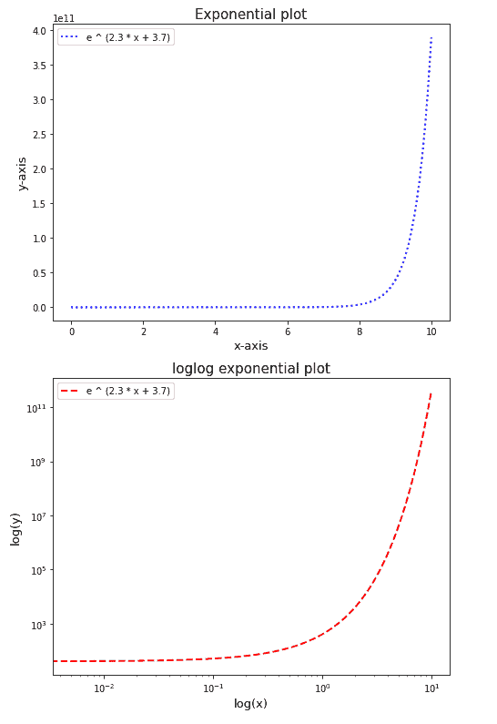

Matplotlib log log plot

阅读:[如何安装 matplotlib python](https://pythonguides.com/how-to-install-matplotlib-python/)

## Matplotlib 对数对数对数标度基数 2

我们可以通过在`matplotlib . py plot . loglog()`函数中分别为 x 轴和 y 轴指定参数 `basex` 和 `basey` 来更改图表轴的对数刻度的基数。因此，对于图形的任何轴，将基数更改为 2

让我们通过一个例子来实现这个概念，将 x 轴的基点改为 2:

```py
# Importing necessary libraries
import numpy as np
from matplotlib import pyplot as plt

# Preparing the data for the plot
x = np.arange(0.0, 10.0, 0.005)
y = np.exp(2.3 * x + 3.7)

# Resizing the figure
plt.figure(figsize=[7, 5])

# Plotting the graph with Log ticks at x and y axis using loglog
plt.loglog(x, y, '--r', basex=2, linewidth=2, 
           label='e ^ (2.3 * x + 3.7)')
plt.title('loglog exponential plot with x-axis log base 2', 
          fontsize=15)
plt.xlabel('log(x)', fontsize=13)
plt.ylabel('log(y)', fontsize=13)

plt.legend()
plt.show()
```

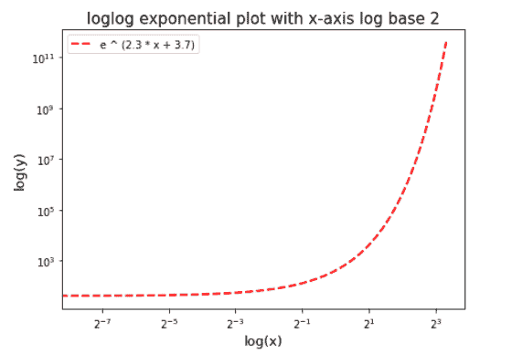

Matplotlib loglog log scale base 2

阅读: [Matplotlib 绘制一条线](https://pythonguides.com/matplotlib-plot-a-line/)

## Matplotlib 对数对数对数标度负值

Matplotlib 通过分别为 x 轴和 y 轴指定参数 `nonposx` 和 `nonposy` 来处理图表的对数刻度轴的负值。

我们可以将值**‘mask’**或**‘clip’**指定给参数 `nonposx` 和 `nonposy` 。

**‘mask’**使图形忽略轴上数据点的负值，并将负值视为无效。并且**‘clip’**将负值数据点改变为小的正值。

现在，让我们通过一些实际例子来理解这个概念:

```py
# Importing necessary libraries
import numpy as np
from matplotlib import pyplot as plt

# Preparing the data for the plots
x = np.linspace(-2.0, 2.0, 20)
y = 2.1 +  3.1 * (x ** 3)

# Resizing the figure
plt.figure(figsize=[8, 10])

# Plotting the loglog graph with neglecting negative values
plt.subplot(211)
plt.loglog(x, y, 'r', basex=2, basey=2, nonposx='mask', nonposy='mask')
plt.title('loglog neglecting negative values', fontsize=15)
plt.xlabel('log(x)', fontsize=13)
plt.ylabel('log(y)', fontsize=13)

# Plotting the loglog graph with negative values to be changed to
# small positives
plt.subplot(212)
plt.loglog(x, y, 'g', basex=2, basey=2, nonposx='clip', nonposy='clip')
plt.title('loglog with negative values change into small positives', fontsize=15)
plt.xlabel('log(x)', fontsize=13)
plt.ylabel('log(y)', fontsize=13)

plt.tight_layout()
plt.show()
```

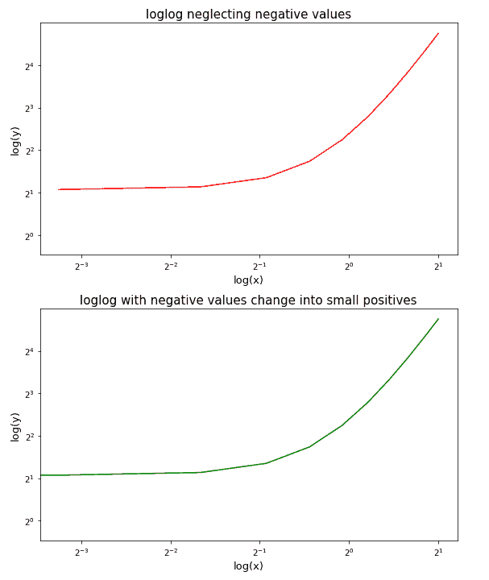

Matplotlib loglog log scale negative

阅读: [Python 使用 Matplotlib 绘制多条线](https://pythonguides.com/python-plot-multiple-lines/)

## Matplotlib 日志日志散布图

我们可以使用 python 中的`matplotlib . py plot . log log()`函数将散点图的比例更改为对数比例。

我们可以通过以下两种方法之一做到这一点:

*   上面讨论的方法，直接使用`matplotlib . py plot . log log()`函数并指定值**'。'**到参数*线型*，用于绘制图形以及将轴刻度改为对数刻度。
*   或者我们可以先创建一个散点图，使用`matplotlib . py plot . scatter()`函数来绘制图形，然后指定带有所需参数的`matplotlib . py plot . log log()`函数来将轴的刻度更改为对数刻度。

让我们通过一个例子来实现第二种方法:

```py
# Importing necessary libraries
import numpy as np
from matplotlib import pyplot as plt

# Preparing the data for the plot
x = np.arange(1, 100, 5)
y = 32 * x

# Resizing the figure
plt.figure(figsize=[7, 5])

# Plotting the scatter plot
plt.scatter(x, y, c='g', alpha=0.6)
plt.title('loglog linear plot with y-axis log base 2', fontsize=15)
plt.xlabel('log(x) base 10', fontsize=13)
plt.ylabel('log(y) base 2', fontsize=13)

# Changing to the log ticks at x and y axis using loglog
plt.loglog(basex=10, basey=2)

plt.show()
```

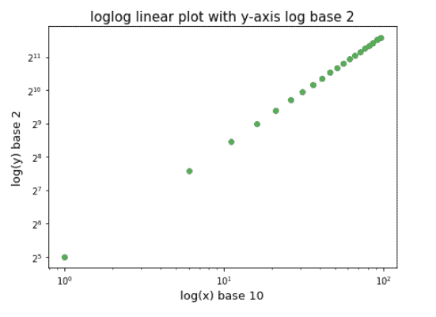

Matplotlib log log scatter

阅读:[什么是 matplotlib 内联](https://pythonguides.com/what-is-matplotlib-inline/)

## Matplotlib 测井柱状图

我们可以通过将值 `True` 指定给 `matplotlib.pyplot.hist()` 函数中的参数 `log` 来改变 python 中直方图坐标轴的刻度。

它会将直方图的 y 轴比例更改为对数比例，默认基数为 10。

让我们通过一个例子来实现这个概念:

```py
# Importing necessary libraries
import numpy as np
from matplotlib import pyplot as plt

# Preparing the data for the plots
np.random.seed(217)
x = np.random.randn(10000)
nbins = 15

# Resizing the figure
plt.figure(figsize=[9, 11])

# Plotting the histogram without log scale
plt.subplot(211)
plt.hist(x, bins=nbins)
plt.title('Histogram', fontsize=15)
plt.xlabel('x-axis (bins)', fontsize=13)
plt.ylabel('y-axis (Heights)', fontsize=13)

# Plotting the histogram on log scale 
plt.subplot(212)
plt.hist(x, bins=nbins, log=True, color='g')
plt.title('Histogram on log scale', fontsize=15)
plt.xlabel('x-axis (bins)', fontsize=13)
plt.ylabel('log(y): log(Heights)', fontsize=13)

plt.tight_layout()
plt.show()
```

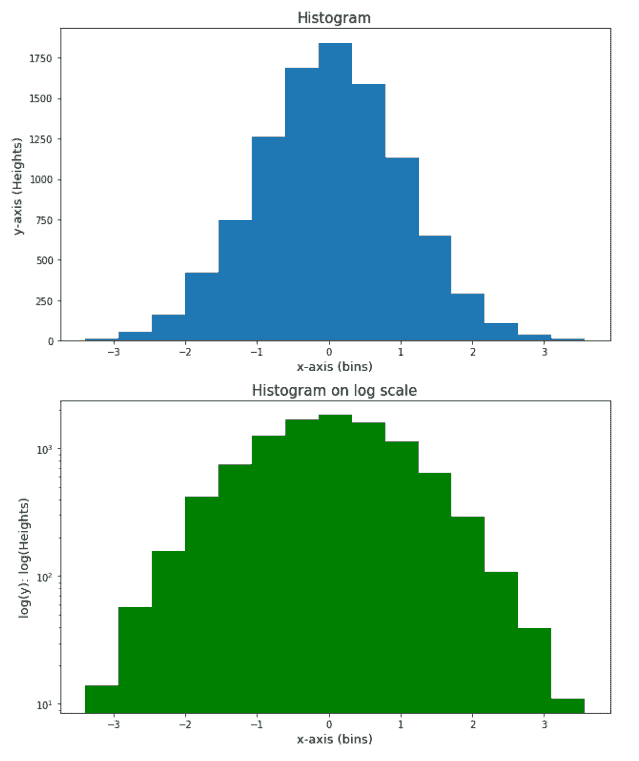

Matplotlib log log histogram

阅读: [Matplotlib 绘图条形图](https://pythonguides.com/matplotlib-plot-bar-chart/)

## Matplotlib 测井记录绘图误差线

我们可以通过使用带有指定的 `nonposx` 和 `nonposy` 参数的`matplotlib . py plot . log log()`函数，将图表上绘制的误差线的刻度更改为对数刻度。

误差线的值可以是负值，因此我们必须将参数 `nonposx` 和 `nonposy` 的值指定为【T4’clip’，以将负值更改为较小的正值，并将其绘制到图形中。

让我们以上述概念的实现为例来看看:

```py
# Importing necessary libraries
import numpy as np
from matplotlib import pyplot as plt

# Preparing the data for the plots
x = 10.0**np.linspace(0.0, 2.0, 20)
y = 2.1 * (x ` 3) + 3.1 * (x ` 2)
x_err = 0.1 * x
y_err = 7.0 + 0.35 * y

# Resizing the figure
plt.figure(figsize=[8, 10])

# Plotting the errorbars without log scale
plt.subplot(211)
plt.errorbar(x, y, xerr=x_err, yerr=y_err)
plt.title('Errorbars', fontsize=15)
plt.xlabel('x-axis', fontsize=13)
plt.ylabel('y-axis', fontsize=13)

# Plotting the errorbars with log scale
plt.subplot(212)
plt.errorbar(x, y, xerr=x_err, yerr=y_err, color='g')
plt.loglog(nonposx='clip', nonposy='clip')
plt.title('Errorbars on log scale', fontsize=15)
plt.xlabel('log(x)', fontsize=13)
plt.ylabel('log(y)', fontsize=13)

plt.tight_layout()
plt.show()
```

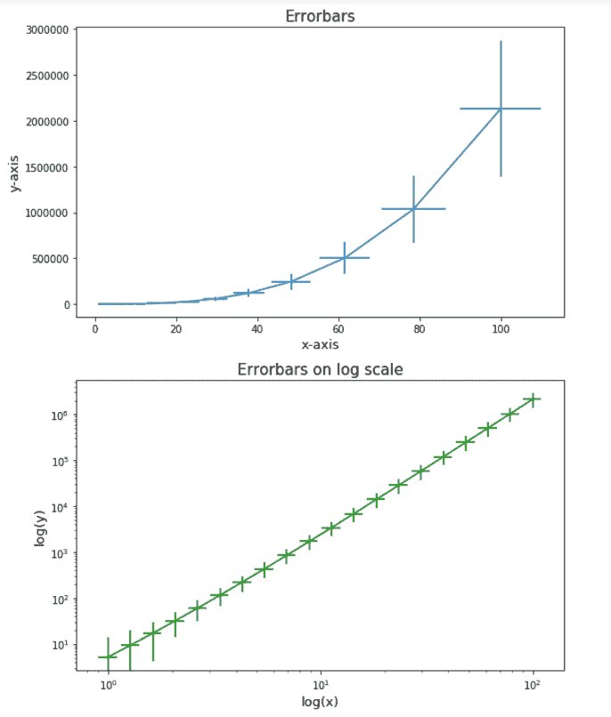

Matplotlib log log plot error bars

阅读: [Matplotlib 支线剧情教程](https://pythonguides.com/matplotlib-subplot-tutorial/)

## Matplotlib 日志日志网格

我们可以通过在图形语句中添加语句 `matplotlib.pyplot.grid()` 来指定对数标度图形中的网格线。

我们来练习一个例子，让概念更清晰。在下面给出的例子中，我们用不同类型的图形创建了 4 个子图，每个图形都有网格线:

```py
# Importing necessary libraries
import numpy as np
from matplotlib import pyplot as plt

# Resizing the figure
plt.figure(figsize=[11, 10])

# Preparing the data for the plot
x1 = np.arange(0.0, 10.0, 0.005)
y1 = np.exp(2.3 * x1 + 3.7)

# Plotting the graph with Log ticks at x and y axis using loglog
plt.subplot(221)
plt.loglog(x1, y1, '--r', basex=2, linewidth=3)
plt.title('loglog exponential plot', fontsize=15)
plt.xlabel('log(x) base 2', fontsize=13)
plt.ylabel('log(y) base 10', fontsize=13)
plt.grid()

# Preparing the data for the plot
x2 = np.arange(1, 100, 5)
y2 = 32 * x2

# Plotting the scatter plot
plt.subplot(222)
plt.scatter(x2, y2, c='y', alpha=0.6)
plt.title('loglog linear plot', fontsize=15)
plt.xlabel('log(x) base 10', fontsize=13)
plt.ylabel('log(y) base 2', fontsize=13)
# Changing to the log ticks at x and y axis using loglog
plt.loglog(basex=10, basey=2)
plt.grid()

# Preparing the data for the plots
np.random.seed(217)
x3 = np.random.randn(10000)
nbins = 15

# Plotting the histogram on log scale 
plt.subplot(223)
plt.hist(x3, bins=nbins, log=True, color='g')
plt.title('Histogram on log scale', fontsize=15)
plt.xlabel('x-axis (bins)', fontsize=13)
plt.ylabel('log(y): log(Heights)', fontsize=13)
plt.grid()

# Preparing the data for the plots
x4 = 10.0**np.linspace(0.0, 2.0, 20)
y4 = 2.1 * (x4 ` 3) + 3.1 * (x4 ` 2)
x_err = 0.1 * x4
y_err = 7.0 + 0.35 * y4

# Plotting the errorbars with log scale
plt.subplot(224)
plt.errorbar(x4, y4, xerr=x_err, yerr=y_err, color='c')
plt.loglog(basex=2, nonposx='clip', nonposy='clip')
plt.title('Errorbars on log scale', fontsize=15)
plt.xlabel('log(x) base 2', fontsize=13)
plt.ylabel('log(y) base 10', fontsize=13)
plt.grid()

plt.tight_layout()
plt.show()
```

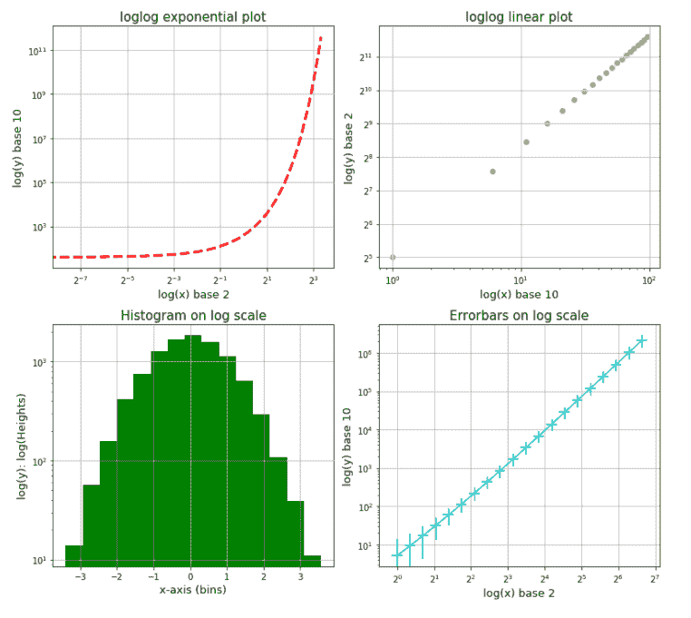

Matplotlib log log grid

阅读: [Matplotlib 最佳拟合线](https://pythonguides.com/matplotlib-best-fit-line/)

## Matplotlib 对数对数标度

我们可以通过将对数刻度的基数更改为所需的值(最小值可以是 2)来放大和缩小图表上的对数刻度。

*   我们可以通过在`matplotlib . py plot . loglog()`函数中指定参数 `basex` 和 `basey` 来更改对数标度的基数。
*   或者我们可以使用函数`matplotlib . py plot . xscale()`和`matplotlib . py plot . yscale()`以及位置参数**‘log’**将轴的刻度更改为对数刻度。并且还指定参数 `basex` 和 `basey` 来分别指定 x 轴和 y 轴的对数刻度的基数。语法如下:

```py
matplotlib.pyplot.xscale('log', [basex, subsx, nonposx])

matplotlib.pyplot.yscale('log', [basey, subsy, nonposy])
```

在上面的语法中，这里的位置论元是*‘log’*，我们可以将其指定为‘linear’，‘symlog’，‘logit’等。，它指定我们需要的缩放类型。其余的论点已经在第一个主题中讨论过了。

让我们通过一个示例实现第二种方法来更改图表轴的比例:

```py
# Importing necessary libraries
import numpy as np
from matplotlib import pyplot as plt

# Preparing the data for the plots
x = np.linspace(-2.0, 2.0, 20)
y = 2.1 +  3.1 * (x ** 3)

# Resizing the figure
plt.figure(figsize=[8, 10])

plt.plot(x, y, 'g', linewidth=3)
plt.xscale('log', basex=2, nonposx='clip')
plt.yscale('log', basey=2, nonposy='clip')
plt.title('Matplotlib log scale using xscale and yscale', fontsize=15)
plt.xlabel('log(x) base 2', fontsize=13)
plt.ylabel('log(y) base 2', fontsize=13)

plt.grid()
plt.show()
```

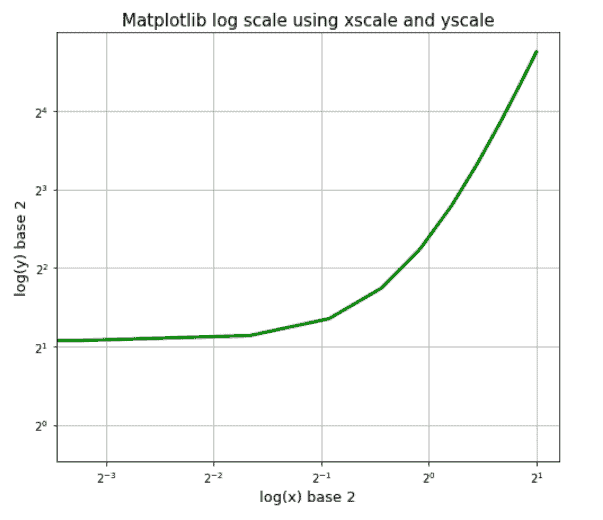

Matplotlib log scale using xscale and yscale

阅读: [Matplotlib 支线剧情 _adjust](https://pythonguides.com/matplotlib-subplots_adjust/)

## Matplotlib 对数对数刻度刻度

通过改变对数刻度轴的底部，我们也可以改变刻度。我们已经讨论了改变对数刻度轴的底部的方法。

因此，让我们通过一个示例来实现这个概念并进行一些实际操作:

```py
# Importing necessary libraries
import numpy as np
from matplotlib import pyplot as plt

# Preparing the data for the plots
x = np.linspace(-2.0, 2.0, 20)
y = 3.1 * (x ` 4) + 0.3 * (x ` 2) + 0.7 * x

# Resizing the figure
plt.figure(figsize=[7, 11])

plt.subplot(311)
plt.plot(x, y, 'r', linewidth=3)
plt.loglog(basex=10, basey=10, nonposx='clip', nonposy='clip')
plt.title('Matplotlib loglog scale tick plot 1', fontsize=15)
plt.xlabel('log(x) base 10', fontsize=13)
plt.ylabel('log(y) base 10', fontsize=13)
plt.grid(linewidth=2)

plt.subplot(312)
plt.plot(x, y, 'g', linewidth=3)
plt.loglog(basex=5, basey=5, nonposx='clip', nonposy='clip')
plt.title('Matplotlib loglog scale tick plot 2', fontsize=15)
plt.xlabel('log(x) base 5', fontsize=13)
plt.ylabel('log(y) base 5', fontsize=13)
plt.grid(linewidth=2)

plt.subplot(313)
plt.plot(x, y, 'c', linewidth=3)
plt.loglog(basex=2, basey=2, nonposx='clip', nonposy='clip')
plt.title('Matplotlib loglog scale tick plot 3', fontsize=15)
plt.xlabel('log(x) base 2', fontsize=13)
plt.ylabel('log(y) base 2', fontsize=13)
plt.grid(linewidth=2)

plt.tight_layout()
plt.show()
```

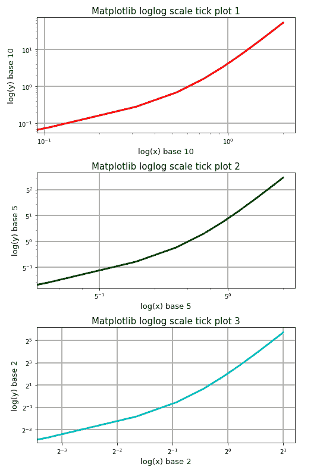

Matplotlib loglog log scale ticks

读取 [Matplotlib plot_date](https://pythonguides.com/matplotlib-plot-date/)

## Matplotlib 对数对数 y 标度

通过使用`matplotlib . py plot . semi logy()`函数，我们可以仅将 y 轴的刻度更改为对数刻度。它的工作原理与`matplotlib . py plot . loglog()`函数相同，但只提供 y 轴刻度参数(basey、subsy 和 nonposy)。语法如下:

```py
matplotlib.pyplot.semilogy(x, y, [, color, linestyle, basex, subsx, nonposx, ...])
```

在上面的语法中，所有的参数已经在第一个主题中讨论过了。

让我们通过一个例子来实现上面的概念:

```py
# Importing necessary libraries
import numpy as np
from matplotlib import pyplot as plt

# Preparing the data for the plots
x = np.linspace(0.01, 100, 1000)
y = 7.1 * np.exp(-x) + 2.5 * x

# Resizing the figure
plt.figure(figsize=[9, 7])

# log y axis in the plot
plt.semilogy(x, y, basey=2)
plt.title('Matplotlib log scale y', fontsize=15)
plt.xlabel('x-axis', fontsize=13)
plt.ylabel('log(y) base 2', fontsize=13)
plt.grid()

plt.show()
```

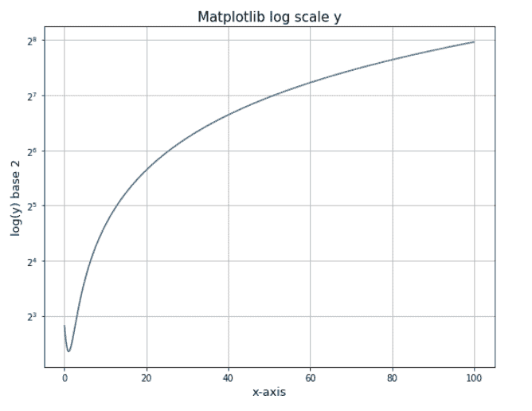

Matplotlib log scale y-axis using semilogy

阅读[在 Python 中添加文本到绘图 matplotlib](https://pythonguides.com/add-text-to-plot-matplotlib/)

## Matplotlib 对数对数对数标度 x

通过使用`matplotlib . py plot . semi logx()`函数，我们可以只将 x 轴的刻度更改为对数刻度。它的工作原理与`matplotlib . py plot . loglog()`函数相同，但只提供 x 轴比例参数(basex、subsx 和 nonposx)。语法如下:

```py
matplotlib.pyplot.semilogx(x, y, [, color, linestyle, basex, subsx, nonposx, ...])
```

在上面的语法中，所有的参数已经在第一个主题中讨论过了。

让我们通过一个例子来实现上面的概念:

```py
# Importing necessary libraries
import numpy as np
from matplotlib import pyplot as plt

# Preparing the data for the plots
x = np.linspace(0.01, 100, 1000)
y = np.cos(np.pi * x)

# Resizing the figure
plt.figure(figsize=[9, 7])

# log x axis in the plot
plt.semilogx(x, y, basex=10)
plt.title('Matplotlib log scale x for cos function', fontsize=15)
plt.xlabel('log(x) base 10', fontsize=13)
plt.ylabel('y-axis', fontsize=13)
plt.grid()

plt.show()
```

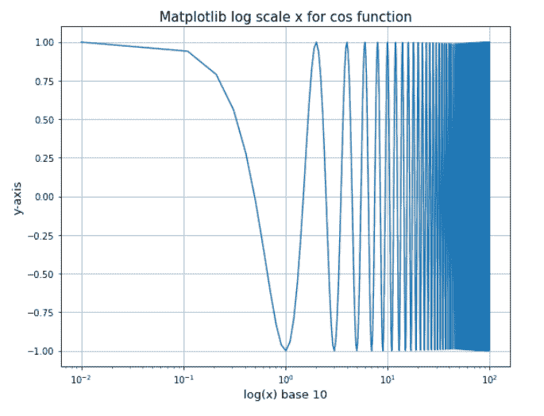

Matplotlib log scale x-axis using semilogx

读: [Matplotlib 另存为 png](https://pythonguides.com/matplotlib-save-as-png/)

## Matplotlib 对数对数刻度小刻度

我们可以通过在`matplotlib . py plot . log log()`函数中分别为 x 轴次要刻度和 y 轴次要刻度指定参数 `subsx` 和 `subsy` 的值来缩放对数刻度轴的次要刻度。

例如，对于基数为 10 的对数标度轴，我们可以将 subsx/subsy 的值指定为[2，3，4，5，6，7，8，9]，这将使这些列表值位于主要刻度[10⁰，10¹，10²，…]的值之间。类似地，对于基数为 5 的对数标度轴，我们可以给出[2，3，4]或[1.5，2，2.5，3，3.5，4，4.5]。

让我们举一个例子来实现上述概念:

```py
# Importing necessary libraries
import numpy as np
from matplotlib import pyplot as plt

# Preparing the data for the plots
x = np.linspace(-2.0, 2.0, 20)
y = 3.1 * (x ` 3) + 0.3 * (x ` 2) + 0.7 * x

# Resizing the figure
plt.figure(figsize=[7, 11])

plt.subplot(211)
plt.plot(x, y, 'g', linewidth=3)
plt.loglog(basex=2, basey=10, nonposx='clip', nonposy='clip', 
          subsx=[0.5, 1.0, 1.5])
plt.title('Matplotlib log scale scale minor ticks Plot 1', fontsize=15)
plt.xlabel('log(x) base 2', fontsize=13)
plt.ylabel('log(y) base 10', fontsize=13)
plt.grid(b=True, which='major', linewidth=2, linestyle='-')
plt.grid(b=True, which='minor', linewidth=1, linestyle='--')

plt.subplot(212)
plt.plot(x, y, 'g', linewidth=3)
plt.loglog(basex=2, basey=10, nonposx='clip', nonposy='clip', 
          subsx=[0.25, 0.5, 0.75, 1.0, 1.25, 1.5, 1.75], 
          suby=[2, 3, 4, 5, 6, 7, 8, 9])
plt.title('Matplotlib log scale scale minor ticks Plot 2', fontsize=15)
plt.xlabel('log(x) base 2', fontsize=13)
plt.ylabel('log(y) base 10', fontsize=13)
plt.grid(b=True, which='major', linewidth=2, linestyle='-')
plt.grid(b=True, which='minor', linewidth=1, linestyle='--')

plt.tight_layout()
plt.show()
```

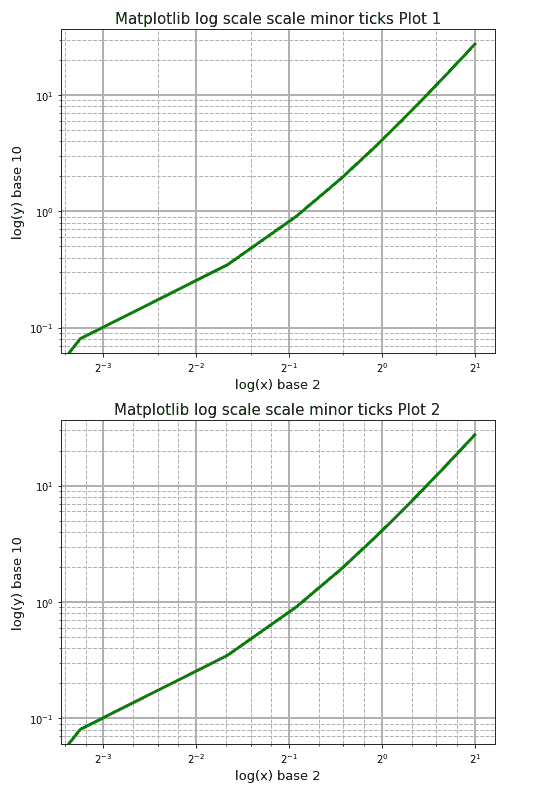

Matplotlib loglog log scale minor ticks

阅读: [Matplotlib 虚线](https://pythonguides.com/matplotlib-dashed-line/)

## Matplotlib 对数对数对数刻度颜色条

我们还可以使用 matplotlib 在 python 中将颜色条的比例更改为对数比例。我们可以使用 python 的 matplotlib 模块/库的颜色子模块来指定对数标度的颜色值。

我们可以在定义(或创建)的图像(或 colorgrid 或 colormesh)中将 `norm` 参数的值指定为**颜色。LogNorm()** 将标准化的颜色值换算成对数标度。

让我们通过一个例子来说明上面的概念。在本例中，我们将使用 `pcolormesh()` 创建一个 colorgrid，然后为创建的 colorgrid 定义对数标度的 colorbar:

```py
# Importing necessary libraries
import numpy as np
from matplotlib import pyplot as plt
from matplotlib import colors as colors

# Preparing the data for the pcolormesh
np.random.seed(20000)
Z = np.random.rand(7, 15)

x = np.arange(-0.75, 15.0, 1)
y = np.arange(5.0, 15.0, 1.5)

# Resizing the figure
plt.figure(figsize=[7, 11])

# Plotting the pcolormesh with colorbar
plt.subplot(211)
plt.pcolormesh(x, y, Z)
plt.title('Matplotlib pcolormesh with colorbar', fontsize=15)
plt.xlabel('x-axis', fontsize=13)
plt.ylabel('y-axis', fontsize=13)
plt.colorbar()

# Plotting the pcolormesh with log scale colorbar
plt.subplot(212)
plt.pcolormesh(x, y, Z, norm=colors.LogNorm())
plt.title('Matplotlib pcolormesh with log scale colorbar', fontsize=15)
plt.xlabel('x-axis', fontsize=13)
plt.ylabel('y-axis', fontsize=13)
plt.colorbar()

plt.tight_layout()
plt.show()
```

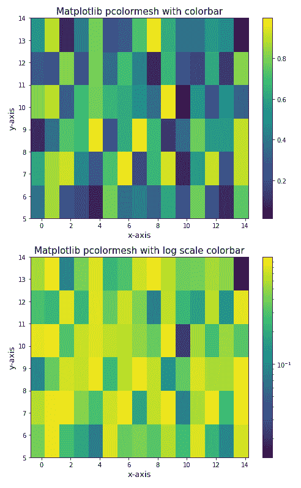

Matplotlib log scale colorbar using LogNorm()

另外，请查看以下关于 Matplotlib 的文章。

*   [Matplotlib 多条形图](https://pythonguides.com/matplotlib-multiple-bar-chart/)
*   [Matplotlib 散点图图例](https://pythonguides.com/matplotlib-scatter-plot-legend/)

在本 python 教程中，我们讨论了 Python 中的 `Matplotlib log log plot` 来绘制具有对数标度的图形，我们还讨论了以下主题:

*   Matplotlib log log plot
*   Matplotlib 日志日志散点图
*   Matplotlib 日志日志直方图
*   Matplotlib 日志日志绘图误差线
*   Matplotlib 日志日志网格
*   Matplotlib 对数对数标度
*   Matplotlib 对数对数刻度刻度
*   Matplotlib 对数对数标度 y
*   Matplotlib 对数对数对数标度 x
*   Matplotlib 对数对数刻度次要刻度
*   Matplotlib 对数对数刻度颜色条
*   Matplotlib 对数对数标度基数为 2
*   Matplotlib 对数对数负标度

[Bijay Kumar](https://pythonguides.com/author/fewlines4biju/)

Python 是美国最流行的语言之一。我从事 Python 工作已经有很长时间了，我在与 Tkinter、Pandas、NumPy、Turtle、Django、Matplotlib、Tensorflow、Scipy、Scikit-Learn 等各种库合作方面拥有专业知识。我有与美国、加拿大、英国、澳大利亚、新西兰等国家的各种客户合作的经验。查看我的个人资料。

[enjoysharepoint.com/](https://enjoysharepoint.com/)[](https://www.facebook.com/fewlines4biju "Facebook")[](https://www.linkedin.com/in/fewlines4biju/ "Linkedin")[](https://twitter.com/fewlines4biju "Twitter")