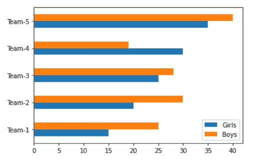
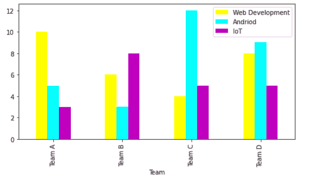
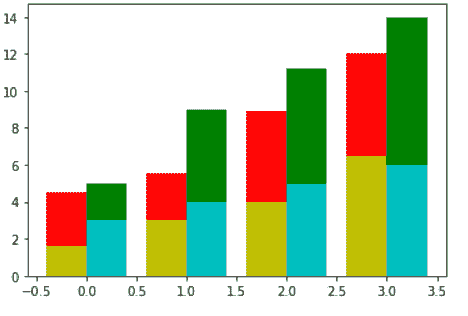

# Matplotlib 多条形图

> 原文：<https://pythonguides.com/matplotlib-multiple-bar-chart/>

[](https://sharepointsky.teachable.com/p/python-and-machine-learning-training-course)

在本 [](https://pythonguides.com/learn-python/) [Matplotlib 教程](https://pythonguides.com/what-is-matplotlib/)中，我们将讨论 python 中的 **Matplotlib 多条形图**。在这里，我们将使用 matplotlib 介绍与多条形图相关的不同示例。我们还将讨论以下主题:

*   Matplotlib 多条形图
*   Matplotlib 多条形图示例
*   并排的多个条形图
*   Matplotlib 多水平条形图
*   matplotlib 多条形图熊猫
*   Matplotlib 条形图多列
*   Matplotlib 条形图多种颜色
*   Matplotlib 覆盖两个条形图
*   Matplotlib 多重堆积条形图
*   Matplotlib 条形图多组
*   Matplotlib 多个条形图标签
*   Matplotlib 多条形图标题

目录

[](#)

*   [Matplotlib 多条形图](#Matplotlib_multi_bar_chart "Matplotlib multi bar chart")
*   [Matplotlib 多个条形图示例](#Matplotlib_multiple_bar_chart_example "Matplotlib multiple bar chart example")
*   [Matplotlib 多个条形图并排](#Matplotlib_multiple_bar_charts_side_by_side "Matplotlib multiple bar charts side by side")
*   [Matplotlib 多个水平条形图](#Matplotlib_multiple_horizontal_bar_chart "Matplotlib multiple horizontal bar chart")
*   [Matplotlib 多条形图熊猫](#Matplotlib_multiple_bar_chart_pandas "Matplotlib multiple bar chart pandas")
*   [Matplotlib 条形图多列](#Matplotlib_bar_chart_multiple_columns "Matplotlib bar chart multiple columns")
*   [Matplotlib 条形图多色](#Matplotlib_bar_chart_multiple_colors "Matplotlib bar chart multiple colors")
*   [Matplotlib 叠加两个条形图](#Matplotlib_overlay_two_bar_chart "Matplotlib overlay two bar chart")
*   [Matplotlib 多重堆积条形图](#Matplotlib_multiple_stacked_bar_chart "Matplotlib multiple stacked bar chart")
*   [Matplotlib 条形图多组](#Matplotlib_bar_chart_multiple_groups "Matplotlib bar chart multiple groups")
*   [Matplotlib 多个条形图标签](#Matplotlib_multiple_bar_chart_labels "Matplotlib multiple bar chart labels")
*   [Matplotlib 多个条形图标题](#Matplotlib_multiple_bar_chart_title "Matplotlib multiple bar chart title")

## Matplotlib 多条形图

在本节中，我们将学习如何在 Python 的 matplotlib 中绘制多条形图。在开始这个话题之前，我们首先要了解**多条形图**是什么意思:

> ***多条形图*** 表示多个条形图。它也被称为分组条形图。

多重条形图用于描述各种数据变量之间的关系。图中的列表示每个数据值。基本上，多个条形图用于比较不同的实体。

**用于绘制多条形图的以下步骤概述如下:**

*   **定义库:**导入绘制多条形图和数据可视化所需的库 `pyplot` ，还导入其他数据创建和操作所需的库 `numpy` 和 `pandas` 。
*   **定义数据:**定义用于绘图的 x 轴和 y 轴的数据坐标值。
*   **绘制多条形图:**通过使用 matplotlib 库的 `bar()` 方法我们可以绘制多个条形图。
*   **可视化绘图:**通过使用 `show()` 方法，用户可以在他们的屏幕上生成一个绘图。

**多条形图绘图的语法如下:**

```py
matplotlib.pyplot.bar(x, height, width=None, bottom=None, align='center', data=None, **kwargs)
```

**参数定义如下:**

*   **x:** 指定条形的 x 坐标。
*   **height:** y 坐标指定条形的高度。
*   **宽度:**指定条形的宽度。
*   **底部:**指定条形底部的 y 坐标。
*   **对齐:**条的对齐。

## Matplotlib 多个条形图示例

**让我们看不同的例子来更清楚地理解` `的概念:**

**例#1**

```py
**# Import Library** 
import numpy as np 
import matplotlib.pyplot as plt 

**# Define Data** 
team = ['Team 1','Team 2','Team 3','Team 4','Team 5']
female = [5, 10, 15, 20, 25]
male = [15, 20, 30, 16, 13]

x_axis = np.arange(len(team))

**# Multi bar Chart** 
plt.bar(x_axis -0.2, female, width=0.4, label = 'Female')
plt.bar(x_axis +0.2, male, width=0.4, label = 'Male')

**# Xticks** 
plt.xticks(x_axis, team)

**# Add legend** 
plt.legend()

**# Display** 
plt.show()
```

*   在上面的例子中，我们导入了库，如 `numpy` 和 `matplotlib.pyplot` 。
*   在这之后，我们定义用于绘图的数据。
*   `np.arange()` 方法用于创建一个数值范围。
*   然后用 `plt.bar()` 函数绘制多个条形图。
*   然后我们**从 x 轴移动杆** `-0.2` 和 `0.2` 单位以避免**重叠。**
*   然后我们将横条的**宽度**设置为 `0.4` 。


plt.bar()

**例 2**

```py
**# Import Library** 
import numpy as np 
import matplotlib.pyplot as plt 

**# Define Data** 
team = ['Team 1','Team 2','Team 3']
Python = [5, 10, 15]
Java = [15, 20, 30]
Php = [ 5, 9, 12]

x_axis = np.arange(len(team))

**# Multi bar Chart** 
plt.bar(x_axis +0.20, Python, width=0.2, label = 'Python')
plt.bar(x_axis +0.20*2, Java, width=0.2, label = 'Java')
plt.bar(x_axis +0.20*3, Php, width=0.2, label = 'Php')

**# Xticks** 
plt.xticks(x_axis,team)

**# Add legend** 
plt.legend()

**# Display** 
plt.show()
```

*   在上面的例子中，我们导入了所需的库，如 `numpy` 、 `pyplot` 。
*   然后我们定义用于绘图的数据。
*   之后，我们使用 numpy 的 `arange()` 方法得到 x 轴的长度。
*   `plt.bar()` 方法用于绘制多个条形图。
*   `plt.xticks()` 函数定义 x 个刻度，使用 `plt.legend()` 方法添加图例。


*” Multiple Bar Chart ”*

阅读: [Matplotlib 散点图图例](https://pythonguides.com/matplotlib-scatter-plot-legend/)

## Matplotlib 多个条形图并排

这里我们将并排绘制多个条形图。为了并排绘制，我们必须绘制支线剧情。

**让我们来看一个并排多个条形图的例子:**

```py
**# Import Library** 
import numpy as np 
import matplotlib.pyplot as plt 

**# Define Data** 
x1 = [2.5, 3.5, 4.5, 5.5, 6.5, 7.5]
y1 = [3, 6, 9, 12, 15, 18]

x2 = [5, 10, 15, 20, 25, 30]
y2 = [2.6, 9.5, 14, 12, 8.3, 12]

r = np.arange(6)
width = 0.4

**# Draw first subplot** 
plt.subplot(1, 2, 1)
plt.bar(r, x1, width=width)
plt.bar(r + width, y1, width=width)

**# Draw second subplot** 
plt.subplot(1, 2, 2)
plt.bar(r, x2, width=width)
plt.bar(r + width, y2, width=width)

**# Display** 
plt.show() 
```

*   在上面的例子中，我们导入了 `numpy` 和 `matplotlib.pyplot` 库。
*   之后，我们定义用于绘图的数据。
*   然后我们使用 `np.arange()` 函数来创建一系列值。
*   通过使用 `plt.subplot()` 方法，我们创建了两个并排的支线剧情。
*   `plt.bar()` 方法用于创建多个条形图图形。


*“Multiple Bar Graphs Side By Side”*

阅读: [Matplotlib 标题字体大小](https://pythonguides.com/matplotlib-title-font-size/)

## Matplotlib 多个水平条形图

在这里，我们将学习如何绘制成组的条形图，或者我们可以说是水平方向上的多个条形图。

首先，我们必须知道创建水平条形图的语法:

```py
matplotlib.pyplot.barh(y, width, height=0.8, left=none, align='center', **kwargs)
```

**使用的参数描述如下:**

*   **y:** 指定 y 轴的坐标。
*   **宽度:**指定条形的宽度。
*   **高度:**指定条形的高度。
*   **left:** 指定条形左侧的 x 坐标。
*   **对齐:**基座与 y 坐标对齐。

**让我们看一个绘制多个水平条形图的例子:**

```py
**# Import Library**

import matplotlib.pyplot as plt
import pandas as pd

**# Define Data**

data = {'Girls': [15, 20, 25, 30, 35],
        'Boys': [25, 30, 28, 19, 40] }
df = pd.DataFrame(data,columns=['Girls','Boys'], index = ['Team-1','Team-2','Team-3','Team-4','Team-5'])

**# Multiple horizontal bar chart** 
df.plot.barh()

**# Display**

plt.show()
```

*   在上面的例子中，我们通过使用熊猫**数据帧**来定义数据。
*   然后我们用一个 `plot.barh()` 的方法画出多个水平条形图。
*   `plt.show()` 方法用于在用户屏幕上可视化绘图。



*” Horizontal Multiple Bar Chart “*

阅读: [Matplotlib 默认图形尺寸](https://pythonguides.com/matplotlib-default-figure-size/)

## Matplotlib 多条形图熊猫

在这里，我们将学习如何使用 pandas DataFrame 绘制多个条形图。

**我们来看一个例子:**

```py
**# Import Library** 
import matplotlib.pyplot as plt
import pandas as pd

**# Define Data** 
data = {'Girls': [15, 20, 25, 30, 35],
        'Boys': [25, 30, 28, 19, 40] }
df = pd.DataFrame(data,columns=['Girls','Boys'], index = ['MCA','BCA','MCOM','BCOM','BA'])

**# Multiple bar chart** 
df.plot.bar()

**# Display** 
plt.show()
```

*   在上面的例子中，我们导入了重要的库，如**熊猫**和 `pyplot` 。
*   接下来，我们使用 Pandas `DataFrame` 定义数据。
*   `plot.bar()` 方法用于创建多个条形图。


*” Multiple Bar Chart Using Pandas “*

读取: [Matplotlib savefig 空白图像](https://pythonguides.com/matplotlib-savefig-blank-image/)

## Matplotlib 条形图多列

在这里，我们正在学习如何绘制一个有多列的条形图。我们使用 `plot()` 方法来绘制条形图并定义多个列，我们使用 `DataFrame` 对象。

**举例:**

这里我们将使用**熊猫**的 `DataFrame` 对象创建多个条形图。我们创建一个有 `5` 多个**列**的条形图。

```py
**# Import Library** 
import pandas as pd 
import matplotlib.pyplot as plt 

**# Define Data** 
data=[["A",40, 36, 38, 35, 40],
      ["B",39, 37, 33, 38, 32],
      ["C",28, 30, 33, 39, 24],
      ["D",40, 40, 35, 29, 35],
      ["E", 28, 25, 16, 27, 30]
     ]
**# Plot multiple columns bar chart** 
df=pd.DataFrame(data,columns=["Name","English","Hindi","Maths", "Science", "Computer"])

df.plot(x="Name", y=["English","Hindi","Maths", "Science", "Computer"], kind="bar",figsize=(9,8))

**# Show** 
plt.show()
```

*   在上面的例子中，我们导入了**熊猫**和 `pyplot` 库。
*   之后，我们定义**数据**并创建**数据帧**。
*   然后我们使用 `plot()` 函数绘制一个带有 `5` 多列的条形图。这里我们通过**类**作为参数来提及**类**栏**类**的剧情。


*” Bar Chart with 5 multiple columns “*

读: [Matplotlib 另存为 png](https://pythonguides.com/matplotlib-save-as-png/)

## Matplotlib 条形图多色

在这里，我们将创建不同颜色的条形图分组。

要改变条的颜色，我们必须将颜色作为参数传递，并将不同颜色的列表作为值传递。

**改变颜色的语法如下:**

```py
matplotlib.pyplot.bar(x, height, color=None ...) 
```

这里的**颜色**参数用于根据我们的选择来设置条形的颜色。

**我们来看一些例子:**

**举例:**

```py
**# Import Library**

import pandas as pd 
import matplotlib.pyplot as plt 

**# Define Data**

data=[["Team A",10, 5, 3],
      ["Team B",6, 3, 8],
      ["Team C",4, 12, 5],
      ["Team D",8, 9, 5]
     ]

**# Colors** 

my_color =['yellow', 'cyan','m','blue']

**# Plot multiple bar chart with color of your choice** 
df=pd.DataFrame(data,columns=["Team","Web Development", "Andriod", "IoT"])

df.plot(x="Team", y=["Web Development", "Andriod", "IoT"], 
        kind="bar",figsize=(8,4), color=my_color)

**# Show**

plt.show() 
```

在上面的例子中，我们创建了一个颜色的**列表，并将其传递给 `plot()` 方法的**颜色**参数，这样我们就可以根据自己的选择设置条形的颜色。**



plot(kind=bar, color=my_color)

**举例:**

```py
**# Import Library**

import numpy as np 
import matplotlib.pyplot as plt 

**# Define Data**

team = ['Team 1','Team 2','Team 3','Team 4','Team 5']
female = [5, 10, 15, 20, 25]
male = [15, 20, 30, 16, 13]

x_axis = np.arange(len(team))

**# Multiple colors of bars**

plt.bar(x_axis -0.2, female, width=0.4, 
        label = 'Female', color='k')

plt.bar(x_axis +0.2, male, width=0.4, 
        label = 'Male', color='g')

**# Xticks**

plt.xticks(x_axis, team)

**# Add legend**

plt.legend()

**# Display**

plt.show()
```

在上面的例子中，我们使用两个 `plt.bar()` 方法来创建多个条形，并向每个函数传递一个**颜色**参数来根据我们的选择设置条形的值。


plt.bar(color=None)

阅读: [Matplotlib 条形图标签](https://pythonguides.com/matplotlib-bar-chart-labels/)

## Matplotlib 叠加两个条形图

在这里，我们将学习如何将条形图中的一个条形叠加到另一个条形中。

**让我们来看一个叠加两个条形图的例子:**

```py
**# Import Library** 
import matplotlib.pyplot as plt
import numpy as np

**# Define Data** 
x = [0.5, 1.5, 2.5, 3.5, 4.5, 5.5, 6.5, 7.5, 8.5, 9.5, 10.5, 11.5, 12.5, 14.5]

y = [0, 1, 2, 3, 4, 5, 6, 7, 8, 9, 10, 11, 12, 13]

ind = np.arange(14)

**# Create figure** 
fig = plt.figure()
ax = fig.add_subplot(111)

**# Multiple bar chart** 
ax.bar(x=ind, height=x, width=0.55,align='center')
ax.bar(x=ind, height=y, width=0.55/3,  align='center')

**# Define x-ticks** 
plt.xticks(ind, x)

**# Layout and Display** 
plt.tight_layout()
plt.show() 
```

*   在上面的例子中，我们导入了 `numpy` 和 `matplotlib` 库。
*   之后，我们定义用于绘制多个条形图的数据。
*   然后我们创建一个**人物**并使用 `add_figure()` 方法创建支线剧情。
*   `ax.bar()` 方法用于创建多个条形图，其中一个条形图覆盖另一个条形图。这里，我们**划分位于另一个条内的条的宽度**。


*” Overlay two bar chart “*

读取: [Matplotlib 绘图误差线](https://pythonguides.com/matplotlib-plot-error-bars/)

## Matplotlib 多重堆积条形图

在这里，我们将学习如何创建分组堆积条形图。首先，我们了解了堆叠条形图的含义:

> ***堆积条形图*** 是一种用来比较部分整体的图形。当我们在一个类别中有多组数据时，我们可以针对每组数据建立联系，并将条形一个放在另一个之上。”

**我们来看一个例子:**

```py
**# Import Library** 
import matplotlib.pyplot as plt
import pandas as pd

**# Define Data** 
df = pd.DataFrame(dict(
    x1=[3, 4, 5, 6],
    x2=[5, 9, 11.2, 14],
    x3=[1.6, 3, 4, 6.5],
    x4=[4.5, 5.5, 8.9, 12]))

**# Stacked grouped bar chart** 
plt.bar([0, 1, 2, 3], df.x2, align='edge', width= 0.4,color='g')
plt.bar([0, 1, 2, 3], df.x1, align='edge', width= 0.4,color='c')
plt.bar([0, 1, 2, 3], df.x4, align='edge',width= -0.4, color='r')
plt.bar([0, 1, 2, 3], df.x3, align='edge',width= -0.4,color='y')

**# Show** 
plt.show() 
```

*   在上面的例子中，我们使用 DataFrame 定义数据。
*   然后，我们通过以创建堆叠条形图的方式提及数据点来绘制堆叠多条形图。



*“Stacked Multiple Bar Chart”*

阅读: [Matplotlib 旋转刻度标签](https://pythonguides.com/matplotlib-rotate-tick-labels/)

## Matplotlib 条形图多组

在这里，我们将创建一个包含多个组的条形图。多组多列意思相同。

**让我们看一个例子，我们用多个组绘制一个条形图。**

这里，我们创建了一个包含 6 个组的条形图。

```py
**# Import Library** 
import pandas as pd 
import matplotlib.pyplot as plt 

**# Define Data** 
data=[["Team A", 500, 100, 350, 250, 400, 600],
      ["Team B", 130, 536, 402, 500, 350, 250],
      ["Team C", 230, 330, 500, 450, 600, 298],
      ["Team D", 150, 398, 468, 444, 897, 300]
     ]

**# Plot multiple groups** 
df=pd.DataFrame(data,columns=["Team","January", "March", "May", "July", "September", "November"])

df.plot(x="Team", y=["January", "March", "May", "July", "September", "November"], kind="bar",
 figsize=(8,4))

**# Show** 
plt.show() 
```

*   在上面的例子中，我们导入了**熊猫**和 `matplotlib.pyplot` 库。
*   接下来，我们创建**数据帧**。
*   然后我们用 `plot()` 的方法画出一个有 `6` 个多组的条形图。


*” Multiple Groups Bar Chart “*

阅读: [Matplotlib 散点图标记](https://pythonguides.com/matplotlib-scatter-marker/)

## Matplotlib 多个条形图标签

在这里，我们将学习如何向多个条形图添加标签。

**添加标签的语法:**

```py
**# X-axis label**
matplotlib.pyplot.xlabel()

**# Y-axis label**
matplotlib.pyplot.ylabel()
```

**举例:**

```py
**# Import Library**

import numpy as np 
import matplotlib.pyplot as plt 

**# Define Data**

team = ['Team 1','Team 2','Team 3','Team 4','Team 5']
female = [5, 10, 15, 20, 25]
male = [15, 20, 30, 16, 13]

x_axis = np.arange(len(team))

**# Multi bar Chart**

plt.bar(x_axis -0.2, female, width=0.4, label = 'Female')
plt.bar(x_axis +0.2, male, width=0.4, label = 'Male')

**# Xticks**

plt.xticks(x_axis, team)

**# Add labels**

plt.xlabel("Team", fontsize=12, fontweight='bold')
plt.ylabel("No.of Persons", fontsize=12, fontweight='bold')

# Add legend

plt.legend()

**# Display**

plt.show()
```

*   在上面的例子中，我们分别使用 `plt.xlabel()` 和 `plt.ylabel()` 在 x 轴和 y 轴定义了**标签**。
*   要创建多个条形图我们使用 `plt.bar()` 方法。


*” Multiple Bar Chart with Labels “*

阅读: [Matplotlib 虚线](https://pythonguides.com/matplotlib-dashed-line/)

## Matplotlib 多个条形图标题

这里我们将创建多个带有标题的条形图。要添加标题，我们使用 `title()` 函数。

**添加标题的语法如下:**

```py
matplotlib.pyplot.title()
```

**举例:**

```py
**# Import Library**

import pandas as pd 
import matplotlib.pyplot as plt 

**# Define Data**

data=[["Team A",10, 5, 3],
      ["Team B",6, 3, 8],
      ["Team C",4, 12, 5],
      ["Team D",8, 9, 5]
     ]

**# Colors** 

my_color =['yellow', 'cyan','m','blue']

**# Plot multiple bar chart** 

df=pd.DataFrame(data,columns=["Team","Web Development", "Andriod", "IoT"])

df.plot(x="Team", y=["Web Development", "Andriod", "IoT"], kind="bar",
        figsize=(8,4), color=my_color)

**# Add title**

plt.title("Studenr vs Courses")

**# Show**

plt.show()
```

在上面的例子中，我们使用 `plt.title()` 方法给多个条形图添加一个标题。


“*Multiple Bar Chart with Title”*

你可能也喜欢阅读下面的 Matplotlib 教程。

*   [Matplotlib plot_date](https://pythonguides.com/matplotlib-plot-date/)
*   [Matplotlib 散点图颜色](https://pythonguides.com/matplotlib-scatter-plot-color/)
*   [Matplotlib 子情节 _adjust](https://pythonguides.com/matplotlib-subplots_adjust/)
*   [Matplotlib 设定轴范围](https://pythonguides.com/matplotlib-set-axis-range/)
*   [Matplotlib 时间序列图](https://pythonguides.com/matplotlib-time-series-plot/)
*   [Matplotlib 绘图条形图](https://pythonguides.com/matplotlib-plot-bar-chart/)

在本 Python 教程中，我们已经讨论了`" Matplotlib multiple bar chart "`,我们还介绍了一些与之相关的例子。这些是我们在本教程中讨论过的以下主题。

*   Matplotlib 多条形图
*   Matplotlib 多条形图示例
*   并排的多个条形图
*   Matplotlib 多水平条形图
*   matplotlib 多条形图熊猫
*   Matplotlib 条形图多列
*   Matplotlib 条形图多种颜色
*   Matplotlib 覆盖两个条形图
*   Matplotlib 多重堆积条形图
*   Matplotlib 条形图多组
*   Matplotlib 多个条形图标签
*   Matplotlib 多条形图标题

[Bijay Kumar](https://pythonguides.com/author/fewlines4biju/)

Python 是美国最流行的语言之一。我从事 Python 工作已经有很长时间了，我在与 Tkinter、Pandas、NumPy、Turtle、Django、Matplotlib、Tensorflow、Scipy、Scikit-Learn 等各种库合作方面拥有专业知识。我有与美国、加拿大、英国、澳大利亚、新西兰等国家的各种客户合作的经验。查看我的个人资料。

[enjoysharepoint.com/](https://enjoysharepoint.com/)[](https://www.facebook.com/fewlines4biju "Facebook")[](https://www.linkedin.com/in/fewlines4biju/ "Linkedin")[](https://twitter.com/fewlines4biju "Twitter")