# Matplotlib 多图

> 原文：<https://pythonguides.com/matplotlib-multiple-plots/>

[](https://sharepointsky.teachable.com/p/python-and-machine-learning-training-course)

在本 [Python Matplotlib 教程](https://pythonguides.com/what-is-matplotlib/)中，我们将讨论 Python 中的 **Matplotlib 多重绘图**。在这里，我们将介绍与使用 matplotlib 的多个绘图相关的不同示例。此外，我们还将涵盖以下主题:

*   Matplotlib 多图
*   Matplotlib 多图示例
*   Matplotlib 多个图一个标题
*   Matplotlib 多个图一个图例
*   Matplotlib 绘制多个矩形
*   Matplotlib 多个图一个颜色条
*   Matplotlib 多极坐标图
*   Matplotlib 多盒图
*   多个小提琴情节
*   Matplotlib 多重圆形图
*   Matplotlib 多重等高线图
*   Matplotlib 多图直方图
*   Matplotlib 多图 seaborn

目录

[](#)

*   [Matplotlib 多个图](#Matplotlib_multiple_plots "Matplotlib multiple plots")
    *   [支线剧情()函数](#subplot_function "subplot() function")
    *   [支线剧情()功能](#subplots_function "subplots() function")
    *   [支线剧情()vs 支线剧情()](#subplot_vs_subplots "subplot() vs subplots()")
*   [Matplotlib 多图示例](#Matplotlib_multiple_plots_example "Matplotlib multiple plots example")
*   [Matplotlib 多个地块一个标题](#Matplotlib_multiple_plots_one_title "Matplotlib multiple plots one title")
*   [Matplotlib 多个图一个图例](#Matplotlib_multiple_plots_one_legend "Matplotlib multiple plots one legend")
*   [Matplotlib 绘制多个矩形](#Matplotlib_plot_multiple_rectangles "Matplotlib plot multiple rectangles")
*   [Matplotlib 多个图一个颜色条](#Matplotlib_multiple_plots_one_colorbar "Matplotlib multiple plots one colorbar")
*   [Matplotlib 多极坐标图](#Matplotlib_multiple_polar_plots "Matplotlib multiple polar plots")
*   [Matplotlib 多盒图](#Matplotlib_multiple_boxplot "Matplotlib multiple boxplot")
*   [Matplotlib 多个小提琴情节](#Matplotlib_multiple_violin_plots "Matplotlib multiple violin plots")
*   [Matplotlib 多圆图](#Matplotlib_multiple_circle_plots "Matplotlib multiple circle plots")
*   [Matplotlib 多重等高线图](#Matplotlib_multiple_contour_plots "Matplotlib multiple contour plots")
*   [Matplotlib 多图直方图](#Matplotlib_multiple_plots_histogram "Matplotlib multiple plots histogram")
*   [Matplotlib 多个地块 seaborn](#Matplotlib_multiple_plots_seaborn "Matplotlib multiple plots seaborn")

## Matplotlib 多个图

[Matplotlib 的**子情节()**](https://pythonguides.com/matplotlib-subplot-tutorial/) 和**子情节()**函数便于在单个图形内创建多个情节的网格。制造多个罐，并从图的左上开始排成一行。

### 支线剧情()函数

【subplot()函数的语法如下:

```py
matplotlib.pyplot.subplot(nrows, ncols, index, **kwargs)

                             **#OR**

matplotlib.pyplotsubplot(pos, **kwargs)
```

**参数如下:**

*   **nrows:** 指定行数。
*   **ncols:** 指定列数。
*   **索引:**指定当前图的索引。
*   **kwargs:** 指定美化情节的额外功能。
*   **位置:**指定当前绘图的位置。

在**的第一个语法**中，我们传递三个独立的整数参数来描述多个绘图的位置。

在**的第二个语法**中，我们传递一个三位数的整数来指定位置参数，以定义 nrows、ncols 和 index。

### 支线剧情()功能

【subplots()函数的语法如下:

```py
matplotlib.pyplot.subplots(nrows, ncols, sharex=False, 
                           sharey=False, squeeze=True,  
                           subplot_kw=None, gridspec_kw=None, 
                           **kwargs)
```

**参数如下:**

*   **nrows，ncols:** 指定行数和列数。
*   **sharex，sharey:** 指定 x 轴和 y 轴之间的共享属性。
*   **squeeze:** 该可选参数的默认值为 True，通常包含布尔值。
*   **subplot_kw:** 提供给 add subplot 方法的带有关键字的 dict，用于创建每个 subplot。
*   **gridspec_kw:** 用于创建多个地块所在的网格。

### 支线剧情()vs 支线剧情()

使用 `subplots()` 函数时，你可以只用一行代码生成一个有多个图的图形。另一方面，**子图()**函数只在给定的网格位置构造一个子图 ax。

另外，检查[Matplotlib subplots _ adjust](https://pythonguides.com/matplotlib-subplots_adjust/)

## Matplotlib 多图示例

这里我们将看到一个使用 matplotlib 函数 `subplot()` 和`subplot()`的多重绘图的例子。

**我们来看例子:**

**例#1**

在这个例子中，我们将使用 subplot()函数来创建多个绘图。

```py
**# Import library**

import matplotlib.pyplot as plt

**# Create figure** 
fig = plt.figure()

**# Create each subplot individually** 
ax1 = plt.subplot(131)
ax2 = plt.subplot(132)
ax3 = plt.subplot(133)

**# Auto adjust** 
plt.tight_layout()

**# Display**

plt.show()
```

*   首先，我们导入 `matplotlib.pyplot` 库来创建图。
*   然后，我们使用 `figure()` 函数创建一个图形。
*   之后，我们使用**子图()**函数分别创建多个图。
*   然后，我们使用 `tight_layout()` 函数自动调整多个地块的布局。
*   为了显示该图，我们使用了 `show()` 函数。

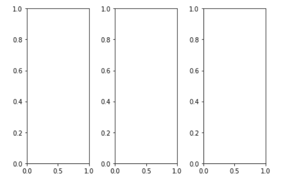

Matplotlib multiple plots example

**例#** 2

在这个例子中，我们将使用 subplots()函数创建多个情节。

```py
**# Import library** 
import matplotlib.pyplot as plt

**# Create figure and multiple plots**

fig, axes = plt.subplots(nrows=2, ncols=2)

**# Auto adjust** 
plt.tight_layout()

**# Display**

plt.show()
```

*   导入 `matplotlib.pyplot` 作为 `plt` 用于图形创建。
*   然后，我们调用 `subplots()` 函数，将图形和 subplots 一起存储在轴数组中。
*   这里我们创建了多个图，有 **2 行**和 **2 列**。
*   为了调整多个图的布局，我们使用了 `tight_layout()` 函数。
*   为了显示该图，我们使用了 `show()` 函数。

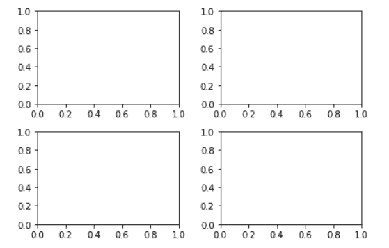

Example of matplotlib multiple plots

阅读: [Matplotlib 增加绘图大小](https://pythonguides.com/matplotlib-increase-plot-size/)

## Matplotlib 多个地块一个标题

在这里，我们将学习添加一个标题，或者我们可以使用 matplotlib 在多个地块上添加公共标题。 `suptitle()` 函数用于给图形添加居中的标题。

**让我们看看与此相关的例子:**

**例#1**

在这个例子中，我们使用**子情节()**函数绘制多个情节，并使用 `suptitle()` 函数添加一个标题。

```py
**# Import library** 
import matplotlib.pyplot as plt

**# Create figure**

fig = plt.figure()

**# Define Data Coordinates**

x = range(5)
y = range(5)

**# Create each subplot individually** 
plt.subplot(2, 2, 1)
plt.plot(x, y, linestyle='dashed', color='r')
plt.subplot(2, 2, 2)
plt.plot(x, y, linestyle='dashdot', color='green')
plt.subplot(2, 2, 4)
plt.plot(x, y, linestyle='dotted', color='m')

**# One Title** 
plt.suptitle('Different Line Plots')

**# Auto adjust**

plt.tight_layout()

**# Display** 
plt.show()
```

*   导入 `matplotlib.pyplot` 库进行数据绘制。
*   然后，我们使用 `figure()` 方法创建一个图形。
*   要定义 x 和 y 数据坐标，使用 python 的 `range()` 函数。
*   然后，我们使用**子图()**函数分别创建多个图。
*   要在数据坐标之间绘制折线图，使用带有**线型**和**颜色**参数的 `plot()` 函数。
*   要在多个图中添加一个标题，使用 `suptitle()` 函数。
*   要调整多个图之间的间距，使用 `tight_layout()` 功能。
*   要显示图形，使用 `show()` 功能。

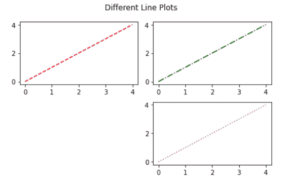

Matplotlib multiple plots one title

**例 2**

在这个例子中，我们使用**支线剧情()**函数绘制多个剧情，并使用 `suptitle()` 函数添加一个标题。

```py
**# Import library**

import matplotlib.pyplot as plt

**# Create figure and multiple plots**

fig, ax = plt.subplots(nrows=2, ncols=1)

**# Define Data**

x = range(15)
y = range(15)

**# Plot** 
ax[0].plot(x, y, color='r')
ax[1].bar(x, y, color='green')

**# Title**

plt.suptitle('Multiple Plots With One Title', 
              fontweight='bold')

**# Auto adjust**

plt.tight_layout()

**# Display**

plt.show()
```

*   导入必要的库 `matplotlib.pyplot` 。
*   之后，使用 `subplots()` 函数创建一个具有多个情节的图形。
*   要定义数据坐标，使用 python 的 `range()` 方法。
*   为了绘制第一个图，我们使用了 `plot()` 函数。
*   为了绘制第二个图，我们使用了 `bar()` 函数。
*   要添加一个标题，我们使用 matplotlib 的 `suptitle()` 函数。
*   为了显示一个图形，我们使用了 `show()` 函数。

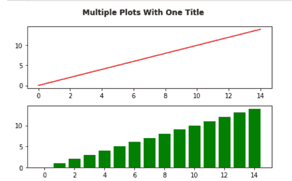

Matplotlib multiple plots with one title

阅读:[什么是 add_axes matplotlib](https://pythonguides.com/add_axes-matplotlib/)

## Matplotlib 多个图一个图例

在 matplotlib 中，图例用于表示图形元素。我们可以在图中的任何地方设置和调整图例。有时，需要创建一个包含多个地块的图例。

**我们来看一个例子:**

```py
**# Import Library**

import matplotlib.pyplot as plt

**# Create figure** 
fig = plt.figure(figsize=(10, 9))

**# Multiple Plots**

axes = fig.subplots(nrows=1, ncols=2)

**# Define Data** 
year = [2000, 2001, 2002, 2003, 2004, 2005, 2006, 2007, 2008, 
        2009, 2010]
birth_rate = [26.635, 26.170, 25.704, 25.238, 24.752, 24.266, 
              23.779, 23.293, 22.807, 22.158, 21.508]
death_rate = [8.804, 8.661, 8.518, 8.375, 8.261, 8.147, 8.034, 
              7.920, 7.806, 7.697, 7.589]

**# Plot**

axes[0].plot(year,birth_rate, label='Birth Rate', marker='o')
axes[1].plot(year,death_rate ,label='Death Rate', marker='o')

**# Legend**

handels = []
labels = []

for ax in fig.axes:
    Handel, Label = ax.get_legend_handles_labels()
    handels.extend(Handel)
    labels.extend(Label)

fig.legend(handels, labels, loc = 'upper center')

**# Display**

plt.show()
```

*   导入 `matplotlib.pyplot` 库进行数据可视化。
*   然后，我们使用 `figure()` 方法创建一个 figure。
*   为了创建多个情节，我们使用 `subplots()` 函数。
*   接下来，我们定义数据坐标。
*   然后，我们用 `plot()` 函数绘制一个线图。
*   在这之后，我们创建两个空列表，定义 `handels` 和**标签**。
*   如果在一个子图中有更多的行和标签，list `extend` 函数用于将它们全部添加到行和标签列表中。
*   为了显示图例，我们使用 `legend()` 函数。
*   为了显示这个图，我们使用了 `show()` 函数。

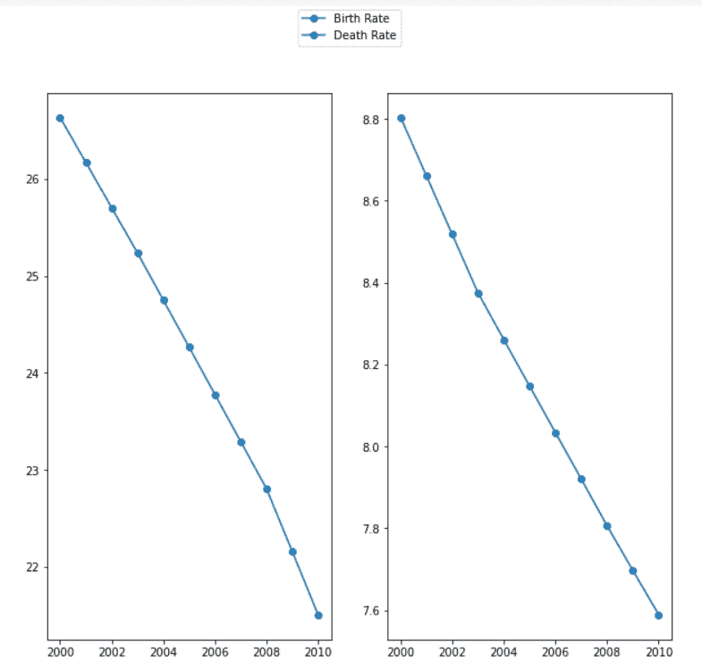

Matplotlib multiple plots one legend

推荐: [Matplotlib 散点图图例](https://pythonguides.com/matplotlib-scatter-plot-legend/)

## Matplotlib 绘制多个矩形

在 matplotlib 中， `patches` 模块允许我们在绘图顶部覆盖矩形等形状。补丁模块中的 `Rectangle()` 函数可用于添加一个矩形。

矩形函数取你需要的矩形的**宽**和**高**，以及**左**和**底**位置。矩形根据我们的需要突出显示了绘图的特定部分。

**绘制矩形的语法如下:**

```py
matplotlib.patches.Rectangle(xy, width, height, 
                             angle=0.0,**kwargs)
```

**以上使用的` `参数定义如下:**

*   **xy:** 指定锚点，即矩形开始的左下点。
*   **宽度:**指定矩形的宽度。
*   **高度:**指定矩形的高度。
*   **角度:**指定矩形旋转的角度。

**让我们看看与此相关的例子:**

**例#1**

在这个例子中，我们绘制了多个矩形来突出显示最高和最低的重量和高度。

```py
**# Import Libraries** 
import matplotlib.pyplot as plt
import pandas as pd
import matplotlib.patches as mpatches
```

*   首先，我们导入必要的库，如
    *   `matplotlib.pyplot` 用于数据可视化。
    *   **熊猫**进行数据创作。
    *   `matplotlib.patches` 在绘图顶部添加矩形等形状。

```py
**# Load Dataset** 
df = pd.read_csv('weight-height.csv')
```

我们将使用体重-身高数据集，并直接从 CSV 文件中加载它。

**点击此处下载数据集:**

[weight-height](https://pythonguides.com/wp-content/uploads/2022/01/weight-height-1.csv)[Download](https://pythonguides.com/wp-content/uploads/2022/01/weight-height-1.csv)

```py
**# Print Top 10 Rows**

df.head(10)

**# Print Last 10 Rows**

df.tail(10)
```

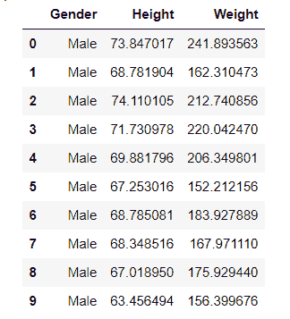

df.head()

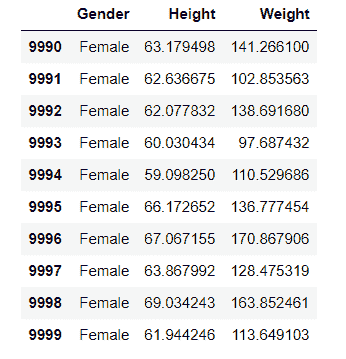

df.tail()

```py
**# Set figure size**

plt.figure(figsize=(10,7))

**# Plot scatter graph**

plt.scatter(x=df.Height, y=df.Weight)

**# Add Labels**

plt.xlabel("Height",fontweight ='bold', size=14)
plt.ylabel("Weight", fontweight ='bold',size=14)
```

*   为了设置绘图的大小，我们使用 `figure()` 方法来传递 `figsize` 参数，并设置其**宽度**和**高度**。
*   为了绘制散点图，我们使用了 `scatter()` 方法。
*   为了在 x 轴上添加标签，我们使用了 `xlabel()` 函数。
*   为了在 y 轴上添加标签，我们使用了 `ylabel()` 函数。
*   为了美化轴上的标签，我们将**字体重量**和**大小**作为参数传递。

```py
**# Define coordinates of rectangle 1**

left, bottom, width, height = (73, 225, 8, 55)

**# Plot Rectangle 1**

rect=mpatches.Rectangle((left,bottom),width,height,
                        alpha=0.1,
                        facecolor="green")
**# Add Rectangle 1**

plt.gca().add_patch(rect)

**# Define coordinates of rectangle 2**

left, bottom, width, height = (52, 50, 8, 48)

**# Plot Rectangle 2**

rect=mpatches.Rectangle((left,bottom),width,height, 
                        alpha=0.3,
                        facecolor="yellow")

**# Add Rectangle 2**

plt.gca().add_patch(rect)

**# Display**

plt.show()
```

*   我们定义矩形的坐标 `x` 、 `y` 、**宽度**、**高度**。
*   通过使用 `Rectangle()` 函数，我们可以添加一个矩形。
*   矩形函数以**位置**、**大小**、**面颜色**和**阿尔法**为参数。
*   为了将这个矩形对象添加到一个已经存在的绘图中，我们使用 `gca()` 函数来获取当前轴。
*   使用 `add_patch()` 函数，将矩形放置在绘图顶部。
*   为了显示该图，我们使用了 `show()` 函数。

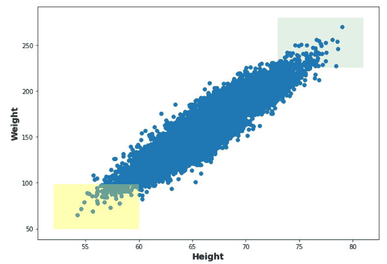

Plot multiple rectangles using matplotlib

**例 2**

在本例中，我们绘制了多个矩形，根据最小和最大身体质量指数指数突出显示体重和身高范围。

```py
**# Import Libraries**

import matplotlib.pyplot as plt
import pandas as pd
import matplotlib.patches as mpatches 
```

导入定义数据坐标和绘制图形和矩形补丁所需的库。

```py
**# Load Dataset**
df = pd.read_csv('bmi.csv')
```

接下来，我们使用 `read_csv()` 函数加载数据集。

**点击此处下载数据集:**

[bmi](https://pythonguides.com/wp-content/uploads/2022/01/bmi.csv)[Download](https://pythonguides.com/wp-content/uploads/2022/01/bmi.csv)

```py
**# Print Top 10 Rows**

df.head(10)

**# Print Last 10 Rows**

df.tail(10)
```

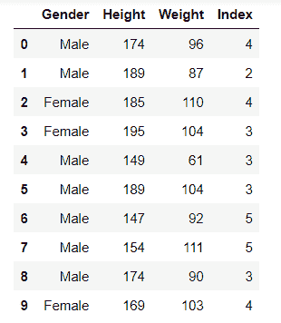

df.head()

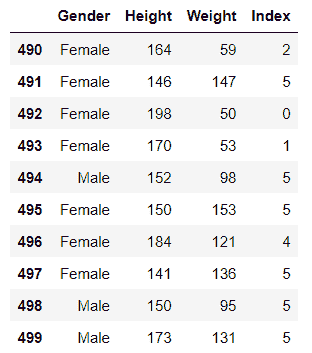

df.tail()

```py
**# Set figure size**

plt.figure(figsize=(10,7))

**# Plot scatter graph**

plt.scatter(x=df.Index, y=df.Height)
plt.scatter(x=df.Index, y=df.Weight)

**# Add Labels**

plt.xlabel("BMI INDEX",fontweight ='bold', size=14)
plt.ylabel("WEIGHT(kg) / HEIGHT(cm)", 
            fontweight ='bold',size=14)
```

*   为了增加图形的大小，我们使用 figure()方法，并将 figsize 参数和绘图的宽度和高度传递给它。
*   为了绘制图表，我们使用 scatter()函数。
*   为了在轴上设置标签，我们使用 xlabel()和 ylabel()函数。

```py
**# Define coordinates of rectangle 1**

left, bottom, width, height = (-0.09, 45, 0.2, 20)

**# Plot Rectangle 1** 
rect=mpatches.Rectangle((left,bottom),width,height,
                        alpha=0.1,
                        facecolor="c")
**# Add Rectangle 1** 
plt.gca().add_patch(rect)

**# Define coordinates of rectangle 2**

left, bottom, width, height = (-0.09, 161, 0.2, 40)

**# Plot Rectangle 2** 
rect=mpatches.Rectangle((left,bottom),width,height, 
                        alpha=0.3,
                        facecolor="yellow")

**# Add Rectangle 2** 
plt.gca().add_patch(rect)

**# Define coordinates of rectangle 3**

left, bottom, width, height = (4.91, 76, 0.2, 86)

**# Plot Rectangle 3** 
rect=mpatches.Rectangle((left,bottom),width,height,
                        alpha=0.1,
                        facecolor="red")
**# Add Rectangle 3**

plt.gca().add_patch(rect)

**# Define coordinates of rectangle 4**

left, bottom, width, height = (4.91, 160, 0.2, 40)

**# Plot Rectangle 4** 
rect=mpatches.Rectangle((left,bottom),width,height, 
                        alpha=0.1,
                        facecolor="green")

**# Add Rectangle 4**

plt.gca().add_patch(rect)

**# Display**

plt.show()
```

*   定义矩形的 `x` 、 `y` 、**宽度**和**高度**坐标。
*   我们可以通过使用 `Rectangle()` 函数来添加一个矩形。
*   **位置**、**大小**、**面色**和**阿尔法**都是矩形函数的参数。
*   我们调用 `gca()` 函数来获取当前轴，以便将这个矩形对象添加到一个已经存在的绘图中。
*   使用 `add_patch()` 函数将矩形放置在图的顶部。
*   `show()` 函数用于显示图形。

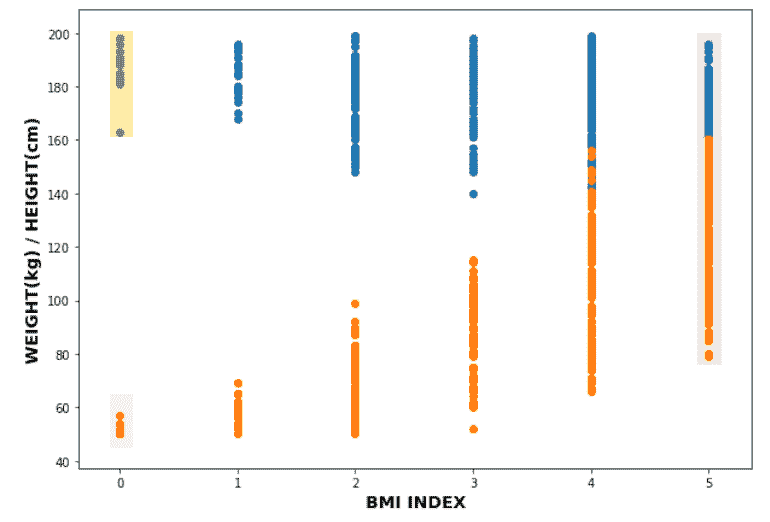

Plot multiple rect using matplotlib

这里我们用矩形来突出体重和身高的范围，分别对应身体质量指数指数的最小值和最大值。

阅读: [Matplotlib 时间序列图](https://pythonguides.com/matplotlib-time-series-plot/)

## Matplotlib 多个图一个颜色条

在这里，我们将学习使用 matplotlib 为图中的多个图添加一个颜色条。

**我们来看例子:**

**例#1**

在本例中，我们使用不同的数据集用一个颜色条绘制多个图表。

```py
**# Import Libraries**

import matplotlib.pyplot as plt
import numpy as np

**# Define Data**

data_x = np.linspace(-20, 30, 3000)
data_y = np.linspace(-50, 20, 3000)

**# Meshgrid**

X, Y = np.meshgrid(data_x, data_y)

Z1 = 5*X + 2*Y
Z2 = X - Y
Z3 = X*Y + 2
Z4 = X`5+Y`5

**# Create a figure object**

fig, axes = plt.subplots(2, 2,
                         figsize=(8,8),constrained_layout=True)

**# Plot** 
im_1 = axes[0,0].imshow(Z1, cmap='seismic')
im_2 = axes[0,1].imshow(Z2, cmap='seismic')
im_3 = axes[1,0].imshow(Z3, cmap='seismic')
im_4 = axes[1,1].imshow(Z4, cmap='seismic')

**# Colorbar**

color_bar = fig.colorbar(im_1, ax=axes[:, 1], shrink=0.5)

**# Display**

plt.show()
```

*   导入必要的库，如 `matplotlib.pyplot` 和 `numpy` 。
*   然后，我们使用 `linspace()` 函数定义数据坐标。
*   在这之后，我们还使用 `meshgrid()` 函数来定义 meshgrid。
*   为了创建一个支线剧情，我们使用**支线剧情()**函数。
*   然后，我们使用 `imshow()` 函数绘制一个图表。
*   为了给绘图添加一个颜色条，我们使用了 `colorbar()` 函数。
*   为了显示这个图，我们使用了 `show()` 函数。

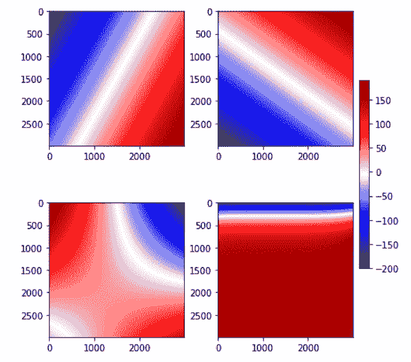

Matplotlib multiple plots one colorbar

**例 2**

```py
**# Import Libraries**

import numpy as np
import matplotlib.pyplot as plt

**# Define Subplots** 
fig, axes = plt.subplots(3, 2,
                        figsize=(8,8),constrained_layout=True)

**# Define Plots**

for ax in axes.flat:
    im = ax.imshow(np.random.random((30,30)),cmap='BrBG')

**# Define Colorbar Coordinates** 
color_bar = fig.add_axes([1, 0.15, 0.05, 0.7])

**# Colorbar plot**

fig.colorbar(im, cax=color_bar)

**# Display**

plt.show()
```

*   导入 `matplotlib.pyplot` 库进行数据可视化。
*   导入 `numpy` 进行数据创建。
*   为了创建多个情节，我们使用了**子情节()**函数。
*   为了迭代所有的轴，我们使用 `axes.flat` 。
*   要定义数据坐标，使用 numpy 的 `random.random()` 函数。
*   为了绘制图表，我们使用了 `imshow()` 函数。
*   之后，我们使用 `add_axes()` 函数设置颜色条的轴。
*   要将颜色条添加到绘图中，使用 `colorbar()` 函数。

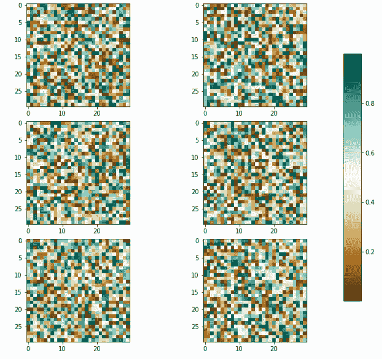

Matplotlib multiple plots single colorbar

这里我们用一个颜色条创建了 6 个 3 行 2 列的多重图。

另外，检查: [Matplotlib 散点图颜色](https://pythonguides.com/matplotlib-scatter-plot-color/)

## Matplotlib 多极坐标图

在这里，我们将学习使用 matplotlib 创建多个极坐标图。为了将轴添加到图形中作为多个绘图的一部分，我们使用 matplotlib 库的图形模块的 `add_subplot()` 方法。

**我们来举个例子:**

```py
**# Import Libraries**

import numpy as np
import matplotlib.pyplot as plt
import math

**# Create new figure** 

fig  = plt.figure(figsize=(6, 6))

**# Set the title of the polar plot**

plt.suptitle('Multiple Polar Plots')

**# Create first subplot**

fig.add_subplot(221, projection='polar')

**# Define Data**

radius = np.arange(0, (5*np.pi), 0.05)
r = 4

**# Plot**

for radian in radius: 
    plot.polar(radian, r,'o')

**# Create second subplot**

fig.add_subplot(222, projection='polar')

**# Define Data** 
a = 4
b = 3

**# Plot**

for radian in radius:
    r = (a*b)/math.sqrt((a*np.cos(radian))**2 + 
                        (b*np.tan(radian))**2)  
    plt.polar(radian,r,'o') 

**# Create third subplot** 
fig.add_subplot(223, projection='polar')

**# Define Data**

a = 8

**# Plot**

for radian in radius:
    r = a + (a*np.sin(radian))  
    plt.polar(radian,r,'o') 

**# Create fourth subplot** 
fig.add_subplot(224, projection='polar')

**# Define Data**

a = 1
n = 10

**# Plot**

for radian in radius:
    r = a * np.cos(n*radian)  
    plt.polar(radian,r,'o')   

**# Auto adjust layout** 
plt.tight_layout() 

**# Display the Polar plot**

plt.show()
```

*   导入必要的库，比如 `matplotlib.pyplot` 、 `numpy` 、 `math` 。
*   要增加图形的大小，使用 `figure()` 方法，并将带有**宽度**和**高度**的 `figsize` 参数传递给它。
*   要在多个图中添加单个标题，使用 `suptitle()` 功能。
*   要创建多个图，使用 `add_subplot()` 函数。
*   为了将投影设置为极坐标，我们将**投影**参数传递给 `add_subplot()` 函数。
*   接下来，我们定义数据坐标。
*   为了绘制极坐标图，我们使用 `polar()` 函数。
*   为了自动调整图的布局，我们使用了 `tight_layout()` 函数。
*   为了显示该图，我们使用 `show()` 函数。

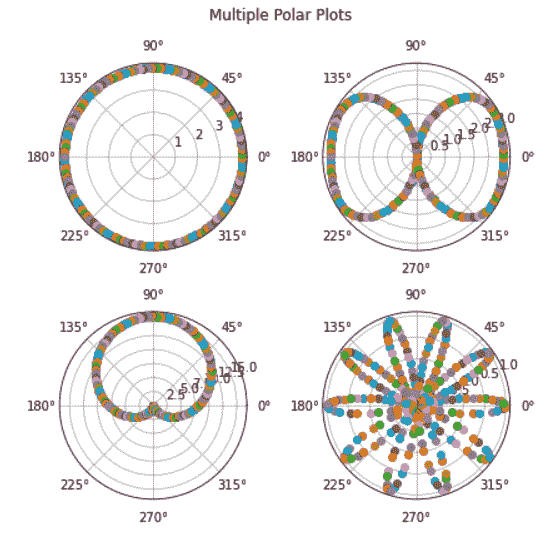

Matplotlib multiple polar plots

阅读:[Matplotlib tight _ layout–有用教程](https://pythonguides.com/matplotlib-tight-layout/)

## Matplotlib 多盒图

在这里，我们将借助一个使用 matplotlib 的示例来学习绘制多个箱线图。

**我们来看一个例子:**

```py
**# Import Libraries**

import matplotlib.pyplot as plt
import pandas as pd
import random
```

*   首先，导入所有必需的库，例如:
    *   `matplotlib.pyplot` 用于数据可视化。
    *   **熊猫**进行数据创作。
    *   `random` 用于访问随机数。

```py
**# Create figure and axes**

fig, ax = plt.subplots(2,2, figsize=(8,6)) 
```

*   `plt.subplots()` 是一个函数，它返回一个包含图形和轴对象的元组。
*   我们定义 **2 行**和 **2 列**。
*   为了增加图形的大小，我们将 `figsize` 参数传递给该方法。
*   我们将绘图的**宽度**设置为 8，将绘图的**高度**设置为 6。

```py
**# Define Data**

data_frame = pd.DataFrame(data={
               'Group 1': random.sample(range(60, 200), 10),
               'Group 2': random.sample(range(20, 80), 10),
               'Group 3': random.sample(range(2000, 3060), 10),
               'Category':list(2*'A')+list(4*'B')+list(4*'C')
                })
```

*   然后，我们使用 `DataFrame()` 函数创建一个数据帧。
*   我们使用 `random.sample()` 和 `range()` 函数来定义数据。
*   我们还使用 `list()` 函数创建一个列表对象来定义类别。

```py
**# Plot boxplot**

for i,elist in enumerate(list(df.columns.values)[:-1]):
    box_plot = df.boxplot(elist, by="Category",  
                          ax=axes.flatten()[i])
```

*   方法 `enumerate()` 向 iterable 添加一个计数器，并将其作为枚举对象返回。
*   然后这个枚举对象可以直接在循环中使用，或者用 `list()` 方法转换成元组列表。
*   为了绘制箱线图，我们使用 `boxplot()` 函数。
*   `axes.flatten()` 是 numpy 数组的方法。它返回数组的扁平版本，而不是迭代器。

```py
**# Remove Empty Subplot**

fig.delaxes(axes[1,1])

**# Auto adjust multiple plots**

plt.tight_layout() 

**# Display figure**

plt.show()
```

*   为了删除空图，我们使用了 `delaxes()` 函数。
*   为了自动调整图的布局，我们使用了 `tight_layout()` 函数。
*   为了显示该图，我们使用了 `show()` 函数。

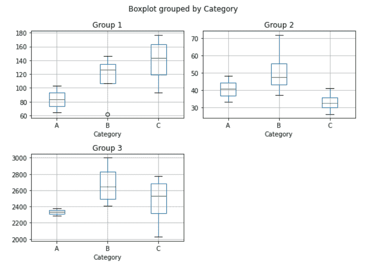

Matplotlib multiple boxplot

读取: [Matplotlib 更新循环中的绘图](https://pythonguides.com/matplotlib-update-plot-in-loop/)

## Matplotlib 多个小提琴情节

Violin 图结合了箱形图和直方图的特征。数据分布使用 violin plots 可视化，它显示了数据的范围、中位数和分布。

**以下是语法:**

```py
matplotlib.axes.Axes.violinplot(dataset, positions=None, 
                                vert=True, width=0.5, 
                                showmeans=False, 
                                showextrema=True, 
                                showmedians=False, 
                                quantiles=None, points=100,  
                                bw_method=None, *, data=None)
```

**这里我们将看到一个多小提琴情节的例子:**

```py
**# Import Libraries**

import matplotlib.pyplot as plt
import numpy as np

**# Create figure and multiple plots** 
fig, ax = plt.subplots(2,3, figsize=(8,6)) 

**# Define Data**

np.random.seed(30)
data_1 = np.random.normal(100, 10, 200)
data_2 = np.random.normal(80, 30, 200)
data_3 = np.random.normal(90, 20, 1200)
data_4 = np.random.normal(70, 25, 2000)
data_5 = np.random.normal(270, 325, 400)

**# Create the boxplot**

ax[0,0].violinplot(data_1)
ax[0,1].violinplot(data_2)
ax[0,2].violinplot(data_3)
ax[1,0].violinplot(data_4)
ax[1,2].violinplot(data_5)

**# Remove empty plot**

fig.delaxes(ax[1,1])

**# Auto layout**

plt.tight_layout()

**# Display**

plt.show()
```

*   首先，我们导入 `matpltlib.pyplot` 模块进行数据可视化。
*   接下来，我们导入 `numpy` 库作为数据定义或创建的 np。
*   然后，我们使用 `subplots()` 方法创建一个新的图形和多个情节。
*   我们创建了 **2 行**，每行有 **3 个地块**。
*   通过使用 `figsize` 参数，我们修改了图形大小。
*   接下来，我们使用 `random.seed()` 函数在代码的多次执行中生成具有相同种子值的随机数。
*   然后，我们使用 `random.normal()` 函数来生成从正态分布中抽取的数字样本。
*   绘制 violin plot，我们调用 `violinplot()` 不同轴的函数。
*   为了删除第一行和第一列的空白图，我们使用了 `delaxes()` 函数。
*   为了自动调整绘图的布局，我们使用了 `tight_layout()` 函数。
*   为了在用户屏幕上可视化绘图，我们使用了 `show()` 方法。

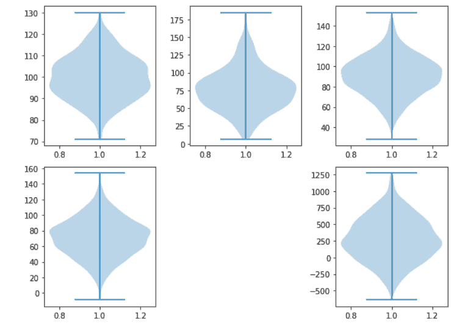

Matplotlib multiple violin plots

阅读: [Matplotlib 饼图教程](https://pythonguides.com/matplotlib-pie-chart/)

## Matplotlib 多圆图

在 matplotlib 中， `patches` 模块允许我们在绘图顶部覆盖圆形等形状。补丁模块中的 `Circle()` 函数可用于添加一个圆。

Circle 函数取你需要的圆的**圆心**，以及**半径**。圆形补丁也用来突出我们需要的情节的特定部分。

**以下是语法:**

```py
matplotlib.patches.Circle(xy, radius ,**kwargs)
```

**让我们看一个与多个圆形图相关的例子:**

```py
**# Import Library** 
import matplotlib.pyplot as plt 

**# Create subplot and figure**

fig, ax = plt.subplots(2,2, figsize=(8,8)) 

**# Plot circles**

circle_1 = plt.Circle(( 0.4 , 0.4),0.35, color='r')
circle_2 = plt.Circle(( 0.5 , 0.5 ), 0.4 , color='yellow', 
                      alpha=0.2)
circle_3 = plt.Circle(( 0.45 , 0.5 ), 0.2 , fill=False)

**# Add Circle Patch**

ax[0,0].add_artist( circle_1 )
ax[0,1].add_artist( circle_2 )
ax[1,1].add_artist( circle_3 ) 

**# Add title on each plot**

ax[0,0].set_title('Colored Circle')
ax[0,1].set_title('Transparent Circle')
ax[1,1].set_title('Outlined Circle')

**# Main Title**

plt.suptitle( 'Multiple Circle Plots',fontweight='bold',fontsize=18 )

**# Remove empty plot**

fig.delaxes(ax[1,0])

**# Display**

plt.show()
```

*   导入 `matplotlib.pyplot` 库进行数据可视化。
*   这里我们使用 `subplots()` 函数创建了 2 行 2 列的多个图。
*   为了设置图形的大小，我们将 `figsize` 参数传递给该方法。
*   为了画一个圆，我们使用 `Circle()` 函数。
*   使用 `add_patch()` 函数将圆放置在图的顶部。
*   为了给每个图添加标题，我们使用 `set_title()` 方法。
*   为了给图添加一个主标题，我们使用了 `suptitle()` 函数。
*   为了移除一个 emoty 图，我们使用 `delaxes()` 函数。
*   为了显示一个绘图，我们使用 `show()` 函数。

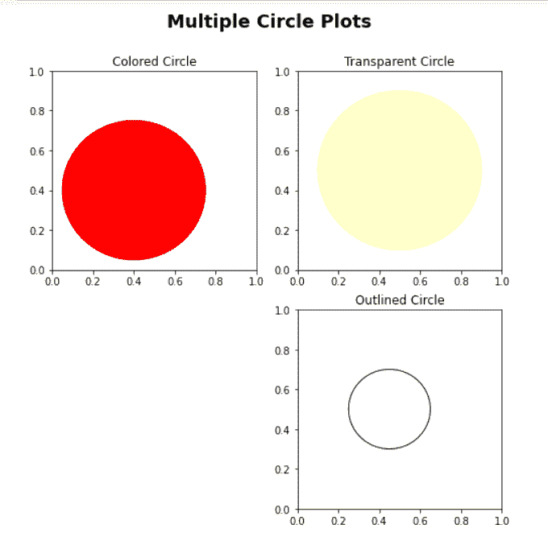

Matplotlib multiple circle plots

## Matplotlib 多重等高线图

等值线图，也称为水平图，是一种多元分析工具，允许您在二维空间中可视化三维图。等高线图通常用于气象部门来说明密度、海拔或山的高度。

matplotlib `contour()` 函数用于绘制等高线图。

**以下是语法:**

```py
matplotlib.pyplot.contour([X, Y, ] Z, [levels], **kwargs)
```

**我们来看一个例子:**

```py
**# Import Libraries**

import matplotlib.pyplot as plt
import numpy as np

**# Create a figure object` **and multiple plots`

fig, ax = plt.subplots(2,2, figsize=(6,6))

**# Define Data**

data_x = np.linspace(-20, 30, 3000)
data_y = np.linspace(-50, 20, 3000)

**# Meshgrid**

X, Y = np.meshgrid(data_x, data_y)

Z1 = np.cos(X/2) + np.sin(Y/4)
Z2 = X*Y + 2
Z3 = X - Y
Z4 = np.cos(X/2) + np.tan(Y/4)

**# Countor Plot**

ax[0,0].contour(X, Y, Z1)
ax[0,1].contour(X, Y, Z2)
ax[1,0].contour(X, Y, Z3)
ax[1,1].contour(X, Y, Z4)

**# Display**

plt.show()
```

*   导入 `matplotlib.pyplot` 和 `numpy` 库。
*   为了创建多个情节，我们使用 `subplots()` 函数。
*   为了定义数据坐标，我们使用了 `linspace()` ， `meshgrid()` ， `cos()` ， `sin()` ， `tan()` 函数。
*   为了绘制 countor 图，我们使用 `contour()` 函数。
*   为了显示该图，我们使用 `show()` 函数。

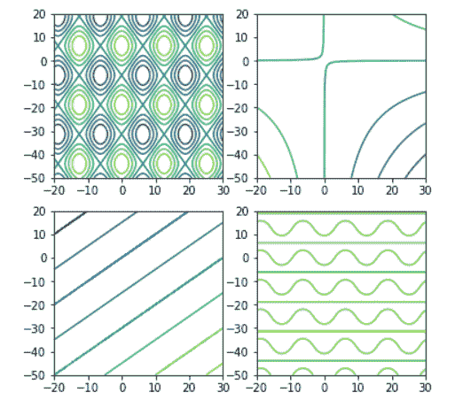

Matplotlib multiple contour plots

**例 2**

这里我们将使用 `contourf()` 函数来绘制填充轮廓。我们使用上例中定义的相同数据集。

```py
**# Import Libraries**

import matplotlib.pyplot as plt
import numpy as np

**# Create a figure object** 
fig, ax = plt.subplots(2,2, figsize=(6,6))

**# Define Data** 
data_x = np.linspace(-20, 30, 3000)
data_y = np.linspace(-50, 20, 3000)

**# Meshgrid** 
X, Y = np.meshgrid(data_x, data_y)
Z1 = np.cos(X/2) + np.sin(Y/4)
Z2 = X*Y + 2
Z3 = X - Y
Z4 = np.cos(X/2) + np.tan(Y/4)

**# Countor Plot**

ax[0,0].contourf(X, Y, Z1)
ax[0,1].contourf(X, Y, Z2)
ax[1,0].contourf(X, Y, Z3)
ax[1,1].contourf(X, Y, Z4)

**# Display**

plt.show()
```

这个例子和第一个例子的唯一区别是我们调用了 `contourf()` 方法。

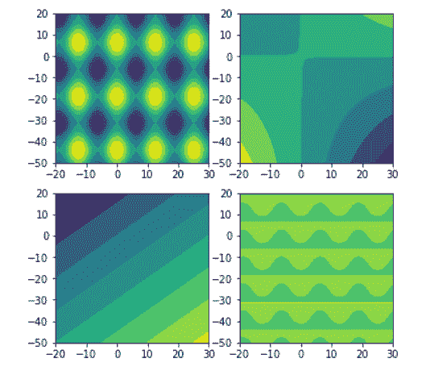

Matplotlib multiple plots contour

阅读: [Matplotlib 多条形图](https://pythonguides.com/matplotlib-multiple-bar-chart/)

## Matplotlib 多图直方图

在这里，我们将学习使用 matplotlib 在示例的帮助下绘制多个直方图。

**举例:**

```py
**# Import library** 
import matplotlib.pyplot as plt
import numpy as np

**# Create figure and multiple plots**

fig, ax = plt.subplots(2,2,figsize=(8,6))

**# Define Data**

x = np.random.normal(loc=1, size=50000)
y = np.random.normal(loc=-1, size=10000)
z = np.random.randn(10000, 3)

**# Plot**

ax[0,0].hist(x, bins=80, color='r')
ax[0,1].hist(y, bins=50, alpha=0.5, 
             color='green',histtype='step')
ax[1,1].hist(z, bins=20, alpha=0.5, color=
            ['green','yellow','orange'],histtype='bar')

**# Remove empty plot**

fig.delaxes(ax[1,0])

**# Auto adjust**

plt.tight_layout()

**# Display**

plt.show()
```

*   导入 `matplotlib.pyplot` 库。
*   为了创建多个情节，我们使用 `subplots()` 函数。
*   为了定义绘图数据，我们使用了 `random.normal()` 和 `random.randn()` 函数。
*   为了绘制直方图，我们使用 `hist()` 函数。
*   我们还使用 `histtype` 参数定义了不同类型的直方图类型。
*   为了删除空的绘图，我们使用 `delaxes()` 函数。

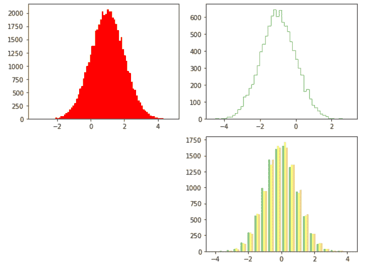

Matplotlib multiple plots histogram

阅读:[堆积条形图 Matplotlib](https://pythonguides.com/stacked-bar-chart-matplotlib/)

## Matplotlib 多个地块 seaborn

在这里，我们将学习使用 matplotlib 绘制多个 seaborn 图。

**我们来看一个例子:**

```py
**# Import Libraries**

import seaborn as sns
import numpy as np
import pandas as pd
import matplotlib.pyplot as plt

**# Seaborn Style**

sns.set()

**# Create new figure and plots**

fig, ax = plt.subplots(1,2)

**# Define Data** 
x = range(15)
y = range(15)

**# Plot**

ax[0].plot(x, y, color='r')
ax[1].bar(x, y, color='green')

**# Auto layout**

plt.tight_layout()

**# Display**

plt.show()
```

*   导入必要的库，如
    *   `matplotlib.pyplot` 用于数据可视化。
    *   `seaborn` 进行数据可视化。
    *   `numpy` 用于数据创建。
*   然后我们使用 `sns.set()` 函数设置 seaborn 的默认样式。
*   为了创建支线剧情，我们使用 1 行 2 列的**支线剧情()**函数。
*   为了定义数据坐标，我们使用 `range()` 函数。
*   为了绘制一个图形，我们使用 `plot()` 和 `bar()` 函数。
*   为了自动调整多个地块的布局，我们使用了 `tight_layout()` 函数。
*   为了显示该图，我们使用 `show()` 函数。

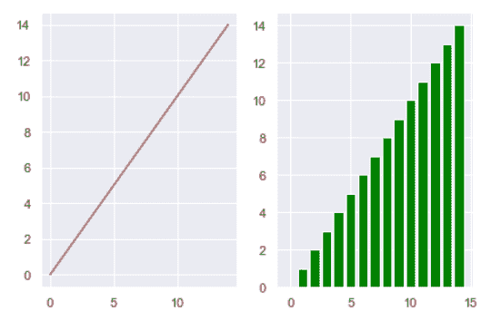

Matplotlib multiple plots seaborn

还有，看看 Matplotlib 上的一些教程。

*   [Matplotlib 默认图形尺寸](https://pythonguides.com/matplotlib-default-figure-size/)
*   [Matplotlib 条形图标签](https://pythonguides.com/matplotlib-bar-chart-labels/)
*   [Matplotlib 不显示图](https://pythonguides.com/matplotlib-not-showing-plot/)
*   [将图例放在绘图 matplotlib 之外](https://pythonguides.com/put-legend-outside-plot-matplotlib/)
*   [Matplotlib savefig 空白图像](https://pythonguides.com/matplotlib-savefig-blank-image/)

在本 Python 教程中，我们已经讨论了" `Matplotlib multiple plots"` ，并且我们还介绍了一些与之相关的例子。这些是我们在本教程中讨论过的以下主题。

*   Matplotlib 多图
*   Matplotlib 多图示例
*   Matplotlib 多个图一个标题
*   Matplotlib 多个图一个图例
*   Matplotlib 绘制多个矩形
*   Matplotlib 多个图一个颜色条
*   Matplotlib 多极坐标图
*   Matplotlib 多盒图
*   多个小提琴情节
*   Matplotlib 多重圆形图
*   Matplotlib 多重等高线图
*   Matplotlib 多图直方图
*   Matplotlib 多图 seaborn

[Bijay Kumar](https://pythonguides.com/author/fewlines4biju/)

Python 是美国最流行的语言之一。我从事 Python 工作已经有很长时间了，我在与 Tkinter、Pandas、NumPy、Turtle、Django、Matplotlib、Tensorflow、Scipy、Scikit-Learn 等各种库合作方面拥有专业知识。我有与美国、加拿大、英国、澳大利亚、新西兰等国家的各种客户合作的经验。查看我的个人资料。

[enjoysharepoint.com/](https://enjoysharepoint.com/)[](https://www.facebook.com/fewlines4biju "Facebook")[](https://www.linkedin.com/in/fewlines4biju/ "Linkedin")[](https://twitter.com/fewlines4biju "Twitter")