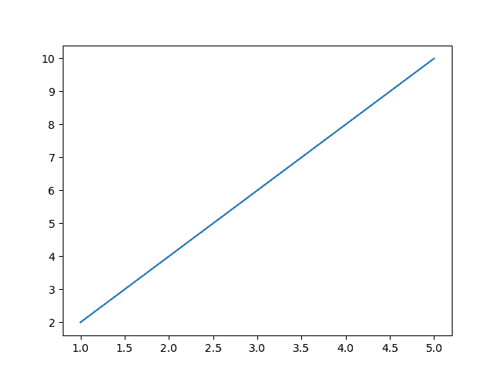
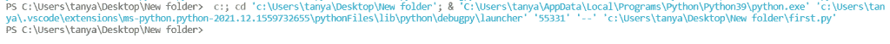
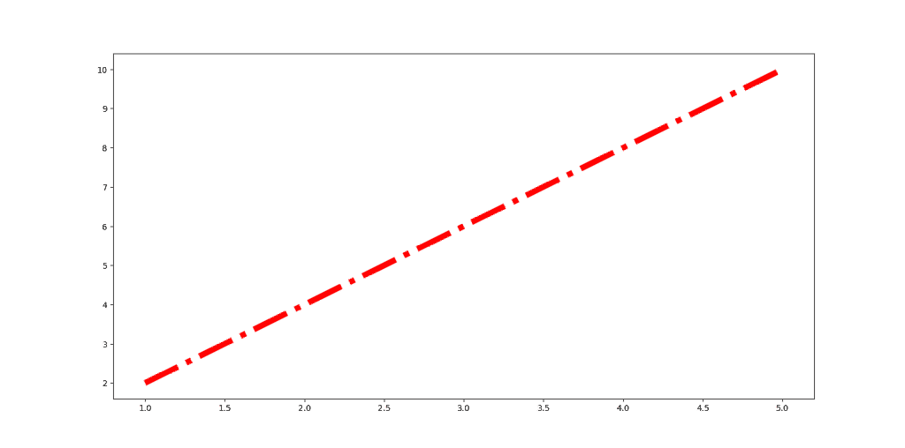
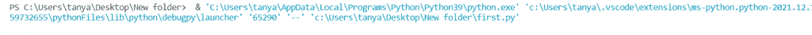
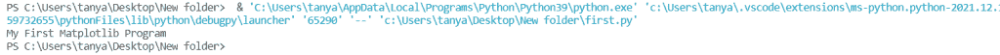
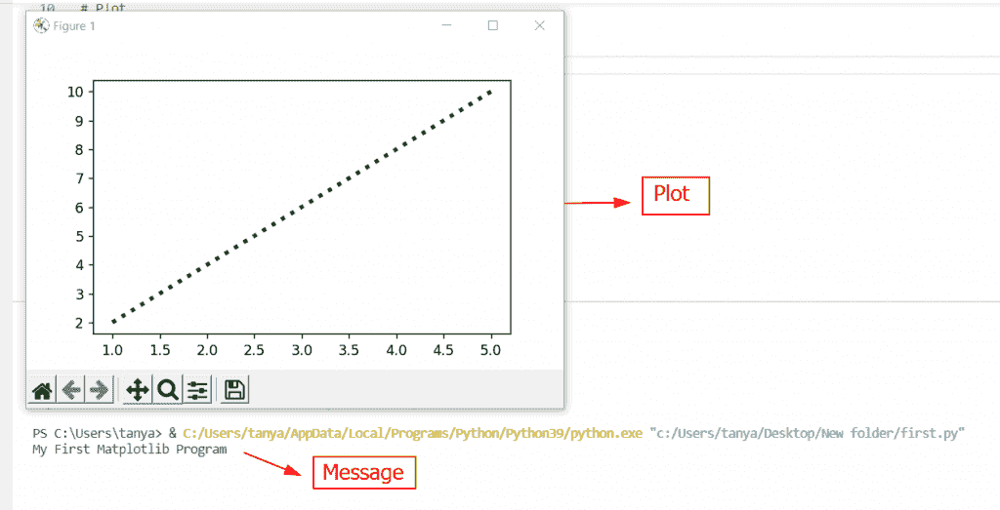

# Matplotlib 不显示绘图

> 原文：<https://pythonguides.com/matplotlib-not-showing-plot/>

[](https://sharepointsky.teachable.com/p/python-and-machine-learning-training-course)

在这个 [Python Matplotlib 教程](https://pythonguides.com/what-is-matplotlib/)中，我们将讨论 Matplotlib 不显示 plot。在这里，我们将涵盖与使用 matplotlib 无法显示的绘图相关的不同示例。我们还将讨论以下主题:

*   Matplotlib 不显示绘图 jupyter
*   Matplotlib 不显示绘图 vscode

目录

[](#)

*   [Matplotlib 不显示绘图 Jupyter](#Matplotlib_not_showing_plot_Jupyter "Matplotlib not showing plot Jupyter")
    *   [显示()功能](#Show_Function "Show() Function")
    *   [使用内嵌](#Using_inline "Using inline")
*   [Matplotlib 不显示曲线图 vscode](#Matplotlib_not_showing_plot_vscode "Matplotlib not showing plot vscode")

## Matplotlib 不显示绘图 Jupyter

Jupyter Notebook 是一个基于 Python 的用户界面，允许用户通过使用有序的输入/输出单元阵列来完成 Python web 服务器作业和存放代码解决方案。

**jupyter 笔记本有两种展现剧情的方式:**

*   通过使用显示
*   通过使用内嵌

### 显示()功能

在 matplotlib 库中，pyplot 模块的 `show()` 函数用于显示所有的图形或绘图。

### 使用内嵌

我们已经有一个与 matplotlib 内联相关的帖子。要深入了解 matplotlib 内联，请阅读文章:[什么是 matplotlib 内联](https://pythonguides.com/what-is-matplotlib-inline/)。

此外，检查:[模块' matplotlib '没有属性' plot'](https://pythonguides.com/module-matplotlib-has-no-attribute-plot/)

## Matplotlib 不显示曲线图 vscode

在这一节中，我们将讨论 show 函数。matplotlib 库的 pyplot 模块中的 `show()` 函数用于显示图形。

**语法为:**

```py
matplotlib.pyplot.show(*args , **kwargs)
```

这些参数如下:

*   **args:** 指定多个参数。
*   **kwargs:** 指定多个关键字参数。

通常，我们将使用不带参数的 show()函数。

**我们来看一个例子:**

```py
**# Import Library**

import matplotlib.pyplot as plt

**# Define Data**

x = [1, 2, 3, 4, 5]
y = [2, 4, 6, 8, 10]

**# Plot** 
plt.plot(x, y)

**# Display**

plt.show()
```

*   首先，我们用 **pyplot 子模块**导入 **matplotlib 库**进行数据可视化。
*   接下来，我们定义 `x` 和 `y` 数据坐标。
*   为了绘制一个简单的线图，我们使用 pyplot 模块的 `plot()` 函数。
*   最后，为了显示这个图，我们使用了 `show()` 函数。我们正在使用这个函数，没有任何参数。

当我执行这段代码时，输出是:



Matplotlib not showing plot

如果我们不使用这个函数就意味着 show()函数看看会发生什么。

**代码:**

```py
**# Import Library**

import matplotlib.pyplot as plt

**# Define Data**

x = [1, 2, 3, 4, 5]
y = [2, 4, 6, 8, 10]

**# Plot** 
plt.plot(x, y) 
```

如果我现在执行这段代码，输出如下:



Matplotlib plot not showing

这意味着如果我们不使用 show()函数，它就不会显示任何图形。

当我们在**非交互**模式下使用 `show()` 功能时。

这意味着当我们在文件中编写代码时，它将显示所有的图形或图和块，直到图被关闭。

**我们用一个例子来理解这个概念:**

```py
**# Import Library**

import matplotlib.pyplot as plt

**# Define Data**

x = [1, 2, 3, 4, 5]
y = [2, 4, 6, 8, 10]

**# Plot**

plt.plot(x, y)

**# Display**

plt.show()

**# Print Statement**

print('My First Matplotlib Program')
```

*   对于数据可视化，我们首先用 `pyplot` 子模块导入 `matplotlib` 库。
*   然后定义 `x` 和 `y` 数据坐标。
*   pyplot 包的 `plot()` 函数用于创建一个简单的线图。
*   在此之后，我们使用不带任何参数的 `show()` 函数来显示绘图。
*   接下来，我们使用 `print()` 函数来打印语句。

**现在，我执行这段代码，看看输出是什么:**



Matplotlib not showing plot vscode



Terminal Output

从上面的输出中，您可以看到 plot 正在显示，并且在终端 shell 中，我们可以看到它没有打印打印消息。

现在，要打印消息，我们必须关闭图形。并且关闭后，该图消息将打印在终端外壳中。

**下面是输出:**



Message Print

基本上，它会阻止语句的执行，直到图形被关闭。

如果你想改变它，那么你必须在 **show()方法**中取一个块作为参数。

**块**是一个布尔值，可以设置为**真**或**假**。并且该块的**默认值**为**真**。

**以下是语法:**

```py
matplotlib.pyplot.show(block = True | False)
```

Block 什么都不是，但是它会阻止代码的执行，直到我们关闭所有的情节。

如果你把一个**阻塞**参数当作**假**，那么它不会阻塞执行。这意味着它用开放图显示打印信息。

**我们来看一个例子:**

```py
**# Import Library** 
import matplotlib.pyplot as plt

**# Define Data** 
x = [1, 2, 3, 4, 5]
y = [2, 4, 6, 8, 10]

**# Plot** 
plt.plot(x, y, color='green', linewidth=3, linestyle='dotted')

**# Display** 
plt.show(block=False)

**# Print Statement**

print('My First Matplotlib Program')

**# Hold the plot** 
plt.pause(1000)
```

**输出如下:**



plt.show(block=False)

如果将 block 参数设置为 False 时绘图闪烁并关闭。不要担心使用 `plt.pause()` 函数来保持绘图。

`show()` 函数用于所有编辑器和操作系统，如【colab，pycharm，mac，ubuntu，spyder，Linux，terminal，jupyter lab】来显示绘图。

你可能也喜欢阅读下面的 Matplotlib 教程。

*   [Matplotlib 增加地块大小](https://pythonguides.com/matplotlib-increase-plot-size/)
*   [什么是 add_axes matplotlib](https://pythonguides.com/add_axes-matplotlib/)
*   [Matplotlib 饼图教程](https://pythonguides.com/matplotlib-pie-chart/)
*   [Python Matplotlib tick _ params](https://pythonguides.com/matplotlib-tick-params/)
*   [Matplotlib 未知投影‘3d’](https://pythonguides.com/matplotlib-unknown-projection-3d/)

因此，在这个 **Python 教程**中，我们已经讨论了**“Matplotlib 不显示 plot”**，并且我们还涵盖了一些与使用 **plot 不显示 matplotlib** 相关的示例。这些是我们在本教程中讨论过的以下主题。

*   Matplotlib 不显示绘图 jupyter
*   Matplotlib 不显示绘图 vscode

[Bijay Kumar](https://pythonguides.com/author/fewlines4biju/)

Python 是美国最流行的语言之一。我从事 Python 工作已经有很长时间了，我在与 Tkinter、Pandas、NumPy、Turtle、Django、Matplotlib、Tensorflow、Scipy、Scikit-Learn 等各种库合作方面拥有专业知识。我有与美国、加拿大、英国、澳大利亚、新西兰等国家的各种客户合作的经验。查看我的个人资料。

[enjoysharepoint.com/](https://enjoysharepoint.com/)[](https://www.facebook.com/fewlines4biju "Facebook")[](https://www.linkedin.com/in/fewlines4biju/ "Linkedin")[](https://twitter.com/fewlines4biju "Twitter")