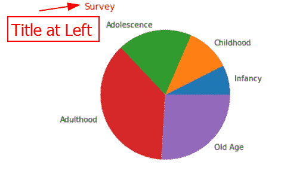
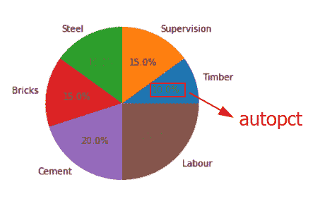
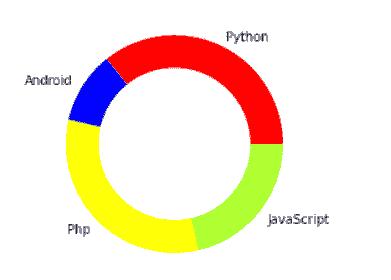

# Matplotlib 饼图教程

> 原文：<https://pythonguides.com/matplotlib-pie-chart/>

[](https://sharepointsky.teachable.com/p/python-and-machine-learning-training-course)

在本 [Python Matplotlib 教程](https://pythonguides.com/what-is-matplotlib/)中，我们将讨论 Matplotlib 中的 **Matplotlib 饼状图**。在这里，我们将使用 matplotlib 介绍与**饼状图相关的不同示例。我们还将讨论以下主题:**

*   python 中的 Matplotlib 饼图
*   Matplotlib 饼图示例
*   Matplotlib pie chart title
*   Matplotlib 饼图标题位置
*   Matplotlib 饼图标题字体大小
*   Matplotlib 饼图颜色
*   带标签的 Matplotlib 饼图
*   Matplotlib 饼图背景色
*   Matplotlib 饼图十六进制颜色
*   带图例的 Matplotlib 饼图
*   matplot lib pie chart label fontsize
*   matplot lib pie chart legend fontsize
*   Matplotlib 饼图自动压缩
*   Matplotlib 饼图自动压缩位置
*   Matplotlib 饼图楔形图
*   Matplotlib 饼图边缘颜色
*   Matplotlib 饼图增加大小
*   Matplotlib 饼图标签在内部
*   Matplotlib 饼图粗体文本
*   Matplotlib 饼图放大
*   Matplotlib 饼图文本属性
*   Matplotlib 饼图文本颜色
*   Matplotlib 饼图阴影
*   Matplotlib pie chart alpha
*   Matplotlib 饼图爆炸图
*   Matplotlib 饼图阴影
*   Matplotlib 饼图框架
*   Numpy matplotlib pie chart(数字打印图表)
*   Matplotlib pie chart label header
*   Matplotlib 多重饼图
*   Matplotlib 饼图移动图例
*   Matplotlib 饼图移动标签
*   Matplotlib 饼图不是圆形
*   并排的 Matplotlib 饼图
*   Matplotlib 饼图保存
*   Matplotlib 饼图关闭标签
*   来自数据框架的 Matplotlib 饼图
*   带标签的 Matplotlib 嵌套饼图
*   Matplotlib 饼图删除标签
*   Matplotlib 饼图半径
*   Matplotlib 饼图旋转标签
*   Matplotlib 饼图子情节
*   Matplotlib 饼图开始角度
*   Matplotlib 饼图词典
*   Matplotlib 半饼图
*   Matplotlib 饼图绝对值
*   Matplotlib pie chart 甜甜圈
*   Matplotlib 饼图批注
*   Matplotlib 饼图分类数据

目录

[](#)

*   [python 中的 Matplotlib 饼图](#Matplotlib_pie_chart_in_python "Matplotlib pie chart in python")
*   [Matplotlib 饼图示例](#Matplotlib_pie_chart_example "Matplotlib pie chart example")
*   [Matplotlib 饼图标题](#Matplotlib_pie_chart_title "Matplotlib pie chart title")
*   [Matplotlib 饼图标题位置](#Matplotlib_pie_chart_title_position "Matplotlib pie chart title position")
*   [Matplotlib 饼图标题字体大小](#Matplotlib_pie_chart_title_font_size "Matplotlib pie chart title font size")
*   [Matplotlib 饼图颜色](#Matplotlib_pie_chart_colors "Matplotlib pie chart colors")
*   [带标签的 Matplotlib 饼图](#Matplotlib_pie_chart_with_labels "Matplotlib pie chart with labels")
*   [Matplotlib 饼图背景色](#Matplotlib_pie_chart_background_color "Matplotlib pie chart background color")
*   [Matplotlib 饼图十六进制颜色](#Matplotlib_pie_chart_hex_color "Matplotlib pie chart hex color")
*   [带图例的 Matplotlib 饼图](#Matplotlib_pie_chart_with_legend "Matplotlib pie chart with legend")
*   [matplotlib pie chart label fontsize](#Matplotlib_pie_chart_label_fontsize "Matplotlib pie chart label fontsize")
*   [Matplotlib 饼图图例字体大小](#Matplotlib_pie_chart_legend_font_size "Matplotlib pie chart legend font size")
*   [matplot lib pie chart autopsy](#Matplotlib_pie_chart_autopct "Matplotlib pie chart autopct")
*   [Matplotlib 饼状图自动选取位置](#Matplotlib_pie_chart_autopct_position "Matplotlib pie chart autopct position")
*   [Matplotlib 饼图楔形图](#Matplotlib_pie_chart_wedgeprops "Matplotlib pie chart wedgeprops")
*   [Matplotlib 饼图边缘颜色](#Matplotlib_pie_chart_edge_color "Matplotlib pie chart edge color")
*   [Matplotlib 饼图增加尺寸](#Matplotlib_pie_chart_increase_size "Matplotlib pie chart increase size")
*   [Matplotlib 饼图标签内](#Matplotlib_pie_chart_labels_inside "Matplotlib pie chart labels inside")
*   [Matplotlib 饼图粗体文本](#Matplotlib_pie_chart_bold_text "Matplotlib pie chart bold text")
*   [Matplotlib 饼图变大](#Matplotlib_pie_chart_bigger "Matplotlib pie chart bigger")
*   [Matplotlib 饼图 textprops](#Matplotlib_pie_chart_textprops "Matplotlib pie chart textprops")
*   [Matplotlib 饼图文本颜色](#Matplotlib_pie_chart_text_color "Matplotlib pie chart text color")
*   [Matplotlib 饼图阴影](#Matplotlib_pie_chart_hatch "Matplotlib pie chart hatch")
*   [Matplotlib pie chart alpha](#Matplotlib_pie_chart_alpha "Matplotlib pie chart alpha")
*   [Matplotlib 饼图展开图](#Matplotlib_pie_chart_explode "Matplotlib pie chart explode")
*   [Matplotlib 饼图阴影](#Matplotlib_pie_chart_shadow "Matplotlib pie chart shadow")
*   [Matplotlib 饼图框架](#Matplotlib_pie_chart_frame "Matplotlib pie chart frame")
*   [Numpy matplotlib pie chart](#Numpy_matplotlib_pie_chart "Numpy matplotlib pie chart")
*   [Matplotlib 饼图标签标题](#Matplotlib_pie_chart_label_header "Matplotlib pie chart label header")
*   [Matplotlib 多个饼图](#Matplotlib_multiple_pie_chart "Matplotlib multiple pie chart")
*   [Matplotlib 饼图移动图例](#Matplotlib_pie_chart_move_legend "Matplotlib pie chart move legend")
*   [Matplotlib 饼图移动标签](#Matplotlib_pie_chart_move_labels "Matplotlib pie chart move labels")
*   [Matplotlib 饼图不圆](#Matplotlib_pie_chart_not_circle "Matplotlib pie chart not circle")
*   [Matplotlib 并排饼图](#Matplotlib_pie_chart_side_by_side "Matplotlib pie chart side by side")
*   [Matplotlib 饼图顺时针方向](#Matplotlib_pie_chart_clockwise "Matplotlib pie chart clockwise")
*   [Matplotlib 饼图保存](#Matplotlib_pie_chart_save "Matplotlib pie chart save")
*   [Matplotlib 饼图关闭标签](#Matplotlib_pie_chart_turn_off_labels "Matplotlib pie chart turn off labels")
*   [来自数据帧的 Matplotlib 饼图](#Matplotlib_pie_chart_from_dataframe "Matplotlib pie chart from dataframe")
*   [带标签的 Matplotlib 嵌套饼图](#Matplotlib_nested_pie_chart_with_labels "Matplotlib nested pie chart with labels")
*   [Matplotlib 饼图移除标签](#Matplotlib_pie_chart_remove_labels "Matplotlib pie chart remove labels")
*   [Matplotlib 饼图半径](#Matplotlib_pie_chart_radius "Matplotlib pie chart radius")
*   [Matplotlib 饼图旋转标签](#Matplotlib_pie_chart_rotate_labels "Matplotlib pie chart rotate labels")
*   [Matplotlib 饼状图支线剧情](#Matplotlib_pie_chart_subplots "Matplotlib pie chart subplots")
*   [Matplotlib 饼图开始角度](#Matplotlib_pie_chart_start_angle "Matplotlib pie chart start angle")
*   [Matplotlib 饼图字典](#Matplotlib_pie_chart_dictionary "Matplotlib pie chart dictionary")
*   [Matplotlib 半饼图](#Matplotlib_half_pie_chart "Matplotlib half pie chart")
*   [Matplotlib 饼图绝对值](#Matplotlib_pie_chart_absolute_value "Matplotlib pie chart absolute value")
*   [Matplotlib 饼图甜甜圈](#Matplotlib_pie_chart_donut "Matplotlib pie chart donut")
*   [Matplotlib 饼图注释](#Matplotlib_pie_chart_annotation "Matplotlib pie chart annotation")
*   [Matplotlib 饼图分类数据](#Matplotlib_pie_chart_categorical_data "Matplotlib pie chart categorical data")

## python 中的 Matplotlib 饼图

在本节中，我们将学习**什么是饼图**以及**如何创建饼图**。此外，如何使用 python matplotlib 工具创建一个饼图来表示您的数据。在开始这个话题之前，我们首先要明白**派**图**图**是什么意思:

饼图是一种特殊类型的图表，它使用**圆形图**来表示数据。这是最常用的表示数据的图表之一，它使用圆、球体和角度数据的属性来表示真实世界的数据。

*   饼状图用于只显示**一个系列的数据**。
*   **整圆**图代表**整数据**，**切片**代表**数据` `集合**。
*   馅饼的切片被称为**楔形**。
*   **完整饼图**的面积等于**占` `给定数据**的总百分比。
*   **切片**的面积等于数据部分的**百分比。**

在 matplotlib 中， `pie()` 函数用于创建饼图。语法如下所示:

```py
matplotlib.pyplot.pie(x, explode=None, labels=None, 
                      colors=None, autopct=None, 
                      pctdistance=0.6, shadow=False, 
                      labeldistance=1.1, startangle=None, 
                      radius=None, counterclock=True, 
                      wedgeprops=None, textprops=None, 
                      center=(0,0), frame=False, 
                      rotatelabels=False, * , data=None) 
```

**以下是参数:**

| 参数 | 价值 | 描述 |
| --- | --- | --- |
| x | 排列 | 指定楔形的大小。 |
| 激增 | 数组
默认值:无 | 如果不是 None，则是一个 len(x)数组，它指示每个楔形应该移动的半径的分数。
 |
| 标签 | 列表
默认:无 | 每个楔形区的标签由一个字符串序列指定。
 |
| 颜色；色彩；色调 | 数组
默认值:无 | 饼图将在 matplotlib 颜色参数序列中循环。如果没有，将使用当前活动周期中的颜色。 |
| 自动 ct | 字符串或函数
默认值:无 | 如果不是 None，则使用一个字符串或函数来标记楔形区的数值。标签将被放置在楔形物内。如果是格式字符串，标签将是 fmt% pct。如果它是一个函数，它将被调用。 |
| 百分比距离 | 浮动
默认值:0.6 | 每个饼图扇区的中心与自动执行生成的文本的开头之间的距离。如果 autopct 为 None，则忽略它。 |
| 阴影 | bool
Default: False | 就在饼的下面，画一个阴影。 |
| 使标准化 | bool
Default: False | 通过将 x 归一化为 sum(x) == 1，始终在 True 时创建完整的饼图。如果 sum(x) = 1，False 会创建一个部分饼图，如果 sum(x) > 1，则会引发 ValueError。 |
| 标签距离 | 浮动或无
默认值:1.1 | 饼图标签以径向距离绘制。如果选择了“无”，则不会绘制标签，但会保存它们以供在图例中使用()。 |
| 起始角度 | 浮动
默认值:0 度 | 饼图起点从 x 轴旋转的逆时针角度。 |
| 半径 | 浮点
默认值:1 | 指定饼图的半径。 |
| 反锁 | bool
Default: True | 指定分数应该顺时针还是逆时针旋转。 |
| 楔形夹 | 默认:无 | 饼图由提供给组成饼图的楔形对象的参数字典组成。例如，wedgeprops =' linewidth': 3 可用于将楔形边框线的宽度设置为 3。 |
| textprops | 默认:无 | 传递给 dict 中文本对象的参数。 |
| 中心 | (float，float)
默认值:(0，0) | 图表中心的坐标。 |
| 设计 | bool
Default: False | 如果为真，用图表绘制坐标轴框架。 |
| 旋转标签 | bool
Default: False | 如果为真，则将每个标签旋转到相应切片的角度。 |
| 数据 | 可转位对象 | 以下参数采用一个字符串 s，如果给定的话，它被解释为 data[s](除非出现异常):
x，explode，labels，colors |

另外，检查: [Matplotlib 默认图形尺寸](https://pythonguides.com/matplotlib-default-figure-size/)

## Matplotlib 饼图示例

这里，我们将讨论一个与 Matplotlib 饼图相关的示例。

```py
**# Import Library**

import matplotlib.pyplot as plt

**# Define Data Coordinates** 
data = [20, 16, 8, 9.8] 

**# Plot**

plt.pie(data) 

**# Display**

plt.show() 
```

*   首先导入 `matplotlib.pyplot` 库进行数据可视化。
*   接下来，定义用于打印的数据坐标。
*   为了创建一个饼图，我们使用了 `pie()` 函数。
*   要显示图表，使用 `show()` 功能。

**输出:**


plt.pie()

检查: [Matplotlib savefig 空白图像](https://pythonguides.com/matplotlib-savefig-blank-image/)

## Matplotlib 饼图标题

在这里，我们将学习向饼图添加标题。要添加标题，我们使用 matplotlib pyplot 模块的 `title()` 方法。

**下面是添加标题的语法:**

```py
matplotlib.pyplot.title()
```

**我们来看一个例子:**

```py
**# Import Library**

import matplotlib.pyplot as plt

**# Define Data Coordinates** 
subjects= ['English', 'Hindi', 'Science', 'Maths']

like = [18, 9, 16, 7]

**# Plot**

plt.pie(like, labels=subjects) 

**# Title**

plt.title('Subject like by students')

**# Display**

plt.show() 
```

*   这里我们定义数据坐标和标签。
*   接下来，我们使用 `pie()` 函数创建一个饼图。
*   要向饼图添加标题，请使用 `title()` 函数。


plt.title()

读: [Matplotlib 另存为 png](https://pythonguides.com/matplotlib-save-as-png/)

## Matplotlib 饼图标题位置

这里我们将看到一个标题位于不同位置的饼图示例。

**需要的语法是:**

```py
matplotlib.pyplot.pie(label, loc= 'center' | 'left' | 'right' )
```

**举例:**

```py
**# Import Library** 
import matplotlib.pyplot as plt

**# Define Data Coordinates** 
age_group = ['Infancy', 'Childhood', 'Adolescence', 
             'Adulthood', 'Old Age']

persons = [10, 15, 25, 50, 35]

**# Plot**

plt.pie(persons, labels=age_group) 

**# Title**

plt.title('Survey',loc='right',color='r')

                **#OR**

plt.title('Survey',loc='left',color='r')

**# Display**

plt.show() 
```

这里我们将 `loc` 作为参数传递给 `title()` 函数，并将其值设置为**右**和**左**。


plt.title(loc=’right’)



plt.left(loc=’left’)

阅读: [Matplotlib 条形图标签](https://pythonguides.com/matplotlib-bar-chart-labels/)

## Matplotlib 饼图标题字体大小

在这里，我们将看到一个带有标题的饼图示例，在这里，我们还更改了标题的字体大小。

**以下是语法:**

```py
matplotlib.pyplot.title(label, fontsize=None)
```

**我们来看一个例子:**

```py
**# Import Library**

import matplotlib.pyplot as plt

**# Define Data Coordinates**

pet = ['Dog', 'Cat', 'Rabbit', 'Parrot', 'Fish']

owner = [50, 15, 8, 20, 12]

**# Plot**

plt.pie(owner, labels=pet) 

**# Title fontsize**

plt.title('Pet Ownership',fontsize=20)

**# Display**

plt.show() 
```

这里我们将 `fontsize` 参数传递给 `title()` 函数来改变标题字体的大小。

**输出:**


plt.title(fontsize=None)

读取: [Matplotlib 绘图误差线](https://pythonguides.com/matplotlib-plot-error-bars/)

## Matplotlib 饼图颜色

这里我们将看到一个例子，我们将在 matplotlib 中改变饼图的颜色。为了改变饼图的颜色，我们将把一个颜色数组传递给 `colors` 参数。

**以下是语法:**

```py
matplotlib.pyplot.pie(x, labels=None, colors=None)
```

**我们来看一个例子:**

```py
**# Import Library**

import matplotlib.pyplot as plt

**# Define Data Coordinates** 
movie = ['Comedy','Drama','Action']

popularity = [60, 40, 25]

**# Colors**

pie_colors = ['tab:orange', 'tab:cyan', 'tab:gray']

**# Plot**

plt.pie(popularity, labels=movie, colors=pie_colors) 

**# Display**

plt.show() 
```

*   在上面的例子中，首先我们导入 `matplotlib.pyplot` 库。
*   之后，我们定义用于绘图的数据坐标和标签。
*   接下来，我们创建一个颜色列表。
*   为了用您选择的颜色绘制饼图，我们使用带有**颜色**参数的 `pie()` 方法。


plt.pie(colors=None)

阅读: [Matplotlib 散点图标记](https://pythonguides.com/matplotlib-scatter-marker/)

## 带标签的 Matplotlib 饼图

为了创建一个带有标签的饼图，我们需要向 `pie()` 方法传递一个**标签**参数。

**以下是语法:**

```py
matplotlib.pyplot.pie(x, labels=None)
```

**举例:**

```py
**# Import Library** 
import matplotlib.pyplot as plt

**# Define Data Coordinates**

icecream = ['Chocolate','Vanilla','Straberry']

**# Labels**

popularity = [55, 30, 15]

**# Plot**

plt.pie(popularity, labels=icecream) 

**# Display**

plt.show() 
```

*   在这里，我们还定义了绘图和标签的数据。
*   为了绘制饼图，我们使用了 `pie()` 方法。
*   为了添加标签，我们传递了**标签**参数。


plt.pie(labels=None)

读取: [Matplotlib 改变背景颜色](https://pythonguides.com/matplotlib-change-background-color/)

## Matplotlib 饼图背景色

为了设置饼图的背景颜色，我们使用带有 `facecolor` 参数的 `figure()` 方法。

**语法如下:**

```py
matplotlib.pyplot.figure(facecolor=None)
```

**我们来看一个例子:**

```py
**# Import Library**

import matplotlib.pyplot as plt

**# Define Data Coordinates**

emojis = ['Happy Face', 'Sad Face', 'Hearts', 'Hand Gestures', 
          'Others']

popularity = [45, 14, 13, 7, 21]

**# Background Color** 
plt.figure(facecolor='salmon')

**# Plot** 
plt.pie(popularity, labels=emojis) 

**# Display**

plt.show() 
```

在这里，我们通过使用 `pie()` 方法创建了一个饼状图来表示最常用的表情符号。为了改变图像的背景颜色，我们使用了带有参数 `facecolor` 的 `figure()` 函数。


plt.figure(facecolor=None)

阅读: [Matplotlib 3D 散点图](https://pythonguides.com/matplotlib-3d-scatter/)

## Matplotlib 饼图十六进制颜色

这里我们将创建一个饼图，并使用十六进制颜色设置切片的颜色。为了得到好看的图表，我们最好选择浅色。

**我们来看一个例子:**

```py
**# Import Library**

import matplotlib.pyplot as plt

**# Define Data Coordinates` **and labels`

languages = ['Python', 'Ruby', 'Java', 'Php']

popularity = [40, 20, 10, 30]

**# Add colors**

colors = ['#ff9999','#66b3ff','#99ff99','#ffcc99']

**# Plot**

plt.pie(popularity, labels=languages, colors=colors) 

**# Display**

plt.show() 
```

这里我们使用十六进制颜色代码设置切片的颜色。为了改变颜色，我们使用了 `colors` 参数。


Hex Color

阅读:[堆积条形图 Matplotlib](https://pythonguides.com/stacked-bar-chart-matplotlib/)

## 带图例的 Matplotlib 饼图

这里我们将看到一个带有图例的饼图示例。为了给绘图添加图例，我们使用 matplotlib 的 pyplot 模块的 `legend()` 函数。

**以下是语法:**

```py
matplotlib.pyplot.legend(labels, loc=None)
```

**举例:**

```py
**# Import Library**

import matplotlib.pyplot as plt

**# Define Data Coordinates**

diet = ['Fruit', 'Protein', 'Vegetables', 'Dairy', 'Grains', 
        'Other']

quantity = [30, 23, 18, 15, 9, 5]

**# Plot**

plt.pie(quantity)

**# Add legend**

plt.legend(labels=diet, loc='upper center', 
           bbox_to_anchor=(0.5, -0.04), ncol=2)

**# Display**

plt.show() 
```

*   导入 **matplotlib 库**的 `pyplot` 函数。
*   定义要绘制的数据。
*   接下来，定义一个标签为的数组。
*   要绘制饼图，请使用 `pie()` 函数。
*   要添加图例，使用 `legend()` 函数。


plt.legend()

阅读:[画垂直线 matplotlib](https://pythonguides.com/draw-vertical-line-matplotlib/)

## matplotlib pie chart label fontsize

这里我们将看到一个饼图的例子，我们将改变标签的字体大小。为了改变字体大小，我们使用了 `textprops` 参数。基本上这个参数是用来修改 pe 图的文本属性的。

**以下是改变标签字体大小的语法:**

```py
matplotlib.pyplot.pie(x, labels=[], textprops={"fontsize":10})
```

**我们来看一个例子:**

```py
**# Import Library** 
import matplotlib.pyplot as plt

**# Define Data Coordinates**

languages = ['Python', 'Ruby', 'Java', 'Php']

popularity = [40, 20, 10, 30]

**# Change label fontsize**

textprops = {"fontsize":15}

**# Plot** 
plt.pie(popularity, labels=languages, textprops =textprops) 

**# Display**

plt.show() 
```

*   首先，我们导入 `matplotlib.pyplot` 库进行数据可视化。
*   接下来，我们定义坐标数据来绘制饼图。
*   之后，我们创建一个要添加的标签列表。
*   然后我们创建一个**字典**，在这里我们设置**字体大小**和它的**值**作为**键**和**值**来改变**标签**的大小。
*   为了创建一个饼图，我们使用了 `pie()` 方法，为了改变标签的字体大小，我们向它传递了 `textprops` 参数。
*   为了显示饼图，我们使用了 `show()` 方法。


textprops{‘fontsize’:15}

阅读: [Matplotlib 另存为 pdf](https://pythonguides.com/matplotlib-save-as-pdf/)

## Matplotlib 饼图图例字体大小

这里我们将看到一个饼图示例，我们将在其中更改图例的字体大小。为了改变字体大小，我们使用带有**图例()**方法的**字体大小**参数。

**以下是语法:**

```py
matplotlib.pyplot.legend(labels, fontsize=None)
```

**我们来看一个例子:**

```py
**# Import Library**

import matplotlib.pyplot as plt

**# Define Data Coordinates**

water_quantity = [17, 27, 14, 22, 16, 6]

**# Add labels**

water_uses = ['Shower', 'Toilet', 'Leaks', 'Clothes Wsher', 
              'Faucet', 'Other']

**# Color**s

colors = 
['salmon','palegreen','skyblue','plum','pink','silver']

**# Plot**

plt.pie(water_quantity, colors=colors)

**# Add legend**

plt.legend(labels=water_uses, fontsize=18, loc='upper center', 
           bbox_to_anchor=(0.5, -0.04), ncol=2)

**# Display**

plt.show() 
```

*   首先，定义数据坐标来绘制饼图。
*   然后创建一个标签列表来定义饼图上的标签。
*   之后，我们创建一个颜色列表来改变切片的颜色。
*   为了绘制饼图，我们使用了 `pie()` 方法。
*   为了向饼图添加图例，我们使用了 `legend()` 方法，并且为了改变图例的字体大小，我们使用了 `fontsize` 参数。


plt.legend(fontsize=18)

阅读: [Matplotlib 标题字体大小](https://pythonguides.com/matplotlib-title-font-size/)

## matplot lib pie chart autopsy

在这里，我们将看到一个带有自动执行参数的饼图示例。**自动压缩**参数用于显示相应楔形的百分比。默认情况下，百分比标签放在内部。格式字符串将是 fmt%pct。

**以下是语法:**

```py
matplotlib.pyplot.pie(x, labels=[], autopct=fmt%pct)
```

**举例:**

```py
**# Import Library**

import matplotlib.pyplot as plt

**# Define Data Coordinates**

cost = [10, 15, 15, 15, 20, 25]

**# Define Label**

work = ['Timber', 'Supervision', 'Steel', 'Bricks', 'Cement', 
        'Labour']

**# Plot with autopct**

plt.pie(cost, labels=work, autopct='%.1f%%') 

**# Display** 
plt.show()
```

*   我们将成本定义为绘制饼图的数据坐标。
*   为了在饼图中定义标签，我们创建一个工作列表。
*   为了绘制饼图，我们使用了 `pie()` 函数。
*   为了在楔形区内添加一个百分比，我们将 `autopct` 参数传递给 `pie()` 方法。



plt.pie(autopct= fmt%pct )

阅读: [Matplotlib 散点图颜色](https://pythonguides.com/matplotlib-scatter-plot-color/)

## Matplotlib 饼状图自动选取位置

这里我们将看到一个饼图的例子，我们手动设置百分比标签的位置。要更改自动投影的位置，我们使用 pctdistance 和 labeldistance 参数。

**语法如下:**

```py
matplotlib.pyplot.pie(x, labels, autopct, pctdistance, 
                      labeldistance)
```

**举例:**

```py
**# Import Library**

import matplotlib.pyplot as plt

**# Define Data Coordinates**

cost = [10, 15, 15, 15, 20, 25]

**# Define Label**

work = ['Timber', 'Supervision', 'Steel', 'Bricks', 'Cement', 
        'Labour']

**# Plot with autopct** `position`

plt.pie(cost, labels=work, autopct='%.1f%%',pctdistance=1.7, 
        labeldistance=1.2) 

**# Display**

plt.show()
```

为了设置楔形区外百分比标签的位置，我们将**百分比距离**和**标签距离**参数传递给 `pie()` 方法。


plt.pie(pctdistance=1.7, labeldistance=1.2)

读取: [Matplotlib Plot NumPy 数组](https://pythonguides.com/matplotlib-plot-numpy-array/)

## Matplotlib 饼图楔形图

这里我们将看到一个饼图**楔形图**参数的例子。基本上，该参数用于修改饼图中扇区的属性。

**语法如下:**

```py
matplotlib.pyplot.pie(x, wedgeprops={}
```

**我们来看一个例子:**

```py
**# Import Library**

import matplotlib.pyplot as plt

**# Define Data Coordinates**

popularity = [20, 15, 35, 26, 16]

**# Define Label**

beverages = ['Tea','Coffee', 'Cola', 'Water', 'Other']

**# color**

colors=['gold', 'springgreen', 'powderblue', 'orchid', 
        'slategray']

**# Plot with wedgeprops**

plt.pie(popularity, labels=beverages, 
        wedgeprops={'edgecolor':'k', 'linestyle': 'dashdot',    
        'antialiased':True} 
,colors=colors)

**# Add title**

plt.title('Favourite Beverages',fontweight='bold')

**# Display**

plt.show()
```

*   首先导入 `matplotlib.pyplot` 库。
*   接下来，定义 x 数据坐标来创建一个饼图。
*   要添加标签，请创建标签列表。
*   要改变切片的颜色，使用 `colors` 参数并向其传递一个颜色列表。
*   要绘制饼图，请使用 `pie()` 方法。
*   要改变楔形的属性，使用 `wedgeprops` 参数。这里我们改变楔形的线型。
*   要给绘图添加标题，使用 `title()` 方法。


plt.pie(wedgeprops={})

Read: [Matplotlib set_xticklabels](https://pythonguides.com/matplotlib-set_xticklabels/)

## Matplotlib 饼图边缘颜色

这里我们将看到一个带有不同边缘颜色的饼图示例。为了改变边缘的颜色，我们使用 `wedgeprops` 参数并创建一个**字典**，以 edgecolor 作为键，color 作为值。

**以下是语法:**

```py
matplotlib.pyplot.pie(x, wedgeprops={'edgecolor':None})
```

**我们来看一个例子:**

```py
**# Import Library**

import matplotlib.pyplot as plt

**# Define Data Coordinates**

popularity = [20, 16, 35, 9]

**# Define Label**

books = ['Story Books','Comic Books', 'Puzzel Books', 'Poem Books']

**# color**

colors=['rosybrown', 'moccasin', 'lightyellow', 'darkseagreen']

**# Plot with different edgecolor**

plt.pie(popularity, labels=books, wedgeprops=
       {'edgecolor':'maroon'}, colors=colors)

**# Add title**

plt.title('Favourite Books',fontweight='bold')

**# Display**

plt.show()
```

*   在这里，我们创建了一个饼图，显示了儿童书籍的受欢迎程度。为了改变饼图**的边缘颜色，wedgeprops** 参数被传递给 `pie()` 方法。
*   Wedgeprops 参数接受 `dict` 中的值，因此，我们创建了一个定义 `edgecolor` 的字典。这里我们设置边缘颜色为**栗色**。


wedgeprops={‘edgecolor’:’maroon’}

阅读: [Matplotlib set_xticks](https://pythonguides.com/matplotlib-set-xticks/)

## Matplotlib 饼图增加尺寸

我们将通过增加图形的大小来增加饼图的大小。

**以下是语法:**

```py
matplotlib.pyplot.figure(figsize=(x,y))
```

这里 x 和 y 分别代表宽度和高度。

**举例:**

```py
**# Import Library**

import matplotlib.pyplot as plt

**# Figure Size** 
plt.figure(figsize=(8,10))

**# Define Data Coordinates**

popularity = [30, 20, 13, 27, 10]

**# Define Label**

fruits = ['Banana','Pineapple', 'Orange', 'Grapes', 'Peach']

**# Color**

colors=['rosybrown', 'moccasin', 'lightyellow', 'darkseagreen', 
        'lavender']

**# Plot** 
plt.pie(popularity, labels=fruits, colors=colors)

**# Add title** 
plt.title('Favourite Fruits',fontweight='bold')

**# Display** 
plt.show()
```

为了增加饼图的大小，我们将 figsize 参数传递给 pyplot 的 `figure()` 方法。


figsize=(8,10)

阅读:[Matplotlib fill _ between–完整指南](https://pythonguides.com/matplotlib-fill_between/)

## Matplotlib 饼图标签内

在这里，我们将看到一个饼图的例子，在切片内有标签。为了在内部添加标签，我们将 `labeldistance` 参数传递给 `pie()` 方法，并相应地设置其值。

**以下是语法:**

```py
matplotlib.pyplot.pie(x, labeldistnce=0.5)
```

**我们来看一个例子:**

```py
**# Import Library** 
import matplotlib.pyplot as plt

**# Define Data Coordinates**

popularity = [25, 34, 25, 8, 8]

**# Define Label**

activities = ['Sleeping', 'School', 'Playing', 'Tv', 'Music']

**# color** 
colors=['lightcoral', 'sandybrown', 'gold', 'darkseagreen', 
        'lavender']

**# Plot** 

plt.pie(popularity, labels=activities, colors=colors, 
        labeldistance=0.5)

**# Add title**

plt.title('Activities',fontweight='bold')

**# Display** 
plt.show()
```


plt.pie(labeldistance=0.5)

阅读:[Matplotlib set _ yticklabels–实用指南](https://pythonguides.com/matplotlib-set_yticklabels/)

## Matplotlib 饼图粗体文本

我们将看到一个饼图示例，其中我们将标签文本加粗。为了加粗文本，我们将 textprops 参数传递给 `pie()` 方法。

**以下是语法:**

```py
matplotlib.pyplot.pie(x, textprops={'fontweight':'bold'})
```

**举例:**

```py
**# Import Library** 
import matplotlib.pyplot as plt

**# Figsize**

plt.figure(figsize=(6,8))

**# Define Data Coordinates**

owner = [10, 45, 15, 30]

**# Define Label**

transport = ['Bicycle', 'Walking', 'Bus', 'Car']

**# Plot** 

plt.pie(owner, labels=transport, textprops=
        {'fontweight':'bold'})

**# Add title**

plt.title('Types of Transport',fontweight='bold')

**# Display**

plt.show()
```


plt.pie(textprops={fontweight:bold})

阅读:[Matplotlib tight _ layout–有用教程](https://pythonguides.com/matplotlib-tight-layout/)

## Matplotlib 饼图变大

我们将看到一个如何创建更大的饼图的例子。

**举例:**

```py
**# Import Library**

import matplotlib.pyplot as plt

**# Figsize**

fig = plt.figure()
fig.set_figheight(10)

**# Define Data Coordinates**

population = [29, 29, 42]

**# Define Label**

wildlife = ['Whales', 'Bears', 'Dolphins']

**# Plot** 

plt.pie(population, labels=wildlife)

**# Add title**

plt.title('Wildlife Population',fontweight='bold')

**# Display**

plt.show()
```

这里我们只增加饼图的高度。为了增加高度，我们使用 `set_figheight()` 方法中的`fig()`方法。


set_figheight()

阅读:[Python Matplotlib tick _ params](https://pythonguides.com/matplotlib-tick-params/)

## Matplotlib 饼图 textprops

这里我们将了解饼图的 textprops 参数。我们将使用 `textprops` 参数来分别设置文本的样式。

**以下是语法:**

```py
matplotlib.pyplot.pie(x, textprops={})
```

**我们来看一个例子:**

```py
**# Import Library**

import matplotlib.pyplot as plt

**# Define Data Coordinates** 
sales = [22, 33, 13, 15, 17]

**# Define Label** 
laptops = ['HP', 'Dell', 'Lenovo', 'Asus', 'Acer']

**# Text Properties** 
text_prop = {'family':'sans-serif', 'fontsize':'x-large', 
             'fontstyle':'italic', 'fontweight':'heavy'}

**# Plot** 
plt.pie(sales, labels=laptops, textprops=text_prop)

**# Add title** 
plt.title('Sales',fontweight='bold')

**# Display** 
plt.show()
```

*   首先导入 `matplotlib.pyplot` 库。
*   然后定义用于制作饼图的数据坐标。
*   我们还创建了一个标签列表。
*   之后，我们创建一个定义文本属性的字典。
*   为了创建一个饼图，我们使用了 `pyplot` 模块的 `pie()` 方法。我们还通过 `textprops` 参数来改变文本的文本属性。
*   我们还使用 `title()` 方法为一个情节添加一个标题。


plt.pie(textprops={})

读取: [Matplotlib x 轴标签](https://pythonguides.com/matplotlib-x-axis-label/)

## Matplotlib 饼图文本颜色

这里我们将看到一个带有标签的饼图示例，在这个示例中，我们将更改标签的颜色。

**改变颜色的语法:**

```py
matplotlib.pyplot.pie(x, textprops={'color':None})
```

**举例:**

```py
**# Import Library** 
import matplotlib.pyplot as plt

**# Define Data Coordinates** 
popularity = [25, 16, 23, 12, 35]

**# Define Label**

sports = ['Football', 'Basketball', 'Badminton', 'Hockey', '       
          'Cricket']

**# Color**

colors = ['orchid','mediumpurple', 'powderblue', 
          'mediumaquamarine', 'sandybrown']

**# Plot** 

plt.pie(popularity, labels=sports, colors=colors, 
        textprops={'color':'darkblue'})

**# Add title**

plt.title('Favourite Sports',fontweight='bold')

**# Display**

plt.show()
```

为了改变文本的颜色，我们创建了一个字典，将**颜色**定义为键，将**深蓝**定义为值，并将这个字典，即 `textprops` 参数传递给 `pie()` 方法。


textprops={‘color’:’darkblue’}

阅读: [Matplotlib 多条形图](https://pythonguides.com/matplotlib-multiple-bar-chart/)

## Matplotlib 饼图阴影

在本节中，我们将了解饼图阴影。我们已经在上面的题目中学习了关于饼状图的内容。现在是时候学习新的东西了，也就是说**孵化**。

在每种情况下，我们都使用颜色来填充饼图，但现在我们学习在饼图的每个部分中填充图案。

为了用图案填充图，我们分配一个新的参数**影线**，其值为一个字符串。部分字符串值有: `/` 、 **\\** 、 **|** 、**–**、 `+` 、 `x` 、 `o` 、**。**， `*`

**源代码:**

```py
**# Import Library** 
import matplotlib.pyplot as plt
import numpy as np

**# Define Data Coordinates**

data = np.random.rand(4)

**# Hatch** 
hatches = ['..' for value in data]

**# Plot pie chart**

pie_chart = plt.pie(data)

**# Fill hatch**

for i in range(len(pie_chart[0])):
    pie_chart[0][i].set(hatch = hatches[i], fill=False)

**# Display**

plt.show()
```

*   首先，我们导入 `matplotlib.pyplot` 和 `numpy` 库。
*   接下来，我们使用 numpy `random.rand()` 函数定义数据来绘制饼图。
*   之后，我们定义**阴影**图案。
*   为了绘制饼图，我们使用了 `pie()` 方法。
*   为了用阴影图案填充饼图，我们使用 for 循环，同时传递 `fill` 参数，并将其值设置为 `False` 以获得空白背景。


hatch=[‘..’]

阅读:[Matplotlib plot _ date–完整教程](https://pythonguides.com/matplotlib-plot-date/)

## Matplotlib pie chart alpha

在本节中，我们将看到一个带有 alpha 参数的饼图示例。 `alpha` 参数用于设置颜色的透明度。其值范围从 **0 到 1** 。

要使用 `alpha` 参数，我们必须调用 `wedgeprops` 参数并创建一个字典，并将 `alpha` 参数设置为**键**，将 alpha 的**值设置为**值**。**

**语法如下:**

```py
matplotlib.pyplot.pie(x, wedgeprops={'alpha':1})
```

**我们来看一个例子:**

```py
**# Import Library** 
import matplotlib.pyplot as plt

**# Define Data Coordinates** 
loss = [14, 32, 15, 11, 28]

**# Define Label** 
reasons = ['Competition', 'Not qualified', 'Salesperson', 
           'Price', 'Timing']

**# Plot** 

plt.pie(loss, labels=reasons, wedgeprops={'alpha':0.5})

**# Add title** 
plt.title('Loss Reasons',fontweight='bold')

**# Display**

plt.show()
```


plt.pie(wedgeprops={‘alpha’:0.5})

阅读: [Matplotlib 支线剧情 _adjust](https://pythonguides.com/matplotlib-subplots_adjust/)

## Matplotlib 饼图展开图

在这里，我们将了解饼图**展开**的论点。使用**爆炸**参数，我们可以弹出饼图的一个或多个部分。

让我们从声明一个包含爆炸值的数组开始。每个切片偏移爆炸阵列中指定半径的一部分。

**语法如下:**

```py
matplotlib.pyplot.pie(x, explode=())
```

**我们来看一个例子:**

```py
**# Import Library**

import matplotlib.pyplot as plt

**# Define Data Coordinates** 
cost = [18, 13, 11, 9, 6, 21, 25]

**# Define Label** 
project = ['Labor','Licenses','Taxes','Legal','Insurance',
           'Facilities','Production']

**# Explosion Value**

explode = (0.2, 0, 0, 0, 0, 0, 0)

**# Plot** 

plt.pie(cost, labels=project, explode=explode)

**# Add title**

plt.title('Project Cost Breakdown',fontweight='bold')

**# Display** 
plt.show()
```

*   定义数据坐标和标签以创建饼图。
*   在此之后，我们定义爆炸值。
*   要创建一个饼图，使用 `pie()` 方法并向其传递 `explode` 参数。


plt.pie(explode=())

阅读: [Matplotlib 支线剧情教程](https://pythonguides.com/matplotlib-subplot-tutorial/)

## Matplotlib 饼图阴影

在本节中，我们将使用 shadow 参数向饼图添加阴影。默认情况下，**阴影**参数的值为**假**。

**以下是语法:**

```py
matplotlib.pyplot.pie(x, shadow=True)
```

**举例:**

```py
**# Import Library**

import matplotlib.pyplot as plt

**# Define Data Coordinates**

defects = [14, 11, 15, 35, 25]

**# Define Label** 
parts = ['Rimcut', 'Bulge', 'Other', 'Dented Rim', 'Dented 
         Body']

**# Explosion Value** 
explode = (0.1, 0.1, 0.1, 0.1, 0.1)

**# Plot** 
plt.pie(defects, labels=parts, explode=explode, shadow=True)

**# Add title**

plt.title('Project Cost Breakdown',fontweight='bold')

**# Display**

plt.show()
```


plt.pie(shadow=True)

另外，检查:[模块“matplotlib”没有属性“artist”](https://pythonguides.com/module-matplotlib-has-no-attribute-artist/)

## Matplotlib 饼图框架

通过将**帧**参数设置为**真**，我们可以在饼图周围绘制一个帧。

**以下是语法:**

```py
matplotlib.pyplot.pie(x, frame=True)
```

**举例:**

```py
**# Import Library**

import matplotlib.pyplot as plt

**# Create subplot** 
figure , ax = plt.subplots()

**# Define Data Coordinates**

sales = [35, 12, 20, 22, 32 ]

**# Define Label**

company = ['Redmi', 'Apple', 'Samsung', 'Oppo', 'Vivo']

**# Plot** 

plt.pie(sales, labels=company, frame=True)

ax.axis('equal')

**# Add title** 
plt.title('Sales of different company',fontweight='bold')

**# Display** 
plt.show()
```

*   导入 `matplotlib.pyplot` 库。
*   创建支线剧情，使用**支线剧情()**方法。
*   定义数据坐标和标签。
*   为了绘制饼图，我们使用了 `pie()` 方法。
*   为了在图表周围设置一个框架，我们将`frame`argument 传递给方法，并将其值**设置为 True** 。
*   将轴设置为**等于**。
*   要添加标题，我们使用 `title()` 方法。


plt.pie(frame=True)

## Numpy matplotlib pie chart

这里我们将看到一个使用 [NumPy](https://pythonguides.com/numpy/) 的饼图示例。

**举例:**

```py
**# Import Libraries**

import matplotlib.pyplot as plt
import numpy as np

**# Define Data Coordinate**

x = np.array([20, 12, 9, 3])

**# Plot pie chart**

plt.pie(x)

**# Display** 
plt.show()
```

*   这里我们导入 `matplotlib.pyplot` 和 `numpy` 库。
*   接下来，我们使用 `array()` 方法定义数据坐标来创建 numpy。
*   为了绘制饼图，我们使用 pyplot 模块的 `plot()` 方法。

**输出:**


np.array([])

## Matplotlib 饼图标签标题

在本节中，我们将看到一个带有标题标签的饼图示例。为了给图例添加标题，我们使用带有参数 `title` 的 legend()函数。

**以下是语法:**

```py
matplotlib.pyplot.legend(title)
```

**我们来看一个例子:**

```py
**# Import Libraries**

import matplotlib.pyplot as plt
import numpy as np

**# Define data coordinates and labels**

quantity = np.array([1, 4, 3, 2])
material = ['Butter', 'Egg', 'Flour', 'Sugar']

**# Plot pie chart**

plt.pie(quantity, labels = material)

**# Legend with header**

plt.legend(title = "Butter Cake:", loc='upper center', 
           bbox_to_anchor=(0.5, -0.04))

**# Display**

plt.show() 
```

*   这里我们使用 pie()方法创建一个饼图来表示奶油蛋糕配方材料数量。
*   要添加带有标题的图例，我们使用带有**标题**参数的 `legend()` 方法。


plt.legend(title=)

## Matplotlib 多个饼图

这里我们将使用 `pyplot` 模块的 `figure()` 方法创建多个饼图。

**举例:**

```py
**# Import Library**

import matplotlib.pyplot as plt

**# Create first chart.**

plt.figure(0)
x = [30, 30, 15, 11, 12]
reasons = ['Health','Less Pollution', 'No parking Ptoblem', 'No costs', 'Faster than driving']
plt.pie(x, labels = reasons, explode=(0.1, 0.1, 0.1, 0.1, 0.1), 
        autopct='%.1f%%')
plt.title('Reasons for cycling', color='r')

**# Create second chart.**

plt.figure(1)
x = [40, 21, 14, 14, 11]
reasons = ['Comfort','Distance', 'Faster than cycling', 'Need to carry things to work', 'Safer than cycling']
plt.pie(x, labels = reasons, explode=(0.1, 0.1, 0.1, 0.1, 0.1), 
        autopct='%.1f%%')
plt.title('Reasons for driving', color='r')

**# Show all figures**

plt.show() 
```

**创建多个饼图的步骤:**

*   导入 `matplotlib.pyplot` 库。
*   创建第一个饼图，使用 `figure()` 方法。
*   定义坐标 x 以创建第一个饼图。
*   接下来定义第一个饼图的标签。
*   为了绘制饼图，我们使用了 `pie()` 方法。
*   我们还将 `explode` 和 `autopct` 参数传递给 `pie()` 方法，分别获取切片的切割和显示切片的百分比。
*   要添加标题，我们使用 `title()` 方法。
*   同样，我们使用 `figure()` 方法创建第二个饼图。


Multiple Pie Chart

阅读:[Matplotlib xlim–完整指南](https://pythonguides.com/matplotlib-xlim/)

## Matplotlib 饼图移动图例

在这里，我们将学习在饼图中移动图例。为了改变图例的位置，我们将 `loc` 参数传递给 `legend()` 方法。

**语法如下:**

```py
**# Import Library** 
import matplotlib.pyplot as plt

**# Define data coordinates and labels**

teachers = [15, 24, 13, 15, 10]
subjects = ['Science', 'Mathematics', 'Social Studies', 
            'English', 'Spanish']

**# Plot pie chart**

plt.pie(teachers)

**#  Move Legend** 
plt.legend(subjects, title = "Subjects Alloted To Teachers:", loc='lower right',bbox_to_anchor=(0.3, -0.08))

**# Display** 
plt.show()
```

**说明:**

要移动图例，我们将 `loc` 和 `bbox_to_anchor` 参数传递给 `legend` 方法，以设置图例的位置和手动位置。


plt.legend(loc=’lower right’, bbox_to_anchor=(0.03, -0.08))

## Matplotlib 饼图移动标签

在这里，我们将学习在饼图中移动标签。为了改变标签的位置，我们将 labeldistance 参数传递给 pie()方法。默认情况下，其位置距离径向距离为 1.1。

**以下是语法:**

```py
matplotlib.pyplot.pie(x, labeldistance=1.1)
```

**我们来看一个例子:**

```py
**# Import Library**

import matplotlib.pyplot as plt

**# Define data coordinates and labels** 
winner = [19, 27, 13, 41]
superhero = ['Captain America', 'Iron Man', 'Superman', 
             'Batman']

**# Plot pie chart**

plt.pie(winner, labels = superhero, labeldistance=1.35)

**# Title**

plt.title('Superhero Battle Winner', color='r')

**# Display**

plt.show() 
```

在本例中，我们通过将 labeldistance 参数传递给方法，将 labeldistance 设置为距离半径 1.35。


plt.pie(labeldistance=1.35)

## Matplotlib 饼图不圆

默认情况下，饼图的形状是**圆形**，但是如果要改变饼图的形状，必须将 explode 参数传递给 `pie()` 方法，并设置不同的爆炸值。

**我们来看一个例子:**

```py
**# Import Library**

import matplotlib.pyplot as plt

**# Define data coordinates**

x = np.random.rand(3)

**# Plot pie chart**

plt.pie(x, explode=(0.5, 0.65, 0.5))

**# Display**

plt.show() 
```


Pie but not circle

## Matplotlib 并排饼图

为了并排创建饼图，我们使用 Matplotlib 中 pyplot 模块的 subplot 函数。

**以下是语法:**

```py
matplotlib.pyplot.subplot(nrows, ncolumns, index)
```

**举例:**

```py
**# Import Library**

import matplotlib.pyplot as plt

**# Define data coordinates and labels**

energy = ['Coal','Other','Nuclear','Petro','Gas']
production_1995 = [30, 5, 7, 30, 30]
production_2005 = [31, 10, 11, 20, 31]

**# using subplot function and creating plot one
# row 1, column 2, count 1 subplot**

plt.subplot(1, 2, 1)  
plt.pie(production_1995,labels=energy)
plt.title('1995',color='b')

**# using subplot function and creating plot two
# row 1, column 2, count 2**

plt.subplot(1, 2, 2)
plt.pie(production_2005,labels=energy)
plt.title('2005',color='b')

**# space between the plots**

plt.tight_layout()

**# show plot**

plt.show()
```

*   在上面的例子中，我们定义了用于绘制饼图的数据坐标和标签。
*   使用 `subplot()` 函数并将其行、列和计数设置为 1，2，1，我们创建第一个 subplot。
*   使用 `subplot()` 函数并将其行、列和计数设置为 1、2、2，我们在第一个 subplot 的旁边创建第二个 subplot。
*   为了绘制饼图，我们使用 `pie()` 函数。
*   为了给饼图添加标题，我们使用了 `title()` 函数。
*   为了在图之间添加一个空间，我们使用了 `tight_layout()` 函数。
*   为了显示一个图表，我们使用 `show()` 函数。


plt.subplot()

## Matplotlib 饼图顺时针方向

在这里，我们将了解饼图的顺时针模式。为此，必须将**反锁**参数设置为**假**。默认情况下，其值为 True。

**语法如下:**

```py
matplotlib.pyplot.pie(x, counterclock=False)
```

**举例:**

```py
**# Import Library** 
import matplotlib.pyplot as plt

**# Define data coordinates and labels**

ratio = [20, 12, 4, 18, 16]
responses = ['Likely','Very Likely','Very Unlikely', 
             'Unlikely', 'Unsure']

**# Plot pie chart**

plt.pie(ratio, labels = responses,counterclock=False, autopct='%1.1f%%')

**# Title**

plt.title('Survey Responses', color='r')

**# Display**

plt.show()
```


plt.pie(counterclock=False)

## Matplotlib 饼图保存

在这里，我们将学习将饼图保存为 png 图像。要保存一个绘图，我们必须使用 `savefig()` 方法。

**举例:**

```py
**# Import Library** import matplotlib.pyplot as plt

**# Create subplot** 
figure , ax = plt.subplots()

**# Define Data Coordinates** 
sales = [35, 12, 20, 22, 32 ]

**# Define Label**

company = ['Toyota','General Motors', 'Honda', 'Ford', 'Fiat']

**# Plot** 

plt.pie(sales, labels=company, frame=True)

ax.axis('equal')

**# Add title** 
plt.title('Sales of different company',fontweight='bold')

**# Save pie chart**

plt.savefig('Save Pie Chart.png')

**# Display** 
plt.show()
```


plt.savefig()

## Matplotlib 饼图关闭标签

在这里，我们将看到一个示例，其中我们根据某些条件关闭了饼图的标签。

**举例:**

```py
**# Import Library**

import matplotlib.pyplot as plt

**# Define data coordinates and labels**

hours = [6, 8, 4, 3, 3]
activities = ['School', 'Sleep', 'Homework', 'Others', 'Play']

**# Plot pie chart**

plt.pie(hours,labels=activities, autopct=lambda p: format(p, 
        '.2f') if p > 15 else None)

**# Title**

plt.title('Time', color='r')

**# Display**

plt.show() 
```

*   导入 `matplotlib.pyplot` 库。
*   定义数据坐标和标签以创建饼图。
*   为了绘制饼图，我们使用 `pie()` 方法。
*   要添加标题，我们使用 `title()` 方法。
*   我们应用标签的有条件移除，例如，如果%age 值大于 15，则仅保留标签，否则移除它们。


plt.pie()

## 来自数据帧的 Matplotlib 饼图

在这里，我们将学习从熊猫数据帧创建一个饼图。列中数字数据的比例表示是饼图。

**从数据帧创建饼图需要以下步骤:**

*   导入所需的库，如**熊猫**和 `matplotlib.pyplot` 。
*   使用 pandas 的 `DataFrame()` 方法创建 pandas dataframe。
*   使用 `pie()` 方法为“金额”列和“费用”列绘制一个饼图。


pd.DataFrame()

## 带标签的 Matplotlib 嵌套饼图

这里我们将看到一个带有标签的嵌套饼图示例。我们可以使用嵌套饼图或多级饼图在您的饼图中包含多个级别或层。嵌套饼图是饼图的一种形式，是普通饼图的模块变体。

**我们来看一个例子:**

```py
**# Import Libraries** 
import matplotlib.pyplot as plt

**# Define data coordinates and labels**

labels = ['Vitamin B12', 'Vitamin A', 'Vitamin E']
sizes = [600, 600, 600]
labels_vitamins = ['meat','poultry','fish','carrots','sweet potatoes','spinach','kale','nuts','seeds','vegetable oils']
sizes_vitamins = [120, 120, 120, 120, 120, 120, 120, 120, 120, 120]

**# Define colors**

colors = ['#8B8378', '#53868B','#2E8B57']
colors_vitamins = ['#EEDFCC', '#FFEFDB', '#FAEBD7', '#7AC5CD',
                    '#8EE5EE','#98F5FF', 
                  '#5F9EA0','#43CD80','#4EEE94','#54FF9F']

**# Plot pie chart** 
bigger = plt.pie(sizes, labels=labels, colors=colors,startangle=90)
smaller = plt.pie(sizes_vitamins,       labels=labels_vitamins,radius=0.7,startangle=90,labeldistance=0.8,colors=colors_vitamins)

**# Add space**

plt.axis('equal')
plt.tight_layout()

**# Display**

plt.show()
```

*   首先导入 `matplotlib.pyplot` 库。
*   接下来定义饼图扇区的外部标签、内部标签、外部大小、内部大小、内部颜色和外部颜色。
*   通过使用 `plt.pie()` 方法，我们创建了一个内部和外部饼图。


Nested Pie Chart

## Matplotlib 饼图移除标签

在这里，我们将学习从饼图中删除轴标签。为了移除标签，我们向 axes 函数传递一个空字符串。

**让我们先看一个添加标签的例子:**

```py
**# Import Library** 
import matplotlib.pyplot as plt

**# Define data coordinates and labels**

hours = [6, 8, 4, 3, 3]
activities = ['School', 'Sleep', 'Homework', 'Others', 'Play']

**# Plot pie chart**

plt.pie(hours,labels=activities, autopct=lambda p: format(p, '.2f') if p > 15 else None)

**# Labels**

plt.xlabel("Activities", color='g')
plt.ylabel("Hours", color='g')

**# Title** 
plt.title('Time', color='r')

**# Display**

plt.show() 
```

为了在 x 轴和 y 轴添加标签，我们使用了， `xlabel` ()和 `ylabel` ()函数。


plt.xlabel() and plt.ylabel()

**让我们看一个移除标签的例子:**

要删除轴上的标签，我们传递一个空白字符串。

```py
**# Import Library** 
import matplotlib.pyplot as plt

**# Define data coordinates and labels**

hours = [6, 8, 4, 3, 3]
activities = ['School', 'Sleep', 'Homework', 'Others', 'Play']

**# Plot pie chart**

plt.pie(hours,labels=activities, autopct=lambda p: format(p, '.2f') if p > 15 else None)

**# Remove Labels**

plt.xlabel(" ")
plt.ylabel(" ")

**# Title**

plt.title('Time', color='r')

**# Display**

plt.show() 
```


plt.xlabel(” “) and plt.ylabel(” “)

## Matplotlib 饼图半径

这里我们将看到一个例子，我们创建了一个不同半径的饼。通过将 radius 作为参数传递给 pie()方法，我们可以增大和减小饼图的大小。

**以下是语法:**

```py
matplotlib.pyplot.pie(x, labels, radius)
```

**举例:**

```py
**# Import Library**

import matplotlib.pyplot as plt

fig, ax = plt.subplots()

**# Define data coordinates and labels**

monthly_sales = [8, 30, 10, 27, 25]
stores = ['B2B Channels', 'Discounts Sales', 'Others', 'Digital 
           Stores', 'Off-line Stores']

**# Plot pie chart**

plt.pie(monthly_sales, labels=stores, radius=1.6)

                       **#  OR**

plt.pie(monthly_sales, labels=stores, radius=0.5)

**# Display**

plt.show()
```

*   首先创建支线剧情，使用**支线剧情()**函数。
*   接下来，我们定义数据坐标和标签。
*   为了绘制饼图，我们使用了 `pie()` 函数。
*   为了设置半径，我们将**半径**参数传递给函数。这里我们分别将半径设置为 1.6 和 0.5。


plt.pie(radius=1.6)


plt.pie(radius=0.5)

## Matplotlib 饼图旋转标签

在这里，我们将学习旋转饼图中绘制的标签。为了旋转标签，我们将 `rotatelabels` 传递给 `pie()` 函数。

**以下是语法:**

```py
matplotlib.pyplot.pie(x, labels, rotatelabels)
```

**举例:**

```py
**# Import Library** 
import matplotlib.pyplot as plt

**# Define data coordinates and labels**

popularity = [2, 3, 6, 35, 54]
devices = ['iPod Touch', 'Samsung SGH-1747M', 'RIM Playbook', 
            'iPhone', 'iPad']

**# Plot pie chart** 
plt.pie(popularity, labels=devices, rotatelabels=180)

**# Display** 
plt.show() 
```

*   我们导入 `matplotlib.pyplot` 库。
*   接下来，我们定义数据坐标和标签。
*   为了绘制饼图，我们使用 `pie()` 函数。
*   为了旋转标签，我们将 `rotatelabels` 参数传递给该方法。我们将标签旋转 **180 度**。


plt.pie(rotatelabels=180)

## Matplotlib 饼状图支线剧情

在这里，我们将看到一个数字区域中多个饼图的示例。为了创建支线剧情，我们使用 axes 模块的 subplots()函数。

**举例:**

```py
**# Importing Library**

import matplotlib.pyplot as plt
import numpy as np

**# Create subplots**

fig, ax = plt.subplots(2, 2)

**# Define Data** 
data1 = [10, 60, 30]
data2 = np.array([50])
data3 = np.random.rand(8)
data4 = [10, 10, 10, 10, 10, 10]

**# Plot graph**

ax[0, 0].pie(data1)
ax[0, 1].pie(data2)
ax[1, 0].pie(data3)
ax[1, 1].pie(data4)

**# Add Title**

ax[0, 0].set_title('Pie Chart 1')
ax[0, 1].set_title('Pie Chart 2')
ax[1, 0].set_title('Pie Chart 3')
ax[1, 1].set_title('Pie Chart 4')

**# Display Graph**

fig.tight_layout()
plt.show()
```

*   为了创建 2 行 2 列的支线剧情，我们使用**支线剧情()**函数。
*   接下来，我们定义数据坐标。
*   为了绘制饼图，我们使用 axes 模块的 `pie()` 函数。
*   要设置标题，我们使用 `set_title()` 函数。
*   为了增加图之间的空间，我们使用了 `tight_layout()` 函数。
*   为了显示图表，我们使用 `show()` 函数。


plt.subplots()

## Matplotlib 饼图开始角度

默认情况下，起始角度设置为 x 轴，但是您可以通过给定一个 `startangle` 参数来更改它。

`startangle` 参数以度角作为输入；默认角度为 0:

**给定的语法是:**

```py
matplotlib.pyplot.pie(x, labels, startangle)
```

**举例:**

```py
**# Import Library** 
import matplotlib.pyplot as plt

**# Define data coordinates and labels**

visitors = [40, 25, 15, 10, 10]
sources = ['Searches', 'Social Media', 'Links', 'Direct', 
           'Advertising']

**# Plot pie chart** 
plt.pie(visitors, labels=sources, startangle=90)

                    # OR

plt.pie(visitors, labels=sources, startangle=270)

**# Display** 
plt.show() 
```

这里，我们将 `startangel` 参数传递给 `pie()` 函数，并将其值分别设置为 90 度和 270 度。


plt.pie(startangle=90)


plt.pie(startangle=270)

## Matplotlib 饼图字典

这里我们将看到一个使用字典数据类型创建饼图的例子。

**举例:**

```py
**# Import Library**

import matplotlib.pyplot as plt

**# Data**

pie_data = {'Chocolate': 65,
 'Tart': 30,
 'Fruit': 45,
 'Mint': 18, }

**# Data to plot**

flavors = []
popularity = []

for x, y in pie_data.items():
    flavors.append(x)
    popularity.append(y)

**# Plot**

plt.pie(popularity, labels=flavors)

**# Display**

plt.axis('equal')
plt.show()
```

在上面的例子中，我们通过使用字典数据类型来定义数据坐标。在这里，我们将关键字定义为口味，将值定义为流行度。


## Matplotlib 半饼图

在这里，我们将看到一个饼图示例，其中我们制作了一个半饼图。

**举例:**

```py
**# Import Library**

import matplotlib.pyplot as plt

**# Create Subplot** 
fig = plt.figure(figsize=(8,6),dpi=100)
ax = fig.add_subplot(1,1,1)

**# Data Coordinates**

pie_labels = ["Label 1", "Label 2", "Label 3"]
pie_values = [1,2,3]

**# Colors**

pie_labels.append("")
pie_values.append(sum(val))  
colors = ['red', 'blue', 'green', 'white']

**# Plot**

ax.pie(val, labels=label, colors=colors)

**# Add artist**

ax.add_artist(plt.Circle((0, 0), 0.6, color='white'))

**# Display** 
plt.show()
```

*   我们导入 `matplotlib.pyplot` 库。
*   接下来，我们使用 `figure()` 函数来设置 fig 大小。
*   然后我们用 `add_subplot()` 函数添加支线剧情。
*   定义数据坐标和标签。
*   然后我们添加数据并分配颜色。
*   为了绘制饼图，我们使用了 `pie()` 函数。
*   然后我们使用 `add_artist()` 函数和 `circle()` 函数添加艺术家。


Half Pie Chart

## Matplotlib 饼图绝对值

这里我们将学习用绝对值替换自动标记的值。要将百分比转换为原始值，我们必须将饼图的总大小乘以 100。

**举例:**

```py
**# Import Library**

import matplotlib.pyplot as plt

**# Define data coordinates and labels**

money_utilised = [48, 19, 9, 9, 10, 5]
resources = ['Rent', 'Food', 'Utilities', 'Fun', 'Clothes', 
             'Phone']

**# Total**

total = sum(money_utilised)

**# Plot pie chart**

plt.pie(money_utilised, labels=resources,
         autopct=lambda p: '{:.0f}'.format(p * total / 100))

**# Display**

plt.show()
```

**输出:**


Absolute Value

## Matplotlib 饼图甜甜圈

饼图的修改版本是圆环图。中心区域被切掉的环形图。

**举例:**

```py
**# Import Library**

import matplotlib.pyplot as plt

**# Data coordinates and labels**

languages = ["Python", "Android", "Php", "JavaScript"]
popular = [50, 15, 45, 30]
colors = ['#FF0000', '#0000FF', '#FFFF00', '#ADFF2F']

**# Plot pie chart**

plt.pie(popular, labels=languages, colors=colors)

**# Draw circle** 
centre_circle = plt.Circle((0, 0), 0.70, fc='white')
fig = plt.gcf()

**# Adding Circle in Pie chart** 
fig.gca().add_artist(centre_circle)

**# Display** 
plt.show()
```

*   首先，我们导入库 `matplotlib.pyplot` 。
*   接下来，我们定义数据坐标、标签和颜色。
*   之后，我们使用 `pie()` 函数绘制饼图。
*   然后我们用 `circle()` 函数画圆。
*   要在饼图中添加一个圆，我们使用 `add_artist()` 函数。



Donut

## Matplotlib 饼图注释

在这里，我们将学习创建一个带有注释标签的饼图。

**举例:**

```py
**# Import Library**

import matplotlib.pyplot as plt
import numpy as np 

**# Subplot**

fig, ax= plt.subplots(figsize=(4,4))
plt.subplots_adjust(bottom=0.3)

**# Coordinates and labels**

usage = [19, 36, 39, 5, 3]
browser = ['Internet Explorer', 'Firefox', 'Chrome', 'Safari', 
           'Opera']

**# Title** 
plt.title('Browser Usage')
plt.gca().axis("equal")

**# Plot pie**

patches, texts = pie = plt.pie(usage)

**# Annotate**

bbox_props = dict(boxstyle="square,pad=0.3", fc="w", ec="k", lw=0.72)
arrowprops=dict(arrowstyle="-",connectionstyle="angle,angleA=0,angleB=90")
kw = dict(xycoords='data',textcoords='data',arrowprops=arrowprops, 
          bbox=bbox_props, zorder=0, va="center")

for i, p in enumerate(patches):
    ang = (p.theta2 - p.theta1)/2.+p.theta1
    y = np.sin(ang/180.*np.pi)
    x = 1.35*np.sign(np.cos(ang/180.*np.pi))
    plt.gca().annotate(str(1+i), xy=(0, 0), xytext=( x, y), **kw )

**# Legend** 
plt.legend(pie[0],browser, loc="center", bbox_to_anchor=(0.5,-0.2))

**# Display** 
plt.show() 
```


## Matplotlib 饼图分类数据

这里我们将学习使用 `groupby()` 函数绘制分类数据的饼图。

**举例:**

```py
**# Import Library**

import pandas as pd
import numpy as np
from matplotlib import pyplot as plt

**# function**

def label_function(val):
    return f'{val / 100 * len(df):.0f}\n{val:.0f}%'

**# Data Frame** 
N = 50
df = pd.DataFrame({'vegetable': np.random.choice(['Tomato','Carrot', 'Peas'], N),
                   'fruit': np.random.choice(['Apple', 
                   'Orange', 'Cherry'], N)})

**# create subplot** 
fig, (ax1, ax2) = plt.subplots(ncols=2, figsize=(10, 5))

**# Categorial data pie chart**

df.groupby('vegetable').size().plot(kind='pie', colors='
           ['tomato', 'gold', 'skyblue'], ax=ax1)
df.groupby('fruit').size().plot(kind='pie', colors=
           ['violet','pink', 'lime'], ax=ax2)

**# Labels** 
ax1.set_ylabel('Vegetables', size=15)
ax2.set_ylabel('Fruits', size=15)

**# Auto space** 
plt.tight_layout()

**# Display** 
plt.show()
```


df.groupby()

另外，看看 matplotlib 上的更多教程。

*   [Matplotlib 测井记录图](https://pythonguides.com/matplotlib-log-log-plot/)
*   [Matplotlib 绘图条形图](https://pythonguides.com/matplotlib-plot-bar-chart/)
*   [什么是 matplotlib 内联](https://pythonguides.com/what-is-matplotlib-inline/)

所以，在这个 **Python 教程**中，我们已经讨论了**“Matplotlib 饼状图”**，我们也涵盖了一些与之相关的例子。这些是我们在本教程中讨论过的以下主题。

*   python 中的 Matplotlib 饼图
*   Matplotlib 饼图示例
*   Matplotlib pie chart title
*   Matplotlib 饼图标题位置
*   Matplotlib 饼图标题字体大小
*   Matplotlib 饼图颜色
*   带标签的 Matplotlib 饼图
*   Matplotlib 饼图背景色
*   Matplotlib 饼图十六进制颜色
*   带图例的 Matplotlib 饼图
*   matplot lib pie chart label fontsize
*   matplot lib pie chart legend fontsize
*   Matplotlib 饼图自动压缩
*   Matplotlib 饼图自动压缩位置
*   Matplotlib 饼图楔形图
*   Matplotlib 饼图边缘颜色
*   Matplotlib 饼图增加大小
*   Matplotlib 饼图标签在内部
*   Matplotlib 饼图粗体文本
*   Matplotlib 饼图放大
*   Matplotlib 饼图文本属性
*   Matplotlib 饼图文本颜色
*   Matplotlib 饼图阴影
*   Matplotlib pie chart alpha
*   Matplotlib 饼图爆炸图
*   Matplotlib 饼图阴影
*   Matplotlib 饼图框架
*   Numpy matplotlib pie chart(数字打印图表)
*   Matplotlib pie chart label header
*   Matplotlib 多重饼图
*   Matplotlib 饼图移动图例
*   Matplotlib 饼图移动标签
*   Matplotlib 饼图不是圆形
*   并排的 Matplotlib 饼图
*   Matplotlib 饼图保存
*   Matplotlib 饼图关闭标签
*   来自数据框架的 Matplotlib 饼图
*   带标签的 Matplotlib 嵌套饼图
*   Matplotlib 饼图删除标签
*   Matplotlib 饼图半径
*   Matplotlib 饼图旋转标签
*   Matplotlib 饼图子情节
*   Matplotlib 饼图开始角度
*   Matplotlib 饼图词典
*   Matplotlib 半饼图
*   Matplotlib 饼图绝对值
*   Matplotlib pie chart 甜甜圈
*   Matplotlib 饼图批注
*   Matplotlib 饼图分类数据

[Bijay Kumar](https://pythonguides.com/author/fewlines4biju/)

Python 是美国最流行的语言之一。我从事 Python 工作已经有很长时间了，我在与 Tkinter、Pandas、NumPy、Turtle、Django、Matplotlib、Tensorflow、Scipy、Scikit-Learn 等各种库合作方面拥有专业知识。我有与美国、加拿大、英国、澳大利亚、新西兰等国家的各种客户合作的经验。查看我的个人资料。

[enjoysharepoint.com/](https://enjoysharepoint.com/)[](https://www.facebook.com/fewlines4biju "Facebook")[](https://www.linkedin.com/in/fewlines4biju/ "Linkedin")[](https://twitter.com/fewlines4biju "Twitter")