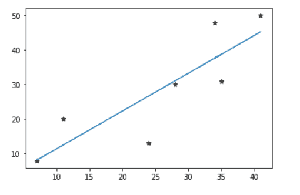
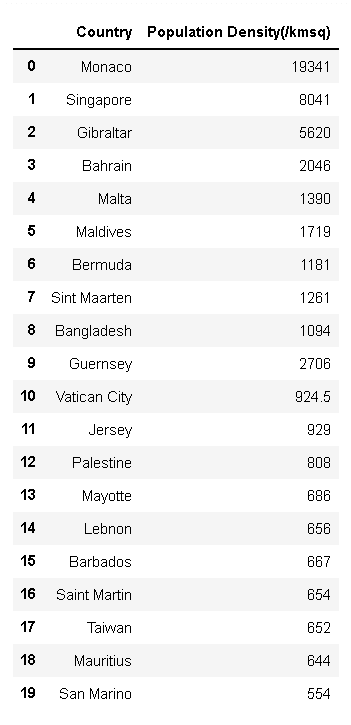
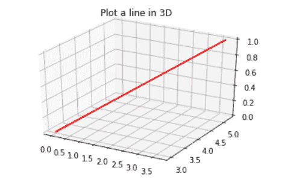

# Matplotlib 绘制一条线(详细指南)

> 原文：<https://pythonguides.com/matplotlib-plot-a-line/>

[](https://sharepointsky.teachable.com/p/python-and-machine-learning-training-course)

在本 [Python 教程](https://pythonguides.com/learn-python/)中，我们将讨论如何使用不同特性的 Python 中的 matplotlib**绘制折线图，我们还将涉及以下主题:**

*   Matplotlib 绘制折线图
*   Matplotlib plot line style
*   Matplotlib 绘图线粗细
*   Matplotlib plot line color
*   Matplotlib 在两点之间画一条线
*   Matplotlib 绘制一条水平线
*   Matplotlib 绘制一条垂直线
*   Matplotlib 绘制带标签的水平线
*   Matplotlib 在条形图上绘制水平线
*   Matplotlib 在日期绘制垂直线
*   Matplotlib 用文本绘制垂直线
*   Matplotlib 在直方图上绘制垂直线
*   Matplotlib 绘制线性函数
*   Matplotlib 在线图上绘制点
*   Matplotlib 散点图直线
*   Matplotlib 从数据帧绘制线图
*   Matplotlib 在 3D 中绘制直线

目录

[](#)

*   [Matplotlib 绘制折线图](#Matplotlib_plot_a_line_chart "Matplotlib plot a line chart")
*   [Matplotlib 地块线样式](#Matplotlib_plot_line_style "Matplotlib plot line style")
*   [Matplotlib 绘图线的粗细](#Matplotlib_plot_line_thickness "Matplotlib plot line thickness")
*   [Matplotlib 绘图线颜色](#Matplotlib_plot_line_color "Matplotlib plot line color")
*   [Matplotlib 在两点之间画一条线](#Matplotlib_plot_a_line_between_two_points "Matplotlib plot a line between two points")
*   [Matplotlib 绘制一条水平线](#Matplotlib_plot_a_horizontal_line "Matplotlib plot a horizontal line")
*   [Matplotlib 绘制一条垂直线](#Matplotlib_plot_a_vertical_line "Matplotlib plot a vertical line")
*   [Matplotlib 绘制带标签的水平线](#Matplotlib_plot_horizontal_line_with_label "Matplotlib plot horizontal line with label")
*   [Matplotlib 在条形图上绘制水平线](#Matplotlib_plot_horizontal_line_on_bar_graph "Matplotlib plot horizontal line on bar graph")
*   [Matplotlib 在日期](#Matplotlib_plot_vertical_line_at_date "Matplotlib plot vertical line at date")绘制垂直线
*   [Matplotlib 用文本绘制垂直线](#Matplotlib_plot_vertical_line_with_text "Matplotlib plot vertical line with text")
*   [Matplotlib 在直方图上绘制垂直线](#Matplotlib_plot_vertical_line_on_histogram "Matplotlib plot vertical line on histogram")
*   [Matplotlib 绘制一个线性函数](#Matplotlib_plot_a_linear_function "Matplotlib plot a linear function")
*   [Matplotlib 绘制线图上的点](#Matplotlib_plot_point_on_line_graph "Matplotlib plot point on line graph")
*   [Matplotlib 散点图直线](#Matplotlib_scatter_plot_straight_line "Matplotlib scatter plot straight line")
*   [Matplotlib 从数据帧中绘制线图](#Matplotlib_plot_line_graph_from_dataframe "Matplotlib plot line graph from dataframe")
*   [Matplotlib 在 3D 中绘制一条线](#Matplotlib_plot_a_line_in_3D "Matplotlib plot a line in 3D")

## Matplotlib 绘制折线图

Matplotlib 是 Python 中广泛使用的数据可视化库。它提供了各种绘图和数据可视化工具，可根据 python 中列表或数组中的数据创建 2D 图。Matplotlib 是一个构建在 `NumPy` 数组上的跨平台库。

您可以使用 `matplotlib` 库中的 `pyplot` 子模块在 python 中创建**折线图**。 `Pyplot` 为各种绘图提供相关函数的集合。折线图展示了 X-Y 笛卡尔平面上 X 轴和 Y 轴上两个量之间的关系。

您可以按照以下步骤创建折线图:

*   导入所需的库(来自 matplotlib 的 pyplot 用于可视化，numpy 用于数据创建和操作)。
*   定义必须可视化的数据值(定义 x 和 y)。
*   通过在绘图中添加所需的特征(绘图颜色、厚度、标签、注释等)来绘制数据。
*   显示曲线图(图形/图表)。

让我们用 python 画一条简单的线。因此，打开您的笔记本，而不是物理笔记本，打开 jupyter 笔记本，并遵循以下代码:

```py
# Importing packages
import matplotlib.pyplot as plt

# Define x and y values
x = [7, 14, 21, 28, 35, 42, 49]
y = [8, 13, 21, 30, 31, 44, 50]

# Plot a simple line chart without any feature
plt.plot(x, y)
plt.show()
```


Matplotlib plot a line chart

## Matplotlib 地块线样式

您可以使用 matplotlib 在 python 中更改折线图的线条样式。需要在 matplotlib 的 `plot()` 函数中指定参数 `linestyle` 。

python 中有几种可用的线条样式。你可以选择其中任何一个。您可以指定线条样式的名称或用引号括起来的符号。你可以搜索可用的线条样式，我已经给出了一些常用的线条样式的例子。

**例子:**

```py
# Importing packages
import matplotlib.pyplot as plt

# Define x and y values
x = [7, 14, 21, 28, 35, 42, 49]
y = [8, 13, 21, 30, 31, 44, 50]

# Plot a simple line chart with 'solid' linestyle
plt.plot(x, y, linestyle='-')
plt.show()

# Plot a simple line chart with 'dashed' linestyle
plt.plot(x, y, linestyle='dashed')  
# Or you can use: plt.plot(x, y, linestyle='--')
plt.show()

# Plot a simple line chart with 'dotted' linestyle
plt.plot(x, y, ':')
plt.show()

# Plot a simple line chart with 'dash_dot' linestyle
plt.plot(x, y, '-.')
plt.show()
```


Matplotlib plot line style

阅读:[如何安装 matplotlib](https://pythonguides.com/how-to-install-matplotlib-python/)

## Matplotlib 绘图线的粗细

您可以使用 matplotlib 在 python 中更改折线图的线条粗细。需要在 matplotlib 的 plot()函数中指定参数**线宽**。

**例子:**

```py
# Importing packages
import matplotlib.pyplot as plt

# Define x and y values
x = [7, 14, 21, 28, 35, 42, 49]
y = [8, 13, 21, 30, 31, 44, 50]

# Plot a simple line chart with linewidth 7
plt.plot(x, y, linewidth=7)
plt.show()

# Plot a simple line chart with 'dash_dot' linestyle and linewidth 3
plt.plot(x, y, '-.',linewidth=3)
plt.show()
```


Matplotlib plot line thickness

## Matplotlib 绘图线颜色

您可以使用 matplotlib 在 python 中更改折线图的线条颜色。需要在 matplotlib 的 plot()函数中指定参数 `color` 。

python 中有几种颜色可供选择。你可以选择其中任何一个。您可以指定颜色的名称或符号，也可以用引号将颜色的十六进制代码括起来。您可以搜索可用的颜色。

**例子:**

```py
# Importing packages
import matplotlib.pyplot as plt

# Define x and y values
x = [7, 14, 21, 28, 35, 42, 49]
y = [8, 13, 21, 30, 31, 44, 50]

# Plot a simple line chart with green as line color
plt.plot(x, y, ':', linewidth=7, color='green')
plt.show()

# Plot a simple line chart with red as line color
plt.plot(x, y, 'r', linestyle='--', linewidth=5)
plt.show()

# Plot a simple line chart with yellow as line color
plt.plot(x, y, 'y-.', linewidth=3)
plt.show()

# Plot a simple line chart with neon purple (Hexcode='#B026FF') as line color
plt.plot(x, y, color='#B026FF', linewidth=1)
plt.show()
```


Matplotlib plot line color

阅读:[什么是 Python Django](https://pythonguides.com/what-is-python-django/)

## Matplotlib 在两点之间画一条线

通过在 x 轴和 y 轴值列表中指定给定的两点，可以使用 matplotlib 在这两点之间绘制一条线。

**举例:**

```py
# Importing packages
import matplotlib.pyplot as plt

# Define x and y values
x = [7, 42]
y = [8, 44]

# Plot a simple line chart between two points (7, 8) and (42, 44)
plt.plot(x, y, linewidth=7, color='green')
plt.show()

# OR

# Plot a simple line chart between two points (2, 5) and (6, 10)
plt.plot([2, 6], [5, 10], 'r', linewidth=5)
plt.show()
```


Matplotlib plot a line between two points

## Matplotlib 绘制一条水平线

您可以在 matplotlib python 中绘制水平线，方法是使用 `plot()` 函数并给出与 y 轴值列表相同值的向量，或者使用 matplotlib.pyplot 的 `axhline()` 函数，该函数仅接受常量 y 值。

axhline()函数绘制的直线的范围仅从 0 到 1，而在 plot()函数中，您可以给出一个两个值的向量，将范围指定为 x 值列表。

**举例:**

```py
# Importing packages
import matplotlib.pyplot as plt

# Define x and y values
x = [7, 49]
y = [8, 8]

# Plot a horizontal line
plt.plot(x, y, 'y', linewidth=3)
plt.show()

# OR

# Plot a horizontal line using axhline() in pyplot
plt.axhline(y=8, xmin=0.1, xmax=0.8, color='r', linestyle='-.', linewidth=3)
plt.show()
```


Matplotlib plot a horizontal line

## Matplotlib 绘制一条垂直线

您可以在 matplotlib python 中绘制一条垂直线，方法是使用 `plot()` 函数并给出一个与 y 轴值列表相同值的向量，或者使用 matplotlib.pyplot 的 `axvline()` 函数，该函数只接受常量 x 值。

也可以使用 matplotlib 的 `vlines()` 函数。pyplot，我们将在后面讨论。由 axvline()函数绘制的直线的范围仅从 0 到 1，而在 plot()函数中，您可以给出一个两个值的向量，将范围指定为 y 轴值列表。

**举例:**

```py
# Importing packages
import matplotlib.pyplot as plt

# Define x and y values
x = [8, 8]
y = [7, 49]

# Plot a vertical line
plt.plot(x, y, 'b', linewidth=3)
plt.show()

# OR

# Plot a vertical line using axvline() in pyplot
plt.axvline(x=8, ymin=0.1, ymax=0.8, color='g', linestyle=':', linewidth=3)
plt.show()
```


Matplotlib plot a vertical line

使用 Tkinter 阅读 Python 中的[注册表](https://pythonguides.com/registration-form-in-python-using-tkinter/)

## Matplotlib 绘制带标签的水平线

通过在 plot()函数中添加一个 `label` 参数，可以为 matplotlib python 中的任何绘图指定标签，在该函数中可以指定任何用引号括起来的字符串。

**举例:**

```py
# Importing packages
import matplotlib.pyplot as plt

# Define x and y values
x = [7, 49]
y1 = [3, 3]
y2 = [8, 8]

# Plot a horizontal line
plt.plot(x, y1, '-r', linewidth=3, label='red line')
plt.plot(x, y2, '-b', linewidth=3, label='blue line')
plt.legend()
plt.show()

# OR

# Plot a horizontal line using axhline() in pyplot
plt.axhline(y=3, xmin=0.1, xmax=0.8, color='r', linestyle='-.', linewidth=3, label='red line')
plt.axhline(y=8, xmin=0.1, xmax=0.8, color='b', linestyle='-.', linewidth=3, label='blue line')
plt.legend()
plt.show()
```


Matplotlib plot horizontal line with a label

## Matplotlib 在条形图上绘制水平线

通过在保存/显示图形之前指定多个绘图语句，可以在 matplotlib python 中的另一个绘图上绘制任何类型的绘图。同样，你可以在条形图上画一条水平线。我们来做一个有趣的例子。

**举例:**

```py
# Importing packages
import matplotlib.pyplot as plt
import numpy as np

# Define x values and heights for the bar chart
heights = np.array([7.0, 28.0, 14.0, 35.0, 42.0, 21.0, 49.0])
x = range(len(heights))

# y value from where the horizontal line has to be drawn
y_val = 24.0

# we are splitting the heights to create a stacked bar graph by the y_val
upper_bars = np.maximum(heights - y_val, 0)
lower_bars = np.minimum(heights, y_val)

# Plotting the stacked bar graph
plt.bar(x, lower_bars, width=0.5, color='y')
plt.bar(x, upper_bars, width=0.5, color='r', bottom=lower_bars)

# Plotting the horizontal line to divide through the y_val
plt.axhline(y=y_val, color='b', linestyle=':', label='red line')

plt.show()
```


Matplotlib plot horizontal line on the bar graph

阅读:[从 PDF Python 中提取文本](https://pythonguides.com/extract-text-from-pdf-python/)

## Matplotlib 在日期绘制垂直线

您可以添加日期作为**标签**，并可以在 matplotlib python 中绘制日期的垂直线。您需要从 python 中的 `datetime` 模块导入`datetime`函数来创建日期格式的值。

您需要来自 `matplotlib.dates` 的 `mdates` 子模块来格式化绘图的日期。你可以按照下面给出的简单例子来理解做这件事的方法。

**举例:**

```py
# Importing packages
import matplotlib.pyplot as plt
import numpy as np
import matplotlib.dates as mdates
from datetime import datetime

fig, ax = plt.subplots()
dates = np.array([datetime(2020,1,1), datetime(2020,6,30), datetime(2021,1,1)])
dates = mdates.date2num(dates)

ax.xaxis.set_major_formatter(mdates.DateFormatter('%d.%m.%y'))
ax.xaxis.set_major_locator(mdates.YearLocator())

plt.vlines(x=dates, ymin=0, ymax=10, color = 'g')

plt.show()
```


Matplotlib plot vertical line at the date

## Matplotlib 用文本绘制垂直线

您也可以将文本添加到图中的任何给定位置。您需要使用来自 `matplotlib.pyplot` 的 `text()` 函数，在这里您必须指定要添加的文本，以及绘图的 X-Y 平面上的 X 和 Y 位置。

在下面的例子中，我使用了一个循环，将文本反复添加到上一个主题的例子中绘制的所有垂直线中。

**举例:**

```py
# Importing packages
import matplotlib.pyplot as plt
import numpy as np
import matplotlib.dates as mdates
from datetime import datetime

fig, ax = plt.subplots()
dates = np.array([datetime(2020,1,1), datetime(2020,6,30), datetime(2021,1,1)])
dates = mdates.date2num(dates)

ax.xaxis.set_major_formatter(mdates.DateFormatter('%d.%m.%y'))
ax.xaxis.set_major_locator(mdates.YearLocator())

plt.vlines(x=dates, ymin=0, ymax=10, color = 'r', linewidth=2)

for i, x in enumerate(dates):
    text((x+5), 5, "Interval %d" % (i+1), rotation=90, verticalalignment='center')

plt.show()
```


Matplotlib plot vertical line with text

## Matplotlib 在直方图上绘制垂直线

通过在保存/显示图形之前指定多个绘图语句，可以在 matplotlib python 中的直方图上绘制垂直线。同样，我们在以前的主题中已经讨论过。让我们做一个有趣的例子来理解对这类图形的需求。

**举例:**

```py
# Importing packages
import matplotlib.pyplot as plt
import numpy as np

# Generating a random seed
np.random.seed(1)

# A sample is drawn from a Gamma distribution with shape 3, scale 0.7 and size 500
x = np.random.gamma(3, 0.7, 500)

# Plot a histogram for the sample data created
plt.hist(x, bins=30, color='y', edgecolor='r', alpha=0.70)

# Plot a vertical line at the mean of the sample data
plt.axvline(x.mean(), color='b', linestyle=':', linewidth=2)

plt.show()
```


Matplotlib plot vertical line on the histogram

阅读: [Python Tkinter 标题](https://pythonguides.com/python-tkinter-title/)

## Matplotlib 绘制一个线性函数

线性函数代表图上的一条直线。你可以使用直线的**斜率截距**形式，即 y = m * x+c；这里，X 和 Y 分别是 X 轴和 Y 轴变量，m 是直线的斜率，c 是直线的 X 截距。

您可以通过填充其中一个变量列表(x 或 y)的数据，使用线性函数公式计算另一个变量，并绘制生成的数据点来可视化该函数。

**举例:**

```py
# Importing packages
import matplotlib.pyplot as plt
import numpy as np

# Creating a sample data for x-values
x = np.arange(2, 300, 4)

# Provide parameters of the linear function
m, c = 0.4, 1.6

# Calculating the y-values for all the x'-values
y = (m * x) + c

# Plotting the line created by the linear function
plt.plot(x, y, 'c', linewidth=2, label='y=m*x+c')
plt.title('Linear Function (y=m*x+c) plot')
plt.xlabel('x-values')
plt.ylabel('y-values')
plt.legend()
plt.show()
```


Matplotlib plot a linear function

## Matplotlib 绘制线图上的点

通过在 `plot()` 函数中添加**标记器**参数，可以在 matplotlib python 中标记线图上的点。您可以指定 python 中可用的任何标记类型。

**举例:**

```py
# Importing packages
import matplotlib.pyplot as plt

# Define x and y values
x = [7, 14, 21, 28, 35, 42, 49]
y = [8, 13, 21, 30, 31, 44, 50]

# Plot points on the line chart
plt.plot(x, y, 'o--y', linewidth=2)
# Or plt.plot(x, y, marker='o', linestyle='--', color='y', linewidth=2)
plt.show()
```


Matplotlib plot point on a line graph

## Matplotlib 散点图直线

您可以在散点图上绘制一条直线，或者使用 python 的 `numpy` 模块中的函数 `polyfit()` 在 matplotlib python 中绘制一条与给定的分散数据点很好拟合的直线(线性回归线)，该函数是一个接受数据点(x 轴和 y 轴数据)的通用**最小二乘多项式拟合**函数和一个任意次的多项式函数，在我们的示例中，次数为 1(线性)。

它返回给定数据的最佳拟合线的参数(斜率和截距)数组。然后，您可以用得到的参数绘制这条线。

**举例:**

```py
# Importing packages
import matplotlib.pyplot as plt
import numpy as np

# Define x and y values
x = np.array([7, 11, 24, 28, 35, 34, 41])
y = np.array([8, 20, 13, 30, 31, 48, 50])

# Drawn a simple scatter plot for the data given
plt.scatter(x, y, marker='*', color='k')

# Generating the parameters of the best fit line
m, c = np.polyfit(x, y, 1)

# Plotting the straight line by using the generated parameters
plt.plot(x, m*x+c)

plt.show()
```



Matplotlib scatter plot straight line

阅读: [Matplotlib 绘图条形图](https://pythonguides.com/matplotlib-plot-bar-chart/)

## Matplotlib 从数据帧中绘制线图

您可以使用 python 中的 `matplotlib.pyplot.plot()` 函数或 `dataframe.plot()` 函数从数据帧中绘制图形。我们已经讨论了第一个函数。

后一个函数与第一个类似，只是有一点不同，您需要在函数中将列指定为 x 轴值和 y 轴值。

```py
import pandas as pd

# Let's create a Dataframe using lists
countries = ['Monaco', 'Singapore', 'Gibraltar', 'Bahrain', 'Malta',
             'Maldives', 'Bermuda', 'Sint Maarten', 'Bangladesh', 
             'Guernsey', 'Vatican City', 'Jersey', 'Palestine', 
           'Mayotte', 'Lebnon',
             'Barbados', 'Saint Martin', 'Taiwan', 'Mauritius', 'San Marino']
pop_density = ['19341', '8041', '5620', '2046', '1390',
               '1719', '1181', '1261', '1094', '2706',
               '924.5', '929', '808', '686', '656',
               '667', '654', '652', '644', '554']

# Now, create a pandas dataframe using above lists
df_pop_density = pd.DataFrame(
    {'Country' : countries, 'Population Density(/kmsq)' : pop_density})

df_pop_density
```



Matplotlib create dataframe

```py
import matplotlib.pyplot as plt

# Plotting the data from the dataframe created using matplotlib
plt.figure(figsize=(9, 5))
plt.title('Countries with higher population density (per km sq)')
plt.plot(df_pop_density['Country'], df_pop_density['Population Density(/kmsq)'], '-b', linewidth=2)
# OR : df_pop_density(x='Country', y='Population Density(/kmsq)', '-b', linewidth=2)
plt.xticks(rotation=60)
plt.xlabel('Countries')
plt.ylabel('Population Density')
plt.show()
```


Matplotlib plot line graph from dataframe

阅读:[什么是 matplotlib 内联](https://pythonguides.com/what-is-matplotlib-inline/)

## Matplotlib 在 3D 中绘制一条线

通过从模块 `mpl_toolkits` 导入 `mplot3d` ，可以在 matplotlib python 中绘制 3D 线，该模块是 python 中 matplotlib 的外部工具包，用于绘制几何代数的多向量。我们做一个简单的例子来理解一下。

**举例:**

```py
# Importing packages
import matplotlib.pyplot as plt
import numpy as np
from mpl_toolkits import mplot3d

# Setting 3 axes for the graph
plt.axes(projection='3d')

# Define the z, y, x data
z = np.linspace(0, 1, 100)
x = 3.7 * z
y = 0.6 * x + 3

# Plotting the line
plt.plot(x, y, z, 'r', linewidth=2)
plt.title('Plot a line in 3D')
plt.show()
```



Matplotlib plot a line in 3D

您可能还想阅读以下文章:

*   [Python 绘制多条线](https://pythonguides.com/python-plot-multiple-lines/)
*   [Matplotlib 改变背景颜色](https://pythonguides.com/matplotlib-change-background-color/)
*   [Matplotlib 旋转刻度标签](https://pythonguides.com/matplotlib-rotate-tick-labels/)
*   [Matplotlib 移除刻度标签](https://pythonguides.com/matplotlib-remove-tick-labels/)

在本 Python 教程中，我们讨论了如何在 Python 中使用具有不同功能的 matplotlib 来**绘制折线图，我们还讨论了以下主题:**

*   Matplotlib plot line style
*   Matplotlib 绘图线粗细
*   Matplotlib plot line color
*   Matplotlib 在两点之间画一条线
*   Matplotlib 绘制一条水平线
*   Matplotlib 绘制一条垂直线
*   Matplotlib 绘制带标签的水平线
*   Matplotlib 在条形图上绘制水平线
*   Matplotlib 在日期绘制垂直线
*   Matplotlib 用文本绘制垂直线
*   Matplotlib 在直方图上绘制垂直线
*   Matplotlib 绘制线性函数
*   Matplotlib 在线图上绘制点
*   Matplotlib 散点图直线
*   Matplotlib 从数据帧绘制线图
*   Matplotlib 在 3D 中绘制直线

[Bijay Kumar](https://pythonguides.com/author/fewlines4biju/)

Python 是美国最流行的语言之一。我从事 Python 工作已经有很长时间了，我在与 Tkinter、Pandas、NumPy、Turtle、Django、Matplotlib、Tensorflow、Scipy、Scikit-Learn 等各种库合作方面拥有专业知识。我有与美国、加拿大、英国、澳大利亚、新西兰等国家的各种客户合作的经验。查看我的个人资料。

[enjoysharepoint.com/](https://enjoysharepoint.com/)[](https://www.facebook.com/fewlines4biju "Facebook")[](https://www.linkedin.com/in/fewlines4biju/ "Linkedin")[](https://twitter.com/fewlines4biju "Twitter")